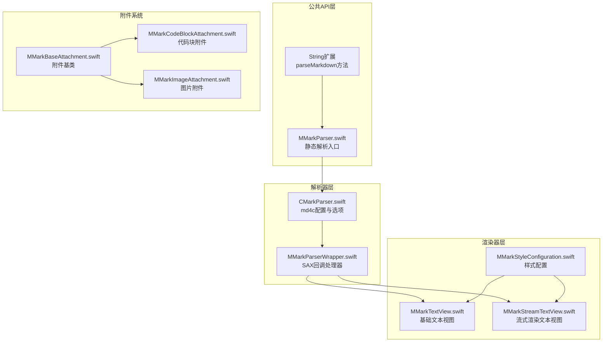
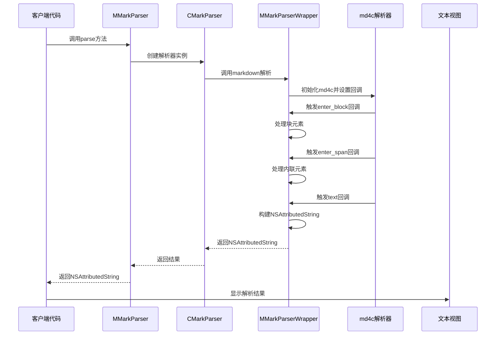
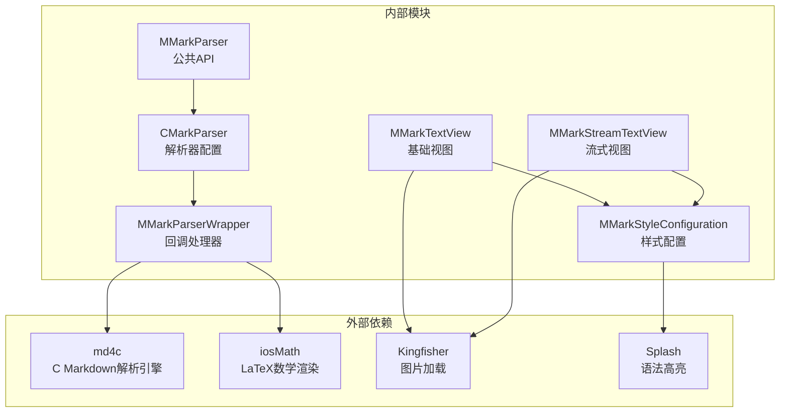

# API参考文档

<cite>
**本文档引用的文件**
- [MMarkParser.swift](file://MMarkParser/Sources/MMarkParser.swift)
- [CMarkParser.swift](file://MMarkParser/Sources/Parser/CMarkParser.swift)
- [MMarkParserWrapper.swift](file://MMarkParser/Sources/Parser/MMarkParserWrapper.swift)
- [MMarkTextView.swift](file://MMarkParser/Sources/Renderer/MMarkTextView.swift)
- [MMarkStreamTextView.swift](file://MMarkParser/Sources/Renderer/MMarkStreamTextView.swift)
- [MMarkStyleConfiguration.swift](file://MMarkParser/Sources/Renderer/MMarkStyleConfiguration.swift)
- [MMarkTextCommon.swift](file://MMarkParser/Sources/Renderer/MMarkTextCommon.swift)
- [MMarkBaseAttachment.swift](file://MMarkParser/Sources/Renderer/Attachments/MMarkBaseAttachment/MMarkBaseAttachment.swift)
- [MMarkCodeBlockAttachment.swift](file://MMarkParser/Sources/Renderer/Attachments/MMarkCodeBlockAttachment/MMarkCodeBlockAttachment.swift)
- [MMarkImageAttachment.swift](file://MMarkParser/Sources/Renderer/Attachments/MMarkImageAttachment/MMarkImageAttachment.swift)
- [README.md](file://README.md)
</cite>

## 目录
1. [简介](#简介)
2. [项目结构](#项目结构)
3. [核心组件](#核心组件)
4. [架构概览](#架构概览)
5. [详细组件分析](#详细组件分析)
6. [依赖关系分析](#依赖关系分析)
7. [性能考虑](#性能考虑)
8. [故障排除指南](#故障排除指南)
9. [结论](#结论)

## 简介

MMarkParser是一个基于iOS 15+的Markdown解析和渲染库，专为现代iOS应用设计。该库提供了完整的GitHub Flavored Markdown (GFM)支持，包括表格、任务列表、自动链接、删除线等高级功能，并集成了LaTeX数学公式渲染、语法高亮、脚注等功能。

该库的核心优势在于：
- **TextKit 2集成**：充分利用iOS 15+的新布局引擎
- **模块化设计**：清晰的解析器、渲染器分离架构
- **完全可定制**：通过MMarkStyleConfiguration实现全面的样式控制
- **高性能**：基于md4c的SAX回调模型，实时构建NSAttributedString

## 项目结构

**图表来源**
- [MMarkParser.swift:1-42](file://MMarkParser/Sources/MMarkParser.swift#L1-L42)
- [CMarkParser.swift:1-81](file://MMarkParser/Sources/Parser/CMarkParser.swift#L1-L81)
- [MMarkTextView.swift:1-81](file://MMarkParser/Sources/Renderer/MMarkTextView.swift#L1-L81)

**章节来源**
- [README.md:108-212](file://README.md#L108-L212)

## 核心组件

### MMarkParser - 静态解析入口

MMarkParser是库的公共API入口点，提供简洁的静态方法接口。

#### 主要方法

**静态属性**
- `defaultStyle: MMarkStyleConfiguration` - 返回默认的GFM样式配置

**静态方法**
- `parse(markdown: String, configuration: MMarkStyleConfiguration = .defaultStyle, containerWidth: CGFloat) throws -> NSAttributedString`
  - **参数**:
    - `markdown`: Markdown源文本
    - `configuration`: 样式配置，默认使用`.defaultStyle`
    - `containerWidth`: 文本可用宽度，用于布局计算
  - **返回**: 完全样式的NSAttributedString，可直接显示
  - **异常**: ParseError（解析失败时抛出）

**章节来源**
- [MMarkParser.swift:5-27](file://MMarkParser/Sources/MMarkParser.swift#L5-L27)

### String扩展 - 方便的字符串解析

为String类型提供便捷的Markdown解析扩展。

#### 方法
- `parseMarkdown(configuration: MMarkStyleConfiguration = .defaultStyle, containerWidth: CGFloat) -> NSAttributedString`
  - **参数**: 同MMarkParser.parse方法
  - **返回**: 解析后的NSAttributedString
  - **行为**: 内部调用MMarkParser.parse，失败时返回原始字符串的NSAttributedString

**章节来源**
- [MMarkParser.swift:31-41](file://MMarkParser/Sources/MMarkParser.swift#L31-L41)

### CMarkParser - 解析器配置

CMarkParser是底层解析器，负责配置md4c选项和执行实际的解析过程。

#### 错误类型
- `ParseError`: 解析过程中可能遇到的错误
  - `invalidInput`: 输入无效
  - `parsingFailed`: 解析失败
  - `styleConversionFailed`: 样式转换失败

#### 解析选项 (ParseOptions)
- `default`: 默认选项
- `table`: 启用GFM表格支持
- `strikethrough`: 启用GFM删除线
- `taskLists`: 启用GFM任务列表
- `autolinks`: 启用GFM自动链接（URL、邮箱、www）
- `latexMath`: 启用LaTeX数学公式（$...$、$$...$$）
- `footnotes`: 启用GFM脚注（来自md4c分支）
- `hardBreaks`: 启用硬换行
- `gfm`: 所有与md4c兼容的GFM扩展组合

#### 主要方法
- `init(options: ParseOptions = .gfm)`: 初始化解析器
- `parse(_ markdown: String, configuration: MMarkStyleConfiguration = .defaultStyle, containerWidth: CGFloat) throws -> NSAttributedString`

**章节来源**
- [CMarkParser.swift:7-67](file://MMarkParser/Sources/Parser/CMarkParser.swift#L7-L67)

## 架构概览

**图表来源**
- [MMarkParser.swift:18-26](file://MMarkParser/Sources/MMarkParser.swift#L18-L26)
- [CMarkParser.swift:55-66](file://MMarkParser/Sources/Parser/CMarkParser.swift#L55-L66)
- [MMarkParserWrapper.swift:16-100](file://MMarkParser/Sources/Parser/MMarkParserWrapper.swift#L16-L100)

## 详细组件分析

### MMarkTextView - 基础文本视图

MMarkTextView是继承自UITextView的自定义视图，专门用于显示Markdown内容。

#### 公共属性
- `styleConfiguration: MMarkStyleConfiguration = .defaultStyle` - 应用的样式配置
- `mmarkLinkDelegate: MMarkLinkDelegate?` - 链接点击委托

#### 公共方法
- `setMarkdown(_ markdown: String)`: 设置并显示Markdown内容
  - **参数**: markdown - Markdown源文本
  - **行为**: 自动解析并显示，包含错误处理

#### 生命周期管理
- `contentSize`属性观察器: 监听内容尺寸变化，在TextKit 2布局完成后自动更新引用块竖条

#### 链接处理
- 实现UITextViewDelegate协议，处理内部链接、脚注引用和锚点跳转
- 支持外部委托接管链接处理

**章节来源**
- [MMarkTextView.swift:6-62](file://MMarkParser/Sources/Renderer/MMarkTextView.swift#L6-L62)

### MMarkStreamTextView - 流式渲染文本视图

MMarkStreamTextView提供渐进式Markdown渲染功能，适合长文档的流畅显示。

#### 流式状态
- `idle`: 空闲状态
- `streaming`: 正在流式渲染
- `paused`: 暂停状态
- `stopped`: 已停止

#### 配置属性
- `typingSpeed: TimeInterval = 0.03`: 渲染速度（秒/字符）
- `chunkSize: Int = 3`: 每次渲染的字符数量
- `autoScrollToBottom: Bool = true`: 是否自动滚动到底部
- `styleConfiguration: MMarkStyleConfiguration = .defaultStyle` - 样式配置
- `streamDelegate: MMarkStreamDelegate?` - 流式渲染委托
- `mmarkLinkDelegate: MMarkLinkDelegate?` - 链接委托

#### 流式API
- `startStreaming(markdown: String)`: 开始流式渲染
- `appendStreamContent(_ text: String)`: 追加内容到流式渲染
- `pauseStreaming()`: 暂停流式渲染
- `resumeStreaming()`: 恢复流式渲染
- `stopStreaming()`: 停止流式渲染
- `renderComplete(_ markdown: String)`: 完成渲染（立即显示）
- `resetStreaming()`: 重置流式渲染状态

#### 自动滚动
- `scrollToBottom(animated: Bool = false)`: 滚动到内容底部
- `checkAndAutoScroll()`: 检查并自动滚动到最新内容

**章节来源**
- [MMarkStreamTextView.swift:21-398](file://MMarkParser/Sources/Renderer/MMarkStreamTextView.swift#L21-L398)

### MMarkStyleConfiguration - 样式配置

MMarkStyleConfiguration提供完整的Markdown元素样式控制。

#### 核心样式结构

**HeadingStyle (标题样式)**
- `font: UIFont` - 标题字体
- `textColor: UIColor` - 标题颜色

**CodeStyle (代码样式)**
- `font: UIFont` - 代码字体
- `textColor: UIColor` - 代码文本颜色
- `backgroundColor: UIColor` - 代码背景颜色

**LinkStyle (链接样式)**
- `textColor: UIColor` - 链接颜色
- `underlineStyle: NSUnderlineStyle` - 下划线样式

**列表样式**

**OrderedListStyle (有序列表样式)**
- `mode: ListMarkerMode` - 渲染模式（字符/图片）
- `font: UIFont` - 字体
- `textColor: UIColor` - 颜色
- `image: UIImage?` - 图标图片
- `imageSize: CGSize` - 图标尺寸

**UnorderedListStyle (无序列表样式)**
- `mode: ListMarkerMode` - 渲染模式
- `font: UIFont` - 字体
- `textColor: UIColor` - 颜色
- `image: UIImage?` - 一级列表图标
- `secondaryImage: UIImage?` - 二级及以上列表图标
- `imageSize: CGSize` - 图标尺寸

**TaskListStyle (任务列表样式)**
- `mode: ListMarkerMode` - 渲染模式
- `checkedColor: UIColor` - 已完成状态颜色
- `uncheckedColor: UIColor` - 未完成状态颜色
- `checkedFont: UIFont` - 已完成状态字体
- `uncheckedFont: UIFont` - 未完成状态字体
- `checkedImage: UIImage?` - 已完成状态图标
- `uncheckedImage: UIImage?` - 未完成状态图标
- `imageSize: CGSize` - 图标尺寸

**TableStyle (表格样式)**
- `headerBackgroundColor: UIColor` - 表头背景色
- `borderColor: UIColor` - 边框颜色
- `borderWidth: CGFloat` - 边框宽度
- `cornerRadius: CGFloat` - 圆角半径

#### 核心配置项

**标题配置**
- `headingStyles: [Int: HeadingStyle]` - H1-H6各级标题样式
- `headingSpacingBefore: [Int: CGFloat]` - 标题上间距
- `headingSpacing: [Int: CGFloat]` - 标题下间距
- `paragraphStyle: HeadingStyle` - 段落样式

**代码块配置**
- `codeStyle: CodeStyle` - 行内代码样式
- `codeBlockStyle: CodeStyle` - 代码块样式
- `codeBlockHeaderBackgroundColor: UIColor` - 代码块头部背景色
- `codeBlockBodyBackgroundColor: UIColor` - 代码块主体背景色
- `codeBlockCornerRadius: CGFloat` - 代码块圆角
- `codeBlockHeaderHeight: CGFloat` - 代码块头部高度
- `codeBlockPadding: CGFloat` - 代码块内边距

**链接配置**
- `linkStyle: LinkStyle` - 链接样式

**删除线配置**
- `strikethroughColor: UIColor` - 删除线颜色

**引用块配置**
- `blockquoteColor: UIColor` - 引用块文本颜色
- `blockquoteBackgroundColor: UIColor` - 引用块背景色
- `blockquoteBorderWidth: CGFloat` - 引用块左边框宽度
- `blockquoteBorderColor: UIColor` - 引用块左边框颜色

**图片配置**
- `imagePlaceholderColor: UIColor` - 图片占位符颜色

**数学公式配置**
- `mathInlineStyle: CodeStyle` - 行内数学公式样式
- `mathBlockStyle: CodeStyle` - 块级数学公式样式
- `mathBlockBackgroundColor: UIColor` - 数学公式块背景色
- `mathBlockCornerRadius: CGFloat` - 数学公式块圆角
- `mathDisplayFont: MTFont?` - 数学公式显示字体

**脚注配置**
- `footnoteReferenceStyle: CodeStyle` - 脚注引用样式
- `footnoteStyle: HeadingStyle` - 脚注定义样式
- `footnoteBackrefColor: UIColor` - 脚注回链颜色

#### 默认样式
- 提供完整的GFM默认样式配置
- 包含标题、代码、链接、列表、表格、数学公式等所有元素的默认样式

**章节来源**
- [MMarkStyleConfiguration.swift:11-339](file://MMarkParser/Sources/Renderer/MMarkStyleConfiguration.swift#L11-L339)

### 附件系统

#### MMarkBaseAttachment - 附件基类

MMarkBaseAttachment是所有附件类型的基类，提供统一的附件接口。

**枚举类型**
- `codeBlock`: 代码块
- `horizontalRule`: 水平分割线
- `image`: 图片
- `listMarker`: 列表标记
- `mathBlock`: 数学公式块
- `table`: 表格

**主要属性**
- `attachmentType: MMarkAttachmentType` - 附件类型
- `contentModel: MMarkBaseModel` - 内容模型
- `viewProvider: NSTextAttachmentViewProvider?` - 视图提供者

**视图提供者**
- 根据附件类型动态创建对应的视图提供者
- 支持延迟视图创建，提高性能

**章节来源**
- [MMarkBaseAttachment.swift:3-59](file://MMarkParser/Sources/Renderer/Attachments/MMarkBaseAttachment/MMarkBaseAttachment.swift#L3-L59)

#### MMarkCodeBlockAttachment - 代码块附件

专门用于渲染代码块的附件类型。

**主要特性**
- 支持语法高亮
- 自适应宽度布局
- 代码块头部显示语言信息

**布局方法**
- `attachmentBounds(for:proposedLineFragment:glyphPosition:characterIndex:)` - 计算附件边界

**章节来源**
- [MMarkCodeBlockAttachment.swift:6-22](file://MMarkParser/Sources/Renderer/Attachments/MMarkCodeBlockAttachment/MMarkCodeBlockAttachment.swift#L6-L22)

#### MMarkImageAttachment - 图片附件

用于渲染Markdown中的图片。

**主要特性**
- 支持远程图片加载（通过Kingfisher集成）
- 自适应图片尺寸
- 占位符显示

**属性**
- `url: String` - 图片URL
- `alt: String` - 替代文本

**布局方法**
- `attachmentBounds(for:proposedLineFragment:glyphPosition:characterIndex:)` - 计算图片边界

**章节来源**
- [MMarkImageAttachment.swift:5-23](file://MMarkParser/Sources/Renderer/Attachments/MMarkImageAttachment/MMarkImageAttachment.swift#L5-L23)

### 共享组件

#### MMarkTextCommon - 文本组件共享

提供MMarkTextView和MMarkStreamTextView的共享功能。

**协议定义**
- `MMarkLinkDelegate`: 链接处理委托协议
- `MMarkTextComponent`: 文本组件协议

**共享功能**
- `registerCommonViewProviders()`: 注册自定义附件视图提供者
- `handleCommonLink(_:in:)`: 处理通用链接（脚注、锚点）
- `renderBlockquoteBars(isUpdating:)`: 渲染引用块侧边条

**章节来源**
- [MMarkTextCommon.swift:39-290](file://MMarkParser/Sources/Renderer/MMarkTextCommon.swift#L39-L290)

## 依赖关系分析

**图表来源**
- [README.md:36-40](file://README.md#L36-L40)

### 关键依赖关系

1. **md4c**: 核心Markdown解析引擎，提供SAX回调接口
2. **iosMath**: LaTeX数学公式渲染支持
3. **Kingfisher**: 远程图片加载和缓存
4. **Splash**: Swift语法高亮引擎

### 组件耦合度

- **低耦合**: 解析器和渲染器通过NSAttributedString解耦
- **高内聚**: 每个组件专注于特定功能领域
- **清晰边界**: 公共API、解析器、渲染器各司其职

**章节来源**
- [README.md:22-26](file://README.md#L22-L26)

## 性能考虑

### 解析性能

1. **SAX回调模型**: 基于回调的增量解析，避免AST树构建的内存开销
2. **属性栈管理**: 使用栈结构高效管理嵌套元素的样式上下文
3. **延迟视图创建**: 附件视图按需创建，减少初始化成本

### 渲染性能

1. **TextKit 2优化**: 利用iOS 15+的新布局引擎，提供更好的性能
2. **流式渲染**: MMarkStreamTextView支持渐进式渲染，提升用户体验
3. **引用块绘制**: 使用Core Graphics直接绘制，避免子视图管理开销

### 内存管理

1. **弱引用委托**: 避免循环引用
2. **及时释放**: 定时器和队列在适当时候清理
3. **增量更新**: 流式渲染只更新变化的部分

## 故障排除指南

### 常见问题

**1. 解析错误处理**
- `ParseError.invalidInput`: 检查输入字符串是否为空或格式错误
- `ParseError.parsingFailed`: 验证Markdown语法正确性
- `ParseError.styleConversionFailed`: 检查样式配置的有效性

**2. 样式配置问题**
- 确保字体存在且可加载
- 检查颜色值的有效性
- 验证图片资源的可用性

**3. 性能问题**
- 对于大文档，考虑使用流式渲染
- 合理设置`typingSpeed`和`chunkSize`
- 避免频繁的样式配置更改

**章节来源**
- [CMarkParser.swift:8-12](file://MMarkParser/Sources/Parser/CMarkParser.swift#L8-L12)

### 调试技巧

1. **启用日志**: 在开发环境中输出解析状态
2. **逐步验证**: 分别测试解析和渲染功能
3. **性能监控**: 使用Instruments监控内存和CPU使用

## 结论

MMarkParser提供了iOS平台上功能最完整的Markdown解析解决方案。其设计特点包括：

1. **现代化架构**: 基于TextKit 2和SAX回调模型
2. **完全可定制**: 通过MMarkStyleConfiguration实现全面的样式控制
3. **高性能实现**: 优化的内存管理和渲染策略
4. **丰富的功能**: 完整的GFM支持和高级特性

该库适合需要高质量Markdown渲染的iOS应用，特别是需要复杂样式定制和高性能渲染的场景。通过合理的配置和使用，可以轻松实现专业的Markdown阅读体验。