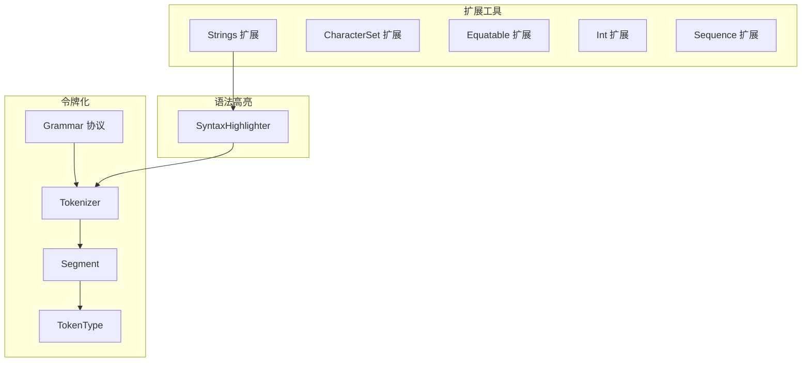
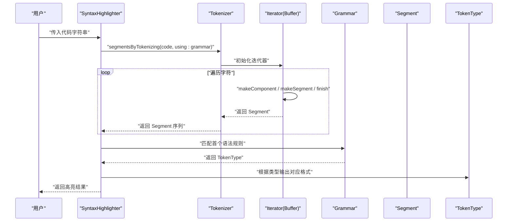
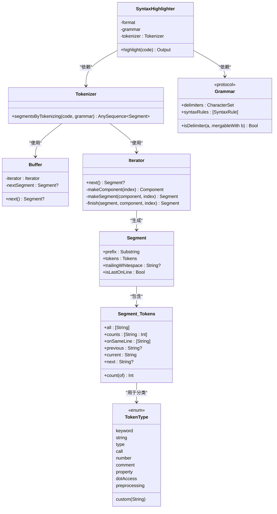
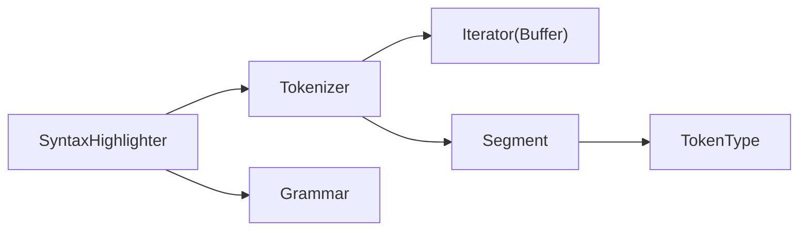

# 扩展工具API

<cite>
**本文引用的文件**
- [String+HTMLEntities.swift](file://MMarkParser/Sources/Splash/Extensions/Strings/String+HTMLEntities.swift)
- [String+IsNumber.swift](file://MMarkParser/Sources/Splash/Extensions/Strings/String+IsNumber.swift)
- [String+PrefixChecking.swift](file://MMarkParser/Sources/Splash/Extensions/Strings/String+PrefixChecking.swift)
- [String+Removing.swift](file://MMarkParser/Sources/Splash/Extensions/Strings/String+Removing.swift)
- [Substring+HasSuffix.swift](file://MMarkParser/Sources/Splash/Extensions/Strings/Substring+HasSuffix.swift)
- [Tokenizer.swift](file://MMarkParser/Sources/Splash/Tokenizing/Tokenizer.swift)
- [Segment.swift](file://MMarkParser/Sources/Splash/Tokenizing/Segment.swift)
- [TokenType.swift](file://MMarkParser/Sources/Splash/Tokenizing/TokenType.swift)
- [Grammar.swift](file://MMarkParser/Sources/Splash/Grammar/Grammar.swift)
- [SyntaxHighlighter.swift](file://MMarkParser/Sources/Splash/Syntax/SyntaxHighlighter.swift)
- [CharacterSet+Contains.swift](file://MMarkParser/Sources/Splash/Extensions/CharacterSet/CharacterSet+Contains.swift)
- [Equatable+AnyOf.swift](file://MMarkParser/Sources/Splash/Extensions/Equatable/Equatable+AnyOf.swift)
- [Int+IsOdd.swift](file://MMarkParser/Sources/Splash/Extensions/Int/Int+IsOdd.swift)
- [Sequence+AnyOf.swift](file://MMarkParser/Sources/Splash/Extensions/Sequence/Sequence+AnyOf.swift)
- [Sequence+Occurrences.swift](file://MMarkParser/Sources/Splash/Extensions/Sequence/Sequence+Occurrences.swift)
</cite>

## 目录
1. [简介](#简介)
2. [项目结构](#项目结构)
3. [核心组件](#核心组件)
4. [架构总览](#架构总览)
5. [详细组件分析](#详细组件分析)
6. [依赖分析](#依赖分析)
7. [性能考虑](#性能考虑)
8. [故障排查指南](#故障排查指南)
9. [结论](#结论)
10. [附录](#附录)

## 简介
本文件为 MMarkParser 的扩展工具模块提供 API 参考与使用说明，覆盖以下方面：
- 字符串扩展：HTML 实体转义、数字判断、首字母大小写与首字符检查、子串移除、Linux 平台 Substring 后缀判断等
- 令牌化系统：Tokenizer 的分段与迭代机制、Segment 的上下文信息、TokenType 的类型定义、Grammar 的语法规则与合并策略
- 其他实用扩展：字符集包含判断、等值比较候选集合、奇偶性判断、序列成员与出现次数查询
- 使用示例与最佳实践：如何在 Markdown 渲染前进行安全转义，如何基于语法规则进行语法高亮
- 性能特性与内存开销：时间复杂度、空间复杂度与平台差异
- 依赖关系与兼容性：Foundation、平台差异（Linux）与可复用性

## 项目结构
扩展工具主要位于 Splash 模块中，按功能域组织如下：
- Extensions：通用 Swift 类型扩展（Strings、CharacterSet、Equatable、Int、Sequence）
- Tokenizing：令牌化核心（Tokenizer、Segment、TokenType）
- Grammar：语法规则协议（Grammar）
- Syntax：语法高亮入口（SyntaxHighlighter）

**图表来源**
- [Tokenizer.swift:1-232](file://MMarkParser/Sources/Splash/Tokenizing/Tokenizer.swift#L1-L232)
- [Segment.swift:1-49](file://MMarkParser/Sources/Splash/Tokenizing/Segment.swift#L1-L49)
- [TokenType.swift:1-43](file://MMarkParser/Sources/Splash/Tokenizing/TokenType.swift#L1-L43)
- [Grammar.swift:1-40](file://MMarkParser/Sources/Splash/Grammar/Grammar.swift#L1-L40)
- [SyntaxHighlighter.swift:1-92](file://MMarkParser/Sources/Splash/Syntax/SyntaxHighlighter.swift#L1-L92)

**章节来源**
- [Tokenizer.swift:1-232](file://MMarkParser/Sources/Splash/Tokenizing/Tokenizer.swift#L1-L232)
- [Segment.swift:1-49](file://MMarkParser/Sources/Splash/Tokenizing/Segment.swift#L1-L49)
- [TokenType.swift:1-43](file://MMarkParser/Sources/Splash/Tokenizing/TokenType.swift#L1-L43)
- [Grammar.swift:1-40](file://MMarkParser/Sources/Splash/Grammar/Grammar.swift#L1-L40)
- [SyntaxHighlighter.swift:1-92](file://MMarkParser/Sources/Splash/Syntax/SyntaxHighlighter.swift#L1-L92)

## 核心组件
- 字符串扩展（Strings）
  - HTML 实体转义：对常见字符进行转义，便于嵌入 HTML
  - 数字判断：判断字符串是否可解析为整数
  - 首字母大小写与首字符检查：判断是否首字母大写、是否以字母开头
  - 子串移除：移除指定子串
  - Linux 平台 Substring 后缀判断：补充缺失的 hasSuffix 能力
- 令牌化（Tokenizer）
  - 将代码字符串按语法规则切分为 Segment，并维护令牌计数、行内令牌与前后关系
- 令牌类型（TokenType）
  - 定义关键字、字符串、类型、调用、数字、注释、属性访问、点访问、预处理、自定义等类型
- 语法规则（Grammar）
  - 定义分隔符集合与语法规则列表，并提供分隔符可合并策略
- 语法高亮（SyntaxHighlighter）
  - 组合 Tokenizer 与 Grammar，输出目标格式（如 HTML 或富文本）

**章节来源**
- [String+HTMLEntities.swift:1-25](file://MMarkParser/Sources/Splash/Extensions/Strings/String+HTMLEntities.swift#L1-L25)
- [String+IsNumber.swift:1-14](file://MMarkParser/Sources/Splash/Extensions/Strings/String+IsNumber.swift#L1-L14)
- [String+PrefixChecking.swift:1-26](file://MMarkParser/Sources/Splash/Extensions/Strings/String+PrefixChecking.swift#L1-L26)
- [String+Removing.swift:1-14](file://MMarkParser/Sources/Splash/Extensions/Strings/String+Removing.swift#L1-L14)
- [Substring+HasSuffix.swift:1-17](file://MMarkParser/Sources/Splash/Extensions/Strings/Substring+HasSuffix.swift#L1-L17)
- [Tokenizer.swift:1-232](file://MMarkParser/Sources/Splash/Tokenizing/Tokenizer.swift#L1-L232)
- [Segment.swift:1-49](file://MMarkParser/Sources/Splash/Tokenizing/Segment.swift#L1-L49)
- [TokenType.swift:1-43](file://MMarkParser/Sources/Splash/Tokenizing/TokenType.swift#L1-L43)
- [Grammar.swift:1-40](file://MMarkParser/Sources/Splash/Grammar/Grammar.swift#L1-L40)
- [SyntaxHighlighter.swift:1-92](file://MMarkParser/Sources/Splash/Syntax/SyntaxHighlighter.swift#L1-L92)

## 架构总览
下图展示了从输入代码到高亮输出的整体流程，以及各组件之间的交互。

**图表来源**
- [SyntaxHighlighter.swift:1-92](file://MMarkParser/Sources/Splash/Syntax/SyntaxHighlighter.swift#L1-L92)
- [Tokenizer.swift:1-232](file://MMarkParser/Sources/Splash/Tokenizing/Tokenizer.swift#L1-L232)
- [Segment.swift:1-49](file://MMarkParser/Sources/Splash/Tokenizing/Segment.swift#L1-L49)
- [Grammar.swift:1-40](file://MMarkParser/Sources/Splash/Grammar/Grammar.swift#L1-L40)
- [TokenType.swift:1-43](file://MMarkParser/Sources/Splash/Tokenizing/TokenType.swift#L1-L43)

## 详细组件分析

### 字符串扩展 API
- HTML 实体转义（StringProtocol）
  - 功能：将字符串中的特定字符转换为对应的 HTML 实体，防止在 HTML 中被解释为标签或特殊符号
  - 适用范围：任何需要安全嵌入 HTML 的文本场景
  - 复杂度：O(n)，n 为字符数量
  - 注意：仅处理常见字符，不包含完整 HTML 实体集
  - 示例路径：[String+HTMLEntities.swift:9-24](file://MMarkParser/Sources/Splash/Extensions/Strings/String+HTMLEntities.swift#L9-L24)
- 数字判断（String）
  - 功能：判断字符串是否可解析为整数
  - 适用范围：数值校验、输入验证
  - 复杂度：O(1) 基于解析结果
  - 示例路径：[String+IsNumber.swift:9-13](file://MMarkParser/Sources/Splash/Extensions/Strings/String+IsNumber.swift#L9-L13)
- 首字母大小写与首字符检查（String）
  - 功能：判断是否首字母大写；判断是否以字母开头
  - 适用范围：标题规范化、标识符校验
  - 复杂度：O(1)
  - 示例路径：[String+PrefixChecking.swift:9-25](file://MMarkParser/Sources/Splash/Extensions/Strings/String+PrefixChecking.swift#L9-L25)
- 子串移除（String）
  - 功能：移除字符串中所有指定子串
  - 适用范围：文本清理、格式标准化
  - 复杂度：O(n·m)，n 为源长度，m 为子串长度
  - 示例路径：[String+Removing.swift:9-13](file://MMarkParser/Sources/Splash/Extensions/Strings/String+Removing.swift#L9-L13)
- Linux 平台 Substring 后缀判断（Substring）
  - 功能：在 Linux 上补充 hasSuffix 能力
  - 适用范围：跨平台字符串后缀判断
  - 复杂度：O(k)，k 为后缀长度
  - 示例路径：[Substring+HasSuffix.swift:3-16](file://MMarkParser/Sources/Splash/Extensions/Strings/Substring+HasSuffix.swift#L3-L16)

**章节来源**
- [String+HTMLEntities.swift:1-25](file://MMarkParser/Sources/Splash/Extensions/Strings/String+HTMLEntities.swift#L1-L25)
- [String+IsNumber.swift:1-14](file://MMarkParser/Sources/Splash/Extensions/Strings/String+IsNumber.swift#L1-L14)
- [String+PrefixChecking.swift:1-26](file://MMarkParser/Sources/Splash/Extensions/Strings/String+PrefixChecking.swift#L1-L26)
- [String+Removing.swift:1-14](file://MMarkParser/Sources/Splash/Extensions/Strings/String+Removing.swift#L1-L14)
- [Substring+HasSuffix.swift:1-17](file://MMarkParser/Sources/Splash/Extensions/Strings/Substring+HasSuffix.swift#L1-L17)

### 令牌化与语法高亮
- Tokenizer
  - 功能：将代码字符串按语法规则生成 Segment 序列，支持缓冲与前后段连接
  - 关键内部结构：Buffer（迭代器封装）、Iterator（状态机与分段逻辑）
  - 复杂度：整体 O(n)，n 为字符数；每次迭代为 O(1)
  - 示例路径：[Tokenizer.swift:9-197](file://MMarkParser/Sources/Splash/Tokenizing/Tokenizer.swift#L9-L197)
- Segment
  - 功能：描述当前令牌及其上下文（前缀、令牌集合、尾随空白、是否行末等）
  - 关键字段：prefix、tokens、trailingWhitespace、isLastOnLine
  - 示例路径：[Segment.swift:11-48](file://MMarkParser/Sources/Splash/Tokenizing/Segment.swift#L11-L48)
- TokenType
  - 功能：定义令牌类型枚举及字符串表示
  - 类型：keyword、string、type、call、number、comment、property、dotAccess、preprocessing、custom(String)
  - 示例路径：[TokenType.swift:10-42](file://MMarkParser/Sources/Splash/Tokenizing/TokenType.swift#L10-L42)
- Grammar
  - 功能：定义分隔符集合与语法规则列表；提供分隔符合并策略默认实现
  - 示例路径：[Grammar.swift:12-39](file://MMarkParser/Sources/Splash/Grammar/Grammar.swift#L12-L39)
- SyntaxHighlighter
  - 功能：组合 Tokenizer 与 Grammar，按规则识别令牌类型并输出目标格式
  - 流程：遍历 Segment → 匹配规则 → 输出令牌与空白
  - 示例路径：[SyntaxHighlighter.swift:15-81](file://MMarkParser/Sources/Splash/Syntax/SyntaxHighlighter.swift#L15-L81)

**图表来源**
- [Tokenizer.swift:9-197](file://MMarkParser/Sources/Splash/Tokenizing/Tokenizer.swift#L9-L197)
- [Segment.swift:11-48](file://MMarkParser/Sources/Splash/Tokenizing/Segment.swift#L11-L48)
- [TokenType.swift:10-42](file://MMarkParser/Sources/Splash/Tokenizing/TokenType.swift#L10-L42)
- [Grammar.swift:12-39](file://MMarkParser/Sources/Splash/Grammar/Grammar.swift#L12-L39)
- [SyntaxHighlighter.swift:15-81](file://MMarkParser/Sources/Splash/Syntax/SyntaxHighlighter.swift#L15-L81)

**章节来源**
- [Tokenizer.swift:1-232](file://MMarkParser/Sources/Splash/Tokenizing/Tokenizer.swift#L1-L232)
- [Segment.swift:1-49](file://MMarkParser/Sources/Splash/Tokenizing/Segment.swift#L1-L49)
- [TokenType.swift:1-43](file://MMarkParser/Sources/Splash/Tokenizing/TokenType.swift#L1-L43)
- [Grammar.swift:1-40](file://MMarkParser/Sources/Splash/Grammar/Grammar.swift#L1-L40)
- [SyntaxHighlighter.swift:1-92](file://MMarkParser/Sources/Splash/Syntax/SyntaxHighlighter.swift#L1-L92)

### 其他实用工具扩展
- 字符集包含判断（CharacterSet）
  - 功能：判断字符是否属于字符集
  - 复杂度：O(1)
  - 示例路径：[CharacterSet+Contains.swift:9-17](file://MMarkParser/Sources/Splash/Extensions/CharacterSet/CharacterSet+Contains.swift#L9-L17)
- 等值比较候选集合（Equatable）
  - 功能：判断自身是否等于任一候选值
  - 复杂度：O(m)，m 为候选数量
  - 示例路径：[Equatable+AnyOf.swift:9-17](file://MMarkParser/Sources/Splash/Extensions/Equatable/Equatable+AnyOf.swift#L9-L17)
- 奇偶性判断（Int）
  - 功能：判断整数是否为偶数
  - 复杂度：O(1)
  - 示例路径：[Int+IsOdd.swift:9-13](file://MMarkParser/Sources/Splash/Extensions/Int/Int+IsOdd.swift#L9-L13)
- 序列成员与出现次数（Sequence）
  - 功能：判断是否包含任一候选元素；统计目标元素出现次数
  - 复杂度：包含判断 O(n)，计数 O(n)
  - 示例路径：[Sequence+AnyOf.swift:9-23](file://MMarkParser/Sources/Splash/Extensions/Sequence/Sequence+AnyOf.swift#L9-L23)
  - 示例路径：[Sequence+Occurrences.swift:9-15](file://MMarkParser/Sources/Splash/Extensions/Sequence/Sequence+Occurrences.swift#L9-L15)

**章节来源**
- [CharacterSet+Contains.swift:1-18](file://MMarkParser/Sources/Splash/Extensions/CharacterSet/CharacterSet+Contains.swift#L1-L18)
- [Equatable+AnyOf.swift:1-18](file://MMarkParser/Sources/Splash/Extensions/Equatable/Equatable+AnyOf.swift#L1-L18)
- [Int+IsOdd.swift:1-14](file://MMarkParser/Sources/Splash/Extensions/Int/Int+IsOdd.swift#L1-L14)
- [Sequence+AnyOf.swift:1-24](file://MMarkParser/Sources/Splash/Extensions/Sequence/Sequence+AnyOf.swift#L1-L24)
- [Sequence+Occurrences.swift:1-16](file://MMarkParser/Sources/Splash/Extensions/Sequence/Sequence+Occurrences.swift#L1-L16)

## 依赖分析
- 内部依赖
  - SyntaxHighlighter 依赖 Tokenizer 与 Grammar
  - Tokenizer 内部使用 Iterator 与 Buffer，Segment 提供上下文数据结构
  - TokenType 作为 Segment 的分类依据
- 外部依赖
  - Foundation：字符集、索引、序列等基础能力
  - 平台差异：Linux 上对 Substring.hasSuffix 的补充实现
- 耦合与内聚
  - Tokenizer 与 Grammar 解耦，通过协议注入规则
  - Segment 与 TokenType 低耦合，仅通过规则匹配关联

**图表来源**
- [SyntaxHighlighter.swift:15-81](file://MMarkParser/Sources/Splash/Syntax/SyntaxHighlighter.swift#L15-L81)
- [Tokenizer.swift:9-197](file://MMarkParser/Sources/Splash/Tokenizing/Tokenizer.swift#L9-L197)
- [Segment.swift:11-48](file://MMarkParser/Sources/Splash/Tokenizing/Segment.swift#L11-L48)
- [TokenType.swift:10-42](file://MMarkParser/Sources/Splash/Tokenizing/TokenType.swift#L10-L42)
- [Grammar.swift:12-39](file://MMarkParser/Sources/Splash/Grammar/Grammar.swift#L12-L39)

**章节来源**
- [SyntaxHighlighter.swift:1-92](file://MMarkParser/Sources/Splash/Syntax/SyntaxHighlighter.swift#L1-L92)
- [Tokenizer.swift:1-232](file://MMarkParser/Sources/Splash/Tokenizing/Tokenizer.swift#L1-L232)
- [Segment.swift:1-49](file://MMarkParser/Sources/Splash/Tokenizing/Segment.swift#L1-L49)
- [TokenType.swift:1-43](file://MMarkParser/Sources/Splash/Tokenizing/TokenType.swift#L1-L43)
- [Grammar.swift:1-40](file://MMarkParser/Sources/Splash/Grammar/Grammar.swift#L1-L40)

## 性能考虑
- 时间复杂度
  - Tokenizer：整体 O(n)，n 为字符数；每次迭代 O(1)
  - HTML 实体转义：O(n)
  - 数字判断：O(1)
  - 子串移除：O(n·m)
  - 字符集包含判断：O(1)
  - 等值比较候选集合：O(m)
  - 奇偶性判断：O(1)
  - 序列包含/计数：O(n)
- 空间复杂度
  - Tokenizer：Segment 列表与令牌计数、行内令牌数组，总体 O(n)
  - HTML 实体转义：O(n) 输出
  - 其他扩展：通常 O(1) 额外空间
- 平台差异
  - Linux 上对 Substring.hasSuffix 的补充实现避免了运行时缺失
- 最佳实践
  - 在渲染前对用户输入进行 HTML 实体转义，确保安全
  - 对长文本进行令牌化时，优先使用 Tokenizer 的迭代器模式，避免一次性构建全部 Segment
  - 自定义 Grammar 时，合理设置 delimiters 与语法规则顺序，减少回溯

[本节为通用性能讨论，无需列出具体文件来源]

## 故障排查指南
- HTML 实体未生效
  - 检查输入是否为 StringProtocol 实现；确认转义函数调用位置
  - 参考：[String+HTMLEntities.swift:9-24](file://MMarkParser/Sources/Splash/Extensions/Strings/String+HTMLEntities.swift#L9-L24)
- 令牌类型识别异常
  - 检查 Grammar 的 syntaxRules 是否正确匹配；确认 isDelimiter 合并策略
  - 参考：[Grammar.swift:12-39](file://MMarkParser/Sources/Splash/Grammar/Grammar.swift#L12-L39)
- 行尾空白丢失
  - 确认 Segment.trailingWhitespace 是否被正确传递给输出构建器
  - 参考：[SyntaxHighlighter.swift:33-50](file://MMarkParser/Sources/Splash/Syntax/SyntaxHighlighter.swift#L33-L50)
- Linux 下后缀判断失败
  - 确保使用 Substring.hasSuffix 的补充实现
  - 参考：[Substring+HasSuffix.swift:3-16](file://MMarkParser/Sources/Splash/Extensions/Strings/Substring+HasSuffix.swift#L3-L16)

**章节来源**
- [String+HTMLEntities.swift:1-25](file://MMarkParser/Sources/Splash/Extensions/Strings/String+HTMLEntities.swift#L1-L25)
- [Grammar.swift:1-40](file://MMarkParser/Sources/Splash/Grammar/Grammar.swift#L1-L40)
- [SyntaxHighlighter.swift:1-92](file://MMarkParser/Sources/Splash/Syntax/SyntaxHighlighter.swift#L1-L92)
- [Substring+HasSuffix.swift:1-17](file://MMarkParser/Sources/Splash/Extensions/Strings/Substring+HasSuffix.swift#L1-L17)

## 结论
扩展工具模块提供了简洁而高效的字符串处理与令牌化能力，配合 Grammar 与 SyntaxHighlighter 可快速实现语法高亮与安全文本处理。通过合理的规则设计与平台适配，可在保证性能的同时满足多场景需求。

[本节为总结性内容，无需列出具体文件来源]

## 附录
- 使用示例（路径指引）
  - HTML 实体转义：[String+HTMLEntities.swift:9-24](file://MMarkParser/Sources/Splash/Extensions/Strings/String+HTMLEntities.swift#L9-L24)
  - 令牌化与高亮：[Tokenizer.swift:9-15](file://MMarkParser/Sources/Splash/Tokenizing/Tokenizer.swift#L9-L15)、[SyntaxHighlighter.swift:29-75](file://MMarkParser/Sources/Splash/Syntax/SyntaxHighlighter.swift#L29-L75)
  - 规则匹配：[Grammar.swift:12-39](file://MMarkParser/Sources/Splash/Grammar/Grammar.swift#L12-L39)
- 兼容性
  - 基于 Foundation 的字符集与序列能力
  - Linux 平台对 Substring.hasSuffix 的补充实现

[本节为附录性内容，无需列出具体文件来源]