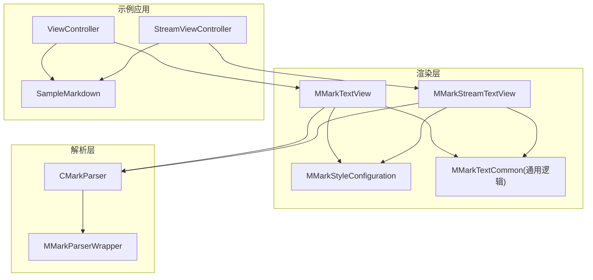
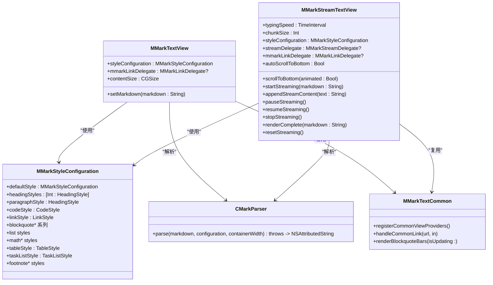
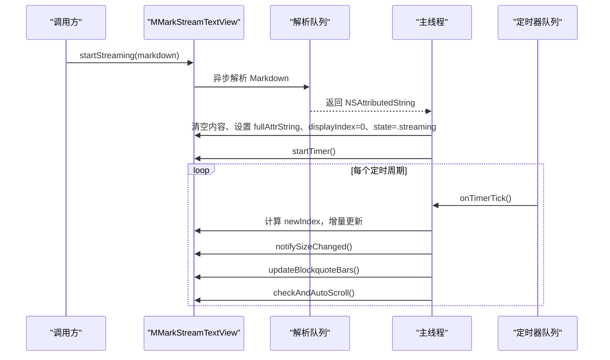
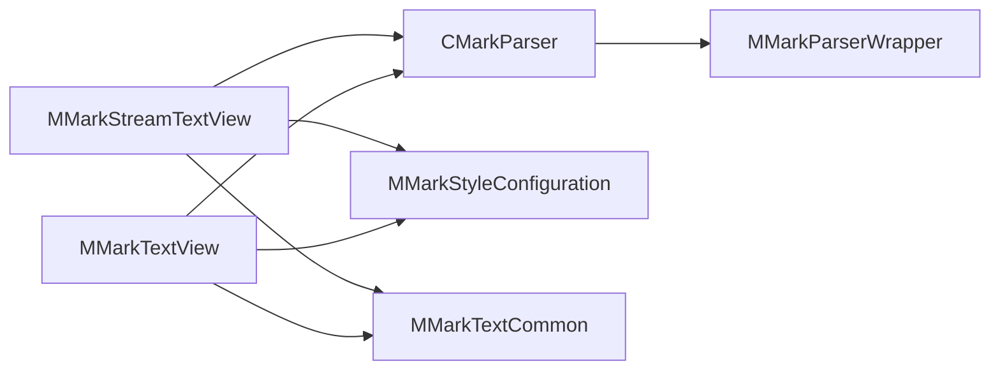

# 文本视图API

<cite>
**本文档引用的文件**
- [MMarkTextView.swift](file://MMarkParser/Sources/Renderer/MMarkTextView.swift)
- [MMarkStreamTextView.swift](file://MMarkParser/Sources/Renderer/MMarkStreamTextView.swift)
- [MMarkStyleConfiguration.swift](file://MMarkParser/Sources/Renderer/MMarkStyleConfiguration.swift)
- [MMarkTextCommon.swift](file://MMarkParser/Sources/Renderer/MMarkTextCommon.swift)
- [CMarkParser.swift](file://MMarkParser/Sources/Parser/CMarkParser.swift)
- [MMarkParserWrapper.swift](file://MMarkParser/Sources/Parser/MMarkParserWrapper.swift)
- [ViewController.swift](file://cocoapod_demo/cocoapod_demo/ViewController.swift)
- [StreamViewController.swift](file://cocoapod_demo/cocoapod_demo/StreamViewController.swift)
- [SampleMarkdown.swift](file://cocoapod_demo/cocoapod_demo/SampleMarkdown.swift)
</cite>

## 目录
1. [简介](#简介)
2. [项目结构](#项目结构)
3. [核心组件](#核心组件)
4. [架构总览](#架构总览)
5. [详细组件分析](#详细组件分析)
6. [依赖关系分析](#依赖关系分析)
7. [性能考量](#性能考量)
8. [故障排查指南](#故障排查指南)
9. [结论](#结论)
10. [附录](#附录)

## 简介
本文件为 MMarkParser 的文本视图组件提供完整的 API 参考文档，重点覆盖 MMarkTextView 与 MMarkStreamTextView 的公共方法、属性与配置项，涵盖视图初始化、Markdown 内容设置、样式配置、事件处理回调、容器宽度与滚动行为、布局参数、生命周期管理、内存优化与性能考虑、视图状态管理、刷新机制与更新策略，并给出与 UIKit 的集成方式与兼容性要求。同时提供使用示例与最佳实践建议。

## 项目结构
- 文本视图位于渲染层，负责将解析后的富文本呈现为可交互的 UITextView 子类。
- 解析器位于解析层，负责将 Markdown 文本转换为 NSAttributedString，并携带必要的附件与属性。
- 样式配置位于渲染层，提供丰富的样式结构体与默认样式，支持主题化定制。
- 通用逻辑位于渲染层，封装链接处理、引用块竖条绘制、TextKit 2/1 兼容逻辑等。

图表来源
- [MMarkTextView.swift:1-81](file://MMarkParser/Sources/Renderer/MMarkTextView.swift#L1-L81)
- [MMarkStreamTextView.swift:1-398](file://MMarkParser/Sources/Renderer/MMarkStreamTextView.swift#L1-L398)
- [MMarkStyleConfiguration.swift:1-339](file://MMarkParser/Sources/Renderer/MMarkStyleConfiguration.swift#L1-L339)
- [MMarkTextCommon.swift:1-290](file://MMarkParser/Sources/Renderer/MMarkTextCommon.swift#L1-L290)
- [CMarkParser.swift:1-81](file://MMarkParser/Sources/Parser/CMarkParser.swift#L1-L81)
- [MMarkParserWrapper.swift:1-800](file://MMarkParser/Sources/Parser/MMarkParserWrapper.swift#L1-L800)
- [ViewController.swift:1-46](file://cocoapod_demo/cocoapod_demo/ViewController.swift#L1-L46)
- [StreamViewController.swift:1-279](file://cocoapod_demo/cocoapod_demo/StreamViewController.swift#L1-L279)
- [SampleMarkdown.swift:1-760](file://cocoapod_demo/cocoapod_demo/SampleMarkdown.swift#L1-L760)

章节来源
- [MMarkTextView.swift:1-81](file://MMarkParser/Sources/Renderer/MMarkTextView.swift#L1-L81)
- [MMarkStreamTextView.swift:1-398](file://MMarkParser/Sources/Renderer/MMarkStreamTextView.swift#L1-L398)
- [MMarkStyleConfiguration.swift:1-339](file://MMarkParser/Sources/Renderer/MMarkStyleConfiguration.swift#L1-L339)
- [MMarkTextCommon.swift:1-290](file://MMarkParser/Sources/Renderer/MMarkTextCommon.swift#L1-L290)
- [CMarkParser.swift:1-81](file://MMarkParser/Sources/Parser/CMarkParser.swift#L1-L81)
- [MMarkParserWrapper.swift:1-800](file://MMarkParser/Sources/Parser/MMarkParserWrapper.swift#L1-L800)
- [ViewController.swift:1-46](file://cocoapod_demo/cocoapod_demo/ViewController.swift#L1-L46)
- [StreamViewController.swift:1-279](file://cocoapod_demo/cocoapod_demo/StreamViewController.swift#L1-L279)
- [SampleMarkdown.swift:1-760](file://cocoapod_demo/cocoapod_demo/SampleMarkdown.swift#L1-L760)

## 核心组件
- MMarkTextView：基于 UITextView 的 Markdown 文本视图，支持块引用竖条、链接处理与附件视图。
- MMarkStreamTextView：支持增量流式渲染的 UITextView，具备定时器驱动的增量插入、自动滚动、状态机与委托回调。
- MMarkStyleConfiguration：样式配置结构体，包含标题、段落、代码、链接、列表、表格、任务列表、数学公式、脚注等样式字段与默认样式。
- MMarkTextCommon：通用协议与工具，包括链接处理、引用块竖条绘制、TextKit 2/1 兼容逻辑等。

章节来源
- [MMarkTextView.swift:3-81](file://MMarkParser/Sources/Renderer/MMarkTextView.swift#L3-L81)
- [MMarkStreamTextView.swift:18-398](file://MMarkParser/Sources/Renderer/MMarkStreamTextView.swift#L18-L398)
- [MMarkStyleConfiguration.swift:10-339](file://MMarkParser/Sources/Renderer/MMarkStyleConfiguration.swift#L10-L339)
- [MMarkTextCommon.swift:30-290](file://MMarkParser/Sources/Renderer/MMarkTextCommon.swift#L30-L290)

## 架构总览
- 初始化与生命周期
  - 两者均提供 convenience init、init(frame:textContainer:)、init?(coder:) 三种初始化方式，内部调用 commonInit 完成基础配置（不可编辑、启用滚动、背景色、delegate、链接样式、注册附件视图提供者）。
- 内容设置
  - MMarkTextView：setMarkdown(_:) 将 Markdown 解析为 NSAttributedString 并赋值给 attributedText。
  - MMarkStreamTextView：startStreaming(markdown:)、appendStreamContent(_: )、renderComplete(_: )、stopStreaming()、pauseStreaming()、resumeStreaming()、resetStreaming() 提供完整的流式控制。
- 样式配置
  - 两者均暴露 styleConfiguration 属性，类型为 MMarkStyleConfiguration，支持默认样式与自定义样式。
- 事件与交互
  - 两者均实现 UITextViewDelegate，统一处理链接点击（handleCommonLink），支持外部 MMarkLinkDelegate 回调。
  - MMarkStreamTextView 提供 MMarkStreamDelegate 回调：onSizeChange(_: )、didChangeState(_: )、didFinishStreaming()。
- 布局与滚动
  - 两者均继承 UITextView 的滚动与布局能力；MMarkStreamTextView 提供 scrollToBottom(animated:) 与自动滚动到底部的策略。
- TextKit 2/1 兼容
  - 通用逻辑在 renderBlockquoteBars 中根据 iOS 版本选择 NSTextLayoutManager 或 layoutManager 路径。

图表来源
- [MMarkTextView.swift:6-81](file://MMarkParser/Sources/Renderer/MMarkTextView.swift#L6-L81)
- [MMarkStreamTextView.swift:21-398](file://MMarkParser/Sources/Renderer/MMarkStreamTextView.swift#L21-L398)
- [MMarkStyleConfiguration.swift:10-339](file://MMarkParser/Sources/Renderer/MMarkStyleConfiguration.swift#L10-L339)
- [MMarkTextCommon.swift:38-290](file://MMarkParser/Sources/Renderer/MMarkTextCommon.swift#L38-L290)
- [CMarkParser.swift:55-66](file://MMarkParser/Sources/Parser/CMarkParser.swift#L55-L66)

## 详细组件分析

### MMarkTextView API 参考
- 类型与继承
  - 类型：MMarkTextView
  - 继承：UITextView、UITextViewDelegate、MMarkTextComponent
  - iOS 版本：iOS 15.0 及以上
  - 主线程注解：@MainActor
- 公共属性
  - styleConfiguration: MMarkStyleConfiguration
    - 作用：应用到解析后的 Markdown 样式
    - 默认值：.defaultStyle
  - mmarkLinkDelegate: MMarkLinkDelegate?
    - 作用：接收链接点击回调
- 初始化
  - convenience init()：便捷构造
  - init(frame:textContainer:)：标准构造
  - init?(coder:)：XIB/Storyboard 构造
  - commonInit()：内部初始化，设置不可编辑、启用滚动、背景色、delegate、链接样式、注册附件视图提供者
- 内容设置
  - setMarkdown(_:)：解析 Markdown，失败时回退为纯文本，设置 attributedText
- 布局与滚动
  - contentSize：重写，监听变化后异步更新块引用竖条
- 链接处理
  - 实现 UITextViewDelegate.textView(_:shouldInteractWith:in:interaction:)，委托给 handleCommonLink

章节来源
- [MMarkTextView.swift:3-81](file://MMarkParser/Sources/Renderer/MMarkTextView.swift#L3-L81)
- [MMarkTextCommon.swift:38-129](file://MMarkParser/Sources/Renderer/MMarkTextCommon.swift#L38-L129)

### MMarkStreamTextView API 参考
- 类型与继承
  - 类型：MMarkStreamTextView
  - 继承：UITextView、MMarkTextComponent
  - iOS 版本：iOS 15.0 及以上
  - 主线程注解：@MainActor
- 公共枚举
  - StreamState：idle、streaming、paused、stopped
- 公共属性
  - typingSpeed: TimeInterval，默认 0.03
  - chunkSize: Int，默认 3
  - styleConfiguration: MMarkStyleConfiguration
  - streamDelegate: MMarkStreamDelegate?
  - mmarkLinkDelegate: MMarkLinkDelegate?
  - autoScrollToBottom: Bool，默认 true
  - streamState: StreamState（只读）
  - displayedLength: Int（只读）
  - totalLength: Int（只读，只读属性）
- 初始化
  - convenience init()、init(frame:textContainer:)、init?(coder:)，内部 commonInit() 完成基础配置
- 内容更新与流式控制
  - startStreaming(markdown:)：启动解析与流式渲染，内部在解析队列解析，主线程替换内容并启动定时器
  - appendStreamContent(_:)：追加内容，重新解析并增量更新
  - pauseStreaming() / resumeStreaming() / stopStreaming()：暂停/恢复/停止
  - renderComplete(_:)：一次性渲染完成
  - resetStreaming()：重置状态与内容
- 滚动与自动滚动
  - scrollToBottom(animated:)：滚动到底部，兼容 iOS 16 TextKit 2
  - checkAndAutoScroll()：当 autoScrollToBottom 为 true 且接近底部时自动滚动
- 定时器驱动
  - startTimer() / stopTimer()：基于 DispatchSourceTimer 的增量推进
  - onTimerTick()：主线程推进 displayIndex，增量更新、通知尺寸变化、更新块引用竖条、自动滚动
- 尺寸变化通知
  - notifySizeChanged()：通过 sizeThatFits 计算高度并去抖发送 onSizeChange
- 链接处理
  - 实现 UITextViewDelegate.textView(_:shouldInteractWith:in:interaction:)，委托给 handleCommonLink
- 引用块竖条
  - updateBlockquoteBars()：内部调用 renderBlockquoteBars

图表来源
- [MMarkStreamTextView.swift:174-201](file://MMarkParser/Sources/Renderer/MMarkStreamTextView.swift#L174-L201)
- [MMarkStreamTextView.swift:304-351](file://MMarkParser/Sources/Renderer/MMarkStreamTextView.swift#L304-L351)
- [MMarkStreamTextView.swift:365-379](file://MMarkParser/Sources/Renderer/MMarkStreamTextView.swift#L365-L379)

章节来源
- [MMarkStreamTextView.swift:18-398](file://MMarkParser/Sources/Renderer/MMarkStreamTextView.swift#L18-L398)
- [MMarkTextCommon.swift:38-290](file://MMarkParser/Sources/Renderer/MMarkTextCommon.swift#L38-L290)

### MMarkStyleConfiguration API 参考
- 结构体与默认样式
  - defaultStyle：提供完整的默认样式集合，包含标题、段落、代码、链接、删除线、块引用、图片占位符、表格、任务列表、有序/无序列表、数学公式、脚注等
- 样式子结构
  - HeadingStyle：font、textColor
  - CodeStyle：font、textColor、backgroundColor
  - LinkStyle：textColor、underlineStyle
  - OrderedListStyle：mode、font、textColor、image、imageSize
  - UnorderedListStyle：mode、font、textColor、image、secondaryImage、imageSize
  - TableStyle：headerBackgroundColor、borderColor、borderWidth、cornerRadius
  - TaskListStyle：mode、checkedColor、uncheckedColor、checkedFont、uncheckedFont、checkedImage、uncheckedImage、imageSize
  - 数学公式与脚注样式：mathInlineStyle、mathBlockStyle、mathBlockBackgroundColor、mathBlockCornerRadius、mathDisplayFont、footnoteReferenceStyle、footnoteStyle、footnoteBackrefColor

章节来源
- [MMarkStyleConfiguration.swift:10-339](file://MMarkParser/Sources/Renderer/MMarkStyleConfiguration.swift#L10-L339)

### MMarkTextCommon 通用逻辑
- 协议与委托
  - MMarkLinkDelegate：外部链接处理回调
  - MMarkTextComponent：统一 TextView 的样式与链接代理
- 通用方法
  - registerCommonViewProviders()：注册附件视图提供者
  - handleCommonLink(_:_:in:)：统一处理脚注与锚点跳转，支持外部回调接管
  - renderBlockquoteBars(isUpdating:)：绘制块引用竖条，兼容 TextKit 2/1
  - lineHeight(at:from:)、mergeRanges(_:maxMergeGap:)：辅助计算与合并

章节来源
- [MMarkTextCommon.swift:18-290](file://MMarkParser/Sources/Renderer/MMarkTextCommon.swift#L18-L290)

## 依赖关系分析
- 组件耦合
  - MMarkTextView 与 MMarkStreamTextView 均依赖 CMarkParser 进行 Markdown 解析，依赖 MMarkStyleConfiguration 进行样式应用，依赖 MMarkTextCommon 提供通用逻辑。
- 外部依赖
  - UIKit：UITextView、CALayer、NSText* 等
  - TextKit 2/1：根据系统版本选择 NSTextLayoutManager 或 layoutManager
- 可能的循环依赖
  - 未发现循环依赖，各模块职责清晰（解析层、渲染层、通用层）

图表来源
- [MMarkStreamTextView.swift:18-398](file://MMarkParser/Sources/Renderer/MMarkStreamTextView.swift#L18-L398)
- [MMarkTextView.swift:6-81](file://MMarkParser/Sources/Renderer/MMarkTextView.swift#L6-L81)
- [CMarkParser.swift:55-66](file://MMarkParser/Sources/Parser/CMarkParser.swift#L55-L66)
- [MMarkParserWrapper.swift:1-800](file://MMarkParser/Sources/Parser/MMarkParserWrapper.swift#L1-L800)
- [MMarkStyleConfiguration.swift:10-339](file://MMarkParser/Sources/Renderer/MMarkStyleConfiguration.swift#L10-L339)
- [MMarkTextCommon.swift:38-290](file://MMarkParser/Sources/Renderer/MMarkTextCommon.swift#L38-L290)

章节来源
- [MMarkStreamTextView.swift:18-398](file://MMarkParser/Sources/Renderer/MMarkStreamTextView.swift#L18-L398)
- [MMarkTextView.swift:6-81](file://MMarkParser/Sources/Renderer/MMarkTextView.swift#L6-L81)
- [CMarkParser.swift:55-66](file://MMarkParser/Sources/Parser/CMarkParser.swift#L55-L66)
- [MMarkParserWrapper.swift:1-800](file://MMarkParser/Sources/Parser/MMarkParserWrapper.swift#L1-L800)
- [MMarkStyleConfiguration.swift:10-339](file://MMarkParser/Sources/Renderer/MMarkStyleConfiguration.swift#L10-L339)
- [MMarkTextCommon.swift:38-290](file://MMarkParser/Sources/Renderer/MMarkTextCommon.swift#L38-L290)

## 性能考量
- 解析与渲染
  - 解析在后台队列执行，避免阻塞主线程；主线程仅做 UI 更新与通知。
  - MMarkStreamTextView 采用增量更新策略，避免全量重布局，提升长文档渲染体验。
- TextKit 2/1 兼容
  - 在 iOS 16+ 使用 NSTextLayoutManager，降低桥接成本；iOS 15 回退到 layoutManager。
- 引用块竖条绘制
  - 通过 renderBlockquoteBars 在主线程异步更新，避免重复绘制与闪烁。
- 自动滚动
  - 通过阈值判断与 setContentOffset 控制滚动，减少不必要的滚动动画。
- 内存优化
  - 定时器与后台队列在 deinit 中取消，避免悬空引用。
  - 增量更新仅保留必要的 fullAttrString 与 displayIndex，避免累积内存。

章节来源
- [MMarkStreamTextView.swift:174-201](file://MMarkParser/Sources/Renderer/MMarkStreamTextView.swift#L174-L201)
- [MMarkStreamTextView.swift:304-351](file://MMarkParser/Sources/Renderer/MMarkStreamTextView.swift#L304-L351)
- [MMarkTextCommon.swift:131-249](file://MMarkParser/Sources/Renderer/MMarkTextCommon.swift#L131-L249)

## 故障排查指南
- 链接无法点击或崩溃
  - 确认设置了 mmarkLinkDelegate 并在回调中正确处理 URL；handleCommonLink 会优先回调外部代理。
- 引用块竖条不显示
  - 检查 styleConfiguration.blockquoteBorderColor 与 blockquoteBorderWidth 是否合理；确认 contentSize 变化触发了异步更新。
- 流式渲染卡顿
  - 调整 typingSpeed 与 chunkSize；长文档可自动增大 chunkSize 以维持视觉流畅。
- 自动滚动异常
  - 检查 autoScrollToBottom 与阈值；确认滚动目标高度计算正确。
- 尺寸通知抖动
  - notifySizeChanged 已做去抖处理，确保仅在尺寸显著变化时回调。

章节来源
- [MMarkTextCommon.swift:48-129](file://MMarkParser/Sources/Renderer/MMarkTextCommon.swift#L48-L129)
- [MMarkStreamTextView.swift:365-379](file://MMarkParser/Sources/Renderer/MMarkStreamTextView.swift#L365-L379)

## 结论
MMarkTextView 与 MMarkStreamTextView 提供了完整的 Markdown 文本渲染能力，前者适合一次性渲染，后者适合长文档与实时内容的流式展示。配合 MMarkStyleConfiguration 的丰富样式与 MMarkTextCommon 的通用逻辑，可在 iOS 15+ 上稳定运行并获得良好的性能与用户体验。建议在生产环境中结合业务需求选择合适的渲染模式，并合理配置样式与流式参数。

## 附录

### 使用示例与最佳实践
- 基础使用（一次性渲染）
  - 在控制器中创建 MMarkTextView，设置约束，调用 setMarkdown 加载 Markdown。
  - 参考示例：[ViewController.swift:38-43](file://cocoapod_demo/cocoapod_demo/ViewController.swift#L38-L43)
- 流式渲染（增量展示）
  - 创建 MMarkStreamTextView，设置 styleConfiguration 与 streamDelegate，通过 startStreaming/markdown 开始渲染。
  - 参考示例：[StreamViewController.swift:167-199](file://cocoapod_demo/cocoapod_demo/StreamViewController.swift#L167-L199)
- 样式定制
  - 修改 MMarkStyleConfiguration 的各项样式字段，如有序/无序列表图标、任务列表图标、数学公式样式等。
  - 参考示例：[StreamViewController.swift:169-184](file://cocoapod_demo/cocoapod_demo/StreamViewController.swift#L169-L184)
- 链接处理
  - 实现 MMarkLinkDelegate，优先处理内部链接与脚注跳转，必要时拦截系统默认行为。
  - 参考实现：[MMarkTextCommon.swift:48-129](file://MMarkParser/Sources/Renderer/MMarkTextCommon.swift#L48-L129)

章节来源
- [ViewController.swift:38-43](file://cocoapod_demo/cocoapod_demo/ViewController.swift#L38-L43)
- [StreamViewController.swift:167-199](file://cocoapod_demo/cocoapod_demo/StreamViewController.swift#L167-L199)
- [StreamViewController.swift:169-184](file://cocoapod_demo/cocoapod_demo/StreamViewController.swift#L169-L184)
- [MMarkTextCommon.swift:48-129](file://MMarkParser/Sources/Renderer/MMarkTextCommon.swift#L48-L129)

### 与 UIKit 的集成与兼容性
- iOS 版本要求：iOS 15.0 及以上
- 主线程注解：@MainActor，确保 UI 更新在主线程
- TextKit 2/1 兼容：自动选择 NSTextLayoutManager 或 layoutManager
- 链接与附件：通过 UITextViewDelegate 与 NSTextAttachment 注册机制实现

章节来源
- [MMarkTextView.swift:4-6](file://MMarkParser/Sources/Renderer/MMarkTextView.swift#L4-L6)
- [MMarkStreamTextView.swift:11-21](file://MMarkParser/Sources/Renderer/MMarkStreamTextView.swift#L11-L21)
- [MMarkTextCommon.swift:44-46](file://MMarkParser/Sources/Renderer/MMarkTextCommon.swift#L44-L46)