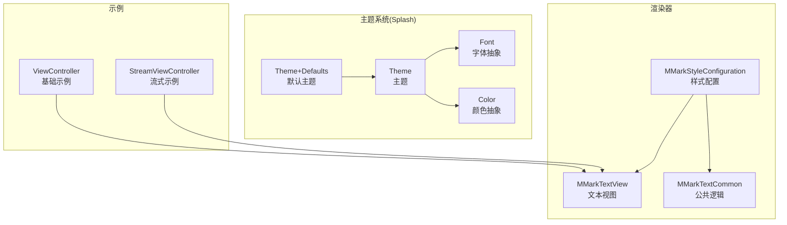
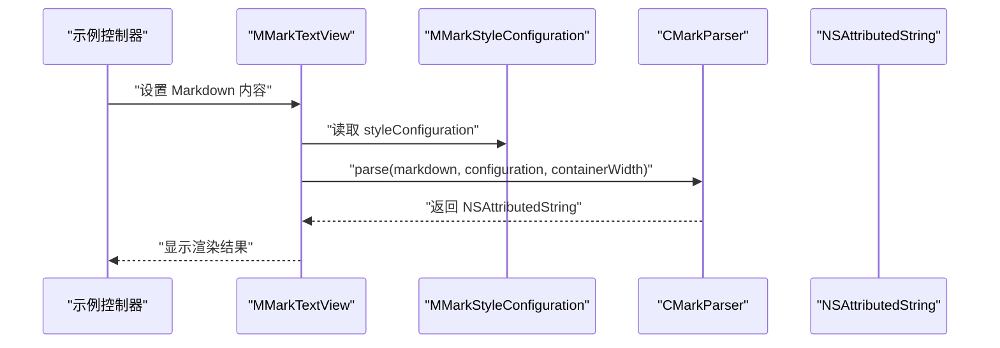
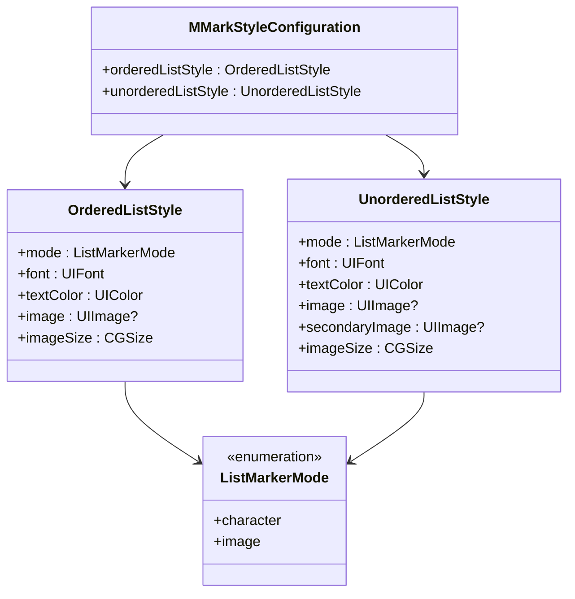
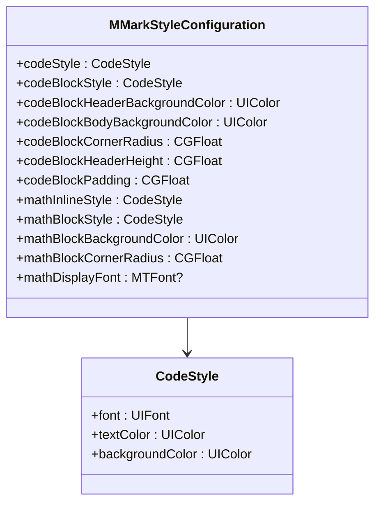
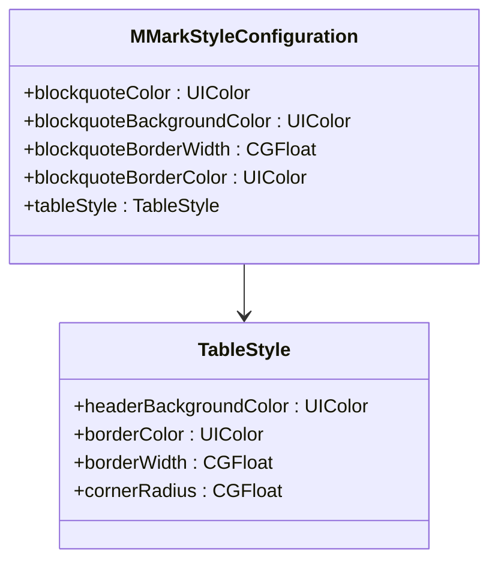
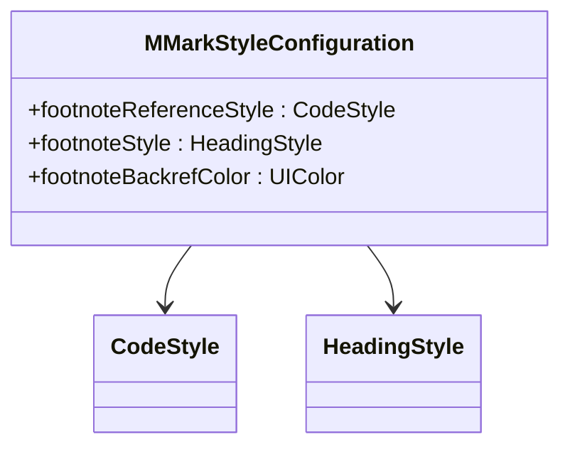
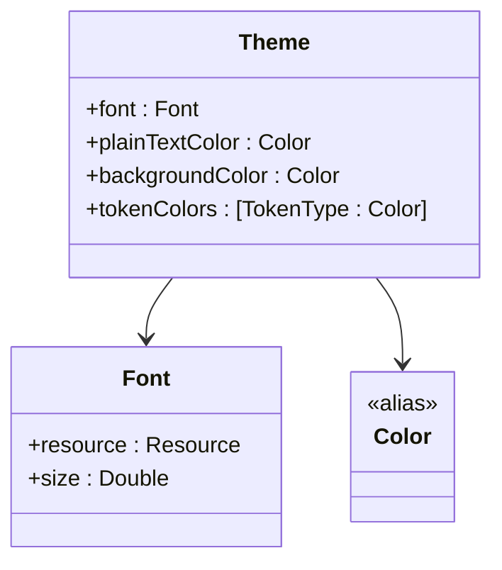
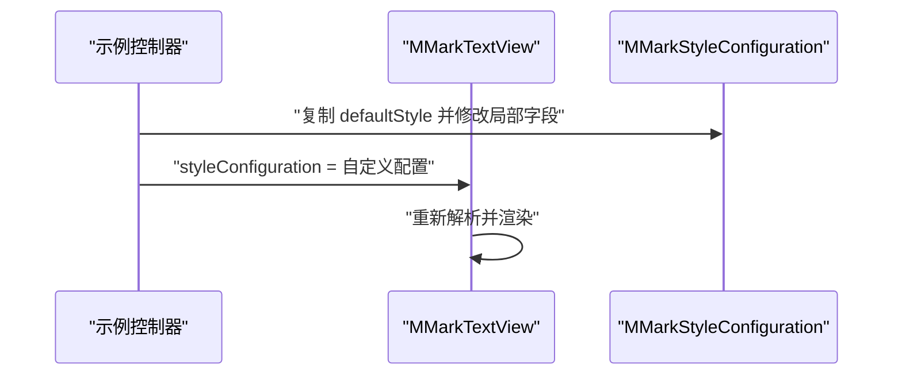
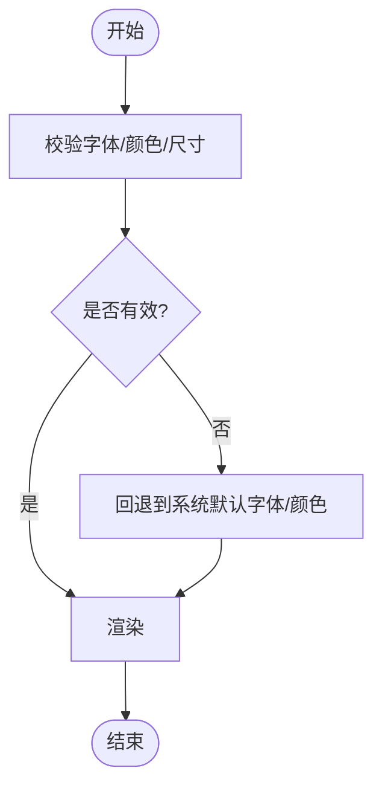
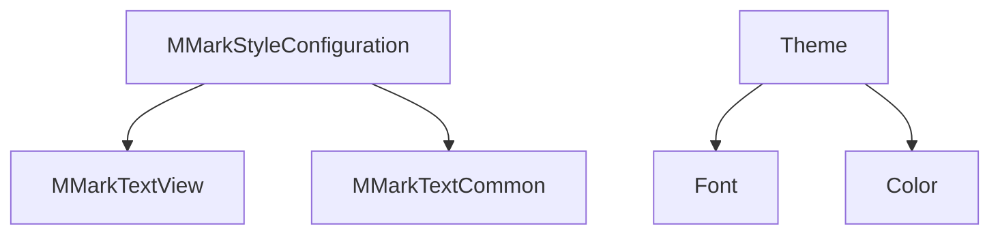

# 样式配置API

<cite>
**本文档引用的文件**
- [MMarkStyleConfiguration.swift](file://MMarkParser/Sources/Renderer/MMarkStyleConfiguration.swift)
- [Theme.swift](file://MMarkParser/Sources/Splash/Theming/Theme.swift)
- [Color.swift](file://MMarkParser/Sources/Splash/Theming/Color.swift)
- [Font.swift](file://MMarkParser/Sources/Splash/Theming/Font.swift)
- [Theme+Defaults.swift](file://MMarkParser/Sources/Splash/Theming/Theme+Defaults.swift)
- [MMarkTextView.swift](file://MMarkParser/Sources/Renderer/MMarkTextView.swift)
- [MMarkTextCommon.swift](file://MMarkParser/Sources/Renderer/MMarkTextCommon.swift)
- [StreamViewController.swift](file://cocoapod_demo/cocoapod_demo/StreamViewController.swift)
- [ViewController.swift](file://cocoapod_demo/cocoapod_demo/ViewController.swift)
</cite>

## 目录
1. [简介](#简介)
2. [项目结构](#项目结构)
3. [核心组件](#核心组件)
4. [架构总览](#架构总览)
5. [详细组件分析](#详细组件分析)
6. [依赖关系分析](#依赖关系分析)
7. [性能考量](#性能考量)
8. [故障排查指南](#故障排查指南)
9. [结论](#结论)
10. [附录](#附录)

## 简介
本文件为 MMarkParser 的样式配置系统提供详细的 API 参考与实践指南。重点覆盖以下方面：
- MMarkStyleConfiguration 类的全部属性与配置方法，涵盖标题、段落、列表、链接、代码、表格、任务列表、数学公式、脚注等样式维度
- 主题系统（Theme）的 API 接口、颜色与字体配置方式
- 样式继承机制、默认值覆盖与动态样式切换
- 样式验证规则、兼容性检查与错误处理建议
- 完整的样式配置示例与自定义样式实现方法
- 样式性能优化与内存管理策略

## 项目结构
样式配置系统主要分布在以下模块：
- 渲染器层：MMarkStyleConfiguration 提供 Markdown 渲染所需的全部样式配置
- 文本组件层：MMarkTextView 与 MMarkTextCommon 使用样式配置进行渲染与交互
- 主题系统（Splash）：Theme、Color、Font 及其默认主题提供跨平台的颜色与字体抽象
- 示例工程：通过 StreamViewController 展示动态样式切换与实时效果

**图表来源**
- [MMarkStyleConfiguration.swift:11-339](file://MMarkParser/Sources/Renderer/MMarkStyleConfiguration.swift#L11-L339)
- [MMarkTextView.swift:6-81](file://MMarkParser/Sources/Renderer/MMarkTextView.swift#L6-L81)
- [MMarkTextCommon.swift:30-290](file://MMarkParser/Sources/Renderer/MMarkTextCommon.swift#L30-L290)
- [Theme.swift:20-39](file://MMarkParser/Sources/Splash/Theming/Theme.swift#L20-L39)
- [Font.swift:15-103](file://MMarkParser/Sources/Splash/Theming/Font.swift#L15-L103)
- [Color.swift:9-21](file://MMarkParser/Sources/Splash/Theming/Color.swift#L9-L21)
- [Theme+Defaults.swift:11-179](file://MMarkParser/Sources/Splash/Theming/Theme+Defaults.swift#L11-L179)
- [ViewController.swift:4-45](file://cocoapod_demo/cocoapod_demo/ViewController.swift#L4-L45)
- [StreamViewController.swift:167-199](file://cocoapod_demo/cocoapod_demo/StreamViewController.swift#L167-L199)

**章节来源**
- [MMarkStyleConfiguration.swift:11-339](file://MMarkParser/Sources/Renderer/MMarkStyleConfiguration.swift#L11-L339)
- [MMarkTextView.swift:6-81](file://MMarkParser/Sources/Renderer/MMarkTextView.swift#L6-L81)
- [MMarkTextCommon.swift:30-290](file://MMarkParser/Sources/Renderer/MMarkTextCommon.swift#L30-L290)
- [Theme.swift:20-39](file://MMarkParser/Sources/Splash/Theming/Theme.swift#L20-L39)
- [Font.swift:15-103](file://MMarkParser/Sources/Splash/Theming/Font.swift#L15-L103)
- [Color.swift:9-21](file://MMarkParser/Sources/Splash/Theming/Color.swift#L9-L21)
- [Theme+Defaults.swift:11-179](file://MMarkParser/Sources/Splash/Theming/Theme+Defaults.swift#L11-L179)
- [ViewController.swift:4-45](file://cocoapod_demo/cocoapod_demo/ViewController.swift#L4-L45)
- [StreamViewController.swift:167-199](file://cocoapod_demo/cocoapod_demo/StreamViewController.swift#L167-L199)

## 核心组件
本节聚焦 MMarkStyleConfiguration 的结构与职责，以及与主题系统的协作。

- MMarkStyleConfiguration：集中管理 Markdown 渲染所需的所有样式配置，包括标题、段落、列表、链接、代码、表格、任务列表、数学公式、脚注等
- Theme/Color/Font：提供跨平台的颜色与字体抽象，便于在不同平台上统一风格
- MMarkTextView/ MMarkTextCommon：消费样式配置，负责渲染与交互（如引用块侧边条、链接处理）

关键要点：
- 样式配置采用结构体设计，便于不可变复制与安全传递
- 提供 defaultStyle 快捷入口，覆盖常见 Markdown 元素的默认外观
- 通过 MMarkTextView 的 styleConfiguration 属性实现运行时动态切换

**章节来源**
- [MMarkStyleConfiguration.swift:11-339](file://MMarkParser/Sources/Renderer/MMarkStyleConfiguration.swift#L11-L339)
- [Theme.swift:20-39](file://MMarkParser/Sources/Splash/Theming/Theme.swift#L20-L39)
- [Font.swift:15-103](file://MMarkParser/Sources/Splash/Theming/Font.swift#L15-L103)
- [Color.swift:9-21](file://MMarkParser/Sources/Splash/Theming/Color.swift#L9-L21)
- [MMarkTextView.swift:6-81](file://MMarkParser/Sources/Renderer/MMarkTextView.swift#L6-L81)
- [MMarkTextCommon.swift:30-290](file://MMarkParser/Sources/Renderer/MMarkTextCommon.swift#L30-L290)

## 架构总览
样式配置在渲染流程中的作用与数据流向如下：

**图表来源**
- [MMarkTextView.swift:39-49](file://MMarkParser/Sources/Renderer/MMarkTextView.swift#L39-L49)
- [MMarkStyleConfiguration.swift:188-267](file://MMarkParser/Sources/Renderer/MMarkStyleConfiguration.swift#L188-L267)

**章节来源**
- [MMarkTextView.swift:39-49](file://MMarkParser/Sources/Renderer/MMarkTextView.swift#L39-L49)
- [MMarkStyleConfiguration.swift:188-267](file://MMarkParser/Sources/Renderer/MMarkStyleConfiguration.swift#L188-L267)

## 详细组件分析

### MMarkStyleConfiguration 结构与属性
MMarkStyleConfiguration 通过嵌套结构组织各类样式，并提供默认值与初始化参数。核心字段概览：
- 标题样式：headingStyles（按级别映射）、headingSpacingBefore（标题上间距）、headingSpacing（标题下间距）
- 段落样式：paragraphStyle
- 代码样式：codeStyle、codeBlockStyle、codeBlockHeaderBackgroundColor、codeBlockBodyBackgroundColor、codeBlockCornerRadius、codeBlockHeaderHeight、codeBlockPadding
- 链接样式：linkStyle（文本颜色、下划线样式）
- 删除线颜色：strikethroughColor
- 引用块：blockquoteColor、blockquoteBackgroundColor、blockquoteBorderWidth、blockquoteBorderColor
- 图片占位符：imagePlaceholderColor
- 表格：tableStyle（headerBackgroundColor、borderColor、borderWidth、cornerRadius）
- 任务列表：taskListStyle（mode、checked/unchecked 颜色与字体、图像、图标尺寸）
- 列表：orderedListStyle、unorderedListStyle（含 ListMarkerMode、字体、文本颜色、图像与尺寸）
- 数学公式：mathInlineStyle、mathBlockStyle、mathBlockBackgroundColor、mathBlockCornerRadius、mathDisplayFont
- 脚注：footnoteReferenceStyle、footnoteStyle、footnoteBackrefColor

默认样式 defaultStyle 覆盖了 GFM 常见元素的视觉规范，适合直接使用或作为定制起点。

**章节来源**
- [MMarkStyleConfiguration.swift:11-339](file://MMarkParser/Sources/Renderer/MMarkStyleConfiguration.swift#L11-L339)

### 列表样式配置（有序/无序）
- ListMarkerMode：支持字符模式与图像模式
- 有序列表：支持字体、文本颜色、图像与图标尺寸
- 无序列表：支持一级与多级的图像区分（image/secondaryImage），并可设置尺寸
- 默认行为：若未显式设置，使用系统字体与标签色

**图表来源**
- [MMarkStyleConfiguration.swift:48-85](file://MMarkParser/Sources/Renderer/MMarkStyleConfiguration.swift#L48-L85)

**章节来源**
- [MMarkStyleConfiguration.swift:48-85](file://MMarkParser/Sources/Renderer/MMarkStyleConfiguration.swift#L48-L85)

### 代码与数学样式
- 行内代码与代码块：均包含字体、文本颜色与背景色
- 代码块额外属性：header/body 背景色、圆角、高度、内边距
- 数学公式：行内与块级样式一致的配置，块级还支持背景色与圆角；mathDisplayFont 支持 iosMath 字体资源

**图表来源**
- [MMarkStyleConfiguration.swift:23-34](file://MMarkParser/Sources/Renderer/MMarkStyleConfiguration.swift#L23-L34)
- [MMarkStyleConfiguration.swift:96-140](file://MMarkParser/Sources/Renderer/MMarkStyleConfiguration.swift#L96-L140)

**章节来源**
- [MMarkStyleConfiguration.swift:23-34](file://MMarkParser/Sources/Renderer/MMarkStyleConfiguration.swift#L23-L34)
- [MMarkStyleConfiguration.swift:96-140](file://MMarkParser/Sources/Renderer/MMarkStyleConfiguration.swift#L96-L140)

### 引用块与表格样式
- 引用块：边框宽度、边框颜色、背景色、文本颜色
- 表格：表头背景色、边框颜色、边框宽度、圆角

**图表来源**
- [MMarkStyleConfiguration.swift:113-124](file://MMarkParser/Sources/Renderer/MMarkStyleConfiguration.swift#L113-L124)
- [MMarkStyleConfiguration.swift:149-161](file://MMarkParser/Sources/Renderer/MMarkStyleConfiguration.swift#L149-L161)

**章节来源**
- [MMarkStyleConfiguration.swift:113-124](file://MMarkParser/Sources/Renderer/MMarkStyleConfiguration.swift#L113-L124)
- [MMarkStyleConfiguration.swift:149-161](file://MMarkParser/Sources/Renderer/MMarkStyleConfiguration.swift#L149-L161)

### 脚注样式
- 脚注引用样式：字体、文本颜色、背景色
- 脚注定义文本样式：字体、文本颜色
- 回链颜色：脚注返回标记的颜色

**图表来源**
- [MMarkStyleConfiguration.swift:142-147](file://MMarkParser/Sources/Renderer/MMarkStyleConfiguration.swift#L142-L147)

**章节来源**
- [MMarkStyleConfiguration.swift:142-147](file://MMarkParser/Sources/Renderer/MMarkStyleConfiguration.swift#L142-L147)

### 主题系统（Theme/Color/Font）
- Theme：封装字体、普通文本颜色、背景色与高亮 token 颜色映射
- Color：跨平台颜色类型别名（iOS 使用 UIColor，macOS 使用 NSColor）
- Font：跨平台字体抽象，支持系统字体、预加载字体与路径字体加载
- Theme+Defaults：提供多种预设主题（如 Midnight、WWDC17/18、Sunset、Presentation 等）

**图表来源**
- [Theme.swift:20-39](file://MMarkParser/Sources/Splash/Theming/Theme.swift#L20-L39)
- [Font.swift:15-103](file://MMarkParser/Sources/Splash/Theming/Font.swift#L15-L103)
- [Color.swift:9-21](file://MMarkParser/Sources/Splash/Theming/Color.swift#L9-L21)

**章节来源**
- [Theme.swift:20-39](file://MMarkParser/Sources/Splash/Theming/Theme.swift#L20-L39)
- [Font.swift:15-103](file://MMarkParser/Sources/Splash/Theming/Font.swift#L15-L103)
- [Color.swift:9-21](file://MMarkParser/Sources/Splash/Theming/Color.swift#L9-L21)
- [Theme+Defaults.swift:11-179](file://MMarkParser/Sources/Splash/Theming/Theme+Defaults.swift#L11-L179)

### 样式继承机制、默认值覆盖与动态切换
- 继承机制：MMarkTextView 在初始化时默认使用 .defaultStyle，开发者可通过修改 styleConfiguration 实现继承与覆盖
- 默认值覆盖：通过构造函数或属性赋值覆盖特定字段，未覆盖部分沿用默认值
- 动态切换：示例中展示了在流式渲染中对列表与任务列表样式的即时修改，随后应用到渲染结果

**图表来源**
- [MMarkStyleConfiguration.swift:188-267](file://MMarkParser/Sources/Renderer/MMarkStyleConfiguration.swift#L188-L267)
- [StreamViewController.swift:167-184](file://cocoapod_demo/cocoapod_demo/StreamViewController.swift#L167-L184)

**章节来源**
- [MMarkStyleConfiguration.swift:188-267](file://MMarkParser/Sources/Renderer/MMarkStyleConfiguration.swift#L188-L267)
- [StreamViewController.swift:167-184](file://cocoapod_demo/cocoapod_demo/StreamViewController.swift#L167-L184)

### 样式验证规则、兼容性检查与错误处理
- 验证规则建议：
  - 字体与颜色需与当前系统主题兼容（例如浅色/深色模式下的对比度）
  - 列表图像尺寸与字体大小应保持比例协调
  - 数学公式字体缺失时应回退到系统字体
- 兼容性检查：
  - iosMath 字体资源不存在时使用系统默认字体
  - 引用块边框宽度与颜色应保证可见性
- 错误处理：
  - 解析失败时回退到原始 Markdown 文本
  - 链接处理中对非标准协议进行拦截，避免系统尝试打开导致异常

**图表来源**
- [MMarkStyleConfiguration.swift:189-198](file://MMarkParser/Sources/Renderer/MMarkStyleConfiguration.swift#L189-L198)
- [MMarkTextView.swift:43-47](file://MMarkParser/Sources/Renderer/MMarkTextView.swift#L43-L47)

**章节来源**
- [MMarkStyleConfiguration.swift:189-198](file://MMarkParser/Sources/Renderer/MMarkStyleConfiguration.swift#L189-L198)
- [MMarkTextView.swift:43-47](file://MMarkParser/Sources/Renderer/MMarkTextView.swift#L43-L47)

### 完整样式配置示例与自定义实现
- 基础示例：ViewController 中直接使用默认样式渲染 Markdown
- 流式示例：StreamViewController 展示如何修改有序列表颜色、无序列表图像、任务列表图标，并应用到 MMarkStreamTextView

实现步骤要点：
- 复制 defaultStyle 作为起点
- 修改目标样式字段（如 orderedListStyle.textColor、unorderedListStyle.image/secondaryImage、taskListStyle.checked/uncheckedImage）
- 将新配置赋值给 MMarkTextView/ MMarkStreamTextView 的 styleConfiguration
- 触发重新解析与渲染

**章节来源**
- [ViewController.swift:38-43](file://cocoapod_demo/cocoapod_demo/ViewController.swift#L38-L43)
- [StreamViewController.swift:167-184](file://cocoapod_demo/cocoapod_demo/StreamViewController.swift#L167-L184)

## 依赖关系分析
样式配置系统与其他组件的耦合关系如下：

**图表来源**
- [MMarkStyleConfiguration.swift:11-339](file://MMarkParser/Sources/Renderer/MMarkStyleConfiguration.swift#L11-L339)
- [MMarkTextView.swift:6-81](file://MMarkParser/Sources/Renderer/MMarkTextView.swift#L6-L81)
- [MMarkTextCommon.swift:30-290](file://MMarkParser/Sources/Renderer/MMarkTextCommon.swift#L30-L290)
- [Theme.swift:20-39](file://MMarkParser/Sources/Splash/Theming/Theme.swift#L20-L39)
- [Font.swift:15-103](file://MMarkParser/Sources/Splash/Theming/Font.swift#L15-L103)
- [Color.swift:9-21](file://MMarkParser/Sources/Splash/Theming/Color.swift#L9-L21)

**章节来源**
- [MMarkStyleConfiguration.swift:11-339](file://MMarkParser/Sources/Renderer/MMarkStyleConfiguration.swift#L11-L339)
- [MMarkTextView.swift:6-81](file://MMarkParser/Sources/Renderer/MMarkTextView.swift#L6-L81)
- [MMarkTextCommon.swift:30-290](file://MMarkParser/Sources/Renderer/MMarkTextCommon.swift#L30-L290)
- [Theme.swift:20-39](file://MMarkParser/Sources/Splash/Theming/Theme.swift#L20-L39)
- [Font.swift:15-103](file://MMarkParser/Sources/Splash/Theming/Font.swift#L15-L103)
- [Color.swift:9-21](file://MMarkParser/Sources/Splash/Theming/Color.swift#L9-L21)

## 性能考量
- 字体与颜色缓存：尽量复用 UIFont/UIColor 实例，避免频繁创建
- 渲染批处理：在流式渲染中合理设置 typingSpeed 与 chunkSize，平衡流畅度与内存占用
- 引用块侧边条绘制：仅在 contentSize 变化时触发更新，避免重复绘制
- 数学公式字体：优先使用系统可用字体，减少字体加载失败带来的回退开销

[本节为通用指导，不直接分析具体文件]

## 故障排查指南
- 链接无法点击或崩溃
  - 检查链接处理逻辑是否正确拦截非标准协议
  - 确认 mmarkLinkDelegate 的回调返回值符合预期
- 引用块侧边条不显示
  - 确认 blockquoteBorderWidth 与 blockquoteBorderColor 设置合理
  - 检查 contentSize 变化后是否触发更新
- 数学公式显示异常
  - 确认 mathDisplayFont 是否存在，不存在时会回退到系统字体
- 流式渲染卡顿
  - 调整 typingSpeed 与 chunkSize，降低单次渲染量

**章节来源**
- [MMarkTextCommon.swift:64-129](file://MMarkParser/Sources/Renderer/MMarkTextCommon.swift#L64-L129)
- [MMarkTextCommon.swift:131-249](file://MMarkParser/Sources/Renderer/MMarkTextCommon.swift#L131-L249)
- [MMarkStyleConfiguration.swift:189-198](file://MMarkParser/Sources/Renderer/MMarkStyleConfiguration.swift#L189-L198)

## 结论
MMarkStyleConfiguration 提供了全面而灵活的 Markdown 样式配置能力，默认样式覆盖常见需求，同时允许通过属性覆盖与动态切换满足个性化场景。配合 Theme/Font/Color 抽象，可在多平台环境下保持一致的视觉体验。结合流式渲染与引用块侧边条等特性，能够实现高性能、可维护的富文本渲染方案。

[本节为总结性内容，不直接分析具体文件]

## 附录
- 默认样式清单与用途参考：参见 defaultStyle 的各项配置
- 示例工程入口：
  - 基础示例：ViewController
  - 流式示例：StreamViewController

**章节来源**
- [MMarkStyleConfiguration.swift:188-267](file://MMarkParser/Sources/Renderer/MMarkStyleConfiguration.swift#L188-L267)
- [ViewController.swift:38-43](file://cocoapod_demo/cocoapod_demo/ViewController.swift#L38-L43)
- [StreamViewController.swift:167-184](file://cocoapod_demo/cocoapod_demo/StreamViewController.swift#L167-L184)