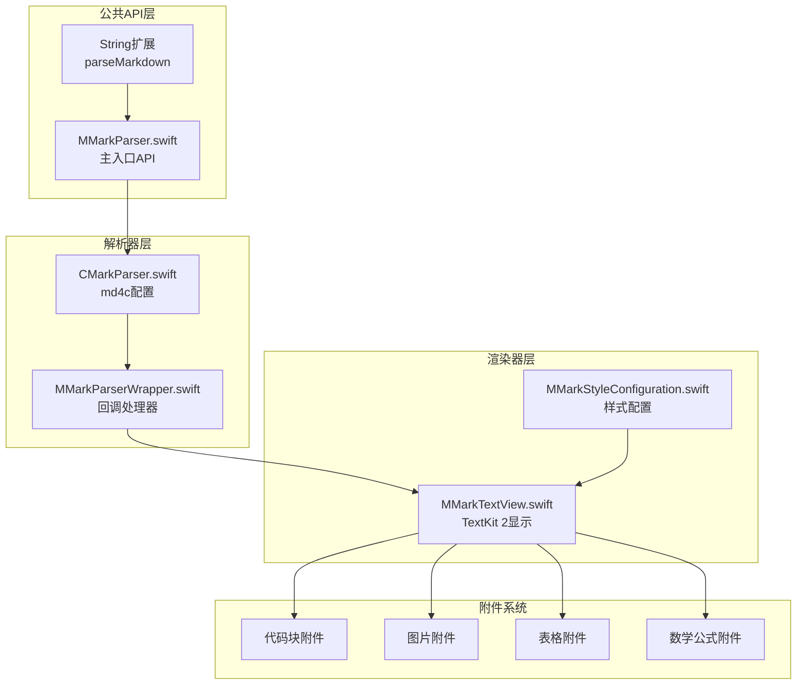
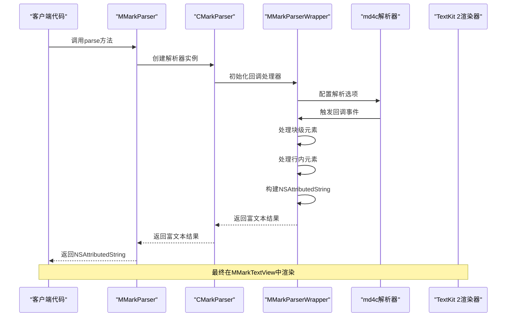
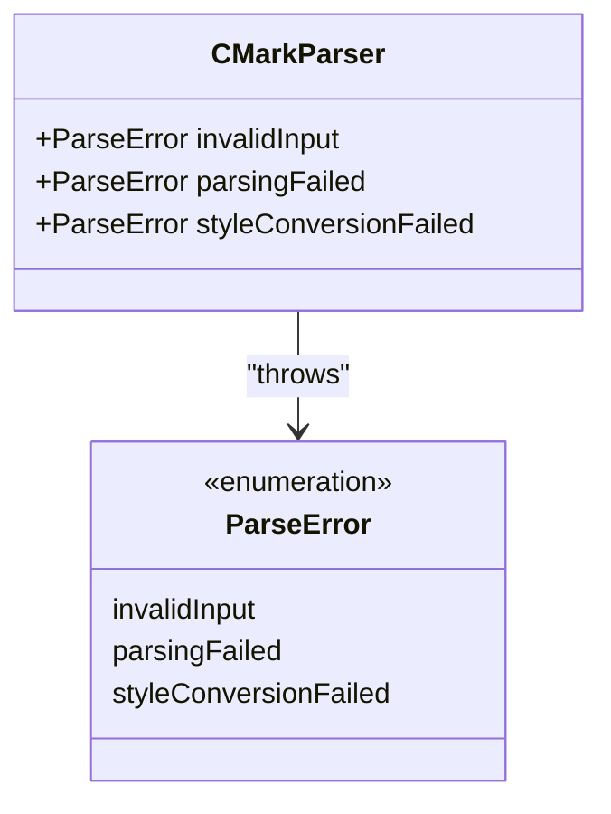
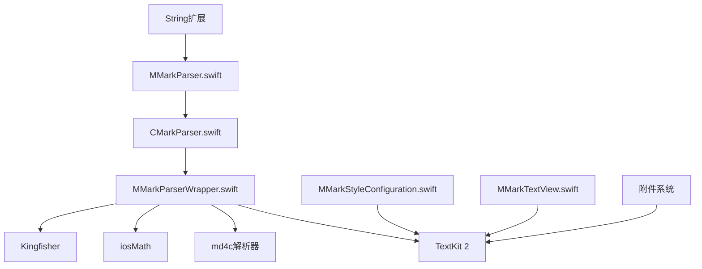

# 核心解析API

<cite>
**本文档引用的文件**
- [MMarkParser.swift](file://MMarkParser/Sources/MMarkParser.swift)
- [CMarkParser.swift](file://MMarkParser/Sources/Parser/CMarkParser.swift)
- [MMarkParserWrapper.swift](file://MMarkParser/Sources/Parser/MMarkParserWrapper.swift)
- [MMarkStyleConfiguration.swift](file://MMarkParser/Sources/Renderer/MMarkStyleConfiguration.swift)
- [README.md](file://README.md)
- [ViewController.swift](file://cocoapod_demo/cocoapod_demo/ViewController.swift)
- [SampleMarkdown.swift](file://cocoapod_demo/cocoapod_demo/SampleMarkdown.swift)
</cite>

## 目录
1. [简介](#简介)
2. [项目结构](#项目结构)
3. [核心组件](#核心组件)
4. [架构概览](#架构概览)
5. [详细组件分析](#详细组件分析)
6. [依赖关系分析](#依赖关系分析)
7. [性能考虑](#性能考虑)
8. [故障排除指南](#故障排除指南)
9. [结论](#结论)

## 简介

MMarkParser是一个基于iOS 15+ TextKit 2构建的Markdown解析和渲染引擎，专为iOS平台设计。该库提供了完整的GFM（GitHub Flavored Markdown）支持，包括标准Markdown元素、GFM扩展、LaTeX数学公式渲染、语法高亮、脚注等功能。

## 项目结构

MMarkParser采用模块化架构设计，主要分为以下几个核心模块：



**图表来源**
- [MMarkParser.swift:1-42](file://MMarkParser/Sources/MMarkParser.swift#L1-L42)
- [CMarkParser.swift:1-81](file://MMarkParser/Sources/Parser/CMarkParser.swift#L1-L81)
- [MMarkParserWrapper.swift:1-1446](file://MMarkParser/Sources/Parser/MMarkParserWrapper.swift#L1-L1446)

**章节来源**
- [README.md:108-212](file://README.md#L108-L212)

## 核心组件

### MMarkParser枚举

MMarkParser是一个静态枚举，提供统一的解析入口点。它包含以下核心功能：

- **默认样式配置**：提供GFM默认样式的访问
- **解析方法**：将Markdown字符串转换为富文本
- **便利扩展**：String类型的便捷解析方法

### CMarkParser类

CMarkParser是底层解析器实现，负责：
- md4c解析器的配置和初始化
- 解析选项的设置和管理
- Markdown到NSAttributedString的转换

### MMarkStyleConfiguration结构

样式配置系统提供了全面的自定义能力：
- 标题样式（H1-H6）
- 段落和代码样式
- 链接、引用块、列表样式
- 表格、任务列表、数学公式样式
- 脚注样式配置

**章节来源**
- [MMarkParser.swift:5-41](file://MMarkParser/Sources/MMarkParser.swift#L5-L41)
- [CMarkParser.swift:7-67](file://MMarkParser/Sources/Parser/CMarkParser.swift#L7-L67)
- [MMarkStyleConfiguration.swift:11-148](file://MMarkParser/Sources/Renderer/MMarkStyleConfiguration.swift#L11-L148)

## 架构概览

MMarkParser采用回调驱动的解析架构，基于md4c的SAX模型：



**图表来源**
- [MMarkParser.swift:18-26](file://MMarkParser/Sources/MMarkParser.swift#L18-L26)
- [CMarkParser.swift:55-66](file://MMarkParser/Sources/Parser/CMarkParser.swift#L55-L66)
- [MMarkParserWrapper.swift:16-1266](file://MMarkParser/Sources/Parser/MMarkParserWrapper.swift#L16-L1266)

## 详细组件分析

### MMarkParser静态API

#### 主解析方法

**方法签名**
```swift
public static func parse(
    markdown: String,
    configuration: MMarkStyleConfiguration = .defaultStyle,
    containerWidth: CGFloat
) throws -> NSAttributedString
```

**参数说明**
- `markdown`: 输入的Markdown字符串
- `configuration`: 样式配置对象，默认使用GFM默认样式
- `containerWidth`: 文本容器的可用宽度

**返回值**
- `NSAttributedString`: 完全样式化的富文本对象

**异常处理**
- `ParseError.invalidInput`: 输入为空或无效
- `ParseError.parsingFailed`: 解析过程中发生错误
- `ParseError.styleConversionFailed`: 样式转换失败

#### String扩展便利方法

**方法签名**
```swift
public func parseMarkdown(
    configuration: MMarkStyleConfiguration = .defaultStyle,
    containerWidth: CGFloat
) -> NSAttributedString
```

**使用便利性**
- 提供链式调用的便捷接口
- 内置错误处理，失败时返回原始字符串
- 保持与主API一致的行为

**章节来源**
- [MMarkParser.swift:18-41](file://MMarkParser/Sources/MMarkParser.swift#L18-L41)

### CMarkParser配置系统

#### 解析选项枚举

CMarkParser支持多种GFM扩展功能：

| 选项 | 描述 | 默认状态 |
|------|------|----------|
| `default` | 默认选项 | 关闭 |
| `table` | GFM表格支持 | 关闭 |
| `strikethrough` | 删除线 | 关闭 |
| `taskLists` | 任务列表 | 关闭 |
| `autolinks` | 自动链接（URL、邮箱、www） | 关闭 |
| `latexMath` | LaTeX数学公式 | 关闭 |
| `footnotes` | GFM脚注 | 关闭 |
| `hardBreaks` | 硬换行 | 关闭 |

#### 初始化配置

**构造函数**
```swift
public init(options: ParseOptions = .gfm)
```

**默认行为**
- 使用`.gfm`选项启用所有兼容的GFM扩展
- 支持md4c的完整功能集

**章节来源**
- [CMarkParser.swift:14-53](file://MMarkParser/Sources/Parser/CMarkParser.swift#L14-L53)

### 样式配置系统

#### 核心样式类型

**标题样式**
```swift
public struct HeadingStyle {
    public var font: UIFont
    public var textColor: UIColor
}
```

**代码样式**
```swift
public struct CodeStyle {
    public var font: UIFont
    public var textColor: UIColor
    public var backgroundColor: UIColor
}
```

**链接样式**
```swift
public struct LinkStyle {
    public var textColor: UIColor
    public var underlineStyle: NSUnderlineStyle
}
```

**列表样式**
```swift
public struct OrderedListStyle {
    public var mode: ListMarkerMode
    public var font: UIFont
    public var textColor: UIColor
    public var image: UIImage?
    public var imageSize: CGSize
}

public struct UnorderedListStyle {
    public var mode: ListMarkerMode
    public var font: UIFont
    public var textColor: UIColor
    public var image: UIImage?
    public var secondaryImage: UIImage?
    public var imageSize: CGSize
}
```

**章节来源**
- [MMarkStyleConfiguration.swift:13-186](file://MMarkParser/Sources/Renderer/MMarkStyleConfiguration.swift#L13-L186)

### 错误处理机制

#### 解析错误类型



**图表来源**
- [CMarkParser.swift:8-12](file://CMarkParser/Sources/Parser/CMarkParser.swift#L8-L12)

#### 错误处理策略

1. **输入验证**：检查空字符串和无效输入
2. **解析保护**：md4c解析失败时的错误捕获
3. **样式转换**：样式配置转换过程中的异常处理
4. **回退机制**：String扩展的优雅降级

**章节来源**
- [CMarkParser.swift:55-66](file://MMarkParser/Sources/Parser/CMarkParser.swift#L55-L66)

## 依赖关系分析



**图表来源**
- [README.md:36-39](file://README.md#L36-L39)
- [MMarkParser.swift:1-42](file://MMarkParser/Sources/MMarkParser.swift#L1-L42)

**章节来源**
- [README.md:36-39](file://README.md#L36-L39)

## 性能考虑

### 解析性能优化

1. **回调驱动解析**：避免AST树构建，直接增量生成NSAttributedString
2. **内存管理**：使用栈局部状态，避免全局可变状态
3. **属性栈**：高效的样式上下文管理
4. **懒加载附件**：TextKit 2附件的延迟视图创建

### 渲染性能优化

1. **TextKit 2集成**：利用现代布局引擎
2. **附件缓存**：图片和数学公式的缓存机制
3. **增量更新**：支持流式文本视图
4. **硬件加速**：充分利用iOS图形硬件

## 故障排除指南

### 常见问题及解决方案

#### 解析失败
**症状**：抛出`ParseError.parsingFailed`
**原因**：md4c解析器返回非零状态码
**解决**：检查Markdown语法，确保格式正确

#### 样式转换错误
**症状**：抛出`ParseError.styleConversionFailed`
**原因**：样式配置无效或资源加载失败
**解决**：验证样式配置的完整性

#### 内存问题
**症状**：大文档解析时内存占用过高
**解决**：使用流式解析器，合理设置容器宽度

#### 图片加载失败
**症状**：远程图片无法显示
**原因**：网络问题或Kingfisher配置错误
**解决**：检查网络连接，验证URL有效性

**章节来源**
- [MMarkParserWrapper.swift:1427-1432](file://MMarkParser/Sources/Parser/MMarkParserWrapper.swift#L1427-L1432)

## 结论

MMarkParser提供了iOS平台上功能完整、性能优异的Markdown解析和渲染解决方案。其基于回调驱动的架构设计、丰富的样式配置系统和完善的错误处理机制，使其成为iOS应用中集成Markdown内容的理想选择。

通过统一的API接口和灵活的配置选项，开发者可以轻松地在应用中实现高质量的Markdown内容展示，同时享受现代化TextKit 2带来的流畅用户体验。