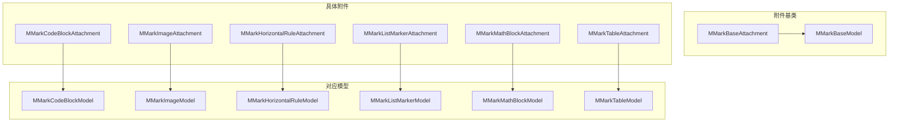
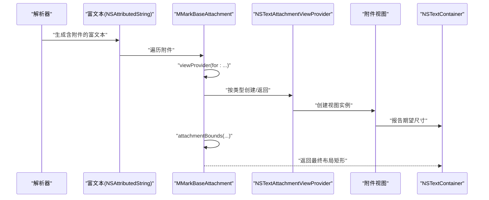
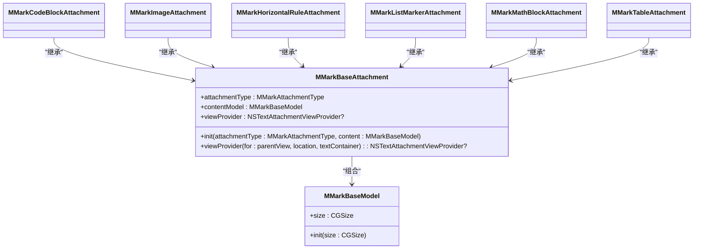
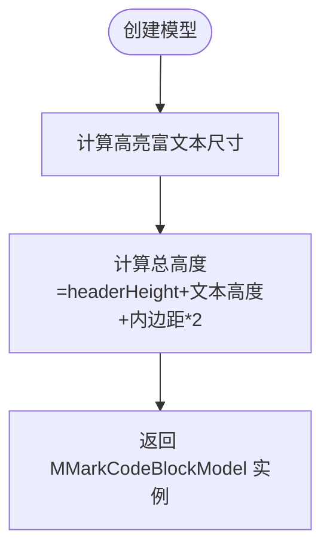
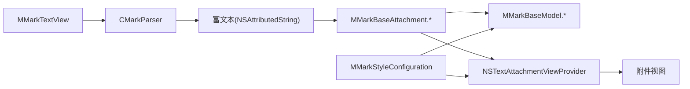

# 附件API

<cite>
**本文档引用的文件**
- [MMarkBaseAttachment.swift](file://MMarkParser/Sources/Renderer/Attachments/MMarkBaseAttachment/MMarkBaseAttachment.swift)
- [MMarkBaseModel.swift](file://MMarkParser/Sources/Renderer/Attachments/MMarkBaseAttachment/MMarkBaseModel.swift)
- [MMarkCodeBlockAttachment.swift](file://MMarkParser/Sources/Renderer/Attachments/MMarkCodeBlockAttachment/MMarkCodeBlockAttachment.swift)
- [MMarkCodeBlockModel.swift](file://MMarkParser/Sources/Renderer/Attachments/MMarkCodeBlockAttachment/MMarkCodeBlockModel.swift)
- [MMarkImageAttachment.swift](file://MMarkParser/Sources/Renderer/Attachments/MMarkImageAttachment/MMarkImageAttachment.swift)
- [MMarkImageModel.swift](file://MMarkParser/Sources/Renderer/Attachments/MMarkImageAttachment/MMarkImageModel.swift)
- [MMarkHorizontalRuleAttachment.swift](file://MMarkParser/Sources/Renderer/Attachments/MMarkHorizontalRuleAttachment/MMarkHorizontalRuleAttachment.swift)
- [MMarkHorizontalRuleModel.swift](file://MMarkParser/Sources/Renderer/Attachments/MMarkHorizontalRuleAttachment/MMarkHorizontalRuleModel.swift)
- [MMarkListMarkerAttachment.swift](file://MMarkParser/Sources/Renderer/Attachments/MMarkListMarkerAttachment/MMarkListMarkerAttachment.swift)
- [MMarkListMarkerModel.swift](file://MMarkParser/Sources/Renderer/Attachments/MMarkListMarkerAttachment/MMarkListMarkerModel.swift)
- [MMarkMathBlockAttachment.swift](file://MMarkParser/Sources/Renderer/Attachments/MMarkMathBlockAttachment/MMarkMathBlockAttachment.swift)
- [MMarkMathBlockModel.swift](file://MMarkParser/Sources/Renderer/Attachments/MMarkMathBlockAttachment/MMarkMathBlockModel.swift)
- [MMarkTableAttachment.swift](file://MMarkParser/Sources/Renderer/Attachments/MMarkTableAttachment/MMarkTableAttachment.swift)
- [MMarkTableModel.swift](file://MMarkParser/Sources/Renderer/Attachments/MMarkTableAttachment/MMarkTableModel.swift)
- [MMarkStyleConfiguration.swift](file://MMarkParser/Sources/Renderer/MMarkStyleConfiguration.swift)
- [MMarkTextView.swift](file://MMarkParser/Sources/Renderer/MMarkTextView.swift)
</cite>

## 目录
1. [简介](#简介)
2. [项目结构](#项目结构)
3. [核心组件](#核心组件)
4. [架构总览](#架构总览)
5. [详细组件分析](#详细组件分析)
6. [依赖关系分析](#依赖关系分析)
7. [性能考虑](#性能考虑)
8. [故障排查指南](#故障排查指南)
9. [结论](#结论)
10. [附录](#附录)

## 简介
本文件为 MMarkParser 的“附件系统”API 参考文档，聚焦于 MMarkBaseAttachment 抽象基类及其派生附件类型（代码块、图片、水平分隔线、列表标记、数学公式、表格）的公共接口、数据模型、生命周期与渲染集成方式。文档同时提供扩展开发指南、性能优化建议与架构扩展点说明，帮助开发者正确使用与扩展附件系统。

## 项目结构
附件系统位于渲染层的“附件”子模块中，采用“基类 + 具体附件 + 对应模型”的分层组织方式。每个附件类型均继承自 MMarkBaseAttachment，并通过 MMarkBaseModel 或其子类持有渲染所需的数据与尺寸信息；附件在需要时由对应的 ViewProvider 提供视图实例。

图表来源
- [MMarkBaseAttachment.swift:12-59](file://MMarkParser/Sources/Renderer/Attachments/MMarkBaseAttachment/MMarkBaseAttachment.swift#L12-L59)
- [MMarkBaseModel.swift:3-9](file://MMarkParser/Sources/Renderer/Attachments/MMarkBaseAttachment/MMarkBaseModel.swift#L3-L9)
- [MMarkCodeBlockAttachment.swift:6-21](file://MMarkParser/Sources/Renderer/Attachments/MMarkCodeBlockAttachment/MMarkCodeBlockAttachment.swift#L6-L21)
- [MMarkImageAttachment.swift:5-22](file://MMarkParser/Sources/Renderer/Attachments/MMarkImageAttachment/MMarkImageAttachment.swift#L5-L22)
- [MMarkHorizontalRuleAttachment.swift:6-37](file://MMarkParser/Sources/Renderer/Attachments/MMarkHorizontalRuleAttachment/MMarkHorizontalRuleAttachment.swift#L6-L37)
- [MMarkListMarkerAttachment.swift:5-17](file://MMarkParser/Sources/Renderer/Attachments/MMarkListMarkerAttachment/MMarkListMarkerAttachment.swift#L5-L17)
- [MMarkMathBlockAttachment.swift:5-22](file://MMarkParser/Sources/Renderer/Attachments/MMarkMathBlockAttachment/MMarkMathBlockAttachment.swift#L5-L22)
- [MMarkTableAttachment.swift:5-22](file://MMarkParser/Sources/Renderer/Attachments/MMarkTableAttachment/MMarkTableAttachment.swift#L5-L22)

章节来源
- [MMarkBaseAttachment.swift:12-59](file://MMarkParser/Sources/Renderer/Attachments/MMarkBaseAttachment/MMarkBaseAttachment.swift#L12-L59)
- [MMarkBaseModel.swift:3-9](file://MMarkParser/Sources/Renderer/Attachments/MMarkBaseAttachment/MMarkBaseModel.swift#L3-L9)

## 核心组件
本节聚焦 MMarkBaseAttachment 抽象基类与 MMarkBaseModel 基础模型的公共接口与职责。

- MMarkAttachmentType 枚举
  - 用途：标识附件类型，用于在基类中按类型选择对应的 ViewProvider。
  - 类型值：codeBlock、horizontalRule、image、listMarker、mathBlock、table。

- MMarkBaseAttachment
  - 继承自 NSTextAttachment，作为所有附件类型的统一抽象。
  - 关键属性
    - attachmentType：附件类型枚举。
    - contentModel：附件内容模型，类型为 MMarkBaseModel 或其子类。
    - viewProvider：可选的视图提供者，用于延迟创建与缓存视图。
  - 关键方法
    - init(attachmentType:content:)：构造函数，设置类型与内容模型。
    - viewProvider(for:location:textContainer:)：按类型返回或创建对应的 ViewProvider；若未显式设置则按类型分支创建。
  - 设计要点
    - 将“类型识别”与“视图提供者创建”解耦，便于扩展新附件类型。
    - 支持外部注入 viewProvider，以实现自定义渲染或缓存策略。

- MMarkBaseModel
  - 作用：承载附件的尺寸信息，作为所有附件模型的基础。
  - 关键属性
    - size：CGSize，表示附件的布局尺寸。
  - 关键方法
    - init(size:)：初始化尺寸。

章节来源
- [MMarkBaseAttachment.swift:3-10](file://MMarkParser/Sources/Renderer/Attachments/MMarkBaseAttachment/MMarkBaseAttachment.swift#L3-L10)
- [MMarkBaseAttachment.swift:12-59](file://MMarkParser/Sources/Renderer/Attachments/MMarkBaseAttachment/MMarkBaseAttachment.swift#L12-L59)
- [MMarkBaseModel.swift:3-9](file://MMarkParser/Sources/Renderer/Attachments/MMarkBaseAttachment/MMarkBaseModel.swift#L3-L9)

## 架构总览
附件系统围绕“模型驱动 + 视图提供者 + 文本容器集成”的架构展开。解析器生成包含附件的富文本，渲染器通过 NSTextAttachmentViewProvider 为每个附件创建视图；视图大小由附件的 attachmentBounds 计算，受容器宽度与模型尺寸约束。

图表来源
- [MMarkBaseAttachment.swift:32-58](file://MMarkParser/Sources/Renderer/Attachments/MMarkBaseAttachment/MMarkBaseAttachment.swift#L32-L58)
- [MMarkTextView.swift:40-49](file://MMarkParser/Sources/Renderer/MMarkTextView.swift#L40-L49)

## 详细组件分析

### MMarkBaseAttachment 与 MMarkBaseModel
- 类关系
  - MMarkBaseAttachment 组合 MMarkBaseModel，通过 contentModel 暴露运行时类型转换后的强类型模型。
  - 子类通过强制转换访问各自模型的特有属性。

图表来源
- [MMarkBaseAttachment.swift:12-59](file://MMarkParser/Sources/Renderer/Attachments/MMarkBaseAttachment/MMarkBaseAttachment.swift#L12-L59)
- [MMarkBaseModel.swift:3-9](file://MMarkParser/Sources/Renderer/Attachments/MMarkBaseAttachment/MMarkBaseModel.swift#L3-L9)
- [MMarkCodeBlockAttachment.swift:6-21](file://MMarkParser/Sources/Renderer/Attachments/MMarkCodeBlockAttachment/MMarkCodeBlockAttachment.swift#L6-L21)
- [MMarkImageAttachment.swift:5-22](file://MMarkParser/Sources/Renderer/Attachments/MMarkImageAttachment/MMarkImageAttachment.swift#L5-L22)
- [MMarkHorizontalRuleAttachment.swift:6-37](file://MMarkParser/Sources/Renderer/Attachments/MMarkHorizontalRuleAttachment/MMarkHorizontalRuleAttachment.swift#L6-L37)
- [MMarkListMarkerAttachment.swift:5-17](file://MMarkParser/Sources/Renderer/Attachments/MMarkListMarkerAttachment/MMarkListMarkerAttachment.swift#L5-L17)
- [MMarkMathBlockAttachment.swift:5-22](file://MMarkParser/Sources/Renderer/Attachments/MMarkMathBlockAttachment/MMarkMathBlockAttachment.swift#L5-L22)
- [MMarkTableAttachment.swift:5-22](file://MMarkParser/Sources/Renderer/Attachments/MMarkTableAttachment/MMarkTableAttachment.swift#L5-L22)

章节来源
- [MMarkBaseAttachment.swift:12-59](file://MMarkParser/Sources/Renderer/Attachments/MMarkBaseAttachment/MMarkBaseAttachment.swift#L12-L59)
- [MMarkBaseModel.swift:3-9](file://MMarkParser/Sources/Renderer/Attachments/MMarkBaseAttachment/MMarkBaseModel.swift#L3-L9)

### 代码块附件（MMarkCodeBlockAttachment）
- 模型（MMarkCodeBlockModel）
  - 属性：代码文本宽高、高亮后的富文本、语言标识、原始代码字符串、尺寸。
  - 工厂方法：根据语言、代码与容器宽度计算尺寸并创建模型。
- 附件（MMarkCodeBlockAttachment）
  - 强类型访问：model 属性返回 MMarkCodeBlockModel。
  - 尺寸约束：attachmentBounds 将宽度限制在行片段宽度范围内，避免裁剪。

图表来源
- [MMarkCodeBlockModel.swift:23-44](file://MMarkParser/Sources/Renderer/Attachments/MMarkCodeBlockAttachment/MMarkCodeBlockModel.swift#L23-L44)

章节来源
- [MMarkCodeBlockAttachment.swift:6-21](file://MMarkParser/Sources/Renderer/Attachments/MMarkCodeBlockAttachment/MMarkCodeBlockAttachment.swift#L6-L21)
- [MMarkCodeBlockModel.swift:6-46](file://MMarkParser/Sources/Renderer/Attachments/MMarkCodeBlockAttachment/MMarkCodeBlockModel.swift#L6-L46)

### 图片附件（MMarkImageAttachment）
- 模型（MMarkImageModel）
  - 属性：URL、替代文本、占位符颜色、真实尺寸（可选）。
  - 工厂方法：根据容器宽度与固定宽高比（4:3）创建模型。
- 附件（MMarkImageAttachment）
  - 强类型访问：url、alt。
  - 尺寸计算：按容器宽度等比缩放高度，保证显示比例一致。

章节来源
- [MMarkImageAttachment.swift:5-22](file://MMarkParser/Sources/Renderer/Attachments/MMarkImageAttachment/MMarkImageAttachment.swift#L5-L22)
- [MMarkImageModel.swift:6-27](file://MMarkParser/Sources/Renderer/Attachments/MMarkImageAttachment/MMarkImageModel.swift#L6-L27)

### 水平分隔线附件（MMarkHorizontalRuleAttachment）
- 模型（MMarkHorizontalRuleModel）
  - 属性：规则配置（高度、颜色、上下内边距）。
  - 工厂方法：根据容器宽度创建模型。
- 附件（MMarkHorizontalRuleAttachment）
  - 初始化：允许文本附件视图，创建透明占位图以触发视图创建。
  - 尺寸计算：在最小宽度与容器宽度之间取值，确保稳定布局。

章节来源
- [MMarkHorizontalRuleAttachment.swift:6-37](file://MMarkParser/Sources/Renderer/Attachments/MMarkHorizontalRuleAttachment/MMarkHorizontalRuleAttachment.swift#L6-L37)
- [MMarkHorizontalRuleModel.swift:6-27](file://MMarkParser/Sources/Renderer/Attachments/MMarkHorizontalRuleAttachment/MMarkHorizontalRuleModel.swift#L6-L27)

### 列表标记附件（MMarkListMarkerAttachment）
- 模型（MMarkListMarkerModel）
  - 属性：图像、绘制边界。
- 附件（MMarkListMarkerAttachment）
  - 强类型访问：model 返回 MMarkListMarkerModel。
  - 尺寸计算：直接返回模型中的 bounds。

章节来源
- [MMarkListMarkerAttachment.swift:5-17](file://MMarkParser/Sources/Renderer/Attachments/MMarkListMarkerAttachment/MMarkListMarkerAttachment.swift#L5-L17)
- [MMarkListMarkerModel.swift:6-16](file://MMarkParser/Sources/Renderer/Attachments/MMarkListMarkerAttachment/MMarkListMarkerModel.swift#L6-L16)

### 数学公式块附件（MMarkMathBlockAttachment）
- 模型（MMarkMathBlockModel）
  - 属性：LaTeX 字符串、文本宽高、尺寸。
  - 工厂方法：在主线程创建 MTMathUILabel 计算尺寸，结合配置计算总尺寸。
- 附件（MMarkMathBlockAttachment）
  - 强类型访问：model、latex。
  - 尺寸约束：与代码块类似，限制在行片段宽度内，避免裁剪。

章节来源
- [MMarkMathBlockAttachment.swift:5-22](file://MMarkParser/Sources/Renderer/Attachments/MMarkMathBlockAttachment/MMarkMathBlockAttachment.swift#L5-L22)
- [MMarkMathBlockModel.swift:7-48](file://MMarkParser/Sources/Renderer/Attachments/MMarkMathBlockAttachment/MMarkMathBlockModel.swift#L7-L48)

### 表格附件（MMarkTableAttachment）
- 模型（MMarkTableModel）
  - 属性：列宽数组、行高数组、表头单元、数据行、对齐数组、表格配置。
  - 工厂方法：根据表头与数据行计算列宽与行高，累加得到总尺寸。
- 附件（MMarkTableAttachment）
  - 强类型访问：headerCells、dataRows、alignments。
  - 尺寸约束：与代码块类似，限制在行片段宽度内。

章节来源
- [MMarkTableAttachment.swift:5-22](file://MMarkParser/Sources/Renderer/Attachments/MMarkTableAttachment/MMarkTableAttachment.swift#L5-L22)
- [MMarkTableModel.swift:6-75](file://MMarkParser/Sources/Renderer/Attachments/MMarkTableAttachment/MMarkTableModel.swift#L6-L75)

### 与文本渲染器的集成
- MMarkTextView
  - 作用：基于 UITextView 的渲染容器，负责设置富文本、处理链接点击、更新引用块竖条。
  - 关键点
    - setMarkdown：调用解析器生成富文本后赋给 attributedText。
    - contentSize 变更回调：在 TextKit 2 布局完成后异步更新引用块竖条。
    - 注册通用视图提供者：确保附件视图可用。

章节来源
- [MMarkTextView.swift:6-62](file://MMarkParser/Sources/Renderer/MMarkTextView.swift#L6-L62)
- [MMarkTextView.swift:39-49](file://MMarkParser/Sources/Renderer/MMarkTextView.swift#L39-L49)

## 依赖关系分析
- 组件耦合
  - 附件与模型强关联：通过 contentModel 解耦渲染逻辑与数据。
  - 视图提供者按类型绑定：MMarkBaseAttachment 在 viewProvider 中按枚举分支创建。
  - 渲染器依赖：MMarkTextView 作为宿主容器，负责富文本与附件视图的生命周期管理。
- 外部依赖
  - iOS 15 TextKit 2：依赖 NSTextAttachmentViewProvider 与文本容器布局能力。
  - iosMath：数学公式渲染依赖 MTMathUILabel。
  - 主题配置：MMarkStyleConfiguration 提供全局样式参数，影响模型工厂方法与视图配置。

图表来源
- [MMarkTextView.swift:40-49](file://MMarkParser/Sources/Renderer/MMarkTextView.swift#L40-L49)
- [MMarkBaseAttachment.swift:32-58](file://MMarkParser/Sources/Renderer/Attachments/MMarkBaseAttachment/MMarkBaseAttachment.swift#L32-L58)
- [MMarkStyleConfiguration.swift:109-141](file://MMarkParser/Sources/Renderer/MMarkStyleConfiguration.swift#L109-L141)

章节来源
- [MMarkTextView.swift:6-62](file://MMarkParser/Sources/Renderer/MMarkTextView.swift#L6-L62)
- [MMarkBaseAttachment.swift:12-59](file://MMarkParser/Sources/Renderer/Attachments/MMarkBaseAttachment/MMarkBaseAttachment.swift#L12-L59)
- [MMarkStyleConfiguration.swift:109-141](file://MMarkParser/Sources/Renderer/MMarkStyleConfiguration.swift#L109-L141)

## 性能考虑
- 视图提供者缓存
  - 建议在 MMarkBaseAttachment 中缓存 viewProvider，避免重复创建与布局抖动。
- 尺寸计算与布局
  - 附件的 attachmentBounds 应尽量使用容器宽度与模型尺寸进行约束，减少不必要的重排。
  - 代码块、数学公式与表格的工厂方法已内置尺寸计算，建议复用模型工厂以保持一致性。
- 主线程渲染
  - 数学公式渲染需在主线程执行，注意避免阻塞 UI；可考虑在后台预计算尺寸并缓存结果。
- 占位图与透明占位
  - 水平分隔线通过透明占位图触发视图创建，避免在非主线程访问屏幕信息，提升稳定性。
- 样式配置
  - 使用 MMarkStyleConfiguration 统一管理样式参数，减少重复计算与状态散落。

## 故障排查指南
- 运行时类型转换失败
  - 现象：访问强类型 model 时触发断言。
  - 原因：contentModel 与附件类型不匹配。
  - 处理：确保创建附件时传入与其类型匹配的模型实例。
- 视图未显示或尺寸异常
  - 现象：附件不可见或被裁剪。
  - 排查：检查 attachmentBounds 的宽度约束是否合理；确认容器宽度与模型 size 的关系。
- 数学公式渲染卡顿
  - 现象：首次渲染耗时较长。
  - 排查：确认已在主线程执行；考虑预热渲染或缓存高亮结果。
- 链接点击无效
  - 现象：点击链接无响应。
  - 排查：确认 MMarkTextView 的链接委托已设置且 handleCommonLink 返回允许交互。

章节来源
- [MMarkCodeBlockAttachment.swift:15-20](file://MMarkParser/Sources/Renderer/Attachments/MMarkCodeBlockAttachment/MMarkCodeBlockAttachment.swift#L15-L20)
- [MMarkMathBlockModel.swift:25-39](file://MMarkParser/Sources/Renderer/Attachments/MMarkMathBlockAttachment/MMarkMathBlockModel.swift#L25-L39)
- [MMarkHorizontalRuleAttachment.swift:21-26](file://MMarkParser/Sources/Renderer/Attachments/MMarkHorizontalRuleAttachment/MMarkHorizontalRuleAttachment.swift#L21-L26)
- [MMarkTextView.swift:68-71](file://MMarkParser/Sources/Renderer/MMarkTextView.swift#L68-L71)

## 结论
附件系统通过“基类 + 模型 + 视图提供者”的分层设计，实现了对多种 Markdown 附件类型的统一抽象与灵活扩展。遵循本文档的接口约定、生命周期管理与性能建议，可高效集成并扩展新的附件类型，同时保持渲染稳定性与可维护性。

## 附录

### 开发规范与扩展指南
- 新增附件类型步骤
  - 定义模型：继承 MMarkBaseModel，添加渲染所需字段。
  - 定义附件：继承 MMarkBaseAttachment，实现强类型 model 访问与 attachmentBounds。
  - 定义视图与视图提供者：实现 NSTextAttachmentViewProvider 与对应视图。
  - 在 MMarkBaseAttachment 的 viewProvider 分支中注册新类型。
  - 在模型工厂方法中补充样式配置来源（如需）。
- 生命周期管理
  - 创建：由解析器生成富文本时插入附件；附件通过 viewProvider 创建视图。
  - 销毁：随富文本释放或视图提供者回收；注意释放大对象（如高亮富文本、图片）。
- 渲染机制
  - 附件视图由 TextKit 2 在布局阶段请求；通过 attachmentBounds 返回期望尺寸。
  - 容器宽度变化时，重新计算尺寸并触发重绘。
- 性能优化与缓存策略
  - 缓存 viewProvider 与高亮富文本。
  - 将昂贵计算（如数学公式尺寸）移至后台并缓存。
  - 合理设置最小宽度与最大宽度，避免频繁重排。