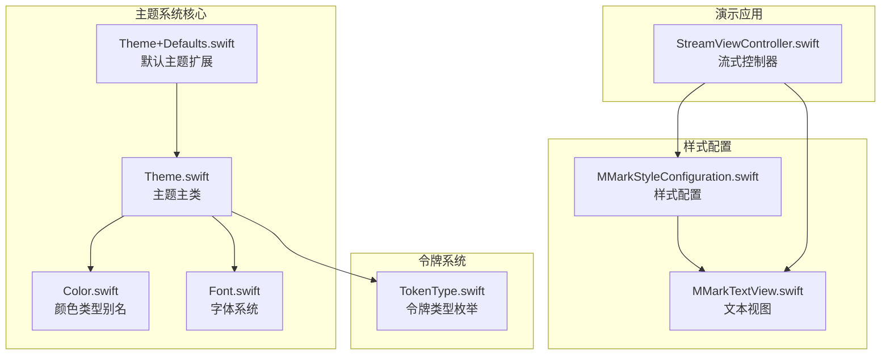
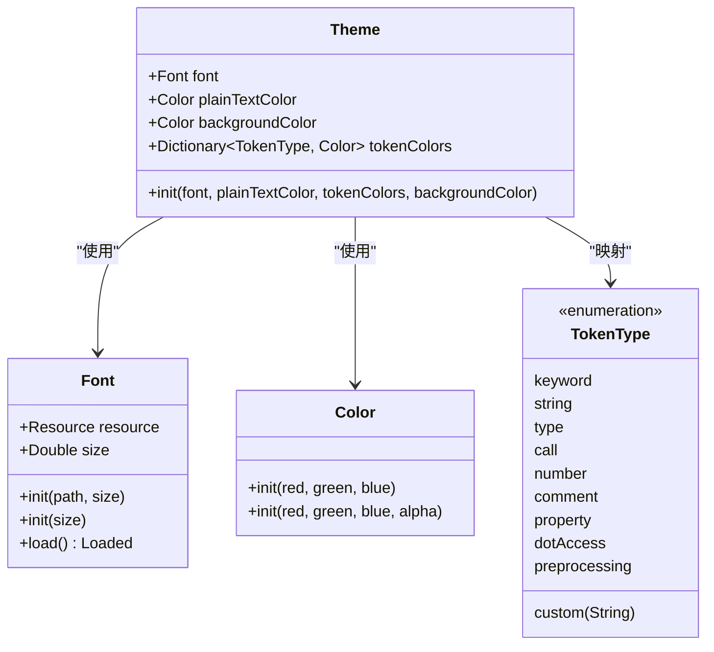
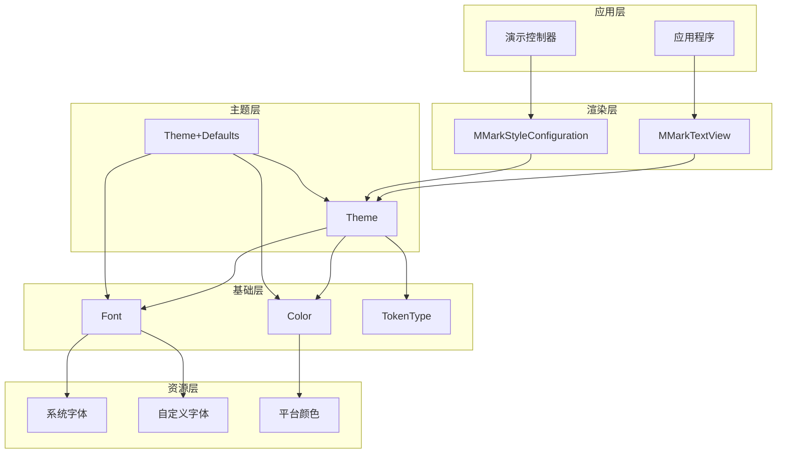
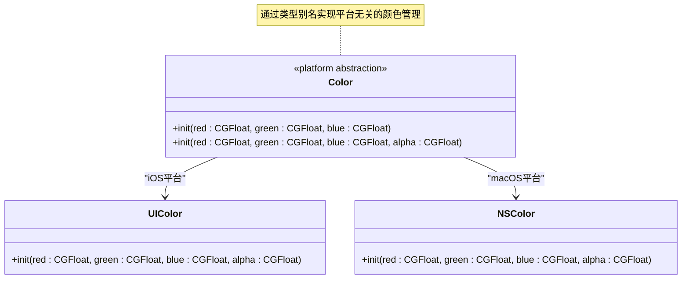
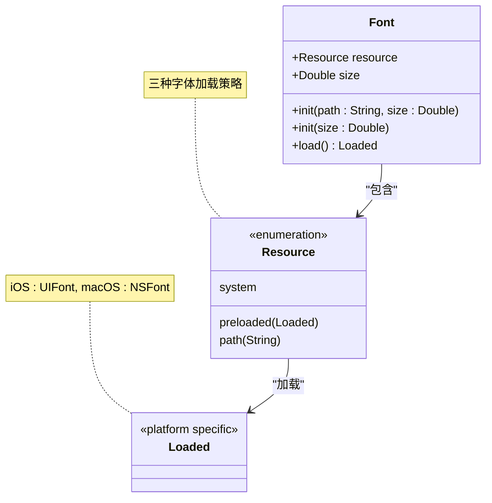
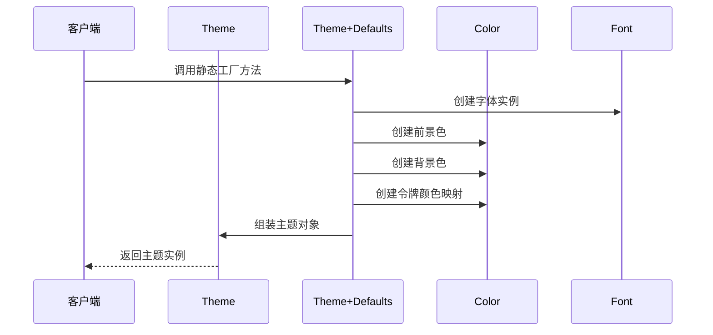
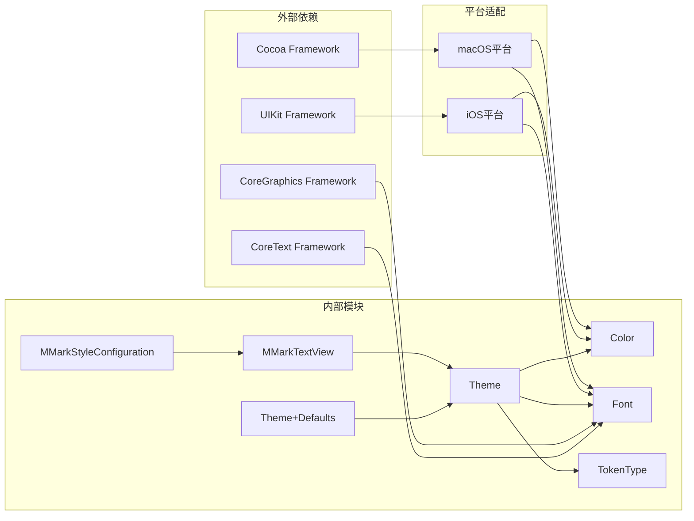

# 主题管理系统

<cite>
**本文档引用的文件**
- [Theme.swift](file://MMarkParser/Sources/Splash/Theming/Theme.swift)
- [Theme+Defaults.swift](file://MMarkParser/Sources/Splash/Theming/Theme+Defaults.swift)
- [Color.swift](file://MMarkParser/Sources/Splash/Theming/Color.swift)
- [Font.swift](file://MMarkParser/Sources/Splash/Theming/Font.swift)
- [TokenType.swift](file://MMarkParser/Sources/Splash/Tokenizing/TokenType.swift)
- [MMarkStyleConfiguration.swift](file://MMarkParser/Sources/Renderer/MMarkStyleConfiguration.swift)
- [MMarkTextView.swift](file://MMarkParser/Sources/Renderer/MMarkTextView.swift)
- [StreamViewController.swift](file://cocoapod_demo/cocoapod_demo/StreamViewController.swift)
</cite>

## 目录
1. [简介](#简介)
2. [项目结构](#项目结构)
3. [核心组件](#核心组件)
4. [架构概览](#架构概览)
5. [详细组件分析](#详细组件分析)
6. [依赖关系分析](#依赖关系分析)
7. [性能考虑](#性能考虑)
8. [故障排除指南](#故障排除指南)
9. [结论](#结论)

## 简介

MMarkParser的主题管理系统是一个高度模块化的视觉样式管理框架，专为跨平台Markdown渲染而设计。该系统提供了类型安全的颜色管理、灵活的字体系统，以及可扩展的主题配置机制。通过统一的颜色、字体和样式管理，确保了在iOS和macOS平台上的一致用户体验。

主题管理系统的核心价值在于其类型安全的设计理念，通过严格的类型约束确保颜色空间转换和字体度量计算的准确性，同时提供了丰富的默认主题选项和自定义扩展能力。

## 项目结构

主题管理系统位于项目的`Sources/Splash/Theming`目录下，采用模块化设计，每个组件都有明确的职责分工：

**图表来源**
- [Theme.swift:1-42](file://MMarkParser/Sources/Splash/Theming/Theme.swift#L1-L42)
- [Theme+Defaults.swift:1-182](file://MMarkParser/Sources/Splash/Theming/Theme+Defaults.swift#L1-L182)
- [Color.swift:1-22](file://MMarkParser/Sources/Splash/Theming/Color.swift#L1-L22)
- [Font.swift:1-104](file://MMarkParser/Sources/Splash/Theming/Font.swift#L1-L104)

**章节来源**
- [Theme.swift:1-42](file://MMarkParser/Sources/Splash/Theming/Theme.swift#L1-L42)
- [Theme+Defaults.swift:1-182](file://MMarkParser/Sources/Splash/Theming/Theme+Defaults.swift#L1-L182)
- [Color.swift:1-22](file://MMarkParser/Sources/Splash/Theming/Color.swift#L1-L22)
- [Font.swift:1-104](file://MMarkParser/Sources/Splash/Theming/Font.swift#L1-L104)

## 核心组件

### Theme 主题类

Theme是主题系统的核心数据结构，采用结构体设计，提供了类型安全的样式配置：

**图表来源**
- [Theme.swift:20-39](file://MMarkParser/Sources/Splash/Theming/Theme.swift#L20-L39)
- [Font.swift:15-34](file://MMarkParser/Sources/Splash/Theming/Font.swift#L15-L34)
- [Color.swift:16-21](file://MMarkParser/Sources/Splash/Theming/Color.swift#L16-L21)
- [TokenType.swift:10-31](file://MMarkParser/Sources/Splash/Tokenizing/TokenType.swift#L10-L31)

### 默认主题系统

Theme+Defaults扩展提供了多种预定义的主题方案，每种主题都针对特定的视觉风格进行了精心调优：

| 主题名称 | 平台支持 | 设计特点 | 使用场景 |
|---------|----------|----------|----------|
| sundellsColors | iOS/macOS | 匹配Xcode主题色彩 | 开发环境显示 |
| midnight | iOS/macOS | 深色主题，高对比度 | 夜间使用 |
| wwdc17/wwdc18 | iOS/macOS | Apple开发者大会主题 | 技术演示 |
| sunset | iOS/macOS | 暖色调主题 | 日落时光 |
| presentation | iOS/macOS | 纯白主题，简洁明快 | 报告展示 |

**章节来源**
- [Theme+Defaults.swift:11-179](file://MMarkParser/Sources/Splash/Theming/Theme+Defaults.swift#L11-L179)

## 架构概览

主题管理系统采用了分层架构设计，确保了良好的模块化和可扩展性：

**图表来源**
- [MMarkTextView.swift:6-81](file://MMarkParser/Sources/Renderer/MMarkTextView.swift#L6-L81)
- [MMarkStyleConfiguration.swift:11-339](file://MMarkParser/Sources/Renderer/MMarkStyleConfiguration.swift#L11-L339)
- [Theme.swift:20-39](file://MMarkParser/Sources/Splash/Theming/Theme.swift#L20-L39)

## 详细组件分析

### 颜色管理系统

Color系统通过平台抽象实现了类型安全的颜色管理：

#### 类型安全设计

**图表来源**
- [Color.swift:7-21](file://MMarkParser/Sources/Splash/Theming/Color.swift#L7-L21)

#### 颜色空间转换

颜色系统支持RGB颜色空间的直接转换，通过统一的初始化方法确保颜色值的有效性（0.0-1.0范围）。

**章节来源**
- [Color.swift:16-21](file://MMarkParser/Sources/Splash/Theming/Color.swift#L16-L21)

### 字体系统设计

Font系统提供了灵活的字体加载机制，支持多种字体资源类型：

#### 字体资源类型

**图表来源**
- [Font.swift:36-46](file://MMarkParser/Sources/Splash/Theming/Font.swift#L36-L46)
- [Font.swift:87-103](file://MMarkParser/Sources/Splash/Theming/Font.swift#L87-L103)

#### 字体度量计算

字体系统内置了智能的度量计算机制，能够根据不同的平台和字体资源自动选择最优的渲染方案。

**章节来源**
- [Font.swift:48-83](file://MMarkParser/Sources/Splash/Theming/Font.swift#L48-L83)

### 主题令牌映射

令牌系统为语法高亮提供了精确的颜色映射机制：

#### 令牌类型定义

| 令牌类型 | 描述 | 示例 |
|---------|------|------|
| keyword | 关键字 | if, class, let, func |
| string | 字符串字面量 | "Hello World" |
| type | 类型引用 | String, Int, Array |
| call | 函数调用 | print(), viewDidLoad() |
| number | 数字常量 | 42, 3.14, 0xFF |
| comment | 注释 | // 单行注释, /* 多行注释 */ |
| property | 属性访问 | object.property |
| dotAccess | 点符号访问 | .myCase |
| preprocessing | 预处理指令 | #if, #available |
| custom | 自定义令牌 | 用户定义的令牌类型 |

**章节来源**
- [TokenType.swift:10-31](file://MMarkParser/Sources/Splash/Tokenizing/TokenType.swift#L10-L31)

### 默认主题实现

默认主题系统提供了多种预设方案，每种主题都经过精心设计以适应不同的使用场景：

#### 主题创建流程

**图表来源**
- [Theme+Defaults.swift:13-38](file://MMarkParser/Sources/Splash/Theming/Theme+Defaults.swift#L13-L38)

**章节来源**
- [Theme+Defaults.swift:11-179](file://MMarkParser/Sources/Splash/Theming/Theme+Defaults.swift#L11-L179)

## 依赖关系分析

主题系统的依赖关系体现了清晰的分层架构：

**图表来源**
- [Theme.swift:9-13](file://MMarkParser/Sources/Splash/Theming/Theme.swift#L9-L13)
- [Font.swift:7-8](file://MMarkParser/Sources/Splash/Theming/Font.swift#L7-L8)

### 耦合度分析

主题系统展现了良好的内聚性和低耦合性：

- **Theme与Color/Font的耦合**：通过协议和接口实现松散耦合
- **平台特定代码分离**：使用条件编译隔离iOS和macOS差异
- **默认主题独立性**：Theme+Defaults作为扩展模块独立存在

**章节来源**
- [Theme.swift:15-41](file://MMarkParser/Sources/Splash/Theming/Theme.swift#L15-L41)
- [Font.swift:9-103](file://MMarkParser/Sources/Splash/Theming/Font.swift#L9-L103)

## 性能考虑

主题系统在设计时充分考虑了性能优化：

### 字体加载优化

- **缓存机制**：预加载的字体资源会被缓存以避免重复加载
- **降级策略**：字体加载失败时自动回退到系统字体
- **异步加载**：大字体文件采用异步加载避免阻塞主线程

### 颜色渲染优化

- **平台原生颜色**：直接使用平台原生颜色类，避免额外的转换开销
- **内存管理**：颜色对象采用值类型设计，减少内存分配

### 主题切换性能

- **增量更新**：支持部分主题属性的增量更新
- **批量应用**：支持一次性应用多个主题变更

## 故障排除指南

### 常见问题及解决方案

#### 字体加载失败

**问题描述**：自定义字体无法加载导致渲染异常

**解决步骤**：
1. 验证字体文件路径是否正确
2. 检查字体文件格式是否受支持
3. 确认字体文件已正确添加到Bundle中
4. 使用系统字体作为回退方案

#### 颜色显示异常

**问题描述**：颜色在不同平台上显示不一致

**解决步骤**：
1. 使用平台特定的颜色初始化方法
2. 验证颜色值范围（0.0-1.0）
3. 检查alpha通道设置
4. 确认颜色空间兼容性

#### 主题切换延迟

**问题描述**：主题切换时出现界面闪烁或延迟

**解决步骤**：
1. 使用异步主题切换机制
2. 避免在主线程执行重操作
3. 实现渐变过渡效果
4. 缓存常用主题配置

**章节来源**
- [Font.swift:72-82](file://MMarkParser/Sources/Splash/Theming/Font.swift#L72-L82)
- [Color.swift:17-19](file://MMarkParser/Sources/Splash/Theming/Color.swift#L17-L19)

## 结论

MMarkParser的主题管理系统展现了优秀的软件架构设计，通过以下关键特性实现了高质量的视觉样式管理：

### 设计优势

1. **类型安全**：严格的数据类型约束确保了运行时的稳定性
2. **平台抽象**：统一的API设计实现了iOS和macOS的无缝支持
3. **扩展性强**：模块化设计便于功能扩展和自定义
4. **性能优化**：智能的缓存和加载机制保证了良好的用户体验

### 应用场景

- **开发工具**：代码编辑器、IDE集成
- **文档阅读**：技术文档、教程展示
- **内容创作**：博客平台、知识管理
- **演示应用**：会议展示、产品介绍

### 未来发展

主题系统具备良好的扩展基础，未来可以考虑：
- 支持动态主题下载和安装
- 添加主题编辑器功能
- 实现主题间的平滑过渡动画
- 增强主题的实时预览能力

通过持续的优化和扩展，MMarkParser的主题管理系统将成为跨平台Markdown渲染领域的标杆解决方案。