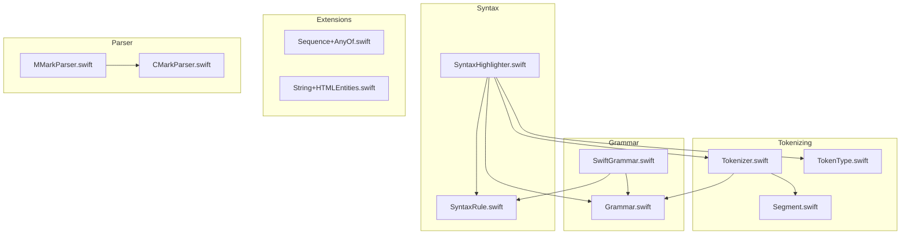
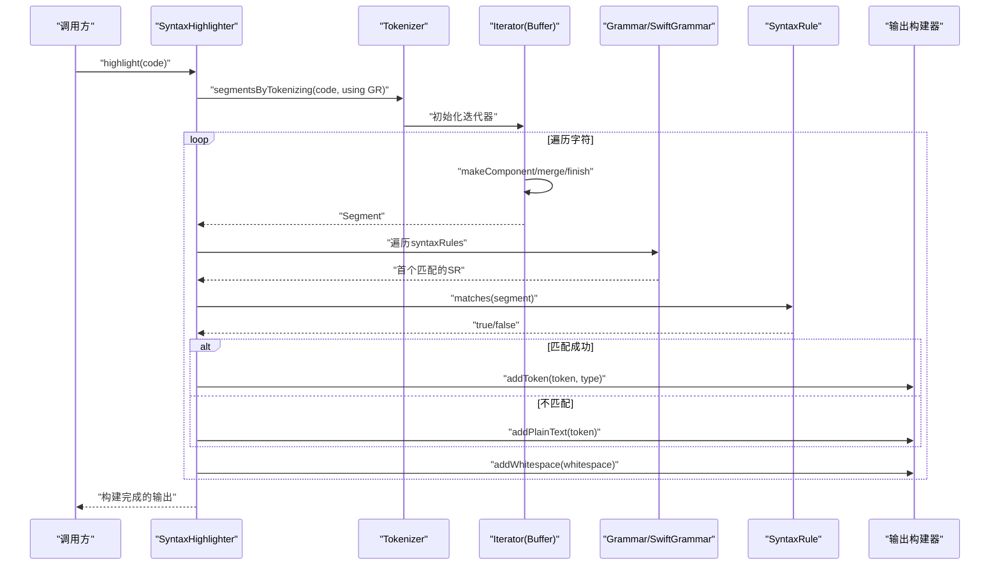
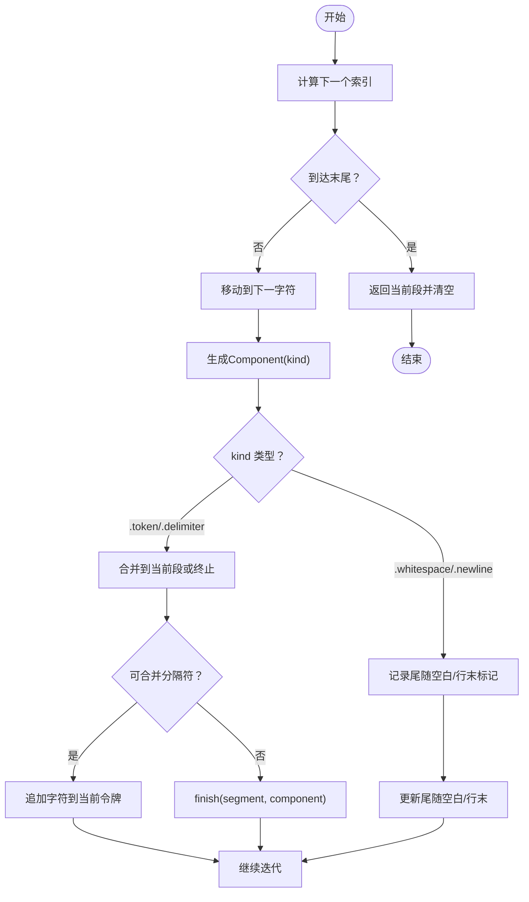
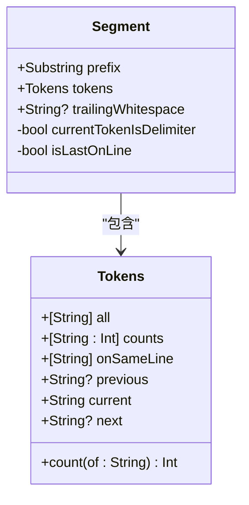
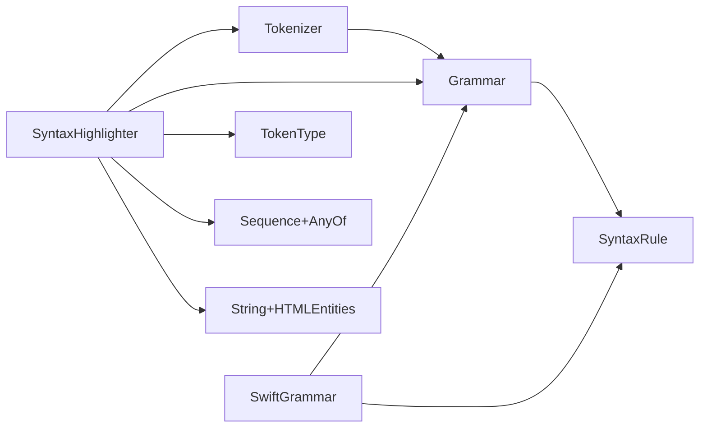
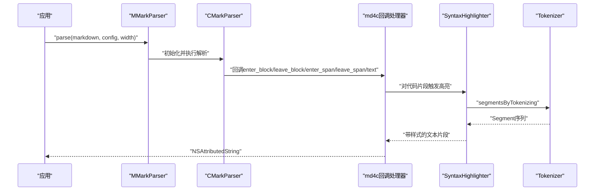

# 令牌化处理系统

<cite>
**本文引用的文件**
- [Tokenizer.swift](file://MMarkParser/Sources/Splash/Tokenizing/Tokenizer.swift)
- [Segment.swift](file://MMarkParser/Sources/Splash/Tokenizing/Segment.swift)
- [TokenType.swift](file://MMarkParser/Sources/Splash/Tokenizing/TokenType.swift)
- [Grammar.swift](file://MMarkParser/Sources/Splash/Grammar/Grammar.swift)
- [SyntaxRule.swift](file://MMarkParser/Sources/Splash/Syntax/SyntaxRule.swift)
- [SyntaxHighlighter.swift](file://MMarkParser/Sources/Splash/Syntax/SyntaxHighlighter.swift)
- [SwiftGrammar.swift](file://MMarkParser/Sources/Splash/Grammar/SwiftGrammar.swift)
- [Sequence+AnyOf.swift](file://MMarkParser/Sources/Splash/Extensions/Sequence/Sequence+AnyOf.swift)
- [String+HTMLEntities.swift](file://MMarkParser/Sources/Splash/Extensions/Strings/String+HTMLEntities.swift)
- [MMarkParser.swift](file://MMarkParser/Sources/MMarkParser.swift)
- [CMarkParser.swift](file://MMarkParser/Sources/Parser/CMarkParser.swift)
- [README.md](file://README.md)
</cite>

## 目录
1. [简介](#简介)
2. [项目结构](#项目结构)
3. [核心组件](#核心组件)
4. [架构总览](#架构总览)
5. [详细组件分析](#详细组件分析)
6. [依赖关系分析](#依赖关系分析)
7. [性能考虑](#性能考虑)
8. [故障排查指南](#故障排查指南)
9. [结论](#结论)
10. [附录](#附录)

## 简介
本文件面向MMarkParser中的“令牌化处理系统”，聚焦于Splash模块内的词法分析实现。该系统负责将源代码字符串分解为“段（Segment）”，每个段包含当前正在评估的“令牌（Token）”及其上下文信息，并通过语法规则（Grammar）与语法规则接口（SyntaxRule）确定令牌类型（TokenType）。文档将从数据结构、算法原理、状态管理、错误处理、使用示例以及与整体解析架构的集成与性能优化等方面进行系统性阐述。

## 项目结构
围绕令牌化处理系统的关键文件分布如下：
- Tokenizing：定义了令牌化器、段与令牌类型
- Grammar：定义语言语法规则与分隔符集合
- Syntax：定义语法规则接口与语法高亮器
- SwiftGrammar：Swift语言的具体语法规则实现
- 扩展：提供序列与字符串等辅助能力
- Parser与MMarkParser：整体解析流程入口，令牌化系统作为语法高亮子系统参与其中

**图表来源**
- [Tokenizer.swift:1-232](file://MMarkParser/Sources/Splash/Tokenizing/Tokenizer.swift#L1-L232)
- [Segment.swift:1-49](file://MMarkParser/Sources/Splash/Tokenizing/Segment.swift#L1-L49)
- [TokenType.swift:1-43](file://MMarkParser/Sources/Splash/Tokenizing/TokenType.swift#L1-L43)
- [Grammar.swift:1-40](file://MMarkParser/Sources/Splash/Grammar/Grammar.swift#L1-L40)
- [SyntaxRule.swift:1-23](file://MMarkParser/Sources/Splash/Syntax/SyntaxRule.swift#L1-L23)
- [SyntaxHighlighter.swift:1-92](file://MMarkParser/Sources/Splash/Syntax/SyntaxHighlighter.swift#L1-L92)
- [SwiftGrammar.swift:1-668](file://MMarkParser/Sources/Splash/Grammar/SwiftGrammar.swift#L1-L668)
- [Sequence+AnyOf.swift:1-24](file://MMarkParser/Sources/Splash/Extensions/Sequence/Sequence+AnyOf.swift#L1-L24)
- [String+HTMLEntities.swift:1-25](file://MMarkParser/Sources/Splash/Extensions/Strings/String+HTMLEntities.swift#L1-L25)
- [MMarkParser.swift:1-42](file://MMarkParser/Sources/MMarkParser.swift#L1-L42)
- [CMarkParser.swift:1-81](file://MMarkParser/Sources/Parser/CMarkParser.swift#L1-L81)

**章节来源**
- [README.md:108-212](file://README.md#L108-L212)

## 核心组件
- Tokenizer：对外暴露segmentsByTokenizing方法，返回基于迭代器的惰性序列，内部通过Buffer与Iterator实现流式生成段。
- Segment：描述一个代码片段的上下文，包含前缀、令牌集合、尾随空白、是否为分隔符、是否行末等信息。
- TokenType：令牌类型枚举，涵盖关键字、字符串、类型、调用、数字、注释、属性访问、点访问、预处理、自定义等。
- Grammar：语言语法规则协议，定义分隔符集合与语法规则列表，并可定制分隔符合并策略。
- SyntaxRule：语法规则协议，每个规则关联一种TokenType并通过匹配函数决定是否应用于当前段。
- SyntaxHighlighter：语法高亮器，组合Tokenizer与Grammar，按顺序应用规则确定令牌类型并输出格式化结果。
- SwiftGrammar：Swift语言的默认语法规则实现，包含多种规则（预处理、注释、字符串、属性、数字、类型、调用、属性、点访问、关键字等）。

**章节来源**
- [Tokenizer.swift:9-16](file://MMarkParser/Sources/Splash/Tokenizing/Tokenizer.swift#L9-L16)
- [Segment.swift:11-49](file://MMarkParser/Sources/Splash/Tokenizing/Segment.swift#L11-L49)
- [TokenType.swift:10-31](file://MMarkParser/Sources/Splash/Tokenizing/TokenType.swift#L10-L31)
- [Grammar.swift:12-39](file://MMarkParser/Sources/Splash/Grammar/Grammar.swift#L12-L39)
- [SyntaxRule.swift:14-22](file://MMarkParser/Sources/Splash/Syntax/SyntaxRule.swift#L14-L22)
- [SyntaxHighlighter.swift:15-81](file://MMarkParser/Sources/Splash/Syntax/SyntaxHighlighter.swift#L15-L81)
- [SwiftGrammar.swift:11-68](file://MMarkParser/Sources/Splash/Grammar/SwiftGrammar.swift#L11-L68)

## 架构总览
令牌化系统位于“语法高亮”子模块中，作为SyntaxHighlighter的底层支撑。其工作流如下：
- SyntaxHighlighter接收源代码字符串
- 调用Tokenizer对代码进行分段
- 对每个段，按Grammar的语法规则顺序匹配，得到TokenType
- 将令牌与尾随空白按类型写入输出构建器

**图表来源**
- [SyntaxHighlighter.swift:29-80](file://MMarkParser/Sources/Splash/Syntax/SyntaxHighlighter.swift#L29-L80)
- [Tokenizer.swift:10-15](file://MMarkParser/Sources/Splash/Tokenizing/Tokenizer.swift#L10-L15)
- [Grammar.swift:18-31](file://MMarkParser/Sources/Splash/Grammar/Grammar.swift#L18-L31)
- [SwiftGrammar.swift:24-38](file://MMarkParser/Sources/Splash/Grammar/SwiftGrammar.swift#L24-L38)
- [SyntaxRule.swift:18-21](file://MMarkParser/Sources/Splash/Syntax/SyntaxRule.swift#L18-L21)

## 详细组件分析

### Tokenizer：词法分析与段生成
- 设计要点
  - 惰性序列：segmentsByTokenizing返回AnySequence<Segment>，内部由Buffer迭代器驱动。
  - 双缓冲：Buffer持有当前与下一个Segment，用于设置Segment之间的next指针。
  - 迭代器状态：Iterator维护当前位置、分段缓存、行内令牌历史、全局令牌历史与计数。
- 文本分割与标记识别
  - makeComponent根据字符类别分为token/delimiter/whitespace/newline。
  - 合并与终止：当遇到空白或换行时，可能更新trailingWhitespace与isLastOnLine；当分隔符不可合并或跨边界时触发finish。
  - 分隔符合并：通过Grammar.isDelimiter(mergableWith:)控制相邻分隔符是否合并为同一令牌。
- 语义分析
  - 通过Segment的tokens上下文（all、counts、onSameLine、previous、current、next）为语法规则提供判断依据。
- 错误处理
  - 当输入为空或迭代结束时，迭代器安全返回nil，避免越界。
  - 未匹配规则时，SyntaxHighlighter将令牌视为纯文本，不抛出异常。

**图表来源**
- [Tokenizer.swift:62-122](file://MMarkParser/Sources/Splash/Tokenizing/Tokenizer.swift#L62-L122)
- [Tokenizer.swift:176-195](file://MMarkParser/Sources/Splash/Tokenizing/Tokenizer.swift#L176-L195)

**章节来源**
- [Tokenizer.swift:9-16](file://MMarkParser/Sources/Splash/Tokenizing/Tokenizer.swift#L9-L16)
- [Tokenizer.swift:19-196](file://MMarkParser/Sources/Splash/Tokenizing/Tokenizer.swift#L19-L196)

### Segment：令牌上下文数据结构
- 字段说明
  - prefix：从起始到当前令牌之前的代码片段
  - tokens：Tokens集合，包含all、counts、onSameLine、previous、current、next
  - trailingWhitespace：当前令牌后的空白
  - currentTokenIsDelimiter：当前令牌是否为分隔符
  - isLastOnLine：是否为行末
- Tokens辅助
  - 提供count(of:)便捷查询令牌出现次数
- 语义用途
  - 为语法规则提供前后文信息，如“在同一行的令牌序列”、“上一个令牌”、“下一个令牌”等

**图表来源**
- [Segment.swift:11-49](file://MMarkParser/Sources/Splash/Tokenizing/Segment.swift#L11-L49)

**章节来源**
- [Segment.swift:9-49](file://MMarkParser/Sources/Splash/Tokenizing/Segment.swift#L9-L49)

### TokenType：令牌类型枚举
- 类型定义
  - 关键字、字符串、类型、调用、数字、注释、属性、点访问、预处理、自定义
- 使用场景
  - 语法高亮器根据规则匹配返回TokenType，驱动输出样式
- 自定义类型
  - 支持自定义字符串类型名，便于扩展

**章节来源**
- [TokenType.swift:10-42](file://MMarkParser/Sources/Splash/Tokenizing/TokenType.swift#L10-L42)

### Grammar与SyntaxRule：语法规则与匹配
- Grammar
  - 定义分隔符集合与语法规则数组
  - 提供分隔符合并策略，默认允许合并
- SyntaxRule
  - 每个规则绑定一种TokenType
  - 通过matches(Segment)判断是否匹配当前段
- SwiftGrammar
  - 实现多种规则：预处理、注释、原始字符串、多行/单行字符串、属性、数字、类型、调用、属性、点访问、关键字
  - 大量利用Segment提供的上下文（如onSameLine、previous、next、counts）进行精确匹配

**章节来源**
- [Grammar.swift:12-39](file://MMarkParser/Sources/Splash/Grammar/Grammar.swift#L12-L39)
- [SyntaxRule.swift:14-22](file://MMarkParser/Sources/Splash/Syntax/SyntaxRule.swift#L14-L22)
- [SwiftGrammar.swift:11-68](file://MMarkParser/Sources/Splash/Grammar/SwiftGrammar.swift#L11-L68)

### SyntaxHighlighter：令牌化与高亮编排
- 流程
  - 初始化Tokenizer与Grammar
  - 遍历每个Segment，获取当前令牌与尾随空白
  - 选择首个匹配的规则，得到TokenType
  - 将令牌与空白写入输出构建器，最后收尾
- 与Tokenizer的协作
  - 通过segmentsByTokenizing获得惰性序列，逐段处理
- 与规则系统的协作
  - 通过first(where:)找到首个匹配规则，若无匹配则按纯文本处理

**章节来源**
- [SyntaxHighlighter.swift:15-81](file://MMarkParser/Sources/Splash/Syntax/SyntaxHighlighter.swift#L15-L81)

### SwiftGrammar规则示例（节选）
- 预处理规则：识别#if、#endif、#elseif、#else、#warning、#error等
- 注释规则：支持//、/**/、///等多形式注释，结合行内状态判断
- 字符串规则：单行、多行、原始字符串及插值区域的复杂判定
- 数字规则：处理整数、浮点、下划线分隔符与小数点边界
- 类型规则：大写字母开头、非声明处、泛型约束等
- 调用规则：函数/方法调用与关键字、参数标签、尾随闭包的区分
- 属性/点访问规则：基于上下文与符号合法性判断

**章节来源**
- [SwiftGrammar.swift:99-414](file://MMarkParser/Sources/Splash/Grammar/SwiftGrammar.swift#L99-L414)

## 依赖关系分析
- 组件耦合
  - Tokenizer依赖Grammar的分隔符集合与合并策略
  - SyntaxHighlighter依赖Tokenizer、Grammar与SyntaxRule
  - SwiftGrammar实现Grammar与多个SyntaxRule
- 外部依赖
  - 通过扩展提供AnyOf与HTML转义等工具能力
- 集成点
  - 在整体解析流程中，语法高亮作为渲染前的准备步骤，与Markdown解析解耦

**图表来源**
- [Tokenizer.swift:9-16](file://MMarkParser/Sources/Splash/Tokenizing/Tokenizer.swift#L9-L16)
- [Grammar.swift:12-39](file://MMarkParser/Sources/Splash/Grammar/Grammar.swift#L12-L39)
- [SyntaxHighlighter.swift:15-25](file://MMarkParser/Sources/Splash/Syntax/SyntaxHighlighter.swift#L15-L25)
- [SwiftGrammar.swift:11-38](file://MMarkParser/Sources/Splash/Grammar/SwiftGrammar.swift#L11-L38)
- [Sequence+AnyOf.swift:9-23](file://MMarkParser/Sources/Splash/Extensions/Sequence/Sequence+AnyOf.swift#L9-L23)
- [String+HTMLEntities.swift:9-24](file://MMarkParser/Sources/Splash/Extensions/Strings/String+HTMLEntities.swift#L9-L24)

**章节来源**
- [Sequence+AnyOf.swift:9-23](file://MMarkParser/Sources/Splash/Extensions/Sequence/Sequence+AnyOf.swift#L9-L23)
- [String+HTMLEntities.swift:9-24](file://MMarkParser/Sources/Splash/Extensions/Strings/String+HTMLEntities.swift#L9-L24)

## 性能考虑
- 惰性迭代与双缓冲
  - 使用AnySequence与Buffer减少一次性分配，降低内存峰值
- 上下文复用
  - tokens.all、tokens.counts、tokens.onSameLine避免重复扫描，提升规则匹配效率
- 规则短路
  - first(where:)确保仅匹配首个规则，减少不必要的判断
- 字符级流式处理
  - 基于索引推进，避免频繁切片与拷贝
- 建议优化
  - 对高频规则（如关键字、字符串）可引入更细粒度的启发式预筛选
  - 对超长行可考虑分块处理或增量缓冲，避免onSameLine过长导致的匹配成本上升

[本节为通用性能建议，无需特定文件引用]

## 故障排查指南
- 常见问题
  - 令牌未正确合并：检查Grammar的isDelimiter合并策略是否符合预期
  - 注释/字符串误判：核对SwiftGrammar中对应规则的上下文条件
  - 行末空白丢失：确认Segment.trailingWhitespace是否被正确传递给输出构建器
- 排查步骤
  - 在SyntaxHighlighter中打印segment与匹配规则，定位规则分支
  - 逐步缩小输入范围，验证边界情况（如空行、连续空白、特殊分隔符）
- 错误处理
  - 令牌化阶段不抛异常，未匹配规则按纯文本处理；若需要严格校验，可在调用侧增加后置检查

**章节来源**
- [SyntaxHighlighter.swift:33-74](file://MMarkParser/Sources/Splash/Syntax/SyntaxHighlighter.swift#L33-L74)
- [SwiftGrammar.swift:117-142](file://MMarkParser/Sources/Splash/Grammar/SwiftGrammar.swift#L117-L142)

## 结论
令牌化处理系统以Tokenizer为核心，借助Segment提供丰富的上下文信息，配合Grammar与SyntaxRule实现精确的语义识别。系统采用惰性迭代与上下文复用，在保证准确性的同时兼顾性能。在MMarkParser的整体架构中，语法高亮作为独立子系统与Markdown解析解耦，既可单独使用，也可无缝融入渲染流程。

[本节为总结性内容，无需特定文件引用]

## 附录

### 使用示例：在Markdown解析流程中应用令牌化
- 入口
  - 通过MMarkParser.parse进入解析流程，底层由CMarkParser与md4c驱动
  - 语法高亮作为渲染前的准备步骤，与令牌化系统协同工作
- 示例流程
  - 输入Markdown字符串
  - 解析器回调触发语法高亮（如代码块），Tokenizer生成Segment序列
  - SyntaxHighlighter按规则标注TokenType并输出富文本
  - 渲染器将富文本与附件（表格、图片、数学公式等）组合为最终显示内容

**图表来源**
- [MMarkParser.swift:19-26](file://MMarkParser/Sources/MMarkParser.swift#L19-L26)
- [CMarkParser.swift:55-66](file://MMarkParser/Sources/Parser/CMarkParser.swift#L55-L66)
- [SyntaxHighlighter.swift:29-75](file://MMarkParser/Sources/Splash/Syntax/SyntaxHighlighter.swift#L29-L75)

**章节来源**
- [MMarkParser.swift:19-41](file://MMarkParser/Sources/MMarkParser.swift#L19-L41)
- [CMarkParser.swift:55-66](file://MMarkParser/Sources/Parser/CMarkParser.swift#L55-L66)
- [README.md:108-180](file://README.md#L108-L180)