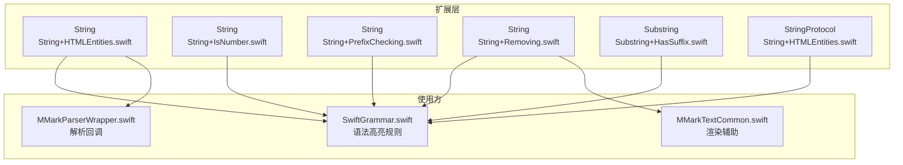
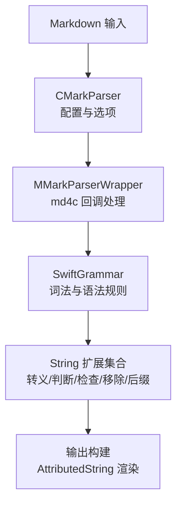
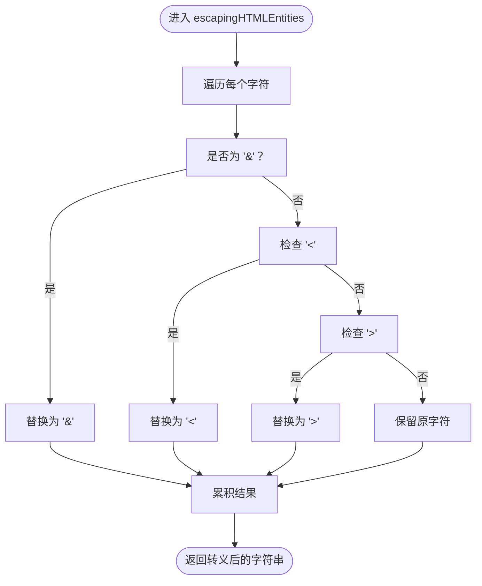
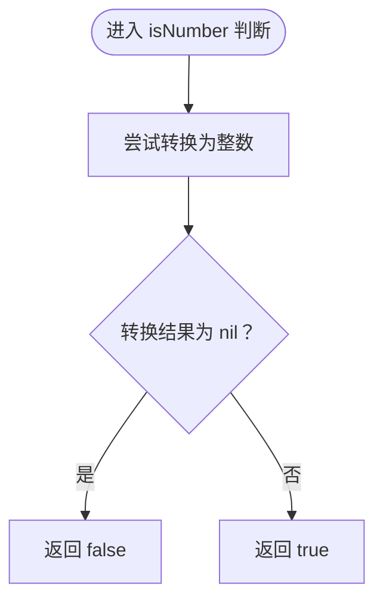
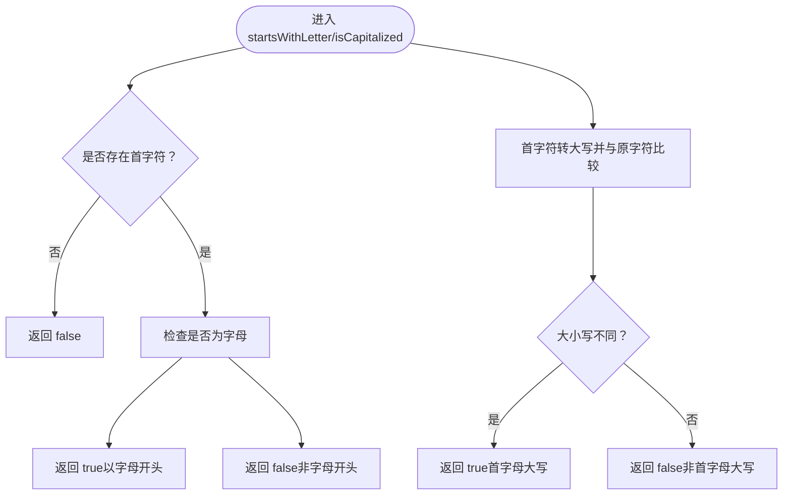
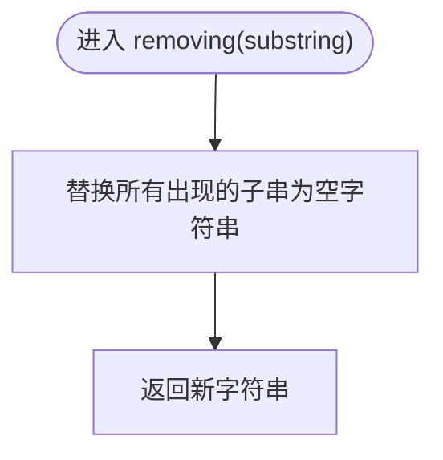
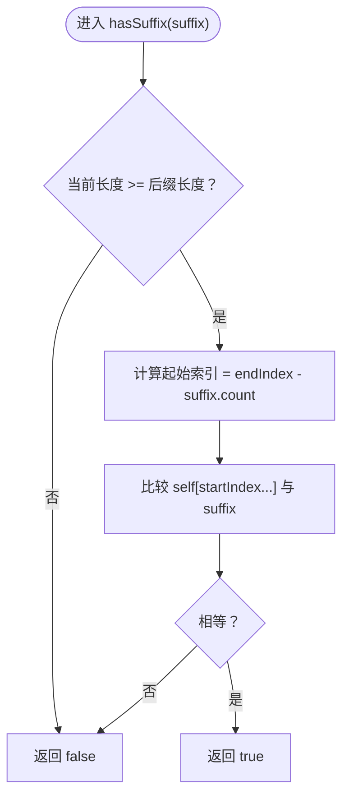
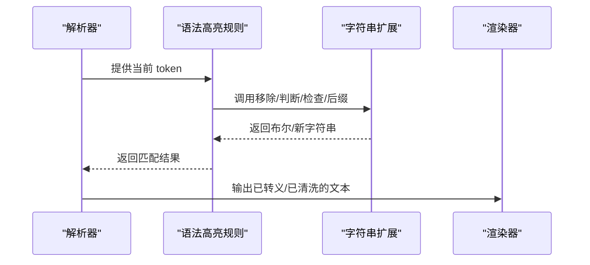
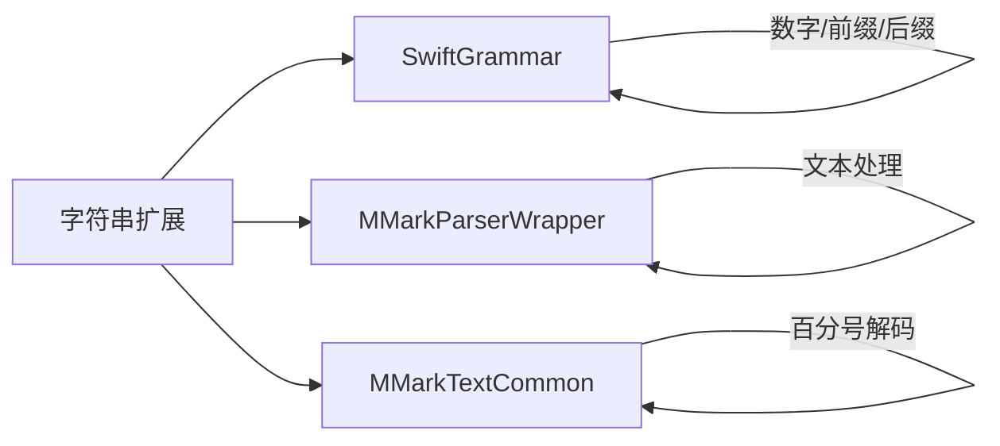

# 字符串扩展功能

<cite>
**本文引用的文件**
- [String+HTMLEntities.swift](file://MMarkParser/Sources/Splash/Extensions/Strings/String+HTMLEntities.swift)
- [String+IsNumber.swift](file://MMarkParser/Sources/Splash/Extensions/Strings/String+IsNumber.swift)
- [String+PrefixChecking.swift](file://MMarkParser/Sources/Splash/Extensions/Strings/String+PrefixChecking.swift)
- [String+Removing.swift](file://MMarkParser/Sources/Splash/Extensions/Strings/String+Removing.swift)
- [Substring+HasSuffix.swift](file://MMarkParser/Sources/Splash/Extensions/Strings/Substring+HasSuffix.swift)
- [SwiftGrammar.swift](file://MMarkParser/Sources/Splash/Grammar/SwiftGrammar.swift)
- [MMarkParserWrapper.swift](file://MMarkParser/Sources/Parser/MMarkParserWrapper.swift)
- [MMarkTextCommon.swift](file://MMarkParser/Sources/Renderer/MMarkTextCommon.swift)
</cite>

## 目录
1. [简介](#简介)
2. [项目结构](#项目结构)
3. [核心组件](#核心组件)
4. [架构总览](#架构总览)
5. [详细组件分析](#详细组件分析)
6. [依赖关系分析](#依赖关系分析)
7. [性能考量](#性能考量)
8. [故障排查指南](#故障排查指南)
9. [结论](#结论)
10. [附录](#附录)

## 简介
本文件聚焦于 MMarkParser 中“字符串扩展”能力，系统性阐述其设计理念与实现原理，覆盖以下关键扩展点：
- HTML 实体转义：对文本中的特殊字符进行安全转义，保障渲染输出的安全性与正确性
- 数字判断：快速判定字符串是否可表示为整数
- 前缀检查：判断字符串是否以字母开头、是否首字母大写
- 字符串移除：从源字符串中移除指定子串
- 后缀匹配（跨平台）：在 Linux 平台下为 Substring 提供 hasSuffix 能力

这些扩展广泛应用于语法高亮与 Markdown 解析流程中，用于词法切分、规则匹配与内容清洗，显著提升代码可读性与开发效率。

## 项目结构
字符串扩展位于 Splash 扩展模块中，围绕 String、Substring、StringProtocol 等类型提供便捷方法；同时在语法高亮与解析器中被大量使用。

图表来源
- [String+HTMLEntities.swift:9-24](file://MMarkParser/Sources/Splash/Extensions/Strings/String+HTMLEntities.swift#L9-L24)
- [String+IsNumber.swift:9-13](file://MMarkParser/Sources/Splash/Extensions/Strings/String+IsNumber.swift#L9-L13)
- [String+PrefixChecking.swift:9-25](file://MMarkParser/Sources/Splash/Extensions/Strings/String+PrefixChecking.swift#L9-L25)
- [String+Removing.swift:9-13](file://MMarkParser/Sources/Splash/Extensions/Strings/String+Removing.swift#L9-L13)
- [Substring+HasSuffix.swift:5-16](file://MMarkParser/Sources/Splash/Extensions/Strings/Substring+HasSuffix.swift#L5-L16)
- [SwiftGrammar.swift:225-228](file://MMarkParser/Sources/Splash/Grammar/SwiftGrammar.swift#L225-L228)
- [MMarkParserWrapper.swift:557-557](file://MMarkParser/Sources/Parser/MMarkParserWrapper.swift#L557-L557)
- [MMarkTextCommon.swift:96-96](file://MMarkParser/Sources/Renderer/MMarkTextCommon.swift#L96-L96)

章节来源
- [String+HTMLEntities.swift:1-25](file://MMarkParser/Sources/Splash/Extensions/Strings/String+HTMLEntities.swift#L1-L25)
- [String+IsNumber.swift:1-14](file://MMarkParser/Sources/Splash/Extensions/Strings/String+IsNumber.swift#L1-L14)
- [String+PrefixChecking.swift:1-26](file://MMarkParser/Sources/Splash/Extensions/Strings/String+PrefixChecking.swift#L1-L26)
- [String+Removing.swift:1-14](file://MMarkParser/Sources/Splash/Extensions/Strings/String+Removing.swift#L1-L14)
- [Substring+HasSuffix.swift:1-17](file://MMarkParser/Sources/Splash/Extensions/Strings/Substring+HasSuffix.swift#L1-L17)

## 核心组件
本节对每个字符串扩展进行深入剖析，包括设计动机、实现逻辑、使用场景与性能考量。

- HTML 实体转义（StringProtocol）
  - 设计动机：在渲染阶段避免未转义的特殊字符导致的显示或安全问题
  - 实现要点：基于 StringProtocol 的扩展，遍历字符并按需替换为对应的 HTML 实体
  - 使用场景：文本输出前的安全处理
  - 性能考量：线性时间复杂度 O(n)，内存开销与输入长度成正比
  - 参考路径：[String+HTMLEntities.swift:9-24](file://MMarkParser/Sources/Splash/Extensions/Strings/String+HTMLEntities.swift#L9-L24)

- 数字判断（String）
  - 设计动机：在词法分析中快速识别整型字面量，支持包含下划线分隔符的格式
  - 实现要点：通过尝试转换为整数判断是否为数字
  - 使用场景：Swift 语法高亮中对整数字面量的识别
  - 性能考量：常数时间复杂度，但涉及一次解析尝试
  - 参考路径：[String+IsNumber.swift:9-13](file://MMarkParser/Sources/Splash/Extensions/Strings/String+IsNumber.swift#L9-L13)

- 前缀检查（String）
  - 设计动机：在语法高亮中区分标识符与关键字、类型名等
  - 实现要点：首字符存在性校验、大小写与字母集判断
  - 使用场景：类型名首字母大写检测、标识符以字母开头判断
  - 性能考量：O(1) 时间与空间复杂度
  - 参考路径：[String+PrefixChecking.swift:9-25](file://MMarkParser/Sources/Splash/Extensions/Strings/String+PrefixChecking.swift#L9-L25)

- 字符串移除（String）
  - 设计动机：在词法分析中清理分隔符或格式化标记
  - 实现要点：委托给字符串替换 API 移除指定子串
  - 使用场景：去除下划线分隔符后继续数字判断
  - 性能考量：线性时间复杂度 O(n)，取决于目标子串出现次数
  - 参考路径：[String+Removing.swift:9-13](file://MMarkParser/Sources/Splash/Extensions/Strings/String+Removing.swift#L9-L13)

- 后缀匹配（Substring，Linux）
  - 设计动机：补齐 Linux 平台缺失的 hasSuffix 能力，统一跨平台行为
  - 实现要点：基于索引计算与逐字符比较实现后缀判断
  - 使用场景：语法高亮中对字符串字面量与插值片段的边界判断
  - 性能考量：O(k) 时间复杂度，k 为后缀长度
  - 参考路径：[Substring+HasSuffix.swift:5-16](file://MMarkParser/Sources/Splash/Extensions/Strings/Substring+HasSuffix.swift#L5-L16)

章节来源
- [String+HTMLEntities.swift:9-24](file://MMarkParser/Sources/Splash/Extensions/Strings/String+HTMLEntities.swift#L9-L24)
- [String+IsNumber.swift:9-13](file://MMarkParser/Sources/Splash/Extensions/Strings/String+IsNumber.swift#L9-L13)
- [String+PrefixChecking.swift:9-25](file://MMarkParser/Sources/Splash/Extensions/Strings/String+PrefixChecking.swift#L9-L25)
- [String+Removing.swift:9-13](file://MMarkParser/Sources/Splash/Extensions/Strings/String+Removing.swift#L9-L13)
- [Substring+HasSuffix.swift:5-16](file://MMarkParser/Sources/Splash/Extensions/Strings/Substring+HasSuffix.swift#L5-L16)

## 架构总览
字符串扩展在解析与语法高亮流程中的位置如下：

图表来源
- [MMarkParserWrapper.swift:756-770](file://MMarkParser/Sources/Parser/MMarkParserWrapper.swift#L756-L770)
- [SwiftGrammar.swift:225-228](file://MMarkParser/Sources/Splash/Grammar/SwiftGrammar.swift#L225-L228)
- [String+HTMLEntities.swift:9-24](file://MMarkParser/Sources/Splash/Extensions/Strings/String+HTMLEntities.swift#L9-L24)
- [String+IsNumber.swift:9-13](file://MMarkParser/Sources/Splash/Extensions/Strings/String+IsNumber.swift#L9-L13)
- [String+PrefixChecking.swift:9-25](file://MMarkParser/Sources/Splash/Extensions/Strings/String+PrefixChecking.swift#L9-L25)
- [String+Removing.swift:9-13](file://MMarkParser/Sources/Splash/Extensions/Strings/String+Removing.swift#L9-L13)
- [Substring+HasSuffix.swift:5-16](file://MMarkParser/Sources/Splash/Extensions/Strings/Substring+HasSuffix.swift#L5-L16)

## 详细组件分析

### HTML 实体转义扩展
- 设计理念
  - 将“安全渲染”的职责下沉到字符串层，使上层逻辑无需重复处理转义细节
  - 采用 StringProtocol 扩展，既适用于 String，也适用于 Substring，提升灵活性
- 实现逻辑
  - 遍历字符，遇到特定字符时替换为对应 HTML 实体，其余字符保持原样
  - 使用 flatMap 进行字符级映射与拼接，保证简洁与可读性
- 使用场景
  - 在渲染阶段对原始文本进行转义，防止标签注入与显示异常
  - 与语法高亮配合，确保高亮后的文本仍安全输出
- 性能考虑
  - 时间复杂度 O(n)，空间复杂度 O(n)，适合中短文本
  - 对长文本建议批量处理或延迟执行
- 代码示例路径
  - [String+HTMLEntities.swift:9-24](file://MMarkParser/Sources/Splash/Extensions/Strings/String+HTMLEntities.swift#L9-L24)

图表来源
- [String+HTMLEntities.swift:9-24](file://MMarkParser/Sources/Splash/Extensions/Strings/String+HTMLEntities.swift#L9-L24)

章节来源
- [String+HTMLEntities.swift:9-24](file://MMarkParser/Sources/Splash/Extensions/Strings/String+HTMLEntities.swift#L9-L24)

### 数字判断扩展
- 设计理念
  - 将“数字识别”抽象为布尔属性，简化语法高亮规则中的判断逻辑
  - 支持包含下划线分隔符的整数字面量，符合 Swift 语法规范
- 实现逻辑
  - 通过尝试转换为整数判断是否为数字，若非空则认为是数字
  - 在高亮规则中先移除下划线再判断，确保格式兼容
- 使用场景
  - 识别整数字面量、浮点数中的整数部分
  - 与前后文 token 组合，避免误判为关键字或标识符
- 性能考虑
  - 单次解析尝试，时间复杂度近似 O(1)，但受字符串长度影响
- 代码示例路径
  - [String+IsNumber.swift:9-13](file://MMarkParser/Sources/Splash/Extensions/Strings/String+IsNumber.swift#L9-L13)
  - [SwiftGrammar.swift:225-228](file://MMarkParser/Sources/Splash/Grammar/SwiftGrammar.swift#L225-L228)

图表来源
- [String+IsNumber.swift:9-13](file://MMarkParser/Sources/Splash/Extensions/Strings/String+IsNumber.swift#L9-L13)
- [SwiftGrammar.swift:225-228](file://MMarkParser/Sources/Splash/Grammar/SwiftGrammar.swift#L225-L228)

章节来源
- [String+IsNumber.swift:9-13](file://MMarkParser/Sources/Splash/Extensions/Strings/String+IsNumber.swift#L9-L13)
- [SwiftGrammar.swift:225-228](file://MMarkParser/Sources/Splash/Grammar/SwiftGrammar.swift#L225-L228)

### 前缀检查扩展
- 设计理念
  - 将“首字符性质”抽象为布尔属性，便于在高亮规则中快速分流
  - 区分“是否以字母开头”和“是否首字母大写”，满足不同规则需求
- 实现逻辑
  - 以字母开头：利用 CharacterSet.letters 检查首字符
  - 首字母大写：先提取首字符，再与大写形式对比
- 使用场景
  - 类型名识别：要求首字母大写且以字母开头
  - 标识符识别：要求以字母开头，避免关键字与操作符混淆
- 性能考虑
  - O(1) 时间与空间复杂度，开销极低
- 代码示例路径
  - [String+PrefixChecking.swift:9-25](file://MMarkParser/Sources/Splash/Extensions/Strings/String+PrefixChecking.swift#L9-L25)
  - [SwiftGrammar.swift:271-273](file://MMarkParser/Sources/Splash/Grammar/SwiftGrammar.swift#L271-L273)
  - [SwiftGrammar.swift:431-433](file://MMarkParser/Sources/Splash/Grammar/SwiftGrammar.swift#L431-L433)

图表来源
- [String+PrefixChecking.swift:9-25](file://MMarkParser/Sources/Splash/Extensions/Strings/String+PrefixChecking.swift#L9-L25)
- [SwiftGrammar.swift:271-273](file://MMarkParser/Sources/Splash/Grammar/SwiftGrammar.swift#L271-L273)
- [SwiftGrammar.swift:431-433](file://MMarkParser/Sources/Splash/Grammar/SwiftGrammar.swift#L431-L433)

章节来源
- [String+PrefixChecking.swift:9-25](file://MMarkParser/Sources/Splash/Extensions/Strings/String+PrefixChecking.swift#L9-L25)
- [SwiftGrammar.swift:271-273](file://MMarkParser/Sources/Splash/Grammar/SwiftGrammar.swift#L271-L273)
- [SwiftGrammar.swift:431-433](file://MMarkParser/Sources/Splash/Grammar/SwiftGrammar.swift#L431-L433)

### 字符串移除扩展
- 设计理念
  - 将“子串移除”抽象为简单易用的方法，减少重复代码
  - 与数字判断结合，支持带下划线分隔符的数字格式
- 实现逻辑
  - 基于字符串替换 API，将目标子串替换为空字符串
- 使用场景
  - 在数字识别前移除下划线，确保后续判断准确
- 性能考虑
  - 时间复杂度 O(n)，取决于目标子串出现次数
- 代码示例路径
  - [String+Removing.swift:9-13](file://MMarkParser/Sources/Splash/Extensions/Strings/String+Removing.swift#L9-L13)
  - [SwiftGrammar.swift:226-226](file://MMarkParser/Sources/Splash/Grammar/SwiftGrammar.swift#L226-L226)

图表来源
- [String+Removing.swift:9-13](file://MMarkParser/Sources/Splash/Extensions/Strings/String+Removing.swift#L9-L13)
- [SwiftGrammar.swift:226-226](file://MMarkParser/Sources/Splash/Grammar/SwiftGrammar.swift#L226-L226)

章节来源
- [String+Removing.swift:9-13](file://MMarkParser/Sources/Splash/Extensions/Strings/String+Removing.swift#L9-L13)
- [SwiftGrammar.swift:226-226](file://MMarkParser/Sources/Splash/Grammar/SwiftGrammar.swift#L226-L226)

### 后缀匹配扩展（Linux）
- 设计理念
  - 补齐 Linux 平台缺失的 hasSuffix 能力，统一跨平台行为
  - 通过索引与逐字符比较实现，避免第三方库依赖
- 实现逻辑
  - 先比较长度，再计算起始索引，最后逐字符比较
- 使用场景
  - 语法高亮中对字符串字面量与插值片段的边界判断
- 性能考虑
  - 时间复杂度 O(k)，k 为后缀长度，通常很小
- 代码示例路径
  - [Substring+HasSuffix.swift:5-16](file://MMarkParser/Sources/Splash/Extensions/Strings/Substring+HasSuffix.swift#L5-L16)
  - [SwiftGrammar.swift:566-566](file://MMarkParser/Sources/Splash/Grammar/SwiftGrammar.swift#L566-L566)
  - [SwiftGrammar.swift:570-570](file://MMarkParser/Sources/Splash/Grammar/SwiftGrammar.swift#L570-L570)

图表来源
- [Substring+HasSuffix.swift:5-16](file://MMarkParser/Sources/Splash/Extensions/Strings/Substring+HasSuffix.swift#L5-L16)
- [SwiftGrammar.swift:566-566](file://MMarkParser/Sources/Splash/Grammar/SwiftGrammar.swift#L566-L566)
- [SwiftGrammar.swift:570-570](file://MMarkParser/Sources/Splash/Grammar/SwiftGrammar.swift#L570-L570)

章节来源
- [Substring+HasSuffix.swift:5-16](file://MMarkParser/Sources/Splash/Extensions/Strings/Substring+HasSuffix.swift#L5-L16)
- [SwiftGrammar.swift:566-566](file://MMarkParser/Sources/Splash/Grammar/SwiftGrammar.swift#L566-L566)
- [SwiftGrammar.swift:570-570](file://MMarkParser/Sources/Splash/Grammar/SwiftGrammar.swift#L570-L570)

### 在 Markdown 解析与渲染中的应用
- 语法高亮中的典型用法
  - 数字识别：先移除下划线，再判断是否为数字
  - 类型识别：要求首字母大写且以字母开头
  - 字符串字面量与插值：使用后缀匹配判断边界
- 解析器中的典型用法
  - 文本块处理：在渲染前进行 HTML 实体转义
  - 内容清洗：移除多余空白或格式化标记
- 代码示例路径
  - [SwiftGrammar.swift:225-228](file://MMarkParser/Sources/Splash/Grammar/SwiftGrammar.swift#L225-L228)
  - [SwiftGrammar.swift:271-273](file://MMarkParser/Sources/Splash/Grammar/SwiftGrammar.swift#L271-L273)
  - [SwiftGrammar.swift:431-433](file://MMarkParser/Sources/Splash/Grammar/SwiftGrammar.swift#L431-L433)
  - [SwiftGrammar.swift:566-566](file://MMarkParser/Sources/Splash/Grammar/SwiftGrammar.swift#L566-L566)
  - [MMarkParserWrapper.swift:557-557](file://MMarkParser/Sources/Parser/MMarkParserWrapper.swift#L557-L557)
  - [MMarkTextCommon.swift:96-96](file://MMarkParser/Sources/Renderer/MMarkTextCommon.swift#L96-L96)

图表来源
- [SwiftGrammar.swift:225-228](file://MMarkParser/Sources/Splash/Grammar/SwiftGrammar.swift#L225-L228)
- [String+Removing.swift:9-13](file://MMarkParser/Sources/Splash/Extensions/Strings/String+Removing.swift#L9-L13)
- [String+IsNumber.swift:9-13](file://MMarkParser/Sources/Splash/Extensions/Strings/String+IsNumber.swift#L9-L13)
- [String+PrefixChecking.swift:9-25](file://MMarkParser/Sources/Splash/Extensions/Strings/String+PrefixChecking.swift#L9-L25)
- [Substring+HasSuffix.swift:5-16](file://MMarkParser/Sources/Splash/Extensions/Strings/Substring+HasSuffix.swift#L5-L16)
- [MMarkParserWrapper.swift:557-557](file://MMarkParser/Sources/Parser/MMarkParserWrapper.swift#L557-L557)
- [MMarkTextCommon.swift:96-96](file://MMarkParser/Sources/Renderer/MMarkTextCommon.swift#L96-L96)

## 依赖关系分析
- 扩展与使用方的耦合
  - 扩展均为轻量级工具函数，与业务逻辑解耦
  - 使用方通过明确的 API 名称与语义进行交互，降低理解成本
- 跨平台兼容性
  - Substring.hasSuffix 在 Linux 平台通过条件编译补齐，确保行为一致
- 外部依赖
  - 仅依赖 Foundation，无额外第三方库

图表来源
- [String+HTMLEntities.swift:9-24](file://MMarkParser/Sources/Splash/Extensions/Strings/String+HTMLEntities.swift#L9-L24)
- [String+IsNumber.swift:9-13](file://MMarkParser/Sources/Splash/Extensions/Strings/String+IsNumber.swift#L9-L13)
- [String+PrefixChecking.swift:9-25](file://MMarkParser/Sources/Splash/Extensions/Strings/String+PrefixChecking.swift#L9-L25)
- [String+Removing.swift:9-13](file://MMarkParser/Sources/Splash/Extensions/Strings/String+Removing.swift#L9-L13)
- [Substring+HasSuffix.swift:5-16](file://MMarkParser/Sources/Splash/Extensions/Strings/Substring+HasSuffix.swift#L5-L16)
- [SwiftGrammar.swift:225-228](file://MMarkParser/Sources/Splash/Grammar/SwiftGrammar.swift#L225-L228)
- [MMarkParserWrapper.swift:557-557](file://MMarkParser/Sources/Parser/MMarkParserWrapper.swift#L557-L557)
- [MMarkTextCommon.swift:96-96](file://MMarkParser/Sources/Renderer/MMarkTextCommon.swift#L96-L96)

章节来源
- [SwiftGrammar.swift:225-228](file://MMarkParser/Sources/Splash/Grammar/SwiftGrammar.swift#L225-L228)
- [Substring+HasSuffix.swift:5-16](file://MMarkParser/Sources/Splash/Extensions/Strings/Substring+HasSuffix.swift#L5-L16)
- [MMarkParserWrapper.swift:557-557](file://MMarkParser/Sources/Parser/MMarkParserWrapper.swift#L557-L557)
- [MMarkTextCommon.swift:96-96](file://MMarkParser/Sources/Renderer/MMarkTextCommon.swift#L96-L96)

## 性能考量
- 字符串扩展普遍为 O(n) 或 O(k) 复杂度，适合中短文本
- 在高频调用场景（如词法扫描）应避免重复创建中间字符串
- 对于超长文本，建议分段处理或缓存结果
- 转义与移除操作可结合批量处理减少多次分配

## 故障排查指南
- HTML 实体转义未生效
  - 检查输入是否为 StringProtocol 实例，确认扩展方法调用链
  - 参考路径：[String+HTMLEntities.swift:9-24](file://MMarkParser/Sources/Splash/Extensions/Strings/String+HTMLEntities.swift#L9-L24)
- 数字判断误判
  - 确认是否先移除了下划线分隔符
  - 参考路径：[String+Removing.swift:9-13](file://MMarkParser/Sources/Splash/Extensions/Strings/String+Removing.swift#L9-L13)
  - 参考路径：[String+IsNumber.swift:9-13](file://MMarkParser/Sources/Splash/Extensions/Strings/String+IsNumber.swift#L9-L13)
- 前缀检查不准确
  - 检查首字符是否存在，以及大小写转换是否符合预期
  - 参考路径：[String+PrefixChecking.swift:9-25](file://MMarkParser/Sources/Splash/Extensions/Strings/String+PrefixChecking.swift#L9-L25)
- Linux 平台后缀判断异常
  - 确认 Substring.hasSuffix 是否被条件编译启用
  - 参考路径：[Substring+HasSuffix.swift:5-16](file://MMarkParser/Sources/Splash/Extensions/Strings/Substring+HasSuffix.swift#L5-L16)

章节来源
- [String+HTMLEntities.swift:9-24](file://MMarkParser/Sources/Splash/Extensions/Strings/String+HTMLEntities.swift#L9-L24)
- [String+Removing.swift:9-13](file://MMarkParser/Sources/Splash/Extensions/Strings/String+Removing.swift#L9-L13)
- [String+IsNumber.swift:9-13](file://MMarkParser/Sources/Splash/Extensions/Strings/String+IsNumber.swift#L9-L13)
- [String+PrefixChecking.swift:9-25](file://MMarkParser/Sources/Splash/Extensions/Strings/String+PrefixChecking.swift#L9-L25)
- [Substring+HasSuffix.swift:5-16](file://MMarkParser/Sources/Splash/Extensions/Strings/Substring+HasSuffix.swift#L5-L16)

## 结论
字符串扩展通过简洁的 API 与稳定的实现，将常见的文本处理任务抽象为可复用的能力，显著提升了代码的可读性与开发效率。它们在语法高亮与解析渲染流程中扮演基础而关键的角色，既保证了正确性，又兼顾了性能与跨平台一致性。

## 附录
- 命名约定与 Swift 特性
  - 使用属性与方法清晰表达意图（如 isNumber、isCapitalized、startsWithLetter、removing、hasSuffix）
  - 采用 StringProtocol 与 String/Substring 的扩展，覆盖更广的使用场景
  - 条件编译确保 Linux 平台行为一致
- 推荐实践
  - 在高亮规则中优先组合使用多个扩展，以获得更强的表达力
  - 对长文本处理时注意批量优化与缓存策略