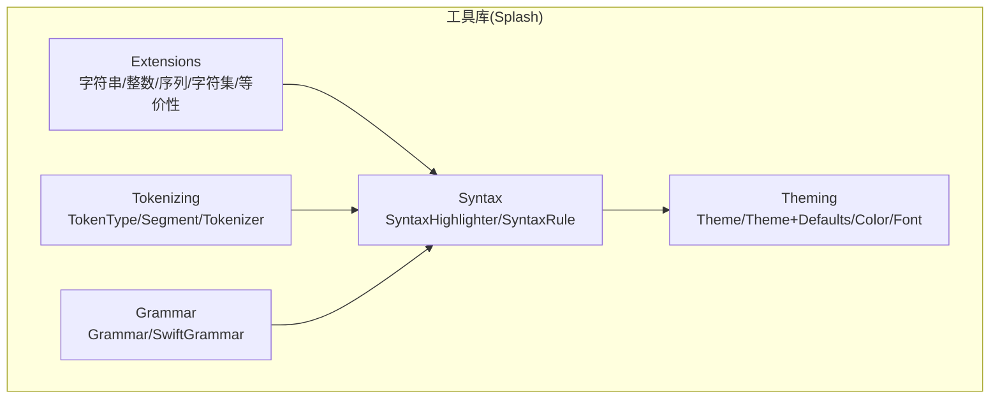
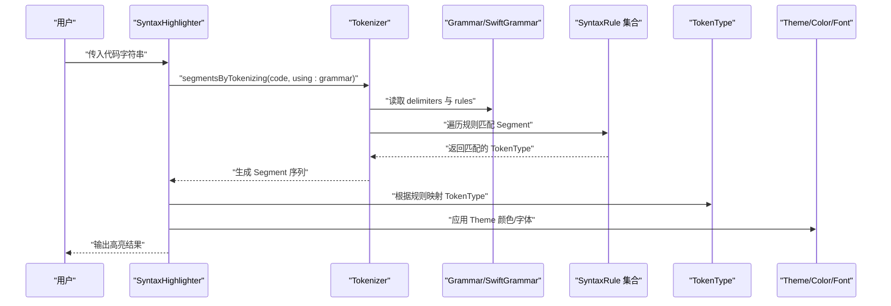
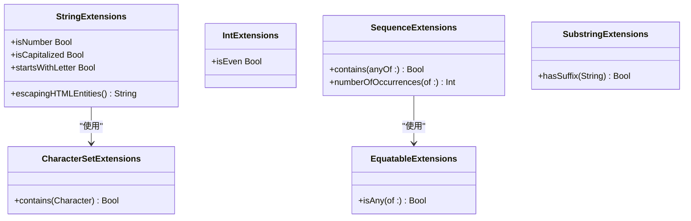
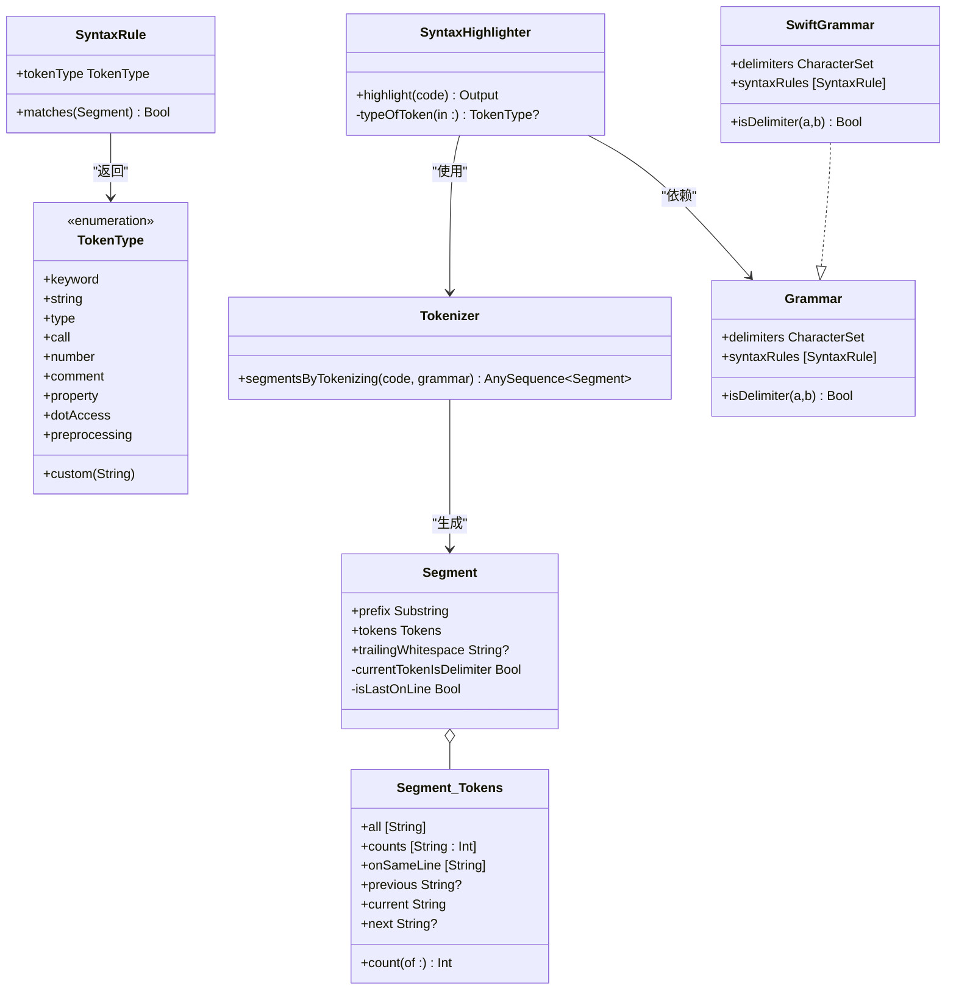
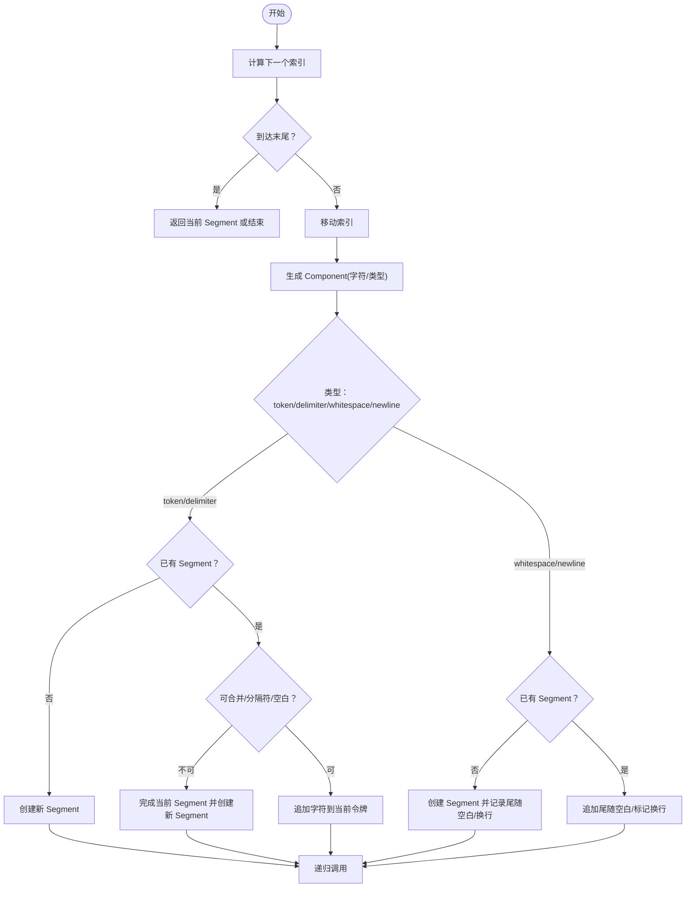
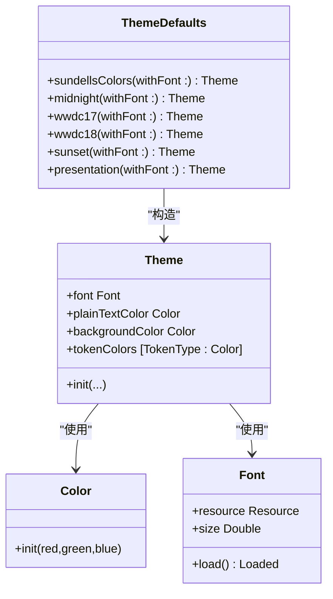
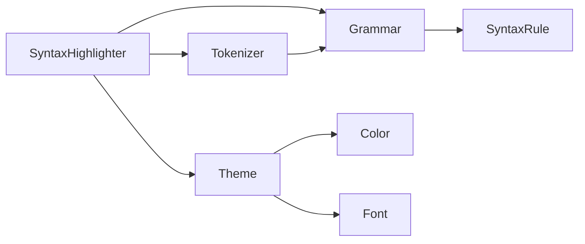

# 工具库和扩展

<cite>
**本文引用的文件**
- [String+HTMLEntities.swift](file://MMarkParser/Sources/Splash/Extensions/Strings/String+HTMLEntities.swift)
- [String+IsNumber.swift](file://MMarkParser/Sources/Splash/Extensions/Strings/String+IsNumber.swift)
- [String+PrefixChecking.swift](file://MMarkParser/Sources/Splash/Extensions/Strings/String+PrefixChecking.swift)
- [Int+IsOdd.swift](file://MMarkParser/Sources/Splash/Extensions/Int/Int+IsOdd.swift)
- [Sequence+AnyOf.swift](file://MMarkParser/Sources/Splash/Extensions/Sequence/Sequence+AnyOf.swift)
- [Sequence+Occurrences.swift](file://MMarkParser/Sources/Splash/Extensions/Sequence/Sequence+Occurrences.swift)
- [CharacterSet+Contains.swift](file://MMarkParser/Sources/Splash/Extensions/CharacterSet/CharacterSet+Contains.swift)
- [Equatable+AnyOf.swift](file://MMarkParser/Sources/Splash/Extensions/Equatable/Equatable+AnyOf.swift)
- [Substring+HasSuffix.swift](file://MMarkParser/Sources/Splash/Extensions/Strings/Substring+HasSuffix.swift)
- [TokenType.swift](file://MMarkParser/Sources/Splash/Tokenizing/TokenType.swift)
- [Segment.swift](file://MMarkParser/Sources/Splash/Tokenizing/Segment.swift)
- [Tokenizer.swift](file://MMarkParser/Sources/Splash/Tokenizing/Tokenizer.swift)
- [Grammar.swift](file://MMarkParser/Sources/Splash/Grammar/Grammar.swift)
- [SwiftGrammar.swift](file://MMarkParser/Sources/Splash/Grammar/SwiftGrammar.swift)
- [SyntaxRule.swift](file://MMarkParser/Sources/Splash/Syntax/SyntaxRule.swift)
- [SyntaxHighlighter.swift](file://MMarkParser/Sources/Splash/Syntax/SyntaxHighlighter.swift)
- [Theme.swift](file://MMarkParser/Sources/Splash/Theming/Theme.swift)
- [Theme+Defaults.swift](file://MMarkParser/Sources/Splash/Theming/Theme+Defaults.swift)
- [Color.swift](file://MMarkParser/Sources/Splash/Theming/Color.swift)
- [Font.swift](file://MMarkParser/Sources/Splash/Theming/Font.swift)
</cite>

## 目录
1. [简介](#简介)
2. [项目结构](#项目结构)
3. [核心组件](#核心组件)
4. [架构总览](#架构总览)
5. [详细组件分析](#详细组件分析)
6. [依赖关系分析](#依赖关系分析)
7. [性能考量](#性能考量)
8. [故障排查指南](#故障排查指南)
9. [结论](#结论)
10. [附录：使用示例与扩展指南](#附录使用示例与扩展指南)

## 简介
本文件面向“工具库与扩展”模块，系统性梳理 Splash 工具库的设计理念与架构，重点覆盖以下方面：
- 字符串扩展：HTML 实体转义、数字判断、首字母大小写与前缀检查等实用能力
- 语法高亮：基于语法规则的词法分析与令牌类型识别，以及 Swift 语言的完整支持
- 令牌化：Tokenizer 的实现细节、Segment 的上下文信息与 TokenType 的定义
- 主题管理：跨平台颜色与字体抽象、默认主题配置与可定制化方案
- 复用指南：如何在其他项目中引入与扩展这些工具功能

## 项目结构
工具库位于 MMarkParser/Sources/Splash 下，采用按功能域分层组织：
- Extensions：各类 Swift 扩展（字符串、整数、序列、字符集、等价性）
- Tokenizing：词法分析核心（TokenType、Segment、Tokenizer）
- Grammar：语言语法协议与 Swift 语法实现
- Syntax：语法高亮入口与规则匹配
- Theming：主题、颜色、字体抽象与默认主题

图示来源
- [Grammar.swift:12-40](file://MMarkParser/Sources/Splash/Grammar/Grammar.swift#L12-L40)
- [SwiftGrammar.swift:11-68](file://MMarkParser/Sources/Splash/Grammar/SwiftGrammar.swift#L11-L68)
- [SyntaxHighlighter.swift:15-81](file://MMarkParser/Sources/Splash/Syntax/SyntaxHighlighter.swift#L15-L81)
- [TokenType.swift:10-42](file://MMarkParser/Sources/Splash/Tokenizing/TokenType.swift#L10-L42)
- [Segment.swift:11-49](file://MMarkParser/Sources/Splash/Tokenizing/Segment.swift#L11-L49)
- [Tokenizer.swift:9-16](file://MMarkParser/Sources/Splash/Tokenizing/Tokenizer.swift#L9-L16)
- [Theme.swift:20-39](file://MMarkParser/Sources/Splash/Theming/Theme.swift#L20-L39)
- [Theme+Defaults.swift:11-179](file://MMarkParser/Sources/Splash/Theming/Theme+Defaults.swift#L11-L179)
- [Color.swift:7-21](file://MMarkParser/Sources/Splash/Theming/Color.swift#L7-L21)
- [Font.swift:15-103](file://MMarkParser/Sources/Splash/Theming/Font.swift#L15-L103)

章节来源
- [Grammar.swift:12-40](file://MMarkParser/Sources/Splash/Grammar/Grammar.swift#L12-L40)
- [SwiftGrammar.swift:11-68](file://MMarkParser/Sources/Splash/Grammar/SwiftGrammar.swift#L11-L68)
- [SyntaxHighlighter.swift:15-81](file://MMarkParser/Sources/Splash/Syntax/SyntaxHighlighter.swift#L15-L81)
- [TokenType.swift:10-42](file://MMarkParser/Sources/Splash/Tokenizing/TokenType.swift#L10-L42)
- [Segment.swift:11-49](file://MMarkParser/Sources/Splash/Tokenizing/Segment.swift#L11-L49)
- [Tokenizer.swift:9-16](file://MMarkParser/Sources/Splash/Tokenizing/Tokenizer.swift#L9-L16)
- [Theme.swift:20-39](file://MMarkParser/Sources/Splash/Theming/Theme.swift#L20-L39)
- [Theme+Defaults.swift:11-179](file://MMarkParser/Sources/Splash/Theming/Theme+Defaults.swift#L11-L179)
- [Color.swift:7-21](file://MMarkParser/Sources/Splash/Theming/Color.swift#L7-L21)
- [Font.swift:15-103](file://MMarkParser/Sources/Splash/Theming/Font.swift#L15-L103)

## 核心组件
- 字符串扩展：提供 HTML 实体转义、数字判断、首字母大小写与首字符是否字母等便捷方法，增强字符串处理的可用性与安全性
- 令牌类型：统一的 TokenType 枚举，涵盖关键字、字符串、类型、调用、数字、注释、属性访问、点号访问、预处理等
- 词法分析器：Tokenizer 将代码流转换为 Segment 序列，结合 Grammar 与 SyntaxRule 进行规则匹配
- 语法高亮器：SyntaxHighlighter 负责将代码高亮输出为目标格式（如富文本或 HTML），默认使用 Swift 语法
- 主题系统：Theme 抽象跨平台的颜色与字体，提供多种默认主题；Color/Font 提供平台适配与加载策略

章节来源
- [String+HTMLEntities.swift:9-24](file://MMarkParser/Sources/Splash/Extensions/Strings/String+HTMLEntities.swift#L9-L24)
- [String+IsNumber.swift:9-13](file://MMarkParser/Sources/Splash/Extensions/Strings/String+IsNumber.swift#L9-L13)
- [String+PrefixChecking.swift:9-25](file://MMarkParser/Sources/Splash/Extensions/Strings/String+PrefixChecking.swift#L9-L25)
- [TokenType.swift:10-42](file://MMarkParser/Sources/Splash/Tokenizing/TokenType.swift#L10-L42)
- [Tokenizer.swift:9-16](file://MMarkParser/Sources/Splash/Tokenizing/Tokenizer.swift#L9-L16)
- [Segment.swift:11-49](file://MMarkParser/Sources/Splash/Tokenizing/Segment.swift#L11-L49)
- [SyntaxHighlighter.swift:15-81](file://MMarkParser/Sources/Splash/Syntax/SyntaxHighlighter.swift#L15-L81)
- [Theme.swift:20-39](file://MMarkParser/Sources/Splash/Theming/Theme.swift#L20-L39)
- [Theme+Defaults.swift:11-179](file://MMarkParser/Sources/Splash/Theming/Theme+Defaults.swift#L11-L179)
- [Color.swift:7-21](file://MMarkParser/Sources/Splash/Theming/Color.swift#L7-L21)
- [Font.swift:15-103](file://MMarkParser/Sources/Splash/Theming/Font.swift#L15-L103)

## 架构总览
下图展示了从输入代码到高亮输出的整体流程，以及各组件之间的依赖关系。

图示来源
- [SyntaxHighlighter.swift:29-80](file://MMarkParser/Sources/Splash/Syntax/SyntaxHighlighter.swift#L29-L80)
- [Tokenizer.swift:10-15](file://MMarkParser/Sources/Splash/Tokenizing/Tokenizer.swift#L10-L15)
- [Grammar.swift:12-39](file://MMarkParser/Sources/Splash/Grammar/Grammar.swift#L12-L39)
- [SwiftGrammar.swift:24-38](file://MMarkParser/Sources/Splash/Grammar/SwiftGrammar.swift#L24-L38)
- [SyntaxRule.swift:14-22](file://MMarkParser/Sources/Splash/Syntax/SyntaxRule.swift#L14-L22)
- [TokenType.swift:10-42](file://MMarkParser/Sources/Splash/Tokenizing/TokenType.swift#L10-L42)
- [Theme.swift:20-39](file://MMarkParser/Sources/Splash/Theming/Theme.swift#L20-L39)

## 详细组件分析

### 字符串扩展
- HTML 实体转义：对常见特殊字符进行转义，保证在 HTML 输出中的安全显示
- 数字判断：通过尝试解析为整型判断字符串是否表示数字
- 前缀检查：判断字符串是否首字母大写、首个字符是否为字母，辅助语法识别与高亮规则
- 其他扩展：包含任意匹配、出现次数统计、字符集包含判断、等价性候选匹配、Linux 平台的后缀判断补丁

图示来源
- [String+HTMLEntities.swift:9-24](file://MMarkParser/Sources/Splash/Extensions/Strings/String+HTMLEntities.swift#L9-L24)
- [String+IsNumber.swift:9-13](file://MMarkParser/Sources/Splash/Extensions/Strings/String+IsNumber.swift#L9-L13)
- [String+PrefixChecking.swift:9-25](file://MMarkParser/Sources/Splash/Extensions/Strings/String+PrefixChecking.swift#L9-L25)
- [Int+IsOdd.swift:9-13](file://MMarkParser/Sources/Splash/Extensions/Int/Int+IsOdd.swift#L9-L13)
- [Sequence+AnyOf.swift:9-23](file://MMarkParser/Sources/Splash/Extensions/Sequence/Sequence+AnyOf.swift#L9-L23)
- [Sequence+Occurrences.swift:9-15](file://MMarkParser/Sources/Splash/Extensions/Sequence/Sequence+Occurrences.swift#L9-L15)
- [CharacterSet+Contains.swift:9-17](file://MMarkParser/Sources/Splash/Extensions/CharacterSet/CharacterSet+Contains.swift#L9-L17)
- [Equatable+AnyOf.swift:9-17](file://MMarkParser/Sources/Splash/Extensions/Equatable/Equatable+AnyOf.swift#L9-L17)
- [Substring+HasSuffix.swift:5-14](file://MMarkParser/Sources/Splash/Extensions/Strings/Substring+HasSuffix.swift#L5-L14)

章节来源
- [String+HTMLEntities.swift:9-24](file://MMarkParser/Sources/Splash/Extensions/Strings/String+HTMLEntities.swift#L9-L24)
- [String+IsNumber.swift:9-13](file://MMarkParser/Sources/Splash/Extensions/Strings/String+IsNumber.swift#L9-L13)
- [String+PrefixChecking.swift:9-25](file://MMarkParser/Sources/Splash/Extensions/Strings/String+PrefixChecking.swift#L9-L25)
- [Int+IsOdd.swift:9-13](file://MMarkParser/Sources/Splash/Extensions/Int/Int+IsOdd.swift#L9-L13)
- [Sequence+AnyOf.swift:9-23](file://MMarkParser/Sources/Splash/Extensions/Sequence/Sequence+AnyOf.swift#L9-L23)
- [Sequence+Occurrences.swift:9-15](file://MMarkParser/Sources/Splash/Extensions/Sequence/Sequence+Occurrences.swift#L9-L15)
- [CharacterSet+Contains.swift:9-17](file://MMarkParser/Sources/Splash/Extensions/CharacterSet/CharacterSet+Contains.swift#L9-L17)
- [Equatable+AnyOf.swift:9-17](file://MMarkParser/Sources/Splash/Extensions/Equatable/Equatable+AnyOf.swift#L9-L17)
- [Substring+HasSuffix.swift:5-14](file://MMarkParser/Sources/Splash/Extensions/Strings/Substring+HasSuffix.swift#L5-L14)

### 令牌化与语法高亮
- TokenType：定义高亮的语义类别，支持自定义类型
- Segment：封装当前令牌及其上下文（前缀、同行列举、前后令牌、后续空白等）
- Tokenizer：将代码流迭代为 Segment，维护令牌计数与行内状态
- SyntaxHighlighter：驱动 Tokenizer 与 Grammar，按规则映射 TokenType 并输出目标格式
- SwiftGrammar：内置 Swift 语言的语法规则集合与分隔符合并策略

图示来源
- [TokenType.swift:10-42](file://MMarkParser/Sources/Splash/Tokenizing/TokenType.swift#L10-L42)
- [Segment.swift:11-49](file://MMarkParser/Sources/Splash/Tokenizing/Segment.swift#L11-L49)
- [Tokenizer.swift:9-16](file://MMarkParser/Sources/Splash/Tokenizing/Tokenizer.swift#L9-L16)
- [Grammar.swift:12-39](file://MMarkParser/Sources/Splash/Grammar/Grammar.swift#L12-L39)
- [SwiftGrammar.swift:11-68](file://MMarkParser/Sources/Splash/Grammar/SwiftGrammar.swift#L11-L68)
- [SyntaxRule.swift:14-22](file://MMarkParser/Sources/Splash/Syntax/SyntaxRule.swift#L14-L22)
- [SyntaxHighlighter.swift:15-81](file://MMarkParser/Sources/Splash/Syntax/SyntaxHighlighter.swift#L15-L81)

章节来源
- [TokenType.swift:10-42](file://MMarkParser/Sources/Splash/Tokenizing/TokenType.swift#L10-L42)
- [Segment.swift:11-49](file://MMarkParser/Sources/Splash/Tokenizing/Segment.swift#L11-L49)
- [Tokenizer.swift:9-16](file://MMarkParser/Sources/Splash/Tokenizing/Tokenizer.swift#L9-L16)
- [Grammar.swift:12-39](file://MMarkParser/Sources/Splash/Grammar/Grammar.swift#L12-L39)
- [SwiftGrammar.swift:11-68](file://MMarkParser/Sources/Splash/Grammar/SwiftGrammar.swift#L11-L68)
- [SyntaxRule.swift:14-22](file://MMarkParser/Sources/Splash/Syntax/SyntaxRule.swift#L14-L22)
- [SyntaxHighlighter.swift:15-81](file://MMarkParser/Sources/Splash/Syntax/SyntaxHighlighter.swift#L15-L81)

### 语法高亮流程（算法）
下图展示 Tokenizer 的核心算法：如何将字符流拆分为 Segment，并在遇到空白/换行时更新状态。

图示来源
- [Tokenizer.swift:62-122](file://MMarkParser/Sources/Splash/Tokenizing/Tokenizer.swift#L62-L122)
- [Tokenizer.swift:157-195](file://MMarkParser/Sources/Splash/Tokenizing/Tokenizer.swift#L157-L195)
- [Tokenizer.swift:132-155](file://MMarkParser/Sources/Splash/Tokenizing/Tokenizer.swift#L132-L155)

章节来源
- [Tokenizer.swift:62-122](file://MMarkParser/Sources/Splash/Tokenizing/Tokenizer.swift#L62-L122)
- [Tokenizer.swift:157-195](file://MMarkParser/Sources/Splash/Tokenizing/Tokenizer.swift#L157-L195)
- [Tokenizer.swift:132-155](file://MMarkParser/Sources/Splash/Tokenizing/Tokenizer.swift#L132-L155)

### 主题管理
- Theme：统一的跨平台主题模型，包含字体、普通文本颜色、背景色与令牌颜色映射
- 默认主题：提供多种经典主题（如 Midnight、WWDC17/18、Sunset、Presentation 等）的静态工厂方法
- Color/Font：平台适配的颜色与字体抽象，支持系统字体与路径字体加载

图示来源
- [Theme.swift:20-39](file://MMarkParser/Sources/Splash/Theming/Theme.swift#L20-L39)
- [Theme+Defaults.swift:11-179](file://MMarkParser/Sources/Splash/Theming/Theme+Defaults.swift#L11-L179)
- [Color.swift:7-21](file://MMarkParser/Sources/Splash/Theming/Color.swift#L7-L21)
- [Font.swift:15-103](file://MMarkParser/Sources/Splash/Theming/Font.swift#L15-L103)

章节来源
- [Theme.swift:20-39](file://MMarkParser/Sources/Splash/Theming/Theme.swift#L20-L39)
- [Theme+Defaults.swift:11-179](file://MMarkParser/Sources/Splash/Theming/Theme+Defaults.swift#L11-L179)
- [Color.swift:7-21](file://MMarkParser/Sources/Splash/Theming/Color.swift#L7-L21)
- [Font.swift:15-103](file://MMarkParser/Sources/Splash/Theming/Font.swift#L15-L103)

## 依赖关系分析
- 低耦合：Tokenizer 仅依赖 Grammar 协议，不直接绑定具体语言实现
- 规则优先：SyntaxHighlighter 通过 firstMatch(rule) 决定令牌类型，便于扩展新语言
- 上下文丰富：Segment 提供令牌前后关系与行内历史，支撑复杂规则匹配
- 主题解耦：Theme 与 Color/Font 解耦，便于替换输出格式（富文本/HTML）

图示来源
- [SyntaxHighlighter.swift:15-81](file://MMarkParser/Sources/Splash/Syntax/SyntaxHighlighter.swift#L15-L81)
- [Tokenizer.swift:9-16](file://MMarkParser/Sources/Splash/Tokenizing/Tokenizer.swift#L9-L16)
- [Grammar.swift:12-39](file://MMarkParser/Sources/Splash/Grammar/Grammar.swift#L12-L39)
- [SwiftGrammar.swift:11-68](file://MMarkParser/Sources/Splash/Grammar/SwiftGrammar.swift#L11-L68)
- [SyntaxRule.swift:14-22](file://MMarkParser/Sources/Splash/Syntax/SyntaxRule.swift#L14-L22)
- [Theme.swift:20-39](file://MMarkParser/Sources/Splash/Theming/Theme.swift#L20-L39)
- [Color.swift:7-21](file://MMarkParser/Sources/Splash/Theming/Color.swift#L7-L21)
- [Font.swift:15-103](file://MMarkParser/Sources/Splash/Theming/Font.swift#L15-L103)

章节来源
- [SyntaxHighlighter.swift:15-81](file://MMarkParser/Sources/Splash/Syntax/SyntaxHighlighter.swift#L15-L81)
- [Tokenizer.swift:9-16](file://MMarkParser/Sources/Splash/Tokenizing/Tokenizer.swift#L9-L16)
- [Grammar.swift:12-39](file://MMarkParser/Sources/Splash/Grammar/Grammar.swift#L12-L39)
- [SwiftGrammar.swift:11-68](file://MMarkParser/Sources/Splash/Grammar/SwiftGrammar.swift#L11-L68)
- [SyntaxRule.swift:14-22](file://MMarkParser/Sources/Splash/Syntax/SyntaxRule.swift#L14-L22)
- [Theme.swift:20-39](file://MMarkParser/Sources/Splash/Theming/Theme.swift#L20-L39)
- [Color.swift:7-21](file://MMarkParser/Sources/Splash/Theming/Color.swift#L7-L21)
- [Font.swift:15-103](file://MMarkParser/Sources/Splash/Theming/Font.swift#L15-L103)

## 性能考量
- Tokenizer 使用惰性迭代器与缓冲区，避免一次性构建完整令牌列表，降低内存峰值
- Segment 维护行内令牌与全局计数，有助于规则快速判断（如注释多行闭合）
- SwiftGrammar 的规则顺序经过精心排列，优先匹配高概率模式，减少回溯
- 建议：在大规模文本中，可考虑分段高亮与并发输出（视具体 OutputFormat 支持而定）

## 故障排查指南
- HTML 输出异常：确认已使用字符串扩展进行实体转义
- 数字误判：确保输入不含分隔符“_”，必要时先清理再判断
- 令牌边界错误：检查 Grammar.delimiters 与 isDelimiter 合并策略是否符合预期
- 注释/字符串未正确识别：核对 SwiftGrammar 中对应规则的匹配条件
- 主题颜色不生效：确认平台 Color 类型与字体资源加载成功

章节来源
- [String+HTMLEntities.swift:9-24](file://MMarkParser/Sources/Splash/Extensions/Strings/String+HTMLEntities.swift#L9-L24)
- [String+IsNumber.swift:9-13](file://MMarkParser/Sources/Splash/Extensions/Strings/String+IsNumber.swift#L9-L13)
- [SwiftGrammar.swift:41-67](file://MMarkParser/Sources/Splash/Grammar/SwiftGrammar.swift#L41-L67)
- [Theme.swift:20-39](file://MMarkParser/Sources/Splash/Theming/Theme.swift#L20-L39)

## 结论
该工具库以清晰的职责划分与协议抽象实现了可扩展的语法高亮体系：通过 Grammar/SyntaxRule 描述语言，Tokenizer 提供高效的词法分析，SyntaxHighlighter 聚合二者并对接主题系统。字符串与数据结构扩展进一步提升了易用性与健壮性。建议在新项目中直接复用该架构，按需扩展语言与规则，或替换主题风格。

## 附录：使用示例与扩展指南
- 在其他项目中复用
  - 引入工具库：将 Splash 目录纳入工程或作为子模块/依赖
  - 使用字符串扩展：在需要安全输出的场景调用 HTML 实体转义方法
  - 使用语法高亮：初始化 SyntaxHighlighter，选择目标格式与语言 Grammar，默认即可高亮 Swift
  - 自定义语言：实现 Grammar 与若干 SyntaxRule，按优先级排列，使 Tokenizer 能正确识别新语言
  - 定制主题：基于 Theme 初始化，或使用默认主题工厂方法，再调整颜色与字体资源

- 扩展建议
  - 新增 TokenType：在枚举中添加类型，并在主题中配置对应颜色
  - 新增规则：新增 SyntaxRule 并加入 Grammar.rules，注意与现有规则的优先级与互斥
  - 优化 Tokenizer：针对特定语言微调分隔符合并策略与规则顺序
  - 输出格式：实现新的 OutputFormat 与 Builder，以适配不同渲染目标（如 NSAttributedString、HTML、RTF）

章节来源
- [SyntaxHighlighter.swift:15-81](file://MMarkParser/Sources/Splash/Syntax/SyntaxHighlighter.swift#L15-L81)
- [Grammar.swift:12-39](file://MMarkParser/Sources/Splash/Grammar/Grammar.swift#L12-L39)
- [SwiftGrammar.swift:11-68](file://MMarkParser/Sources/Splash/Grammar/SwiftGrammar.swift#L11-L68)
- [TokenType.swift:10-42](file://MMarkParser/Sources/Splash/Tokenizing/TokenType.swift#L10-L42)
- [Theme+Defaults.swift:11-179](file://MMarkParser/Sources/Splash/Theming/Theme+Defaults.swift#L11-L179)