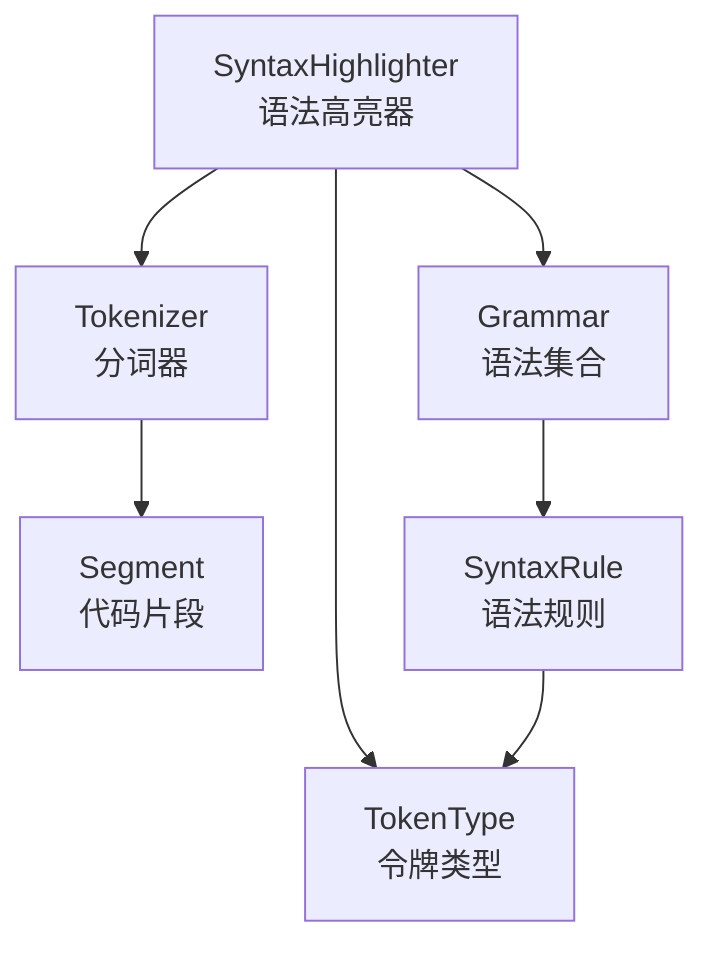
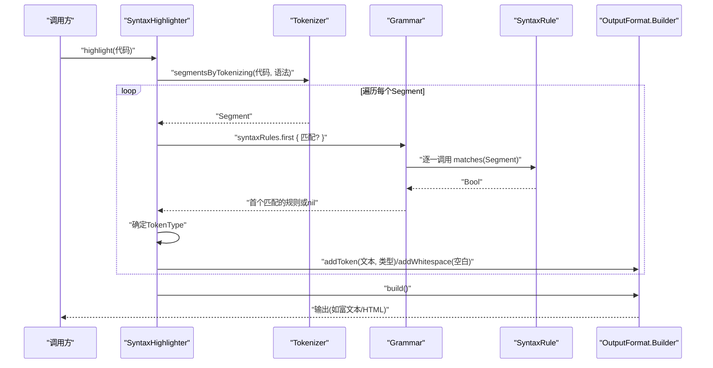
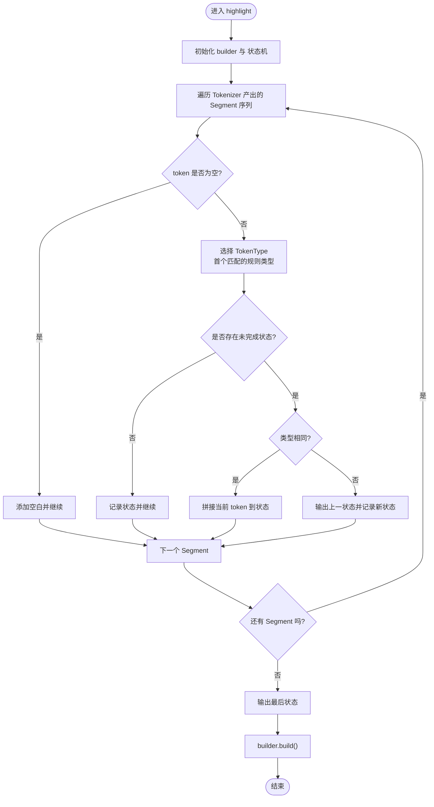
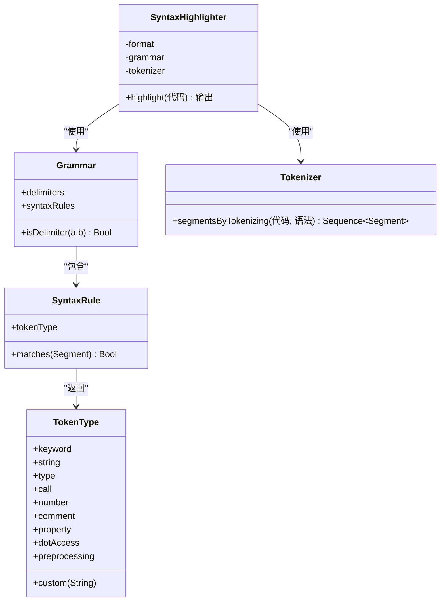

# 语法高亮引擎

<cite>
**本文引用的文件**
- [SyntaxHighlighter.swift](file://MMarkParser/Sources/Splash/Syntax/SyntaxHighlighter.swift)
- [SyntaxRule.swift](file://MMarkParser/Sources/Splash/Syntax/SyntaxRule.swift)
- [SwiftGrammar.swift](file://MMarkParser/Sources/Splash/Grammar/SwiftGrammar.swift)
- [Tokenizer.swift](file://MMarkParser/Sources/Splash/Tokenizing/Tokenizer.swift)
- [TokenType.swift](file://MMarkParser/Sources/Splash/Tokenizing/TokenType.swift)
</cite>

## 目录
1. [引言](#引言)
2. [项目结构](#项目结构)
3. [核心组件](#核心组件)
4. [架构总览](#架构总览)
5. [详细组件分析](#详细组件分析)
6. [依赖分析](#依赖分析)
7. [性能考虑](#性能考虑)
8. [故障排查指南](#故障排查指南)
9. [结论](#结论)
10. [附录](#附录)

## 引言
本文件面向MMarkParser中的语法高亮引擎，系统性阐述其设计与实现，重点覆盖以下方面：
- SyntaxHighlighter的职责与工作流：从代码输入到输出格式构建的完整链路
- 语法规则体系：SyntaxRule协议、SwiftGrammar内置规则集及其匹配逻辑
- 分词与片段化：Tokenizer与Segment的协作，如何将源码切分为可识别的片段
- 高亮范围计算与样式应用：基于TokenType的类型判定与输出格式适配
- 性能优化策略：增量更新与缓存思路（结合现有结构进行可行性分析）
- 配置与扩展：如何切换语言语法、自定义规则与集成到代码块渲染

## 项目结构
语法高亮子系统位于Splash模块下，核心文件组织如下：
- 语法高亮入口与流程控制：SyntaxHighlighter
- 规则接口与实现：SyntaxRule、SwiftGrammar
- 分词与片段：Tokenizer、Segment（由Tokenizer内部迭代器生成）
- 令牌类型：TokenType
- 输出格式抽象（在其他文件中定义）：OutputFormat、OutputBuilder（在SyntaxHighlighter中通过泛型Format使用）

图表来源
- [SyntaxHighlighter.swift:15-81](file://MMarkParser/Sources/Splash/Syntax/SyntaxHighlighter.swift#L15-L81)
- [Tokenizer.swift:9-16](file://MMarkParser/Sources/Splash/Tokenizing/Tokenizer.swift#L9-L16)
- [SwiftGrammar.swift:11-39](file://MMarkParser/Sources/Splash/Grammar/SwiftGrammar.swift#L11-L39)
- [TokenType.swift:10-31](file://MMarkParser/Sources/Splash/Tokenizing/TokenType.swift#L10-L31)

章节来源
- [SyntaxHighlighter.swift:15-81](file://MMarkParser/Sources/Splash/Syntax/SyntaxHighlighter.swift#L15-L81)
- [Tokenizer.swift:9-16](file://MMarkParser/Sources/Splash/Tokenizing/Tokenizer.swift#L9-L16)
- [SwiftGrammar.swift:11-39](file://MMarkParser/Sources/Splash/Grammar/SwiftGrammar.swift#L11-L39)
- [TokenType.swift:10-31](file://MMarkParser/Sources/Splash/Tokenizing/TokenType.swift#L10-L31)

## 核心组件
- SyntaxHighlighter：对外唯一入口，负责将字符串代码按指定输出格式进行高亮。内部持有Format、Grammar与Tokenizer实例，通过遍历分词结果并依据Grammar的规则确定TokenType，最终交由Format的Builder输出。
- SyntaxRule：语法规则协议，每个规则关联一个TokenType，并根据Segment上下文判断是否匹配。
- SwiftGrammar：Swift语言的语法规则集合，默认语法高亮器使用该集合；包含关键字、注释、字符串、数字、调用、属性、点访问、预处理等规则。
- Tokenizer：将源码流转换为Segment序列的迭代器，维护当前索引、行内与全量令牌列表、分隔符合并策略等。
- TokenType：高亮令牌的类型枚举，支持关键字、字符串、类型、调用、数字、注释、属性、点访问、预处理及自定义类型。

章节来源
- [SyntaxHighlighter.swift:15-81](file://MMarkParser/Sources/Splash/Syntax/SyntaxHighlighter.swift#L15-L81)
- [SyntaxRule.swift:14-22](file://MMarkParser/Sources/Splash/Syntax/SyntaxRule.swift#L14-L22)
- [SwiftGrammar.swift:11-39](file://MMarkParser/Sources/Splash/Grammar/SwiftGrammar.swift#L11-L39)
- [Tokenizer.swift:9-16](file://MMarkParser/Sources/Splash/Tokenizing/Tokenizer.swift#L9-L16)
- [TokenType.swift:10-31](file://MMarkParser/Sources/Splash/Tokenizing/TokenType.swift#L10-L31)

## 架构总览
语法高亮的整体流程如下：
- 输入：原始代码字符串
- 分词：Tokenizer将代码逐字符解析为Segment序列
- 规则匹配：Grammar提供多个SyntaxRule，按顺序尝试匹配当前Segment
- 类型判定：首个匹配的规则决定TokenType
- 输出构建：SyntaxHighlighter将token、空白与类型传递给Format.Builder，最终生成目标格式输出

图表来源
- [SyntaxHighlighter.swift:29-80](file://MMarkParser/Sources/Splash/Syntax/SyntaxHighlighter.swift#L29-L80)
- [Tokenizer.swift:10-15](file://MMarkParser/Sources/Splash/Tokenizing/Tokenizer.swift#L10-L15)
- [SwiftGrammar.swift:24-38](file://MMarkParser/Sources/Splash/Grammar/SwiftGrammar.swift#L24-L38)

## 详细组件分析

### SyntaxHighlighter：高亮主控与流程
- 职责
  - 接收代码字符串，驱动分词与规则匹配
  - 维护状态机以合并连续同类型token，避免重复类型边界开销
  - 将token与空白分别交给Format.Builder处理
- 关键点
  - highlight方法返回Format.Builder.Output，具体格式由初始化时传入的Format决定
  - typeOfToken通过grammar.syntaxRules顺序匹配，首个匹配即生效
  - 对空白的处理与token的类型绑定，确保渲染时保留原有排版

图表来源
- [SyntaxHighlighter.swift:29-80](file://MMarkParser/Sources/Splash/Syntax/SyntaxHighlighter.swift#L29-L80)

章节来源
- [SyntaxHighlighter.swift:15-81](file://MMarkParser/Sources/Splash/Syntax/SyntaxHighlighter.swift#L15-L81)

### SyntaxRule：规则定义与匹配
- 协议
  - tokenType：规则对应的TokenType
  - matches：基于Segment上下文判断是否匹配
- 设计要点
  - 规则按优先级顺序排列，首个匹配即决定TokenType
  - 规则可利用Segment提供的前后token、同一行token、空白信息等上下文
- 典型规则类别
  - 关键字、注释、字符串、数字、调用、属性、点访问、预处理、类型等

章节来源
- [SyntaxRule.swift:14-22](file://MMarkParser/Sources/Splash/Syntax/SyntaxRule.swift#L14-L22)

### SwiftGrammar：Swift语言规则集
- 结构
  - delimiters：分隔符集合，用于决定字符是否可合并
  - syntaxRules：规则数组，包含预处理、注释、原始/多行/单行字符串、属性、数字、类型、调用、KeyPath、属性、点访问、关键字等
- 匹配策略
  - 每个规则针对特定语法现象设计，例如：
    - 注释：支持//、/* */、文档注释等
    - 字符串：区分普通/原始/多行/插值场景
    - 数字：处理整数分隔符与小数点边界
    - 调用：排除关键字与特殊语法（如init、switch case、trailing closure）
    - 属性/点访问：基于前缀与上下文符号合法性判断
- 上下文辅助
  - 提供isWithinStringLiteral/isWithinStringInterpolation/isWithinRawStringInterpolation等辅助判断
  - 支持同一行token集合与全量token集合，便于跨token判断

章节来源
- [SwiftGrammar.swift:11-68](file://MMarkParser/Sources/Splash/Grammar/SwiftGrammar.swift#L11-L68)
- [SwiftGrammar.swift:99-561](file://MMarkParser/Sources/Splash/Grammar/SwiftGrammar.swift#L99-L561)
- [SwiftGrammar.swift:564-667](file://MMarkParser/Sources/Splash/Grammar/SwiftGrammar.swift#L564-L667)

### Tokenizer：分词与Segment生成
- 流程
  - 将字符流划分为token/delimiter/whitespace/newline四类组件
  - 基于Grammar.delimiters与isDelimiter合并策略，将相邻字符合并为token
  - 维护当前行与全量token列表，记录前后token与下一行首token
- 特性
  - 使用Buffer与Iterator惰性生成Segment，避免一次性扫描造成内存压力
  - 记录trailingWhitespace与isLastOnLine，便于后续空白与换行处理
- 复杂度
  - 时间复杂度O(N)，N为字符数；空间复杂度与token数量线性相关

章节来源
- [Tokenizer.swift:9-16](file://MMarkParser/Sources/Splash/Tokenizing/Tokenizer.swift#L9-L16)
- [Tokenizer.swift:35-196](file://MMarkParser/Sources/Splash/Tokenizing/Tokenizer.swift#L35-L196)

### TokenType：令牌类型与自定义
- 内置类型
  - keyword、string、type、call、number、comment、property、dotAccess、preprocessing
  - custom(String)：允许扩展自定义类型
- 使用方式
  - 规则返回对应TokenType，SyntaxHighlighter据此调用builder.addToken或addPlainText

章节来源
- [TokenType.swift:10-31](file://MMarkParser/Sources/Splash/Tokenizing/TokenType.swift#L10-L31)

## 依赖分析
- SyntaxHighlighter依赖
  - Grammar：提供分隔符集合与规则数组
  - Tokenizer：提供Segment序列
  - OutputFormat：通过泛型Format约束，委托构建输出
- Grammar内部依赖
  - SyntaxRule：规则匹配
  - Segment：规则匹配上下文
- Tokenizer内部依赖
  - Grammar.delimiters与isDelimiter合并策略
  - Segment.Tokens：维护token计数、行内与全量token列表

图表来源
- [SyntaxHighlighter.swift:15-25](file://MMarkParser/Sources/Splash/Syntax/SyntaxHighlighter.swift#L15-L25)
- [SwiftGrammar.swift:11-39](file://MMarkParser/Sources/Splash/Grammar/SwiftGrammar.swift#L11-L39)
- [Tokenizer.swift:9-15](file://MMarkParser/Sources/Splash/Tokenizing/Tokenizer.swift#L9-L15)
- [SyntaxRule.swift:14-22](file://MMarkParser/Sources/Splash/Syntax/SyntaxRule.swift#L14-L22)
- [TokenType.swift:10-31](file://MMarkParser/Sources/Splash/Tokenizing/TokenType.swift#L10-L31)

章节来源
- [SyntaxHighlighter.swift:15-25](file://MMarkParser/Sources/Splash/Syntax/SyntaxHighlighter.swift#L15-L25)
- [SwiftGrammar.swift:11-39](file://MMarkParser/Sources/Splash/Grammar/SwiftGrammar.swift#L11-L39)
- [Tokenizer.swift:9-15](file://MMarkParser/Sources/Splash/Tokenizing/Tokenizer.swift#L9-L15)
- [SyntaxRule.swift:14-22](file://MMarkParser/Sources/Splash/Syntax/SyntaxRule.swift#L14-L22)
- [TokenType.swift:10-31](file://MMarkParser/Sources/Splash/Tokenizing/TokenType.swift#L10-L31)

## 性能考虑
- 时间复杂度
  - Tokenizer：O(N)，逐字符扫描并按规则合并
  - SyntaxHighlighter：O(N + R)，其中R为规则数量；由于规则按序匹配且首个命中即停止，实际匹配次数通常很小
- 空间复杂度
  - Tokenizer维护token计数、全量与行内token列表，整体与token数线性相关
- 可能的优化方向（基于现有结构的可行建议）
  - 增量更新：当仅修改代码块局部时，可复用前一次的token计数与行内token列表，仅对受影响区域重新分词与重算类型
  - 缓存：对常见token（如关键字、常用类型名）建立轻量映射表，减少规则匹配次数
  - 规则排序：将最可能命中的规则置于前面，降低平均匹配深度
  - 并行化：在多核环境下，可将不同行的分词与匹配拆分执行（需注意跨行规则的限制）
- 现状评估
  - 当前Tokenizer采用惰性迭代器，避免一次性分配大对象
  - SyntaxHighlighter通过状态机合并连续同类型token，减少输出层的类型切换

章节来源
- [Tokenizer.swift:35-196](file://MMarkParser/Sources/Splash/Tokenizing/Tokenizer.swift#L35-L196)
- [SyntaxHighlighter.swift:29-80](file://MMarkParser/Sources/Splash/Syntax/SyntaxHighlighter.swift#L29-L80)

## 故障排查指南
- 常见问题
  - 高亮不准确：检查Grammar中规则顺序与上下文判断是否覆盖目标语法现象
  - 字符串/注释未正确闭合：确认分隔符合并策略与行内状态是否正确
  - 调用/属性误判：核对调用规则与属性规则的前置条件与排除项
- 定位方法
  - 在Tokenizer中打印Segment的关键字段（当前token、前后token、同一行token、trailingWhitespace、isLastOnLine）
  - 在SyntaxHighlighter中打印每个Segment的TokenType决策过程
- 建议
  - 逐步缩小规则范围，先验证简单规则（如关键字、注释），再叠加复杂规则
  - 针对边界情况（如trailing closure、switch case、raw string插值）编写测试用例

章节来源
- [SwiftGrammar.swift:99-561](file://MMarkParser/Sources/Splash/Grammar/SwiftGrammar.swift#L99-L561)
- [Tokenizer.swift:35-196](file://MMarkParser/Sources/Splash/Tokenizing/Tokenizer.swift#L35-L196)
- [SyntaxHighlighter.swift:29-80](file://MMarkParser/Sources/Splash/Syntax/SyntaxHighlighter.swift#L29-L80)

## 结论
MMarkParser的语法高亮引擎以清晰的分层设计实现了从源码到高亮输出的完整流程：Tokenizer负责精确分词，Grammar提供规则集，SyntaxHighlighter协调规则匹配与输出构建。该架构具备良好的可扩展性，既可直接使用SwiftGrammar，也可通过自定义Grammar与SyntaxRule扩展到其他语言或领域特定语法。在性能方面，现有惰性迭代与状态机合并已具备良好基础，进一步可通过增量更新与缓存策略提升交互体验。

## 附录

### 如何切换语言语法
- 使用默认Swift语法：初始化时无需传入Grammar
- 自定义语法：实现Grammar协议（提供delimiters与syntaxRules），并在SyntaxHighlighter初始化时传入

章节来源
- [SyntaxHighlighter.swift:22-25](file://MMarkParser/Sources/Splash/Syntax/SyntaxHighlighter.swift#L22-L25)
- [SwiftGrammar.swift:11-39](file://MMarkParser/Sources/Splash/Grammar/SwiftGrammar.swift#L11-L39)

### 如何创建自定义规则
- 实现SyntaxRule协议，定义tokenType与matches逻辑
- 将规则加入Grammar的syntaxRules数组
- 注意规则顺序与上下文判断，避免与已有规则冲突

章节来源
- [SyntaxRule.swift:14-22](file://MMarkParser/Sources/Splash/Syntax/SyntaxRule.swift#L14-L22)
- [SwiftGrammar.swift:24-38](file://MMarkParser/Sources/Splash/Grammar/SwiftGrammar.swift#L24-L38)

### 如何集成到代码块渲染
- 在代码块渲染流程中，先调用SyntaxHighlighter.highlight生成高亮输出
- 将输出交由目标视图（如富文本或HTML渲染器）进行展示
- 若需要增量更新，可在编辑器侧触发局部重算，复用历史token状态

章节来源
- [SyntaxHighlighter.swift:29-75](file://MMarkParser/Sources/Splash/Syntax/SyntaxHighlighter.swift#L29-L75)