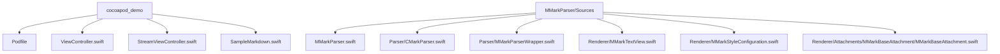
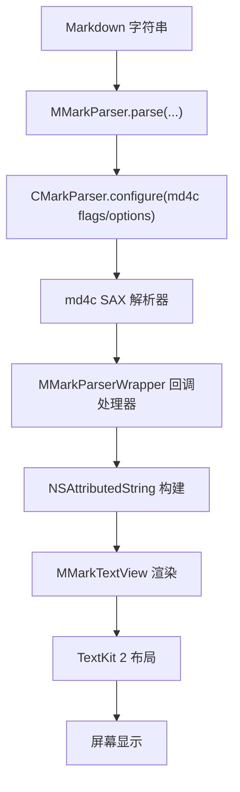
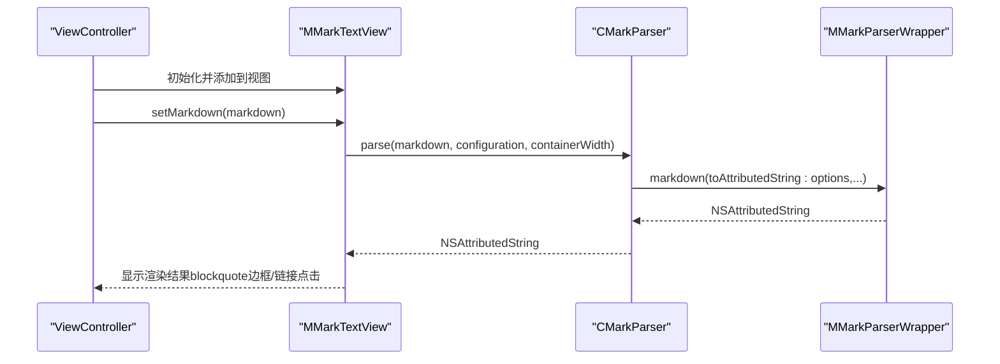
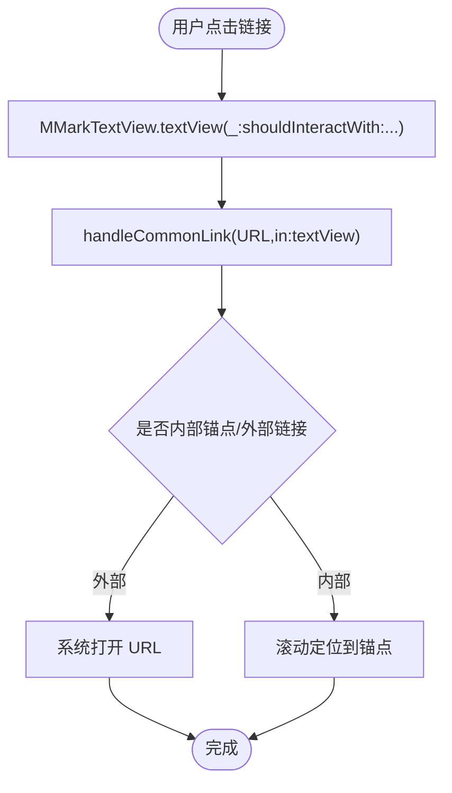
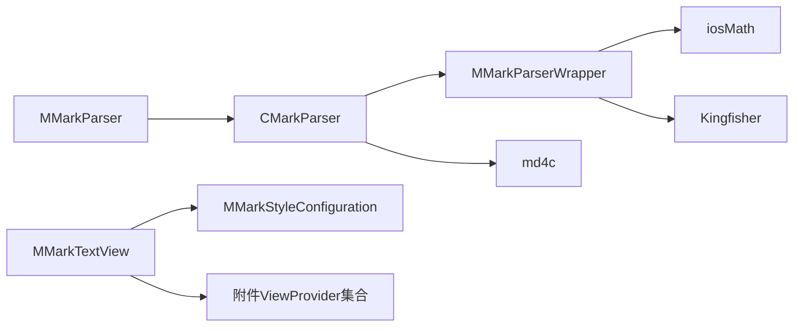

# 快速开始

<cite>
**本文引用的文件**
- [README.md](file://README.md)
- [MMarkParser.podspec](file://MMarkParser.podspec)
- [Podfile](file://cocoapod_demo/Podfile)
- [SampleMarkdown.swift](file://cocoapod_demo/cocoapod_demo/SampleMarkdown.swift)
- [ViewController.swift](file://cocoapod_demo/cocoapod_demo/ViewController.swift)
- [StreamViewController.swift](file://cocoapod_demo/cocoapod_demo/StreamViewController.swift)
- [MMarkParser.swift](file://MMarkParser/Sources/MMarkParser.swift)
- [CMarkParser.swift](file://MMarkParser/Sources/Parser/CMarkParser.swift)
- [MMarkParserWrapper.swift](file://MMarkParser/Sources/Parser/MMarkParserWrapper.swift)
- [MMarkTextView.swift](file://MMarkParser/Sources/Renderer/MMarkTextView.swift)
- [MMarkStyleConfiguration.swift](file://MMarkParser/Sources/Renderer/MMarkStyleConfiguration.swift)
- [MMarkBaseAttachment.swift](file://MMarkParser/Sources/Renderer/Attachments/MMarkBaseAttachment/MMarkBaseAttachment.swift)
</cite>

## 目录
1. [简介](#简介)
2. [项目结构](#项目结构)
3. [核心组件](#核心组件)
4. [架构总览](#架构总览)
5. [详细组件解析](#详细组件解析)
6. [依赖关系分析](#依赖关系分析)
7. [性能考量](#性能考量)
8. [故障排查指南](#故障排查指南)
9. [结论](#结论)
10. [附录](#附录)

## 简介
本指南面向希望在 iOS 项目中快速集成 Markdown 渲染能力的开发者，基于 MMarkParser 提供的 CocoaPods 安装方式与最小可用示例，帮助你在最短时间内完成从安装到首屏渲染的全流程。你将学会：
- 使用 CocoaPods 安装 MMarkParser，并正确配置依赖与版本
- 将 Markdown 字符串解析为 NSAttributedString
- 使用 String 扩展便捷解析
- 在 MMarkTextView 中展示渲染结果，包括链接点击处理与 blockquote 边框绘制
- 自定义样式配置，快速实现个性化主题

## 项目结构
仓库采用“源码 + 示例工程”的组织方式，核心代码位于 MMarkParser/Sources，示例工程位于 cocoapod_demo，便于直接运行体验。

图表来源
- [Podfile:1-20](file://cocoapod_demo/Podfile#L1-L20)
- [ViewController.swift:1-46](file://cocoapod_demo/cocoapod_demo/ViewController.swift#L1-L46)
- [StreamViewController.swift:1-279](file://cocoapod_demo/cocoapod_demo/StreamViewController.swift#L1-L279)
- [MMarkParser.swift:1-42](file://MMarkParser/Sources/MMarkParser.swift#L1-L42)
- [CMarkParser.swift:1-81](file://MMarkParser/Sources/Parser/CMarkParser.swift#L1-L81)
- [MMarkParserWrapper.swift:1-800](file://MMarkParser/Sources/Parser/MMarkParserWrapper.swift#L1-L800)
- [MMarkTextView.swift:1-81](file://MMarkParser/Sources/Renderer/MMarkTextView.swift#L1-L81)
- [MMarkStyleConfiguration.swift:1-339](file://MMarkParser/Sources/Renderer/MMarkStyleConfiguration.swift#L1-L339)
- [MMarkBaseAttachment.swift:1-60](file://MMarkParser/Sources/Renderer/Attachments/MMarkBaseAttachment/MMarkBaseAttachment.swift#L1-L60)

章节来源
- [README.md:1-237](file://README.md#L1-L237)
- [Podfile:1-20](file://cocoapod_demo/Podfile#L1-L20)
- [ViewController.swift:1-46](file://cocoapod_demo/cocoapod_demo/ViewController.swift#L1-L46)
- [StreamViewController.swift:1-279](file://cocoapod_demo/cocoapod_demo/StreamViewController.swift#L1-L279)

## 核心组件
- MMarkParser：公共 API 入口，提供 parse(markdown:configuration:containerWidth:) 与 String 扩展 parseMarkdown()
- CMarkParser：基于 md4c 的 SAX 解析器，负责将 Markdown 转换为 NSAttributedString
- MMarkParserWrapper：md4c 回调处理器，构建属性字符串与附件
- MMarkTextView：TextKit 2 文本视图，支持 blockquote 边框绘制与链接点击处理
- MMarkStyleConfiguration：样式配置中心，涵盖标题、代码、链接、引用块、表格、任务列表、数学公式、脚注等
- MMarkBaseAttachment：附件基类，承载代码块、图片、表格、水平分割线、列表标记、数学公式等

章节来源
- [MMarkParser.swift:1-42](file://MMarkParser/Sources/MMarkParser.swift#L1-L42)
- [CMarkParser.swift:1-81](file://MMarkParser/Sources/Parser/CMarkParser.swift#L1-L81)
- [MMarkParserWrapper.swift:1-800](file://MMarkParser/Sources/Parser/MMarkParserWrapper.swift#L1-L800)
- [MMarkTextView.swift:1-81](file://MMarkParser/Sources/Renderer/MMarkTextView.swift#L1-L81)
- [MMarkStyleConfiguration.swift:1-339](file://MMarkParser/Sources/Renderer/MMarkStyleConfiguration.swift#L1-L339)
- [MMarkBaseAttachment.swift:1-60](file://MMarkParser/Sources/Renderer/Attachments/MMarkBaseAttachment/MMarkBaseAttachment.swift#L1-L60)

## 架构总览
MMarkParser 采用“回调驱动 + TextKit 2 附件”的架构：解析阶段通过 md4c 的 SAX 回调增量构建 NSAttributedString；渲染阶段将复杂元素（代码块、表格、图片、数学公式、水平分割线、列表标记）以 NSTextAttachment 形式插入，借助 TextKit 2 的布局引擎进行最终呈现。

图表来源
- [README.md:108-180](file://README.md#L108-L180)
- [MMarkParser.swift:11-26](file://MMarkParser/Sources/MMarkParser.swift#L11-L26)
- [CMarkParser.swift:55-66](file://MMarkParser/Sources/Parser/CMarkParser.swift#L55-L66)
- [MMarkParserWrapper.swift:134-644](file://MMarkParser/Sources/Parser/MMarkParserWrapper.swift#L134-L644)
- [MMarkTextView.swift:39-49](file://MMarkParser/Sources/Renderer/MMarkTextView.swift#L39-L49)

## 详细组件解析

### CocoaPods 安装与依赖配置
- 版本与仓库：使用指定 tag 的 git 仓库地址与版本号
- 依赖声明：md4c/Core、iosMath、Kingfisher
- 示例工程 Podfile 展示了本地路径与分支策略，便于调试与联调

建议操作步骤
- 在你的 Podfile 中添加 MMarkParser 的依赖声明
- 确保平台版本与 Swift 版本满足要求（iOS 15.0+，Swift 5.7+）
- 安装后同步工程，确认依赖已正确拉取

章节来源
- [README.md:28-40](file://README.md#L28-L40)
- [MMarkParser.podspec:1-19](file://MMarkParser.podspec#L1-L19)
- [Podfile:1-20](file://cocoapod_demo/Podfile#L1-L20)

### 基础使用示例：解析 Markdown 为 NSAttributedString
- 方式一：调用 MMarkParser.parse(markdown:configuration:containerWidth:)
- 方式二：使用 String 扩展 parseMarkdown(configuration:containerWidth:)

预期效果
- 返回可直接用于 TextKit 的 NSAttributedString
- 支持标题、段落、粗体、斜体、删除线、行内代码、链接、图片、引用块、列表、表格、水平分割线、LaTeX 数学、脚注等

章节来源
- [README.md:41-57](file://README.md#L41-L57)
- [MMarkParser.swift:11-26](file://MMarkParser/Sources/MMarkParser.swift#L11-L26)
- [MMarkParser.swift:31-41](file://MMarkParser/Sources/MMarkParser.swift#L31-L41)

### 在 MMarkTextView 中显示渲染内容
- 初始化 MMarkTextView，设置约束
- 调用 setMarkdown(_:) 加载 Markdown 文本
- 自动具备 blockquote 边框绘制与链接点击处理能力

图表来源
- [ViewController.swift:38-43](file://cocoapod_demo/cocoapod_demo/ViewController.swift#L38-L43)
- [MMarkTextView.swift:39-49](file://MMarkParser/Sources/Renderer/MMarkTextView.swift#L39-L49)
- [CMarkParser.swift:55-66](file://MMarkParser/Sources/Parser/CMarkParser.swift#L55-L66)
- [MMarkParserWrapper.swift:1-800](file://MMarkParser/Sources/Parser/MMarkParserWrapper.swift#L1-L800)

章节来源
- [ViewController.swift:1-46](file://cocoapod_demo/cocoapod_demo/ViewController.swift#L1-L46)
- [MMarkTextView.swift:1-81](file://MMarkParser/Sources/Renderer/MMarkTextView.swift#L1-L81)

### 链接点击处理与 blockquote 边框绘制
- 链接点击：MMarkTextView 实现 UITextViewDelegate，拦截链接交互并交由通用处理逻辑
- blockquote 边框：通过 enumerateTextLayoutFragments 获取片段位置，绘制引用块左侧竖条

图表来源
- [MMarkTextView.swift:66-71](file://MMarkParser/Sources/Renderer/MMarkTextView.swift#L66-L71)
- [MMarkParserWrapper.swift:682-708](file://MMarkParser/Sources/Parser/MMarkParserWrapper.swift#L682-L708)

章节来源
- [MMarkTextView.swift:64-81](file://MMarkParser/Sources/Renderer/MMarkTextView.swift#L64-L81)
- [MMarkParserWrapper.swift:682-708](file://MMarkParser/Sources/Parser/MMarkParserWrapper.swift#L682-L708)

### 样式定制与主题化
- 使用 MMarkStyleConfiguration.defaultStyle 获取默认样式
- 可定制标题、段落、代码、链接、引用块、表格、任务列表、数学公式、脚注等
- 示例工程展示了如何修改有序列表颜色、无序列表图标、任务列表图标等

章节来源
- [README.md:59-85](file://README.md#L59-L85)
- [MMarkStyleConfiguration.swift:188-267](file://MMarkParser/Sources/Renderer/MMarkStyleConfiguration.swift#L188-L267)
- [StreamViewController.swift:167-199](file://cocoapod_demo/cocoapod_demo/StreamViewController.swift#L167-L199)

### 附件模型与渲染机制
- MMarkBaseAttachment 作为附件基类，根据类型选择对应的 ViewProvider
- 代码块、图片、表格、水平分割线、列表标记、数学公式均以附件形式插入，保证复杂元素的独立渲染与交互

章节来源
- [MMarkBaseAttachment.swift:1-60](file://MMarkParser/Sources/Renderer/Attachments/MMarkBaseAttachment/MMarkBaseAttachment.swift#L1-L60)

## 依赖关系分析
- MMarkParser 依赖 CMarkParser 与 MMarkParserWrapper
- CMarkParser 依赖 md4c（通过 C 接口）与 MMarkStyleConfiguration
- MMarkParserWrapper 依赖 iosMath（LaTeX 数学）、Kingfisher（远程图片加载）
- MMarkTextView 依赖 MMarkStyleConfiguration 与各附件 ViewProvider

图表来源
- [MMarkParser.swift:1-42](file://MMarkParser/Sources/MMarkParser.swift#L1-L42)
- [CMarkParser.swift:1-81](file://MMarkParser/Sources/Parser/CMarkParser.swift#L1-L81)
- [MMarkParserWrapper.swift:1-800](file://MMarkParser/Sources/Parser/MMarkParserWrapper.swift#L1-L800)
- [MMarkTextView.swift:1-81](file://MMarkParser/Sources/Renderer/MMarkTextView.swift#L1-L81)
- [MMarkStyleConfiguration.swift:1-339](file://MMarkParser/Sources/Renderer/MMarkStyleConfiguration.swift#L1-L339)

章节来源
- [README.md:36-40](file://README.md#L36-L40)
- [MMarkParser.podspec:15-18](file://MMarkParser.podspec#L15-L18)

## 性能考量
- 回调驱动解析：md4c SAX 模型在解析过程中增量构建 NSAttributedString，避免一次性构建 AST，降低内存峰值
- TextKit 2 附件：复杂元素以附件形式插入，利用 TextKit 2 的高效布局与渲染
- 容器宽度：传入合理的 containerWidth 有助于减少重排与测量开销
- 图片加载：依赖 Kingfisher 进行异步加载与缓存，避免主线程阻塞
- 数学公式：iosMath 渲染需注意字体注册与缓存，建议在应用启动时预热

## 故障排查指南
常见问题与解决思路
- 无法解析或解析失败
  - 检查输入是否为空或非法
  - 确认依赖版本匹配（md4c、iosMath、Kingfisher）
  - 查看抛出的 ParseError 类型
- 链接点击无响应
  - 确认 MMarkTextView 的 delegate 已设置
  - 检查链接样式与颜色是否被覆盖
- 引用块边框未显示
  - 确认 contentSize 发生变化后触发了更新
  - 检查 blockquote 样式配置（边框宽度、颜色、背景）

章节来源
- [CMarkParser.swift:8-12](file://MMarkParser/Sources/Parser/CMarkParser.swift#L8-L12)
- [MMarkTextView.swift:52-61](file://MMarkParser/Sources/Renderer/MMarkTextView.swift#L52-L61)

## 结论
通过本快速开始指南，你已经完成了：
- CocoaPods 安装与依赖配置
- Markdown 解析与 NSAttributedString 生成
- 在 MMarkTextView 中渲染并处理链接点击
- 自定义样式与主题化
- 了解核心组件与依赖关系

建议下一步
- 在真实项目中结合业务场景调整样式配置
- 使用 String 扩展简化解析调用
- 在需要时引入流式渲染（MMarkStreamTextView）提升用户体验

## 附录
- 示例工程入口
  - 基础示例：ViewController.swift
  - 流式示例：StreamViewController.swift
  - 示例 Markdown 文本：SampleMarkdown.swift

章节来源
- [ViewController.swift:1-46](file://cocoapod_demo/cocoapod_demo/ViewController.swift#L1-L46)
- [StreamViewController.swift:1-279](file://cocoapod_demo/cocoapod_demo/StreamViewController.swift#L1-L279)
- [SampleMarkdown.swift:1-760](file://cocoapod_demo/cocoapod_demo/SampleMarkdown.swift#L1-L760)