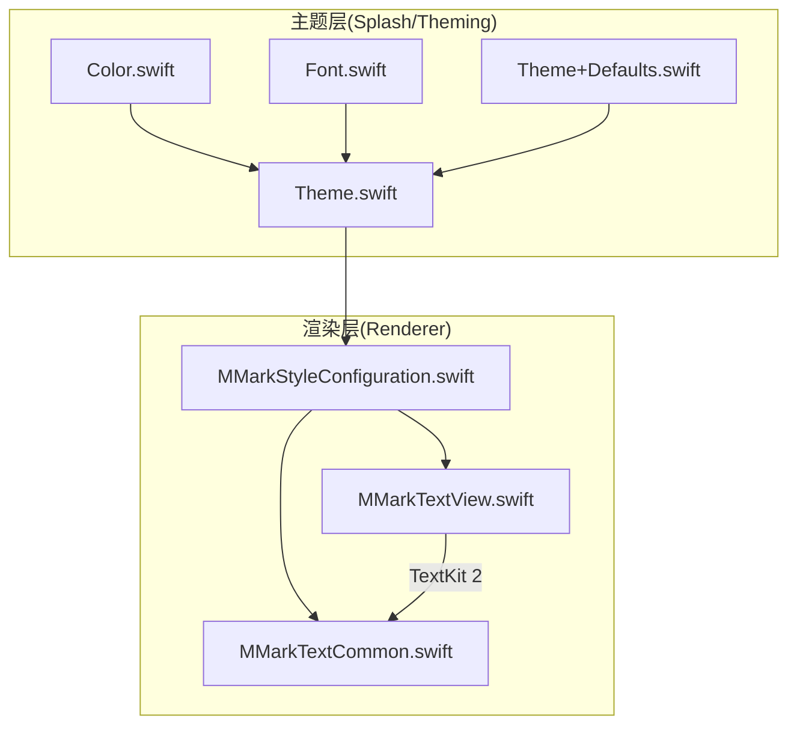
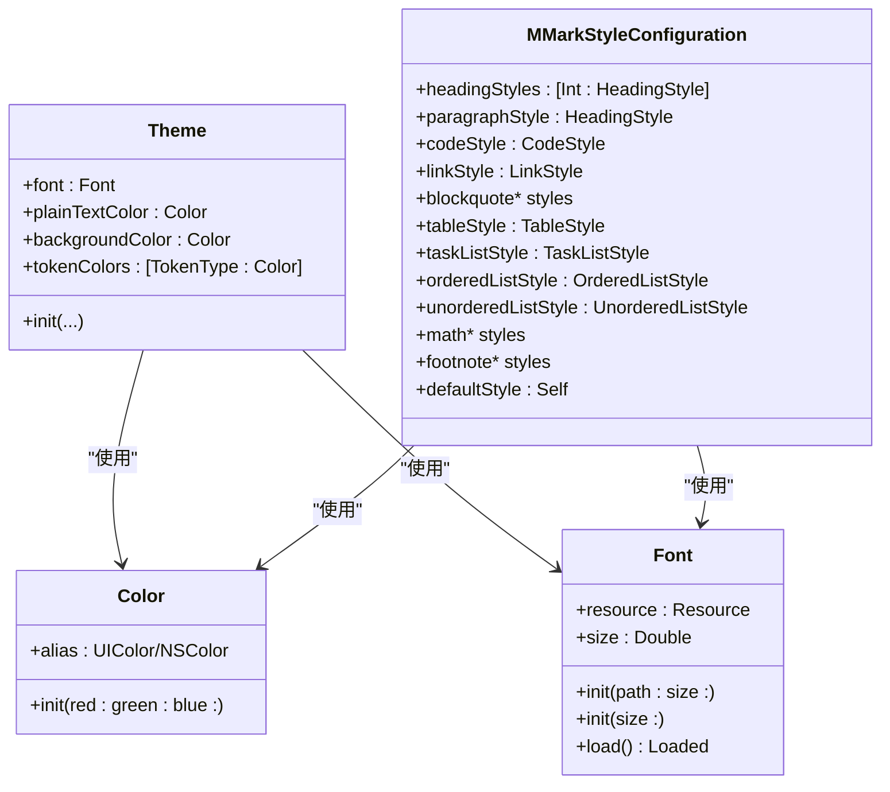
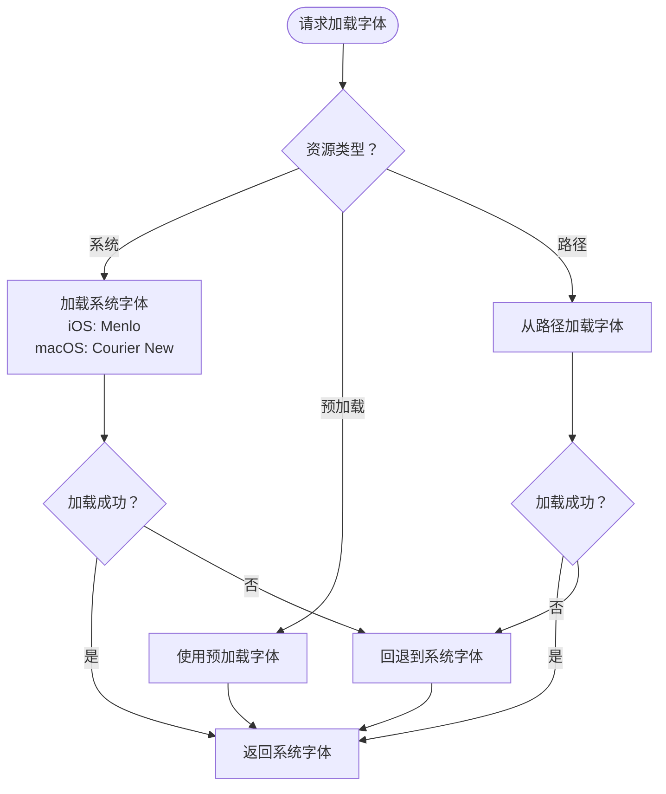
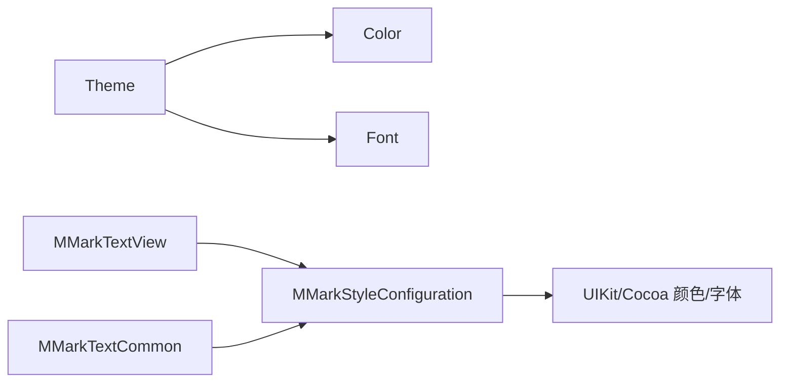

# 主题系统设计

<cite>
**本文档引用的文件**
- [Theme.swift](file://MMarkParser/Sources/Splash/Theming/Theme.swift)
- [Color.swift](file://MMarkParser/Sources/Splash/Theming/Color.swift)
- [Font.swift](file://MMarkParser/Sources/Splash/Theming/Font.swift)
- [Theme+Defaults.swift](file://MMarkParser/Sources/Splash/Theming/Theme+Defaults.swift)
- [MMarkStyleConfiguration.swift](file://MMarkParser/Sources/Renderer/MMarkStyleConfiguration.swift)
- [MMarkTextView.swift](file://MMarkParser/Sources/Renderer/MMarkTextView.swift)
- [MMarkTextCommon.swift](file://MMarkParser/Sources/Renderer/MMarkTextCommon.swift)
- [README.md](file://README.md)
</cite>

## 目录
1. [简介](#简介)
2. [项目结构](#项目结构)
3. [核心组件](#核心组件)
4. [架构总览](#架构总览)
5. [详细组件分析](#详细组件分析)
6. [依赖关系分析](#依赖关系分析)
7. [性能考虑](#性能考虑)
8. [故障排查指南](#故障排查指南)
9. [结论](#结论)
10. [附录](#附录)

## 简介
本文件围绕 MMarkParser 的主题系统进行系统化设计说明，重点覆盖以下方面：
- 主题模型 Theme 的设计理念与实现机制
- 颜色管理 Color 的跨平台抽象与便捷构造
- 字体管理 Font 的字体族选择与回退策略
- 主题系统与 MMarkStyleConfiguration 的集成方式，实现样式的统一管理与动态切换
- 预定义主题与自定义扩展的实践方法
- 在多平台（iOS/macOS/Linux）与多设备环境下的适配策略
- 性能优化与内存管理建议
- 实战示例：如何实现深色/浅色等主题切换

## 项目结构
主题系统位于 Splash/Theming 子模块中，配合 Renderer 层的样式配置 MMarkStyleConfiguration，共同完成 Markdown 文本的渲染与主题化呈现。

图表来源
- [Theme.swift:1-42](file://MMarkParser/Sources/Splash/Theming/Theme.swift#L1-L42)
- [Color.swift:1-22](file://MMarkParser/Sources/Splash/Theming/Color.swift#L1-L22)
- [Font.swift:1-104](file://MMarkParser/Sources/Splash/Theming/Font.swift#L1-L104)
- [Theme+Defaults.swift:1-182](file://MMarkParser/Sources/Splash/Theming/Theme+Defaults.swift#L1-L182)
- [MMarkStyleConfiguration.swift:1-339](file://MMarkParser/Sources/Renderer/MMarkStyleConfiguration.swift#L1-L339)
- [MMarkTextView.swift:1-81](file://MMarkParser/Sources/Renderer/MMarkTextView.swift#L1-L81)
- [MMarkTextCommon.swift:1-290](file://MMarkParser/Sources/Renderer/MMarkTextCommon.swift#L1-L290)

章节来源
- [Theme.swift:1-42](file://MMarkParser/Sources/Splash/Theming/Theme.swift#L1-L42)
- [Font.swift:1-104](file://MMarkParser/Sources/Splash/Theming/Font.swift#L1-L104)
- [Color.swift:1-22](file://MMarkParser/Sources/Splash/Theming/Color.swift#L1-L22)
- [Theme+Defaults.swift:1-182](file://MMarkParser/Sources/Splash/Theming/Theme+Defaults.swift#L1-L182)
- [MMarkStyleConfiguration.swift:1-339](file://MMarkParser/Sources/Renderer/MMarkStyleConfiguration.swift#L1-L339)
- [MMarkTextView.swift:1-81](file://MMarkParser/Sources/Renderer/MMarkTextView.swift#L1-L81)
- [MMarkTextCommon.swift:1-290](file://MMarkParser/Sources/Renderer/MMarkTextCommon.swift#L1-L290)

## 核心组件
- Theme：主题的核心数据结构，聚合字体、普通文本颜色、背景色与语法高亮词法颜色映射。
- Color：跨平台颜色类型别名（iOS 使用 UIColor，macOS 使用 NSColor），并提供便捷构造。
- Font：跨平台字体抽象，支持系统字体、预加载字体与从路径加载字体，并内置回退策略。
- Theme+Defaults：提供多种预设主题（如 Midnight、WWDC17/18、Sunset、Presentation 等）。
- MMarkStyleConfiguration：渲染层样式配置，涵盖标题、段落、代码、链接、表格、任务列表、数学公式、脚注等元素的样式集合，是主题系统在渲染阶段的落地载体。

章节来源
- [Theme.swift:17-39](file://MMarkParser/Sources/Splash/Theming/Theme.swift#L17-L39)
- [Color.swift:7-21](file://MMarkParser/Sources/Splash/Theming/Color.swift#L7-L21)
- [Font.swift:11-83](file://MMarkParser/Sources/Splash/Theming/Font.swift#L11-L83)
- [Theme+Defaults.swift:11-179](file://MMarkParser/Sources/Splash/Theming/Theme+Defaults.swift#L11-L179)
- [MMarkStyleConfiguration.swift:10-338](file://MMarkParser/Sources/Renderer/MMarkStyleConfiguration.swift#L10-L338)

## 架构总览
主题系统通过 Theme 聚合颜色与字体信息，再由渲染层的 MMarkStyleConfiguration 统一承载各元素样式。二者协同工作，实现“主题定义—样式落地”的清晰分层。

图表来源
- [Theme.swift:20-38](file://MMarkParser/Sources/Splash/Theming/Theme.swift#L20-L38)
- [Color.swift:7-21](file://MMarkParser/Sources/Splash/Theming/Color.swift#L7-L21)
- [Font.swift:15-83](file://MMarkParser/Sources/Splash/Theming/Font.swift#L15-L83)
- [MMarkStyleConfiguration.swift:11-338](file://MMarkParser/Sources/Renderer/MMarkStyleConfiguration.swift#L11-L338)

## 详细组件分析

### Theme 设计与实现
- 结构职责：集中管理渲染所需的颜色与字体资源，便于主题切换与组合。
- 关键字段：
  - font：高亮文本使用的字体
  - plainTextColor：无高亮的普通文本颜色
  - backgroundColor：背景色
  - tokenColors：语法高亮词法类型到颜色的映射
- 初始化：提供带默认背景色的构造器，确保基础可用性。

章节来源
- [Theme.swift:17-39](file://MMarkParser/Sources/Splash/Theming/Theme.swift#L17-L39)

### Color 跨平台抽象
- 类型别名：根据平台选择 UIColor 或 NSColor，保证在 iOS/macOS 下一致的 API 使用体验。
- 便捷构造：提供 RGB 三通道的便捷初始化，内部自动设置 alpha 为 1。
- 平台差异：Linux 平台不启用主题能力，避免运行时错误。

章节来源
- [Color.swift:7-21](file://MMarkParser/Sources/Splash/Theming/Color.swift#L7-L21)

### Font 字体族与回退机制
- 抽象模型：Font 包含资源类型与字号，资源类型支持系统字体、预加载字体与路径字体。
- 加载策略：
  - 系统字体：默认回退 Menlo（iOS）或 Courier New（macOS），失败后回退到系统字体。
  - 路径字体：从文件系统加载字体文件，失败时同样回退到系统字体。
- 跨平台类型：Loaded 类型在 iOS 对应 UIFont，在 macOS 对应 NSFont。

图表来源
- [Font.swift:48-82](file://MMarkParser/Sources/Splash/Theming/Font.swift#L48-L82)

章节来源
- [Font.swift:11-83](file://MMarkParser/Sources/Splash/Theming/Font.swift#L11-L83)

### 预定义主题与自定义扩展
- 预定义主题：提供多种经典主题（Midnight、WWDC17/18、Sunset、Presentation 等），每种主题定义了普通文本色、高亮词法色与背景色。
- 自定义扩展：可通过继承 Theme 并组合 Font 与 Color，或基于现有主题进行微调，实现个性化主题。

章节来源
- [Theme+Defaults.swift:11-179](file://MMarkParser/Sources/Splash/Theming/Theme+Defaults.swift#L11-L179)

### 与 MMarkStyleConfiguration 的集成
- 渲染落地：MMarkStyleConfiguration 提供渲染所需的各类样式（标题、段落、代码、链接、表格、任务列表、数学公式、脚注等），作为最终渲染输出的样式源。
- 统一管理：通过将 Theme 中的颜色与字体信息映射到 MMarkStyleConfiguration 的对应字段，实现主题的统一管理与动态切换。
- 动态切换：在运行时替换 MMarkStyleConfiguration 的样式集合，即可实现主题切换（例如深色/浅色模式）。

章节来源
- [MMarkStyleConfiguration.swift:10-338](file://MMarkParser/Sources/Renderer/MMarkStyleConfiguration.swift#L10-L338)
- [MMarkTextView.swift:8-9](file://MMarkParser/Sources/Renderer/MMarkTextView.swift#L8-L9)

### 主题创建与切换示例
- 创建主题：使用 Theme+Defaults 提供的静态工厂方法快速生成主题，或自定义 Theme 实例。
- 应用到渲染：将主题中的颜色与字体应用到 MMarkStyleConfiguration 的相应字段，然后通过 MMarkTextView 进行渲染。
- 切换主题：在应用层维护多个 MMarkStyleConfiguration 实例（如 defaultStyle、darkStyle），在用户操作时切换赋值，触发界面刷新。

章节来源
- [Theme+Defaults.swift:11-179](file://MMarkParser/Sources/Splash/Theming/Theme+Defaults.swift#L11-L179)
- [MMarkStyleConfiguration.swift:188-267](file://MMarkParser/Sources/Renderer/MMarkStyleConfiguration.swift#L188-L267)
- [MMarkTextView.swift:39-49](file://MMarkParser/Sources/Renderer/MMarkTextView.swift#L39-L49)
- [README.md:59-86](file://README.md#L59-L86)

## 依赖关系分析
- Theme 依赖 Color 与 Font，形成主题数据层。
- MMarkStyleConfiguration 依赖 UIKit/Cocoa 的颜色与字体类型，负责渲染层样式落地。
- MMarkTextView 与 MMarkTextCommon 通过 MMarkStyleConfiguration 完成最终渲染与交互。

图表来源
- [Theme.swift:20-38](file://MMarkParser/Sources/Splash/Theming/Theme.swift#L20-L38)
- [Color.swift:7-21](file://MMarkParser/Sources/Splash/Theming/Color.swift#L7-L21)
- [Font.swift:15-83](file://MMarkParser/Sources/Splash/Theming/Font.swift#L15-L83)
- [MMarkStyleConfiguration.swift:11-338](file://MMarkParser/Sources/Renderer/MMarkStyleConfiguration.swift#L11-L338)
- [MMarkTextView.swift:6-37](file://MMarkParser/Sources/Renderer/MMarkTextView.swift#L6-L37)
- [MMarkTextCommon.swift:33-36](file://MMarkParser/Sources/Renderer/MMarkTextCommon.swift#L33-L36)

章节来源
- [Theme.swift:17-39](file://MMarkParser/Sources/Splash/Theming/Theme.swift#L17-L39)
- [MMarkStyleConfiguration.swift:11-338](file://MMarkParser/Sources/Renderer/MMarkStyleConfiguration.swift#L11-L338)
- [MMarkTextView.swift:6-37](file://MMarkParser/Sources/Renderer/MMarkTextView.swift#L6-L37)
- [MMarkTextCommon.swift:33-36](file://MMarkParser/Sources/Renderer/MMarkTextCommon.swift#L33-L36)

## 性能考虑
- 字体加载与缓存
  - Font.load() 会根据资源类型决定加载策略，路径字体加载失败时回退系统字体，避免崩溃并提升稳定性。
  - 建议对常用字体进行预加载，减少首次渲染开销。
- 渲染层优化
  - MMarkTextView 在内容变化后异步更新引用块竖条，避免阻塞主线程。
  - MMarkTextCommon 提供主线程安全的调度工具，确保后台解析线程与主线程交互的安全性。
- 内存管理
  - 通过弱引用与延迟更新（如异步更新引用条）降低内存峰值与循环引用风险。
  - 合理复用 MMarkStyleConfiguration 实例，避免频繁创建造成内存抖动。

章节来源
- [Font.swift:48-82](file://MMarkParser/Sources/Splash/Theming/Font.swift#L48-L82)
- [MMarkTextView.swift:52-61](file://MMarkParser/Sources/Renderer/MMarkTextView.swift#L52-L61)
- [MMarkTextCommon.swift:3-16](file://MMarkParser/Sources/Renderer/MMarkTextCommon.swift#L3-L16)

## 故障排查指南
- 字体未生效或显示异常
  - 检查 Font 的资源类型与路径是否正确；若使用路径字体，请确认字体文件存在且可被加载。
  - 当路径字体加载失败时，系统会回退到系统字体，确认是否符合预期。
- 颜色显示不符合预期
  - 确认 Color 的 RGB 值与 alpha 设置是否正确；在 Linux 平台不启用主题能力，需注意平台差异。
- 渲染层样式错乱
  - 检查 MMarkStyleConfiguration 的各项样式字段是否被正确赋值；确认 MMarkTextView 的 styleConfiguration 已更新。
- 引用块竖条不显示
  - 确认 MMarkTextView 已注册附件视图提供者并触发了内容更新；检查渲染流程是否在 TextKit 2/1 下均正常执行。

章节来源
- [Font.swift:48-82](file://MMarkParser/Sources/Splash/Theming/Font.swift#L48-L82)
- [Color.swift:7-21](file://MMarkParser/Sources/Splash/Theming/Color.swift#L7-L21)
- [MMarkTextView.swift:39-49](file://MMarkParser/Sources/Renderer/MMarkTextView.swift#L39-L49)
- [MMarkTextCommon.swift:131-249](file://MMarkParser/Sources/Renderer/MMarkTextCommon.swift#L131-L249)

## 结论
主题系统通过 Theme、Color、Font 的清晰分层，结合 MMarkStyleConfiguration 的统一样式落地，实现了跨平台、可扩展、易切换的主题管理方案。借助预定义主题与自定义扩展能力，开发者可以快速构建深色/浅色等多种主题，并在渲染层实现流畅的动态切换与稳定的性能表现。

## 附录
- 多平台适配
  - iOS：使用 UIColor/UIFont，系统字体默认回退 Menlo。
  - macOS：使用 NSColor/NSFont，系统字体默认回退 Courier New。
  - Linux：禁用主题能力，避免平台不兼容问题。
- 数学公式字体回退
  - MMarkStyleConfiguration 在默认样式中优先尝试 KaTeX 字体，失败时回退到系统字体，确保数学公式渲染一致性。

章节来源
- [Font.swift:60-70](file://MMarkParser/Sources/Splash/Theming/Font.swift#L60-L70)
- [MMarkStyleConfiguration.swift:189-197](file://MMarkParser/Sources/Renderer/MMarkStyleConfiguration.swift#L189-L197)