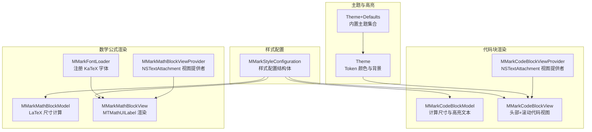
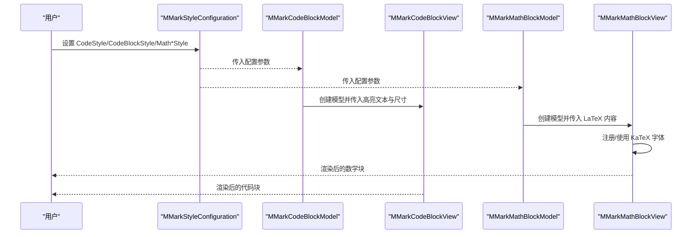
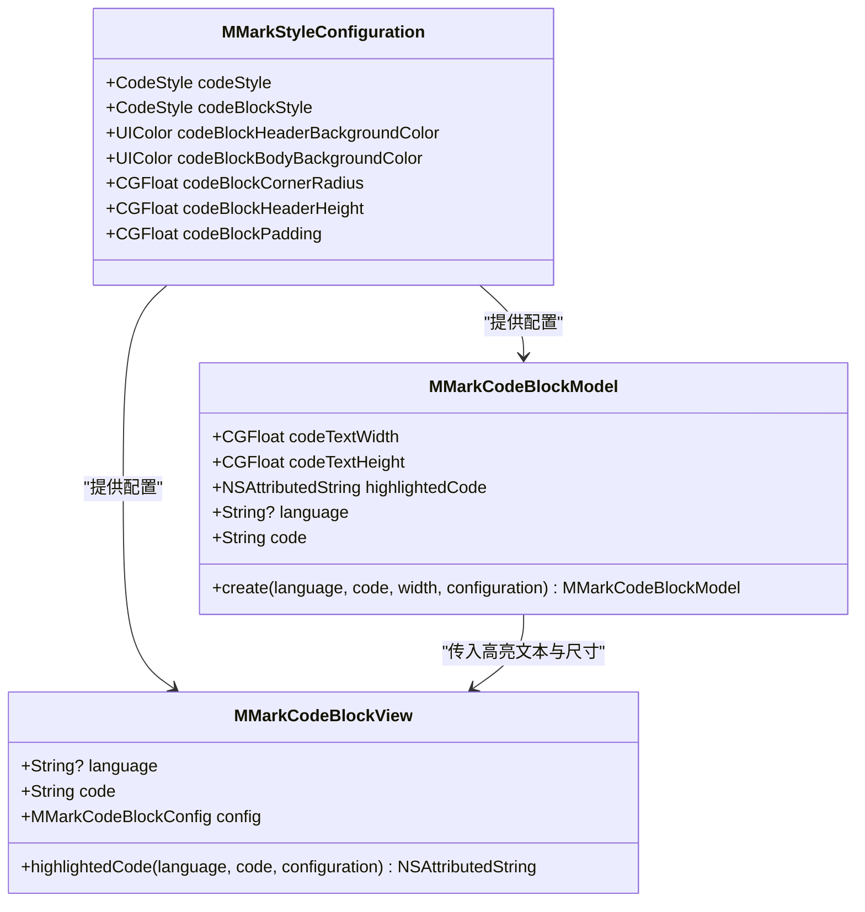
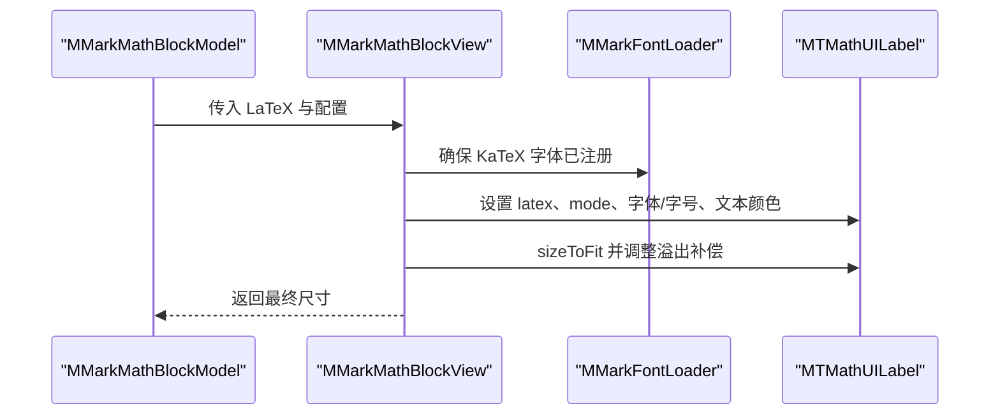
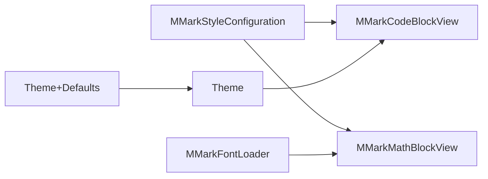

# 代码和数学样式

<cite>
**本文引用的文件**
- [MMarkStyleConfiguration.swift](file://MMarkParser/Sources/Renderer/MMarkStyleConfiguration.swift)
- [MMarkCodeBlockModel.swift](file://MMarkParser/Sources/Renderer/Attachments/MMarkCodeBlockAttachment/MMarkCodeBlockModel.swift)
- [MMarkCodeBlockView.swift](file://MMarkParser/Sources/Renderer/Attachments/MMarkCodeBlockAttachment/MMarkCodeBlockView.swift)
- [MMarkCodeBlockViewProvider.swift](file://MMarkParser/Sources/Renderer/Attachments/MMarkCodeBlockAttachment/MMarkCodeBlockViewProvider.swift)
- [MMarkMathBlockModel.swift](file://MMarkParser/Sources/Renderer/Attachments/MMarkMathBlockAttachment/MMarkMathBlockModel.swift)
- [MMarkMathBlockView.swift](file://MMarkParser/Sources/Renderer/Attachments/MMarkMathBlockAttachment/MMarkMathBlockView.swift)
- [MMarkMathBlockViewProvider.swift](file://MMarkParser/Sources/Renderer/Attachments/MMarkMathBlockAttachment/MMarkMathBlockViewProvider.swift)
- [MMarkFontLoader.swift](file://MMarkParser/Sources/Renderer/MMarkFontLoader.swift)
- [Theme.swift](file://MMarkParser/Sources/Splash/Theming/Theme.swift)
- [Theme+Defaults.swift](file://MMarkParser/Sources/Splash/Theming/Theme+Defaults.swift)
</cite>

## 目录
1. [简介](#简介)
2. [项目结构](#项目结构)
3. [核心组件](#核心组件)
4. [架构总览](#架构总览)
5. [详细组件分析](#详细组件分析)
6. [依赖关系分析](#依赖关系分析)
7. [性能考量](#性能考量)
8. [故障排查指南](#故障排查指南)
9. [结论](#结论)
10. [附录](#附录)

## 简介
本文件聚焦于代码与数学公式的样式配置，系统性说明以下内容：
- CodeStyle 结构设计：等宽字体、文本颜色、背景色的配置方式
- 行内代码与代码块的差异化样式：头部背景、主体背景、圆角半径、高度与内边距等布局属性
- 数学公式样式：行内数学(mathInlineStyle)与块级数学(mathBlockStyle)的差异与表现
- iosMath 渲染字体配置与 KaTeX 字体支持机制
- 代码高亮与数学公式渲染的样式定制示例
- 不同主题下的适配策略与可读性优化建议

## 项目结构
围绕“样式配置”这一主题，相关代码主要分布在以下模块：
- 样式配置层：集中于样式配置结构体与默认样式
- 代码块渲染层：模型、视图与视图提供者协同完成高亮与布局
- 数学公式渲染层：模型、视图与视图提供者协同完成 iosMath 渲染与字体加载
- 主题与高亮：基于 Splash 的语法高亮主题与 Token 颜色映射

图表来源
- [MMarkStyleConfiguration.swift:11-339](file://MMarkParser/Sources/Renderer/MMarkStyleConfiguration.swift#L11-L339)
- [MMarkCodeBlockModel.swift:6-46](file://MMarkParser/Sources/Renderer/Attachments/MMarkCodeBlockAttachment/MMarkCodeBlockModel.swift#L6-L46)
- [MMarkCodeBlockView.swift:6-180](file://MMarkParser/Sources/Renderer/Attachments/MMarkCodeBlockAttachment/MMarkCodeBlockView.swift#L6-L180)
- [MMarkCodeBlockViewProvider.swift:6-22](file://MMarkParser/Sources/Renderer/Attachments/MMarkCodeBlockAttachment/MMarkCodeBlockViewProvider.swift#L6-L22)
- [MMarkMathBlockModel.swift:7-48](file://MMarkParser/Sources/Renderer/Attachments/MMarkMathBlockAttachment/MMarkMathBlockModel.swift#L7-L48)
- [MMarkMathBlockView.swift:7-101](file://MMarkParser/Sources/Renderer/Attachments/MMarkMathBlockAttachment/MMarkMathBlockView.swift#L7-L101)
- [MMarkMathBlockViewProvider.swift:6-24](file://MMarkParser/Sources/Renderer/Attachments/MMarkMathBlockAttachment/MMarkMathBlockViewProvider.swift#L6-L24)
- [MMarkFontLoader.swift:8-113](file://MMarkParser/Sources/Renderer/MMarkFontLoader.swift#L8-L113)
- [Theme.swift:20-42](file://MMarkParser/Sources/Splash/Theming/Theme.swift#L20-L42)
- [Theme+Defaults.swift:11-182](file://MMarkParser/Sources/Splash/Theming/Theme+Defaults.swift#L11-L182)

章节来源
- [MMarkStyleConfiguration.swift:11-339](file://MMarkParser/Sources/Renderer/MMarkStyleConfiguration.swift#L11-L339)

## 核心组件
本节聚焦样式配置的核心数据结构与默认值，帮助快速理解如何定制代码与数学样式。

- 样式配置结构体
  - 包含标题、段落、链接、引用块、表格、任务列表、有序/无序列表等通用样式
  - 关键字段：等宽字体、文本颜色、背景色；代码块头部/主体背景、圆角、高度、内边距；数学行内/块级样式及块级背景与圆角；iosMath 渲染字体
  - 默认样式中，代码与数学均采用等宽字体族，并提供透明度可控的背景色以提升对比度与可读性

- 代码样式（CodeStyle）
  - 字段：font、textColor、backgroundColor
  - 用于行内代码与代码块主体（以及数学块主体）的统一风格

- 数学样式
  - 行内数学：mathInlineStyle，强调与正文融合但具备辨识度
  - 块级数学：mathBlockStyle，配合 mathBlockBackgroundColor 与 mathBlockCornerRadius 提升层级感

章节来源
- [MMarkStyleConfiguration.swift:23-34](file://MMarkParser/Sources/Renderer/MMarkStyleConfiguration.swift#L23-L34)
- [MMarkStyleConfiguration.swift:95-141](file://MMarkParser/Sources/Renderer/MMarkStyleConfiguration.swift#L95-L141)
- [MMarkStyleConfiguration.swift:188-267](file://MMarkParser/Sources/Renderer/MMarkStyleConfiguration.swift#L188-L267)

## 架构总览
从“样式配置”到“渲染”的端到端流程如下：

图表来源
- [MMarkStyleConfiguration.swift:188-267](file://MMarkParser/Sources/Renderer/MMarkStyleConfiguration.swift#L188-L267)
- [MMarkCodeBlockModel.swift:23-44](file://MMarkParser/Sources/Renderer/Attachments/MMarkCodeBlockAttachment/MMarkCodeBlockModel.swift#L23-L44)
- [MMarkCodeBlockView.swift:45-54](file://MMarkParser/Sources/Renderer/Attachments/MMarkCodeBlockAttachment/MMarkCodeBlockView.swift#L45-L54)
- [MMarkMathBlockModel.swift:20-46](file://MMarkParser/Sources/Renderer/Attachments/MMarkMathBlockAttachment/MMarkMathBlockModel.swift#L20-L46)
- [MMarkMathBlockView.swift:25-53](file://MMarkParser/Sources/Renderer/Attachments/MMarkMathBlockAttachment/MMarkMathBlockView.swift#L25-L53)

## 详细组件分析

### 代码样式与代码块布局
- 等宽字体与颜色
  - 行内代码与代码块主体均使用等宽字体，确保对齐与可读性
  - 文本颜色与背景色通过 CodeStyle 统一配置，支持透明度以避免遮挡底层内容

- 代码块头部与主体
  - 头部背景色与主体背景色分离，便于区分语言标识与代码内容
  - 圆角半径、头部高度、内边距共同决定整体视觉层级与阅读边界
  - 代码文本采用滚动视图承载，避免换行影响语法高亮与对齐

- 语法高亮
  - 使用 Splash 的语法高亮器与主题，将源码转换为带 Token 颜色的富文本
  - 当未指定语言时，直接以纯文本样式渲染

图表来源
- [MMarkStyleConfiguration.swift:95-108](file://MMarkParser/Sources/Renderer/MMarkStyleConfiguration.swift#L95-L108)
- [MMarkCodeBlockModel.swift:6-20](file://MMarkParser/Sources/Renderer/Attachments/MMarkCodeBlockAttachment/MMarkCodeBlockModel.swift#L6-L20)
- [MMarkCodeBlockModel.swift:23-44](file://MMarkParser/Sources/Renderer/Attachments/MMarkCodeBlockAttachment/MMarkCodeBlockModel.swift#L23-L44)
- [MMarkCodeBlockView.swift:14-25](file://MMarkParser/Sources/Renderer/Attachments/MMarkCodeBlockAttachment/MMarkCodeBlockView.swift#L14-L25)
- [MMarkCodeBlockView.swift:153-168](file://MMarkParser/Sources/Renderer/Attachments/MMarkCodeBlockAttachment/MMarkCodeBlockView.swift#L153-L168)

章节来源
- [MMarkCodeBlockModel.swift:23-44](file://MMarkParser/Sources/Renderer/Attachments/MMarkCodeBlockAttachment/MMarkCodeBlockModel.swift#L23-L44)
- [MMarkCodeBlockView.swift:62-107](file://MMarkParser/Sources/Renderer/Attachments/MMarkCodeBlockAttachment/MMarkCodeBlockView.swift#L62-L107)
- [MMarkCodeBlockView.swift:153-168](file://MMarkParser/Sources/Renderer/Attachments/MMarkCodeBlockAttachment/MMarkCodeBlockView.swift#L153-L168)
- [Theme.swift:20-39](file://MMarkParser/Sources/Splash/Theming/Theme.swift#L20-L39)
- [Theme+Defaults.swift:11-182](file://MMarkParser/Sources/Splash/Theming/Theme+Defaults.swift#L11-L182)

### 数学公式样式与渲染
- 行内数学与块级数学
  - 行内数学：mathInlineStyle，强调与正文融合，适合嵌入句子中的简短公式
  - 块级数学：mathBlockStyle，配合 mathBlockBackgroundColor 与 mathBlockCornerRadius，突出显示独立公式区域

- iosMath 渲染字体与 KaTeX 字体支持
  - 若配置了 mathDisplayFont，则优先使用该字体进行渲染
  - 否则回退到 mathBlockStyle 的字体大小
  - MMarkFontLoader 在初始化时注册 KaTeX 所需字体文件，确保行内与块级数学的排版一致性

- 尺寸计算与溢出处理
  - 数学块模型根据 LaTeX 内容计算自然尺寸，并增加内边距与溢出补偿，避免渲染截断
  - 数学视图通过滚动容器承载，支持横向滚动以适应过宽表达式

图表来源
- [MMarkMathBlockModel.swift:20-46](file://MMarkParser/Sources/Renderer/Attachments/MMarkMathBlockAttachment/MMarkMathBlockModel.swift#L20-L46)
- [MMarkMathBlockView.swift:25-53](file://MMarkParser/Sources/Renderer/Attachments/MMarkMathBlockAttachment/MMarkMathBlockView.swift#L25-L53)
- [MMarkFontLoader.swift:24-51](file://MMarkParser/Sources/Renderer/MMarkFontLoader.swift#L24-L51)

章节来源
- [MMarkStyleConfiguration.swift:131-141](file://MMarkParser/Sources/Renderer/MMarkStyleConfiguration.swift#L131-L141)
- [MMarkMathBlockModel.swift:7-48](file://MMarkParser/Sources/Renderer/Attachments/MMarkMathBlockAttachment/MMarkMathBlockModel.swift#L7-L48)
- [MMarkMathBlockView.swift:30-53](file://MMarkParser/Sources/Renderer/Attachments/MMarkMathBlockAttachment/MMarkMathBlockView.swift#L30-L53)
- [MMarkFontLoader.swift:15-19](file://MMarkParser/Sources/Renderer/MMarkFontLoader.swift#L15-L19)

### 视图提供者与 NSTextAttachment 集成
- 代码块与数学块均通过各自的 ViewProvider 将模型绑定到 NSTextAttachment 视图，实现富文本渲染的一致性
- 视图提供者负责实例化对应视图并设置跟踪附件边界，保证布局与滚动行为符合预期

章节来源
- [MMarkCodeBlockViewProvider.swift:6-22](file://MMarkParser/Sources/Renderer/Attachments/MMarkCodeBlockAttachment/MMarkCodeBlockViewProvider.swift#L6-L22)
- [MMarkMathBlockViewProvider.swift:6-24](file://MMarkParser/Sources/Renderer/Attachments/MMarkMathBlockAttachment/MMarkMathBlockViewProvider.swift#L6-L24)

## 依赖关系分析
- 样式配置对渲染层的影响
  - 代码块：头部背景、主体背景、圆角、高度、内边距直接影响视觉层级与可读性
  - 数学块：块级背景与圆角提升公式区块的识别度；字体配置决定排版质量
- 字体依赖
  - 数学渲染依赖 iosMath 与 KaTeX 字体；字体注册由 MMarkFontLoader 负责
- 语法高亮
  - 代码块高亮依赖 Splash 的 Theme 与 Token 颜色映射，支持多种内置主题

图表来源
- [MMarkStyleConfiguration.swift:95-141](file://MMarkParser/Sources/Renderer/MMarkStyleConfiguration.swift#L95-L141)
- [MMarkCodeBlockView.swift:153-168](file://MMarkParser/Sources/Renderer/Attachments/MMarkCodeBlockAttachment/MMarkCodeBlockView.swift#L153-L168)
- [MMarkMathBlockView.swift:21-44](file://MMarkParser/Sources/Renderer/Attachments/MMarkMathBlockAttachment/MMarkMathBlockView.swift#L21-L44)
- [MMarkFontLoader.swift:24-51](file://MMarkParser/Sources/Renderer/MMarkFontLoader.swift#L24-L51)
- [Theme.swift:20-39](file://MMarkParser/Sources/Splash/Theming/Theme.swift#L20-L39)
- [Theme+Defaults.swift:11-182](file://MMarkParser/Sources/Splash/Theming/Theme+Defaults.swift#L11-L182)

章节来源
- [MMarkStyleConfiguration.swift:95-141](file://MMarkParser/Sources/Renderer/MMarkStyleConfiguration.swift#L95-L141)
- [MMarkCodeBlockView.swift:153-168](file://MMarkParser/Sources/Renderer/Attachments/MMarkCodeBlockAttachment/MMarkCodeBlockView.swift#L153-L168)
- [MMarkMathBlockView.swift:21-44](file://MMarkParser/Sources/Renderer/Attachments/MMarkMathBlockAttachment/MMarkMathBlockView.swift#L21-L44)
- [MMarkFontLoader.swift:24-51](file://MMarkParser/Sources/Renderer/MMarkFontLoader.swift#L24-L51)
- [Theme.swift:20-39](file://MMarkParser/Sources/Splash/Theming/Theme.swift#L20-L39)
- [Theme+Defaults.swift:11-182](file://MMarkParser/Sources/Splash/Theming/Theme+Defaults.swift#L11-L182)

## 性能考量
- 代码块
  - 高亮文本预先计算并缓存，减少重复高亮开销
  - 使用滚动视图承载长代码，避免强制换行导致的布局抖动
- 数学公式
  - 字体注册仅在首次使用时执行，后续复用已注册字体
  - 对 tall 表达式（矩阵、分数等）进行溢出补偿，避免频繁重绘
- 主题与 Token
  - 选择合适的 Token 颜色与背景，避免过度饱和导致的视觉疲劳与渲染压力

## 故障排查指南
- 数学公式显示异常或被截断
  - 检查 mathDisplayFont 是否正确设置；若为空则回退到 mathBlockStyle 字体大小
  - 确认 MMarkFontLoader 已成功注册 KaTeX 字体
  - 参考尺寸计算逻辑，确认是否需要增加内边距或调整溢出补偿
- 代码块高亮不生效
  - 确认语言标识是否为空；为空时将直接以纯文本样式渲染
  - 检查 Theme 与 Token 颜色配置是否合理
- 视图边界与滚动问题
  - 确认视图提供者已正确绑定模型并启用跟踪附件边界
  - 检查约束与内容尺寸是否一致，避免布局冲突

章节来源
- [MMarkMathBlockView.swift:37-52](file://MMarkParser/Sources/Renderer/Attachments/MMarkMathBlockAttachment/MMarkMathBlockView.swift#L37-L52)
- [MMarkFontLoader.swift:24-51](file://MMarkParser/Sources/Renderer/MMarkFontLoader.swift#L24-L51)
- [MMarkCodeBlockView.swift:153-168](file://MMarkParser/Sources/Renderer/Attachments/MMarkCodeBlockAttachment/MMarkCodeBlockView.swift#L153-L168)
- [MMarkCodeBlockViewProvider.swift:12-20](file://MMarkParser/Sources/Renderer/Attachments/MMarkCodeBlockAttachment/MMarkCodeBlockViewProvider.swift#L12-L20)
- [MMarkMathBlockViewProvider.swift:12-21](file://MMarkParser/Sources/Renderer/Attachments/MMarkMathBlockAttachment/MMarkMathBlockViewProvider.swift#L12-L21)

## 结论
通过对样式配置结构、代码块与数学块渲染流程的系统梳理，可以清晰地看到：
- CodeStyle 作为统一入口，贯穿行内代码与代码块主体的视觉一致性
- 代码块通过头部/主体分离与圆角、内边距等布局属性，形成明确的视觉层级
- 数学公式通过行内与块级样式区分，结合 iosMath 与 KaTeX 字体支持，实现高质量排版
- 借助 Splash 主题与 Token 颜色，可灵活定制代码高亮风格
- 在不同主题下，应关注对比度与可读性，避免高亮与背景冲突

## 附录

### 样式定制示例（步骤说明）
- 自定义代码块外观
  - 步骤：设置 codeBlockHeaderBackgroundColor、codeBlockBodyBackgroundColor、codeBlockCornerRadius、codeBlockHeaderHeight、codeBlockPadding
  - 参考路径：[MMarkStyleConfiguration.swift:95-108](file://MMarkParser/Sources/Renderer/MMarkStyleConfiguration.swift#L95-L108)
- 自定义行内代码与代码块主体
  - 步骤：分别设置 codeStyle 与 codeBlockStyle 的 font、textColor、backgroundColor
  - 参考路径：[MMarkStyleConfiguration.swift:96-98](file://MMarkParser/Sources/Renderer/MMarkStyleConfiguration.swift#L96-L98)
- 自定义数学公式样式
  - 步骤：设置 mathInlineStyle、mathBlockStyle、mathBlockBackgroundColor、mathBlockCornerRadius；必要时设置 mathDisplayFont
  - 参考路径：[MMarkStyleConfiguration.swift:131-141](file://MMarkParser/Sources/Renderer/MMarkStyleConfiguration.swift#L131-L141)
- 应用语法高亮主题
  - 步骤：选择 Theme 或内置主题集，配置 tokenColors 与 backgroundColor
  - 参考路径：[Theme.swift:20-39](file://MMarkParser/Sources/Splash/Theming/Theme.swift#L20-L39), [Theme+Defaults.swift:11-182](file://MMarkParser/Sources/Splash/Theming/Theme+Defaults.swift#L11-L182)

### 主题适配与可读性优化建议
- 高对比度与透明度
  - 使用半透明背景色降低遮挡，同时保持足够的对比度
- 字体与字号
  - 等宽字体确保对齐；字号应兼顾可读性与空间占用
- 圆角与内边距
  - 适度圆角与充足内边距提升视觉舒适度
- 数学公式
  - 块级公式建议使用独立背景与圆角，行内公式保持与正文一致的基线对齐