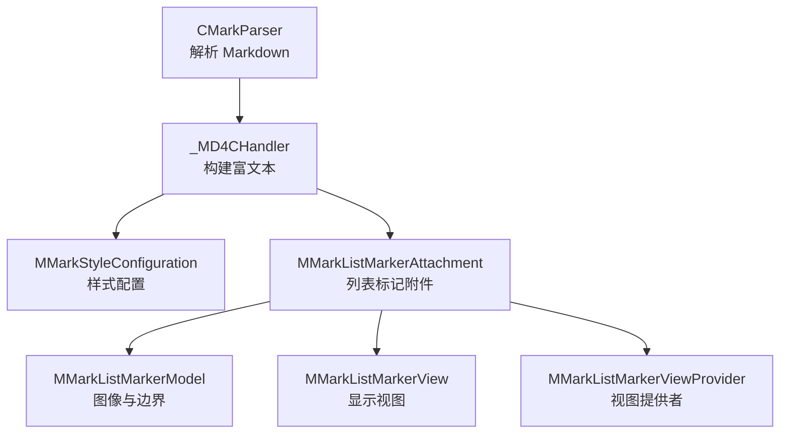
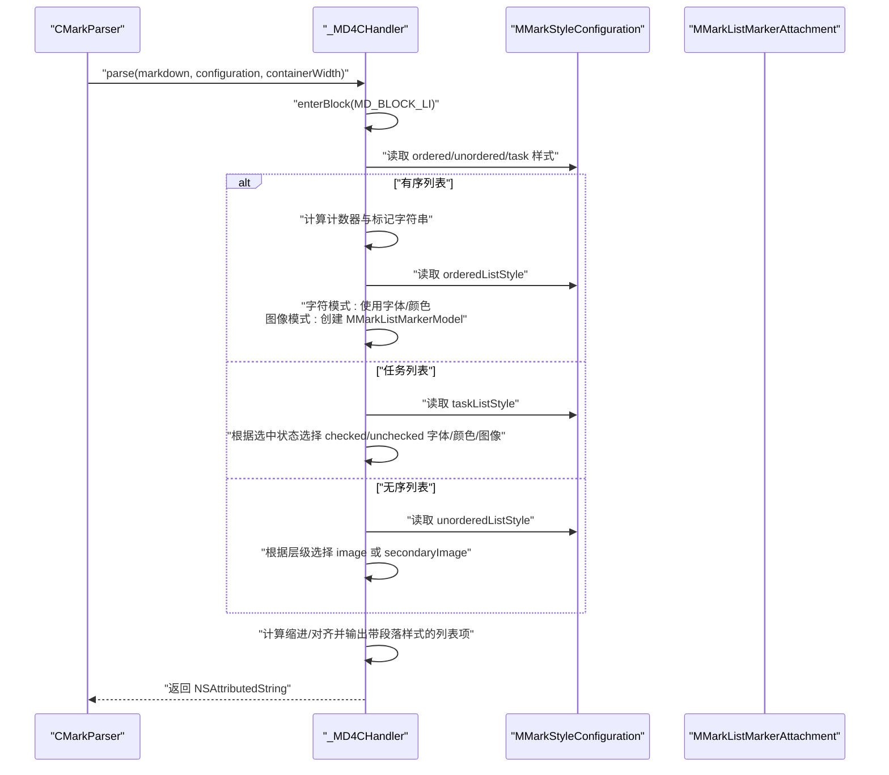
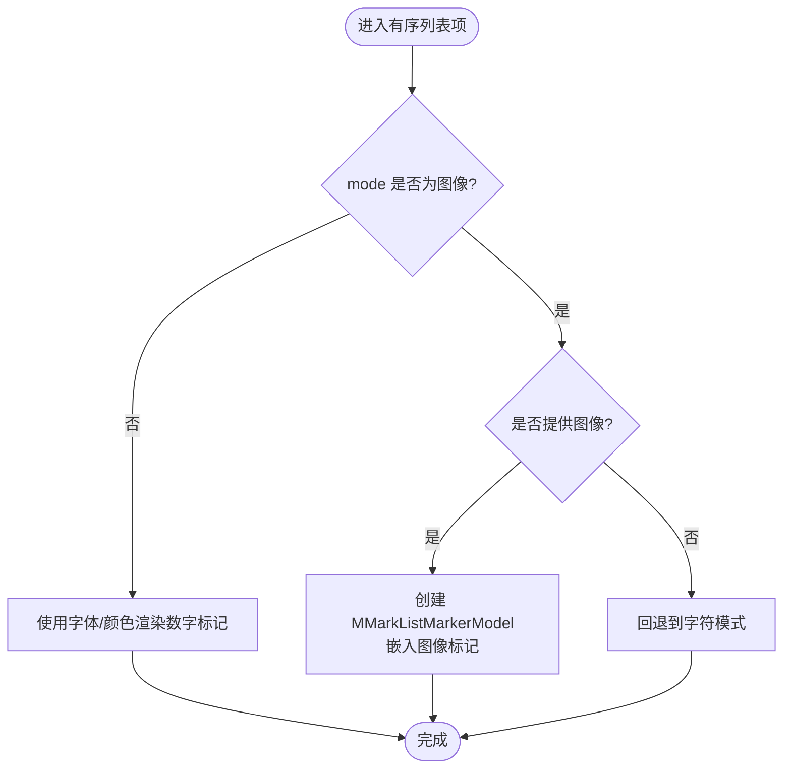
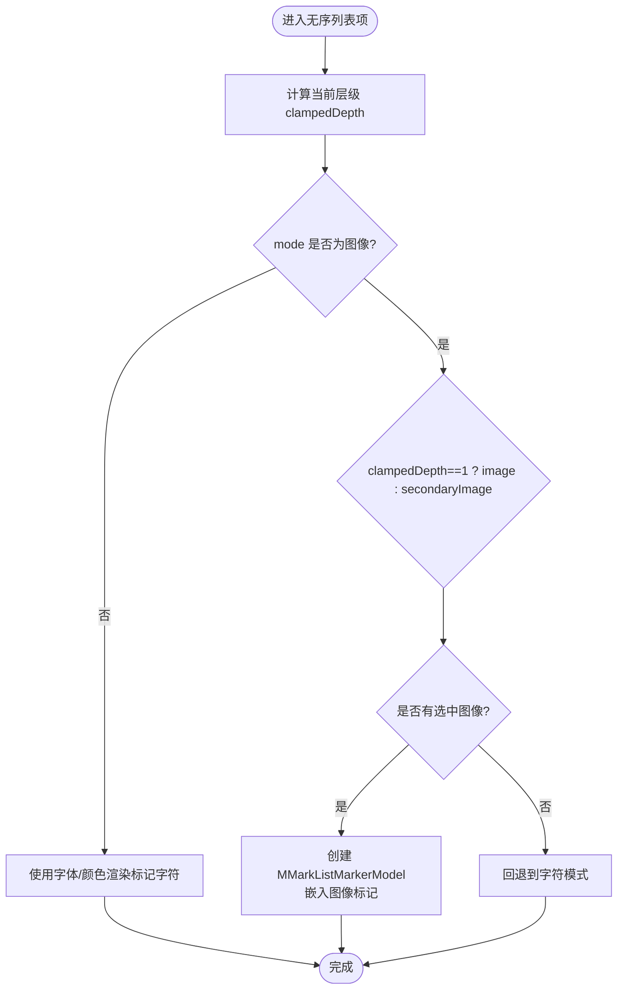
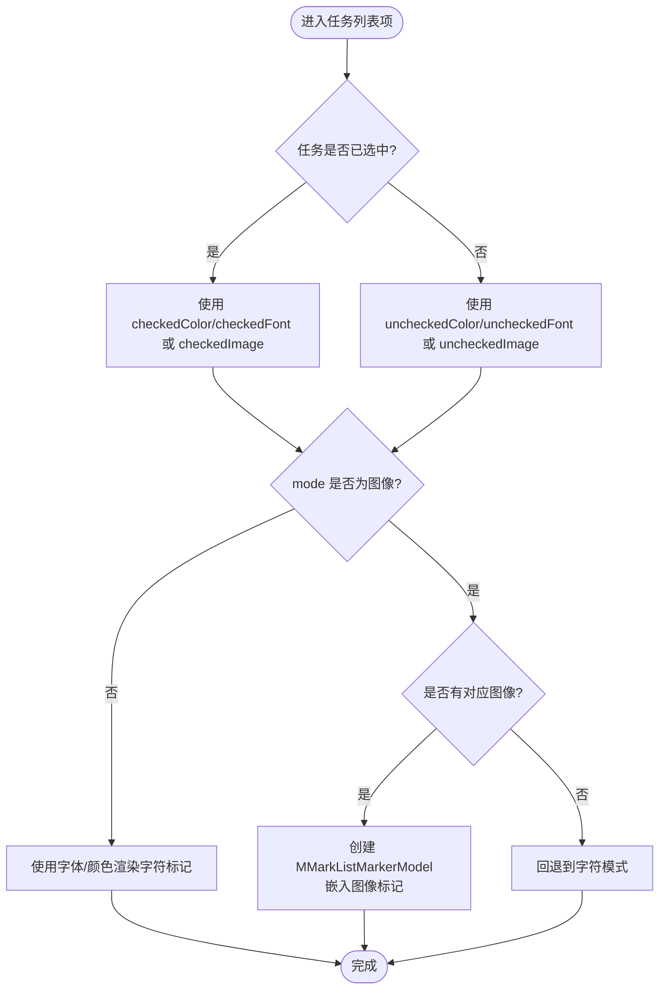
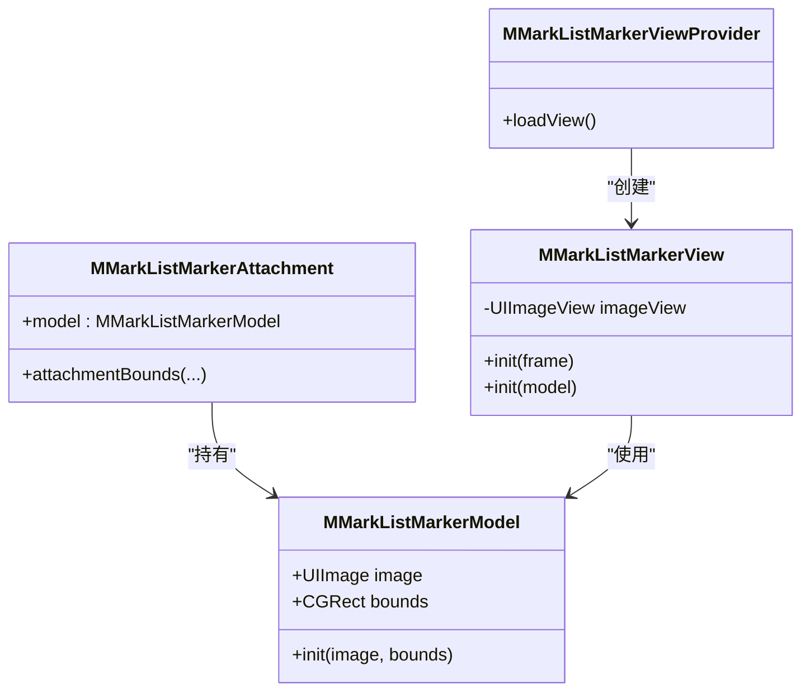
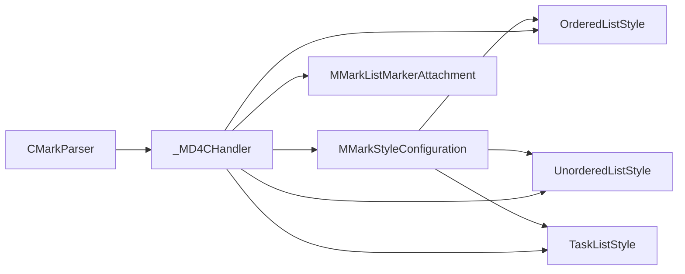

# 列表样式配置

<cite>
**本文档引用的文件**
- [MMarkStyleConfiguration.swift](file://MMarkParser/Sources/Renderer/MMarkStyleConfiguration.swift)
- [CMarkParser.swift](file://MMarkParser/Sources/Parser/CMarkParser.swift)
- [MMarkParserWrapper.swift](file://MMarkParser/Sources/Parser/MMarkParserWrapper.swift)
- [MMarkListMarkerAttachment.swift](file://MMarkParser/Sources/Renderer/Attachments/MMarkListMarkerAttachment/MMarkListMarkerAttachment.swift)
- [MMarkListMarkerModel.swift](file://MMarkParser/Sources/Renderer/Attachments/MMarkListMarkerAttachment/MMarkListMarkerModel.swift)
- [MMarkListMarkerView.swift](file://MMarkParser/Sources/Renderer/Attachments/MMarkListMarkerAttachment/MMarkListMarkerView.swift)
- [MMarkListMarkerViewProvider.swift](file://MMarkParser/Sources/Renderer/Attachments/MMarkListMarkerAttachment/MMarkListMarkerViewProvider.swift)
</cite>

## 目录
1. [简介](#简介)
2. [项目结构](#项目结构)
3. [核心组件](#核心组件)
4. [架构总览](#架构总览)
5. [详细组件分析](#详细组件分析)
6. [依赖关系分析](#依赖关系分析)
7. [性能考量](#性能考量)
8. [故障排查指南](#故障排查指南)
9. [结论](#结论)
10. [附录](#附录)

## 简介
本文件系统化梳理了 MMarkParser 中“列表样式配置”的完整能力与实现细节，覆盖以下主题：
- 有序列表与无序列表的样式配置项与行为差异
- ListMarkerMode 枚举在字符模式与图像模式下的表现
- 列表标记的字体、颜色、图像等视觉属性
- 图像模式下的图标选择机制：一级列表与多级列表的差异化处理
- 列表间距、缩进与对齐的控制方式
- 任务列表（TaskList）的特殊配置：复选框状态的颜色与字体变化
- 列表样式的响应式设计与可访问性最佳实践

## 项目结构
围绕列表样式的关键文件与职责如下：
- 样式配置入口：MMarkStyleConfiguration 提供所有样式配置项，包括有序/无序/任务列表样式
- 渲染管线：CMarkParser 负责解析 Markdown 并调用 MMarkParserWrapper；后者在回调中构建富文本，生成列表标记与段落样式
- 列表标记附件：MMarkListMarkerAttachment/Model/View/ViewProvider 将图像型列表标记嵌入 TextKit2

图表来源
- [CMarkParser.swift:56-66](file://MMarkParser/Sources/Parser/CMarkParser.swift#L56-L66)
- [MMarkParserWrapper.swift:18-100](file://MMarkParser/Sources/Parser/MMarkParserWrapper.swift#L18-L100)
- [MMarkStyleConfiguration.swift:47-85](file://MMarkParser/Sources/Renderer/MMarkStyleConfiguration.swift#L47-L85)
- [MMarkListMarkerAttachment.swift:5-17](file://MMarkParser/Sources/Renderer/Attachments/MMarkListMarkerAttachment/MMarkListMarkerAttachment.swift#L5-L17)
- [MMarkListMarkerModel.swift:6-15](file://MMarkParser/Sources/Renderer/Attachments/MMarkListMarkerAttachment/MMarkListMarkerModel.swift#L6-L15)
- [MMarkListMarkerView.swift:6-32](file://MMarkParser/Sources/Renderer/Attachments/MMarkListMarkerAttachment/MMarkListMarkerView.swift#L6-L32)
- [MMarkListMarkerViewProvider.swift:6-18](file://MMarkParser/Sources/Renderer/Attachments/MMarkListMarkerAttachment/MMarkListMarkerViewProvider.swift#L6-L18)

章节来源
- [CMarkParser.swift:56-66](file://MMarkParser/Sources/Parser/CMarkParser.swift#L56-L66)
- [MMarkParserWrapper.swift:18-100](file://MMarkParser/Sources/Parser/MMarkParserWrapper.swift#L18-L100)
- [MMarkStyleConfiguration.swift:47-85](file://MMarkParser/Sources/Renderer/MMarkStyleConfiguration.swift#L47-L85)

## 核心组件
- ListMarkerMode：决定列表标记采用字符还是图像
- OrderedListStyle：有序列表样式，支持字符/图像两种模式，包含字体、颜色、图像与尺寸
- UnorderedListStyle：无序列表样式，支持字符/图像两种模式，包含一级图标与二级及以上图标的差异化配置
- TaskListStyle：任务列表样式，支持字符/图像两种模式，分别针对已选中/未选中状态设置颜色与字体，并可配置图像

章节来源
- [MMarkStyleConfiguration.swift:5-8](file://MMarkParser/Sources/Renderer/MMarkStyleConfiguration.swift#L5-L8)
- [MMarkStyleConfiguration.swift:47-63](file://MMarkParser/Sources/Renderer/MMarkStyleConfiguration.swift#L47-L63)
- [MMarkStyleConfiguration.swift:65-85](file://MMarkParser/Sources/Renderer/MMarkStyleConfiguration.swift#L65-L85)
- [MMarkStyleConfiguration.swift:163-186](file://MMarkParser/Sources/Renderer/MMarkStyleConfiguration.swift#L163-L186)

## 架构总览
渲染流程概览：解析器将 Markdown 转为富文本，进入列表块时根据当前层级与类型选择合适的标记（字符或图像），并计算缩进与对齐，最终输出带段落样式的列表项。

图表来源
- [CMarkParser.swift:56-66](file://MMarkParser/Sources/Parser/CMarkParser.swift#L56-L66)
- [MMarkParserWrapper.swift:183-322](file://MMarkParser/Sources/Parser/MMarkParserWrapper.swift#L183-L322)
- [MMarkStyleConfiguration.swift:47-85](file://MMarkParser/Sources/Renderer/MMarkStyleConfiguration.swift#L47-L85)
- [MMarkListMarkerModel.swift:10-14](file://MMarkParser/Sources/Renderer/Attachments/MMarkListMarkerAttachment/MMarkListMarkerModel.swift#L10-L14)

## 详细组件分析

### ListMarkerMode 与模式切换
- 字符模式：直接使用指定字体与颜色渲染标记字符串
- 图像模式：使用指定图像作为标记，通过 MMarkListMarkerAttachment/Model/View/ViewProvider 嵌入显示

章节来源
- [MMarkStyleConfiguration.swift:5-8](file://MMarkParser/Sources/Renderer/MMarkStyleConfiguration.swift#L5-L8)
- [MMarkStyleConfiguration.swift:47-63](file://MMarkParser/Sources/Renderer/MMarkStyleConfiguration.swift#L47-L63)
- [MMarkStyleConfiguration.swift:65-85](file://MMarkParser/Sources/Renderer/MMarkStyleConfiguration.swift#L65-L85)
- [MMarkStyleConfiguration.swift:163-186](file://MMarkParser/Sources/Renderer/MMarkStyleConfiguration.swift#L163-L186)

### 有序列表样式（OrderedListStyle）
- 关键属性
  - mode：字符/图像
  - font/textColor：字符模式下的字体与颜色
  - image：图像模式下的图标
  - imageSize：图像显示尺寸
- 渲染逻辑
  - 计算当前层级并维护计数器，生成形如“1.”的标记字符串
  - 字符模式：直接使用字体/颜色
  - 图像模式：若未提供图像则回退到字符模式

图表来源
- [MMarkParserWrapper.swift:219-241](file://MMarkParser/Sources/Parser/MMarkParserWrapper.swift#L219-L241)
- [MMarkListMarkerModel.swift:10-14](file://MMarkParser/Sources/Renderer/Attachments/MMarkListMarkerAttachment/MMarkListMarkerModel.swift#L10-L14)

章节来源
- [MMarkStyleConfiguration.swift:47-63](file://MMarkParser/Sources/Renderer/MMarkStyleConfiguration.swift#L47-L63)
- [MMarkParserWrapper.swift:219-241](file://MMarkParser/Sources/Parser/MMarkParserWrapper.swift#L219-L241)

### 无序列表样式（UnorderedListStyle）
- 关键属性
  - mode：字符/图像
  - font/textColor：字符模式下的字体与颜色
  - image：一级列表图标
  - secondaryImage：二级及以上列表图标（为空时回退到 image）
  - imageSize：图像显示尺寸
- 渲染逻辑
  - 字符模式：一级使用“•”，二级及以后使用“◦”
  - 图像模式：根据层级选择 image 或 secondaryImage；若未提供图像则回退到字符模式

图表来源
- [MMarkParserWrapper.swift:269-293](file://MMarkParser/Sources/Parser/MMarkParserWrapper.swift#L269-L293)
- [MMarkListMarkerModel.swift:10-14](file://MMarkParser/Sources/Renderer/Attachments/MMarkListMarkerAttachment/MMarkListMarkerModel.swift#L10-L14)

章节来源
- [MMarkStyleConfiguration.swift:65-85](file://MMarkParser/Sources/Renderer/MMarkStyleConfiguration.swift#L65-L85)
- [MMarkParserWrapper.swift:269-293](file://MMarkParser/Sources/Parser/MMarkParserWrapper.swift#L269-L293)

### 任务列表样式（TaskListStyle）
- 关键属性
  - mode：字符/图像
  - checkedColor/uncheckedColor：复选框状态颜色
  - checkedFont/uncheckedFont：复选框状态字体
  - checkedImage/uncheckedImage：复选框状态图像
  - imageSize：图像显示尺寸
- 渲染逻辑
  - 根据任务标记（已选中/未选中）选择对应的颜色与字体
  - 图像模式下根据状态选择对应图像；若未提供图像则回退到字符模式

图表来源
- [MMarkParserWrapper.swift:242-268](file://MMarkParser/Sources/Parser/MMarkParserWrapper.swift#L242-L268)
- [MMarkStyleConfiguration.swift:163-186](file://MMarkParser/Sources/Renderer/MMarkStyleConfiguration.swift#L163-L186)
- [MMarkListMarkerModel.swift:10-14](file://MMarkParser/Sources/Renderer/Attachments/MMarkListMarkerAttachment/MMarkListMarkerModel.swift#L10-L14)

章节来源
- [MMarkStyleConfiguration.swift:163-186](file://MMarkParser/Sources/Renderer/MMarkStyleConfiguration.swift#L163-L186)
- [MMarkParserWrapper.swift:242-268](file://MMarkParser/Sources/Parser/MMarkParserWrapper.swift#L242-L268)

### 列表间距、缩进与对齐
- 缩进计算
  - 基础缩进与每级缩进固定值组合，形成“当前层级 × 每级缩进 + 基础缩进”的布局
  - 测量标记宽度，确保标记与正文不重叠
- 对齐与段落样式
  - 使用 firstLineHeadIndent/headIndent 控制首行与后续行缩进
  - 统一设置行间距，提升可读性

章节来源
- [MMarkParserWrapper.swift:295-321](file://MMarkParser/Sources/Parser/MMarkParserWrapper.swift#L295-L321)

### 列表标记附件与图像渲染
- 附件模型负责持有图像与边界信息
- 视图使用 UIImageView 居中显示，约束铺满附件区域
- 视图提供者负责实例化视图并跟踪附件边界

图表来源
- [MMarkListMarkerModel.swift:6-15](file://MMarkParser/Sources/Renderer/Attachments/MMarkListMarkerAttachment/MMarkListMarkerModel.swift#L6-L15)
- [MMarkListMarkerAttachment.swift:5-17](file://MMarkParser/Sources/Renderer/Attachments/MMarkListMarkerAttachment/MMarkListMarkerAttachment.swift#L5-L17)
- [MMarkListMarkerView.swift:6-32](file://MMarkParser/Sources/Renderer/Attachments/MMarkListMarkerAttachment/MMarkListMarkerView.swift#L6-L32)
- [MMarkListMarkerViewProvider.swift:6-18](file://MMarkParser/Sources/Renderer/Attachments/MMarkListMarkerAttachment/MMarkListMarkerViewProvider.swift#L6-L18)

章节来源
- [MMarkListMarkerModel.swift:6-15](file://MMarkParser/Sources/Renderer/Attachments/MMarkListMarkerAttachment/MMarkListMarkerModel.swift#L6-L15)
- [MMarkListMarkerAttachment.swift:5-17](file://MMarkParser/Sources/Renderer/Attachments/MMarkListMarkerAttachment/MMarkListMarkerAttachment.swift#L5-L17)
- [MMarkListMarkerView.swift:6-32](file://MMarkParser/Sources/Renderer/Attachments/MMarkListMarkerAttachment/MMarkListMarkerView.swift#L6-L32)
- [MMarkListMarkerViewProvider.swift:6-18](file://MMarkParser/Sources/Renderer/Attachments/MMarkListMarkerAttachment/MMarkListMarkerViewProvider.swift#L6-L18)

## 依赖关系分析
- CMarkParser 通过 MMarkParserWrapper 的回调驱动渲染，_MD4CHandler 决定何时进入/离开列表块，并依据样式配置生成标记与段落样式
- 列表样式配置由 MMarkStyleConfiguration 提供，包含三类样式对象：OrderedListStyle、UnorderedListStyle、TaskListStyle
- 图像型标记依赖 MMarkListMarkerAttachment/Model/View/ViewProvider 完成嵌入与显示

图表来源
- [CMarkParser.swift:56-66](file://MMarkParser/Sources/Parser/CMarkParser.swift#L56-L66)
- [MMarkParserWrapper.swift:18-100](file://MMarkParser/Sources/Parser/MMarkParserWrapper.swift#L18-L100)
- [MMarkStyleConfiguration.swift:47-85](file://MMarkParser/Sources/Renderer/MMarkStyleConfiguration.swift#L47-L85)

章节来源
- [CMarkParser.swift:56-66](file://MMarkParser/Sources/Parser/CMarkParser.swift#L56-L66)
- [MMarkParserWrapper.swift:18-100](file://MMarkParser/Sources/Parser/MMarkParserWrapper.swift#L18-L100)
- [MMarkStyleConfiguration.swift:47-85](file://MMarkParser/Sources/Renderer/MMarkStyleConfiguration.swift#L47-L85)

## 性能考量
- 字符模式：无需图像加载，渲染开销低，适合大量列表场景
- 图像模式：需加载与绘制图像，建议控制图像尺寸与数量，避免过度嵌入大图
- 缩进与测量：在列表项进入时进行宽度测量与缩进计算，注意容器宽度与层级深度对性能的影响
- 建议
  - 优先使用字符模式，必要时在关键层级使用图像模式
  - 合理设置 imageSize，避免过大图像导致布局抖动与渲染压力

## 故障排查指南
- 图像模式未生效
  - 检查样式配置中是否提供了 image/secondaryImage/checkedImage/uncheckedImage
  - 若未提供图像，渲染会自动回退到字符模式
- 图像显示异常
  - 确认 MMarkListMarkerModel 的 bounds 与 imageSize 设置一致
  - 检查 MMarkListMarkerView 的约束是否正确铺满父视图
- 缩进与对齐错乱
  - 确认 _liStateStack 的入栈/出栈是否匹配
  - 检查每级缩进与基础缩进的计算逻辑是否被意外修改

章节来源
- [MMarkParserWrapper.swift:277-291](file://MMarkParser/Sources/Parser/MMarkParserWrapper.swift#L277-L291)
- [MMarkListMarkerModel.swift:10-14](file://MMarkParser/Sources/Renderer/Attachments/MMarkListMarkerAttachment/MMarkListMarkerModel.swift#L10-L14)
- [MMarkListMarkerView.swift:16-21](file://MMarkParser/Sources/Renderer/Attachments/MMarkListMarkerAttachment/MMarkListMarkerView.swift#L16-L21)

## 结论
- 通过 MMarkStyleConfiguration 可灵活配置有序/无序/任务列表的外观与交互
- ListMarkerMode 提供字符与图像两种路径，满足不同设计需求
- 图像模式下的图标选择遵循“一级优先主图标，多级回退次级图标”的策略
- 缩进与对齐由渲染器统一管理，保证复杂嵌套列表的可读性
- 建议在保持可访问性的前提下，结合性能与设计目标选择合适的模式与资源

## 附录

### 响应式设计与可访问性最佳实践
- 响应式设计
  - 动态调整 containerWidth 以适配不同屏幕宽度
  - 图像模式下合理设置 imageSize，避免在窄屏上造成截断
- 可访问性
  - 优先使用系统字体与高对比度颜色，确保字符模式下的可读性
  - 图像模式下为重要图标提供替代文本（在当前实现中，图像用于视觉提示，建议在应用层补充可访问性描述）
  - 任务列表的状态变化应通过颜色与字体变化清晰表达，避免仅依赖单一视觉线索