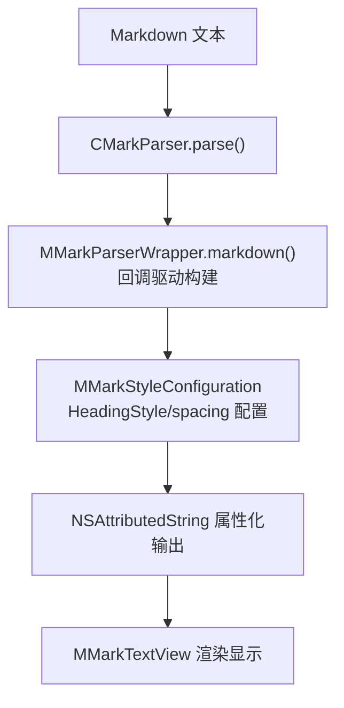
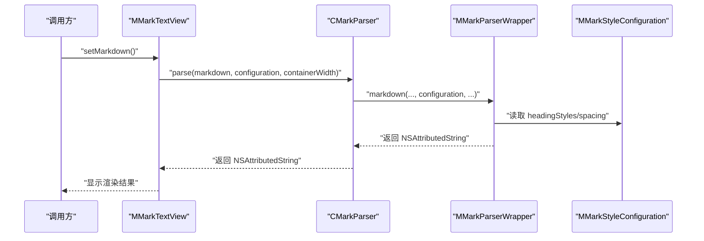
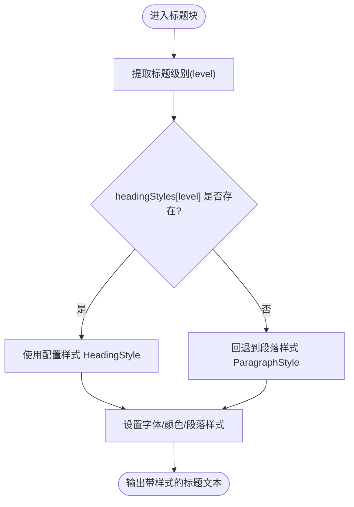
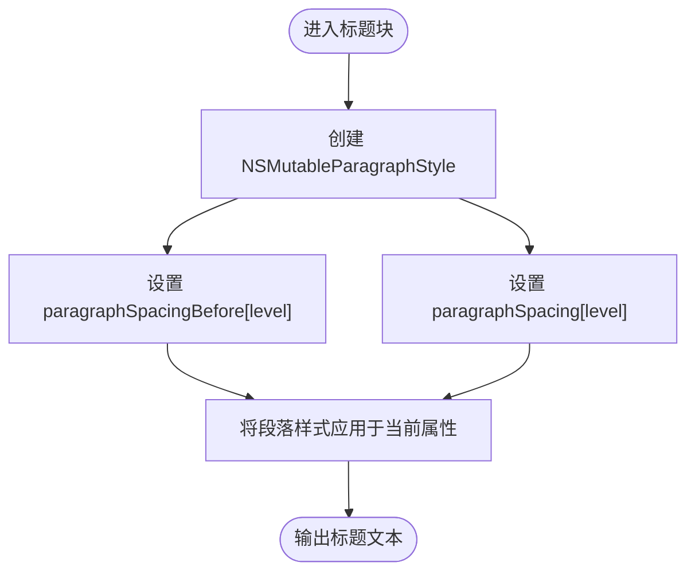
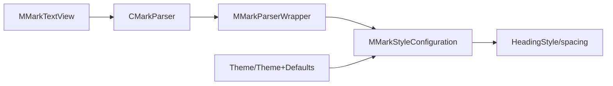

# 标题样式配置

<cite>
**本文档引用的文件**
- [MMarkStyleConfiguration.swift](file://MMarkParser/Sources/Renderer/MMarkStyleConfiguration.swift)
- [MMarkTextView.swift](file://MMarkParser/Sources/Renderer/MMarkTextView.swift)
- [CMarkParser.swift](file://MMarkParser/Sources/Parser/CMarkParser.swift)
- [MMarkParserWrapper.swift](file://MMarkParser/Sources/Parser/MMarkParserWrapper.swift)
- [Theme.swift](file://MMarkParser/Sources/Splash/Theming/Theme.swift)
- [Theme+Defaults.swift](file://MMarkParser/Sources/Splash/Theming/Theme+Defaults.swift)
</cite>

## 目录
1. [简介](#简介)
2. [项目结构](#项目结构)
3. [核心组件](#核心组件)
4. [架构总览](#架构总览)
5. [详细组件分析](#详细组件分析)
6. [依赖关系分析](#依赖关系分析)
7. [性能考量](#性能考量)
8. [故障排查指南](#故障排查指南)
9. [结论](#结论)
10. [附录](#附录)

## 简介
本文件聚焦于 MMarkParser 中“标题样式配置”的设计与实现，系统性阐述 HeadingStyle 结构、H1–H6 各级标题的独立样式配置机制、headingStyles 字典的层级化管理方式，以及标题间距配置（headingSpacingBefore 和 headingSpacing）的数学逻辑与视觉效果。同时提供可操作的定制示例、响应式设计与可访问性建议，并解释在不同设备与屏幕尺寸下的适配策略。

## 项目结构
围绕标题样式配置的关键模块如下：
- 渲染配置：MMarkStyleConfiguration 定义了 HeadingStyle、headingStyles、headingSpacingBefore、headingSpacing 等字段
- 解析与应用：CMarkParser 将 Markdown 解析为 NSAttributedString，并通过 MMarkParserWrapper 应用样式；MMarkTextView 负责最终渲染
- 主题与颜色：Theme/Theme+Defaults 提供字体与颜色的通用主题能力（可与标题样式协同）

图表来源
- [CMarkParser.swift:56-66](file://MMarkParser/Sources/Parser/CMarkParser.swift#L56-L66)
- [MMarkParserWrapper.swift:1392-1444](file://MMarkParser/Sources/Parser/MMarkParserWrapper.swift#L1392-L1444)
- [MMarkStyleConfiguration.swift:10-339](file://MMarkParser/Sources/Renderer/MMarkStyleConfiguration.swift#L10-L339)
- [MMarkTextView.swift:40-49](file://MMarkParser/Sources/Renderer/MMarkTextView.swift#L40-L49)

章节来源
- [MMarkStyleConfiguration.swift:10-339](file://MMarkParser/Sources/Renderer/MMarkStyleConfiguration.swift#L10-L339)
- [CMarkParser.swift:56-66](file://MMarkParser/Sources/Parser/CMarkParser.swift#L56-L66)
- [MMarkParserWrapper.swift:1392-1444](file://MMarkParser/Sources/Parser/MMarkParserWrapper.swift#L1392-L1444)
- [MMarkTextView.swift:40-49](file://MMarkParser/Sources/Renderer/MMarkTextView.swift#L40-L49)

## 核心组件
- HeadingStyle：封装单个标题级别的字体与文本颜色配置
- headingStyles：字典，键为标题级别（1–6），值为对应的 HeadingStyle
- headingSpacingBefore：标题上间距（paragraphSpacingBefore），按级别配置
- headingSpacing：标题下间距（paragraphSpacing），按级别配置
- 默认样式：defaultStyle 提供一套开箱即用的 H1–H6 样式与间距

章节来源
- [MMarkStyleConfiguration.swift:13-21](file://MMarkParser/Sources/Renderer/MMarkStyleConfiguration.swift#L13-L21)
- [MMarkStyleConfiguration.swift:87-94](file://MMarkParser/Sources/Renderer/MMarkStyleConfiguration.swift#L87-L94)
- [MMarkStyleConfiguration.swift:189-267](file://MMarkParser/Sources/Renderer/MMarkStyleConfiguration.swift#L189-L267)

## 架构总览
标题样式从配置到渲染的完整流程如下：

图表来源
- [MMarkTextView.swift:40-49](file://MMarkParser/Sources/Renderer/MMarkTextView.swift#L40-L49)
- [CMarkParser.swift:56-66](file://MMarkParser/Sources/Parser/CMarkParser.swift#L56-L66)
- [MMarkParserWrapper.swift:1392-1444](file://MMarkParser/Sources/Parser/MMarkParserWrapper.swift#L1392-L1444)
- [MMarkStyleConfiguration.swift:189-267](file://MMarkParser/Sources/Renderer/MMarkStyleConfiguration.swift#L189-L267)

## 详细组件分析

### HeadingStyle 结构与职责
- 字段
  - font：UIFont，决定标题的字号、粗细、字重等
  - textColor：UIColor，决定标题文本颜色
- 初始化：提供便捷构造函数，便于直接传入字体与颜色
- 使用场景：作为 headingStyles 字典的值，用于为每个标题级别设置独立样式

章节来源
- [MMarkStyleConfiguration.swift:13-21](file://MMarkParser/Sources/Renderer/MMarkStyleConfiguration.swift#L13-L21)

### H1–H6 独立样式配置机制
- 数据结构：headingStyles 为 [Int: HeadingStyle]，键为标题级别（1–6）
- 选择逻辑：在进入标题块时，根据级别从 headingStyles 中取对应样式；若未配置，则回退到段落样式
- 应用位置：在 _MD4CHandler.enterBlock 中，针对 MD_BLOCK_H 处理标题级别与样式注入

图表来源
- [MMarkParserWrapper.swift:323-350](file://MMarkParser/Sources/Parser/MMarkParserWrapper.swift#L323-L350)
- [MMarkStyleConfiguration.swift:87-94](file://MMarkParser/Sources/Renderer/MMarkStyleConfiguration.swift#L87-L94)

章节来源
- [MMarkParserWrapper.swift:323-350](file://MMarkParser/Sources/Parser/MMarkParserWrapper.swift#L323-L350)
- [MMarkStyleConfiguration.swift:87-94](file://MMarkParser/Sources/Renderer/MMarkStyleConfiguration.swift#L87-L94)

### headingStyles 字典的层级化管理
- 设计意图：以“级别”为维度的层级化配置，支持 H1–H6 的差异化呈现
- 扩展性：新增或修改某一级别样式无需影响其他级别
- 回退策略：当某级别未显式配置时，自动回退到段落样式，保证健壮性
- 默认值：defaultStyle 提供完整的 1–6 级默认样式，便于快速启用

章节来源
- [MMarkStyleConfiguration.swift:87-94](file://MMarkParser/Sources/Renderer/MMarkStyleConfiguration.swift#L87-L94)
- [MMarkStyleConfiguration.swift:189-267](file://MMarkParser/Sources/Renderer/MMarkStyleConfiguration.swift#L189-L267)

### 标题间距配置的数学逻辑与视觉效果
- 上间距（headingSpacingBefore）
  - 作用：控制标题前的空白区域，形成标题与前文的分隔
  - 来源：从 headingSpacingBefore 字典按级别取值
- 下间距（headingSpacing）
  - 作用：控制标题后的空白区域，形成标题与后文的分隔
  - 来源：从 headingSpacing 字典按级别取值
- 段落样式注入：在进入标题块时，创建 NSMutableParagraphStyle 并设置 paragraphSpacingBefore 与 paragraphSpacing
- 视觉效果：较大的上间距使标题更突出，较小的下间距避免内容堆叠过密；不同级别的间距差异有助于建立清晰的层级感

图表来源
- [MMarkParserWrapper.swift:333-343](file://MMarkParser/Sources/Parser/MMarkParserWrapper.swift#L333-L343)
- [MMarkStyleConfiguration.swift:89-92](file://MMarkParser/Sources/Renderer/MMarkStyleConfiguration.swift#L89-L92)

章节来源
- [MMarkParserWrapper.swift:333-343](file://MMarkParser/Sources/Parser/MMarkParserWrapper.swift#L333-L343)
- [MMarkStyleConfiguration.swift:89-92](file://MMarkParser/Sources/Renderer/MMarkStyleConfiguration.swift#L89-L92)

### 标题样式定制示例（步骤说明）
以下示例以“步骤化”方式给出，避免直接粘贴代码片段：
- 示例一：统一降低所有标题字号
  - 步骤 1：复制 defaultStyle 中的 headingStyles
  - 步骤 2：遍历级别 1–6，将字号减小若干点
  - 步骤 3：保持字体族一致，确保视觉连贯
  - 步骤 4：将新字典赋给 styleConfiguration.headingStyles
- 示例二：强调 H1 的视觉权重
  - 步骤 1：保留 H2–H6 默认样式
  - 步骤 2：为 H1 设置更大字号与强调色
  - 步骤 3：适当增大 H1 的上/下间距，使其更醒目
  - 步骤 4：将 H1 的 HeadingStyle 注入 headingStyles[1]
- 示例三：暗色主题下的高对比度标题
  - 步骤 1：准备深色背景下的浅色标题文本
  - 步骤 2：为各级标题设置合适的 textColor
  - 步骤 3：结合 Theme/Theme+Defaults 的颜色体系，确保与整体主题一致
  - 步骤 4：验证在不同亮度环境下的可读性

章节来源
- [MMarkStyleConfiguration.swift:189-267](file://MMarkParser/Sources/Renderer/MMarkStyleConfiguration.swift#L189-L267)
- [Theme.swift:20-39](file://MMarkParser/Sources/Splash/Theming/Theme.swift#L20-L39)
- [Theme+Defaults.swift:11-179](file://MMarkParser/Sources/Splash/Theming/Theme+Defaults.swift#L11-L179)

### 响应式标题设计与可访问性
- 响应式适配
  - 容器宽度：解析时传入 containerWidth，标题内容会基于容器宽度进行布局与换行
  - 列表/区块嵌套：标题在嵌套环境中会继承首行缩进与整体缩进，保持层级一致性
- 可访问性
  - 颜色对比度：确保标题文本与背景满足可读性要求
  - 字体大小：避免过小字号；在小屏设备上优先保证 H1–H3 的可读性
  - 语义层级：合理使用 H1–H6，避免跳级或滥用 H1

章节来源
- [MMarkTextView.swift:44](file://MMarkParser/Sources/Renderer/MMarkTextView.swift#L44)
- [MMarkParserWrapper.swift:333-343](file://MMarkParser/Sources/Parser/MMarkParserWrapper.swift#L333-L343)

### 不同设备与屏幕尺寸的适配策略
- 动态容器宽度：根据视图边界计算有效宽度，避免深嵌套导致的负宽度问题
- 缩进与留白：在列表/区块中，标题继承 headIndent/firstLineHeadIndent，确保在复杂布局中仍具可读性
- 间距策略：不同设备上可微调 headingSpacingBefore/headingSpacing，以适应屏幕密度与阅读习惯

章节来源
- [MMarkParserWrapper.swift:92](file://MMarkParser/Sources/Parser/MMarkParserWrapper.swift#L92)
- [MMarkParserWrapper.swift:333-343](file://MMarkParser/Sources/Parser/MMarkParserWrapper.swift#L333-L343)

## 依赖关系分析
- MMarkTextView 依赖 CMarkParser 进行解析，依赖 MMarkStyleConfiguration 提供样式
- CMarkParser 依赖 MMarkParserWrapper 进行底层回调与属性化构建
- MMarkParserWrapper 读取 MMarkStyleConfiguration 的 headingStyles 与 spacing 配置
- Theme/Theme+Defaults 提供颜色与字体的主题能力，可与标题样式协同使用

图表来源
- [MMarkTextView.swift:9](file://MMarkParser/Sources/Renderer/MMarkTextView.swift#L9)
- [CMarkParser.swift:56-66](file://MMarkParser/Sources/Parser/CMarkParser.swift#L56-L66)
- [MMarkParserWrapper.swift:1392-1444](file://MMarkParser/Sources/Parser/MMarkParserWrapper.swift#L1392-L1444)
- [MMarkStyleConfiguration.swift:189-267](file://MMarkParser/Sources/Renderer/MMarkStyleConfiguration.swift#L189-L267)
- [Theme.swift:20-39](file://MMarkParser/Sources/Splash/Theming/Theme.swift#L20-L39)
- [Theme+Defaults.swift:11-179](file://MMarkParser/Sources/Splash/Theming/Theme+Defaults.swift#L11-L179)

章节来源
- [MMarkTextView.swift:9](file://MMarkParser/Sources/Renderer/MMarkTextView.swift#L9)
- [CMarkParser.swift:56-66](file://MMarkParser/Sources/Parser/CMarkParser.swift#L56-L66)
- [MMarkParserWrapper.swift:1392-1444](file://MMarkParser/Sources/Parser/MMarkParserWrapper.swift#L1392-L1444)
- [MMarkStyleConfiguration.swift:189-267](file://MMarkParser/Sources/Renderer/MMarkStyleConfiguration.swift#L189-L267)
- [Theme.swift:20-39](file://MMarkParser/Sources/Splash/Theming/Theme.swift#L20-L39)
- [Theme+Defaults.swift:11-179](file://MMarkParser/Sources/Splash/Theming/Theme+Defaults.swift#L11-L179)

## 性能考量
- 样式应用成本低：仅在进入标题块时读取一次 headingStyles 与 spacing，随后通过 NSAttributedString 属性化输出，避免重复计算
- 容器宽度缓存：有效宽度基于传入参数计算，减少不必要的测量
- 建议：自定义样式时尽量复用系统字体与颜色，避免频繁创建新对象

## 故障排查指南
- 标题样式未生效
  - 检查是否正确设置 styleConfiguration.headingStyles 且键包含目标级别
  - 确认未遗漏 paragraphStyle 回退路径
- 间距异常
  - 核对 headingSpacingBefore/headingSpacing 是否按级别配置
  - 注意段落样式叠加可能影响最终显示
- 解析失败
  - 查看 CMarkParser 的错误类型与信息
  - 确认输入 Markdown 合法且未触发解析异常

章节来源
- [CMarkParser.swift:8-12](file://MMarkParser/Sources/Parser/CMarkParser.swift#L8-L12)
- [MMarkParserWrapper.swift:1427-1432](file://MMarkParser/Sources/Parser/MMarkParserWrapper.swift#L1427-L1432)

## 结论
MMarkParser 的标题样式配置以 HeadingStyle 为核心，通过 headingStyles 字典实现 H1–H6 的独立样式管理，并以 headingSpacingBefore 与 headingSpacing 提供精确的间距控制。该设计具备良好的扩展性与可维护性，配合默认样式与主题能力，可在多设备与多环境下稳定呈现清晰的标题层级。

## 附录
- 快速参考
  - HeadingStyle 字段：font、textColor
  - headingStyles 类型：[Int: HeadingStyle]
  - 间距配置：headingSpacingBefore[level]、headingSpacing[level]
  - 默认样式：MMarkStyleConfiguration.defaultStyle

章节来源
- [MMarkStyleConfiguration.swift:13-21](file://MMarkParser/Sources/Renderer/MMarkStyleConfiguration.swift#L13-L21)
- [MMarkStyleConfiguration.swift:87-94](file://MMarkParser/Sources/Renderer/MMarkStyleConfiguration.swift#L87-L94)
- [MMarkStyleConfiguration.swift:189-267](file://MMarkParser/Sources/Renderer/MMarkStyleConfiguration.swift#L189-L267)