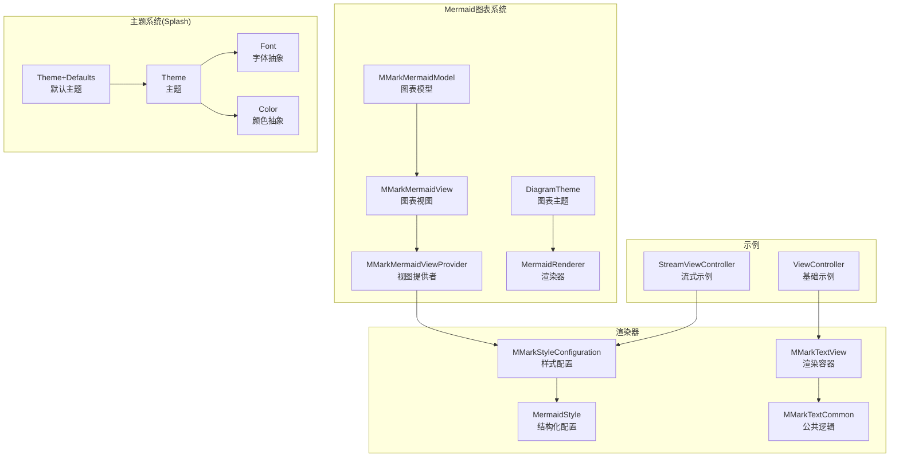
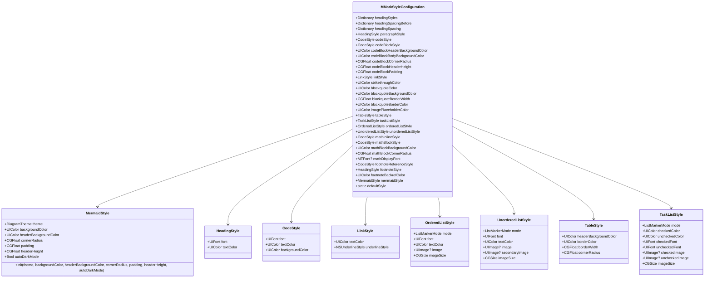
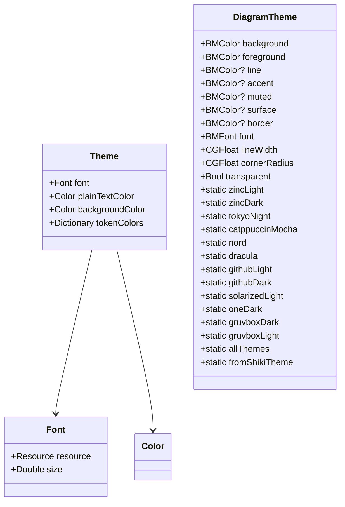
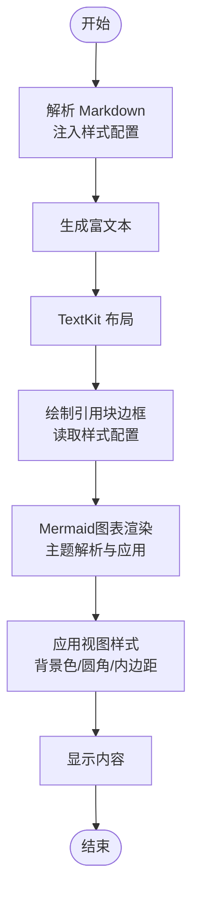
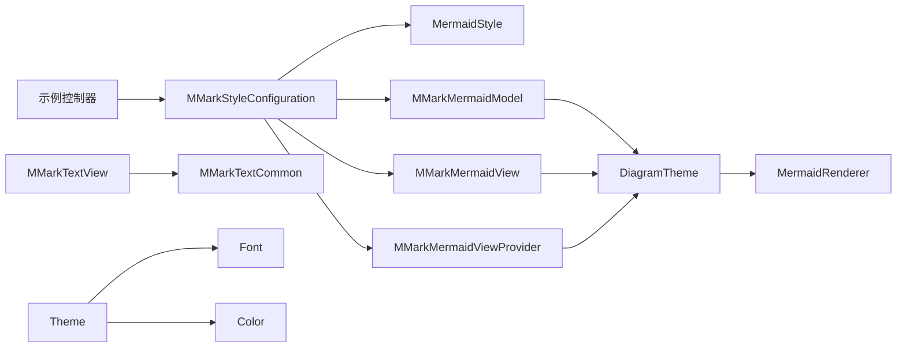

# 样式定制系统

<cite>
**本文档引用的文件**
- [MMarkStyleConfiguration.swift](file://MMarkParser/Sources/Renderer/MMarkStyleConfiguration.swift)
- [MMarkMermaidModel.swift](file://MMarkParser/Sources/Renderer/Attachments/MMarkMermaidAttachment/MMarkMermaidModel.swift)
- [MMarkMermaidView.swift](file://MMarkParser/Sources/Renderer/Attachments/MMarkMermaidAttachment/MMarkMermaidView.swift)
- [MMarkMermaidViewProvider.swift](file://MMarkParser/Sources/Renderer/Attachments/MMarkMermaidAttachment/MMarkMermaidViewProvider.swift)
- [MermaidTheme.swift](file://MMarkParser/BeautifulMermaidSwift/MermaidTheme.swift)
- [BeautifulMermaid.swift](file://MMarkParser/BeautifulMermaidSwift/BeautifulMermaid.swift)
- [Theme.swift](file://MMarkParser/Sources/Splash/Theming/Theme.swift)
- [Theme+Defaults.swift](file://MMarkParser/Sources/Splash/Theming/Theme+Defaults.swift)
- [Color.swift](file://MMarkParser/Sources/Splash/Theming/Color.swift)
- [Font.swift](file://MMarkParser/Sources/Splash/Theming/Font.swift)
- [MMarkTextView.swift](file://MMarkParser/Sources/Renderer/MMarkTextView.swift)
- [MMarkTextCommon.swift](file://MMarkParser/Sources/Renderer/MMarkTextCommon.swift)
- [StreamViewController.swift](file://cocoapod_demo/cocoapod_demo/StreamViewController.swift)
- [ViewController.swift](file://cocoapod_demo/cocoapod_demo/ViewController.swift)
</cite>

## 更新摘要
**变更内容**
- Mermaid配置API从扁平属性重构为结构化配置
- 新增MermaidStyle结构体，包含theme、backgroundColor、headerBackgroundColor、cornerRadius、padding、headerHeight、autoDarkMode等属性
- 更新MMarkStyleConfiguration以支持新的MermaidStyle配置
- 扩展Mermaid图表主题系统功能

## 目录
1. [简介](#简介)
2. [项目结构](#项目结构)
3. [核心组件](#核心组件)
4. [架构总览](#架构总览)
5. [详细组件分析](#详细组件分析)
6. [Mermaid图表主题系统](#mermaid图表主题系统)
7. [依赖关系分析](#依赖关系分析)
8. [性能考量](#性能考量)
9. [故障排查指南](#故障排查指南)
10. [结论](#结论)
11. [附录](#附录)

## 简介
本文件系统性阐述 MMarkParser 的样式定制体系，重点围绕 MMarkStyleConfiguration 的完整配置能力与主题系统设计，涵盖标题、段落、列表、链接、代码、blockquote、表格、任务列表、数学公式、脚注等 Markdown 元素的样式选项；**新增Mermaid图表主题系统支持，包括自动暗黑模式适配和结构化的MermaidStyle配置**；解释颜色、字体、间距等视觉属性的统一管理方式；说明样式继承与覆盖机制及在不同上下文中的应用策略；提供可操作的定制示例与最佳实践，并给出 API 使用指南与性能优化建议。

## 项目结构
样式系统主要分布在以下模块：
- 渲染器层：MMarkStyleConfiguration 定义样式配置，包含新的MermaidStyle结构化配置，MMarkTextView/MMarkTextCommon 提供渲染与交互。
- **Mermaid图表层**：MMarkMermaidModel/View/ViewProvider 负责Mermaid图表的渲染、主题管理和视图更新。
- **主题系统**：基于 BeautifulMermaidSwift 的 DiagramTheme，提供丰富的图表主题选择。
- 主题系统：基于 Splash 的 Theme/Font/Color 抽象，提供跨平台的颜色与字体表示。
- 示例工程：cocoapod_demo 展示如何在实际项目中应用样式配置。



**图表来源**
- [MMarkStyleConfiguration.swift:11-45](file://MMarkParser/Sources/Renderer/MMarkStyleConfiguration.swift#L11-L45)
- [MMarkMermaidModel.swift:1-164](file://MMarkParser/Sources/Renderer/Attachments/MMarkMermaidAttachment/MMarkMermaidModel.swift#L1-L164)
- [MMarkMermaidView.swift:1-187](file://MMarkParser/Sources/Renderer/Attachments/MMarkMermaidAttachment/MMarkMermaidView.swift#L1-L187)
- [MMarkMermaidViewProvider.swift:1-56](file://MMarkParser/Sources/Renderer/Attachments/MMarkMermaidAttachment/MMarkMermaidViewProvider.swift#L1-L56)
- [MermaidTheme.swift:1-371](file://MMarkParser/BeautifulMermaidSwift/MermaidTheme.swift#L1-L371)
- [BeautifulMermaid.swift:1-43](file://MMarkParser/BeautifulMermaidSwift/BeautifulMermaid.swift#L1-L43)
- [Theme.swift:1-42](file://MMarkParser/Sources/Splash/Theming/Theme.swift#L1-L42)
- [Theme+Defaults.swift:1-182](file://MMarkParser/Sources/Splash/Theming/Theme+Defaults.swift#L1-L182)
- [Font.swift:1-104](file://MMarkParser/Sources/Splash/Theming/Font.swift#L1-L104)
- [Color.swift:1-22](file://MMarkParser/Sources/Splash/Theming/Color.swift#L1-L22)
- [ViewController.swift:1-46](file://cocoapod_demo/cocoapod_demo/ViewController.swift#L1-L46)
- [StreamViewController.swift:1-279](file://cocoapod_demo/cocoapod_demo/StreamViewController.swift#L1-L279)

**章节来源**
- [MMarkStyleConfiguration.swift:11-45](file://MMarkParser/Sources/Renderer/MMarkStyleConfiguration.swift#L11-L45)
- [MMarkMermaidModel.swift:1-164](file://MMarkParser/Sources/Renderer/Attachments/MMarkMermaidAttachment/MMarkMermaidModel.swift#L1-L164)
- [MMarkMermaidView.swift:1-187](file://MMarkParser/Sources/Renderer/Attachments/MMarkMermaidAttachment/MMarkMermaidView.swift#L1-L187)
- [MMarkMermaidViewProvider.swift:1-56](file://MMarkParser/Sources/Renderer/Attachments/MMarkMermaidAttachment/MMarkMermaidViewProvider.swift#L1-L56)
- [MermaidTheme.swift:1-371](file://MMarkParser/BeautifulMermaidSwift/MermaidTheme.swift#L1-L371)
- [BeautifulMermaid.swift:1-43](file://MMarkParser/BeautifulMermaidSwift/BeautifulMermaid.swift#L1-L43)
- [Theme.swift:1-42](file://MMarkParser/Sources/Splash/Theming/Theme.swift#L1-L42)
- [Theme+Defaults.swift:1-182](file://MMarkParser/Sources/Splash/Theming/Theme+Defaults.swift#L1-L182)
- [Font.swift:1-104](file://MMarkParser/Sources/Splash/Theming/Font.swift#L1-L104)
- [Color.swift:1-22](file://MMarkParser/Sources/Splash/Theming/Color.swift#L1-L22)
- [ViewController.swift:1-46](file://cocoapod_demo/cocoapod_demo/ViewController.swift#L1-L46)
- [StreamViewController.swift:1-279](file://cocoapod_demo/cocoapod_demo/StreamViewController.swift#L1-L279)

## 核心组件
- **MMarkStyleConfiguration**：统一的 Markdown 样式配置中心，包含标题、段落、列表、链接、代码、blockquote、表格、任务列表、数学公式、脚注等元素的样式字段，以及**新的MermaidStyle结构化配置**，包含默认样式工厂。
- **MermaidStyle**：新的结构化Mermaid配置，包含theme、backgroundColor、headerBackgroundColor、cornerRadius、padding、headerHeight、autoDarkMode等属性，替代之前的扁平属性配置。
- **DiagramTheme**：来自 BeautifulMermaidSwift 的图表主题系统，提供丰富的预设主题和自定义主题能力。
- **MMarkMermaidModel/View/ViewProvider**：负责Mermaid图表的渲染、主题解析、视图管理和尺寸计算。
- Theme/Font/Color：来自 Splash 的跨平台主题抽象，提供字体资源加载与颜色表示。
- MMarkTextView/公共逻辑：负责将样式配置应用于渲染过程，处理链接点击、blockquote 边框绘制等。

**章节来源**
- [MMarkStyleConfiguration.swift:11-45](file://MMarkParser/Sources/Renderer/MMarkStyleConfiguration.swift#L11-L45)
- [MMarkStyleConfiguration.swift:179-180](file://MMarkParser/Sources/Renderer/MMarkStyleConfiguration.swift#L179-L180)
- [MermaidTheme.swift:11-168](file://MMarkParser/BeautifulMermaidSwift/MermaidTheme.swift#L11-L168)
- [MMarkMermaidModel.swift:1-164](file://MMarkParser/Sources/Renderer/Attachments/MMarkMermaidAttachment/MMarkMermaidModel.swift#L1-L164)
- [MMarkMermaidView.swift:1-187](file://MMarkParser/Sources/Renderer/Attachments/MMarkMermaidAttachment/MMarkMermaidView.swift#L1-L187)
- [MMarkMermaidViewProvider.swift:1-56](file://MMarkParser/Sources/Renderer/Attachments/MMarkMermaidAttachment/MMarkMermaidViewProvider.swift#L1-L56)
- [Theme.swift:20-39](file://MMarkParser/Sources/Splash/Theming/Theme.swift#L20-L39)
- [Font.swift:15-83](file://MMarkParser/Sources/Splash/Theming/Font.swift#L15-L83)
- [Color.swift:7-21](file://MMarkParser/Sources/Splash/Theming/Color.swift#L7-L21)
- [MMarkTextView.swift:6-37](file://MMarkParser/Sources/Renderer/MMarkTextView.swift#L6-L37)
- [MMarkTextCommon.swift:33-36](file://MMarkParser/Sources/Renderer/MMarkTextCommon.swift#L33-L36)

## 架构总览
样式系统采用"配置驱动 + 文本布局集成 + 图表主题管理"的架构：
- 配置层：MMarkStyleConfiguration 提供细粒度样式字段与默认值，**包含新的MermaidStyle结构化配置**。
- 渲染层：MMarkTextView 在解析 Markdown 时注入样式配置，TextKit 2/1 的布局结果配合样式参数进行最终绘制。
- **图表层**：MMarkMermaidModel/View/ViewProvider 负责Mermaid图表的渲染，支持自动暗黑模式适配和主题切换。
- 主题层：Theme/Font/Color 为跨平台的主题抽象，DiagramTheme 为图表提供专业的主题系统。

```mermaid
sequenceDiagram
participant VC as "控制器"
participant TV as "MMarkTextView"
participant CFG as "MMarkStyleConfiguration"
participant MS as "MermaidStyle"
participant MMM as "MMarkMermaidModel"
participant MMV as "MMarkMermaidView"
participant DT as "DiagramTheme"
participant PARSER as "CMarkParser"
participant TK as "TextKit"
VC->>TV : "设置 Markdown 内容"
TV->>CFG : "读取样式配置"
CFG->>MS : "访问MermaidStyle"
TV->>PARSER : "parse(markdown, configuration, containerWidth)"
PARSER-->>TV : "返回 NSAttributedString"
TV->>TK : "显示富文本"
TV->>TV : "根据样式更新 blockquote 边框"
Note over MMM,MMV,DT : "Mermaid图表渲染流程"
MMM->>MS : "获取Mermaid配置"
MMM->>DT : "解析图表主题"
MMV->>MS : "应用视图样式"
MMM->>MMM : "渲染图表图像"
```

**图表来源**
- [MMarkTextView.swift:40-49](file://MMarkParser/Sources/Renderer/MMarkTextView.swift#L40-L49)
- [MMarkTextCommon.swift:132-249](file://MMarkParser/Sources/Renderer/MMarkTextCommon.swift#L132-L249)
- [MMarkStyleConfiguration.swift:179-180](file://MMarkParser/Sources/Renderer/MMarkStyleConfiguration.swift#L179-L180)
- [MMarkMermaidModel.swift:51-65](file://MMarkParser/Sources/Renderer/Attachments/MMarkMermaidAttachment/MMarkMermaidModel.swift#L51-L65)
- [MMarkMermaidView.swift:47-58](file://MMarkParser/Sources/Renderer/Attachments/MMarkMermaidAttachment/MMarkMermaidView.swift#L47-L58)

**章节来源**
- [MMarkTextView.swift:40-61](file://MMarkParser/Sources/Renderer/MMarkTextView.swift#L40-L61)
- [MMarkTextCommon.swift:132-249](file://MMarkParser/Sources/Renderer/MMarkTextCommon.swift#L132-L249)
- [MMarkStyleConfiguration.swift:179-180](file://MMarkParser/Sources/Renderer/MMarkStyleConfiguration.swift#L179-L180)
- [MMarkMermaidModel.swift:51-65](file://MMarkParser/Sources/Renderer/Attachments/MMarkMermaidAttachment/MMarkMermaidModel.swift#L51-L65)
- [MMarkMermaidView.swift:47-58](file://MMarkParser/Sources/Renderer/Attachments/MMarkMermaidAttachment/MMarkMermaidView.swift#L47-L58)

## 详细组件分析

### MMarkStyleConfiguration：样式配置体系
- **结构组成**
  - 标题样式：headingStyles（按 H1-H6 分级）、headingSpacingBefore、headingSpacing。
  - 段落样式：paragraphStyle（字体、文本色）。
  - 代码样式：codeStyle（行内）、codeBlockStyle（代码块整体）、代码块头部/主体背景色、圆角、高度、内边距。
  - 链接样式：linkStyle（文本色、下划线样式）。
  - 删除线颜色：strikethroughColor。
  - 引用块：blockquoteColor、blockquoteBackgroundColor、blockquoteBorderWidth、blockquoteBorderColor。
  - 图片占位符：imagePlaceholderColor。
  - 表格：tableStyle（header 背景色、边框色、边框宽、圆角）。
  - 任务列表：taskListStyle（勾选/未勾选颜色、字体、图标、尺寸）。
  - 列表：orderedListStyle（有序）、unorderedListStyle（无序，含一级与多级图标回退）。
  - 数学公式：mathInlineStyle、mathBlockStyle、mathBlockBackgroundColor、mathBlockCornerRadius、mathDisplayFont。
  - 脚注：footnoteReferenceStyle（脚注引用样式）、footnoteStyle（脚注定义文本）、footnoteBackrefColor（回链颜色）。
  - **新的MermaidStyle配置**：mermaidStyle（包含theme、backgroundColor、headerBackgroundColor、cornerRadius、padding、headerHeight、autoDarkMode等属性）。
  - 列表前缀渲染模式：ListMarkerMode（字符/图像）。

- **默认样式**
  - 提供 defaultStyle，覆盖常见 Markdown 元素的视觉规范，**包含新的MermaidStyle的默认配置**（.default 主题、透明背景、12pt圆角、12pt内边距、32pt header高度、自动暗黑模式开启）。

- **初始化与覆盖**
  - 通过构造函数传入各字段，支持局部覆盖默认样式。

- **关键字段与用途**
  - headingStyles：H1-H6 不同级别的字体与颜色。
  - headingSpacingBefore/headingSpacing：控制各级标题的前后间距。
  - codeBlockHeaderBackgroundColor/BodyBackgroundColor：区分代码块头部与主体的背景。
  - orderedListStyle/unorderedListStyle：支持字符或图像两种标记模式，图像模式可为一级与多级设置不同图标。
  - mathDisplayFont：iosMath 渲染使用的字体，为空时回退到 Latin Modern Math。
  - blockquoteBorderWidth/Color：控制引用块的边框宽度与颜色，用于 TextKit 2 的 blockquote 边框绘制。
  - **mermaidStyle**：新的结构化Mermaid配置，包含图表主题、背景色、圆角、内边距等完整属性。

**章节来源**
- [MMarkStyleConfiguration.swift:11-186](file://MMarkParser/Sources/Renderer/MMarkStyleConfiguration.swift#L11-L186)
- [MMarkStyleConfiguration.swift:179-180](file://MMarkParser/Sources/Renderer/MMarkStyleConfiguration.swift#L179-L180)
- [MMarkStyleConfiguration.swift:229-308](file://MMarkParser/Sources/Renderer/MMarkStyleConfiguration.swift#L229-L308)

#### 类图：样式配置数据结构


**图表来源**
- [MMarkStyleConfiguration.swift:11-45](file://MMarkParser/Sources/Renderer/MMarkStyleConfiguration.swift#L11-L45)
- [MMarkStyleConfiguration.swift:179-180](file://MMarkParser/Sources/Renderer/MMarkStyleConfiguration.swift#L179-L180)

### MermaidStyle：新的结构化配置
- **结构组成**
  - theme：图表主题（DiagramTheme）
  - backgroundColor：图表主体背景色
  - headerBackgroundColor：图表header背景色
  - cornerRadius：图表圆角
  - padding：图表内边距
  - headerHeight：图表header高度
  - autoDarkMode：自动暗黑模式开关

- **默认配置**
  - theme：.default（DiagramTheme的默认主题）
  - backgroundColor：UIColor.systemGray.withAlphaComponent(0.1)
  - headerBackgroundColor：UIColor.systemGray.withAlphaComponent(0.3)
  - cornerRadius：12
  - padding：12
  - headerHeight：32
  - autoDarkMode：true

- **初始化方法**
  - 提供带默认值的初始化方法，便于快速配置

**章节来源**
- [MMarkStyleConfiguration.swift:11-45](file://MMarkParser/Sources/Renderer/MMarkStyleConfiguration.swift#L11-L45)

### 主题系统：颜色、字体、间距的统一管理
- Theme/Font/Color
  - Theme：封装字体、普通文本颜色、背景色、Token 颜色映射。
  - Font：跨平台字体抽象，支持系统字体、预加载字体、磁盘路径字体加载。
  - Color：跨平台颜色别名，iOS/macOS 平台分别映射到 UIColor/NSColor。
- **DiagramTheme**
  - **图表专用主题系统**，提供丰富的预设主题（Zinc Light/Dark、Tokyo Night系列、Catppuccin系列、Nord系列、Dracula、GitHub系列、Solarized系列、One Dark、Gruvbox系列等）。
  - 支持从VS Code/Shiki主题导入，实现与编辑器主题的一致性。
  - 提供图表元素的派生颜色计算，包括线条、强调色、次级文本、节点填充、边框等。
- 默认主题
  - Theme+Defaults 提供多种预设主题（如 Sundell's Colors、Midnight、WWDC 系列、Sunset、Presentation），可直接用于语法高亮等场景。

- 应用建议
  - 对于 Markdown 渲染，MMarkStyleConfiguration 已内置默认样式；若需与语法高亮风格一致，可在初始化 Theme 时选择合适的字体与颜色，并在应用层保持一致性。
  - **对于Mermaid图表，建议使用新的MermaidStyle配置，或基于现有主题创建自定义主题。**

**章节来源**
- [Theme.swift:20-39](file://MMarkParser/Sources/Splash/Theming/Theme.swift#L20-L39)
- [Theme+Defaults.swift:11-179](file://MMarkParser/Sources/Splash/Theming/Theme+Defaults.swift#L11-L179)
- [Font.swift:15-83](file://MMarkParser/Sources/Splash/Theming/Font.swift#L15-L83)
- [Color.swift:7-21](file://MMarkParser/Sources/Splash/Theming/Color.swift#L7-L21)
- [MermaidTheme.swift:11-168](file://MMarkParser/BeautifulMermaidSwift/MermaidTheme.swift#L11-L168)

#### 类图：主题系统


**图表来源**
- [Theme.swift:20-39](file://MMarkParser/Sources/Splash/Theming/Theme.swift#L20-L39)
- [Font.swift:15-46](file://MMarkParser/Sources/Splash/Theming/Font.swift#L15-L46)
- [Color.swift:7-21](file://MMarkParser/Sources/Splash/Theming/Color.swift#L7-L21)
- [MermaidTheme.swift:11-168](file://MMarkParser/BeautifulMermaidSwift/MermaidTheme.swift#L11-L168)

### 样式继承与覆盖机制
- 继承
  - MMarkStyleConfiguration 通过字典与结构体组合，将"级别"（如 H1-H6）与"通用样式"（如段落、链接）分离，形成分级继承语义。
  - **新的MermaidStyle配置继承自DiagramTheme的基础配置，支持局部覆盖。**
- 覆盖
  - 在应用层直接修改 styleConfiguration.mermaidStyle 中对应字段即可覆盖默认样式；例如在流式示例中修改有序列表文本色、无序列表图像、任务列表图像等。
  - **新的MermaidStyle配置可通过mermaidStyle字段进行全局覆盖，或通过resolveTheme方法实现自动暗黑模式切换。**
- 上下文应用
  - MMarkTextView 在 setMarkdown 时将 styleConfiguration 注入解析流程；blockquote 边框绘制也直接读取样式配置。
  - **MMarkMermaidModel/View/ViewProvider 在创建图表时解析MermaidStyle配置，支持运行时主题切换。**

**章节来源**
- [StreamViewController.swift:169-184](file://cocoapod_demo/cocoapod_demo/StreamViewController.swift#L169-L184)
- [MMarkTextView.swift:40-49](file://MMarkParser/Sources/Renderer/MMarkTextView.swift#L40-L49)
- [MMarkTextCommon.swift:192-244](file://MMarkParser/Sources/Renderer/MMarkTextCommon.swift#L192-L244)
- [MMarkMermaidModel.swift:51-65](file://MMarkParser/Sources/Renderer/Attachments/MMarkMermaidAttachment/MMarkMermaidModel.swift#L51-L65)
- [MMarkMermaidView.swift:47-58](file://MMarkParser/Sources/Renderer/Attachments/MMarkMermaidAttachment/MMarkMermaidView.swift#L47-L58)
- [MMarkMermaidViewProvider.swift:33-34](file://MMarkParser/Sources/Renderer/Attachments/MMarkMermaidAttachment/MMarkMermaidViewProvider.swift#L33-L34)

### 渲染流程与样式应用
- 解析与渲染
  - MMarkTextView.setMarkdown 调用解析器，传入 styleConfiguration 与容器宽度，生成 NSAttributedString。
- Blockquote 边框
  - 基于 TextKit 的布局信息，按引用块深度绘制多级边框，颜色与宽度来自样式配置。
- **Mermaid图表渲染**
  - **MMarkMermaidModel.resolveTheme 根据系统暗黑模式和MermaidStyle配置决定最终图表主题。**
  - **MMarkMermaidView 应用MermaidStyle的视图样式，包括背景色、圆角、内边距等。**
  - **BeautifulMermaid 渲染器使用DiagramTheme进行图表绘制，支持透明背景和各种图表类型。**



**图表来源**
- [MMarkTextView.swift:40-49](file://MMarkParser/Sources/Renderer/MMarkTextView.swift#L40-L49)
- [MMarkTextCommon.swift:132-249](file://MMarkParser/Sources/Renderer/MMarkTextCommon.swift#L132-L249)
- [MMarkMermaidModel.swift:51-65](file://MMarkParser/Sources/Renderer/Attachments/MMarkMermaidAttachment/MMarkMermaidModel.swift#L51-L65)
- [MMarkMermaidView.swift:47-58](file://MMarkParser/Sources/Renderer/Attachments/MMarkMermaidAttachment/MMarkMermaidView.swift#L47-L58)

**章节来源**
- [MMarkTextView.swift:40-61](file://MMarkParser/Sources/Renderer/MMarkTextView.swift#L40-L61)
- [MMarkTextCommon.swift:132-249](file://MMarkParser/Sources/Renderer/MMarkTextCommon.swift#L132-L249)
- [MMarkMermaidModel.swift:51-65](file://MMarkParser/Sources/Renderer/Attachments/MMarkMermaidAttachment/MMarkMermaidModel.swift#L51-L65)
- [MMarkMermaidView.swift:47-58](file://MMarkParser/Sources/Renderer/Attachments/MMarkMermaidAttachment/MMarkMermaidView.swift#L47-L58)

### 定制示例与最佳实践
- 自定义主题与样式变体
  - 在示例工程中，通过复制默认样式并修改特定字段，即可创建自定义主题与样式变体。例如：
    - 修改有序列表文本色、无序列表图像（一级/多级回退）、任务列表图像。
    - 调整代码块头部/主体背景色、圆角、内边距与高度。
    - 调整数学公式内联/块级样式与背景色、圆角。
    - **新的MermaidStyle配置：设置theme、backgroundColor、headerBackgroundColor、cornerRadius、padding、headerHeight、autoDarkMode等属性。**
- 最佳实践
  - 保持视觉一致性：标题字号、段落行高、列表缩进与间距应成体系。
  - **新的MermaidStyle配置一致性：确保图表样式与整体应用主题协调，利用自动暗黑模式提升用户体验。**
  - 性能优先：避免频繁重建样式对象；尽量在初始化阶段完成样式组装。
  - 可访问性：确保文本色与背景色对比度满足可读性要求。
  - 可维护性：将样式集中管理，必要时拆分为多个配置对象或分层主题。

**章节来源**
- [StreamViewController.swift:169-184](file://cocoapod_demo/cocoapod_demo/StreamViewController.swift#L169-L184)
- [MMarkStyleConfiguration.swift:229-308](file://MMarkParser/Sources/Renderer/MMarkStyleConfiguration.swift#L229-L308)
- [MermaidTheme.swift:171-371](file://MMarkParser/BeautifulMermaidSwift/MermaidTheme.swift#L171-L371)

## Mermaid图表主题系统

### 自动暗黑模式适配
- **亮度检测机制**
  - MMarkMermaidModel.resolveTheme 方法检查系统用户界面风格（.dark 或 .light）。
  - 基于配置的mermaidStyle.theme背景色亮度计算（使用0.299R + 0.587G + 0.114B公式）。
  - **暗黑模式**：如果背景色亮度 < 0.5，使用原主题；否则切换到.zincDark。
  - **明亮模式**：如果背景色亮度 ≥ 0.5，使用原主题；否则切换到.zincLight。

- **主题切换逻辑**
  ```swift
  let isDark = UITraitCollection.current.userInterfaceStyle == .dark
  let luminance = 0.299 * r + 0.587 * g + 0.114 * b
  let theme = isDark ? 
      (luminance < 0.5 ? configuration.mermaidStyle.theme : .zincDark) :
      (luminance >= 0.5 ? configuration.mermaidStyle.theme : .zincLight)
  ```

### 结构化样式属性
- **新的MermaidStyle配置**
  - mermaidStyle.theme：主图表主题（DiagramTheme）
  - mermaidStyle.autoDarkMode：自动暗黑模式开关（默认true）
- **图表外观配置**
  - mermaidStyle.backgroundColor：图表主体背景色
  - mermaidStyle.headerBackgroundColor：图表header背景色
  - mermaidStyle.cornerRadius：图表圆角半径（默认12）
  - mermaidStyle.padding：图表内边距（默认12）
  - mermaidStyle.headerHeight：图表header高度（默认32）

### 预设主题库
- **Zinc系列**：zincLight（#FFFFFF）、zincDark（#18181B）
- **Tokyo Night系列**：tokyoNight、tokyoNightStorm、tokyoNightLight
- **Catppuccin系列**：catppuccinMocha、catppuccinLatte
- **Nord系列**：nord、nordLight
- **其他流行主题**：dracula、githubLight/Dark、solarizedLight/Dark、oneDark、gruvboxDark/Light

### 自定义主题创建
- **基于现有主题**：使用现有主题作为基底，调整特定颜色属性。
- **从VS Code主题导入**：支持将编辑器主题转换为图表主题，实现开发环境一致性。
- **手动配置**：指定background、foreground、line、accent、muted、surface、border等颜色。

**章节来源**
- [MMarkMermaidModel.swift:51-65](file://MMarkParser/Sources/Renderer/Attachments/MMarkMermaidAttachment/MMarkMermaidModel.swift#L51-L65)
- [MMarkMermaidModel.swift:93-140](file://MMarkParser/Sources/Renderer/Attachments/MMarkMermaidAttachment/MMarkMermaidModel.swift#L93-L140)
- [MMarkMermaidView.swift:47-58](file://MMarkParser/Sources/Renderer/Attachments/MMarkMermaidAttachment/MMarkMermaidView.swift#L47-L58)
- [MMarkStyleConfiguration.swift:11-45](file://MMarkParser/Sources/Renderer/MMarkStyleConfiguration.swift#L11-L45)
- [MermaidTheme.swift:171-371](file://MMarkParser/BeautifulMermaidSwift/MermaidTheme.swift#L171-L371)

## 依赖关系分析
- 组件耦合
  - MMarkTextView 依赖 MMarkStyleConfiguration 进行渲染；MMarkTextCommon 提供公共逻辑（链接处理、blockquote 边框绘制）。
  - **MMarkMermaidModel/View/ViewProvider 依赖 MMarkStyleConfiguration 和 DiagramTheme 进行图表渲染。**
  - 主题系统（Theme/Font/Color）与样式配置解耦，可用于其他渲染场景（如语法高亮）。
- 外部依赖
  - UIKit（iOS 平台）：用于字体、颜色、文本布局与绘制。
  - iosMath：用于数学公式渲染，可通过 mathDisplayFont 控制字体。
  - **BeautifulMermaidSwift：提供Mermaid图表渲染能力和DiagramTheme主题系统。**



**图表来源**
- [MMarkStyleConfiguration.swift:11-45](file://MMarkParser/Sources/Renderer/MMarkStyleConfiguration.swift#L11-L45)
- [MMarkTextView.swift:6-37](file://MMarkParser/Sources/Renderer/MMarkTextView.swift#L6-L37)
- [MMarkTextCommon.swift:33-36](file://MMarkParser/Sources/Renderer/MMarkTextCommon.swift#L33-L36)
- [MMarkMermaidModel.swift:1-164](file://MMarkParser/Sources/Renderer/Attachments/MMarkMermaidAttachment/MMarkMermaidModel.swift#L1-164)
- [MMarkMermaidView.swift:1-187](file://MMarkParser/Sources/Renderer/Attachments/MMarkMermaidAttachment/MMarkMermaidView.swift#L1-187)
- [MMarkMermaidViewProvider.swift:1-56](file://MMarkParser/Sources/Renderer/Attachments/MMarkMermaidAttachment/MMarkMermaidViewProvider.swift#L1-56)
- [MermaidTheme.swift:1-371](file://MMarkParser/BeautifulMermaidSwift/MermaidTheme.swift#L1-371)
- [Theme.swift:20-39](file://MMarkParser/Sources/Splash/Theming/Theme.swift#L20-L39)
- [Font.swift:15-46](file://MMarkParser/Sources/Splash/Theming/Font.swift#L15-L46)
- [Color.swift:7-21](file://MMarkParser/Sources/Splash/Theming/Color.swift#L7-L21)

**章节来源**
- [MMarkStyleConfiguration.swift:11-45](file://MMarkParser/Sources/Renderer/MMarkStyleConfiguration.swift#L11-L45)
- [MMarkTextView.swift:6-37](file://MMarkParser/Sources/Renderer/MMarkTextView.swift#L6-L37)
- [MMarkTextCommon.swift:33-36](file://MMarkParser/Sources/Renderer/MMarkTextCommon.swift#L33-L36)
- [MMarkMermaidModel.swift:1-164](file://MMarkParser/Sources/Renderer/Attachments/MMarkMermaidAttachment/MMarkMermaidModel.swift#L1-164)
- [MMarkMermaidView.swift:1-187](file://MMarkParser/Sources/Renderer/Attachments/MMarkMermaidAttachment/MMarkMermaidView.swift#L1-187)
- [MMarkMermaidViewProvider.swift:1-56](file://MMarkParser/Sources/Renderer/Attachments/MMarkMermaidAttachment/MMarkMermaidViewProvider.swift#L1-56)
- [MermaidTheme.swift:1-371](file://MMarkParser/BeautifulMermaidSwift/MermaidTheme.swift#L1-371)
- [Theme.swift:20-39](file://MMarkParser/Sources/Splash/Theming/Theme.swift#L20-L39)
- [Font.swift:15-46](file://MMarkParser/Sources/Splash/Theming/Font.swift#L15-L46)
- [Color.swift:7-21](file://MMarkParser/Sources/Splash/Theming/Color.swift#L7-L21)

## 性能考量
- 样式对象复用
  - 将样式配置作为不可变对象在应用层共享，避免在渲染循环中重复构建。
- 布局与绘制
  - blockquote 边框绘制依赖 TextKit 布局结果，应在 contentSize 更新后异步刷新，避免阻塞主线程。
  - **新的MermaidStyle配置渲染涉及复杂的图形计算，建议在后台线程执行渲染，避免阻塞UI线程。**
- 字体与资源
  - 自定义字体加载成本较高，建议在应用启动时预热；数学公式字体可按需加载。
  - **图表主题颜色计算相对轻量，但大量图表同时渲染时仍需考虑内存占用。**
- 渲染管线
  - 流式渲染时，合理设置 typingSpeed 与 chunkSize，平衡流畅度与内存占用。
  - **新的MermaidStyle配置的自动暗黑模式检测应在系统主题变化时触发，避免不必要的重复计算。**

## 故障排查指南
- 链接无法点击或被系统拦截
  - 检查 MMarkLinkDelegate 回调是否正确处理非 Web 链接（脚注、锚点），确保返回值符合预期。
- 引用块边框不显示
  - 确认样式配置中的 blockquoteBorderWidth/Color 是否有效；TextKit 2/1 的布局信息是否可用。
- 图像占位符颜色异常
  - 检查 imagePlaceholderColor 是否被覆盖；确认图片加载失败时的占位逻辑。
- 数学公式渲染异常
  - 检查 mathDisplayFont 是否正确设置；若为空，系统会回退到 Latin Modern Math，默认字体可能缺失时回退到系统字体。
- **Mermaid图表主题问题**
  - **检查mermaidStyle.autoDarkMode配置是否正确，确认系统主题变化时主题切换逻辑正常工作。**
  - **验证MermaidStyle配置的有效性，确保颜色值格式正确。**
  - **图表渲染失败时，检查BeautifulMermaid渲染器的日志输出，确认Mermaid语法正确。**

**章节来源**
- [MMarkTextCommon.swift:49-129](file://MMarkParser/Sources/Renderer/MMarkTextCommon.swift#L49-L129)
- [MMarkTextCommon.swift:132-249](file://MMarkParser/Sources/Renderer/MMarkTextCommon.swift#L132-L249)
- [MMarkStyleConfiguration.swift:100-140](file://MMarkParser/Sources/Renderer/MMarkStyleConfiguration.swift#L100-L140)
- [MMarkMermaidModel.swift:51-65](file://MMarkParser/Sources/Renderer/Attachments/MMarkMermaidAttachment/MMarkMermaidModel.swift#L51-L65)

## 结论
MMarkParser 的样式定制系统以 MMarkStyleConfiguration 为核心，提供了覆盖标题、段落、列表、链接、代码、blockquote、表格、任务列表、数学公式、脚注等元素的完整样式配置能力；**新的MermaidStyle结构化配置进一步增强了图表渲染的定制化能力，包括自动暗黑模式适配和丰富的预设主题选择**；结合 Theme/Font/Color 的跨平台主题抽象，能够实现统一且可扩展的视觉体系。通过示例工程可以看到如何在实际项目中进行样式定制与覆盖。遵循一致性、可访问性与性能原则，可构建高质量的 Markdown 渲染体验。

## 附录

### API 参考与使用指南
- **MMarkStyleConfiguration**
  - **新的MermaidStyle配置**：mermaidStyle（包含theme、backgroundColor、headerBackgroundColor、cornerRadius、padding、headerHeight、autoDarkMode等属性）。
  - 使用方式：在渲染前设置到 MMarkTextView 的 styleConfiguration 属性；或在流式渲染中动态修改。
  - **新的MermaidStyle配置**：通过mermaidStyle设置图表主题，mermaidStyle.autoDarkMode控制自动暗黑模式，其他字段控制图表外观。
- **MermaidStyle**
  - **新结构化配置**：包含theme、backgroundColor、headerBackgroundColor、cornerRadius、padding、headerHeight、autoDarkMode等属性。
  - **默认值**：.default主题、透明背景、12pt圆角、12pt内边距、32pt header高度、自动暗黑模式开启。
  - **使用方式**：通过MMarkStyleConfiguration.mermaidStyle访问和修改。
- **DiagramTheme**
  - **预设主题**：zincLight/Dark、tokyoNight系列、catppuccin系列、nord系列、dracula、githubLight/Dark、solarizedLight/Dark、oneDark、gruvboxDark/Light。
  - **自定义主题**：通过构造函数创建，支持透明背景、自定义圆角、线条宽度等属性。
  - **主题导入**：支持从VS Code/Shiki主题转换。
- MMarkTextView
  - setMarkdown：传入 Markdown 文本，自动应用样式配置并渲染。
  - mmarkLinkDelegate：处理链接点击事件，支持脚注与锚点跳转。
- **MMarkMermaidModel/View/ViewProvider**
  - **resolveTheme**：根据系统主题和MermaidStyle配置解析最终图表主题。
  - **create**：创建Mermaid图表模型，包含渲染后的图像和尺寸信息。
  - **updateImage**：更新图表图像，支持暗黑模式切换时的重新渲染。
- 示例工程
  - ViewController：基础 Markdown 渲染示例。
  - StreamViewController：演示如何修改样式配置并进行流式渲染。

**章节来源**
- [MMarkStyleConfiguration.swift:11-45](file://MMarkParser/Sources/Renderer/MMarkStyleConfiguration.swift#L11-L45)
- [MMarkStyleConfiguration.swift:229-308](file://MMarkParser/Sources/Renderer/MMarkStyleConfiguration.swift#L229-L308)
- [MermaidTheme.swift:11-371](file://MMarkParser/BeautifulMermaidSwift/MermaidTheme.swift#L11-L371)
- [MMarkMermaidModel.swift:51-65](file://MMarkParser/Sources/Renderer/Attachments/MMarkMermaidAttachment/MMarkMermaidModel.swift#L51-L65)
- [MMarkMermaidView.swift:150-162](file://MMarkParser/Sources/Renderer/Attachments/MMarkMermaidAttachment/MMarkMermaidView.swift#L150-L162)
- [MMarkMermaidViewProvider.swift:30-49](file://MMarkParser/Sources/Renderer/Attachments/MMarkMermaidAttachment/MMarkMermaidViewProvider.swift#L30-L49)
- [MMarkTextView.swift:9-49](file://MMarkParser/Sources/Renderer/MMarkTextView.swift#L9-L49)
- [ViewController.swift:38-43](file://cocoapod_demo/cocoapod_demo/ViewController.swift#L38-L43)
- [StreamViewController.swift:169-184](file://cocoapod_demo/cocoapod_demo/StreamViewController.swift#L169-L184)