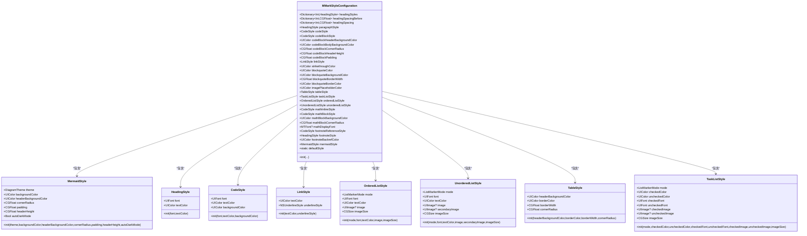
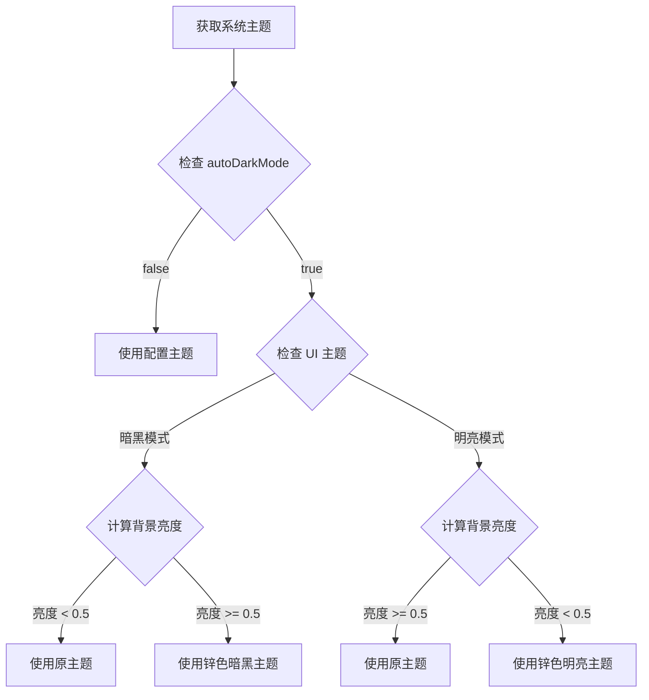
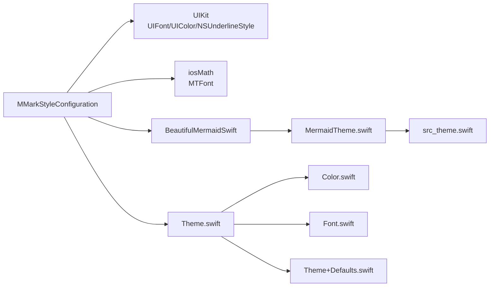

# 样式配置核心

<cite>
**本文档引用的文件**
- [MMarkStyleConfiguration.swift](file://MMarkParser/Renderer/MMarkStyleConfiguration.swift)
- [MermaidStyle.swift](file://BeautifulMermaidSwift/MermaidTheme.swift)
- [src_theme.swift](file://BeautifulMermaidSwift/Mermaid/src_theme.swift)
- [MMarkMermaidModel.swift](file://MMarkParser/Renderer/Attachments/MMarkMermaidAttachment/MMarkMermaidModel.swift)
- [Theme.swift](file://MMarkParser/Sources/Splash/Theming/Theme.swift)
- [Theme+Defaults.swift](file://MMarkParser/Sources/Splash/Theming/Theme+Defaults.swift)
- [Color.swift](file://MMarkParser/Sources/Splash/Theming/Color.swift)
- [Font.swift](file://MMarkParser/Sources/Splash/Theming/Font.swift)
</cite>

## 更新摘要
**所做更改**
- 新增Mermaid样式配置整合到MermaidStyle结构的说明
- 更新MMarkStyleConfiguration中的Mermaid相关属性描述
- 添加Mermaid图表主题解析机制的详细说明
- 更新Mermaid样式配置的最佳实践和使用示例

## 目录
1. [简介](#简介)
2. [项目结构](#项目结构)
3. [核心组件](#核心组件)
4. [架构总览](#架构总览)
5. [详细组件分析](#详细组件分析)
6. [Mermaid样式配置系统](#mermaid样式配置系统)
7. [依赖关系分析](#依赖关系分析)
8. [性能考量](#性能考量)
9. [故障排查指南](#故障排查指南)
10. [结论](#结论)
11. [附录](#附录)

## 简介
本文件围绕 MMarkStyleConfiguration 核心样式配置类展开，系统阐述其在 Markdown 渲染中的"样式配置中心"角色与设计理念。该配置类以强类型结构体形式组织各类渲染样式，覆盖标题、段落、代码、链接、表格、任务列表、数学公式、脚注等 Markdown 元素，并通过字典映射支持 H1–H6 的独立样式与层级化间距控制。

**重要更新**：样式配置系统已进行重构，Mermaid 图表样式配置现已整合到独立的 MermaidStyle 结构中，提供更清晰的配置接口和更好的主题管理能力。新系统支持自动暗黑模式切换、统一的主题配置和更直观的图表外观控制。

## 项目结构
与样式配置直接相关的文件位于渲染器与主题系统中：
- 渲染器层：MMarkStyleConfiguration.swift 定义了样式配置主体及其子样式结构
- Mermaid集成：MermaidStyle.swift 提供图表专用的样式配置
- 主题系统（Splash）：Theme.swift、Theme+Defaults.swift、Color.swift、Font.swift 提供跨平台的颜色、字体抽象与默认主题

```mermaid
graph TB
subgraph "渲染器"
CFG["MMarkStyleConfiguration.swift"]
MERMAID["MermaidStyle.swift"]
END
subgraph "Mermaid集成"
THEME["MermaidTheme.swift"]
SRC_THEME["src_theme.swift"]
MODEL["MMarkMermaidModel.swift"]
END
subgraph "主题系统(Splash)"
THEME_SYS["Theme.swift"]
TDEFAULTS["Theme+Defaults.swift"]
COLOR["Color.swift"]
FONT["Font.swift"]
END
CFG --> MERMAID
MERMAID --> THEME
MERMAID --> SRC_THEME
CFG --> THEME_SYS
CFG --> COLOR
CFG --> FONT
THEME_SYS --> TDEFAULTS
THEME_SYS --> COLOR
THEME_SYS --> FONT
```

**图表来源**
- [MMarkStyleConfiguration.swift:1-45](file://MMarkParser/Renderer/MMarkStyleConfiguration.swift#L1-L45)
- [MermaidStyle.swift:11-45](file://BeautifulMermaidSwift/MermaidTheme.swift#L11-L45)
- [MMarkMermaidModel.swift:47-62](file://MMarkParser/Renderer/Attachments/MMarkMermaidAttachment/MMarkMermaidModel.swift#L47-L62)

**章节来源**
- [MMarkStyleConfiguration.swift:1-45](file://MMarkParser/Renderer/MMarkStyleConfiguration.swift#L1-L45)
- [MermaidStyle.swift:11-45](file://BeautifulMermaidSwift/MermaidTheme.swift#L11-L45)
- [MMarkMermaidModel.swift:47-62](file://MMarkParser/Renderer/Attachments/MMarkMermaidAttachment/MMarkMermaidModel.swift#L47-L62)

## 核心组件
- 样式配置主体：MMarkStyleConfiguration
  - 作用：集中管理 Markdown 各元素的渲染样式与布局参数
  - 设计：采用结构体聚合多种子样式结构，便于组合与不可变传递
- Mermaid样式配置：MermaidStyle
  - 作用：专门管理 Mermaid 图表的外观配置
  - 设计：提供图表主题、颜色、圆角、内边距等完整配置选项
- 子样式结构：
  - HeadingStyle：标题字体与文本颜色
  - CodeStyle：行内/代码块字体、文本与背景色
  - LinkStyle：链接文本颜色与下划线样式
  - OrderedListStyle / UnorderedListStyle：有序/无序列表标记模式、字体、颜色、图标与尺寸
  - TableStyle：表格头部背景、边框颜色、宽度与圆角
  - TaskListStyle：任务列表勾选/未勾选状态的颜色、字体与图标
  - 数学公式样式：行内与块级的字体、文本与背景色
  - 脚注样式：脚注引用与脚注正文的字体与颜色
- 层级化标题配置：
  - headingStyles：H1–H6 的独立样式映射
  - headingSpacingBefore：各级标题上间距
  - headingSpacing：各级标题下间距
- 默认样式：defaultStyle 提供一套遵循 GFM 风格的完整配置

**章节来源**
- [MMarkStyleConfiguration.swift:10-141](file://MMarkParser/Renderer/MMarkStyleConfiguration.swift#L10-L141)
- [MermaidStyle.swift:11-45](file://BeautifulMermaidSwift/MermaidTheme.swift#L11-L45)
- [MMarkStyleConfiguration.swift:188-267](file://MMarkParser/Renderer/MMarkStyleConfiguration.swift#L188-L267)

## 架构总览
MMarkStyleConfiguration 将样式配置与渲染解耦，通过清晰的子结构与默认值提供高可定制性。默认样式利用系统字体与颜色，优先尝试 KaTeX 字体用于数学公式渲染；列表与任务列表支持字符或图片两种标记模式；表格与代码块提供统一的背景、圆角与内边距策略；脚注引用与回链颜色可独立配置。

**新增特性**：Mermaid 图表样式配置现已独立管理，支持自动主题切换、统一的颜色方案和灵活的外观定制。



**图表来源**
- [MMarkStyleConfiguration.swift:10-141](file://MMarkParser/Renderer/MMarkStyleConfiguration.swift#L10-L141)
- [MermaidStyle.swift:11-45](file://BeautifulMermaidSwift/MermaidTheme.swift#L11-L45)

## 详细组件分析

### 标题样式体系（HeadingStyle 与层级化间距）
- headingStyles：以整数键表示标题级别（1–6），值为 HeadingStyle，支持对每个级别的字体与颜色进行独立配置
- headingSpacingBefore / headingSpacing：分别以整数键映射各级标题的上间距与下间距，实现层级化的段落间距控制
- 设计要点：
  - 通过字典映射实现 O(1) 级别查询
  - 默认样式提供从 H1 到 H6 的递减字号与半粗体权重，确保层级感
  - 可根据设计系统调整字体族与颜色，保持一致性

**章节来源**
- [MMarkStyleConfiguration.swift:87-92](file://MMarkParser/Renderer/MMarkStyleConfiguration.swift#L87-L92)
- [MMarkStyleConfiguration.swift:200-209](file://MMarkParser/Renderer/MMarkStyleConfiguration.swift#L200-L209)

### 段落样式（ParagraphStyle）
- paragraphStyle：采用 HeadingStyle 统一管理段落字体与颜色，保证正文与标题在视觉上的和谐
- 默认样式使用系统常规字重，适配多设备与动态字体

**章节来源**
- [MMarkStyleConfiguration.swift:94](file://MMarkParser/Renderer/MMarkStyleConfiguration.swift#L94)
- [MMarkStyleConfiguration.swift:210](file://MMarkParser/Renderer/MMarkStyleConfiguration.swift#L210)

### 代码样式（CodeStyle 与代码块样式）
- codeStyle：行内代码的字体、文本与背景色
- codeBlockStyle：代码块的字体、文本与背景色
- 代码块专属属性：header 背景色、body 背景色、圆角、header 高度、内边距
- 默认样式使用系统灰阶与半透明背景，突出代码块区域

**章节来源**
- [MMarkStyleConfiguration.swift:96-108](file://MMarkParser/Renderer/MMarkStyleConfiguration.swift#L96-L108)
- [MMarkStyleConfiguration.swift:211-217](file://MMarkParser/Renderer/MMarkStyleConfiguration.swift#L211-L217)

### 链接样式（LinkStyle）
- textColor：链接文本颜色
- underlineStyle：下划线样式，默认单一下划线
- 默认样式采用系统蓝色，符合用户直觉

**章节来源**
- [MMarkStyleConfiguration.swift:110](file://MMarkParser/Renderer/MMarkStyleConfiguration.swift#L110)
- [MMarkStyleConfiguration.swift:218](file://MMarkParser/Renderer/MMarkStyleConfiguration.swift#L218)

### 引用块样式（Blockquote）
- 文本颜色、背景色、左边界宽度与边框颜色
- 默认样式提供半透明灰背景与浅灰边框，强调引用内容

**章节来源**
- [MMarkStyleConfiguration.swift:114-120](file://MMarkParser/Renderer/MMarkStyleConfiguration.swift#L114-L120)
- [MMarkStyleConfiguration.swift:220-224](file://MMarkParser/Renderer/MMarkStyleConfiguration.swift#L220-L224)

### 图片占位符样式（ImagePlaceholder）
- imagePlaceholderColor：占位符颜色，用于图片加载前的占位显示

**章节来源**
- [MMarkStyleConfiguration.swift:122](file://MMarkParser/Renderer/MMarkStyleConfiguration.swift#L122)
- [MMarkStyleConfiguration.swift:225](file://MMarkParser/Renderer/MMarkStyleConfiguration.swift#L225)

### 表格样式（TableStyle）
- headerBackgroundColor：表头背景色
- borderColor/borderWidth：表格边框颜色与宽度
- cornerRadius：表格圆角
- 默认样式提供浅灰表头与细边框，兼顾可读性与简洁

**章节来源**
- [MMarkStyleConfiguration.swift:124](file://MMarkParser/Renderer/MMarkStyleConfiguration.swift#L124)
- [MMarkStyleConfiguration.swift:149-161](file://MMarkParser/Renderer/MMarkStyleConfiguration.swift#L149-L161)
- [MMarkStyleConfiguration.swift:225-229](file://MMarkParser/Renderer/MMarkStyleConfiguration.swift#L225-L229)

### 任务列表样式（TaskListStyle）
- 支持勾选/未勾选两种状态的颜色与字体
- 支持字符或图片标记模式，图标尺寸可调
- 默认样式提供系统绿色与灰色，字体一致

**章节来源**
- [MMarkStyleConfiguration.swift:126](file://MMarkParser/Renderer/MMarkStyleConfiguration.swift#L126)
- [MMarkStyleConfiguration.swift:163-186](file://MMarkParser/Renderer/MMarkStyleConfiguration.swift#L163-L186)
- [MMarkStyleConfiguration.swift:230-235](file://MMarkParser/Renderer/MMarkStyleConfiguration.swift#L230-L235)

### 列表样式（OrderedListStyle / UnorderedListStyle）
- 支持字符或图片标记模式
- 有序列表：字体、文本颜色
- 无序列表：一级与二级及以上图标的差异化配置
- imageSize：图标展示尺寸
- 默认样式采用系统字体与标签色

**章节来源**
- [MMarkStyleConfiguration.swift:128-130](file://MMarkParser/Renderer/MMarkStyleConfiguration.swift#L128-L130)
- [MMarkStyleConfiguration.swift:47-63](file://MMarkParser/Renderer/MMarkStyleConfiguration.swift#L47-L63)
- [MMarkStyleConfiguration.swift:65-85](file://MMarkParser/Renderer/MMarkStyleConfiguration.swift#L65-L85)
- [MMarkStyleConfiguration.swift:236-243](file://MMarkParser/Renderer/MMarkStyleConfiguration.swift#L236-L243)

### 数学公式样式（Math Inline/Block）
- mathInlineStyle：行内数学公式的字体、文本与背景色
- mathBlockStyle：块级数学公式的字体、文本与背景色
- mathBlockBackgroundColor：块级数学公式背景色
- mathBlockCornerRadius：块级数学公式圆角
- mathDisplayFont：iosMath 渲染字体，优先使用 KaTeX 字体，否则回退系统字体
- 默认样式为浅紫色系半透明背景，突出数学表达

**章节来源**
- [MMarkStyleConfiguration.swift:131-140](file://MMarkParser/Renderer/MMarkStyleConfiguration.swift#L131-L140)
- [MMarkStyleConfiguration.swift:132-138](file://MMarkParser/Renderer/MMarkStyleConfiguration.swift#L132-L138)
- [MMarkStyleConfiguration.swift:244-266](file://MMarkParser/Renderer/MMarkStyleConfiguration.swift#L244-L266)

### 脚注样式（Footnote）
- footnoteReferenceStyle：脚注引用标记的字体、文本与背景色
- footnoteStyle：脚注正文的字体与颜色
- footnoteBackrefColor：脚注回链颜色
- 默认样式采用系统蓝色，确保可点击性与可识别性

**章节来源**
- [MMarkStyleConfiguration.swift:142-147](file://MMarkParser/Renderer/MMarkStyleConfiguration.swift#L142-L147)
- [MMarkStyleConfiguration.swift:256-266](file://MMarkParser/Renderer/MMarkStyleConfiguration.swift#L256-L266)

## Mermaid样式配置系统

### MermaidStyle 结构详解
MermaidStyle 是专门为 Mermaid 图表设计的样式配置结构，提供统一的图表外观管理：

- theme：图表主题，支持默认主题和暗黑模式主题
- backgroundColor：图表主体背景色，默认使用系统灰阶半透明
- headerBackgroundColor：图表头部背景色，用于显示图表标题区域
- cornerRadius：图表圆角半径，默认 12pt，提供现代化外观
- padding：图表内边距，默认 12pt，确保内容与边框的适当距离
- headerHeight：图表头部高度，默认 32pt，控制标题区域大小
- autoDarkMode：自动暗黑模式切换开关，默认启用

### 自动主题解析机制
MMarkMermaidModel 提供智能的主题解析功能，能够根据当前系统主题和配置自动选择合适的 Mermaid 主题：



**图表来源**
- [MMarkMermaidModel.swift:47-62](file://MMarkParser/Renderer/Attachments/MMarkMermaidAttachment/MMarkMermaidModel.swift#L47-L62)

### Mermaid 样式配置最佳实践
- **主题一致性**：确保 Mermaid 图表主题与整体应用主题保持一致
- **暗黑模式适配**：启用 autoDarkMode 以获得更好的用户体验
- **颜色对比度**：合理设置背景色和文字颜色的对比度
- **响应式设计**：根据内容长度调整 headerHeight 和 padding
- **性能优化**：避免频繁的主题切换，批量更新样式配置

**章节来源**
- [MermaidStyle.swift:11-45](file://BeautifulMermaidSwift/MermaidTheme.swift#L11-L45)
- [MMarkMermaidModel.swift:47-62](file://MMarkParser/Renderer/Attachments/MMarkMermaidAttachment/MMarkMermaidModel.swift#L47-L62)

## 依赖关系分析
- 渲染器依赖 UIKit（UIFont/UIColor/NSUnderlineStyle）与 iosMath（MTFont）
- Mermaid集成依赖 BeautifulMermaidSwift 库，提供图表渲染能力
- 主题系统（Splash）提供跨平台的颜色与字体抽象，便于在 iOS/macOS/Linux 平台统一处理
- 默认样式依赖系统字体与颜色，优先尝试 KaTeX 字体以提升数学公式渲染质量



**图表来源**
- [MMarkStyleConfiguration.swift:1-4](file://MMarkParser/Renderer/MMarkStyleConfiguration.swift#L1-L4)
- [MermaidStyle.swift:11-45](file://BeautifulMermaidSwift/MermaidTheme.swift#L11-L45)
- [Theme.swift:15-39](file://MMarkParser/Sources/Splash/Theming/Theme.swift#L15-L39)

**章节来源**
- [MMarkStyleConfiguration.swift:1-4](file://MMarkParser/Renderer/MMarkStyleConfiguration.swift#L1-L4)
- [MermaidStyle.swift:11-45](file://BeautifulMermaidSwift/MermaidTheme.swift#L11-L45)
- [Theme.swift:15-39](file://MMarkParser/Sources/Splash/Theming/Theme.swift#L15-L39)

## 性能考量
- 结构体聚合：MMarkStyleConfiguration 为结构体，复制成本低，适合在渲染管线中安全传递
- 字典映射：headingStyles/spacing 采用字典，查询为 O(1)，满足高频渲染场景
- 字体加载：默认样式优先尝试 KaTeX 字体，失败回退系统字体，避免运行时异常与重复加载
- 数学公式：mathDisplayFont 可为空，按需懒加载，减少启动开销
- **Mermaid优化**：MermaidStyle 支持主题缓存，避免重复计算主题解析
- **建议**：
  - 在应用启动阶段预热常用字体与颜色资源
  - 对于大量列表/表格场景，尽量复用同一组样式配置实例
  - 控制代码块与数学块数量，避免过度渲染导致卡顿
  - 合理使用 autoDarkMode，避免频繁的主题切换

## 故障排查指南
- 数学公式显示异常
  - 检查 mathDisplayFont 是否正确设置；若为空，确认 KaTeX 字体是否可用
  - 参考默认样式中的字体回退逻辑
- 列表图标不显示
  - 确认 ListMarkerMode 设置为 .image 且 image/secondaryImage 已正确传入
  - 检查 imageSize 是否过小导致不可见
- 标题间距不符合预期
  - 检查 headingStyles 中对应级别的样式是否存在
  - 确认 headingSpacingBefore/headingSpacing 的键是否包含目标级别
- 链接样式无效
  - 确认 linkStyle 的 textColor 与 underlineStyle 设置
  - 检查渲染器是否正确读取配置
- **Mermaid图表显示问题**
  - 检查 mermaidStyle 配置是否正确设置
  - 确认 autoDarkMode 设置与期望的主题行为一致
  - 验证主题解析逻辑是否返回预期结果
  - 检查图表主题与整体应用主题的兼容性

**章节来源**
- [MMarkStyleConfiguration.swift:47-85](file://MMarkParser/Renderer/MMarkStyleConfiguration.swift#L47-L85)
- [MMarkStyleConfiguration.swift:87-92](file://MMarkParser/Renderer/MMarkStyleConfiguration.swift#L87-L92)
- [MMarkStyleConfiguration.swift:109-110](file://MMarkParser/Renderer/MMarkStyleConfiguration.swift#L109-L110)
- [MMarkMermaidModel.swift:47-62](file://MMarkParser/Renderer/Attachments/MMarkMermaidAttachment/MMarkMermaidModel.swift#L47-L62)

## 结论
MMarkStyleConfiguration 以模块化、可组合的方式提供了 Markdown 渲染所需的全部样式能力。通过层级化标题配置与默认样式，开发者可以快速搭建符合产品规范的渲染效果；通过丰富的子样式与默认值，又能灵活扩展至复杂场景。

**重要更新**：Mermaid 样式配置系统的重构显著提升了图表渲染的灵活性和用户体验。新的 MermaidStyle 结构提供了更清晰的配置接口、智能的主题解析机制和更好的暗黑模式支持。配合主题系统（Splash）的跨平台抽象，可在多端保持一致的视觉体验。

## 附录
- **最佳实践**
  - 使用 defaultStyle 作为基线，按需增量覆盖
  - 为 H1–H6 分别设定合理的字号与颜色，确保层级清晰
  - 列表与任务列表尽量统一标记风格（字符或图片），避免混用造成阅读负担
  - 数学公式与代码块采用对比度良好的背景色，注意可读性
  - 脚注引用与回链颜色应与正文形成明显区分
  - **Mermaid图表配置**：合理设置图表主题和颜色，确保与整体设计风格一致
  - **暗黑模式适配**：充分利用 autoDarkMode 功能，提供更好的用户体验
- **性能优化建议**
  - 复用样式配置实例，减少重复构造
  - 控制复杂表格与数学块数量，必要时延迟渲染
  - 预热字体与颜色资源，避免首帧抖动
  - **Mermaid优化**：批量更新图表样式，避免频繁的主题切换
  - **内存管理**：合理管理 Mermaid 图表实例，及时释放不需要的图表