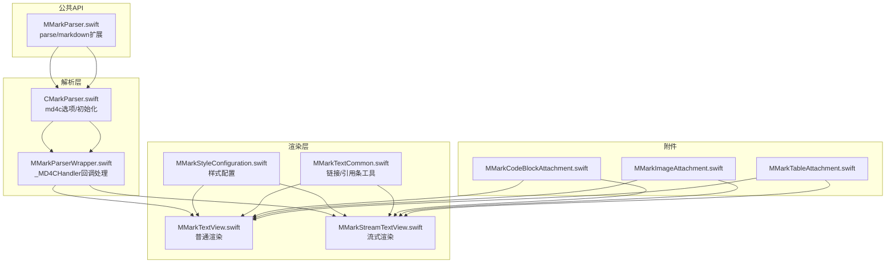
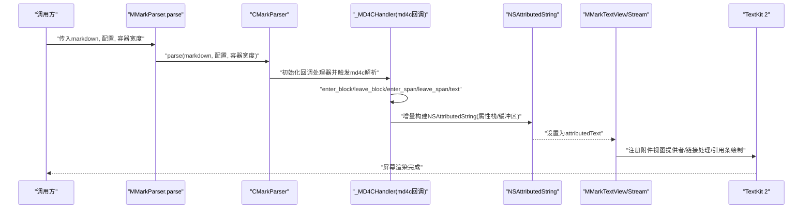
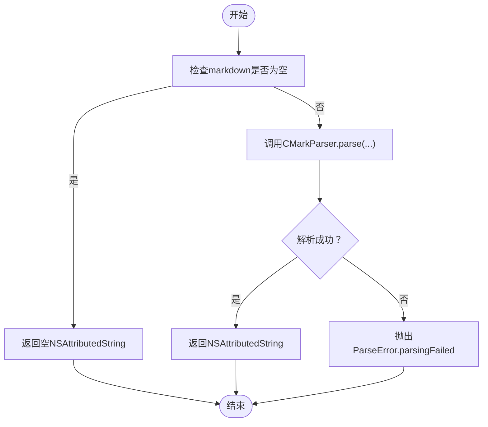
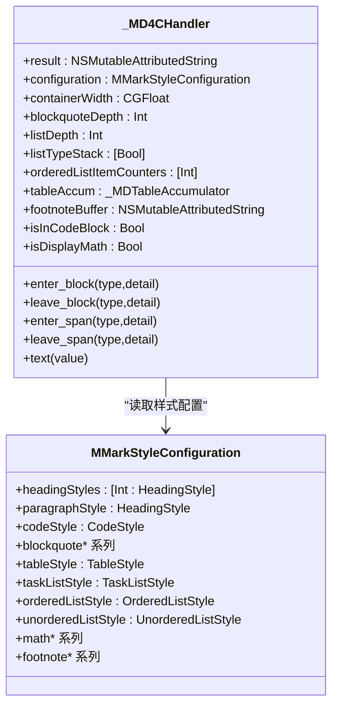
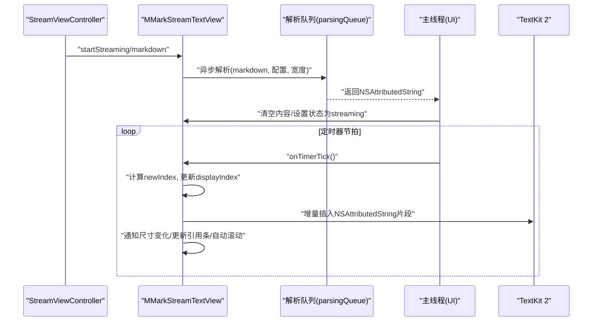
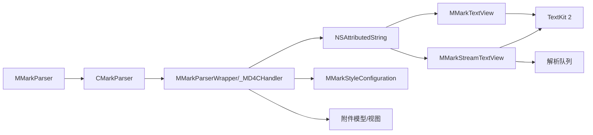

# 数据流设计

<cite>
**本文引用的文件**
- [MMarkParser.swift](file://MMarkParser/Sources/MMarkParser.swift)
- [CMarkParser.swift](file://MMarkParser/Sources/Parser/CMarkParser.swift)
- [MMarkParserWrapper.swift](file://MMarkParser/Sources/Parser/MMarkParserWrapper.swift)
- [MMarkTextView.swift](file://MMarkParser/Sources/Renderer/MMarkTextView.swift)
- [MMarkStreamTextView.swift](file://MMarkParser/Sources/Renderer/MMarkStreamTextView.swift)
- [MMarkStyleConfiguration.swift](file://MMarkParser/Sources/Renderer/MMarkStyleConfiguration.swift)
- [MMarkTextCommon.swift](file://MMarkParser/Sources/Renderer/MMarkTextCommon.swift)
- [MMarkCodeBlockAttachment.swift](file://MMarkParser/Sources/Renderer/Attachments/MMarkCodeBlockAttachment/MMarkCodeBlockAttachment.swift)
- [MMarkImageAttachment.swift](file://MMarkParser/Sources/Renderer/Attachments/MMarkImageAttachment/MMarkImageAttachment.swift)
- [MMarkTableAttachment.swift](file://MMarkParser/Sources/Renderer/Attachments/MMarkTableAttachment/MMarkTableAttachment.swift)
- [ViewController.swift](file://cocoapod_demo/cocoapod_demo/ViewController.swift)
- [StreamViewController.swift](file://cocoapod_demo/cocoapod_demo/StreamViewController.swift)
- [README.md](file://README.md)
</cite>

## 目录
1. [简介](#简介)
2. [项目结构](#项目结构)
3. [核心组件](#核心组件)
4. [架构总览](#架构总览)
5. [详细组件分析](#详细组件分析)
6. [依赖关系分析](#依赖关系分析)
7. [性能考量](#性能考量)
8. [故障排查指南](#故障排查指南)
9. [结论](#结论)
10. [附录](#附录)

## 简介
本文件面向MMarkParser的数据流设计，系统性阐述从Markdown源文本到最终屏幕渲染的完整数据转换流程。重点覆盖：
- 输入验证与错误传播
- 解析阶段（md4c SAX回调驱动）
- 富文本构建（NSAttributedString增量生成）
- 样式应用（基于MMarkStyleConfiguration）
- 附件渲染（代码块、表格、图片、水平分割线、列表标记等）
- 最终渲染（TextKit 2布局与屏幕显示）
- 增量解析、懒加载与缓存策略
- 异步处理与并发安全
- 关键时序与数据流图

## 项目结构
MMarkParser采用“公共API入口 + 解析器 + 渲染器 + 附件模型/视图”的分层组织：
- 公共API入口：对外暴露静态方法与字符串扩展
- 解析器：封装md4c选项与回调处理器
- 渲染器：普通文本视图与流式文本视图
- 附件：各类复杂元素的模型与视图提供者
- 样式配置：统一的风格参数集合
- 公共工具：链接处理、引用块侧边条绘制等

图表来源
- [MMarkParser.swift:1-42](file://MMarkParser/Sources/MMarkParser.swift#L1-L42)
- [CMarkParser.swift:1-81](file://MMarkParser/Sources/Parser/CMarkParser.swift#L1-L81)
- [MMarkParserWrapper.swift:1-120](file://MMarkParser/Sources/Parser/MMarkParserWrapper.swift#L1-L120)
- [MMarkTextView.swift:1-81](file://MMarkParser/Sources/Renderer/MMarkTextView.swift#L1-L81)
- [MMarkStreamTextView.swift:1-120](file://MMarkParser/Sources/Renderer/MMarkStreamTextView.swift#L1-L120)
- [MMarkStyleConfiguration.swift:1-120](file://MMarkParser/Sources/Renderer/MMarkStyleConfiguration.swift#L1-L120)
- [MMarkTextCommon.swift:1-120](file://MMarkParser/Sources/Renderer/MMarkTextCommon.swift#L1-L120)
- [MMarkCodeBlockAttachment.swift:1-22](file://MMarkParser/Sources/Renderer/Attachments/MMarkCodeBlockAttachment/MMarkCodeBlockAttachment.swift#L1-L22)
- [MMarkImageAttachment.swift:1-23](file://MMarkParser/Sources/Renderer/Attachments/MMarkImageAttachment/MMarkImageAttachment.swift#L1-L23)
- [MMarkTableAttachment.swift:1-23](file://MMarkParser/Sources/Renderer/Attachments/MMarkTableAttachment/MMarkTableAttachment.swift#L1-L23)

章节来源
- [README.md:108-212](file://README.md#L108-L212)

## 核心组件
- 公共API入口：提供parse与字符串扩展，负责参数校验与默认样式注入
- 解析器：配置md4c选项（GFM扩展、硬换行等），委托回调处理器增量构建富文本
- 回调处理器：维护属性栈、上下文状态、缓冲区（代码块、表格、脚注等），输出NSAttributedString
- 文本视图：普通与流式两种，负责注册附件视图提供者、链接处理、引用条绘制
- 样式配置：集中管理标题、段落、代码、链接、块引用、表格、任务列表、数学、脚注等样式
- 附件：代码块、图片、表格、水平分割线、列表标记等，均以NSTextAttachment形式参与TextKit 2布局

章节来源
- [MMarkParser.swift:11-41](file://MMarkParser/Sources/MMarkParser.swift#L11-L41)
- [CMarkParser.swift:55-66](file://MMarkParser/Sources/Parser/CMarkParser.swift#L55-L66)
- [MMarkParserWrapper.swift:16-120](file://MMarkParser/Sources/Parser/MMarkParserWrapper.swift#L16-L120)
- [MMarkTextView.swift:39-61](file://MMarkParser/Sources/Renderer/MMarkTextView.swift#L39-L61)
- [MMarkStreamTextView.swift:174-300](file://MMarkParser/Sources/Renderer/MMarkStreamTextView.swift#L174-L300)
- [MMarkStyleConfiguration.swift:10-120](file://MMarkParser/Sources/Renderer/MMarkStyleConfiguration.swift#L10-L120)
- [MMarkTextCommon.swift:39-130](file://MMarkParser/Sources/Renderer/MMarkTextCommon.swift#L39-L130)

## 架构总览
下图展示从输入到屏幕的关键数据流与控制流：

图表来源
- [MMarkParser.swift:19-26](file://MMarkParser/Sources/MMarkParser.swift#L19-L26)
- [CMarkParser.swift:55-66](file://MMarkParser/Sources/Parser/CMarkParser.swift#L55-L66)
- [MMarkParserWrapper.swift:134-644](file://MMarkParser/Sources/Parser/MMarkParserWrapper.swift#L134-L644)
- [MMarkTextView.swift:39-49](file://MMarkParser/Sources/Renderer/MMarkTextView.swift#L39-L49)
- [MMarkStreamTextView.swift:174-201](file://MMarkParser/Sources/Renderer/MMarkStreamTextView.swift#L174-L201)

## 详细组件分析

### 组件A：公共API与输入验证
- 功能职责
  - 提供静态parse与字符串扩展parseMarkdown
  - 参数校验：空字符串返回空富文本；容器宽度最小约束
  - 错误传播：解析失败抛出ParseError
- 数据流要点
  - 输入：markdown字符串、样式配置、容器宽度
  - 返回：NSAttributedString；异常：ParseError
  - 并发：@unchecked Sendable，跨线程安全
- 错误处理
  - invalidInput：输入为空
  - parsingFailed：md4c回调未产出结果
  - styleConversionFailed：样式转换失败（预留）

图表来源
- [MMarkParser.swift:19-26](file://MMarkParser/Sources/MMarkParser.swift#L19-L26)
- [CMarkParser.swift:55-66](file://MMarkParser/Sources/Parser/CMarkParser.swift#L55-L66)

章节来源
- [MMarkParser.swift:11-41](file://MMarkParser/Sources/MMarkParser.swift#L11-L41)
- [CMarkParser.swift:8-12](file://MMarkParser/Sources/Parser/CMarkParser.swift#L8-L12)

### 组件B：解析器与md4c选项
- 功能职责
  - 统一配置md4c解析选项（GFM扩展、硬换行、LaTeX数学等）
  - 通过CMarkParserWrapper桥接到C层回调
- 选项枚举
  - table/strikethrough/taskLists/autolinks/latexMath/footnotes/hardSoftBreaks/gfm组合
- 数据流要点
  - 输入：markdown、配置、容器宽度
  - 输出：NSAttributedString
  - 错误：解析失败时抛错

章节来源
- [CMarkParser.swift:14-47](file://MMarkParser/Sources/Parser/CMarkParser.swift#L14-L47)
- [CMarkParser.swift:51-53](file://MMarkParser/Sources/Parser/CMarkParser.swift#L51-L53)
- [CMarkParser.swift:55-66](file://MMarkParser/Sources/Parser/CMarkParser.swift#L55-L66)

### 组件C：回调处理器（_MD4CHandler）与富文本构建
- 功能职责
  - SAX回调驱动的增量构建：enter_block/leave_block/enter_span/leave_span/text
  - 属性栈管理：pushAttrs/popAttrs确保嵌套结构正确继承样式
  - 上下文状态：块引用深度、列表嵌套、脚注收集、数学模式、图像span等
  - 缓冲区：代码块语言与内容、表格单元累积、脚注缓冲
- 样式应用
  - 基于MMarkStyleConfiguration动态设置字体、颜色、段落样式、缩进
  - 引用块侧边条、列表标记、代码块/表格/图片/水平分割线等附件
- 数据流要点
  - 输入：md4c回调事件
  - 中间：属性栈、缓冲区、容器宽度调整
  - 输出：NSAttributedString增量追加

图表来源
- [MMarkParserWrapper.swift:18-120](file://MMarkParser/Sources/Parser/MMarkParserWrapper.swift#L18-L120)
- [MMarkStyleConfiguration.swift:10-120](file://MMarkParser/Sources/Renderer/MMarkStyleConfiguration.swift#L10-L120)

章节来源
- [MMarkParserWrapper.swift:134-644](file://MMarkParser/Sources/Parser/MMarkParserWrapper.swift#L134-L644)

### 组件D：普通文本视图（MMarkTextView）
- 功能职责
  - 接收NSAttributedString并渲染
  - 注册附件视图提供者，启用TextKit 2附件机制
  - 链接处理：支持外部Web链接与内部脚注/锚点跳转
  - 引用块侧边条绘制：基于TextKit 2布局片段计算位置
- 数据流要点
  - 输入：NSAttributedString
  - 处理：注册附件、链接回调、引用条绘制
  - 输出：屏幕显示

章节来源
- [MMarkTextView.swift:39-81](file://MMarkParser/Sources/Renderer/MMarkTextView.swift#L39-L81)
- [MMarkTextCommon.swift:39-130](file://MMarkParser/Sources/Renderer/MMarkTextCommon.swift#L39-L130)

### 组件E：流式文本视图（MMarkStreamTextView）
- 功能职责
  - 增量渲染：定时器节拍推进显示进度，避免全量重布局
  - 状态机：idle/streaming/paused/stopped
  - 解析队列：后台解析，主线程更新UI
  - 自动滚动：根据阈值判断是否跟随底部
- 数据流要点
  - 输入：markdown字符串（可增量追加）
  - 处理：解析队列生成NSAttributedString，定时器驱动增量插入
  - 输出：逐步可见的屏幕渲染

图表来源
- [MMarkStreamTextView.swift:174-300](file://MMarkParser/Sources/Renderer/MMarkStreamTextView.swift#L174-L300)
- [MMarkStreamTextView.swift:304-351](file://MMarkParser/Sources/Renderer/MMarkStreamTextView.swift#L304-L351)

章节来源
- [MMarkStreamTextView.swift:174-300](file://MMarkParser/Sources/Renderer/MMarkStreamTextView.swift#L174-L300)
- [StreamViewController.swift:208-245](file://cocoapod_demo/cocoapod_demo/StreamViewController.swift#L208-L245)

### 组件F：附件渲染（代码块/图片/表格）
- 代码块附件
  - 模型：语言、代码、尺寸、配置
  - 视图：根据lineFragment宽度约束，保证右边界不被裁剪
- 图片附件
  - 模型：URL、alt、尺寸、占位色
  - 视图：按宽度等比缩放，确保块级显示避免TextKit 2定位问题
- 表格附件
  - 模型：表头、数据行、对齐、尺寸、配置
  - 视图：根据容器宽度与列宽计算，支持头部/主体区分

章节来源
- [MMarkCodeBlockAttachment.swift:15-21](file://MMarkParser/Sources/Renderer/Attachments/MMarkCodeBlockAttachment/MMarkCodeBlockAttachment.swift#L15-L21)
- [MMarkImageAttachment.swift:17-22](file://MMarkParser/Sources/Renderer/Attachments/MMarkImageAttachment/MMarkImageAttachment.swift#L17-L22)
- [MMarkTableAttachment.swift:18-22](file://MMarkParser/Sources/Renderer/Attachments/MMarkTableAttachment/MMarkTableAttachment.swift#L18-L22)

### 组件G：样式配置（MMarkStyleConfiguration）
- 功能职责
  - 集中定义标题、段落、代码、链接、块引用、表格、任务列表、数学、脚注等样式
  - 提供默认GFM样式与自定义能力
- 数据流要点
  - 输入：各元素的字体、颜色、间距、圆角、内边距等
  - 输出：回调处理器与附件视图使用的样式参数

章节来源
- [MMarkStyleConfiguration.swift:189-339](file://MMarkParser/Sources/Renderer/MMarkStyleConfiguration.swift#L189-L339)

## 依赖关系分析
- 组件耦合
  - 公共API依赖解析器；解析器依赖回调处理器；渲染器依赖样式配置与附件
  - 回调处理器与渲染器通过NSAttributedString与NSTextAttachment解耦
- 外部依赖
  - md4c：SAX回调解析引擎
  - iosMath：LaTeX数学渲染
  - Kingfisher：远程图片加载（通过图片附件模型）
- 并发与线程
  - 解析在后台队列执行，UI更新在主线程；定时器与状态访问通过主线程调度避免竞态

图表来源
- [MMarkParser.swift:19-26](file://MMarkParser/Sources/MMarkParser.swift#L19-L26)
- [CMarkParser.swift:55-66](file://MMarkParser/Sources/Parser/CMarkParser.swift#L55-L66)
- [MMarkParserWrapper.swift:134-644](file://MMarkParser/Sources/Parser/MMarkParserWrapper.swift#L134-L644)
- [MMarkTextView.swift:39-49](file://MMarkParser/Sources/Renderer/MMarkTextView.swift#L39-L49)
- [MMarkStreamTextView.swift:174-201](file://MMarkParser/Sources/Renderer/MMarkStreamTextView.swift#L174-L201)

## 性能考量
- 增量解析与懒加载
  - md4c SAX回调驱动增量构建NSAttributedString，避免一次性AST树
  - 附件采用NSTextAttachment + 视图提供者，按需创建视图，减少内存占用
- 流式渲染
  - 定时器节拍推进显示，避免全量TextKit 2布局
  - 长文档动态增大chunk大小，维持视觉流畅
- 容器宽度与测量
  - effectiveWidth最小约束，防止深嵌套导致负宽度
  - 附件视图根据lineFragment宽度约束，避免裁剪
- 并发安全
  - 解析队列与主线程UI更新分离
  - 定时器tick在主线程访问共享状态，避免竞态
- 缓存策略
  - 代码块语法高亮与LaTeX数学渲染依赖外部库缓存（iosMath/Kingfisher）
  - 附件视图提供者注册一次，复用NSTextAttachment生命周期

章节来源
- [MMarkParserWrapper.swift:92](file://MMarkParser/Sources/Parser/MMarkParserWrapper.swift#L92)
- [MMarkStreamTextView.swift:340-351](file://MMarkParser/Sources/Renderer/MMarkStreamTextView.swift#L340-L351)
- [MMarkCodeBlockAttachment.swift:18-20](file://MMarkParser/Sources/Renderer/Attachments/MMarkCodeBlockAttachment/MMarkCodeBlockAttachment.swift#L18-L20)
- [MMarkImageAttachment.swift:18-21](file://MMarkParser/Sources/Renderer/Attachments/MMarkImageAttachment/MMarkImageAttachment.swift#L18-L21)
- [MMarkTableAttachment.swift:19-22](file://MMarkParser/Sources/Renderer/Attachments/MMarkTableAttachment/MMarkTableAttachment.swift#L19-L22)

## 故障排查指南
- 常见错误与定位
  - 解析失败：检查markdown是否为空；确认md4c回调是否正常产出结果
  - 样式异常：核对MMarkStyleConfiguration配置项是否正确设置
  - 链接无法打开：检查外部代理回调返回值；确认URL编码与锚点解析
  - 引用条不显示：确认contentSize变化触发与TextKit 2布局片段可用性
- 调试建议
  - 在回调处理器中打印关键状态（如blockquoteDepth、listDepth、tableAccum）
  - 使用流式视图delegate观察状态变化与尺寸通知
  - 在主线程安全路径中访问共享状态（displayIndex/fullAttrString）

章节来源
- [CMarkParser.swift:8-12](file://MMarkParser/Sources/Parser/CMarkParser.swift#L8-L12)
- [MMarkTextCommon.swift:48-130](file://MMarkParser/Sources/Renderer/MMarkTextCommon.swift#L48-L130)
- [MMarkStreamTextView.swift:321-351](file://MMarkParser/Sources/Renderer/MMarkStreamTextView.swift#L321-L351)

## 结论
MMarkParser通过md4c SAX回调驱动的增量解析与TextKit 2附件机制，实现了从Markdown到屏幕的高效数据流。其设计在以下方面表现突出：
- 明确的分层与职责划分，便于扩展与维护
- 增量构建与懒加载降低内存与CPU压力
- 流式渲染提升长文档体验
- 统一样式配置与丰富的GFM支持
- 主线程安全与后台解析的并发模型

## 附录
- 示例入口
  - 普通渲染：ViewController中调用MMarkTextView.setMarkdown
  - 流式渲染：StreamViewController中控制start/pause/resume/stop/append/renderComplete

章节来源
- [ViewController.swift:38-43](file://cocoapod_demo/cocoapod_demo/ViewController.swift#L38-L43)
- [StreamViewController.swift:208-245](file://cocoapod_demo/cocoapod_demo/StreamViewController.swift#L208-L245)