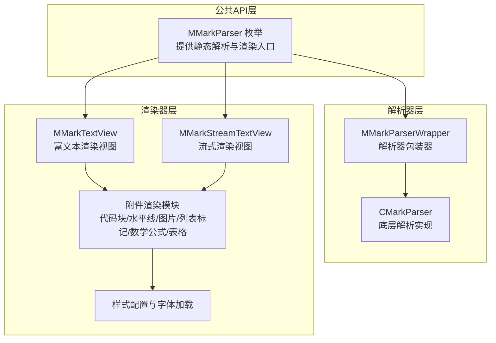
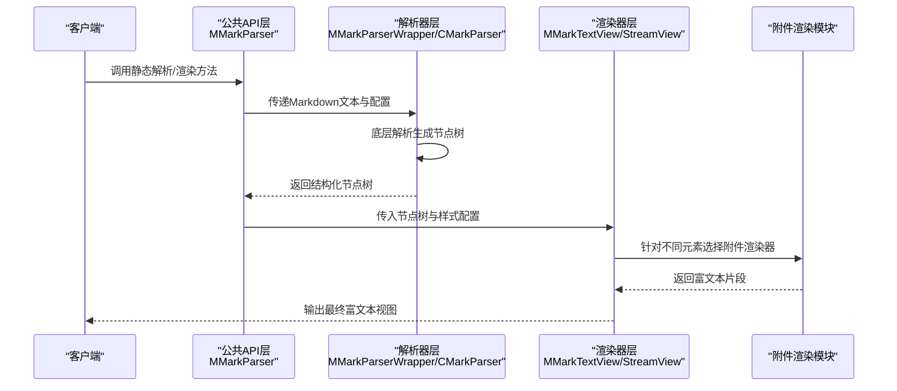
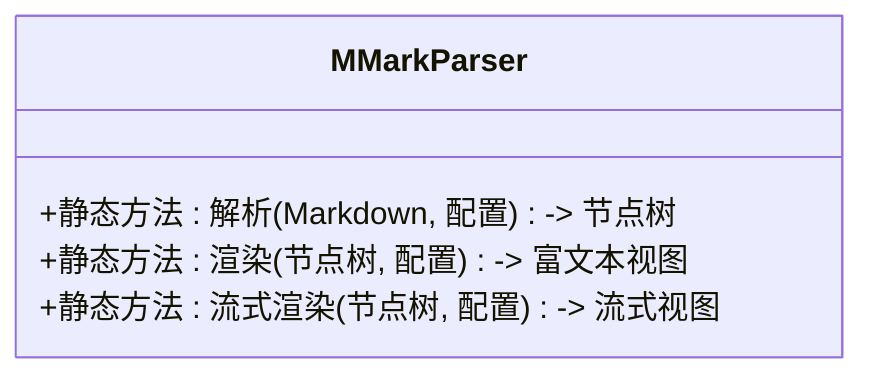
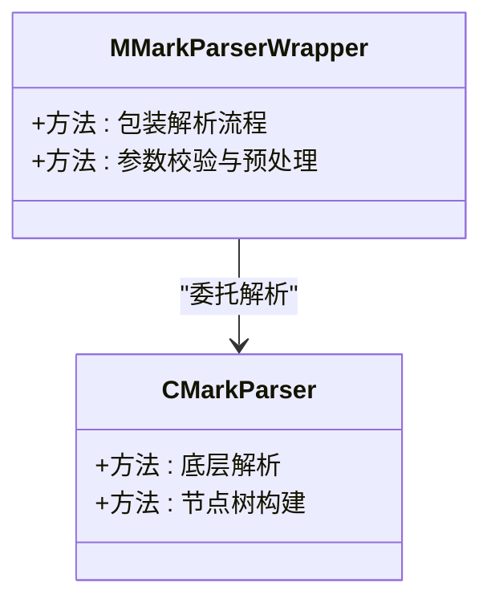
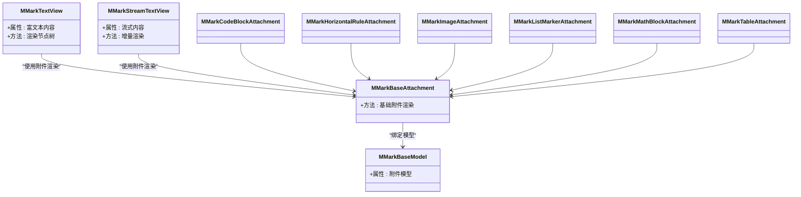
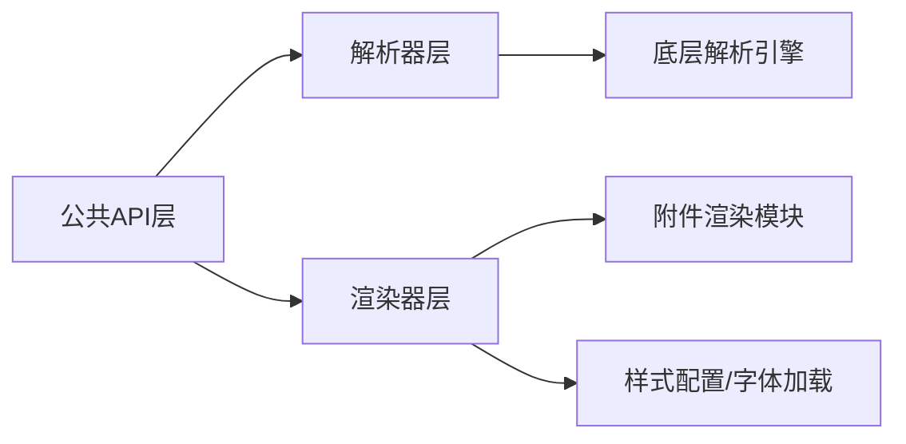

# 整体架构概览

<cite>
**本文档引用的文件**
- [MMarkParser.swift](file://MMarkParser/Sources/MMarkParser.swift)
- [MMarkParserWrapper.swift](file://MMarkParser/Sources/Parser/MMarkParserWrapper.swift)
- [CMarkParser.swift](file://MMarkParser/Sources/Parser/CMarkParser.swift)
- [MMarkTextView.swift](file://MMarkParser/Sources/Renderer/MMarkTextView.swift)
- [MMarkStreamTextView.swift](file://MMarkParser/Sources/Renderer/MMarkStreamTextView.swift)
- [MMarkBaseAttachment.swift](file://MMarkParser/Sources/Renderer/Attachments/MMarkBaseAttachment/MMarkBaseAttachment.swift)
- [MMarkBaseModel.swift](file://MMarkParser/Sources/Renderer/Attachments/MMarkBaseAttachment/MMarkBaseModel.swift)
- [MMarkCodeBlockAttachment.swift](file://MMarkParser/Sources/Renderer/Attachments/MMarkCodeBlockAttachment/MMarkCodeBlockAttachment.swift)
- [MMarkCodeBlockModel.swift](file://MMarkParser/Sources/Renderer/Attachments/MMarkCodeBlockAttachment/MMarkCodeBlockModel.swift)
- [MMarkCodeBlockView.swift](file://MMarkParser/Sources/Renderer/Attachments/MMarkCodeBlockAttachment/MMarkCodeBlockView.swift)
- [MMarkCodeBlockViewProvider.swift](file://MMarkParser/Sources/Renderer/Attachments/MMarkCodeBlockAttachment/MMarkCodeBlockViewProvider.swift)
- [MMarkHorizontalRuleAttachment.swift](file://MMarkParser/Sources/Renderer/Attachments/MMarkHorizontalRuleAttachment/MMarkHorizontalRuleAttachment.swift)
- [MMarkHorizontalRuleModel.swift](file://MMarkParser/Sources/Renderer/Attachments/MMarkHorizontalRuleAttachment/MMarkHorizontalRuleModel.swift)
- [MMarkHorizontalRuleView.swift](file://MMarkParser/Sources/Renderer/Attachments/MMarkHorizontalRuleAttachment/MMarkHorizontalRuleView.swift)
- [MMarkHorizontalRuleViewProvider.swift](file://MMarkParser/Sources/Renderer/Attachments/MMarkHorizontalRuleAttachment/MMarkHorizontalRuleViewProvider.swift)
- [MMarkImageAttachment.swift](file://MMarkParser/Sources/Renderer/Attachments/MMarkImageAttachment/MMarkImageAttachment.swift)
- [MMarkImageModel.swift](file://MMarkParser/Sources/Renderer/Attachments/MMarkImageAttachment/MMarkImageModel.swift)
- [MMarkImageView.swift](file://MMarkParser/Sources/Renderer/Attachments/MMarkImageAttachment/MMarkImageView.swift)
- [MMarkImageViewProvider.swift](file://MMarkParser/Sources/Renderer/Attachments/MMarkImageAttachment/MMarkImageViewProvider.swift)
- [MMarkListMarkerAttachment.swift](file://MMarkParser/Sources/Renderer/Attachments/MMarkListMarkerAttachment/MMarkListMarkerAttachment.swift)
- [MMarkListMarkerModel.swift](file://MMarkParser/Sources/Renderer/Attachments/MMarkListMarkerAttachment/MMarkListMarkerModel.swift)
- [MMarkListMarkerView.swift](file://MMarkParser/Sources/Renderer/Attachments/MMarkListMarkerAttachment/MMarkListMarkerView.swift)
- [MMarkListMarkerViewProvider.swift](file://MMarkParser/Sources/Renderer/Attachments/MMarkListMarkerAttachment/MMarkListMarkerViewProvider.swift)
- [MMarkMathBlockAttachment.swift](file://MMarkParser/Sources/Renderer/Attachments/MMarkMathBlockAttachment/MMarkMathBlockAttachment.swift)
- [MMarkMathBlockModel.swift](file://MMarkParser/Sources/Renderer/Attachments/MMarkMathBlockAttachment/MMarkMathBlockModel.swift)
- [MMarkMathBlockView.swift](file://MMarkParser/Sources/Renderer/Attachments/MMarkMathBlockAttachment/MMarkMathBlockView.swift)
- [MMarkMathBlockViewProvider.swift](file://MMarkParser/Sources/Renderer/Attachments/MMarkMathBlockAttachment/MMarkMathBlockViewProvider.swift)
- [MMarkTableAttachment.swift](file://MMarkParser/Sources/Renderer/Attachments/MMarkTableAttachment/MMarkTableAttachment.swift)
- [MMarkTableModel.swift](file://MMarkParser/Sources/Renderer/Attachments/MMarkTableAttachment/MMarkTableModel.swift)
- [MMarkTableView.swift](file://MMarkParser/Sources/Renderer/Attachments/MMarkTableAttachment/MMarkTableView.swift)
- [MMarkTableViewProvider.swift](file://MMarkParser/Sources/Renderer/Attachments/MMarkTableAttachment/MMarkTableViewProvider.swift)
- [MMarkFontLoader.swift](file://MMarkParser/Sources/Renderer/MMarkFontLoader.swift)
- [MMarkStyleConfiguration.swift](file://MMarkParser/Sources/Renderer/MMarkStyleConfiguration.swift)
- [MMarkTextCommon.swift](file://MMarkParser/Sources/Renderer/MMarkTextCommon.swift)
- [README.md](file://README.md)
</cite>

## 目录
1. [引言](#引言)
2. [项目结构](#项目结构)
3. [核心组件](#核心组件)
4. [架构总览](#架构总览)
5. [详细组件分析](#详细组件分析)
6. [依赖关系分析](#依赖关系分析)
7. [性能考量](#性能考量)
8. [故障排查指南](#故障排查指南)
9. [结论](#结论)
10. [附录](#附录)

## 引言
本文件面向MMarkParser的整体架构，系统性阐述其分层设计理念与职责划分，重点说明公共API层（MMarkParser枚举）如何提供简洁的静态接口，解析器层如何封装底层解析引擎的复杂性，渲染器层如何基于iOS 15+ TextKit 2实现高性能渲染。同时，文档总结了系统的核心设计目标：高性能、可扩展性、易用性和GFM兼容性，并通过架构图与流程图展示从输入到输出的完整数据流。

## 项目结构
MMarkParser采用按功能域分层的组织方式，主要分为三层：
- 公共API层：对外暴露统一的静态接口，屏蔽内部实现细节
- 解析器层：封装底层解析引擎（如md4c），负责将Markdown文本转换为结构化节点树
- 渲染器层：基于iOS 15+ TextKit 2，将节点树渲染为高性能富文本视图

图表来源
- [MMarkParser.swift](file://MMarkParser/Sources/MMarkParser.swift)
- [MMarkParserWrapper.swift](file://MMarkParser/Sources/Parser/MMarkParserWrapper.swift)
- [CMarkParser.swift](file://MMarkParser/Sources/Parser/CMarkParser.swift)
- [MMarkTextView.swift](file://MMarkParser/Sources/Renderer/MMarkTextView.swift)
- [MMarkStreamTextView.swift](file://MMarkParser/Sources/Renderer/MMarkStreamTextView.swift)

章节来源
- [MMarkParser.swift](file://MMarkParser/Sources/MMarkParser.swift)
- [README.md](file://README.md)

## 核心组件
- 公共API层（MMarkParser枚举）
  - 提供统一的静态方法，隐藏解析与渲染的具体实现
  - 对外暴露简洁的调用接口，便于集成与使用
- 解析器层
  - MMarkParserWrapper：解析器包装器，协调底层解析逻辑
  - CMarkParser：底层解析实现，负责将Markdown文本解析为节点树
- 渲染器层
  - MMarkTextView：富文本渲染视图，承载最终渲染结果
  - MMarkStreamTextView：流式渲染视图，支持增量渲染
  - 附件渲染模块：针对代码块、水平线、图片、列表标记、数学公式、表格等元素的专用渲染器
  - 样式配置与字体加载：统一管理主题、颜色、字体与样式

章节来源
- [MMarkParser.swift](file://MMarkParser/Sources/MMarkParser.swift)
- [MMarkParserWrapper.swift](file://MMarkParser/Sources/Parser/MMarkParserWrapper.swift)
- [CMarkParser.swift](file://MMarkParser/Sources/Parser/CMarkParser.swift)
- [MMarkTextView.swift](file://MMarkParser/Sources/Renderer/MMarkTextView.swift)
- [MMarkStreamTextView.swift](file://MMarkParser/Sources/Renderer/MMarkStreamTextView.swift)

## 架构总览
下图展示了从输入Markdown到输出富文本的完整数据流，体现三层之间的协作关系与职责边界：

图表来源
- [MMarkParser.swift](file://MMarkParser/Sources/MMarkParser.swift)
- [MMarkParserWrapper.swift](file://MMarkParser/Sources/Parser/MMarkParserWrapper.swift)
- [CMarkParser.swift](file://MMarkParser/Sources/Parser/CMarkParser.swift)
- [MMarkTextView.swift](file://MMarkParser/Sources/Renderer/MMarkTextView.swift)
- [MMarkStreamTextView.swift](file://MMarkParser/Sources/Renderer/MMarkStreamTextView.swift)

## 详细组件分析

### 公共API层（MMarkParser枚举）
- 设计要点
  - 以枚举形式提供静态方法，避免实例化开销
  - 将解析与渲染流程封装在内部，仅暴露必要参数
  - 统一错误处理与返回值格式，提升易用性
- 关键职责
  - 接收用户输入（Markdown文本、样式配置等）
  - 协调解析器与渲染器完成端到端处理
  - 返回最终的富文本视图或中间节点树（按需）

图表来源
- [MMarkParser.swift](file://MMarkParser/Sources/MMarkParser.swift)

章节来源
- [MMarkParser.swift](file://MMarkParser/Sources/MMarkParser.swift)

### 解析器层（MMarkParserWrapper 与 CMarkParser）
- 设计要点
  - MMarkParserWrapper作为门面，统一调度解析流程
  - CMarkParser负责底层解析，确保与md4c等引擎的兼容性与稳定性
- 关键职责
  - 输入验证与预处理
  - 调用底层解析器生成节点树
  - 错误捕获与异常转换
- GFM兼容性
  - 通过底层解析器实现GitHub Flavored Markdown特性
  - 支持表格、任务列表、自动链接等扩展语法

图表来源
- [MMarkParserWrapper.swift](file://MMarkParser/Sources/Parser/MMarkParserWrapper.swift)
- [CMarkParser.swift](file://MMarkParser/Sources/Parser/CMarkParser.swift)

章节来源
- [MMarkParserWrapper.swift](file://MMarkParser/Sources/Parser/MMarkParserWrapper.swift)
- [CMarkParser.swift](file://MMarkParser/Sources/Parser/CMarkParser.swift)

### 渲染器层（MMarkTextView、MMarkStreamTextView 与附件渲染模块）
- 设计要点
  - 基于iOS 15+ TextKit 2，充分利用富文本框架的高性能渲染能力
  - 通过附件（NSTextAttachment）机制实现复杂元素的渲染
  - 分离通用逻辑与特定元素渲染，提升可扩展性
- 关键职责
  - 将节点树映射为富文本片段
  - 选择合适的附件渲染器处理特殊元素
  - 应用样式配置（颜色、字体、主题）
- 性能优势
  - TextKit 2原生渲染，减少自绘成本
  - 流式渲染支持大文档的增量显示
  - 附件缓存与复用降低重复计算

图表来源
- [MMarkTextView.swift](file://MMarkParser/Sources/Renderer/MMarkTextView.swift)
- [MMarkStreamTextView.swift](file://MMarkParser/Sources/Renderer/MMarkStreamTextView.swift)
- [MMarkBaseAttachment.swift](file://MMarkParser/Sources/Renderer/Attachments/MMarkBaseAttachment/MMarkBaseAttachment.swift)
- [MMarkBaseModel.swift](file://MMarkParser/Sources/Renderer/Attachments/MMarkBaseAttachment/MMarkBaseModel.swift)
- [MMarkCodeBlockAttachment.swift](file://MMarkParser/Sources/Renderer/Attachments/MMarkCodeBlockAttachment/MMarkCodeBlockAttachment.swift)
- [MMarkHorizontalRuleAttachment.swift](file://MMarkParser/Sources/Renderer/Attachments/MMarkHorizontalRuleAttachment/MMarkHorizontalRuleAttachment.swift)
- [MMarkImageAttachment.swift](file://MMarkParser/Sources/Renderer/Attachments/MMarkImageAttachment/MMarkImageAttachment.swift)
- [MMarkListMarkerAttachment.swift](file://MMarkParser/Sources/Renderer/Attachments/MMarkListMarkerAttachment/MMarkListMarkerAttachment.swift)
- [MMarkMathBlockAttachment.swift](file://MMarkParser/Sources/Renderer/Attachments/MMarkMathBlockAttachment/MMarkMathBlockAttachment.swift)
- [MMarkTableAttachment.swift](file://MMarkParser/Sources/Renderer/Attachments/MMarkTableAttachment/MMarkTableAttachment.swift)

章节来源
- [MMarkTextView.swift](file://MMarkParser/Sources/Renderer/MMarkTextView.swift)
- [MMarkStreamTextView.swift](file://MMarkParser/Sources/Renderer/MMarkStreamTextView.swift)
- [MMarkBaseAttachment.swift](file://MMarkParser/Sources/Renderer/Attachments/MMarkBaseAttachment/MMarkBaseAttachment.swift)
- [MMarkBaseModel.swift](file://MMarkParser/Sources/Renderer/Attachments/MMarkBaseAttachment/MMarkBaseModel.swift)
- [MMarkCodeBlockAttachment.swift](file://MMarkParser/Sources/Renderer/Attachments/MMarkCodeBlockAttachment/MMarkCodeBlockAttachment.swift)
- [MMarkHorizontalRuleAttachment.swift](file://MMarkParser/Sources/Renderer/Attachments/MMarkHorizontalRuleAttachment/MMarkHorizontalRuleAttachment.swift)
- [MMarkImageAttachment.swift](file://MMarkParser/Sources/Renderer/Attachments/MMarkImageAttachment/MMarkImageAttachment.swift)
- [MMarkListMarkerAttachment.swift](file://MMarkParser/Sources/Renderer/Attachments/MMarkListMarkerAttachment/MMarkListMarkerAttachment.swift)
- [MMarkMathBlockAttachment.swift](file://MMarkParser/Sources/Renderer/Attachments/MMarkMathBlockAttachment/MMarkMathBlockAttachment.swift)
- [MMarkTableAttachment.swift](file://MMarkParser/Sources/Renderer/Attachments/MMarkTableAttachment/MMarkTableAttachment.swift)

### 样式配置与字体加载
- 设计要点
  - MMarkStyleConfiguration集中管理主题、颜色与样式规则
  - MMarkFontLoader负责字体资源的加载与缓存
  - 与附件渲染模块解耦，通过统一接口注入样式
- 关键职责
  - 主题切换与动态更新
  - 字体资源的异步加载与缓存策略
  - 样式规则的合并与优先级处理

章节来源
- [MMarkStyleConfiguration.swift](file://MMarkParser/Sources/Renderer/MMarkStyleConfiguration.swift)
- [MMarkFontLoader.swift](file://MMarkParser/Sources/Renderer/MMarkFontLoader.swift)
- [MMarkTextCommon.swift](file://MMarkParser/Sources/Renderer/MMarkTextCommon.swift)

## 依赖关系分析
- 层内依赖
  - 渲染器层内部通过附件模块实现高内聚、低耦合的渲染体系
  - 样式配置与字体加载独立于渲染器，便于替换与扩展
- 层间依赖
  - 公共API层依赖解析器层与渲染器层
  - 解析器层依赖底层解析实现
  - 渲染器层依赖附件模块与样式配置
- 外部依赖
  - iOS 15+ TextKit 2作为渲染后端
  - 底层解析引擎（如md4c）用于节点树构建

图表来源
- [MMarkParser.swift](file://MMarkParser/Sources/MMarkParser.swift)
- [MMarkParserWrapper.swift](file://MMarkParser/Sources/Parser/MMarkParserWrapper.swift)
- [CMarkParser.swift](file://MMarkParser/Sources/Parser/CMarkParser.swift)
- [MMarkTextView.swift](file://MMarkParser/Sources/Renderer/MMarkTextView.swift)
- [MMarkStreamTextView.swift](file://MMarkParser/Sources/Renderer/MMarkStreamTextView.swift)
- [MMarkStyleConfiguration.swift](file://MMarkParser/Sources/Renderer/MMarkStyleConfiguration.swift)
- [MMarkFontLoader.swift](file://MMarkParser/Sources/Renderer/MMarkFontLoader.swift)

章节来源
- [MMarkParser.swift](file://MMarkParser/Sources/MMarkParser.swift)
- [MMarkParserWrapper.swift](file://MMarkParser/Sources/Parser/MMarkParserWrapper.swift)
- [CMarkParser.swift](file://MMarkParser/Sources/Parser/CMarkParser.swift)
- [MMarkTextView.swift](file://MMarkParser/Sources/Renderer/MMarkTextView.swift)
- [MMarkStreamTextView.swift](file://MMarkParser/Sources/Renderer/MMarkStreamTextView.swift)

## 性能考量
- 高性能
  - 基于iOS 15+ TextKit 2原生渲染，避免自绘开销
  - 附件缓存与复用，减少重复布局与绘制
- 可扩展性
  - 附件模块采用统一基类与模型，新增元素只需扩展对应附件
  - 样式配置与字体加载模块可独立演进
- 易用性
  - 公共API层提供静态接口，简化集成流程
  - 渲染器支持同步与流式两种模式，满足不同场景需求
- GFM兼容性
  - 通过底层解析器实现表格、任务列表、数学公式等扩展语法

## 故障排查指南
- 常见问题
  - 解析失败：检查输入文本格式与编码；确认底层解析器配置
  - 渲染异常：检查附件渲染器是否正确绑定模型；核对样式配置
  - 性能问题：评估附件数量与复杂度；考虑启用流式渲染
- 定位建议
  - 在公共API层设置日志埋点，追踪解析与渲染阶段耗时
  - 使用单元测试覆盖关键渲染路径，定位附件渲染问题
  - 利用调试工具观察TextKit 2渲染树与附件布局

章节来源
- [MMarkParser.swift](file://MMarkParser/Sources/MMarkParser.swift)
- [MMarkTextView.swift](file://MMarkParser/Sources/Renderer/MMarkTextView.swift)
- [MMarkStreamTextView.swift](file://MMarkParser/Sources/Renderer/MMarkStreamTextView.swift)

## 结论
MMarkParser通过清晰的分层架构实现了高性能、可扩展、易用且具备GFM兼容性的Markdown渲染方案。公共API层提供简洁接口，解析器层封装底层复杂性，渲染器层依托iOS 15+ TextKit 2实现高效富文本渲染。附件模块与样式配置进一步增强了系统的可扩展性与一致性，适合在生产环境中稳定使用。

## 附录
- iOS 15+ TextKit 2技术栈选择原因与优势
  - 原生富文本渲染：性能优异，内存占用合理
  - 丰富的排版能力：支持复杂布局与附件嵌入
  - 系统级优化：与系统UI深度集成，滚动与交互体验佳
  - 可访问性支持：内置无障碍能力，降低二次开发成本