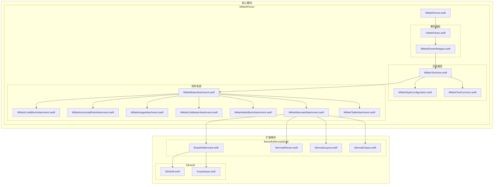
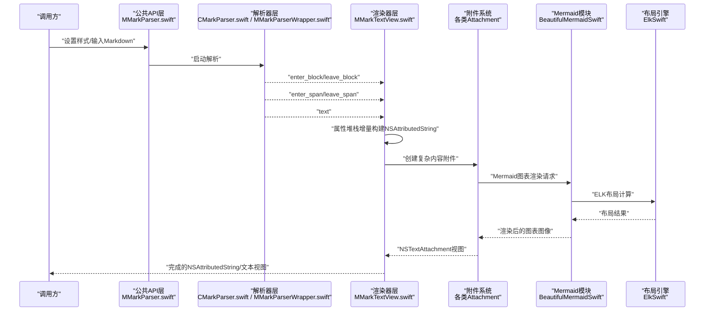
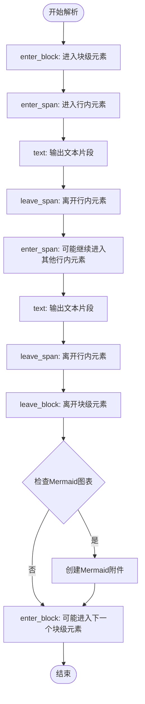
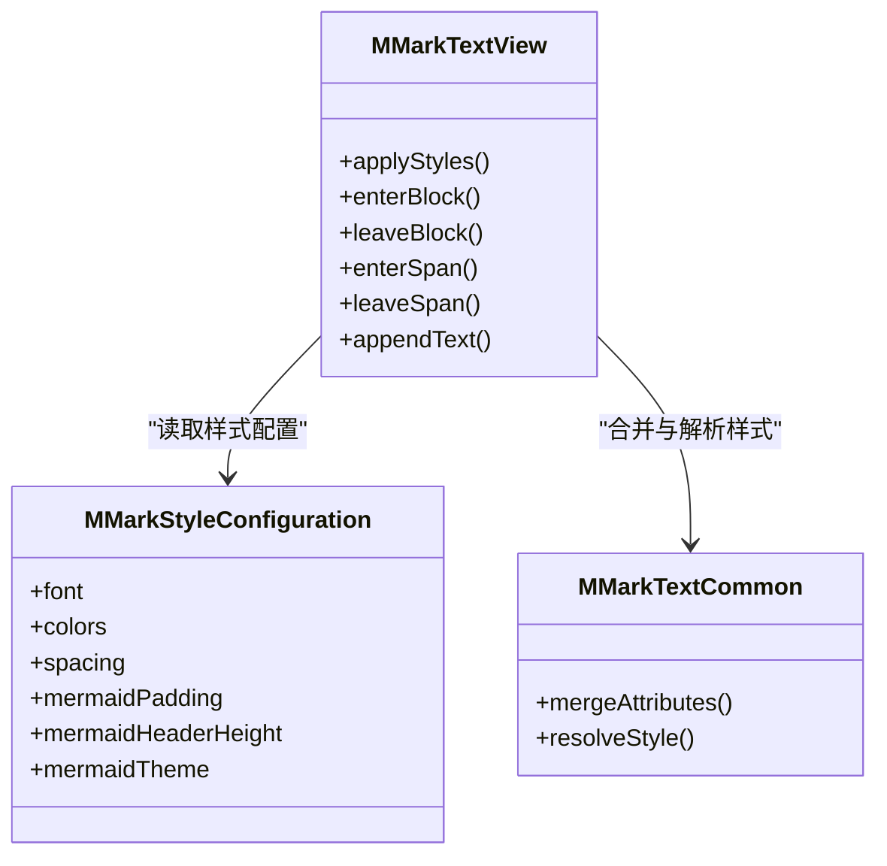
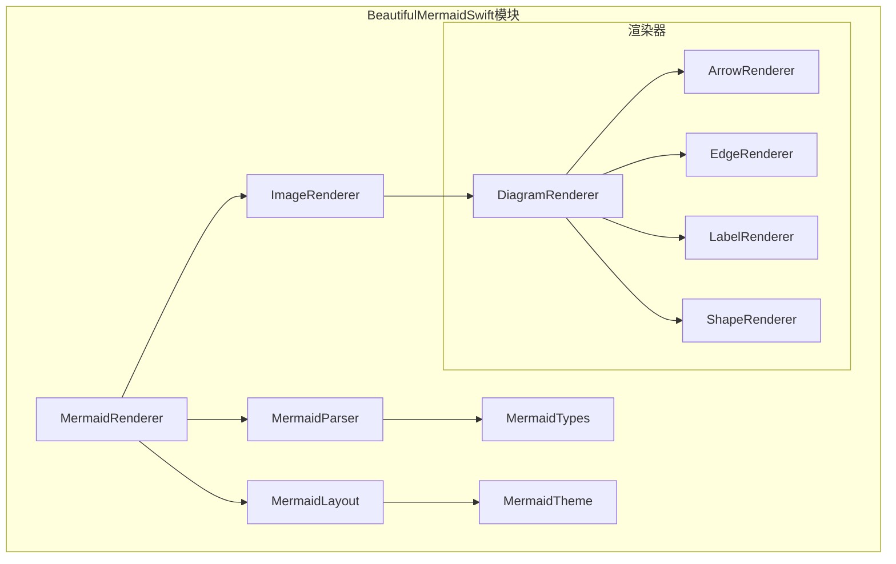
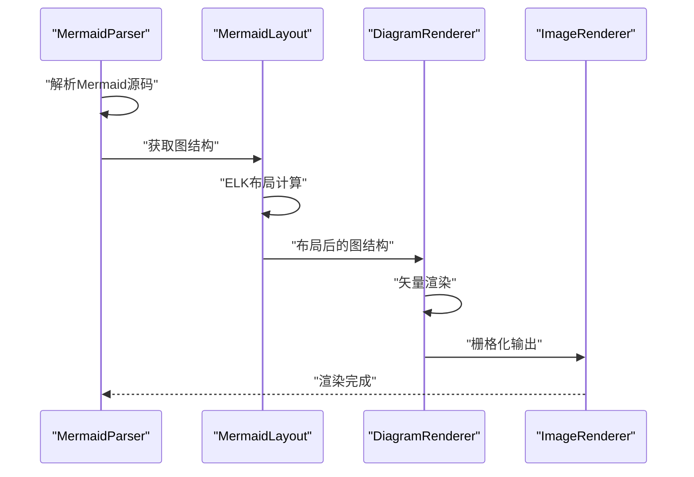
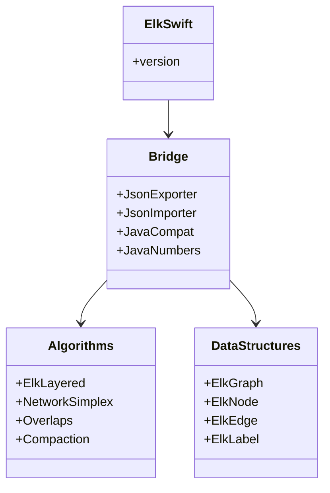
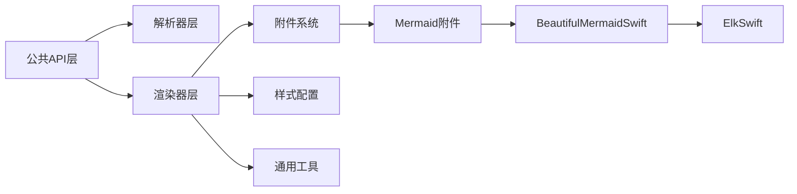

# 核心架构设计

<cite>
**本文引用的文件**
- [MMarkParser.swift](file://MMarkParser/MMarkParser/MMarkParser.swift)
- [CMarkParser.swift](file://MMarkParser/MMarkParser/Parser/CMarkParser.swift)
- [MMarkParserWrapper.swift](file://MMarkParser/MMarkParser/Parser/MMarkParserWrapper.swift)
- [MMarkTextView.swift](file://MMarkParser/MMarkParser/Renderer/MMarkTextView.swift)
- [MMarkStyleConfiguration.swift](file://MMarkParser/MMarkParser/Renderer/MMarkStyleConfiguration.swift)
- [MMarkTextCommon.swift](file://MMarkParser/MMarkParser/Renderer/MMarkTextCommon.swift)
- [MMarkBaseAttachment.swift](file://MMarkParser/MMarkParser/Renderer/Attachments/MMarkBaseAttachment/MMarkBaseAttachment.swift)
- [MMarkBaseModel.swift](file://MMarkParser/MMarkParser/Renderer/Attachments/MMarkBaseAttachment/MMarkBaseModel.swift)
- [MMarkCodeBlockAttachment.swift](file://MMarkParser/MMarkParser/Renderer/Attachments/MMarkCodeBlockAttachment/MMarkCodeBlockAttachment.swift)
- [MMarkCodeBlockModel.swift](file://MMarkParser/MMarkParser/Renderer/Attachments/MMarkCodeBlockAttachment/MMarkCodeBlockModel.swift)
- [MMarkCodeBlockView.swift](file://MMarkParser/MMarkParser/Renderer/Attachments/MMarkCodeBlockAttachment/MMarkCodeBlockView.swift)
- [MMarkCodeBlockViewProvider.swift](file://MMarkParser/MMarkParser/Renderer/Attachments/MMarkCodeBlockAttachment/MMarkCodeBlockViewProvider.swift)
- [MMarkHorizontalRuleAttachment.swift](file://MMarkParser/MMarkParser/Renderer/Attachments/MMarkHorizontalRuleAttachment/MMarkHorizontalRuleAttachment.swift)
- [MMarkHorizontalRuleModel.swift](file://MMarkParser/MMarkParser/Renderer/Attachments/MMarkHorizontalRuleAttachment/MMarkHorizontalRuleModel.swift)
- [MMarkHorizontalRuleView.swift](file://MMarkParser/MMarkParser/Renderer/Attachments/MMarkHorizontalRuleAttachment/MMarkHorizontalRuleView.swift)
- [MMarkHorizontalRuleViewProvider.swift](file://MMarkParser/MMarkParser/Renderer/Attachments/MMarkHorizontalRuleAttachment/MMarkHorizontalRuleViewProvider.swift)
- [MMarkImageAttachment.swift](file://MMarkParser/MMarkParser/Renderer/Attachments/MMarkImageAttachment/MMarkImageAttachment.swift)
- [MMarkImageModel.swift](file://MMarkParser/MMarkParser/Renderer/Attachments/MMarkImageAttachment/MMarkImageModel.swift)
- [MMarkImageView.swift](file://MMarkParser/MMarkParser/Renderer/Attachments/MMarkImageAttachment/MMarkImageView.swift)
- [MMarkImageViewProvider.swift](file://MMarkParser/MMarkParser/Renderer/Attachments/MMarkImageAttachment/MMarkImageViewProvider.swift)
- [MMarkListMarkerAttachment.swift](file://MMarkParser/MMarkParser/Renderer/Attachments/MMarkListMarkerAttachment/MMarkListMarkerAttachment.swift)
- [MMarkListMarkerModel.swift](file://MMarkParser/MMarkParser/Renderer/Attachments/MMarkListMarkerAttachment/MMarkListMarkerModel.swift)
- [MMarkListMarkerView.swift](file://MMarkParser/MMarkParser/Renderer/Attachments/MMarkListMarkerAttachment/MMarkListMarkerView.swift)
- [MMarkListMarkerViewProvider.swift](file://MMarkParser/MMarkParser/Renderer/Attachments/MMarkListMarkerAttachment/MMarkListMarkerViewProvider.swift)
- [MMarkMathBlockAttachment.swift](file://MMarkParser/MMarkParser/Renderer/Attachments/MMarkMathBlockAttachment/MMarkMathBlockAttachment.swift)
- [MMarkMathBlockModel.swift](file://MMarkParser/MMarkParser/Renderer/Attachments/MMarkMathBlockAttachment/MMarkMathBlockModel.swift)
- [MMarkMathBlockView.swift](file://MMarkParser/MMarkParser/Renderer/Attachments/MMarkMathBlockAttachment/MMarkMathBlockView.swift)
- [MMarkMathBlockViewProvider.swift](file://MMarkParser/MMarkParser/Renderer/Attachments/MMarkMathBlockAttachment/MMarkMathBlockViewProvider.swift)
- [MMarkMermaidAttachment.swift](file://MMarkParser/MMarkParser/Renderer/Attachments/MMarkMermaidAttachment/MMarkMermaidAttachment.swift)
- [MMarkMermaidModel.swift](file://MMarkParser/MMarkParser/Renderer/Attachments/MMarkMermaidAttachment/MMarkMermaidModel.swift)
- [MMarkMermaidView.swift](file://MMarkParser/MMarkParser/Renderer/Attachments/MMarkMermaidAttachment/MMarkMermaidView.swift)
- [MMarkTableAttachment.swift](file://MMarkParser/MMarkParser/Renderer/Attachments/MMarkTableAttachment/MMarkTableAttachment.swift)
- [MMarkTableModel.swift](file://MMarkParser/MMarkParser/Renderer/Attachments/MMarkTableAttachment/MMarkTableModel.swift)
- [MMarkTableView.swift](file://MMarkParser/MMarkParser/Renderer/Attachments/MMarkTableAttachment/MMarkTableView.swift)
- [MMarkTableViewProvider.swift](file://MMarkParser/MMarkParser/Renderer/Attachments/MMarkTableAttachment/MMarkTableViewProvider.swift)
- [BeautifulMermaid.swift](file://MMarkParser/BeautifulMermaidSwift/BeautifulMermaid.swift)
- [MermaidParser.swift](file://MMarkParser/BeautifulMermaidSwift/MermaidParser.swift)
- [MermaidLayout.swift](file://MMarkParser/BeautifulMermaidSwift/MermaidLayout.swift)
- [MermaidTheme.swift](file://MMarkParser/BeautifulMermaidSwift/MermaidTheme.swift)
- [MermaidTypes.swift](file://MMarkParser/BeautifulMermaidSwift/MermaidTypes.swift)
- [ElkSwift.swift](file://MMarkParser/ElkSwift/ElkSwift.swift)
- [ArrayDeque.swift](file://MMarkParser/ElkSwift/ArrayDeque.swift)
</cite>

## 更新摘要
**变更内容**
- 新增BeautifulMermaidSwift模块架构说明，支持Mermaid图表渲染
- 新增ElkSwift模块架构说明，提供ELK布局引擎集成
- 更新项目结构图，反映模块化组织架构
- 扩展附件系统，新增Mermaid图表附件支持
- 更新依赖关系分析，包含新增模块间的交互

## 目录
1. [引言](#引言)
2. [项目结构](#项目结构)
3. [核心组件](#核心组件)
4. [架构总览](#架构总览)
5. [详细组件分析](#详细组件分析)
6. [模块化架构设计](#模块化架构设计)
7. [依赖关系分析](#依赖关系分析)
8. [性能考量](#性能考量)
9. [故障排查指南](#故障排查指南)
10. [结论](#结论)
11. [附录](#附录)

## 引言
本架构文档聚焦于MMarkParser的核心设计，围绕"模块化分层架构"展开：公共API层、解析器层、渲染器层、附件系统与新增的模块化扩展层。文档重点阐释以下主题：
- md4c SAX回调模型在增量构建NSAttributedString中的应用方式
- 属性堆栈（attribute stacking）机制如何在嵌套块级与行内元素间传播样式
- TextKit 2附件系统的设计与实现，如何将复杂内容（代码块、表格、数学公式、图片、Mermaid图表等）以NSTextAttachment形式渲染
- 从Markdown源文本到最终屏幕显示的完整数据流与控制流
- BeautifulMermaidSwift和ElkSwift模块的集成架构与设计理念
- 关键设计决策与权衡

## 项目结构
MMarkParser采用模块化组织方式，将功能划分为独立的Swift包模块：

### 核心模块
- **MMarkParser**：主解析渲染引擎，包含解析器层、渲染器层和附件系统
- **BeautifulMermaidSwift**：Mermaid图表渲染模块，提供图表解析、布局和渲染能力
- **ElkSwift**：ELK布局引擎桥接模块，提供复杂的图形布局算法支持

**图表来源**
- [MMarkParser.swift](file://MMarkParser/MMarkParser/MMarkParser.swift)
- [BeautifulMermaid.swift](file://MMarkParser/BeautifulMermaidSwift/BeautifulMermaid.swift)
- [ElkSwift.swift](file://MMarkParser/ElkSwift/ElkSwift.swift)

**章节来源**
- [MMarkParser.swift](file://MMarkParser/MMarkParser/MMarkParser.swift)
- [BeautifulMermaid.swift](file://MMarkParser/BeautifulMermaidSwift/BeautifulMermaid.swift)
- [ElkSwift.swift](file://MMarkParser/ElkSwift/ElkSwift.swift)

## 核心组件
- **公共API层**（MMarkParser.swift）
  - 对外提供统一入口，封装解析与渲染流程，屏蔽底层实现细节
  - 负责配置样式、触发解析、接收渲染结果并更新UI
- **解析器层**（CMarkParser.swift、MMarkParserWrapper.swift）
  - 基于cmark-gfm与md4c的SAX回调模型，将Markdown文本转换为事件序列
  - 提供enter_block/leave_block、enter_span/leave_span、text等回调，驱动增量构建
- **渲染器层**（MMarkTextView.swift、MMarkStyleConfiguration.swift、MMarkTextCommon.swift）
  - 将事件映射为NSAttributedString片段，并维护属性堆栈以处理嵌套样式
  - 统一管理字体、颜色、间距等样式配置
- **附件系统**（各类Attachment与View/Model）
  - 针对代码块、表格、数学公式、图片、水平线、列表标记、Mermaid图表等扩展内容
  - 通过NSTextAttachment集成到TextKit 2，实现复杂内容的渲染与交互
- **扩展模块层**（BeautifulMermaidSwift、ElkSwift）
  - 提供Mermaid图表渲染和ELK布局引擎支持
  - 通过模块化设计与核心解析器解耦

**章节来源**
- [MMarkParser.swift](file://MMarkParser/MMarkParser/MMarkParser.swift)
- [CMarkParser.swift](file://MMarkParser/MMarkParser/Parser/CMarkParser.swift)
- [MMarkParserWrapper.swift](file://MMarkParser/MMarkParser/Parser/MMarkParserWrapper.swift)
- [MMarkTextView.swift](file://MMarkParser/MMarkParser/Renderer/MMarkTextView.swift)
- [MMarkStyleConfiguration.swift](file://MMarkParser/MMarkParser/Renderer/MMarkStyleConfiguration.swift)
- [MMarkTextCommon.swift](file://MMarkParser/MMarkParser/Renderer/MMarkTextCommon.swift)

## 架构总览
下图展示了从Markdown源文本到屏幕渲染的端到端流程，涵盖解析、事件驱动的增量构建、附件集成以及Mermaid图表的特殊渲染流程。

**图表来源**
- [MMarkParser.swift](file://MMarkParser/MMarkParser/MMarkParser.swift)
- [BeautifulMermaid.swift](file://MMarkParser/BeautifulMermaidSwift/BeautifulMermaid.swift)
- [ElkSwift.swift](file://MMarkParser/ElkSwift/ElkSwift.swift)

## 详细组件分析

### 解析器层：md4c SAX回调模型与增量构建
- **回调职责**
  - enter_block/leave_block：处理块级元素（段落、标题、列表项、代码块、表格、水平线、Mermaid图表等）
  - enter_span/leave_span：处理行内元素（粗体、斜体、删除线、链接、代码等）
  - text：输出纯文本片段
- **增量构建策略**
  - 每个回调触发时，渲染器根据当前上下文更新NSAttributedString
  - 通过属性堆栈管理嵌套样式，enter_*入栈，leave_*出栈，确保样式正确传播
- **设计优势**
  - SAX模型避免一次性加载整棵树，内存友好
  - 回调粒度细，便于扩展新语法与自定义行为

**图表来源**
- [CMarkParser.swift](file://MMarkParser/MMarkParser/Parser/CMarkParser.swift)
- [MMarkParserWrapper.swift](file://MMarkParser/MMarkParser/Parser/MMarkParserWrapper.swift)

**章节来源**
- [CMarkParser.swift](file://MMarkParser/MMarkParser/Parser/CMarkParser.swift)
- [MMarkParserWrapper.swift](file://MMarkParser/MMarkParser/Parser/MMarkParserWrapper.swift)

### 渲染器层：属性堆栈与NSAttributedString增量构建
- **属性堆栈机制**
  - 在enter_*中将当前样式压入堆栈，在leave_*中弹出
  - 块级与行内元素的样式叠加遵循后进先出原则，保证嵌套顺序正确
- **增量构建流程**
  - 文本片段通过text回调进入渲染器，结合当前属性堆栈生成NSAttributedString片段
  - 片段累积至最终富文本对象，用于后续附件插入与布局
- **样式配置**
  - MMarkStyleConfiguration集中管理字体、颜色、缩进、行高、间距等
  - MMarkTextCommon提供通用样式工具与常量

**图表来源**
- [MMarkTextView.swift](file://MMarkParser/MMarkParser/Renderer/MMarkTextView.swift)
- [MMarkStyleConfiguration.swift](file://MMarkParser/MMarkParser/Renderer/MMarkStyleConfiguration.swift)
- [MMarkTextCommon.swift](file://MMarkParser/MMarkParser/Renderer/MMarkTextCommon.swift)

**章节来源**
- [MMarkTextView.swift](file://MMarkParser/MMarkParser/Renderer/MMarkTextView.swift)
- [MMarkStyleConfiguration.swift](file://MMarkParser/MMarkParser/Renderer/MMarkStyleConfiguration.swift)
- [MMarkTextCommon.swift](file://MMarkParser/MMarkParser/Renderer/MMarkTextCommon.swift)

### 附件系统：TextKit 2集成与复杂内容渲染
- **设计理念**
  - 将扩展内容（代码块、表格、数学公式、图片、水平线、列表标记、Mermaid图表）封装为NSTextAttachment
  - 通过专用ViewProvider与View创建可交互、可布局的附件视图
- **结构组成**
  - Base：MMarkBaseAttachment与MMarkBaseModel提供通用能力
  - 扩展：各附件类型（代码块、表格、数学公式、图片、水平线、列表标记、Mermaid图表）分别实现Model/View/ViewProvider
- **渲染流程**
  - 渲染器在对应enter_block/enter_span回调中创建附件
  - 附件视图通过NSTextAttachment加入富文本，参与TextKit 2布局与绘制

```mermaid
classDiagram
class MMarkBaseAttachment {
+model
+viewProvider
+render()
}
class MMarkBaseModel {
+attachmentType
+layoutConstraints
}
class MMarkCodeBlockAttachment {
+model : MMarkCodeBlockModel
+view : MMarkCodeBlockView
}
class MMarkTableAttachment {
+model : MMarkTableModel
+view : MMarkTableView
}
class MMarkMathBlockAttachment {
+model : MMarkMathBlockModel
+view : MMarkMathBlockView
}
class MMarkImageAttachment {
+model : MMarkImageModel
+view : MMarkImageView
}
class MMarkHorizontalRuleAttachment {
+model : MMarkHorizontalRuleModel
+view : MMarkHorizontalRuleView
}
class MMarkListMarkerAttachment {
+model : MMarkListMarkerModel
+view : MMarkListMarkerView
}
class MMarkMermaidAttachment {
+model : MMarkMermaidModel
+view : MMarkMermaidView
+configuration
}
MMarkBaseAttachment --> MMarkBaseModel : "组合"
MMarkCodeBlockAttachment --> MMarkCodeBlockModel : "组合"
MMarkCodeBlockAttachment --> MMarkCodeBlockView : "组合"
MMarkTableAttachment --> MMarkTableModel : "组合"
MMarkTableAttachment --> MMarkTableView : "组合"
MMarkMathBlockAttachment --> MMarkMathBlockModel : "组合"
MMarkMathBlockAttachment --> MMarkMathBlockView : "组合"
MMarkImageAttachment --> MMarkImageModel : "组合"
MMarkImageAttachment --> MMarkImageView : "组合"
MMarkHorizontalRuleAttachment --> MMarkHorizontalRuleModel : "组合"
MMarkHorizontalRuleAttachment --> MMarkHorizontalRuleView : "组合"
MMarkListMarkerAttachment --> MMarkListMarkerModel : "组合"
MMarkListMarkerAttachment --> MMarkListMarkerView : "组合"
MMarkMermaidAttachment --> MMarkMermaidModel : "组合"
MMarkMermaidAttachment --> MMarkMermaidView : "组合"
```

**图表来源**
- [MMarkBaseAttachment.swift](file://MMarkParser/MMarkParser/Renderer/Attachments/MMarkBaseAttachment/MMarkBaseAttachment.swift)
- [MMarkMermaidAttachment.swift](file://MMarkParser/MMarkParser/Renderer/Attachments/MMarkMermaidAttachment/MMarkMermaidAttachment.swift)
- [BeautifulMermaid.swift](file://MMarkParser/BeautifulMermaidSwift/BeautifulMermaid.swift)

**章节来源**
- [MMarkBaseAttachment.swift](file://MMarkParser/MMarkParser/Renderer/Attachments/MMarkBaseAttachment/MMarkBaseAttachment.swift)
- [MMarkMermaidAttachment.swift](file://MMarkParser/MMarkParser/Renderer/Attachments/MMarkMermaidAttachment/MMarkMermaidAttachment.swift)

### 公共API层：统一入口与配置
- **职责**
  - 接收用户输入（Markdown文本、样式配置）
  - 协调解析与渲染流程
  - 返回最终的富文本或渲染视图
- **设计要点**
  - 隐藏解析器与渲染器的内部细节
  - 支持增量渲染与流式更新（适合长文档）

**章节来源**
- [MMarkParser.swift](file://MMarkParser/MMarkParser/MMarkParser.swift)

## 模块化架构设计

### BeautifulMermaidSwift模块架构
BeautifulMermaidSwift模块提供了完整的Mermaid图表渲染解决方案，集成了图表解析、布局计算和渲染功能。

#### 核心组件
- **MermaidRenderer**：主要渲染入口点，提供多种渲染模式
  - 图像渲染：支持指定尺寸和缩放因子
  - SVG渲染：直接输出矢量格式
  - ASCII渲染：支持终端友好的ASCII字符渲染
  - 异步渲染：提供并发渲染能力
- **MermaidParser**：Mermaid语法解析器
  - 解析Mermaid源代码为内部图结构
  - 支持多种图表类型（流程图、时序图、类图等）
- **MermaidLayout**：图表布局计算模块
  - 利用ELK布局引擎进行智能布局
  - 支持层次化布局、力导向布局等多种算法
- **MermaidTypes**：类型定义和主题系统
  - 定义图表类型枚举和数据结构
  - 提供主题配置和样式管理

**图表来源**
- [BeautifulMermaid.swift](file://MMarkParser/BeautifulMermaidSwift/BeautifulMermaid.swift)
- [MermaidParser.swift](file://MMarkParser/BeautifulMermaidSwift/MermaidParser.swift)
- [MermaidLayout.swift](file://MMarkParser/BeautifulMermaidSwift/MermaidLayout.swift)
- [MermaidTheme.swift](file://MMarkParser/BeautifulMermaidSwift/MermaidTheme.swift)

#### Mermaid图表渲染流程

**图表来源**
- [BeautifulMermaid.swift](file://MMarkParser/BeautifulMermaidSwift/BeautifulMermaid.swift)
- [MermaidLayout.swift](file://MMarkParser/BeautifulMermaidSwift/MermaidLayout.swift)

### ElkSwift模块架构
ElkSwift模块提供了对ELK布局引擎的Swift桥接，支持复杂的图形布局算法。

#### 核心组件
- **ElkSwift**：版本管理和入口点
- **Bridge层**：Java与Swift的桥接层
  - 类型别名映射
  - 数值类型转换
  - JSON导入导出
- **ELK算法实现**：完整的ELK算法族
  - 层次化布局算法
  - 力导向布局算法
  - 网络简单性算法
  - 重叠移除算法
- **数据结构**：ELK图数据模型
  - 图、节点、边、标签等核心概念
  - 属性持有者和元数据系统

**图表来源**
- [ElkSwift.swift](file://MMarkParser/ElkSwift/ElkSwift.swift)
- [ArrayDeque.swift](file://MMarkParser/ElkSwift/ArrayDeque.swift)

**章节来源**
- [BeautifulMermaid.swift](file://MMarkParser/BeautifulMermaidSwift/BeautifulMermaid.swift)
- [MermaidParser.swift](file://MMarkParser/BeautifulMermaidSwift/MermaidParser.swift)
- [MermaidLayout.swift](file://MMarkParser/BeautifulMermaidSwift/MermaidLayout.swift)
- [MermaidTheme.swift](file://MMarkParser/BeautifulMermaidSwift/MermaidTheme.swift)
- [ElkSwift.swift](file://MMarkParser/ElkSwift/ElkSwift.swift)
- [ArrayDeque.swift](file://MMarkParser/ElkSwift/ArrayDeque.swift)

## 依赖关系分析
- **模块耦合**
  - 公共API层仅依赖解析器层与渲染器层接口，低耦合高内聚
  - 渲染器层依赖样式配置与通用工具，保持渲染逻辑清晰
  - 附件系统通过统一的基类与协议与渲染器解耦
  - BeautifulMermaidSwift模块与核心解析器松耦合，通过协议接口交互
  - ElkSwift模块作为底层依赖，被BeautifulMermaidSwift间接使用
- **外部依赖**
  - cmark-gfm与md4c提供SAX解析能力
  - TextKit 2提供富文本与附件渲染基础设施
  - ELK布局引擎提供复杂的图形布局算法
- **循环依赖**
  - 未发现循环依赖；各层单向依赖，结构清晰

**图表来源**
- [MMarkParser.swift](file://MMarkParser/MMarkParser/MMarkParser.swift)
- [BeautifulMermaid.swift](file://MMarkParser/BeautifulMermaidSwift/BeautifulMermaid.swift)
- [ElkSwift.swift](file://MMarkParser/ElkSwift/ElkSwift.swift)

**章节来源**
- [MMarkParser.swift](file://MMarkParser/MMarkParser/MMarkParser.swift)
- [BeautifulMermaid.swift](file://MMarkParser/BeautifulMermaidSwift/BeautifulMermaid.swift)
- [ElkSwift.swift](file://MMarkParser/ElkSwift/ElkSwift.swift)

## 性能考量
- **SAX解析的优势**
  - 流式处理，内存占用低，适合大文档
  - 事件驱动，便于实现懒渲染与增量更新
- **属性堆栈的代价**
  - 嵌套层级过深可能带来属性合并成本上升
  - 建议限制最大嵌套深度或采用批处理策略
- **附件渲染**
  - 复杂附件（如表格、数学公式、Mermaid图表）应延迟创建与缓存
  - 合理利用TextKit 2的布局缓存与重用机制
  - Mermaid图表渲染支持异步处理，避免阻塞主线程
- **模块化架构的性能影响**
  - BeautifulMermaidSwift模块按需加载，不影响核心解析性能
  - ElkSwift模块提供高性能的布局算法，但需要适当的内存管理
  - 模块间通信通过协议接口，减少编译时依赖
- **样式配置**
  - 集中配置减少重复计算
  - 字体与资源预加载降低首帧延迟

## 故障排查指南
- **解析异常**
  - 检查SAX回调是否正确配对（enter/leave成对出现）
  - 核对块级与行内元素的嵌套顺序
- **样式错乱**
  - 确认属性堆栈在enter/leave阶段的入栈/出栈顺序
  - 排查样式覆盖与优先级问题
- **附件不显示**
  - 确认NSTextAttachment已正确加入富文本
  - 检查ViewProvider与View的生命周期与约束
- **Mermaid图表渲染问题**
  - 检查BeautifulMermaidSwift模块是否正确初始化
  - 验证ELK布局引擎的可用性和版本兼容性
  - 确认图表源代码格式正确且符合Mermaid语法
- **性能问题**
  - 分析渲染热点，优化复杂附件的创建与布局
  - 使用增量渲染策略，避免全量重建
  - 对Mermaid图表渲染使用异步处理

## 结论
MMarkParser通过清晰的模块化分层架构与SAX回调模型，实现了从Markdown到富文本与附件的高效渲染。新增的BeautifulMermaidSwift和ElkSwift模块进一步增强了框架的功能性，提供了专业的Mermaid图表渲染能力和复杂的图形布局支持。属性堆栈机制确保了嵌套样式的正确传播，而TextKit 2附件系统则提供了强大的扩展能力。该设计在可维护性、可扩展性、性能和模块化方面取得了良好平衡，适合在实际产品中大规模应用。

## 附录
- **关键设计决策与权衡**
  - 选择SAX而非DOM：降低内存占用，提升大文档性能
  - 采用属性堆栈：简化嵌套样式的处理，但需注意深度与合并成本
  - 附件系统模块化：便于新增扩展内容，但需统一基类与协议
  - 样式集中配置：提高一致性，但需避免过度耦合
  - 模块化架构：提升代码复用和测试性，但需谨慎管理模块边界
  - Mermaid集成：通过独立模块提供专业图表渲染，保持核心解析器简洁
  - ELK引擎集成：利用成熟的布局算法，但需考虑性能和内存开销