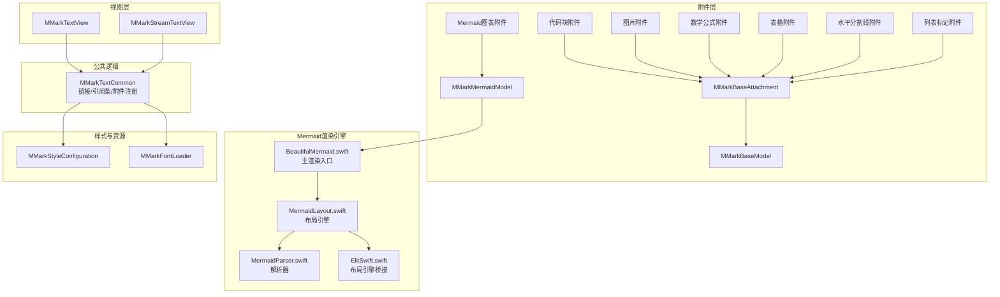
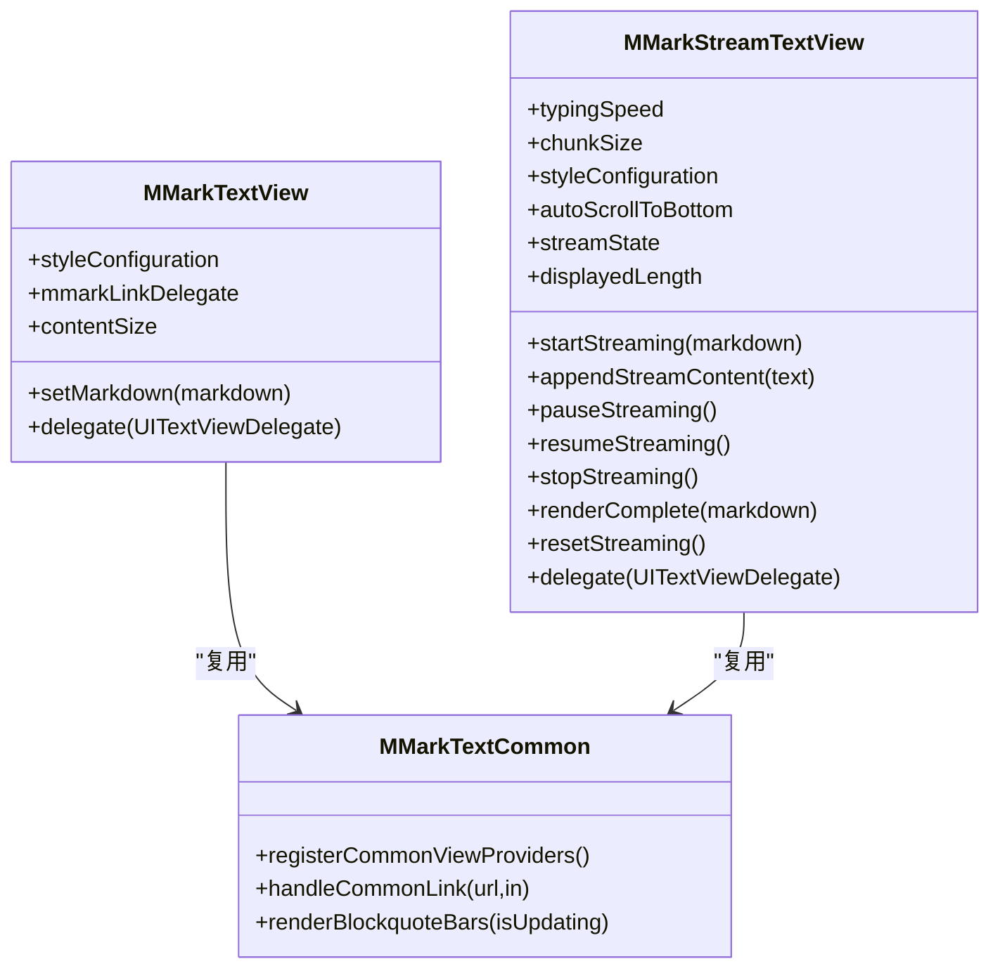
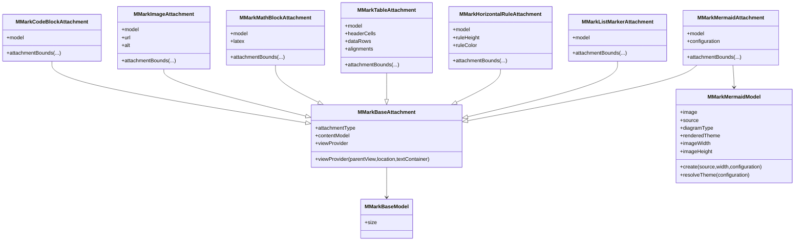
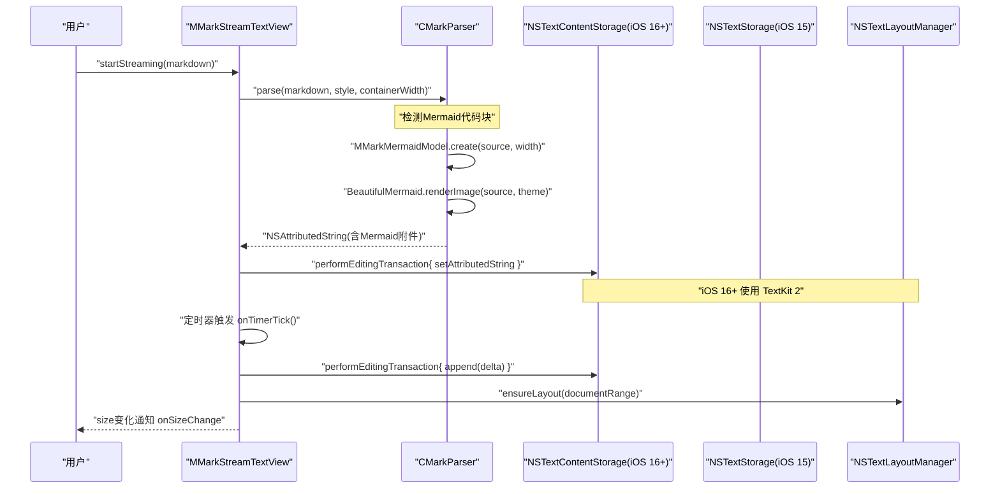
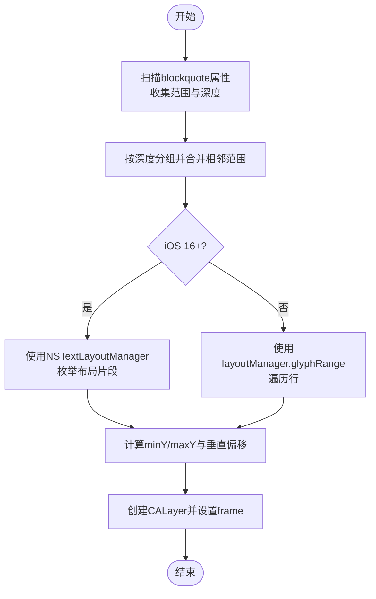
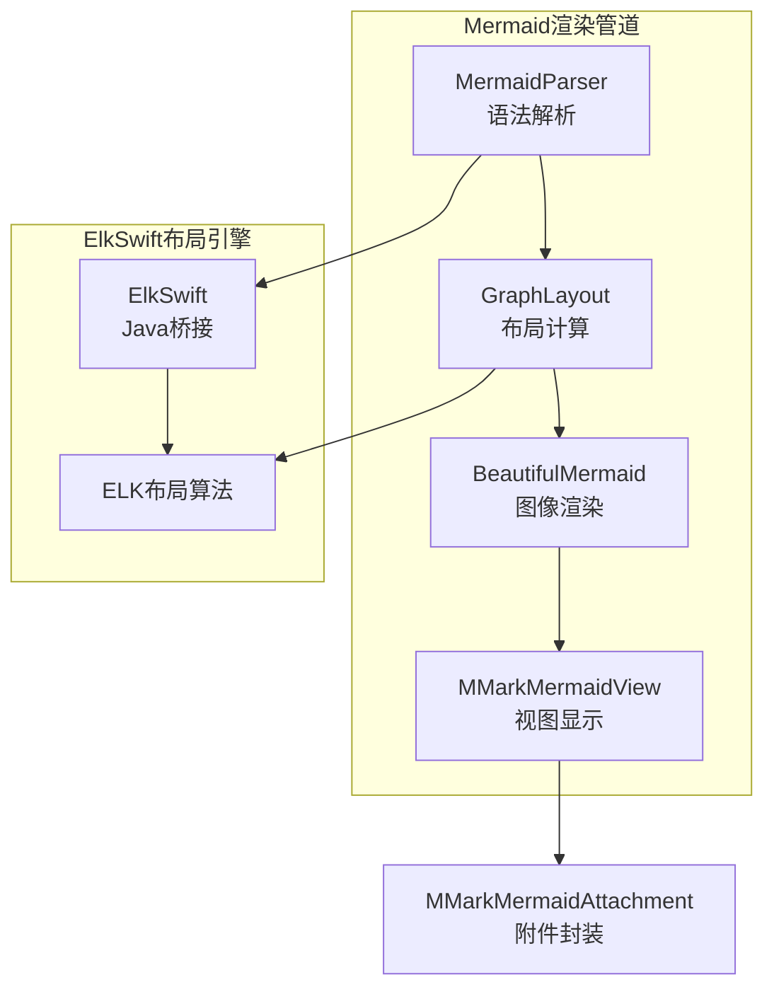
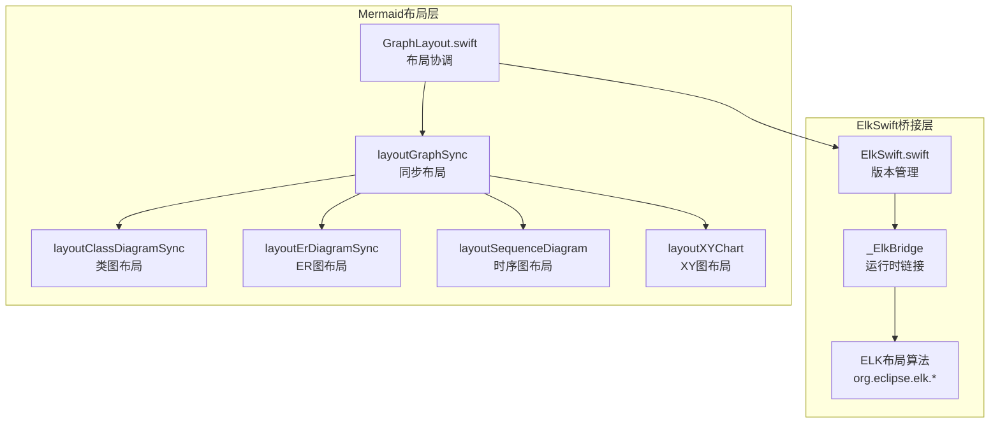
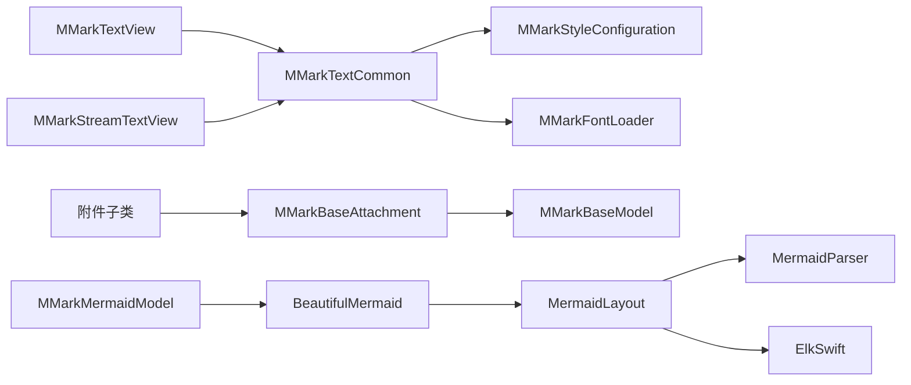

# 渲染器架构设计

<cite>
**本文档引用的文件**
- [MMarkTextView.swift](file://MMarkParser/Sources/Renderer/MMarkTextView.swift)
- [MMarkStreamTextView.swift](file://MMarkParser/Sources/Renderer/MMarkStreamTextView.swift)
- [MMarkTextCommon.swift](file://MMarkParser/Sources/Renderer/MMarkTextCommon.swift)
- [MMarkStyleConfiguration.swift](file://MMarkParser/Sources/Renderer/MMarkStyleConfiguration.swift)
- [MMarkFontLoader.swift](file://MMarkParser/Sources/Renderer/MMarkFontLoader.swift)
- [MMarkBaseAttachment.swift](file://MMarkParser/Sources/Renderer/Attachments/MMarkBaseAttachment/MMarkBaseAttachment.swift)
- [MMarkBaseModel.swift](file://MMarkParser/Sources/Renderer/Attachments/MMarkBaseAttachment/MMarkBaseModel.swift)
- [MMarkCodeBlockAttachment.swift](file://MMarkParser/Sources/Renderer/Attachments/MMarkCodeBlockAttachment/MMarkCodeBlockAttachment.swift)
- [MMarkImageAttachment.swift](file://MMarkParser/Sources/Renderer/Attachments/MMarkImageAttachment/MMarkImageAttachment.swift)
- [MMarkMathBlockAttachment.swift](file://MMarkParser/Sources/Renderer/Attachments/MMarkMathBlockAttachment/MMarkMathBlockAttachment.swift)
- [MMarkTableAttachment.swift](file://MMarkParser/Sources/Renderer/Attachments/MMarkTableAttachment/MMarkTableAttachment.swift)
- [MMarkHorizontalRuleAttachment.swift](file://MMarkParser/Sources/Renderer/Attachments/MMarkHorizontalRuleAttachment/MMarkHorizontalRuleAttachment.swift)
- [MMarkListMarkerAttachment.swift](file://MMarkParser/Sources/Renderer/Attachments/MMarkListMarkerAttachment/MMarkListMarkerAttachment.swift)
- [MMarkMermaidAttachment.swift](file://MMarkParser/Sources/Renderer/Attachments/MMarkMermaidAttachment/MMarkMermaidAttachment.swift)
- [MMarkMermaidModel.swift](file://MMarkParser/Sources/Renderer/Attachments/MMarkMermaidAttachment/MMarkMermaidModel.swift)
- [MMarkMermaidView.swift](file://MMarkParser/Sources/Renderer/Attachments/MMarkMermaidAttachment/MMarkMermaidView.swift)
- [MMarkMermaidViewProvider.swift](file://MMarkParser/Sources/Renderer/Attachments/MMarkMermaidAttachment/MMarkMermaidViewProvider.swift)
- [BeautifulMermaid.swift](file://BeautifulMermaidSwift/BeautifulMermaid.swift)
- [MermaidLayout.swift](file://BeautifulMermaidSwift/MermaidLayout.swift)
- [MermaidParser.swift](file://BeautifulMermaidSwift/MermaidParser.swift)
- [ElkSwift.swift](file://ElkSwift/ElkSwift.swift)
- [MMarkParserWrapper.swift](file://MMarkParser/Parser/MMarkParserWrapper.swift)
</cite>

## 更新摘要
**变更内容**
- 新增Mermaid图表渲染器集成章节，详细介绍Mermaid图表渲染架构
- 添加ElkSwift布局引擎协作机制说明
- 更新附件层架构图，包含Mermaid图表附件
- 扩展渲染流程图，涵盖Mermaid图表的完整渲染管道
- 新增Mermaid图表主题适配与暗黑模式支持机制

## 目录
1. [简介](#简介)
2. [项目结构](#项目结构)
3. [核心组件](#核心组件)
4. [架构总览](#架构总览)
5. [详细组件分析](#详细组件分析)
6. [Mermaid图表渲染器集成](#mermaid图表渲染器集成)
7. [ElkSwift布局引擎协作](#elkswift布局引擎协作)
8. [依赖关系分析](#依赖关系分析)
9. [性能考量](#性能考量)
10. [故障排查指南](#故障排查指南)
11. [结论](#结论)
12. [附录](#附录)

## 简介
本文件面向MMarkParser的渲染器架构，系统性阐述基于TextKit 2的富文本渲染体系。重点对比两种渲染模式：一次性渲染的MMarkTextView与支持增量流式的MMarkStreamTextView，并深入解析NSTextAttachment在复杂内容（代码块、表格、数学公式、图片、Mermaid图表等）渲染中的作用。同时，说明如何充分利用TextKit 2的新特性（如动态字体、颜色跟随系统设置等），并通过渲染流程图与架构图展示从NSAttributedString到屏幕显示的完整渲染管道。

**更新** 新增Mermaid图表渲染器集成，包括BeautifulMermaidSwift渲染引擎与ElkSwift布局引擎的深度协作机制。

## 项目结构
渲染器位于MMarkParser/Sources/Renderer目录，分为两类：
- 文本视图层：MMarkTextView与MMarkStreamTextView
- 附件层：MMarkBaseAttachment及其子类（代码块、水平分割线、图片、列表标记、数学公式、表格、Mermaid图表）

```mermaid
graph TB
subgraph "渲染器"
TV["MMarkTextView"]
STV["MMarkStreamTextView"]
COMMON["MMarkTextCommon<br/>公共逻辑"]
STYLE["MMarkStyleConfiguration<br/>样式配置"]
FONT["MMarkFontLoader<br/>字体加载"]
MERMAID["MMarkMermaidAttachment<br/>Mermaid图表附件"]
END
subgraph "附件模型"
BASE["MMarkBaseAttachment"]
CB["MMarkCodeBlockAttachment"]
HR["MMarkHorizontalRuleAttachment"]
IMG["MMarkImageAttachment"]
LM["MMarkListMarkerAttachment"]
MATH["MMarkMathBlockAttachment"]
TABLE["MMarkTableAttachment"]
MODEL["MMarkBaseModel"]
MERMAID_MODEL["MMarkMermaidModel"]
END
subgraph "Mermaid渲染引擎"
BM["BeautifulMermaid.swift<br/>主渲染入口"]
ML["MermaidLayout.swift<br/>布局引擎"]
MP["MermaidParser.swift<br/>解析器"]
ES["ElkSwift.swift<br/>布局引擎桥接"]
END
TV --> COMMON
STV --> COMMON
COMMON --> STYLE
COMMON --> FONT
BASE --> MODEL
CB --> BASE
HR --> BASE
IMG --> BASE
LM --> BASE
MATH --> BASE
TABLE --> BASE
MERMAID --> MERMAID_MODEL
MERMAID_MODEL --> BM
BM --> ML
ML --> MP
ML --> ES
```

**图表来源**
- [MMarkTextView.swift:1-81](file://MMarkParser/Sources/Renderer/MMarkTextView.swift#L1-L81)
- [MMarkStreamTextView.swift:1-398](file://MMarkParser/Sources/Renderer/MMarkStreamTextView.swift#L1-L398)
- [MMarkTextCommon.swift:1-290](file://MMarkParser/Sources/Renderer/MMarkTextCommon.swift#L1-L290)
- [MMarkStyleConfiguration.swift:1-339](file://MMarkParser/Sources/Renderer/MMarkStyleConfiguration.swift#L1-L339)
- [MMarkFontLoader.swift:1-113](file://MMarkParser/Sources/Renderer/MMarkFontLoader.swift#L1-L113)
- [MMarkBaseAttachment.swift:1-60](file://MMarkParser/Sources/Renderer/Attachments/MMarkBaseAttachment/MMarkBaseAttachment.swift#L1-L60)
- [MMarkBaseModel.swift:1-10](file://MMarkParser/Sources/Renderer/Attachments/MMarkBaseAttachment/MMarkBaseModel.swift#L1-L10)
- [MMarkCodeBlockAttachment.swift:1-22](file://MMarkParser/Sources/Renderer/Attachments/MMarkCodeBlockAttachment/MMarkCodeBlockAttachment.swift#L1-L22)
- [MMarkHorizontalRuleAttachment.swift:1-38](file://MMarkParser/Sources/Renderer/Attachments/MMarkHorizontalRuleAttachment/MMarkHorizontalRuleAttachment.swift#L1-L38)
- [MMarkImageAttachment.swift:1-23](file://MMarkParser/Sources/Renderer/Attachments/MMarkImageAttachment/MMarkImageAttachment.swift#L1-L23)
- [MMarkListMarkerAttachment.swift:1-18](file://MMarkParser/Sources/Renderer/Attachments/MMarkListMarkerAttachment/MMarkListMarkerAttachment.swift#L1-L18)
- [MMarkMathBlockAttachment.swift:1-23](file://MMarkParser/Sources/Renderer/Attachments/MMarkMathBlockAttachment/MMarkMathBlockAttachment.swift#L1-L23)
- [MMarkTableAttachment.swift:1-23](file://MMarkParser/Sources/Renderer/Attachments/MMarkTableAttachment/MMarkTableAttachment.swift#L1-L23)
- [MMarkMermaidAttachment.swift:1-33](file://MMarkParser/Sources/Renderer/Attachments/MMarkMermaidAttachment/MMarkMermaidAttachment.swift#L1-L33)
- [MMarkMermaidModel.swift:1-130](file://MMarkParser/Sources/Renderer/Attachments/MMarkMermaidAttachment/MMarkMermaidModel.swift#L1-L130)
- [BeautifulMermaid.swift:1-185](file://BeautifulMermaidSwift/BeautifulMermaid.swift#L1-L185)
- [MermaidLayout.swift:1-75](file://BeautifulMermaidSwift/MermaidLayout.swift#L1-L75)
- [MermaidParser.swift:1-54](file://BeautifulMermaidSwift/MermaidParser.swift#L1-L54)
- [ElkSwift.swift:1-4](file://ElkSwift/ElkSwift.swift#L1-L4)

**章节来源**
- [MMarkTextView.swift:1-81](file://MMarkParser/Sources/Renderer/MMarkTextView.swift#L1-L81)
- [MMarkStreamTextView.swift:1-398](file://MMarkParser/Sources/Renderer/MMarkStreamTextView.swift#L1-L398)
- [MMarkTextCommon.swift:1-290](file://MMarkParser/Sources/Renderer/MMarkTextCommon.swift#L1-L290)
- [MMarkStyleConfiguration.swift:1-339](file://MMarkParser/Sources/Renderer/MMarkStyleConfiguration.swift#L1-L339)
- [MMarkFontLoader.swift:1-113](file://MMarkParser/Sources/Renderer/MMarkFontLoader.swift#L1-L113)
- [MMarkBaseAttachment.swift:1-60](file://MMarkParser/Sources/Renderer/Attachments/MMarkBaseAttachment/MMarkBaseAttachment.swift#L1-L60)
- [MMarkBaseModel.swift:1-10](file://MMarkParser/Sources/Renderer/Attachments/MMarkBaseAttachment/MMarkBaseModel.swift#L1-L10)
- [MMarkCodeBlockAttachment.swift:1-22](file://MMarkParser/Sources/Renderer/Attachments/MMarkCodeBlockAttachment/MMarkCodeBlockAttachment.swift#L1-L22)
- [MMarkHorizontalRuleAttachment.swift:1-38](file://MMarkParser/Sources/Renderer/Attachments/MMarkHorizontalRuleAttachment/MMarkHorizontalRuleAttachment.swift#L1-L38)
- [MMarkImageAttachment.swift:1-23](file://MMarkParser/Sources/Renderer/Attachments/MMarkImageAttachment/MMarkImageAttachment.swift#L1-L23)
- [MMarkListMarkerAttachment.swift:1-18](file://MMarkParser/Sources/Renderer/Attachments/MMarkListMarkerAttachment/MMarkListMarkerAttachment.swift#L1-L18)
- [MMarkMathBlockAttachment.swift:1-23](file://MMarkParser/Sources/Renderer/Attachments/MMarkMathBlockAttachment/MMarkMathBlockAttachment.swift#L1-L23)
- [MMarkTableAttachment.swift:1-23](file://MMarkParser/Sources/Renderer/Attachments/MMarkTableAttachment/MMarkTableAttachment.swift#L1-L23)
- [MMarkMermaidAttachment.swift:1-33](file://MMarkParser/Sources/Renderer/Attachments/MMarkMermaidAttachment/MMarkMermaidAttachment.swift#L1-L33)
- [MMarkMermaidModel.swift:1-130](file://MMarkParser/Sources/Renderer/Attachments/MMarkMermaidAttachment/MMarkMermaidModel.swift#L1-L130)

## 核心组件
- MMarkTextView：一次性渲染Markdown，基于TextKit 2布局，支持引用块侧边条绘制与链接处理。
- MMarkStreamTextView：支持增量流式渲染，具备定时器驱动的分片插入、自动滚动、状态机管理与TextKit 2/1双栈兼容。
- MMarkTextCommon：统一注册NSTextAttachment视图提供者、链接处理、引用块侧边条绘制等公共逻辑。
- MMarkStyleConfiguration：集中管理标题、段落、代码、表格、任务列表、数学公式、引用块、Mermaid图表等样式配置。
- MMarkFontLoader：从资源包加载KaTeX字体，确保数学公式渲染可用。
- MMarkBaseAttachment及子类：复杂内容的附件封装与尺寸约束，配合各自ViewProvider完成渲染。
- **新增** MMarkMermaidAttachment及子类：Mermaid图表的附件封装，支持多种图表类型（流程图、时序图、类图、ER图、状态图、XY图）。

**更新** 新增Mermaid图表渲染组件，包括附件模型、视图和视图提供者，以及与BeautifulMermaidSwift和ElkSwift的深度集成。

**章节来源**
- [MMarkTextView.swift:1-81](file://MMarkParser/Sources/Renderer/MMarkTextView.swift#L1-L81)
- [MMarkStreamTextView.swift:1-398](file://MMarkParser/Sources/Renderer/MMarkStreamTextView.swift#L1-L398)
- [MMarkTextCommon.swift:1-290](file://MMarkParser/Sources/Renderer/MMarkTextCommon.swift#L1-L290)
- [MMarkStyleConfiguration.swift:1-339](file://MMarkParser/Sources/Renderer/MMarkStyleConfiguration.swift#L1-L339)
- [MMarkFontLoader.swift:1-113](file://MMarkParser/Sources/Renderer/MMarkFontLoader.swift#L1-L113)
- [MMarkBaseAttachment.swift:1-60](file://MMarkParser/Sources/Renderer/Attachments/MMarkBaseAttachment/MMarkBaseAttachment.swift#L1-L60)
- [MMarkMermaidAttachment.swift:1-33](file://MMarkParser/Sources/Renderer/Attachments/MMarkMermaidAttachment/MMarkMermaidAttachment.swift#L1-L33)
- [MMarkMermaidModel.swift:1-130](file://MMarkParser/Sources/Renderer/Attachments/MMarkMermaidAttachment/MMarkMermaidModel.swift#L1-L130)

## 架构总览
渲染器采用"视图层 + 附件层 + 样式层 + 字体层 + 图表渲染层"的分层设计。视图层负责布局与交互，附件层承载复杂内容，样式层提供主题化外观，字体层保证数学公式排版质量，图表渲染层专门处理Mermaid图表的解析、布局和渲染。TextKit 2在流式渲染中发挥关键作用，通过NSTextLayoutManager与NSTextContentStorage实现高效增量更新。



**图表来源**
- [MMarkTextView.swift:1-81](file://MMarkParser/Sources/Renderer/MMarkTextView.swift#L1-L81)
- [MMarkStreamTextView.swift:1-398](file://MMarkParser/Sources/Renderer/MMarkStreamTextView.swift#L1-L398)
- [MMarkTextCommon.swift:1-290](file://MMarkParser/Sources/Renderer/MMarkTextCommon.swift#L1-L290)
- [MMarkStyleConfiguration.swift:1-339](file://MMarkParser/Sources/Renderer/MMarkStyleConfiguration.swift#L1-L339)
- [MMarkFontLoader.swift:1-113](file://MMarkParser/Sources/Renderer/MMarkFontLoader.swift#L1-L113)
- [MMarkBaseAttachment.swift:1-60](file://MMarkParser/Sources/Renderer/Attachments/MMarkBaseAttachment/MMarkBaseAttachment.swift#L1-L60)
- [MMarkBaseModel.swift:1-10](file://MMarkParser/Sources/Renderer/Attachments/MMarkBaseAttachment/MMarkBaseModel.swift#L1-L10)
- [MMarkCodeBlockAttachment.swift:1-22](file://MMarkParser/Sources/Renderer/Attachments/MMarkCodeBlockAttachment/MMarkCodeBlockAttachment.swift#L1-L22)
- [MMarkImageAttachment.swift:1-23](file://MMarkParser/Sources/Renderer/Attachments/MMarkImageAttachment/MMarkImageAttachment.swift#L1-L23)
- [MMarkMathBlockAttachment.swift:1-23](file://MMarkParser/Sources/Renderer/Attachments/MMarkMathBlockAttachment/MMarkMathBlockAttachment.swift#L1-L23)
- [MMarkTableAttachment.swift:1-23](file://MMarkParser/Sources/Renderer/Attachments/MMarkTableAttachment/MMarkTableAttachment.swift#L1-L23)
- [MMarkHorizontalRuleAttachment.swift:1-38](file://MMarkParser/Sources/Renderer/Attachments/MMarkHorizontalRuleAttachment/MMarkHorizontalRuleAttachment.swift#L1-L38)
- [MMarkListMarkerAttachment.swift:1-18](file://MMarkParser/Sources/Renderer/Attachments/MMarkListMarkerAttachment/MMarkListMarkerAttachment.swift#L1-L18)
- [MMarkMermaidAttachment.swift:1-33](file://MMarkParser/Sources/Renderer/Attachments/MMarkMermaidAttachment/MMarkMermaidAttachment.swift#L1-L33)
- [MMarkMermaidModel.swift:1-130](file://MMarkParser/Sources/Renderer/Attachments/MMarkMermaidAttachment/MMarkMermaidModel.swift#L1-L130)
- [BeautifulMermaid.swift:1-185](file://BeautifulMermaidSwift/BeautifulMermaid.swift#L1-L185)
- [MermaidLayout.swift:1-75](file://BeautifulMermaidSwift/MermaidLayout.swift#L1-L75)
- [MermaidParser.swift:1-54](file://BeautifulMermaidSwift/MermaidParser.swift#L1-L54)
- [ElkSwift.swift:1-4](file://ElkSwift/ElkSwift.swift#L1-L4)

## 详细组件分析

### MMarkTextView 与 MMarkStreamTextView 对比
- 渲染时机
  - MMarkTextView：一次性解析Markdown并设置attributedText，适合短文档或静态内容。
  - MMarkStreamTextView：后台解析生成完整NSAttributedString，前台定时器按分片增量插入，适合长文档或实时输入场景。
- TextKit 2 集成
  - 两者均通过MMarkTextCommon注册NSTextAttachmentViewProvider，启用TextKit 2附件视图机制。
  - MMarkStreamTextView在iOS 16+优先使用NSTextContentStorage进行编辑事务，避免全量重布局。
- 引用块侧边条
  - 两者均通过renderBlockquoteBars绘制，MMarkStreamTextView在contentSize变化后异步更新。
- 链接处理
  - 两者均实现UITextViewDelegate，委托MMarkTextCommon.handleCommonLink处理脚注与锚点跳转。



**图表来源**
- [MMarkTextView.swift:1-81](file://MMarkParser/Sources/Renderer/MMarkTextView.swift#L1-L81)
- [MMarkStreamTextView.swift:1-398](file://MMarkParser/Sources/Renderer/MMarkStreamTextView.swift#L1-L398)
- [MMarkTextCommon.swift:1-290](file://MMarkParser/Sources/Renderer/MMarkTextCommon.swift#L1-L290)

**章节来源**
- [MMarkTextView.swift:1-81](file://MMarkParser/Sources/Renderer/MMarkTextView.swift#L1-L81)
- [MMarkStreamTextView.swift:1-398](file://MMarkParser/Sources/Renderer/MMarkStreamTextView.swift#L1-L398)
- [MMarkTextCommon.swift:1-290](file://MMarkParser/Sources/Renderer/MMarkTextCommon.swift#L1-L290)

### NSTextAttachment 在复杂内容渲染中的作用
- 统一入口：MMarkBaseAttachment继承自NSTextAttachment，通过fileType与NSTextAttachment.registerViewProviderClass注册，使TextKit 2能够按需创建附件视图。
- 类型分派：MMarkBaseAttachment根据attachmentType返回对应ViewProvider，实现多类型内容的差异化渲染。
- 尺寸约束：各附件子类覆盖attachmentBounds，结合lineFragment宽度与模型size，确保内容不溢出且比例正确。
- 适用内容：代码块、图片、数学公式、表格、水平分割线、列表标记、**Mermaid图表**等。

**更新** Mermaid图表附件现已加入附件体系，支持多种图表类型的统一渲染。



**图表来源**
- [MMarkBaseAttachment.swift:1-60](file://MMarkParser/Sources/Renderer/Attachments/MMarkBaseAttachment/MMarkBaseAttachment.swift#L1-L60)
- [MMarkBaseModel.swift:1-10](file://MMarkParser/Sources/Renderer/Attachments/MMarkBaseAttachment/MMarkBaseModel.swift#L1-L10)
- [MMarkCodeBlockAttachment.swift:1-22](file://MMarkParser/Sources/Renderer/Attachments/MMarkCodeBlockAttachment/MMarkCodeBlockAttachment.swift#L1-L22)
- [MMarkImageAttachment.swift:1-23](file://MMarkParser/Sources/Renderer/Attachments/MMarkImageAttachment/MMarkImageAttachment.swift#L1-L23)
- [MMarkMathBlockAttachment.swift:1-23](file://MMarkParser/Sources/Renderer/Attachments/MMarkMathBlockAttachment/MMarkMathBlockAttachment.swift#L1-L23)
- [MMarkTableAttachment.swift:1-23](file://MMarkParser/Sources/Renderer/Attachments/MMarkTableAttachment/MMarkTableAttachment.swift#L1-L23)
- [MMarkHorizontalRuleAttachment.swift:1-38](file://MMarkParser/Sources/Renderer/Attachments/MMarkHorizontalRuleAttachment/MMarkHorizontalRuleAttachment.swift#L1-L38)
- [MMarkListMarkerAttachment.swift:1-18](file://MMarkParser/Sources/Renderer/Attachments/MMarkListMarkerAttachment/MMarkListMarkerAttachment.swift#L1-L18)
- [MMarkMermaidAttachment.swift:1-33](file://MMarkParser/Sources/Renderer/Attachments/MMarkMermaidAttachment/MMarkMermaidAttachment.swift#L1-L33)
- [MMarkMermaidModel.swift:1-130](file://MMarkParser/Sources/Renderer/Attachments/MMarkMermaidAttachment/MMarkMermaidModel.swift#L1-L130)

**章节来源**
- [MMarkBaseAttachment.swift:1-60](file://MMarkParser/Sources/Renderer/Attachments/MMarkBaseAttachment/MMarkBaseAttachment.swift#L1-L60)
- [MMarkBaseModel.swift:1-10](file://MMarkParser/Sources/Renderer/Attachments/MMarkBaseAttachment/MMarkBaseModel.swift#L1-L10)
- [MMarkCodeBlockAttachment.swift:1-22](file://MMarkParser/Sources/Renderer/Attachments/MMarkCodeBlockAttachment/MMarkCodeBlockAttachment.swift#L1-L22)
- [MMarkImageAttachment.swift:1-23](file://MMarkParser/Sources/Renderer/Attachments/MMarkImageAttachment/MMarkImageAttachment.swift#L1-L23)
- [MMarkMathBlockAttachment.swift:1-23](file://MMarkParser/Sources/Renderer/Attachments/MMarkMathBlockAttachment/MMarkMathBlockAttachment.swift#L1-L23)
- [MMarkTableAttachment.swift:1-23](file://MMarkParser/Sources/Renderer/Attachments/MMarkTableAttachment/MMarkTableAttachment.swift#L1-L23)
- [MMarkHorizontalRuleAttachment.swift:1-38](file://MMarkParser/Sources/Renderer/Attachments/MMarkHorizontalRuleAttachment/MMarkHorizontalRuleAttachment.swift#L1-L38)
- [MMarkListMarkerAttachment.swift:1-18](file://MMarkParser/Sources/Renderer/Attachments/MMarkListMarkerAttachment/MMarkListMarkerAttachment.swift#L1-L18)
- [MMarkMermaidAttachment.swift:1-33](file://MMarkParser/Sources/Renderer/Attachments/MMarkMermaidAttachment/MMarkMermaidAttachment.swift#L1-L33)
- [MMarkMermaidModel.swift:1-130](file://MMarkParser/Sources/Renderer/Attachments/MMarkMermaidAttachment/MMarkMermaidModel.swift#L1-L130)

### 渲染流程与TextKit 2集成
- 解析阶段：CMarkParser将Markdown转换为NSAttributedString，包含普通文本与NSTextAttachment。
- 视图阶段：MMarkTextCommon注册附件视图提供者，TextKit 2按需创建附件视图并布局。
- 增量阶段（流式）：MMarkStreamTextView在iOS 16+使用NSTextContentStorage.performEditingTransaction进行增量插入，减少全量重布局成本。
- 引用块侧边条：在布局完成后，遍历blockquote属性，计算每层深度的连续范围并绘制CALayer条带。

**更新** Mermaid图表渲染流程：解析器检测到语言为mermaid时，创建MMarkMermaidModel并渲染为UIImage，然后通过MMarkMermaidAttachment进行显示。



**图表来源**
- [MMarkStreamTextView.swift:174-201](file://MMarkParser/Sources/Renderer/MMarkStreamTextView.swift#L174-L201)
- [MMarkStreamTextView.swift:304-351](file://MMarkParser/Sources/Renderer/MMarkStreamTextView.swift#L304-L351)
- [MMarkStreamTextView.swift:143-156](file://MMarkParser/Sources/Renderer/MMarkStreamTextView.swift#L143-L156)
- [MMarkTextCommon.swift:171-211](file://MMarkParser/Sources/Renderer/MMarkTextCommon.swift#L171-L211)
- [MMarkParserWrapper.swift:562-571](file://MMarkParser/Parser/MMarkParserWrapper.swift#L562-L571)
- [MMarkMermaidModel.swift:95-130](file://MMarkParser/Sources/Renderer/Attachments/MMarkMermaidAttachment/MMarkMermaidModel.swift#L95-L130)
- [BeautifulMermaid.swift:17-26](file://BeautifulMermaidSwift/BeautifulMermaid.swift#L17-L26)

**章节来源**
- [MMarkStreamTextView.swift:174-201](file://MMarkParser/Sources/Renderer/MMarkStreamTextView.swift#L174-L201)
- [MMarkStreamTextView.swift:304-351](file://MMarkParser/Sources/Renderer/MMarkStreamTextView.swift#L304-L351)
- [MMarkStreamTextView.swift:143-156](file://MMarkParser/Sources/Renderer/MMarkStreamTextView.swift#L143-L156)
- [MMarkTextCommon.swift:171-211](file://MMarkParser/Sources/Renderer/MMarkTextCommon.swift#L171-L211)
- [MMarkParserWrapper.swift:562-571](file://MMarkParser/Parser/MMarkParserWrapper.swift#L562-L571)
- [MMarkMermaidModel.swift:95-130](file://MMarkParser/Sources/Renderer/Attachments/MMarkMermaidAttachment/MMarkMermaidModel.swift#L95-L130)
- [BeautifulMermaid.swift:17-26](file://BeautifulMermaidSwift/BeautifulMermaid.swift#L17-L26)

### 引用块侧边条绘制算法
- 属性扫描：遍历attributedText的blockquote属性，收集范围与深度。
- 深度分组：按深度层级聚合，合并相邻或重叠范围。
- 布局查询：iOS 16+使用NSTextLayoutManager枚举布局片段，计算最小包围矩形；iOS 15使用layoutManager.glyphRange与enumerateLineFragments。
- 绘制CALayer：根据textContainerInset与深度计算条带x坐标，绘制垂直条带。



**图表来源**
- [MMarkTextCommon.swift:132-249](file://MMarkParser/Sources/Renderer/MMarkTextCommon.swift#L132-L249)

**章节来源**
- [MMarkTextCommon.swift:132-249](file://MMarkParser/Sources/Renderer/MMarkTextCommon.swift#L132-L249)

### TextKit 2 新特性的利用
- 动态字体：MMarkStyleConfiguration使用系统字体，随用户动态字体设置自动调整。
- 颜色跟随系统设置：MMarkTextView与MMarkStreamTextView使用.systemBackground与.label等系统颜色，自动适配浅色/深色模式。
- 增量编辑：MMarkStreamTextView在iOS 16+使用NSTextContentStorage.performEditingTransaction，显著降低长文档流式渲染的布局成本。
- 布局查询：引用块侧边条在iOS 16+使用NSTextLayoutManager.enumerateTextLayoutFragments，避免桥接到TextKit 1带来的额外开销。

**更新** Mermaid图表支持暗黑模式自动适配，通过traitCollectionDidChange监听系统主题变化，触发重新渲染机制。

**章节来源**
- [MMarkTextView.swift:30-37](file://MMarkParser/Sources/Renderer/MMarkTextView.swift#L30-L37)
- [MMarkStreamTextView.swift:101-108](file://MMarkParser/Sources/Renderer/MMarkStreamTextView.swift#L101-L108)
- [MMarkStyleConfiguration.swift:189-267](file://MMarkParser/Sources/Renderer/MMarkStyleConfiguration.swift#L189-L267)
- [MMarkTextCommon.swift:171-211](file://MMarkParser/Sources/Renderer/MMarkTextCommon.swift#L171-L211)
- [MMarkMermaidView.swift:163-170](file://MMarkParser/Sources/Renderer/Attachments/MMarkMermaidAttachment/MMarkMermaidView.swift#L163-L170)

## Mermaid图表渲染器集成

### Mermaid图表渲染架构
MMarkParser集成了BeautifulMermaidSwift渲染引擎，专门处理Mermaid语法的图表渲染。该架构支持多种图表类型，包括流程图、时序图、类图、ER图、状态图和XY图表。



**图表来源**
- [BeautifulMermaid.swift:14-78](file://BeautifulMermaidSwift/BeautifulMermaid.swift#L14-L78)
- [MermaidLayout.swift:3-75](file://BeautifulMermaidSwift/MermaidLayout.swift#L3-L75)
- [MermaidParser.swift:9-53](file://BeautifulMermaidSwift/MermaidParser.swift#L9-L53)
- [ElkSwift.swift:1-4](file://ElkSwift/ElkSwift.swift#L1-L4)
- [MMarkMermaidView.swift:6-178](file://MMarkParser/Sources/Renderer/Attachments/MMarkMermaidAttachment/MMarkMermaidView.swift#L6-L178)
- [MMarkMermaidAttachment.swift:6-33](file://MMarkParser/Sources/Renderer/Attachments/MMarkMermaidAttachment/MMarkMermaidAttachment.swift#L6-L33)

### Mermaid图表类型支持
- **流程图（Flowchart）**：标准流程图，支持节点连接和分支逻辑
- **时序图（Sequence Diagram）**：交互序列图，显示对象间的消息传递
- **类图（Class Diagram）**：面向对象类关系图
- **ER图（ER Diagram）**：实体关系图，数据库设计图
- **状态图（State Diagram）**：状态转换图
- **XY图（XY Chart）**：数据图表和可视化

**章节来源**
- [BeautifulMermaid.swift:80-83](file://BeautifulMermaidSwift/BeautifulMermaid.swift#L80-L83)
- [MermaidParser.swift:31-51](file://BeautifulMermaidSwift/MermaidParser.swift#L31-L51)
- [MMarkMermaidModel.swift:84-93](file://MMarkParser/Sources/Renderer/Attachments/MMarkMermaidAttachment/MMarkMermaidModel.swift#L84-L93)

### Mermaid图表主题适配
Mermaid图表支持自动暗黑模式适配，根据系统主题动态选择合适的图表主题：

- **深色模式**：当系统主题为深色时，自动使用.zincDark主题
- **浅色模式**：当系统主题为浅色时，自动使用.zincLight主题
- **手动配置**：支持通过MMarkStyleConfiguration.mermaidTheme手动指定主题
- **自动暗黑模式开关**：通过MMarkStyleConfiguration.mermaidAutoDarkMode控制是否启用自动适配

**章节来源**
- [MMarkMermaidModel.swift:31-61](file://MMarkParser/Sources/Renderer/Attachments/MMarkMermaidAttachment/MMarkMermaidModel.swift#L31-L61)
- [MMarkMermaidView.swift:163-170](file://MMarkParser/Sources/Renderer/Attachments/MMarkMermaidAttachment/MMarkMermaidView.swift#L163-L170)

### Mermaid图表渲染流程
1. **解析阶段**：MermaidParser.parse将Mermaid源码解析为MermaidGraph结构
2. **布局阶段**：GraphLayout.layout使用ElkSwift布局引擎计算图表布局
3. **渲染阶段**：BeautifulMermaid.renderImage将图表渲染为UIImage
4. **显示阶段**：MMarkMermaidView在UIScrollView中显示图表，支持横向滚动

**章节来源**
- [BeautifulMermaid.swift:25-54](file://BeautifulMermaidSwift/BeautifulMermaid.swift#L25-L54)
- [MermaidLayout.swift:10-75](file://BeautifulMermaidSwift/MermaidLayout.swift#L10-L75)
- [MMarkMermaidModel.swift:95-130](file://MMarkParser/Sources/Renderer/Attachments/MMarkMermaidAttachment/MMarkMermaidModel.swift#L95-L130)

## ElkSwift布局引擎协作

### 布局引擎架构
ElkSwift作为Java ELK布局引擎的Swift桥接层，为Mermaid图表提供专业的图形布局算法支持：



**图表来源**
- [ElkSwift.swift:1-4](file://ElkSwift/ElkSwift.swift#L1-L4)
- [MermaidLayout.swift:10-75](file://BeautifulMermaidSwift/MermaidLayout.swift#L10-L75)
- [MermaidLayout.swift:1217-1279](file://BeautifulMermaidSwift/MermaidLayout.swift#L1217-L1279)

### 布局算法支持
- **层次化布局（Layered）**：适用于流程图和类图的层次结构
- **网格布局（Grid）**：适用于ER图的实体关系布局
- **网络简化（Network Simplex）**：优化边的长度和交叉
- **节点间距（Node Spacing）**：控制节点间的最小距离
- **重叠移除（Overlaps Removal）**：消除节点重叠问题

**章节来源**
- [MermaidLayout.swift:1217-1279](file://BeautifulMermaidSwift/MermaidLayout.swift#L1217-L1279)
- [BeautifulMermaid.swift:17-26](file://BeautifulMermaidSwift/BeautifulMermaid.swift#L17-L26)

### 布局配置参数
GraphLayout支持通过LayoutConfig自定义布局参数：

- **节点间距**：elk.layered.spacing.nodeNodeBetweenLayers
- **层间距**：elk.spacing.nodeNode
- **内边距**：elk.padding
- **组件间距**：elk.spacing.componentComponent
- **方向控制**：支持从左到右或从上到下的布局方向

**章节来源**
- [MermaidLayout.swift:1264-1272](file://BeautifulMermaidSwift/MermaidLayout.swift#L1264-L1272)

## 依赖关系分析
- 视图层对公共逻辑的依赖：MMarkTextView与MMarkStreamTextView均依赖MMarkTextCommon提供的附件注册、链接处理与引用条绘制。
- 附件层对模型的依赖：各附件子类依赖MMarkBaseModel提供的size信息，用于attachmentBounds计算。
- 样式层对视图层的依赖：MMarkStyleConfiguration影响字体、颜色、间距等，最终体现在渲染结果中。
- 字体层对样式层的依赖：MMarkFontLoader确保KaTeX字体可用，支撑数学公式渲染。
- **新增** Mermaid渲染层对解析层的依赖：MMarkMermaidModel依赖BeautifulMermaidSwift进行图表渲染，GraphLayout依赖ElkSwift提供布局算法。

**更新** 新增Mermaid渲染器与ElkSwift布局引擎的依赖关系，形成完整的图表渲染链路。



**图表来源**
- [MMarkTextView.swift:1-81](file://MMarkParser/Sources/Renderer/MMarkTextView.swift#L1-L81)
- [MMarkStreamTextView.swift:1-398](file://MMarkParser/Sources/Renderer/MMarkStreamTextView.swift#L1-L398)
- [MMarkTextCommon.swift:1-290](file://MMarkParser/Sources/Renderer/MMarkTextCommon.swift#L1-L290)
- [MMarkStyleConfiguration.swift:1-339](file://MMarkParser/Sources/Renderer/MMarkStyleConfiguration.swift#L1-L339)
- [MMarkFontLoader.swift:1-113](file://MMarkParser/Sources/Renderer/MMarkFontLoader.swift#L1-L113)
- [MMarkBaseAttachment.swift:1-60](file://MMarkParser/Sources/Renderer/Attachments/MMarkBaseAttachment/MMarkBaseAttachment.swift#L1-L60)
- [MMarkBaseModel.swift:1-10](file://MMarkParser/Sources/Renderer/Attachments/MMarkBaseAttachment/MMarkBaseModel.swift#L1-L10)
- [MMarkMermaidModel.swift:1-130](file://MMarkParser/Sources/Renderer/Attachments/MMarkMermaidAttachment/MMarkMermaidModel.swift#L1-L130)
- [BeautifulMermaid.swift:1-185](file://BeautifulMermaidSwift/BeautifulMermaid.swift#L1-L185)
- [MermaidLayout.swift:1-75](file://BeautifulMermaidSwift/MermaidLayout.swift#L1-L75)
- [MermaidParser.swift:1-54](file://BeautifulMermaidSwift/MermaidParser.swift#L1-L54)
- [ElkSwift.swift:1-4](file://ElkSwift/ElkSwift.swift#L1-L4)

**章节来源**
- [MMarkTextView.swift:1-81](file://MMarkParser/Sources/Renderer/MMarkTextView.swift#L1-L81)
- [MMarkStreamTextView.swift:1-398](file://MMarkParser/Sources/Renderer/MMarkStreamTextView.swift#L1-L398)
- [MMarkTextCommon.swift:1-290](file://MMarkParser/Sources/Renderer/MMarkTextCommon.swift#L1-L290)
- [MMarkStyleConfiguration.swift:1-339](file://MMarkParser/Sources/Renderer/MMarkStyleConfiguration.swift#L1-L339)
- [MMarkFontLoader.swift:1-113](file://MMarkParser/Sources/Renderer/MMarkFontLoader.swift#L1-L113)
- [MMarkBaseAttachment.swift:1-60](file://MMarkParser/Sources/Renderer/Attachments/MMarkBaseAttachment/MMarkBaseAttachment.swift#L1-L60)
- [MMarkBaseModel.swift:1-10](file://MMarkParser/Sources/Renderer/Attachments/MMarkBaseAttachment/MMarkBaseModel.swift#L1-L10)
- [MMarkMermaidModel.swift:1-130](file://MMarkParser/Sources/Renderer/Attachments/MMarkMermaidAttachment/MMarkMermaidModel.swift#L1-L130)
- [BeautifulMermaid.swift:1-185](file://BeautifulMermaidSwift/BeautifulMermaid.swift#L1-L185)
- [MermaidLayout.swift:1-75](file://BeautifulMermaidSwift/MermaidLayout.swift#L1-L75)
- [MermaidParser.swift:1-54](file://BeautifulMermaidSwift/MermaidParser.swift#L1-L54)
- [ElkSwift.swift:1-4](file://ElkSwift/ElkSwift.swift#L1-L4)

## 性能考量
- 流式渲染的分片策略：MMarkStreamTextView默认按chunkSize分片，超过5000字符时动态增大chunk以保持视觉流畅。
- TextKit 2 增量编辑：在iOS 16+使用NSTextContentStorage.performEditingTransaction，避免全量重布局，显著提升长文档渲染效率。
- 引用块侧边条绘制：仅在布局完成后触发，且通过合并连续范围减少CALayer数量。
- 自动滚动：仅在用户靠近底部时滚动，避免频繁滚动影响体验。
- **新增** Mermaid图表缓存：渲染后的图表图像会被缓存，避免重复渲染相同内容。
- **新增** 异步渲染：BeautifulMermaid支持异步渲染方法，避免阻塞主线程。

**更新** 新增Mermaid图表渲染的性能优化措施，包括图像缓存和异步渲染机制。

**章节来源**
- [MMarkStreamTextView.swift:340-351](file://MMarkParser/Sources/Renderer/MMarkStreamTextView.swift#L340-L351)
- [MMarkStreamTextView.swift:126-139](file://MMarkParser/Sources/Renderer/MMarkStreamTextView.swift#L126-L139)
- [MMarkTextCommon.swift:132-249](file://MMarkParser/Sources/Renderer/MMarkTextCommon.swift#L132-L249)
- [BeautifulMermaid.swift:118-159](file://BeautifulMermaidSwift/BeautifulMermaid.swift#L118-L159)

## 故障排查指南
- 数学公式显示异常
  - 确认MMarkFontLoader.ensureFontsRegistered已调用，确保KaTeX字体已注册。
  - 检查MMarkStyleConfiguration.mathInlineStyle/mathBlockStyle的字体配置。
- 链接无法跳转或崩溃
  - 检查mmarkLinkDelegate回调逻辑，确保对非http/https链接进行拦截。
  - 确认handleCommonLink对脚注与锚点的处理路径正常。
- 引用块侧边条不显示
  - 确认已调用registerCommonViewProviders，且attributedText包含blockquote属性。
  - iOS 16+需等待布局完成后再触发renderBlockquoteBars。
- 流式渲染卡顿
  - 调整typingSpeed与chunkSize，观察对性能的影响。
  - 长文档建议使用iOS 16+以启用TextKit 2增量编辑。
- **新增** Mermaid图表渲染失败
  - 检查Mermaid源码语法是否正确，参考MermaidParser.parse的错误处理。
  - 确认BeautifulMermaid.renderImage返回的UIImage不为空。
  - 验证ElkSwift布局引擎是否正确初始化。
- **新增** Mermaid图表主题显示异常
  - 检查MMarkStyleConfiguration.mermaidAutoDarkMode配置。
  - 验证MMarkMermaidModel.resolveTheme方法的返回值。
  - 确认traitCollectionDidChange事件是否正确触发。

**更新** 新增Mermaid图表渲染相关的故障排查指南，包括语法检查、主题适配和事件监听等方面。

**章节来源**
- [MMarkFontLoader.swift:24-51](file://MMarkParser/Sources/Renderer/MMarkFontLoader.swift#L24-L51)
- [MMarkStyleConfiguration.swift:189-267](file://MMarkParser/Sources/Renderer/MMarkStyleConfiguration.swift#L189-L267)
- [MMarkTextCommon.swift:49-129](file://MMarkParser/Sources/Renderer/MMarkTextCommon.swift#L49-L129)
- [MMarkTextCommon.swift:132-249](file://MMarkParser/Sources/Renderer/MMarkTextCommon.swift#L132-L249)
- [MMarkStreamTextView.swift:304-351](file://MMarkParser/Sources/Renderer/MMarkStreamTextView.swift#L304-L351)
- [MMarkMermaidModel.swift:95-130](file://MMarkParser/Sources/Renderer/Attachments/MMarkMermaidAttachment/MMarkMermaidModel.swift#L95-L130)
- [MermaidParser.swift:25-53](file://BeautifulMermaidSwift/MermaidParser.swift#L25-L53)
- [MMarkMermaidView.swift:163-170](file://MMarkParser/Sources/Renderer/Attachments/MMarkMermaidAttachment/MMarkMermaidView.swift#L163-L170)

## 结论
MMarkParser的渲染器以TextKit 2为核心，通过MMarkTextView与MMarkStreamTextView分别满足一次性渲染与流式渲染需求。借助NSTextAttachment与MMarkBaseAttachment体系，复杂内容（代码块、表格、数学公式、图片、**Mermaid图表**等）得以模块化渲染。MMarkStyleConfiguration与MMarkFontLoader确保样式与字体的高质量呈现。在iOS 16+环境下，通过NSTextContentStorage与NSTextLayoutManager实现增量编辑与高效布局，显著提升长文档渲染性能与用户体验。

**更新** 新增的Mermaid图表渲染器集成为MMarkParser带来了强大的图表可视化能力，通过BeautifulMermaidSwift与ElkSwift的深度集成，实现了专业级的图表布局和渲染效果。该集成不仅支持多种图表类型，还提供了智能的主题适配和性能优化机制，进一步丰富了MMarkParser的渲染能力。

## 附录
- 适用场景建议
  - 短文档或静态内容：优先选择MMarkTextView，实现简单、性能稳定。
  - 长文档或实时输入：优先选择MMarkStreamTextView，配合合理的typingSpeed与chunkSize获得更佳体验。
  - **新增** 包含Mermaid图表的文档：建议使用MMarkStreamTextView以获得更好的渲染性能。
- 最佳实践
  - 在应用启动阶段调用MMarkFontLoader.ensureFontsRegistered，确保数学公式字体可用。
  - 使用系统字体与颜色，自动适配动态字体与深色模式。
  - iOS 16+设备优先启用流式渲染以获得最佳性能。
  - **新增** Mermaid图表配置：合理设置mermaidPadding、mermaidHeaderHeight等样式参数。
  - **新增** 暗黑模式适配：启用mermaidAutoDarkMode以获得更好的视觉体验。