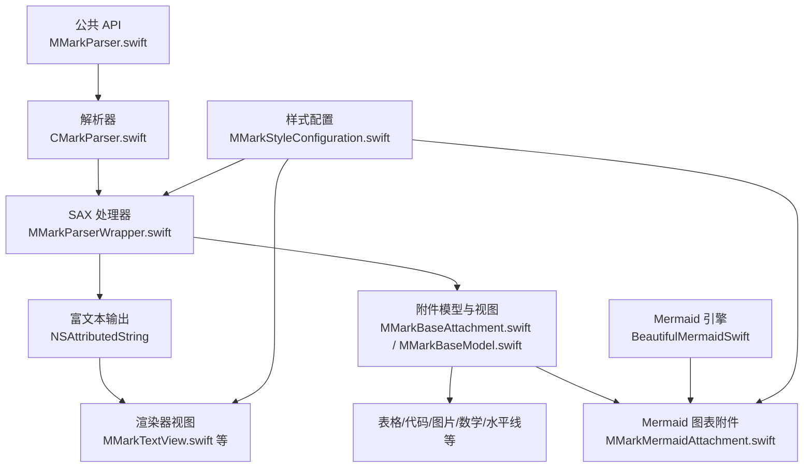
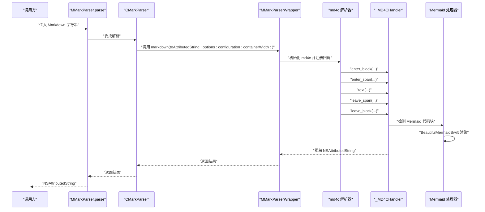
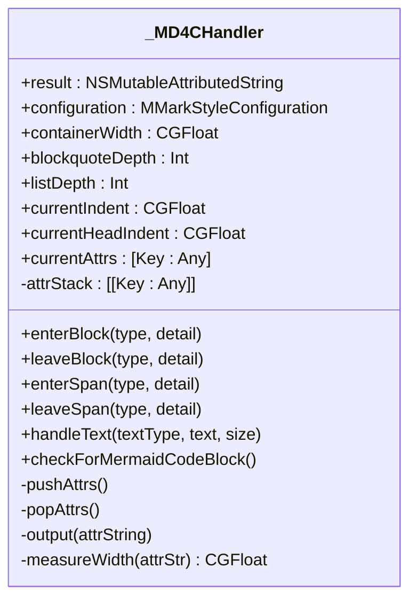
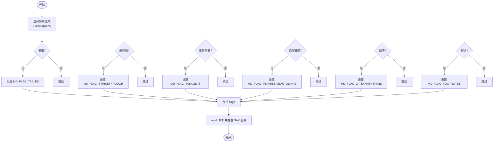
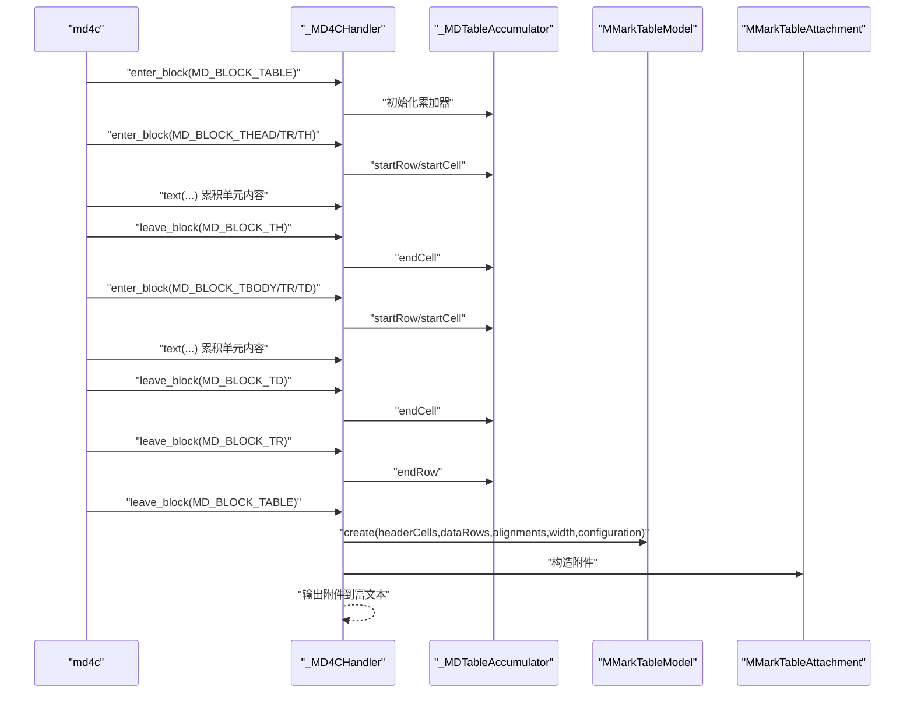
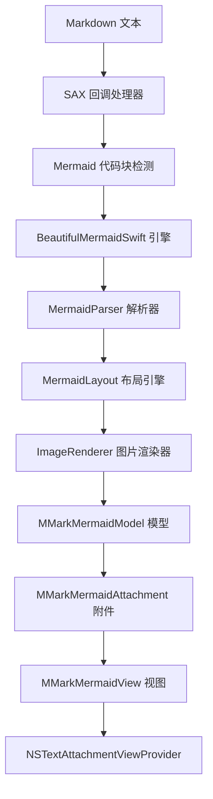
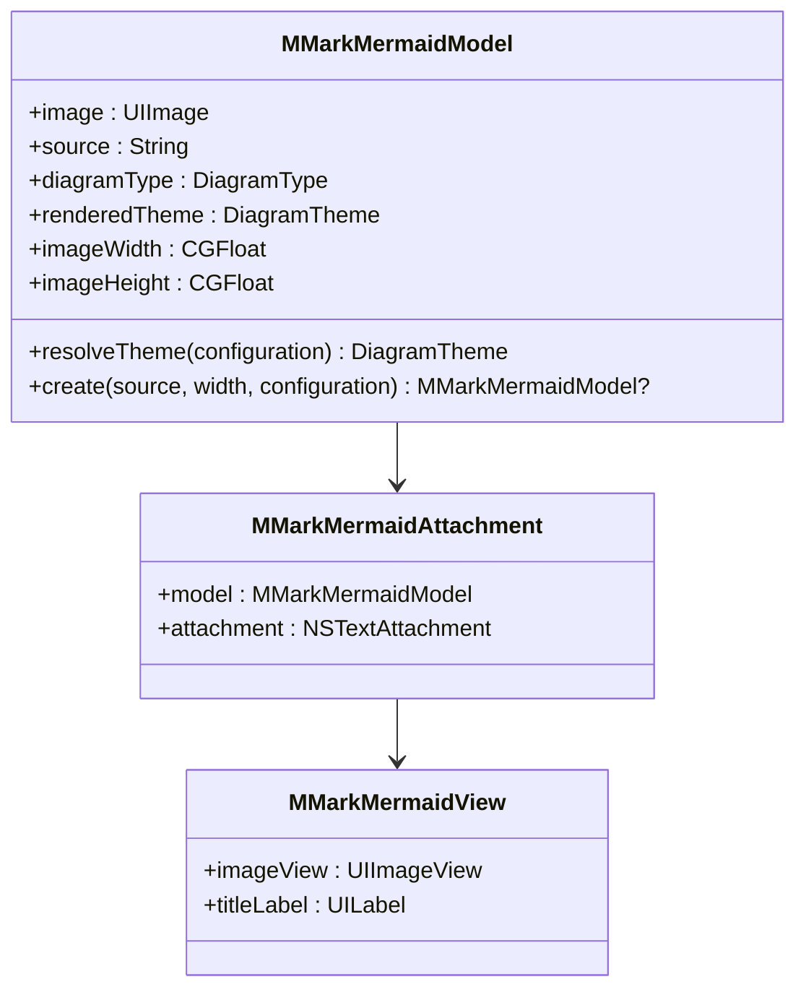
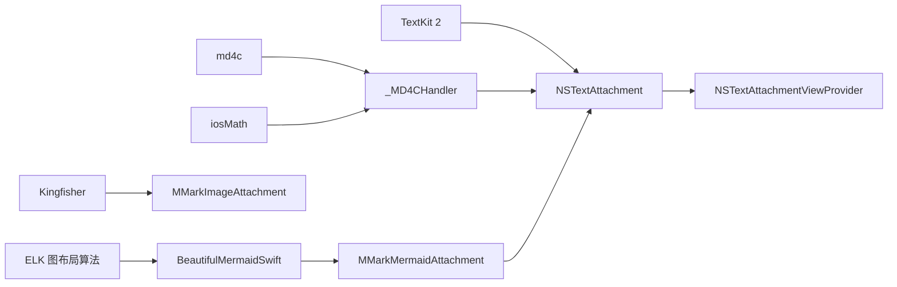

# 解析器架构设计

<cite>
**本文档引用的文件**
- [MMarkParser.swift](file://MMarkParser/Sources/MMarkParser.swift)
- [CMarkParser.swift](file://MMarkParser/Sources/Parser/CMarkParser.swift)
- [MMarkParserWrapper.swift](file://MMarkParser/Sources/Parser/MMarkParserWrapper.swift)
- [MMarkStyleConfiguration.swift](file://MMarkParser/Sources/Renderer/MMarkStyleConfiguration.swift)
- [MMarkTableModel.swift](file://MMarkParser/Sources/Renderer/Attachments/MMarkTableAttachment/MMarkTableModel.swift)
- [MMarkCodeBlockModel.swift](file://MMarkParser/Sources/Renderer/Attachments/MMarkCodeBlockAttachment/MMarkCodeBlockModel.swift)
- [MMarkImageModel.swift](file://MMarkParser/Sources/Renderer/Attachments/MMarkImageAttachment/MMarkImageModel.swift)
- [MMarkBaseAttachment.swift](file://MMarkParser/Sources/Renderer/Attachments/MMarkBaseAttachment/MMarkBaseAttachment.swift)
- [MMarkBaseModel.swift](file://MMarkParser/Sources/Renderer/Attachments/MMarkBaseAttachment/MMarkBaseModel.swift)
- [MMarkMermaidModel.swift](file://MMarkParser/Sources/Renderer/Attachments/MMarkMermaidAttachment/MMarkMermaidModel.swift)
- [MMarkMermaidAttachment.swift](file://MMarkParser/Sources/Renderer/Attachments/MMarkMermaidAttachment/MMarkMermaidAttachment.swift)
- [MMarkMermaidView.swift](file://MMarkParser/Sources/Renderer/Attachments/MMarkMermaidAttachment/MMarkMermaidView.swift)
- [MMarkMermaidViewProvider.swift](file://MMarkParser/Sources/Renderer/Attachments/MMarkMermaidAttachment/MMarkMermaidViewProvider.swift)
- [BeautifulMermaid.swift](file://MMarkParser/BeautifulMermaidSwift/BeautifulMermaid.swift)
- [MermaidParser.swift](file://MMarkParser/BeautifulMermaidSwift/MermaidParser.swift)
- [MermaidLayout.swift](file://MMarkParser/BeautifulMermaidSwift/MermaidLayout.swift)
- [README.md](file://README.md)
</cite>

## 目录
1. [简介](#简介)
2. [项目结构](#项目结构)
3. [核心组件](#核心组件)
4. [架构总览](#架构总览)
5. [详细组件分析](#详细组件分析)
6. [Mermaid图表解析器集成](#mermaid图表解析器集成)
7. [依赖关系分析](#依赖关系分析)
8. [性能考量](#性能考量)
9. [故障排查指南](#故障排查指南)
10. [结论](#结论)
11. [附录](#附录)

## 简介
本设计文档围绕基于 md4c 的 SAX 回调模型实现，系统性阐述 MMarkParser 的解析器架构与富文本生成机制。重点包括：
- 基于 md4c 的 SAX 回调：enter_block、leave_block、enter_span、leave_span、text 的工作机制
- 属性堆栈（attribute stacking）在嵌套元素中的样式传播
- GFM 扩展选项（表格、任务列表、自动链接、删除线、脚注、行内/块级数学）的配置与处理
- Mermaid 图表解析器集成与 BeautifulMermaidSwift 引擎交互机制
- 从 Markdown 文本到 NSAttributedString 的增量构建流程
- 解析流程图与回调序列图，帮助读者快速理解端到端数据流

## 项目结构
MMarkParser 采用模块化组织，核心由"解析器"和"渲染器"两大模块构成，并通过 TextKit 2 的附件机制渲染复杂元素。新增的 Mermaid 图表解析器作为独立模块集成其中。

**图表来源**
- [MMarkParser.swift:1-42](file://MMarkParser/Sources/MMarkParser.swift#L1-L42)
- [CMarkParser.swift:1-81](file://MMarkParser/Sources/Parser/CMarkParser.swift#L1-L81)
- [MMarkParserWrapper.swift:1376-1446](file://MMarkParser/Sources/Parser/MMarkParserWrapper.swift#L1376-L1446)
- [MMarkStyleConfiguration.swift:1-339](file://MMarkParser/Sources/Renderer/MMarkStyleConfiguration.swift#L1-L339)
- [MMarkMermaidAttachment.swift:1-100](file://MMarkParser/Sources/Renderer/Attachments/MMarkMermaidAttachment/MMarkMermaidAttachment.swift#L1-L100)

**章节来源**
- [README.md:108-237](file://README.md#L108-L237)

## 核心组件
- 公共 API：提供静态入口，封装底层解析细节，返回 NSAttributedString。
- 解析器：负责配置 md4c 的解析选项（flags），初始化 SAX 回调处理器。
- SAX 处理器：接收 md4c 的回调，维护状态机与属性堆栈，增量构建富文本。
- 样式配置：集中管理所有元素的字体、颜色、间距、圆角等外观参数。
- 附件模型与视图：复杂元素（表格、代码块、图片、数学公式、水平线、列表标记、Mermaid 图表）以附件形式插入富文本。
- Mermaid 图表解析器：独立的图表渲染模块，提供多种输出格式（图片、SVG、ASCII）。

**章节来源**
- [MMarkParser.swift:18-41](file://MMarkParser/Sources/MMarkParser.swift#L18-L41)
- [CMarkParser.swift:55-67](file://MMarkParser/Sources/Parser/CMarkParser.swift#L55-L67)
- [MMarkParserWrapper.swift:1376-1446](file://MMarkParser/Sources/Parser/MMarkParserWrapper.swift#L1376-L1446)
- [MMarkStyleConfiguration.swift:189-339](file://MMarkParser/Sources/Renderer/MMarkStyleConfiguration.swift#L189-L339)

## 架构总览
SAX 回调驱动的增量解析流程如下：

**图表来源**
- [MMarkParser.swift:18-26](file://MMarkParser/Sources/MMarkParser.swift#L18-L26)
- [CMarkParser.swift:55-67](file://MMarkParser/Sources/Parser/CMarkParser.swift#L55-L67)
- [MMarkParserWrapper.swift:1392-1444](file://MMarkParser/Sources/Parser/MMarkParserWrapper.swift#L1392-L1444)
- [MMarkParserWrapper.swift:1319-1370](file://MMarkParser/Sources/Parser/MMarkParserWrapper.swift#L1319-L1370)

## 详细组件分析

### SAX 回调处理器：_MD4CHandler
_MD4CHandler 是 SAX 回调的唯一处理中心，负责：
- 维护富文本输出缓冲区与当前属性字典
- 维护属性堆栈，确保嵌套结构的样式正确传播
- 维护块级/行内状态（如列表深度、引用块深度、代码块、表格单元、脚注收集等）
- 将 md4c 的回调转换为 NSAttributedString 的增量更新
- **新增**：检测并处理 Mermaid 代码块，调用 BeautifulMermaidSwift 引擎进行渲染

**图表来源**
- [MMarkParserWrapper.swift:18-1267](file://MMarkParser/Sources/Parser/MMarkParserWrapper.swift#L18-L1267)

**章节来源**
- [MMarkParserWrapper.swift:18-1267](file://MMarkParser/Sources/Parser/MMarkParserWrapper.swift#L18-L1267)

### 回调函数工作机制
- enter_block/leave_block：用于处理块级元素（标题、段落、列表、表格、代码块、水平线、脚注等）。进入时压入属性，离开时弹出并输出最终富文本。
- enter_span/leave_span：用于处理行内元素（粗体、斜体、删除线、链接、图片、行内代码、脚注引用、数学等）。进入时压入属性，离开时弹出。
- text：处理普通文本、代码文本、换行、实体解码、行内/块级数学等。
- **新增**：Mermaid 代码块检测与处理，在合适的回调时机调用 BeautifulMermaidSwift 进行渲染。

**章节来源**
- [MMarkParserWrapper.swift:134-644](file://MMarkParser/Sources/Parser/MMarkParserWrapper.swift#L134-L644)
- [MMarkParserWrapper.swift:648-828](file://MMarkParser/Sources/Parser/MMarkParserWrapper.swift#L648-L828)
- [MMarkParserWrapper.swift:837-906](file://MMarkParser/Sources/Parser/MMarkParserWrapper.swift#L837-L906)

### 属性堆栈（Attribute Stacking）与样式传播
- pushAttrs/popAttrs：在进入/离开任意元素时保存/恢复当前属性上下文，保证嵌套结构的样式继承（如引用块内的粗体、斜体、链接颜色等）。
- 当前属性 currentAttrs：实时反映当前元素的字体、颜色、段落样式、链接、脚注键值等。
- 块级与行内元素的属性隔离：块级元素通常设置段落样式与首行缩进；行内元素只设置字体与装饰属性。

**章节来源**
- [MMarkParserWrapper.swift:46-55](file://MMarkParser/Sources/Parser/MMarkParserWrapper.swift#L46-L55)
- [MMarkParserWrapper.swift:320-367](file://MMarkParser/Sources/Parser/MMarkParserWrapper.swift#L320-L367)
- [MMarkParserWrapper.swift:648-765](file://MMarkParser/Sources/Parser/MMarkParserWrapper.swift#L648-L765)

### GFM 扩展选项与处理
CMarkParser 提供一组可组合的解析选项，对应 md4c 的 flags：
- 表格：启用 GFM 表格支持
- 删除线：启用 GFM 删除线
- 任务列表：启用 GFM 任务列表（含勾选状态）
- 自动链接：启用 URL、邮箱、www 的自动识别
- 行内/块级数学：启用 LaTeX 数学（$...$ 与 $$...$$）
- 脚注：启用 GFM 脚注（定义与引用）

**图表来源**
- [CMarkParser.swift:14-47](file://MMarkParser/Sources/Parser/CMarkParser.swift#L14-L47)
- [CMarkParser.swift:71-81](file://MMarkParser/Sources/Parser/CMarkParser.swift#L71-L81)

**章节来源**
- [CMarkParser.swift:14-47](file://MMarkParser/Sources/Parser/CMarkParser.swift#L14-L47)
- [CMarkParser.swift:55-67](file://MMarkParser/Sources/Parser/CMarkParser.swift#L55-L67)

### 表格渲染（GFM 表格）
- 表格解析：通过 enter_block(MD_BLOCK_TABLE/_THEAD/_TBODY/_TR/_TH/_TD) 与 text 回调累积行列与对齐信息。
- 表格模型：计算列宽、行高、对齐方式，生成 MMarkTableModel。
- 附件渲染：MMarkTableAttachment 作为 NSTextAttachment 插入富文本，配合 MMarkTableViewProvider 渲染。

**图表来源**
- [MMarkParserWrapper.swift:389-430](file://MMarkParser/Sources/Parser/MMarkParserWrapper.swift#L389-L430)
- [MMarkParserWrapper.swift:589-632](file://MMarkParser/Sources/Parser/MMarkParserWrapper.swift#L589-L632)
- [MMarkParserWrapper.swift:1272-1315](file://MMarkParser/Sources/Parser/MMarkParserWrapper.swift#L1272-L1315)
- [MMarkTableModel.swift:27-75](file://MMarkParser/Sources/Renderer/Attachments/MMarkTableAttachment/MMarkTableModel.swift#L27-L75)

**章节来源**
- [MMarkParserWrapper.swift:389-632](file://MMarkParser/Sources/Parser/MMarkParserWrapper.swift#L389-L632)
- [MMarkParserWrapper.swift:1272-1315](file://MMarkParser/Sources/Parser/MMarkParserWrapper.swift#L1272-L1315)
- [MMarkTableModel.swift:27-75](file://MMarkParser/Sources/Renderer/Attachments/MMarkTableAttachment/MMarkTableModel.swift#L27-L75)

### 任务列表与有序/无序列表
- 任务列表：LI 的 detail 中包含 is_task 与 task_mark（勾选状态），渲染为自定义符号或图片标记。
- 有序列表：维护计数器，按层级选择不同标记字符或图片。
- 无序列表：按层级选择不同标记字符或图片。
- 缩进与段落样式：根据列表深度与标记宽度动态计算首行缩进与整体缩进。

**章节来源**
- [MMarkParserWrapper.swift:183-321](file://MMarkParser/Sources/Parser/MMarkParserWrapper.swift#L183-L321)

### 自动链接与删除线
- 自动链接：当启用 autolinks 时，URL、邮箱、www 形式会被识别为链接，进入 A 回调后设置链接属性。
- 删除线：进入 DEL 回调时设置删除线样式与颜色。

**章节来源**
- [CMarkParser.swift:24-34](file://MMarkParser/Sources/Parser/CMarkParser.swift#L24-L34)
- [MMarkParserWrapper.swift:677-681](file://MMarkParser/Sources/Parser/MMarkParserWrapper.swift#L677-L681)

### 行内/块级数学（LaTeX）
- 行内数学：进入 SPAN_LATEXMATH 或 SPAN_LATEXMATH_DISPLAY 时切换 isDisplayMath 标志；text 回调中根据标志决定渲染为行内图片或块级附件。
- 化学式转换：将 \ce 与 \chemfig 转换为标准 LaTeX，再交由 iosMath 渲染。
- 块级数学：leave_span 后输出 MMarkMathBlockAttachment。

**章节来源**
- [MMarkParserWrapper.swift:756-758](file://MMarkParser/Sources/Parser/MMarkParserWrapper.swift#L756-L758)
- [MMarkParserWrapper.swift:878-887](file://MMarkParser/Sources/Parser/MMarkParserWrapper.swift#L878-L887)
- [MMarkParserWrapper.swift:908-1194](file://MMarkParser/Sources/Parser/MMarkParserWrapper.swift#L908-L1194)

### 图片与代码块
- 图片：IMG 回调中缓存 alt 与 src；leave 时根据上下文决定输出原始语法或渲染为 MMarkImageAttachment。
- 代码块：CODE 回调中缓存语言与内容；leave 时渲染为 MMarkCodeBlockAttachment。

**章节来源**
- [MMarkParserWrapper.swift:709-828](file://MMarkParser/Sources/Parser/MMarkParserWrapper.swift#L709-L828)
- [MMarkParserWrapper.swift:369-584](file://MMarkParser/Sources/Parser/MMarkParserWrapper.swift#L369-L584)
- [MMarkImageModel.swift:20-25](file://MMarkParser/Sources/Renderer/Attachments/MMarkImageAttachment/MMarkImageModel.swift#L20-L25)
- [MMarkCodeBlockModel.swift:22-44](file://MMarkParser/Sources/Renderer/Attachments/MMarkCodeBlockAttachment/MMarkCodeBlockModel.swift#L22-L44)

### 脚注（GFM）
- 脚注定义：进入 FOOTNOTE_DEF 时设置 isInsideFootnoteDef 与标签；离开时输出回链。
- 脚注引用：进入 FOOTNOTE_REF 时输出引用文本并设置链接目标。
- 收集与拼接：解析结束后将脚注缓冲追加到文档末尾。

**章节来源**
- [MMarkParserWrapper.swift:433-479](file://MMarkParser/Sources/Parser/MMarkParserWrapper.swift#L433-L479)
- [MMarkParserWrapper.swift:530-547](file://MMarkParser/Sources/Parser/MMarkParserWrapper.swift#L530-L547)
- [MMarkParserWrapper.swift:735-751](file://MMarkParser/Sources/Parser/MMarkParserWrapper.swift#L735-L751)
- [MMarkParserWrapper.swift:813-817](file://MMarkParser/Sources/Parser/MMarkParserWrapper.swift#L813-L817)
- [MMarkParserWrapper.swift:1438-1441](file://MMarkParser/Sources/Parser/MMarkParserWrapper.swift#L1438-L1441)

### 样式配置与主题
- 样式配置集中于 MMarkStyleConfiguration，涵盖标题、段落、代码、链接、删除线、引用块、表格、任务列表、数学、脚注等。
- **新增**：Mermaid 图表样式配置，包括自动暗黑模式、主题设置、内边距、头部高度等。
- 默认 GFM 样式提供开箱即用的视觉风格，支持自定义字体、颜色、圆角、间距等。

**章节来源**
- [MMarkStyleConfiguration.swift:189-339](file://MMarkParser/Sources/Renderer/MMarkStyleConfiguration.swift#L189-L339)

## Mermaid图表解析器集成

### 集成架构概述
MMarkParser 新增了对 Mermaid 图表的完整支持，通过 BeautifulMermaidSwift 引擎实现多种图表类型的渲染。整个集成遵循以下架构模式：

**图表来源**
- [MMarkParserWrapper.swift:1319-1370](file://MMarkParser/Sources/Parser/MMarkParserWrapper.swift#L1319-L1370)
- [MMarkMermaidModel.swift:95-130](file://MMarkParser/Sources/Renderer/Attachments/MMarkMermaidAttachment/MMarkMermaidModel.swift#L95-L130)
- [BeautifulMermaid.swift:161-184](file://MMarkParser/BeautifulMermaidSwift/BeautifulMermaid.swift#L161-L184)

### Mermaid 代码块检测机制
在 SAX 回调处理过程中，_MD4CHandler 会在适当的时机检测 Mermaid 代码块：

1. **代码块识别**：通过 CODE 回调检测代码块内容
2. **图表类型检测**：调用 `detectDiagramType()` 分析图表类型
3. **渲染引擎调用**：使用 BeautifulMermaidSwift 的渲染方法
4. **附件创建**：生成 MMarkMermaidAttachment 并插入富文本

**章节来源**
- [MMarkParserWrapper.swift:1319-1370](file://MMarkParser/Sources/Parser/MMarkParserWrapper.swift#L1319-L1370)

### BeautifulMermaidSwift 引擎交互
BeautifulMermaidSwift 提供了完整的 Mermaid 图表渲染能力：

- **解析功能**：`parseMermaid()` 方法解析 Mermaid 语法
- **多格式渲染**：支持图片、SVG、ASCII 三种输出格式
- **主题系统**：内置多种图表主题，支持自定义配置
- **布局优化**：集成 ELK 图布局算法，提供高质量图表布局

**章节来源**
- [BeautifulMermaid.swift:161-184](file://MMarkParser/BeautifulMermaidSwift/BeautifulMermaid.swift#L161-L184)

### Mermaid 模型与附件系统
MMarkMermaidModel 负责 Mermaid 图表的完整生命周期管理：

**图表来源**
- [MMarkMermaidModel.swift:1-130](file://MMarkParser/Sources/Renderer/Attachments/MMarkMermaidAttachment/MMarkMermaidModel.swift#L1-L130)
- [MMarkMermaidAttachment.swift:1-100](file://MMarkParser/Sources/Renderer/Attachments/MMarkMermaidAttachment/MMarkMermaidAttachment.swift#L1-L100)
- [MMarkMermaidView.swift:1-80](file://MMarkParser/Sources/Renderer/Attachments/MMarkMermaidAttachment/MMarkMermaidView.swift#L1-L80)

### Mermaid 样式配置
Mermaid 图表支持丰富的样式配置选项：

- **自动暗黑模式**：根据系统主题自动切换图表主题
- **自定义主题**：支持 Light、Dark、ForestGreen 等预设主题
- **内边距设置**：可配置图表周围的空白区域
- **头部高度**：控制图表标题栏的高度
- **渲染比例**：支持高分辨率图片渲染

**章节来源**
- [MMarkMermaidModel.swift:31-35](file://MMarkParser/Sources/Renderer/Attachments/MMarkMermaidAttachment/MMarkMermaidModel.swift#L31-L35)
- [MMarkMermaidModel.swift:104-114](file://MMarkParser/Sources/Renderer/Attachments/MMarkMermaidAttachment/MMarkMermaidModel.swift#L104-L114)

## 依赖关系分析
- md4c：SAX 解析引擎，提供回调接口。
- iosMath：LaTeX 数学渲染。
- Kingfisher：远程图片加载（在图片附件中使用）。
- **新增**：BeautifulMermaidSwift：Mermaid 图表渲染引擎，依赖 ELK 图布局算法。
- TextKit 2：富文本布局与附件视图提供者。

**图表来源**
- [README.md:36-40](file://README.md#L36-L40)
- [MMarkBaseAttachment.swift:32-58](file://MMarkParser/Sources/Renderer/Attachments/MMarkBaseAttachment/MMarkBaseAttachment.swift#L32-L58)
- [BeautifulMermaid.swift:161-184](file://MMarkParser/BeautifulMermaidSwift/BeautifulMermaid.swift#L161-L184)

**章节来源**
- [README.md:36-40](file://README.md#L36-L40)
- [MMarkBaseAttachment.swift:32-58](file://MMarkParser/Sources/Renderer/Attachments/MMarkBaseAttachment/MMarkBaseAttachment.swift#L32-L58)

## 性能考量
- 增量构建：SAX 模型在解析过程中即时构建富文本，避免中间 AST 结构，内存占用低、延迟小。
- 附件懒加载：NSTextAttachmentViewProvider 在需要时创建视图，减少初始渲染成本。
- 行内数学渲染：优先使用 iosMath 渲染为图片，必要时回退为纯文本，平衡质量与性能。
- **新增**：Mermaid 图表渲染优化：仅在检测到 Mermaid 代码块时才调用渲染引擎，避免不必要的性能开销。
- **新增**：图片缓存：Mermaid 图表渲染结果可以被缓存，避免重复渲染相同图表。
- 容器宽度约束：有效宽度最小值保护，避免深嵌套导致的负尺寸问题。

## 故障排查指南
- 解析失败：检查 md4c 返回码，查看 lastError；确认输入非空且选项合法。
- 回调异常：确认回调指针注册成功，userdata 正确传递。
- 数学渲染失败：检查 iosMath 字体与资源是否加载；若渲染为空则回退为文本。
- 图片加载失败：检查 URL 与网络权限；确认 Kingfisher 配置正确。
- **新增**：Mermaid 图表渲染失败：检查 BeautifulMermaidSwift 引擎是否正确初始化；确认 Mermaid 语法格式正确。
- **新增**：ELK 布局算法错误：检查图表复杂度，适当调整布局参数或简化图表结构。
- 脚注未显示：确认已启用脚注选项并在解析结束后追加脚注缓冲。

**章节来源**
- [MMarkParserWrapper.swift:1381-1431](file://MMarkParser/Sources/Parser/MMarkParserWrapper.swift#L1381-L1431)
- [MMarkParserWrapper.swift:1150-1194](file://MMarkParser/Sources/Parser/MMarkParserWrapper.swift#L1150-L1194)

## 结论
MMarkParser 通过 md4c 的 SAX 回调模型实现了高性能、可扩展的 Markdown 到富文本转换。其核心优势在于：
- 增量构建与属性堆栈确保嵌套样式的正确传播
- GFM 扩展选项灵活组合，覆盖主流 Markdown 增强语法
- **新增**：Mermaid 图表解析器集成，提供完整的图表渲染能力
- 附件机制将复杂元素（表格、代码块、图片、数学、脚注、Mermaid 图表）统一纳入 TextKit 2 布局体系
- 样式配置集中化，便于定制与主题化

**更新** 新增的 Mermaid 图表支持进一步增强了 MMarkParser 的功能完整性，使其能够处理现代文档中常见的图表需求。

## 附录
- 使用示例与自定义样式参考 README 快速开始与样式配置章节。
- 附件基类与模型定义位于 MMarkBaseAttachment 与 MMarkBaseModel。
- **新增**：Mermaid 图表渲染配置与主题设置参考 MMarkMermaidModel 的样式配置方法。

**章节来源**
- [README.md:41-85](file://README.md#L41-L85)
- [MMarkBaseAttachment.swift:12-58](file://MMarkParser/Sources/Renderer/Attachments/MMarkBaseAttachment/MMarkBaseAttachment.swift#L12-L58)
- [MMarkBaseModel.swift:3-9](file://MMarkParser/Sources/Renderer/Attachments/MMarkBaseAttachment/MMarkBaseModel.swift#L3-L9)
- [MMarkMermaidModel.swift:31-35](file://MMarkParser/Sources/Renderer/Attachments/MMarkMermaidAttachment/MMarkMermaidModel.swift#L31-L35)