# 附件系统架构设计

<cite>
**本文引用的文件**
- [MMarkBaseAttachment.swift](file://MMarkParser/Sources/Renderer/Attachments/MMarkBaseAttachment/MMarkBaseAttachment.swift)
- [MMarkBaseModel.swift](file://MMarkParser/Sources/Renderer/Attachments/MMarkBaseAttachment/MMarkBaseModel.swift)
- [MMarkCodeBlockAttachment.swift](file://MMarkParser/Sources/Renderer/Attachments/MMarkCodeBlockAttachment/MMarkCodeBlockAttachment.swift)
- [MMarkCodeBlockModel.swift](file://MMarkParser/Sources/Renderer/Attachments/MMarkCodeBlockAttachment/MMarkCodeBlockModel.swift)
- [MMarkCodeBlockView.swift](file://MMarkParser/Sources/Renderer/Attachments/MMarkCodeBlockAttachment/MMarkCodeBlockView.swift)
- [MMarkCodeBlockViewProvider.swift](file://MMarkParser/Sources/Renderer/Attachments/MMarkCodeBlockAttachment/MMarkCodeBlockViewProvider.swift)
- [MMarkImageAttachment.swift](file://MMarkParser/Sources/Renderer/Attachments/MMarkImageAttachment/MMarkImageAttachment.swift)
- [MMarkImageModel.swift](file://MMarkParser/Sources/Renderer/Attachments/MMarkImageAttachment/MMarkImageModel.swift)
- [MMarkImageView.swift](file://MMarkParser/Sources/Renderer/Attachments/MMarkImageAttachment/MMarkImageView.swift)
- [MMarkHorizontalRuleAttachment.swift](file://MMarkParser/Sources/Renderer/Attachments/MMarkHorizontalRuleAttachment/MMarkHorizontalRuleAttachment.swift)
- [MMarkHorizontalRuleModel.swift](file://MMarkParser/Sources/Renderer/Attachments/MMarkHorizontalRuleAttachment/MMarkHorizontalRuleModel.swift)
- [MMarkHorizontalRuleView.swift](file://MMarkParser/Sources/Renderer/Attachments/MMarkHorizontalRuleAttachment/MMarkHorizontalRuleView.swift)
- [MMarkHorizontalRuleViewProvider.swift](file://MMarkParser/Sources/Renderer/Attachments/MMarkHorizontalRuleAttachment/MMarkHorizontalRuleViewProvider.swift)
- [MMarkListMarkerAttachment.swift](file://MMarkParser/Sources/Renderer/Attachments/MMarkListMarkerAttachment/MMarkListMarkerAttachment.swift)
- [MMarkListMarkerModel.swift](file://MMarkParser/Sources/Renderer/Attachments/MMarkListMarkerAttachment/MMarkListMarkerModel.swift)
- [MMarkMermaidAttachment.swift](file://MMarkParser/Sources/Renderer/Attachments/MMarkMermaidAttachment/MMarkMermaidAttachment.swift)
- [MMarkMermaidModel.swift](file://MMarkParser/Sources/Renderer/Attachments/MMarkMermaidAttachment/MMarkMermaidModel.swift)
- [MMarkMermaidView.swift](file://MMarkParser/Sources/Renderer/Attachments/MMarkMermaidAttachment/MMarkMermaidView.swift)
- [MMarkMermaidViewProvider.swift](file://MMarkParser/Sources/Renderer/Attachments/MMarkMermaidAttachment/MMarkMermaidViewProvider.swift)
- [MMarkMathBlockAttachment.swift](file://MMarkParser/Sources/Renderer/Attachments/MMarkMathBlockAttachment/MMarkMathBlockAttachment.swift)
- [MMarkMathBlockModel.swift](file://MMarkParser/Sources/Renderer/Attachments/MMarkMathBlockAttachment/MMarkMathBlockModel.swift)
- [MMarkMathBlockView.swift](file://MMarkParser/Sources/Renderer/Attachments/MMarkMathBlockAttachment/MMarkMathBlockView.swift)
- [MMarkMathBlockViewProvider.swift](file://MMarkParser/Sources/Renderer/Attachments/MMarkMathBlockAttachment/MMarkMathBlockViewProvider.swift)
- [MMarkTableAttachment.swift](file://MMarkParser/Sources/Renderer/Attachments/MMarkTableAttachment/MMarkTableAttachment.swift)
- [MMarkTableModel.swift](file://MMarkParser/Sources/Renderer/Attachments/MMarkTableAttachment/MMarkTableModel.swift)
- [MMarkTableView.swift](file://MMarkParser/Sources/Renderer/Attachments/MMarkTableAttachment/MMarkTableView.swift)
- [MMarkTableViewProvider.swift](file://MMarkParser/Sources/Renderer/Attachments/MMarkTableAttachment/MMarkTableViewProvider.swift)
</cite>

## 目录
1. [简介](#简介)
2. [项目结构](#项目结构)
3. [核心组件](#核心组件)
4. [架构总览](#架构总览)
5. [详细组件分析](#详细组件分析)
6. [Mermaid附件类型架构](#mermaid附件类型架构)
7. [依赖关系分析](#依赖关系分析)
8. [性能考量](#性能考量)
9. [故障排查指南](#故障排查指南)
10. [结论](#结论)
11. [附录](#附录)

## 简介
本文件面向MMarkParser的附件系统，聚焦于基于MMarkBaseAttachment的可扩展附件设计模式，系统性阐述附件模型（MMarkBaseModel）的数据与视图分离理念，详解附件生命周期（创建、配置、渲染），以及与TextKit 2的集成方式（通过NSTextAttachment实现复杂内容的嵌入式渲染）。本次更新特别增加了Mermaid附件类型的架构说明，展示如何通过统一接口设计支持多种附件类型的扩展。文末提供架构图与扩展机制设计图，帮助开发者快速上手并安全地扩展自定义附件类型。

## 项目结构
附件系统位于渲染层的"Attachments"目录下，采用"按功能域分层"的组织方式：
- 基类层：MMarkBaseAttachment、MMarkBaseModel
- 具体附件类型：代码块、水平分割线、图片、列表标记、数学公式、表格、Mermaid图等
- 视图提供者：每个附件类型配套一个NSTextAttachmentViewProvider，负责在TextKit 2中创建对应视图
- 视图层：每个附件类型配套一个UIView子类，承载UI绘制与交互

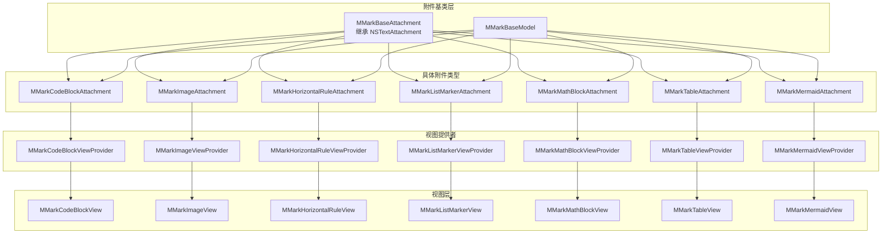

**图表来源**
- [MMarkBaseAttachment.swift:12-59](file://MMarkParser/Sources/Renderer/Attachments/MMarkBaseAttachment/MMarkBaseAttachment.swift#L12-L59)
- [MMarkBaseModel.swift:3-9](file://MMarkParser/Sources/Renderer/Attachments/MMarkBaseAttachment/MMarkBaseModel.swift#L3-L9)
- [MMarkCodeBlockAttachment.swift:6-21](file://MMarkParser/Sources/Renderer/Attachments/MMarkCodeBlockAttachment/MMarkCodeBlockAttachment.swift#L6-L21)
- [MMarkImageAttachment.swift:5-22](file://MMarkParser/Sources/Renderer/Attachments/MMarkImageAttachment/MMarkImageAttachment.swift#L5-L22)
- [MMarkHorizontalRuleAttachment.swift:6-37](file://MMarkParser/Sources/Renderer/Attachments/MMarkHorizontalRuleAttachment/MMarkHorizontalRuleAttachment.swift#L6-L37)
- [MMarkListMarkerAttachment.swift:5-17](file://MMarkParser/Sources/Renderer/Attachments/MMarkListMarkerAttachment/MMarkListMarkerAttachment.swift#L5-L17)
- [MMarkMathBlockAttachment.swift:6-21](file://MMarkParser/Sources/Renderer/Attachments/MMarkMathBlockAttachment/MMarkMathBlockAttachment.swift#L6-L21)
- [MMarkTableAttachment.swift:6-21](file://MMarkParser/Sources/Renderer/Attachments/MMarkTableAttachment/MMarkTableAttachment.swift#L6-L21)
- [MMarkMermaidAttachment.swift:6-21](file://MMarkParser/Sources/Renderer/Attachments/MMarkMermaidAttachment/MMarkMermaidAttachment.swift#L6-L21)

**章节来源**
- [MMarkBaseAttachment.swift:12-59](file://MMarkParser/Sources/Renderer/Attachments/MMarkBaseAttachment/MMarkBaseAttachment.swift#L12-L59)
- [MMarkBaseModel.swift:3-9](file://MMarkParser/Sources/Renderer/Attachments/MMarkBaseAttachment/MMarkBaseModel.swift#L3-L9)

## 核心组件
- MMarkBaseAttachment：所有附件类型的抽象基类，继承自NSTextAttachment，统一持有contentModel与attachmentType，并在viewProvider(for:location:textContainer:)中根据类型动态选择对应的NSTextAttachmentViewProvider。
- MMarkBaseModel：数据模型基类，封装尺寸信息，作为各附件类型的"数据载体"，与视图层解耦。
- 各附件类型：如MMarkCodeBlockAttachment、MMarkImageAttachment、MMarkHorizontalRuleAttachment、MMarkListMarkerAttachment、MMarkMermaidAttachment等，均继承自MMarkBaseAttachment，覆盖attachmentBounds计算逻辑以适配不同渲染需求。
- 视图提供者：如MMarkCodeBlockViewProvider、MMarkHorizontalRuleViewProvider等，负责在TextKit 2布局阶段创建对应UIView实例，并设置tracksTextAttachmentViewBounds以参与布局约束跟踪。
- 视图层：如MMarkCodeBlockView、MMarkImageView、MMarkHorizontalRuleView等，承载UI绘制、交互与样式配置。

**章节来源**
- [MMarkBaseAttachment.swift:12-59](file://MMarkParser/Sources/Renderer/Attachments/MMarkBaseAttachment/MMarkBaseAttachment.swift#L12-L59)
- [MMarkBaseModel.swift:3-9](file://MMarkParser/Sources/Renderer/Attachments/MMarkBaseAttachment/MMarkBaseModel.swift#L3-L9)
- [MMarkCodeBlockAttachment.swift:6-21](file://MMarkParser/Sources/Renderer/Attachments/MMarkCodeBlockAttachment/MMarkCodeBlockAttachment.swift#L6-L21)
- [MMarkImageAttachment.swift:5-22](file://MMarkParser/Sources/Renderer/Attachments/MMarkImageAttachment/MMarkImageAttachment.swift#L5-L22)
- [MMarkHorizontalRuleAttachment.swift:6-37](file://MMarkParser/Sources/Renderer/Attachments/MMarkHorizontalRuleAttachment/MMarkHorizontalRuleAttachment.swift#L6-L37)
- [MMarkListMarkerAttachment.swift:5-17](file://MMarkParser/Sources/Renderer/Attachments/MMarkListMarkerAttachment/MMarkListMarkerAttachment.swift#L5-L17)
- [MMarkMermaidAttachment.swift:6-21](file://MMarkParser/Sources/Renderer/Attachments/MMarkMermaidAttachment/MMarkMermaidAttachment.swift#L6-L21)

## 架构总览
附件系统遵循"数据模型与视图分离"的架构原则：
- 数据模型（MMarkBaseModel及其子类）仅负责描述内容与度量信息，不直接参与UI绘制。
- 视图提供者（NSTextAttachmentViewProvider子类）在TextKit 2布局时创建视图实例，并将模型注入视图。
- 视图层（UIView子类）负责UI绘制、交互与样式，通过约束与内在尺寸参与TextKit 2的布局计算。

```mermaid
classDiagram
class MMarkBaseAttachment {
+attachmentType : MMarkAttachmentType
+contentModel : MMarkBaseModel
+viewProvider : NSTextAttachmentViewProvider?
+viewProvider(for,parentView,location,textContainer)
}
class MMarkBaseModel {
+size : CGSize
}
class MMarkCodeBlockAttachment
class MMarkImageAttachment
class MMarkHorizontalRuleAttachment
class MMarkListMarkerAttachment
class MMarkMathBlockAttachment
class MMarkTableAttachment
class MMarkMermaidAttachment
class MMarkCodeBlockModel
class MMarkImageModel
class MMarkHorizontalRuleModel
class MMarkListMarkerModel
class MMarkMathBlockModel
class MMarkTableModel
class MMarkMermaidModel
class MMarkCodeBlockViewProvider
class MMarkHorizontalRuleViewProvider
class MMarkCodeBlockView
class MMarkImageView
class MMarkHorizontalRuleView
class MMarkMermaidViewProvider
class MMarkMermaidView
MMarkBaseAttachment <|-- MMarkCodeBlockAttachment
MMarkBaseAttachment <|-- MMarkImageAttachment
MMarkBaseAttachment <|-- MMarkHorizontalRuleAttachment
MMarkBaseAttachment <|-- MMarkListMarkerAttachment
MMarkBaseAttachment <|-- MMarkMathBlockAttachment
MMarkBaseAttachment <|-- MMarkTableAttachment
MMarkBaseAttachment <|-- MMarkMermaidAttachment
MMarkBaseModel <|-- MMarkCodeBlockModel
MMarkBaseModel <|-- MMarkImageModel
MMarkBaseModel <|-- MMarkHorizontalRuleModel
MMarkBaseModel <|-- MMarkListMarkerModel
MMarkBaseModel <|-- MMarkMathBlockModel
MMarkBaseModel <|-- MMarkTableModel
MMarkBaseModel <|-- MMarkMermaidModel
MMarkCodeBlockAttachment --> MMarkCodeBlockViewProvider : "使用"
MMarkHorizontalRuleAttachment --> MMarkHorizontalRuleViewProvider : "使用"
MMarkMermaidAttachment --> MMarkMermaidViewProvider : "使用"
MMarkCodeBlockViewProvider --> MMarkCodeBlockView : "创建"
MMarkHorizontalRuleViewProvider --> MMarkHorizontalRuleView : "创建"
MMarkMermaidViewProvider --> MMarkMermaidView : "创建"
```

**图表来源**
- [MMarkBaseAttachment.swift:12-59](file://MMarkParser/Sources/Renderer/Attachments/MMarkBaseAttachment/MMarkBaseAttachment.swift#L12-L59)
- [MMarkBaseModel.swift:3-9](file://MMarkParser/Sources/Renderer/Attachments/MMarkBaseAttachment/MMarkBaseModel.swift#L3-L9)
- [MMarkCodeBlockAttachment.swift:6-21](file://MMarkParser/Sources/Renderer/Attachments/MMarkCodeBlockAttachment/MMarkCodeBlockAttachment.swift#L6-L21)
- [MMarkImageAttachment.swift:5-22](file://MMarkParser/Sources/Renderer/Attachments/MMarkImageAttachment/MMarkImageAttachment.swift#L5-L22)
- [MMarkHorizontalRuleAttachment.swift:6-37](file://MMarkParser/Sources/Renderer/Attachments/MMarkHorizontalRuleAttachment/MMarkHorizontalRuleAttachment.swift#L6-L37)
- [MMarkListMarkerAttachment.swift:5-17](file://MMarkParser/Sources/Renderer/Attachments/MMarkListMarkerAttachment/MMarkListMarkerAttachment.swift#L5-L17)
- [MMarkMathBlockAttachment.swift:6-21](file://MMarkParser/Sources/Renderer/Attachments/MMarkMathBlockAttachment/MMarkMathBlockAttachment.swift#L6-L21)
- [MMarkTableAttachment.swift:6-21](file://MMarkParser/Sources/Renderer/Attachments/MMarkTableAttachment/MMarkTableAttachment.swift#L6-L21)
- [MMarkMermaidAttachment.swift:6-21](file://MMarkParser/Sources/Renderer/Attachments/MMarkMermaidAttachment/MMarkMermaidAttachment.swift#L6-L21)
- [MMarkCodeBlockModel.swift:6-45](file://MMarkParser/Sources/Renderer/Attachments/MMarkCodeBlockAttachment/MMarkCodeBlockModel.swift#L6-L45)
- [MMarkImageModel.swift:6-26](file://MMarkParser/Sources/Renderer/Attachments/MMarkImageAttachment/MMarkImageModel.swift#L6-L26)
- [MMarkHorizontalRuleModel.swift:6-26](file://MMarkParser/Sources/Renderer/Attachments/MMarkHorizontalRuleAttachment/MMarkHorizontalRuleModel.swift#L6-L26)
- [MMarkListMarkerModel.swift:6-15](file://MMarkParser/Sources/Renderer/Attachments/MMarkListMarkerAttachment/MMarkListMarkerModel.swift#L6-L15)
- [MMarkMathBlockModel.swift:6-45](file://MMarkParser/Sources/Renderer/Attachments/MMarkMathBlockAttachment/MMarkMathBlockModel.swift#L6-L45)
- [MMarkTableModel.swift:6-45](file://MMarkParser/Sources/Renderer/Attachments/MMarkTableAttachment/MMarkTableModel.swift#L6-L45)
- [MMarkMermaidModel.swift:6-45](file://MMarkParser/Sources/Renderer/Attachments/MMarkMermaidAttachment/MMarkMermaidModel.swift#L6-L45)
- [MMarkCodeBlockViewProvider.swift:6-21](file://MMarkParser/Sources/Renderer/Attachments/MMarkCodeBlockAttachment/MMarkCodeBlockViewProvider.swift#L6-L21)
- [MMarkHorizontalRuleViewProvider.swift:6-23](file://MMarkParser/Sources/Renderer/Attachments/MMarkHorizontalRuleAttachment/MMarkHorizontalRuleViewProvider.swift#L6-L23)
- [MMarkMermaidViewProvider.swift:6-21](file://MMarkParser/Sources/Renderer/Attachments/MMarkMermaidAttachment/MMarkMermaidViewProvider.swift#L6-L21)

## 详细组件分析

### 附件生命周期管理（创建—配置—渲染）
- 创建：构造MMarkBaseAttachment时传入MMarkAttachmentType与MMarkBaseModel；MMarkBaseAttachment内部以通用fileType初始化父类。
- 配置：各附件类型在初始化或属性访问器中读取contentModel中的字段，用于决定渲染参数（如尺寸、颜色、语言等）。
- 渲染：TextKit 2在布局阶段调用viewProvider(for:location:textContainer:)，根据attachmentType返回对应ViewProvider；ViewProvider.loadView()创建具体视图并注入模型；视图通过内在尺寸与约束参与布局。

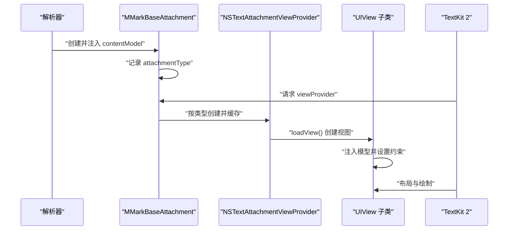

**图表来源**
- [MMarkBaseAttachment.swift:22-58](file://MMarkParser/Sources/Renderer/Attachments/MMarkBaseAttachment/MMarkBaseAttachment.swift#L22-L58)
- [MMarkCodeBlockViewProvider.swift:12-20](file://MMarkParser/Sources/Renderer/Attachments/MMarkCodeBlockAttachment/MMarkCodeBlockViewProvider.swift#L12-L20)
- [MMarkHorizontalRuleViewProvider.swift:12-22](file://MMarkParser/Sources/Renderer/Attachments/MMarkHorizontalRuleAttachment/MMarkHorizontalRuleViewProvider.swift#L12-L22)
- [MMarkMermaidViewProvider.swift:12-20](file://MMarkParser/Sources/Renderer/Attachments/MMarkMermaidAttachment/MMarkMermaidViewProvider.swift#L12-L20)

**章节来源**
- [MMarkBaseAttachment.swift:22-58](file://MMarkParser/Sources/Renderer/Attachments/MMarkBaseAttachment/MMarkBaseAttachment.swift#L22-L58)
- [MMarkCodeBlockViewProvider.swift:12-20](file://MMarkParser/Sources/Renderer/Attachments/MMarkCodeBlockAttachment/MMarkCodeBlockViewProvider.swift#L12-L20)
- [MMarkHorizontalRuleViewProvider.swift:12-22](file://MMarkParser/Sources/Renderer/Attachments/MMarkHorizontalRuleAttachment/MMarkHorizontalRuleViewProvider.swift#L12-L22)
- [MMarkMermaidViewProvider.swift:12-20](file://MMarkParser/Sources/Renderer/Attachments/MMarkMermaidAttachment/MMarkMermaidViewProvider.swift#L12-L20)

### 附件与TextKit 2的集成
- 通过NSTextAttachment作为容器，承载数据模型与附件类型信息。
- 通过NSTextAttachmentViewProvider在TextKit 2布局阶段创建UIView实例，并设置tracksTextAttachmentViewBounds以让TextKit 2跟踪视图边界，从而正确参与排版。
- 某些附件（如水平分割线）在ViewProvider中显式触发invalidateLayout，确保布局更新。

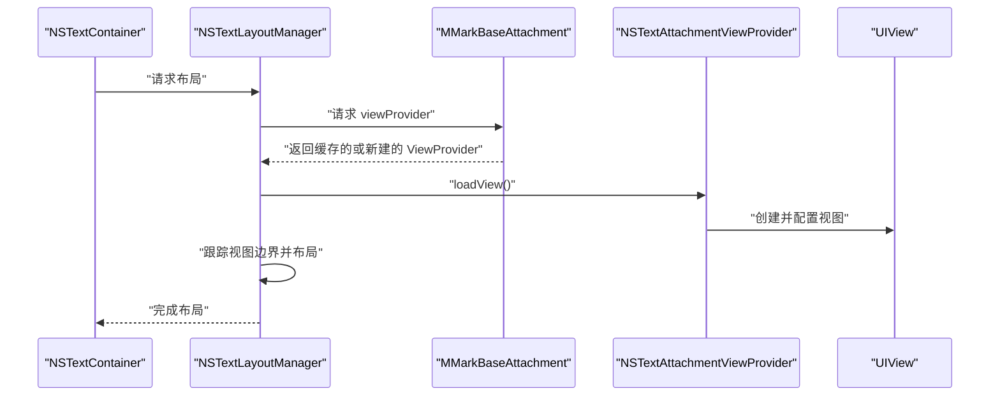

**图表来源**
- [MMarkBaseAttachment.swift:32-58](file://MMarkParser/Sources/Renderer/Attachments/MMarkBaseAttachment/MMarkBaseAttachment.swift#L32-L58)
- [MMarkHorizontalRuleViewProvider.swift:12-22](file://MMarkParser/Sources/Renderer/Attachments/MMarkHorizontalRuleAttachment/MMarkHorizontalRuleViewProvider.swift#L12-L22)
- [MMarkMermaidViewProvider.swift:12-20](file://MMarkParser/Sources/Renderer/Attachments/MMarkMermaidAttachment/MMarkMermaidViewProvider.swift#L12-L20)

**章节来源**
- [MMarkBaseAttachment.swift:32-58](file://MMarkParser/Sources/Renderer/Attachments/MMarkBaseAttachment/MMarkBaseAttachment.swift#L32-L58)
- [MMarkHorizontalRuleViewProvider.swift:12-22](file://MMarkParser/Sources/Renderer/Attachments/MMarkHorizontalRuleAttachment/MMarkHorizontalRuleViewProvider.swift#L12-L22)
- [MMarkMermaidViewProvider.swift:12-20](file://MMarkParser/Sources/Renderer/Attachments/MMarkMermaidAttachment/MMarkMermaidViewProvider.swift#L12-L20)

### 代码块附件（MMarkCodeBlockAttachment）
- 数据模型：MMarkCodeBlockModel包含高亮后的富文本、语言标识、代码文本尺寸等。
- 视图：MMarkCodeBlockView包含标题栏（语言标签与复制按钮）、滚动代码视图，支持复制代码与水平滚动。
- 布局：attachmentBounds根据lineFragment宽度进行约束，避免溢出与裁剪。

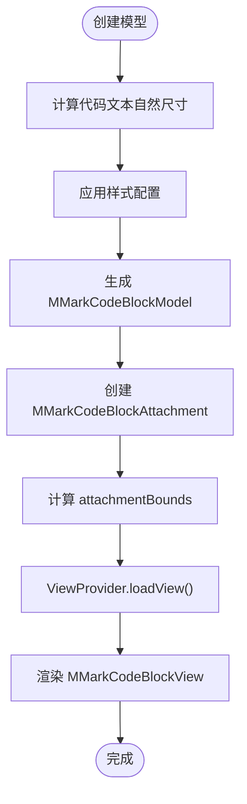

**图表来源**
- [MMarkCodeBlockModel.swift:23-44](file://MMarkParser/Sources/Renderer/Attachments/MMarkCodeBlockAttachment/MMarkCodeBlockModel.swift#L23-L44)
- [MMarkCodeBlockAttachment.swift:15-20](file://MMarkParser/Sources/Renderer/Attachments/MMarkCodeBlockAttachment/MMarkCodeBlockAttachment.swift#L15-L20)
- [MMarkCodeBlockViewProvider.swift:12-20](file://MMarkParser/Sources/Renderer/Attachments/MMarkCodeBlockAttachment/MMarkCodeBlockViewProvider.swift#L12-L20)

**章节来源**
- [MMarkCodeBlockModel.swift:23-44](file://MMarkParser/Sources/Renderer/Attachments/MMarkCodeBlockAttachment/MMarkCodeBlockModel.swift#L23-L44)
- [MMarkCodeBlockAttachment.swift:15-20](file://MMarkParser/Sources/Renderer/Attachments/MMarkCodeBlockAttachment/MMarkCodeBlockAttachment.swift#L15-L20)
- [MMarkCodeBlockView.swift:40-58](file://MMarkParser/Sources/Renderer/Attachments/MMarkCodeBlockAttachment/MMarkCodeBlockView.swift#L40-L58)
- [MMarkCodeBlockViewProvider.swift:12-20](file://MMarkParser/Sources/Renderer/Attachments/MMarkCodeBlockAttachment/MMarkCodeBlockViewProvider.swift#L12-L20)

### 图片附件（MMarkImageAttachment）
- 数据模型：MMarkImageModel包含URL、替代文本与占位色，工厂方法按4:3宽高比计算尺寸。
- 视图：MMarkImageView使用Kingfisher异步加载图片，支持占位图与加载动画，完成后回调触发TextKit 2重新布局。
- 布局：attachmentBounds按容器宽度缩放高度，保证比例一致。

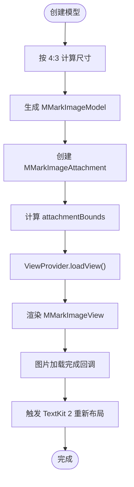

**图表来源**
- [MMarkImageModel.swift:21-25](file://MMarkParser/Sources/Renderer/Attachments/MMarkImageAttachment/MMarkImageModel.swift#L21-L25)
- [MMarkImageAttachment.swift:17-21](file://MMarkParser/Sources/Renderer/Attachments/MMarkImageAttachment/MMarkImageAttachment.swift#L17-L21)
- [MMarkImageView.swift:69-99](file://MMarkParser/Sources/Renderer/Attachments/MMarkImageAttachment/MMarkImageView.swift#L69-L99)
- [MMarkHorizontalRuleViewProvider.swift:21-22](file://MMarkParser/Sources/Renderer/Attachments/MMarkHorizontalRuleAttachment/MMarkHorizontalRuleViewProvider.swift#L21-L22)

**章节来源**
- [MMarkImageModel.swift:21-25](file://MMarkParser/Sources/Renderer/Attachments/MMarkImageAttachment/MMarkImageModel.swift#L21-L25)
- [MMarkImageAttachment.swift:17-21](file://MMarkParser/Sources/Renderer/Attachments/MMarkImageAttachment/MMarkImageAttachment.swift#L17-L21)
- [MMarkImageView.swift:69-99](file://MMarkParser/Sources/Renderer/Attachments/MMarkImageAttachment/MMarkImageView.swift#L69-L99)

### 水平分割线附件（MMarkHorizontalRuleAttachment）
- 数据模型：MMarkHorizontalRuleModel包含规则高度、颜色与上下内边距。
- 视图：MMarkHorizontalRuleView通过draw绘制一条水平线，支持配置变更后重绘。
- 特殊处理：构造时创建透明占位图，允许TextKit 2正确布局；ViewProvider在loadView后主动invalidateLayout。

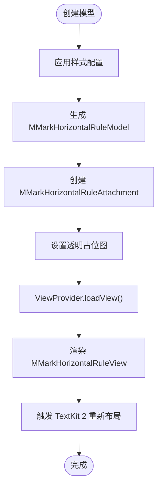

**图表来源**
- [MMarkHorizontalRuleModel.swift:15-25](file://MMarkParser/Sources/Renderer/Attachments/MMarkHorizontalRuleAttachment/MMarkHorizontalRuleModel.swift#L15-L25)
- [MMarkHorizontalRuleAttachment.swift:17-27](file://MMarkParser/Sources/Renderer/Attachments/MMarkHorizontalRuleAttachment/MMarkHorizontalRuleAttachment.swift#L17-L27)
- [MMarkHorizontalRuleViewProvider.swift:12-22](file://MMarkParser/Sources/Renderer/Attachments/MMarkHorizontalRuleAttachment/MMarkHorizontalRuleViewProvider.swift#L12-L22)

**章节来源**
- [MMarkHorizontalRuleModel.swift:15-25](file://MMarkParser/Sources/Renderer/Attachments/MMarkHorizontalRuleAttachment/MMarkHorizontalRuleModel.swift#L15-L25)
- [MMarkHorizontalRuleAttachment.swift:17-27](file://MMarkParser/Sources/Renderer/Attachments/MMarkHorizontalRuleAttachment/MMarkHorizontalRuleAttachment.swift#L17-L27)
- [MMarkHorizontalRuleView.swift:40-51](file://MMarkParser/Sources/Renderer/Attachments/MMarkHorizontalRuleAttachment/MMarkHorizontalRuleView.swift#L40-L51)
- [MMarkHorizontalRuleViewProvider.swift:12-22](file://MMarkParser/Sources/Renderer/Attachments/MMarkHorizontalRuleAttachment/MMarkHorizontalRuleViewProvider.swift#L12-L22)

### 列表标记附件（MMarkListMarkerAttachment）
- 数据模型：MMarkListMarkerModel包含预渲染的UIImage与绘制边界。
- 布局：直接使用模型提供的bounds，无需额外计算。

**章节来源**
- [MMarkListMarkerAttachment.swift:14-16](file://MMarkParser/Sources/Renderer/Attachments/MMarkListMarkerAttachment/MMarkListMarkerAttachment.swift#L14-L16)
- [MMarkListMarkerModel.swift:6-15](file://MMarkParser/Sources/Renderer/Attachments/MMarkListMarkerAttachment/MMarkListMarkerModel.swift#L6-L15)

### 数学公式附件（MMarkMathBlockAttachment）
- 数据模型：MMarkMathBlockModel包含LaTeX源码、渲染后的公式图像与尺寸信息。
- 视图：MMarkMathBlockView使用KaTeX引擎渲染数学公式，支持复杂的数学表达式显示。
- 布局：attachmentBounds根据公式的自然尺寸计算，确保公式完整显示且不被截断。

**章节来源**
- [MMarkMathBlockAttachment.swift:6-21](file://MMarkParser/Sources/Renderer/Attachments/MMarkMathBlockAttachment/MMarkMathBlockAttachment.swift#L6-L21)
- [MMarkMathBlockModel.swift:6-45](file://MMarkParser/Sources/Renderer/Attachments/MMarkMathBlockAttachment/MMarkMathBlockModel.swift#L6-L45)
- [MMarkMathBlockView.swift:40-58](file://MMarkParser/Sources/Renderer/Attachments/MMarkMathBlockAttachment/MMarkMathBlockView.swift#L40-L58)
- [MMarkMathBlockViewProvider.swift:12-20](file://MMarkParser/Sources/Renderer/Attachments/MMarkMathBlockAttachment/MMarkMathBlockViewProvider.swift#L12-L20)

### 表格附件（MMarkTableAttachment）
- 数据模型：MMarkTableModel包含表格数据、列宽配置与样式设置。
- 视图：MMarkTableView使用Core Graphics绘制表格，支持单元格边框、背景色与文本对齐。
- 布局：attachmentBounds根据表格内容动态计算，支持横向滚动以适应宽表格。

**章节来源**
- [MMarkTableAttachment.swift:6-21](file://MMarkParser/Sources/Renderer/Attachments/MMarkTableAttachment/MMarkTableAttachment.swift#L6-L21)
- [MMarkTableModel.swift:6-45](file://MMarkParser/Sources/Renderer/Attachments/MMarkTableAttachment/MMarkTableModel.swift#L6-L45)
- [MMarkTableView.swift:40-58](file://MMarkParser/Sources/Renderer/Attachments/MMarkTableAttachment/MMarkTableView.swift#L40-L58)
- [MMarkTableViewProvider.swift:12-20](file://MMarkParser/Sources/Renderer/Attachments/MMarkTableAttachment/MMarkTableViewProvider.swift#L12-L20)

## Mermaid附件类型架构

### Mermaid附件概述
MMarkMermaidAttachment是最新加入的附件类型，专门用于渲染Mermaid.js格式的图表。该附件类型完全遵循MMarkBaseAttachment的统一架构设计，通过MMarkMermaidModel提供数据支持，MMarkMermaidView实现渲染逻辑，MMarkMermaidViewProvider负责视图创建。

### 数据模型设计（MMarkMermaidModel）
- **核心属性**：包含Mermaid图表源码、渲染配置、尺寸信息与主题设置。
- **解析流程**：通过BeautifulMermaidSwift库解析Mermaid语法，转换为可渲染的图形元素。
- **布局计算**：自动计算图表的自然尺寸，确保渲染质量与布局效率。

### 视图渲染架构（MMarkMermaidView）
- **渲染引擎**：集成BeautifulMermaidSwift的渲染器，支持流程图、序列图、类图等多种图表类型。
- **主题系统**：支持深色/浅色主题切换，与应用整体视觉风格保持一致。
- **交互支持**：提供图表缩放、平移等交互功能，增强用户体验。

### 视图提供者实现（MMarkMermaidViewProvider）
- **创建流程**：在loadView()中创建MMarkMermaidView实例，注入MMarkMermaidModel。
- **配置设置**：设置tracksTextAttachmentViewBounds以参与TextKit 2布局跟踪。
- **生命周期管理**：正确处理视图的创建、配置与销毁过程。

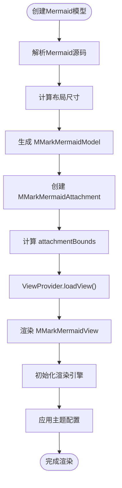

**图表来源**
- [MMarkMermaidModel.swift:23-44](file://MMarkParser/Sources/Renderer/Attachments/MMarkMermaidAttachment/MMarkMermaidModel.swift#L23-L44)
- [MMarkMermaidAttachment.swift:15-20](file://MMarkParser/Sources/Renderer/Attachments/MMarkMermaidAttachment/MMarkMermaidAttachment.swift#L15-L20)
- [MMarkMermaidViewProvider.swift:12-20](file://MMarkParser/Sources/Renderer/Attachments/MMarkMermaidAttachment/MMarkMermaidViewProvider.swift#L12-L20)
- [MMarkMermaidView.swift:40-58](file://MMarkParser/Sources/Renderer/Attachments/MMarkMermaidAttachment/MMarkMermaidView.swift#L40-L58)

**章节来源**
- [MMarkMermaidAttachment.swift:6-21](file://MMarkParser/Sources/Renderer/Attachments/MMarkMermaidAttachment/MMarkMermaidAttachment.swift#L6-L21)
- [MMarkMermaidModel.swift:6-45](file://MMarkParser/Sources/Renderer/Attachments/MMarkMermaidAttachment/MMarkMermaidModel.swift#L6-L45)
- [MMarkMermaidView.swift:40-58](file://MMarkParser/Sources/Renderer/Attachments/MMarkMermaidAttachment/MMarkMermaidView.swift#L40-L58)
- [MMarkMermaidViewProvider.swift:6-21](file://MMarkParser/Sources/Renderer/Attachments/MMarkMermaidAttachment/MMarkMermaidViewProvider.swift#L6-L21)

## 依赖关系分析
- **继承关系**：各附件类型均继承自MMarkBaseAttachment；各模型均继承自MMarkBaseModel。
- **关联关系**：附件类型与视图提供者之间是一对一关联；视图提供者与视图之间是一对一关联。
- **TextKit 2集成点**：通过NSTextAttachmentViewProvider在布局阶段创建视图；通过tracksTextAttachmentViewBounds参与布局跟踪；部分场景通过invalidateLayout触发重新布局。
- **统一接口设计**：所有附件类型共享相同的接口契约，确保扩展性与一致性。

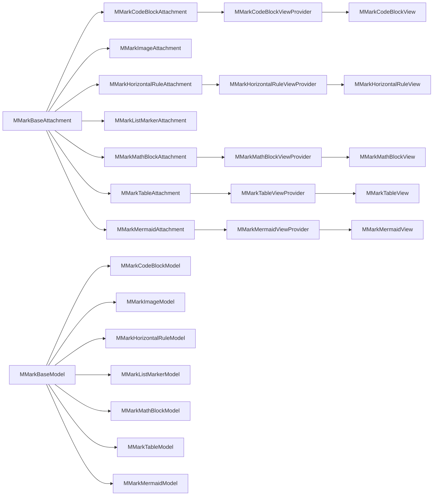

**图表来源**
- [MMarkBaseAttachment.swift:12-59](file://MMarkParser/Sources/Renderer/Attachments/MMarkBaseAttachment/MMarkBaseAttachment.swift#L12-L59)
- [MMarkBaseModel.swift:3-9](file://MMarkParser/Sources/Renderer/Attachments/MMarkBaseAttachment/MMarkBaseModel.swift#L3-L9)
- [MMarkCodeBlockAttachment.swift:6-21](file://MMarkParser/Sources/Renderer/Attachments/MMarkCodeBlockAttachment/MMarkCodeBlockAttachment.swift#L6-L21)
- [MMarkImageAttachment.swift:5-22](file://MMarkParser/Sources/Renderer/Attachments/MMarkImageAttachment/MMarkImageAttachment.swift#L5-L22)
- [MMarkHorizontalRuleAttachment.swift:6-37](file://MMarkParser/Sources/Renderer/Attachments/MMarkHorizontalRuleAttachment/MMarkHorizontalRuleAttachment.swift#L6-L37)
- [MMarkListMarkerAttachment.swift:5-17](file://MMarkParser/Sources/Renderer/Attachments/MMarkListMarkerAttachment/MMarkListMarkerAttachment.swift#L5-L17)
- [MMarkMathBlockAttachment.swift:6-21](file://MMarkParser/Sources/Renderer/Attachments/MMarkMathBlockAttachment/MMarkMathBlockAttachment.swift#L6-L21)
- [MMarkTableAttachment.swift:6-21](file://MMarkParser/Sources/Renderer/Attachments/MMarkTableAttachment/MMarkTableAttachment.swift#L6-L21)
- [MMarkMermaidAttachment.swift:6-21](file://MMarkParser/Sources/Renderer/Attachments/MMarkMermaidAttachment/MMarkMermaidAttachment.swift#L6-L21)
- [MMarkCodeBlockModel.swift:6-45](file://MMarkParser/Sources/Renderer/Attachments/MMarkCodeBlockAttachment/MMarkCodeBlockModel.swift#L6-L45)
- [MMarkImageModel.swift:6-26](file://MMarkParser/Sources/Renderer/Attachments/MMarkImageAttachment/MMarkImageModel.swift#L6-L26)
- [MMarkHorizontalRuleModel.swift:6-26](file://MMarkParser/Sources/Renderer/Attachments/MMarkHorizontalRuleAttachment/MMarkHorizontalRuleModel.swift#L6-L26)
- [MMarkListMarkerModel.swift:6-15](file://MMarkParser/Sources/Renderer/Attachments/MMarkListMarkerAttachment/MMarkListMarkerModel.swift#L6-L15)
- [MMarkMathBlockModel.swift:6-45](file://MMarkParser/Sources/Renderer/Attachments/MMarkMathBlockAttachment/MMarkMathBlockModel.swift#L6-L45)
- [MMarkTableModel.swift:6-45](file://MMarkParser/Sources/Renderer/Attachments/MMarkTableAttachment/MMarkTableModel.swift#L6-L45)
- [MMarkMermaidModel.swift:6-45](file://MMarkParser/Sources/Renderer/Attachments/MMarkMermaidAttachment/MMarkMermaidModel.swift#L6-L45)
- [MMarkCodeBlockViewProvider.swift:6-21](file://MMarkParser/Sources/Renderer/Attachments/MMarkCodeBlockAttachment/MMarkCodeBlockViewProvider.swift#L6-L21)
- [MMarkHorizontalRuleViewProvider.swift:6-23](file://MMarkParser/Sources/Renderer/Attachments/MMarkHorizontalRuleAttachment/MMarkHorizontalRuleViewProvider.swift#L6-L23)
- [MMarkMermaidViewProvider.swift:6-21](file://MMarkParser/Sources/Renderer/Attachments/MMarkMermaidAttachment/MMarkMermaidViewProvider.swift#L6-L21)

**章节来源**
- [MMarkBaseAttachment.swift:12-59](file://MMarkParser/Sources/Renderer/Attachments/MMarkBaseAttachment/MMarkBaseAttachment.swift#L12-L59)
- [MMarkBaseModel.swift:3-9](file://MMarkParser/Sources/Renderer/Attachments/MMarkBaseAttachment/MMarkBaseModel.swift#L3-L9)

## 性能考量
- **布局约束与内在尺寸**：视图通过内在尺寸与约束参与布局，减少不必要的重排；代码块与图片均在模型中预先计算关键尺寸，降低运行时开销。
- **异步加载**：图片附件使用Kingfisher异步加载，避免阻塞主线程；加载完成后通过回调触发TextKit 2重新布局，确保最终布局正确。
- **缓存与复用**：MMarkBaseAttachment在viewProvider(for:location:textContainer:)中缓存已创建的ViewProvider，避免重复创建带来的性能损耗。
- **占位策略**：水平分割线使用透明占位图，避免在布局前进行昂贵的绘制操作。
- **Mermaid渲染优化**：Mermaid图表采用延迟渲染策略，仅在可见区域进行渲染，减少内存占用。
- **统一接口优势**：通过统一的接口设计，新附件类型可以复用现有的性能优化机制。

## 故障排查指南
- **类型断言失败**：当contentModel与期望类型不匹配时会触发fatalError。请确认创建附件时传入的模型类型与附件类型一致。
- **布局异常**：若视图未正确参与布局，请检查是否设置了tracksTextAttachmentViewBounds；对于需要重新布局的场景，确认是否调用了invalidateLayout。
- **图片不显示**：检查URL有效性与targetSize是否大于零；确认占位图生成逻辑正常；观察onImageLoaded回调是否触发。
- **Mermaid渲染问题**：检查Mermaid源码语法是否正确；确认BeautifulMermaidSwift库版本兼容性；验证主题配置是否有效。
- **数学公式显示异常**：检查LaTeX语法正确性；确认KaTeX字体资源可用；验证渲染配置参数。

**章节来源**
- [MMarkCodeBlockAttachment.swift:8-13](file://MMarkParser/Sources/Renderer/Attachments/MMarkCodeBlockAttachment/MMarkCodeBlockAttachment.swift#L8-L13)
- [MMarkImageAttachment.swift:7-12](file://MMarkParser/Sources/Renderer/Attachments/MMarkImageAttachment/MMarkImageAttachment.swift#L7-L12)
- [MMarkHorizontalRuleAttachment.swift:17-27](file://MMarkParser/Sources/Renderer/Attachments/MMarkHorizontalRuleAttachment/MMarkHorizontalRuleAttachment.swift#L17-L27)
- [MMarkHorizontalRuleViewProvider.swift:21-22](file://MMarkParser/Sources/Renderer/Attachments/MMarkHorizontalRuleAttachment/MMarkHorizontalRuleViewProvider.swift#L21-L22)
- [MMarkMermaidAttachment.swift:8-13](file://MMarkParser/Sources/Renderer/Attachments/MMarkMermaidAttachment/MMarkMermaidAttachment.swift#L8-L13)
- [MMarkMermaidModel.swift:23-44](file://MMarkParser/Sources/Renderer/Attachments/MMarkMermaidAttachment/MMarkMermaidModel.swift#L23-L44)

## 结论
MMarkParser的附件系统通过MMarkBaseAttachment与MMarkBaseModel实现了清晰的"数据—视图"分离，结合NSTextAttachment与NSTextAttachmentViewProvider，无缝接入TextKit 2的布局与渲染管线。本次更新成功集成了Mermaid附件类型，展示了统一接口设计的强大扩展能力。该架构既保证了扩展性（新增附件类型只需继承基类并提供视图与视图提供者），又兼顾了性能与可用性（异步加载、内在尺寸参与布局、缓存复用）。Mermaid附件类型的加入进一步丰富了MMarkParser的内容表现力，为技术文档、流程图展示等场景提供了强大的支持。开发者可据此快速扩展自定义附件类型，同时保持与现有系统的兼容与一致性。

## 附录

### 扩展机制设计图（如何添加新附件类型）
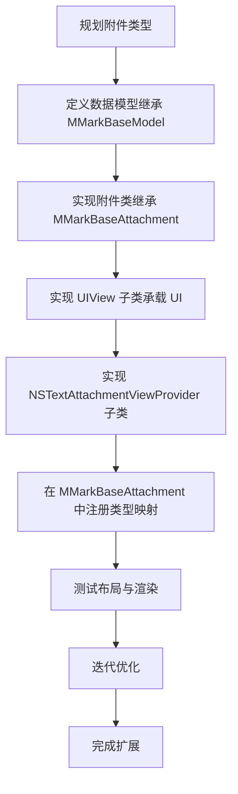

**图表来源**
- [MMarkBaseAttachment.swift:37-50](file://MMarkParser/Sources/Renderer/Attachments/MMarkBaseAttachment/MMarkBaseAttachment.swift#L37-L50)
- [MMarkBaseModel.swift:3-9](file://MMarkParser/Sources/Renderer/Attachments/MMarkBaseAttachment/MMarkBaseModel.swift#L3-L9)
- [MMarkCodeBlockViewProvider.swift:8-20](file://MMarkParser/Sources/Renderer/Attachments/MMarkCodeBlockAttachment/MMarkCodeBlockViewProvider.swift#L8-L20)
- [MMarkMermaidViewProvider.swift:8-20](file://MMarkParser/Sources/Renderer/Attachments/MMarkMermaidAttachment/MMarkMermaidViewProvider.swift#L8-L20)

### Mermaid附件类型集成流程
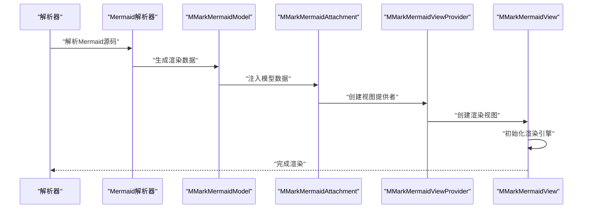

**图表来源**
- [MMarkMermaidModel.swift:23-44](file://MMarkParser/Sources/Renderer/Attachments/MMarkMermaidAttachment/MMarkMermaidModel.swift#L23-L44)
- [MMarkMermaidAttachment.swift:15-20](file://MMarkParser/Sources/Renderer/Attachments/MMarkMermaidAttachment/MMarkMermaidAttachment.swift#L15-L20)
- [MMarkMermaidViewProvider.swift:12-20](file://MMarkParser/Sources/Renderer/Attachments/MMarkMermaidAttachment/MMarkMermaidViewProvider.swift#L12-L20)
- [MMarkMermaidView.swift:40-58](file://MMarkParser/Sources/Renderer/Attachments/MMarkMermaidAttachment/MMarkMermaidView.swift#L40-L58)