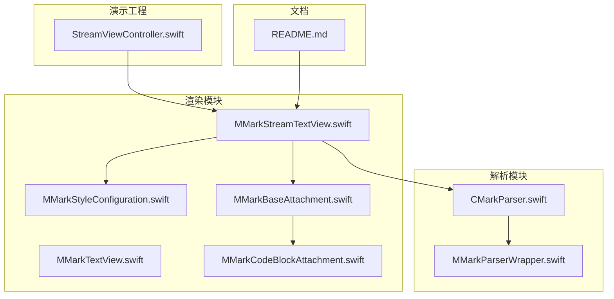
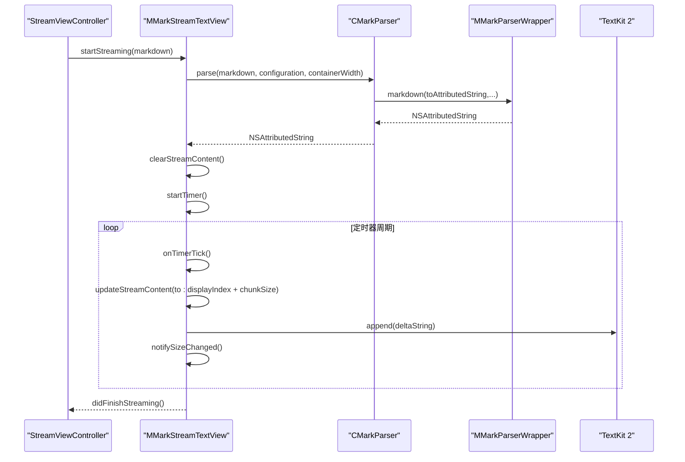
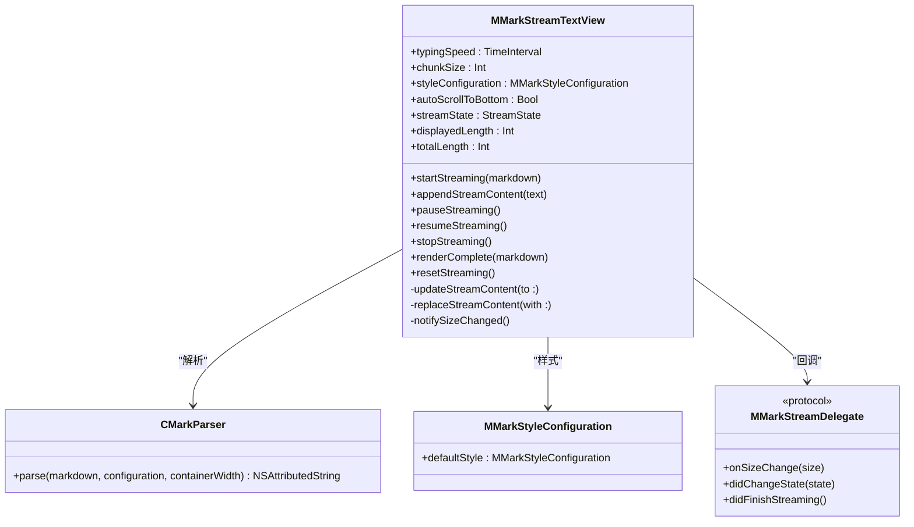
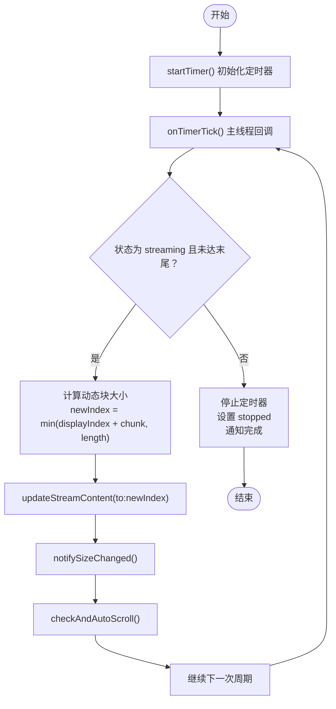
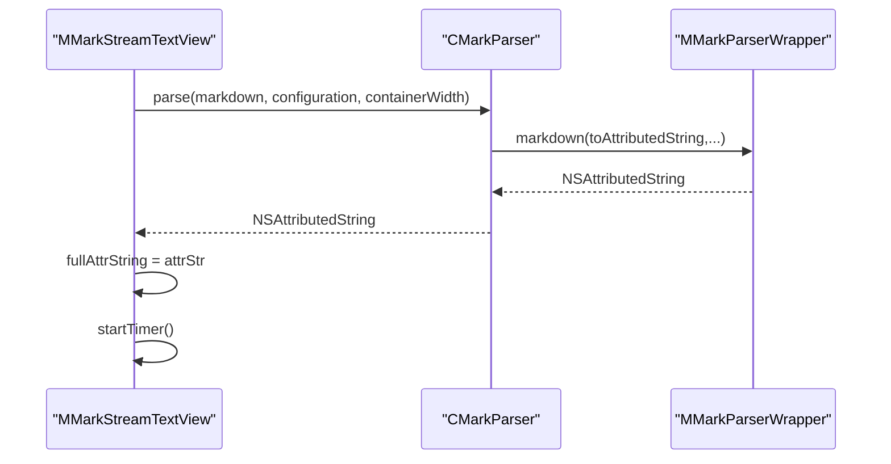
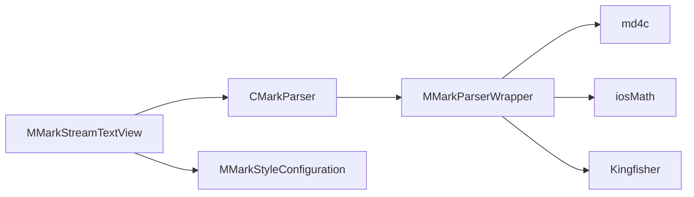
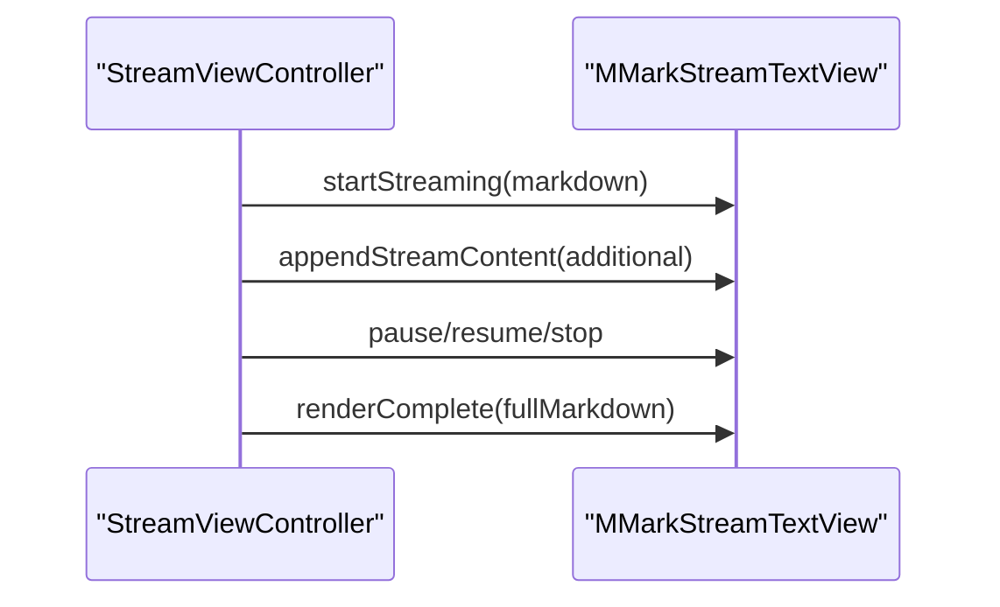

# MMarkStreamTextView 流式文本视图

<cite>
**本文档引用的文件**
- [MMarkStreamTextView.swift](file://MMarkParser/Sources/Renderer/MMarkStreamTextView.swift)
- [CMarkParser.swift](file://MMarkParser/Sources/Parser/CMarkParser.swift)
- [MMarkParserWrapper.swift](file://MMarkParser/Sources/Parser/MMarkParserWrapper.swift)
- [MMarkTextView.swift](file://MMarkParser/Sources/Renderer/MMarkTextView.swift)
- [MMarkStyleConfiguration.swift](file://MMarkParser/Sources/Renderer/MMarkStyleConfiguration.swift)
- [StreamViewController.swift](file://cocoapod_demo/cocoapod_demo/StreamViewController.swift)
- [README.md](file://README.md)
- [MMarkBaseAttachment.swift](file://MMarkParser/Sources/Renderer/Attachments/MMarkBaseAttachment/MMarkBaseAttachment.swift)
- [MMarkCodeBlockAttachment.swift](file://MMarkParser/Sources/Renderer/Attachments/MMarkCodeBlockAttachment/MMarkCodeBlockAttachment.swift)
</cite>

## 目录
1. [简介](#简介)
2. [项目结构](#项目结构)
3. [核心组件](#核心组件)
4. [架构总览](#架构总览)
5. [详细组件分析](#详细组件分析)
6. [依赖关系分析](#依赖关系分析)
7. [性能考量](#性能考量)
8. [故障排查指南](#故障排查指南)
9. [结论](#结论)
10. [附录](#附录)

## 简介
本文件面向MMarkStreamTextView流式文本视图，系统性阐述其流式渲染的概念、实现原理与技术架构。重点对比流式解析与传统一次性解析的差异与优势，特别是在处理大型文档时的性能表现；深入解析流式渲染的数据流处理机制，包括增量解析、缓冲区管理与内存优化策略；说明与CMarkParser的集成方式，以及如何在保持流畅用户体验的同时处理复杂的Markdown内容；提供配置选项与性能调优建议，并给出完整的使用示例与集成指南。

## 项目结构
MMarkStreamTextView位于渲染模块，配合解析器与样式配置共同工作，形成从Markdown字符串到TextKit 2布局渲染的完整链路。演示工程展示了如何在真实应用中集成与控制流式渲染行为。

**图表来源**
- [MMarkStreamTextView.swift:1-398](file://MMarkParser/Sources/Renderer/MMarkStreamTextView.swift#L1-L398)
- [CMarkParser.swift:1-81](file://MMarkParser/Sources/Parser/CMarkParser.swift#L1-L81)
- [MMarkParserWrapper.swift:1-800](file://MMarkParser/Sources/Parser/MMarkParserWrapper.swift#L1-L800)
- [MMarkTextView.swift:1-81](file://MMarkParser/Sources/Renderer/MMarkTextView.swift#L1-L81)
- [MMarkStyleConfiguration.swift:1-339](file://MMarkParser/Sources/Renderer/MMarkStyleConfiguration.swift#L1-L339)
- [MMarkBaseAttachment.swift:1-60](file://MMarkParser/Sources/Renderer/Attachments/MMarkBaseAttachment/MMarkBaseAttachment.swift#L1-L60)
- [MMarkCodeBlockAttachment.swift:1-22](file://MMarkParser/Sources/Renderer/Attachments/MMarkCodeBlockAttachment/MMarkCodeBlockAttachment.swift#L1-L22)
- [StreamViewController.swift:1-279](file://cocoapod_demo/cocoapod_demo/StreamViewController.swift#L1-L279)
- [README.md:1-237](file://README.md#L1-L237)

**章节来源**
- [README.md:108-237](file://README.md#L108-L237)

## 核心组件
- MMarkStreamTextView：基于UITextView的流式渲染视图，支持定时器驱动的增量内容追加、暂停/恢复/停止、自动滚动与尺寸通知。
- CMarkParser：封装md4c回调式解析，输出NSAttributedString，支持GFM扩展与样式配置。
- MMarkParserWrapper：md4c SAX回调处理器，负责构建NSAttributedString与复杂元素（代码块、表格、图片、水平线、列表标记、数学公式等）的附件模型。
- MMarkStyleConfiguration：统一的样式配置，涵盖标题、段落、代码、链接、引用块、列表、表格、任务列表、数学、脚注等。
- MMarkTextView：一次性渲染的Markdown文本视图，用于对比与参考。
- StreamViewController：演示控制器，展示流式渲染的启动、暂停、恢复、停止、追加与一次性渲染等操作。

**章节来源**
- [MMarkStreamTextView.swift:18-398](file://MMarkParser/Sources/Renderer/MMarkStreamTextView.swift#L18-L398)
- [CMarkParser.swift:55-66](file://MMarkParser/Sources/Parser/CMarkParser.swift#L55-L66)
- [MMarkParserWrapper.swift:16-100](file://MMarkParser/Sources/Parser/MMarkParserWrapper.swift#L16-L100)
- [MMarkStyleConfiguration.swift:1-339](file://MMarkParser/Sources/Renderer/MMarkStyleConfiguration.swift#L1-L339)
- [MMarkTextView.swift:1-81](file://MMarkParser/Sources/Renderer/MMarkTextView.swift#L1-L81)
- [StreamViewController.swift:1-279](file://cocoapod_demo/cocoapod_demo/StreamViewController.swift#L1-L279)

## 架构总览
MMarkStreamTextView采用“解析-增量-渲染”的架构：解析阶段由CMarkParser委托给MMarkParserWrapper，后者在md4c回调中逐步构建NSAttributedString；渲染阶段由MMarkStreamTextView在主线程通过定时器周期性地将增量内容追加到TextKit 2的文本存储中，同时维护显示索引、动态块大小与自动滚动。

**图表来源**
- [MMarkStreamTextView.swift:174-201](file://MMarkParser/Sources/Renderer/MMarkStreamTextView.swift#L174-L201)
- [CMarkParser.swift:55-66](file://MMarkParser/Sources/Parser/CMarkParser.swift#L55-L66)
- [MMarkParserWrapper.swift:16-100](file://MMarkParser/Sources/Parser/MMarkParserWrapper.swift#L16-L100)

## 详细组件分析

### MMarkStreamTextView 类设计
- 角色定位：在UITextView基础上提供流式渲染能力，通过定时器与增量追加避免全量重布局。
- 关键状态：
  - StreamState：idle/streaming/paused/stopped
  - displayedLength/totalLength：已显示长度与总长度
- 核心方法：
  - startStreaming：初始化解析与定时器
  - appendStreamContent：增量解析并更新显示
  - pause/resume/stop：控制流式渲染生命周期
  - renderComplete：一次性渲染（跳过流式）
  - resetStreaming：清理状态
- 线程模型：
  - 解析在独立队列执行，结果回到主线程更新UI
  - 定时器在专用队列触发，回调切换至主线程保证安全访问共享状态
- 自动滚动与尺寸通知：
  - 通过sizeThatFits估算内容高度，避免激活TextKit 1桥接
  - 提供delegate回调onSizeChange与didFinishStreaming

**图表来源**
- [MMarkStreamTextView.swift:21-398](file://MMarkParser/Sources/Renderer/MMarkStreamTextView.swift#L21-L398)
- [CMarkParser.swift:55-66](file://MMarkParser/Sources/Parser/CMarkParser.swift#L55-L66)
- [MMarkStyleConfiguration.swift:189-267](file://MMarkParser/Sources/Renderer/MMarkStyleConfiguration.swift#L189-L267)

**章节来源**
- [MMarkStreamTextView.swift:21-398](file://MMarkParser/Sources/Renderer/MMarkStreamTextView.swift#L21-L398)

### 定时器驱动的增量渲染流程
- 启动：startTimer根据typingSpeed计算周期，leeway微调抖动
- 周期：onTimerTick在主线程检查状态与边界，计算新的displayIndex
- 动态块大小：超过阈值时增大chunkSize，维持视觉流畅
- 更新：updateStreamContent通过TextKit 2或TextKit 1路径增量追加
- 尾声：当displayIndex达到末尾，停止定时器，通知完成

**图表来源**
- [MMarkStreamTextView.swift:304-351](file://MMarkParser/Sources/Renderer/MMarkStreamTextView.swift#L304-L351)

**章节来源**
- [MMarkStreamTextView.swift:304-351](file://MMarkParser/Sources/Renderer/MMarkStreamTextView.swift#L304-L351)

### 与CMarkParser的集成
- CMarkParser.parse负责将Markdown转换为NSAttributedString，支持GFM扩展与样式配置
- MMarkParserWrapper作为md4c回调处理器，维护属性栈、上下文状态与复杂元素缓冲，最终产出可直接用于TextKit 2渲染的富文本
- MMarkStreamTextView在解析队列中调用CMarkParser.parse，解析完成后在主线程设置fullAttrString并启动流式渲染

**图表来源**
- [CMarkParser.swift:55-66](file://MMarkParser/Sources/Parser/CMarkParser.swift#L55-L66)
- [MMarkParserWrapper.swift:16-100](file://MMarkParser/Sources/Parser/MMarkParserWrapper.swift#L16-L100)
- [MMarkStreamTextView.swift:183-200](file://MMarkParser/Sources/Renderer/MMarkStreamTextView.swift#L183-L200)

**章节来源**
- [CMarkParser.swift:55-66](file://MMarkParser/Sources/Parser/CMarkParser.swift#L55-L66)
- [MMarkParserWrapper.swift:16-100](file://MMarkParser/Sources/Parser/MMarkParserWrapper.swift#L16-L100)
- [MMarkStreamTextView.swift:183-200](file://MMarkParser/Sources/Renderer/MMarkStreamTextView.swift#L183-L200)

### 与MMarkTextView的对比
- 一次性渲染：MMarkTextView在setMarkdown中直接解析并设置attributedText，适合短文档或静态内容
- 流式渲染：MMarkStreamTextView通过定时器与增量追加，适合长文档与实时输入场景，避免全量重布局带来的卡顿
- 两者均支持链接点击、引用块绘制等通用能力，但流式版本在大文档场景下具备明显性能优势

**章节来源**
- [MMarkTextView.swift:39-49](file://MMarkParser/Sources/Renderer/MMarkTextView.swift#L39-L49)
- [MMarkStreamTextView.swift:174-201](file://MMarkParser/Sources/Renderer/MMarkStreamTextView.swift#L174-L201)

### 样式配置与附件渲染
- MMarkStyleConfiguration提供统一的样式定义，覆盖标题、段落、代码、链接、引用块、列表、表格、任务列表、数学、脚注等
- MMarkBaseAttachment与各附件类型（代码块、水平线、图片、列表标记、数学块、表格）通过NSTextAttachmentViewProvider延迟创建视图，结合TextKit 2布局引擎高效渲染

**章节来源**
- [MMarkStyleConfiguration.swift:1-339](file://MMarkParser/Sources/Renderer/MMarkStyleConfiguration.swift#L1-L339)
- [MMarkBaseAttachment.swift:1-60](file://MMarkParser/Sources/Renderer/Attachments/MMarkBaseAttachment/MMarkBaseAttachment.swift#L1-L60)
- [MMarkCodeBlockAttachment.swift:1-22](file://MMarkParser/Sources/Renderer/Attachments/MMarkCodeBlockAttachment/MMarkCodeBlockAttachment.swift#L1-L22)

## 依赖关系分析
- 组件耦合
  - MMarkStreamTextView强依赖CMarkParser与MMarkStyleConfiguration
  - 通过delegate回调解耦UI与渲染逻辑
- 外部依赖
  - md4c：SAX回调解析引擎
  - iosMath：LaTeX数学渲染
  - Kingfisher：远程图片加载（用于图片附件）

**图表来源**
- [MMarkStreamTextView.swift:1-398](file://MMarkParser/Sources/Renderer/MMarkStreamTextView.swift#L1-L398)
- [CMarkParser.swift:1-81](file://MMarkParser/Sources/Parser/CMarkParser.swift#L1-L81)
- [MMarkParserWrapper.swift:1-800](file://MMarkParser/Sources/Parser/MMarkParserWrapper.swift#L1-L800)
- [README.md:36-40](file://README.md#L36-L40)

**章节来源**
- [README.md:36-40](file://README.md#L36-L40)

## 性能考量
- 流式解析的优势
  - 避免一次性全量解析与布局，降低峰值内存与CPU占用
  - 通过定时器节流，将渲染压力分散到多个时间片，提升交互流畅度
- 增量渲染策略
  - 增量追加而非全量替换，减少TextKit 2重布局次数
  - 动态块大小：长文档时增大chunkSize，维持视觉连续性
- 线程与队列
  - 解析在独立队列执行，避免阻塞主线程UI
  - 定时器与状态访问在主线程，确保数据一致性
- 内存优化
  - 仅保存fullAttrString与displayIndex，避免累积中间状态
  - 文本存储采用performEditingTransaction（TextKit 2）或begin/endEditing（TextKit 1）进行批量修改
- 尺寸计算
  - 使用sizeThatFits估算高度，避免主动获取layoutManager/textStorage触发桥接

**章节来源**
- [MMarkStreamTextView.swift:112-156](file://MMarkParser/Sources/Renderer/MMarkStreamTextView.swift#L112-L156)
- [MMarkStreamTextView.swift:340-350](file://MMarkParser/Sources/Renderer/MMarkStreamTextView.swift#L340-L350)
- [MMarkStreamTextView.swift:365-379](file://MMarkParser/Sources/Renderer/MMarkStreamTextView.swift#L365-L379)

## 故障排查指南
- 无法滚动到底部
  - 检查autoScrollToBottom开关与checkAndAutoScroll判定逻辑
  - 确认onSizeChange回调是否被正确触发
- 流式渲染卡顿
  - 调整typingSpeed与chunkSize，观察性能变化
  - 确认解析队列未被其他任务阻塞
- 链接点击无效
  - 确认mmarkLinkDelegate已设置
  - 检查链接URL编码与协议处理
- 引用块绘制异常
  - 确认TextKit 2可用性与blockquote属性传播
- 增量更新失败
  - 检查displayIndex边界与fullAttrString有效性
  - 确认主线程状态访问与定时器生命周期

**章节来源**
- [MMarkStreamTextView.swift:45-70](file://MMarkParser/Sources/Renderer/MMarkStreamTextView.swift#L45-L70)
- [MMarkStreamTextView.swift:392-397](file://MMarkParser/Sources/Renderer/MMarkStreamTextView.swift#L392-L397)
- [StreamViewController.swift:261-278](file://cocoapod_demo/cocoapod_demo/StreamViewController.swift#L261-L278)

## 结论
MMarkStreamTextView通过“解析-增量-渲染”架构，有效解决了长文档与实时输入场景下的性能瓶颈。其定时器驱动的增量追加、动态块大小与自动滚动等特性，显著提升了用户体验。配合CMarkParser与MMarkParserWrapper的回调式解析与附件渲染体系，可在保持流畅性的前提下处理复杂的Markdown内容。

## 附录

### 配置选项与调优建议
- typingSpeed：控制定时器周期（秒）。数值越小越快，建议在0.005–0.15范围内调整
- chunkSize：每周期追加字符数。默认较小，长文档可适当增大
- styleConfiguration：统一样式配置，按需定制标题、段落、代码、链接、引用块、列表、表格、任务列表、数学、脚注等
- autoScrollToBottom：启用后自动跟随新增内容，适合聊天/日志类场景
- 容器宽度：解析时使用max(44, bounds.width - 32)，确保复杂嵌套不会导致负宽

**章节来源**
- [MMarkStreamTextView.swift:34-41](file://MMarkParser/Sources/Renderer/MMarkStreamTextView.swift#L34-L41)
- [MMarkStyleConfiguration.swift:189-267](file://MMarkParser/Sources/Renderer/MMarkStyleConfiguration.swift#L189-L267)
- [CMarkParser.swift:55-66](file://MMarkParser/Sources/Parser/CMarkParser.swift#L55-L66)

### 使用示例与集成指南
- 基本集成
  - 创建MMarkStreamTextView实例，设置styleConfiguration与streamDelegate
  - 调用startStreaming传入Markdown字符串
  - 通过appendStreamContent追加增量内容
  - 通过pause/resume/stop控制渲染生命周期
  - 通过renderComplete一次性渲染
- 演示工程参考
  - StreamViewController展示了按钮控制、滑杆调节、进度显示与自动滚动
  - 通过speedSlider与chunkSlider动态调整typingSpeed与chunkSize

**图表来源**
- [StreamViewController.swift:208-232](file://cocoapod_demo/cocoapod_demo/StreamViewController.swift#L208-L232)
- [MMarkStreamTextView.swift:174-287](file://MMarkParser/Sources/Renderer/MMarkStreamTextView.swift#L174-L287)

**章节来源**
- [StreamViewController.swift:167-245](file://cocoapod_demo/cocoapod_demo/StreamViewController.swift#L167-L245)
- [MMarkStreamTextView.swift:174-287](file://MMarkParser/Sources/Renderer/MMarkStreamTextView.swift#L174-L287)