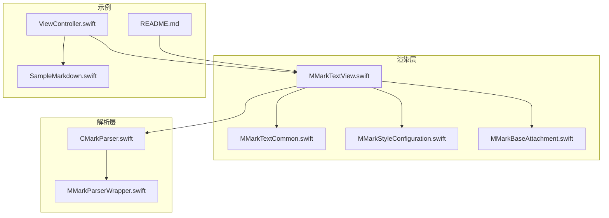
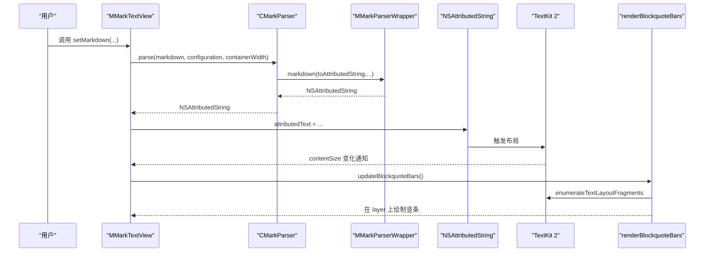
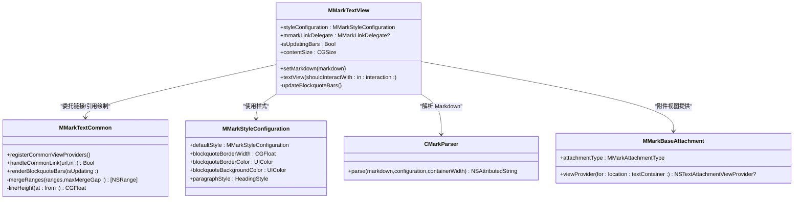
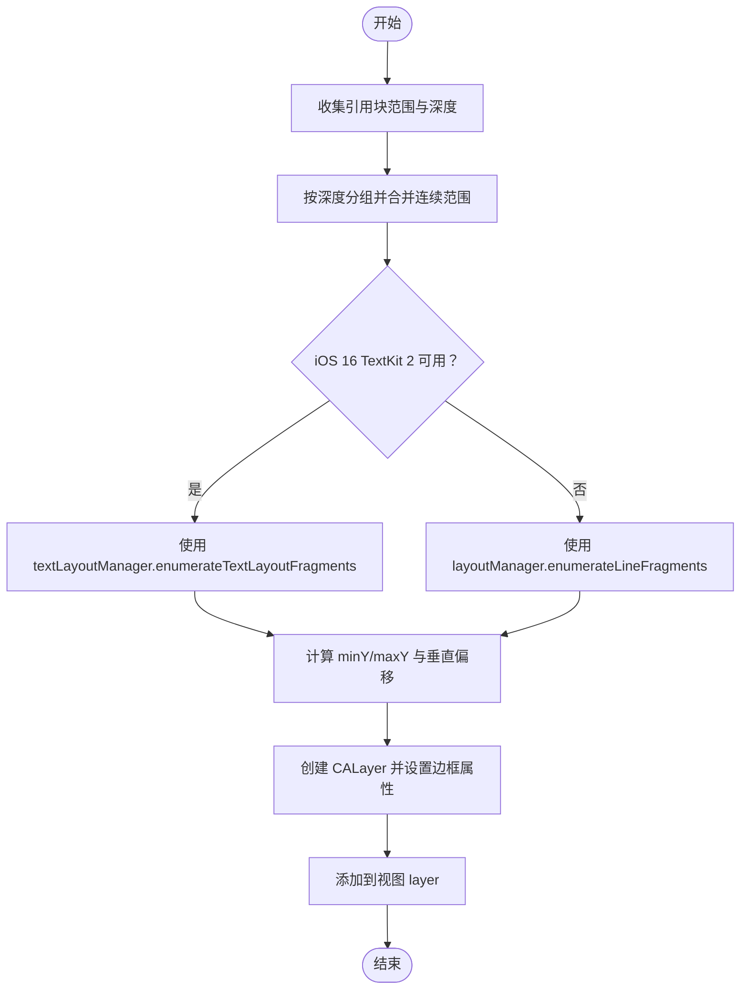
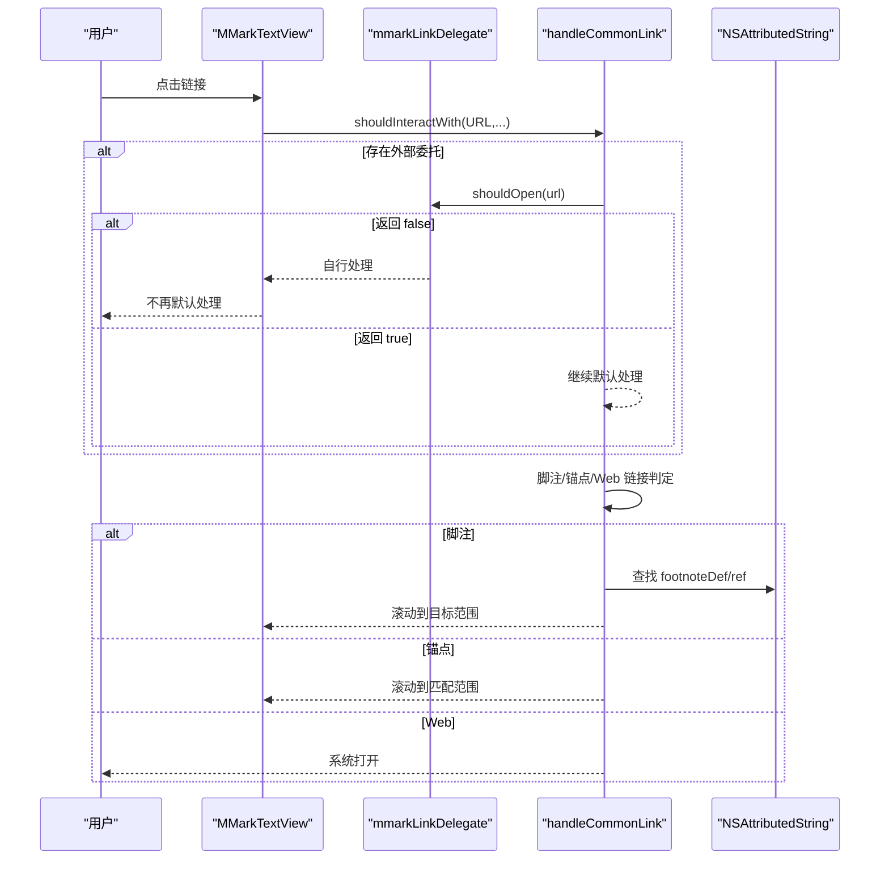
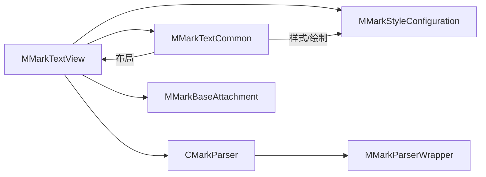

# MMarkTextView 文本视图

<cite>
**本文引用的文件**
- [MMarkTextView.swift](file://MMarkParser/Sources/Renderer/MMarkTextView.swift)
- [MMarkTextCommon.swift](file://MMarkParser/Sources/Renderer/MMarkTextCommon.swift)
- [MMarkStyleConfiguration.swift](file://MMarkParser/Sources/Renderer/MMarkStyleConfiguration.swift)
- [CMarkParser.swift](file://MMarkParser/Sources/Parser/CMarkParser.swift)
- [MMarkParserWrapper.swift](file://MMarkParser/Sources/Parser/MMarkParserWrapper.swift)
- [MMarkBaseAttachment.swift](file://MMarkParser/Sources/Renderer/Attachments/MMarkBaseAttachment/MMarkBaseAttachment.swift)
- [ViewController.swift](file://cocoapod_demo/cocoapod_demo/ViewController.swift)
- [SampleMarkdown.swift](file://cocoapod_demo/cocoapod_demo/SampleMarkdown.swift)
- [README.md](file://README.md)
</cite>

## 目录
1. [简介](#简介)
2. [项目结构](#项目结构)
3. [核心组件](#核心组件)
4. [架构总览](#架构总览)
5. [详细组件分析](#详细组件分析)
6. [依赖关系分析](#依赖关系分析)
7. [性能考量](#性能考量)
8. [故障排查指南](#故障排查指南)
9. [结论](#结论)
10. [附录](#附录)

## 简介
MMarkTextView 是一个基于 UITextView 的 Markdown 渲染组件，专为 iOS 15+ 设计，利用 TextKit 2 的布局引擎进行高性能渲染，并提供以下关键能力：
- Markdown 解析与富文本生成
- 引用块（blockquote）侧边竖条绘制
- 链接点击处理与脚注/锚点导航
- TextKit 2 布局完成后的异步更新机制
- 可定制的样式配置系统

## 项目结构
围绕 MMarkTextView 的相关源文件主要分布在以下模块：
- 渲染层：MMarkTextView、MMarkTextCommon、MMarkStyleConfiguration、MMarkBaseAttachment
- 解析层：CMarkParser、MMarkParserWrapper
- 示例与文档：README、示例工程 ViewController 与 SampleMarkdown

图表来源
- [MMarkTextView.swift:1-81](file://MMarkParser/Sources/Renderer/MMarkTextView.swift#L1-L81)
- [MMarkTextCommon.swift:1-290](file://MMarkParser/Sources/Renderer/MMarkTextCommon.swift#L1-L290)
- [MMarkStyleConfiguration.swift:1-339](file://MMarkParser/Sources/Renderer/MMarkStyleConfiguration.swift#L1-L339)
- [CMarkParser.swift:1-69](file://MMarkParser/Sources/Parser/CMarkParser.swift#L1-L69)
- [MMarkParserWrapper.swift:295-508](file://MMarkParser/Sources/Parser/MMarkParserWrapper.swift#L295-L508)
- [MMarkBaseAttachment.swift:1-59](file://MMarkParser/Sources/Renderer/Attachments/MMarkBaseAttachment/MMarkBaseAttachment.swift#L1-L59)
- [ViewController.swift:1-46](file://cocoapod_demo/cocoapod_demo/ViewController.swift#L1-L46)
- [SampleMarkdown.swift:1-760](file://cocoapod_demo/cocoapod_demo/SampleMarkdown.swift#L1-L760)
- [README.md:108-156](file://README.md#L108-L156)

章节来源
- [MMarkTextView.swift:1-81](file://MMarkParser/Sources/Renderer/MMarkTextView.swift#L1-L81)
- [README.md:108-156](file://README.md#L108-L156)

## 核心组件
- MMarkTextView：UITextView 子类，负责设置 Markdown 内容、处理链接点击、监听 contentSize 变化并触发引用块竖条绘制。
- MMarkTextCommon：提供共享的链接处理与引用块绘制逻辑，供 MMarkTextView 与 MMarkStreamTextView 复用。
- MMarkStyleConfiguration：样式配置结构体，定义标题、段落、代码、链接、引用块等样式及默认值。
- CMarkParser：封装 md4c 解析器，将 Markdown 转换为 NSAttributedString。
- MMarkParserWrapper：SAX 回调驱动的富文本构建器，负责属性栈管理、表格/代码缓冲区累积、引用块深度标记等。
- MMarkBaseAttachment：NSTextAttachment 子类，根据类型动态分派对应的视图提供者（View Provider）。

章节来源
- [MMarkTextView.swift:3-81](file://MMarkParser/Sources/Renderer/MMarkTextView.swift#L3-L81)
- [MMarkTextCommon.swift:18-290](file://MMarkParser/Sources/Renderer/MMarkTextCommon.swift#L18-L290)
- [MMarkStyleConfiguration.swift:10-339](file://MMarkParser/Sources/Renderer/MMarkStyleConfiguration.swift#L10-L339)
- [CMarkParser.swift:55-66](file://MMarkParser/Sources/Parser/CMarkParser.swift#L55-L66)
- [MMarkParserWrapper.swift:295-508](file://MMarkParser/Sources/Parser/MMarkParserWrapper.swift#L295-L508)
- [MMarkBaseAttachment.swift:12-59](file://MMarkParser/Sources/Renderer/Attachments/MMarkBaseAttachment/MMarkBaseAttachment.swift#L12-L59)

## 架构总览
MMarkTextView 的渲染流程遵循“解析 → 富文本 → TextKit 2 布局 → 引用块竖条绘制”的数据流。

图表来源
- [MMarkTextView.swift:39-61](file://MMarkParser/Sources/Renderer/MMarkTextView.swift#L39-L61)
- [CMarkParser.swift:55-66](file://MMarkParser/Sources/Parser/CMarkParser.swift#L55-L66)
- [MMarkParserWrapper.swift:295-508](file://MMarkParser/Sources/Parser/MMarkParserWrapper.swift#L295-L508)
- [MMarkTextCommon.swift:131-249](file://MMarkParser/Sources/Renderer/MMarkTextCommon.swift#L131-L249)

## 详细组件分析

### MMarkTextView 类分析
- 初始化与基础配置
  - 默认不可编辑、启用滚动、系统背景色、设置 delegate 为自身、清空链接文本属性。
  - 注册通用附件视图提供者，使 TextKit 2 能够按附件类型分派对应视图。
- Markdown 设置
  - 通过 CMarkParser 解析 Markdown，传入 styleConfiguration 与容器宽度，失败时回退为纯文本。
- 引用块竖条绘制
  - 监听 contentSize 变化，异步在主线程调用 updateBlockquoteBars，后者委托 MMarkTextCommon.renderBlockquoteBars 完成绘制。
- 链接点击处理
  - 实现 UITextViewDelegate 的 shouldInteractWith 方法，统一委托 MMarkTextCommon.handleCommonLink 处理脚注与锚点跳转，同时支持外部 MMarkLinkDelegate 回调。

图表来源
- [MMarkTextView.swift:6-81](file://MMarkParser/Sources/Renderer/MMarkTextView.swift#L6-L81)
- [MMarkTextCommon.swift:38-290](file://MMarkParser/Sources/Renderer/MMarkTextCommon.swift#L38-L290)
- [MMarkStyleConfiguration.swift:10-339](file://MMarkParser/Sources/Renderer/MMarkStyleConfiguration.swift#L10-L339)
- [CMarkParser.swift:55-66](file://MMarkParser/Sources/Parser/CMarkParser.swift#L55-L66)
- [MMarkBaseAttachment.swift:12-59](file://MMarkParser/Sources/Renderer/Attachments/MMarkBaseAttachment/MMarkBaseAttachment.swift#L12-L59)

章节来源
- [MMarkTextView.swift:3-81](file://MMarkParser/Sources/Renderer/MMarkTextView.swift#L3-L81)
- [MMarkTextCommon.swift:38-290](file://MMarkParser/Sources/Renderer/MMarkTextCommon.swift#L38-L290)

### 引用块边框绘制机制
- updateBlockquoteBars
  - 通过 MMarkTextView.contentSize 变化触发，避免在布局前绘制导致的坐标不准确。
  - 使用 MMarkTextCommon.renderBlockquoteBars 完成实际绘制。
- renderBlockquoteBars
  - 清理旧竖条层（名称为特定标识），遍历富文本中的 .blockquote 属性，收集范围与深度。
  - 按深度层级合并连续范围，计算每层的最小/最大 Y 坐标，结合样式配置的边框宽度与间距，创建 CALayer 并添加到视图层。
  - 支持 iOS 16 TextKit 2 的 textLayoutManager，若可用则使用 enumerateTextLayoutFragments 获取布局片段；否则回退至 TextKit 1 的 layoutManager。
  - 行高微调：通过 lineHeight 计算垂直偏移，提升竖条视觉居中效果。
- 渲染时机
  - 由于引用绘制依赖最终布局结果，因此采用 contentSize 变化作为触发点，配合主线程异步调度，确保在 TextKit 2 布局完成后执行。

图表来源
- [MMarkTextCommon.swift:131-249](file://MMarkParser/Sources/Renderer/MMarkTextCommon.swift#L131-L249)
- [MMarkTextView.swift:51-61](file://MMarkParser/Sources/Renderer/MMarkTextView.swift#L51-L61)

章节来源
- [MMarkTextCommon.swift:131-249](file://MMarkParser/Sources/Renderer/MMarkTextCommon.swift#L131-L249)
- [MMarkTextView.swift:51-61](file://MMarkParser/Sources/Renderer/MMarkTextView.swift#L51-L61)

### 链接点击处理系统
- MMarkLinkDelegate 协议
  - 提供 shouldOpen 回调，允许外部接管链接处理逻辑；返回 true 表示让 MMarkParser 默认处理，返回 false 表示完全自定义。
- handleCommonLink
  - 优先回调外部 mmarkLinkDelegate.shouldOpen。
  - 对于脚注（footnote scheme）：根据标签定位 footnoteDef 或 footnoteRef 的范围并滚动到可见区域。
  - 对于锚点（fragment 或无 scheme 且有 fragment）：模糊匹配标题行或文本片段，滚动到目标范围；若未命中且为 Web 链接则交由系统处理。
  - 对于 http/https/mailto/tel：直接放行给系统浏览器或拨号。
- UITextViewDelegate 集成
  - MMarkTextView 实现 shouldInteractWith，统一委托 handleCommonLink。

图表来源
- [MMarkTextCommon.swift:48-129](file://MMarkParser/Sources/Renderer/MMarkTextCommon.swift#L48-L129)
- [MMarkTextView.swift:67-71](file://MMarkParser/Sources/Renderer/MMarkTextView.swift#L67-L71)

章节来源
- [MMarkTextCommon.swift:18-290](file://MMarkParser/Sources/Renderer/MMarkTextCommon.swift#L18-L290)
- [MMarkTextView.swift:67-71](file://MMarkParser/Sources/Renderer/MMarkTextView.swift#L67-L71)

### TextKit 2 布局引擎集成
- 布局监听与异步更新
  - 通过重写 contentSize 并在 didSet 中异步调度，确保在 TextKit 2 完成布局后再进行引用竖条绘制，避免坐标错误。
- TextKit 2/1 兼容
  - 当可用时使用 textLayoutManager.enumerateTextLayoutFragments 获取布局片段；否则回退到 layoutManager.enumerateLineFragments。
- 附件视图提供
  - 通过 NSTextAttachment.registerViewProviderClass 注册通用列表标记视图提供者，MMarkBaseAttachment 根据类型分派具体视图提供者，实现代码块、表格、图片、数学公式等附件的自定义渲染。

章节来源
- [MMarkTextView.swift:51-61](file://MMarkParser/Sources/Renderer/MMarkTextView.swift#L51-L61)
- [MMarkTextCommon.swift:38-46](file://MMarkParser/Sources/Renderer/MMarkTextCommon.swift#L38-L46)
- [MMarkBaseAttachment.swift:32-58](file://MMarkParser/Sources/Renderer/Attachments/MMarkBaseAttachment/MMarkBaseAttachment.swift#L32-L58)

### 样式配置系统
- MMarkStyleConfiguration
  - 定义标题、段落、代码、链接、引用块、表格、任务列表、数学公式、脚注等样式字段。
  - 提供 defaultStyle，覆盖常用 UI 场景的颜色、字体、圆角、内边距等。
  - 引用块样式包含边框宽度、边框颜色、背景色等，用于 renderBlockquoteBars 的绘制。
- MMarkTextView.styleConfiguration
  - 默认使用 defaultStyle，可按需替换为自定义配置以适配主题。

章节来源
- [MMarkStyleConfiguration.swift:10-339](file://MMarkParser/Sources/Renderer/MMarkStyleConfiguration.swift#L10-L339)
- [MMarkTextView.swift:8-9](file://MMarkParser/Sources/Renderer/MMarkTextView.swift#L8-L9)

### API 参考
- 初始化
  - convenience init()：便捷构造
  - init(frame:textContainer:)：标准构造
  - required init?(coder:)：XIB/Storyboard 支持
- 属性
  - styleConfiguration: MMarkStyleConfiguration（默认 .defaultStyle）
  - mmarkLinkDelegate: MMarkLinkDelegate?（可选）
- 方法
  - setMarkdown(_:)：解析 Markdown 并设置为 attributedText
  - contentSize：重写，监听变化并异步更新引用竖条
  - textView(_:shouldInteractWith:in:interaction:)：链接点击处理入口

章节来源
- [MMarkTextView.swift:16-37](file://MMarkParser/Sources/Renderer/MMarkTextView.swift#L16-L37)
- [MMarkTextView.swift:39-49](file://MMarkParser/Sources/Renderer/MMarkTextView.swift#L39-L49)
- [MMarkTextView.swift:51-61](file://MMarkParser/Sources/Renderer/MMarkTextView.swift#L51-L61)
- [MMarkTextView.swift:67-71](file://MMarkParser/Sources/Renderer/MMarkTextView.swift#L67-L71)

### 使用示例与最佳实践
- 示例工程
  - ViewController 中创建 MMarkTextView，设置约束并调用 setMarkdown 加载完整 Markdown 文本。
  - SampleMarkdown 提供了丰富的 Markdown 示例，涵盖标题、列表、引用、表格、代码、数学公式、脚注等。
- 最佳实践
  - 在视图布局完成后调用 setMarkdown，确保容器宽度计算准确。
  - 为 mmarkLinkDelegate 提供自定义链接处理逻辑，避免系统默认行为带来的安全问题。
  - 自定义 styleConfiguration 时，建议保持引用块边框宽度与间距的协调，以获得良好的视觉效果。
  - 注意 iOS 16 TextKit 2 的兼容性，引用绘制在可用时能获得更精确的布局片段信息。

章节来源
- [ViewController.swift:11-43](file://cocoapod_demo/cocoapod_demo/ViewController.swift#L11-L43)
- [SampleMarkdown.swift:3-760](file://cocoapod_demo/cocoapod_demo/SampleMarkdown.swift#L3-L760)

## 依赖关系分析
- 组件耦合
  - MMarkTextView 与 MMarkTextCommon 通过协议 MMarkTextComponent 解耦，便于在 MMarkStreamTextView 中复用公共逻辑。
  - MMarkTextView 依赖 CMarkParser 与 MMarkParserWrapper 生成 NSAttributedString，再交由 TextKit 2 布局。
  - 引用块绘制依赖 MMarkStyleConfiguration 的样式字段，以及 TextKit 2/1 的布局接口。
- 外部依赖
  - TextKit 2（iOS 16+）：提供更高效的布局枚举与片段计算。
  - iosMath：用于数学公式渲染（在样式配置中体现）。

图表来源
- [MMarkTextView.swift:6-81](file://MMarkParser/Sources/Renderer/MMarkTextView.swift#L6-L81)
- [MMarkTextCommon.swift:38-290](file://MMarkParser/Sources/Renderer/MMarkTextCommon.swift#L38-L290)
- [MMarkStyleConfiguration.swift:10-339](file://MMarkParser/Sources/Renderer/MMarkStyleConfiguration.swift#L10-L339)
- [CMarkParser.swift:55-66](file://MMarkParser/Sources/Parser/CMarkParser.swift#L55-L66)
- [MMarkParserWrapper.swift:295-508](file://MMarkParser/Sources/Parser/MMarkParserWrapper.swift#L295-L508)
- [MMarkBaseAttachment.swift:12-59](file://MMarkParser/Sources/Renderer/Attachments/MMarkBaseAttachment/MMarkBaseAttachment.swift#L12-L59)

章节来源
- [MMarkTextView.swift:6-81](file://MMarkParser/Sources/Renderer/MMarkTextView.swift#L6-L81)
- [MMarkTextCommon.swift:38-290](file://MMarkParser/Sources/Renderer/MMarkTextCommon.swift#L38-L290)

## 性能考量
- 异步更新与防抖
  - 通过 contentSize 变化触发 updateBlockquoteBars，并在主线程异步执行，避免阻塞 UI 线程。
- TextKit 2 优化
  - 在 iOS 16+ 使用 textLayoutManager.enumerateTextLayoutFragments，减少遍历成本，提高引用块绘制精度。
- 样式与布局分离
  - 样式配置独立于绘制逻辑，便于缓存与复用，降低重复计算开销。
- 附件视图提供
  - 通过 View Provider 机制延迟加载附件视图，减少初始渲染压力。

[本节为通用性能讨论，无需列出具体文件来源]

## 故障排查指南
- 引用块竖条未显示
  - 检查是否在 iOS 16+ 使用 TextKit 2，确认 contentSize 是否发生变更。
  - 确认 styleConfiguration 中的 blockquoteBorderWidth 与 blockquoteBorderColor 是否合理。
- 链接点击无响应
  - 确认 mmarkLinkDelegate 是否正确设置，shouldOpen 返回值是否符合预期。
  - 检查链接是否为脚注或锚点，若是，确认富文本中是否存在匹配的 footnoteDef/ref 或标题行。
- 布局错位或越界
  - 确保在视图布局完成后调用 setMarkdown，容器宽度计算准确。
  - 若在 iOS 16+，确认 textLayoutManager 可用且未被外部修改。

章节来源
- [MMarkTextCommon.swift:131-249](file://MMarkParser/Sources/Renderer/MMarkTextCommon.swift#L131-L249)
- [MMarkTextView.swift:51-61](file://MMarkParser/Sources/Renderer/MMarkTextView.swift#L51-L61)

## 结论
MMarkTextView 通过将 Markdown 解析、富文本生成与 TextKit 2 布局相结合，提供了高性能、可定制的 Markdown 渲染体验。其核心优势在于：
- 精准的引用块竖条绘制，兼顾 iOS 16 TextKit 2 与 1 的兼容性
- 完备的链接处理体系，支持脚注与锚点导航
- 可扩展的样式配置，满足不同主题需求
- 与附件视图提供机制的无缝集成，支持代码块、表格、图片、数学公式等复杂内容

[本节为总结性内容，无需列出具体文件来源]

## 附录
- 数据流概览（来自 README）
  - Markdown 字符串经由 MMarkParser.parse → CMarkParser → md4c SAX 回调 → 属性栈与缓冲区累积 → NSAttributedString → MMarkTextView → TextKit 2 布局 → 屏幕呈现。

章节来源
- [README.md:158-180](file://README.md#L158-L180)