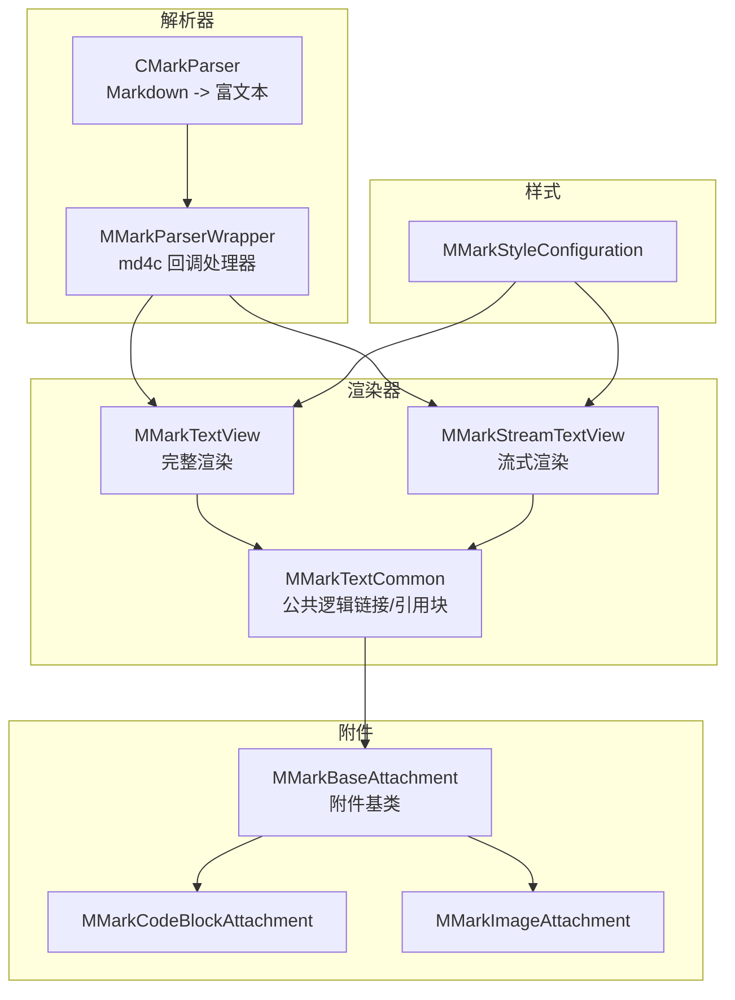
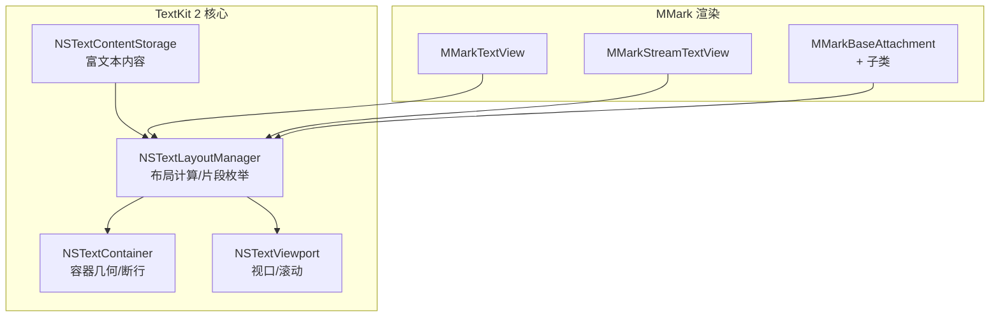
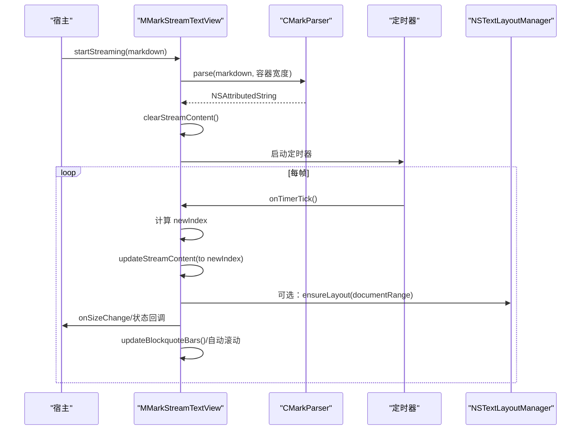
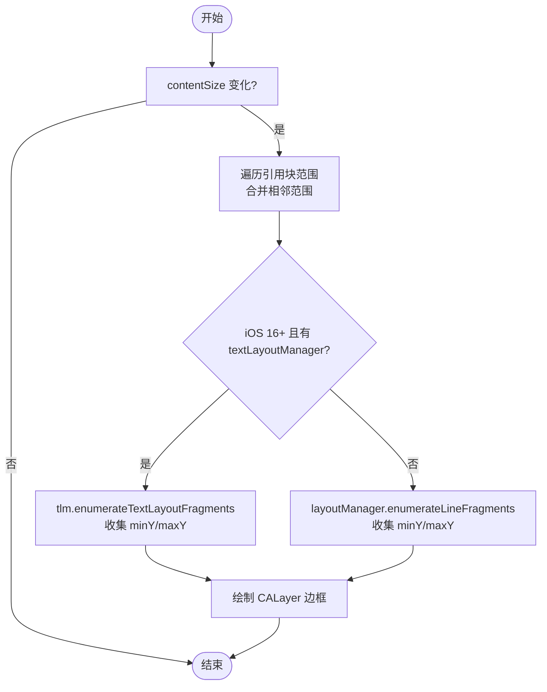
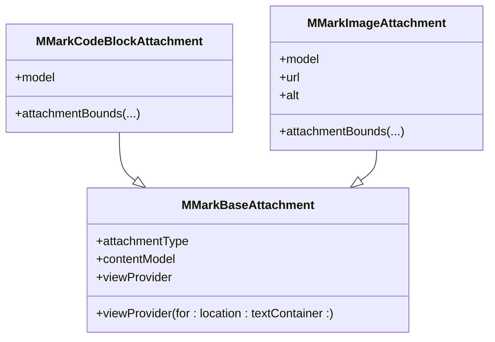
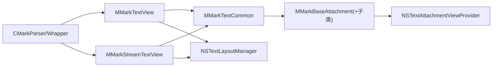

# TextKit 2 集成与优化

<cite>
**本文档引用的文件**
- [MMarkStreamTextView.swift](file://MMarkParser/Sources/Renderer/MMarkStreamTextView.swift)
- [MMarkTextView.swift](file://MMarkParser/Sources/Renderer/MMarkTextView.swift)
- [MMarkTextCommon.swift](file://MMarkParser/Sources/Renderer/MMarkTextCommon.swift)
- [CMarkParser.swift](file://MMarkParser/Sources/Parser/CMarkParser.swift)
- [MMarkParserWrapper.swift](file://MMarkParser/Sources/Parser/MMarkParserWrapper.swift)
- [MMarkBaseAttachment.swift](file://MMarkParser/Sources/Renderer/Attachments/MMarkBaseAttachment/MMarkBaseAttachment.swift)
- [MMarkCodeBlockAttachment.swift](file://MMarkParser/Sources/Renderer/Attachments/MMarkCodeBlockAttachment/MMarkCodeBlockAttachment.swift)
- [MMarkImageAttachment.swift](file://MMarkParser/Sources/Renderer/Attachments/MMarkImageAttachment/MMarkImageAttachment.swift)
- [MMarkStyleConfiguration.swift](file://MMarkParser/Sources/Renderer/MMarkStyleConfiguration.swift)
</cite>

## 目录
1. [简介](#简介)
2. [项目结构](#项目结构)
3. [核心组件](#核心组件)
4. [架构总览](#架构总览)
5. [组件详解](#组件详解)
6. [依赖关系分析](#依赖关系分析)
7. [性能考量](#性能考量)
8. [故障排查指南](#故障排查指南)
9. [结论](#结论)
10. [附录](#附录)

## 简介
本技术文档围绕 MMarkParser 在 iOS 15+ 上对 TextKit 2 的集成与优化展开，重点阐释以下主题：
- TextKit 2 的新特性及其在 Markdown 渲染中的应用
- NSTextContainer、NSTextLayoutManager、NSTextViewport 的协作机制及性能与准确性的提升
- TextKit 2 相较传统 TextKit 的优势：更优布局算法、更精确光标控制、更高效内存管理
- MMarkParser 如何利用 TextKit 2 实现引用块边框的动态更新、链接区域的精确计算、附件内容的智能布局
- 性能优化策略：延迟加载、增量更新、内存池管理
- 具体代码示例与调试技巧，帮助开发者理解并优化 TextKit 2 的使用

## 项目结构
本项目采用“渲染器 + 解析器 + 附件模型/视图”的分层组织方式，渲染器负责基于 TextKit 2 的增量渲染与交互，解析器负责将 Markdown 转换为富文本，附件模块负责复杂内容（如代码块、图片、表格等）的视图提供。

图表来源
- [MMarkTextView.swift:1-81](file://MMarkParser/Sources/Renderer/MMarkTextView.swift#L1-L81)
- [MMarkStreamTextView.swift:1-398](file://MMarkParser/Sources/Renderer/MMarkStreamTextView.swift#L1-L398)
- [MMarkTextCommon.swift:1-290](file://MMarkParser/Sources/Renderer/MMarkTextCommon.swift#L1-L290)
- [CMarkParser.swift:1-81](file://MMarkParser/Sources/Parser/CMarkParser.swift#L1-L81)
- [MMarkParserWrapper.swift:1-800](file://MMarkParser/Sources/Parser/MMarkParserWrapper.swift#L1-L800)
- [MMarkBaseAttachment.swift:1-60](file://MMarkParser/Sources/Renderer/Attachments/MMarkBaseAttachment/MMarkBaseAttachment.swift#L1-L60)
- [MMarkCodeBlockAttachment.swift:1-22](file://MMarkParser/Sources/Renderer/Attachments/MMarkCodeBlockAttachment/MMarkCodeBlockAttachment.swift#L1-L22)
- [MMarkImageAttachment.swift:1-23](file://MMarkParser/Sources/Renderer/Attachments/MMarkImageAttachment/MMarkImageAttachment.swift#L1-L23)
- [MMarkStyleConfiguration.swift:1-339](file://MMarkParser/Sources/Renderer/MMarkStyleConfiguration.swift#L1-L339)

章节来源
- [MMarkTextView.swift:1-81](file://MMarkParser/Sources/Renderer/MMarkTextView.swift#L1-L81)
- [MMarkStreamTextView.swift:1-398](file://MMarkParser/Sources/Renderer/MMarkStreamTextView.swift#L1-L398)
- [MMarkTextCommon.swift:1-290](file://MMarkParser/Sources/Renderer/MMarkTextCommon.swift#L1-L290)
- [CMarkParser.swift:1-81](file://MMarkParser/Sources/Parser/CMarkParser.swift#L1-L81)
- [MMarkParserWrapper.swift:1-800](file://MMarkParser/Sources/Parser/MMarkParserWrapper.swift#L1-L800)
- [MMarkBaseAttachment.swift:1-60](file://MMarkParser/Sources/Renderer/Attachments/MMarkBaseAttachment/MMarkBaseAttachment.swift#L1-L60)
- [MMarkCodeBlockAttachment.swift:1-22](file://MMarkParser/Sources/Renderer/Attachments/MMarkCodeBlockAttachment/MMarkCodeBlockAttachment.swift#L1-L22)
- [MMarkImageAttachment.swift:1-23](file://MMarkParser/Sources/Renderer/Attachments/MMarkImageAttachment/MMarkImageAttachment.swift#L1-L23)
- [MMarkStyleConfiguration.swift:1-339](file://MMarkParser/Sources/Renderer/MMarkStyleConfiguration.swift#L1-L339)

## 核心组件
- MMarkTextView：完整渲染 Markdown，支持引用块竖条绘制与链接处理。
- MMarkStreamTextView：流式渲染 Markdown，支持定时增量更新、自动滚动、委托回调。
- MMarkTextCommon：TextKit 2/1 的公共逻辑，包括引用块边框绘制、链接处理、行高估算与范围合并。
- CMarkParser 与 MMarkParserWrapper：基于 md4c 的 SAX 回调解析器，构建富文本与附件。
- 附件体系：MMarkBaseAttachment 及其子类（代码块、图片等），通过 NSTextAttachmentViewProvider 提供视图。
- MMarkStyleConfiguration：样式配置，影响引用块边框、链接、代码块、表格等外观。

章节来源
- [MMarkTextView.swift:1-81](file://MMarkParser/Sources/Renderer/MMarkTextView.swift#L1-L81)
- [MMarkStreamTextView.swift:1-398](file://MMarkParser/Sources/Renderer/MMarkStreamTextView.swift#L1-L398)
- [MMarkTextCommon.swift:1-290](file://MMarkParser/Sources/Renderer/MMarkTextCommon.swift#L1-L290)
- [CMarkParser.swift:1-81](file://MMarkParser/Sources/Parser/CMarkParser.swift#L1-L81)
- [MMarkParserWrapper.swift:1-800](file://MMarkParser/Sources/Parser/MMarkParserWrapper.swift#L1-L800)
- [MMarkBaseAttachment.swift:1-60](file://MMarkParser/Sources/Renderer/Attachments/MMarkBaseAttachment/MMarkBaseAttachment.swift#L1-L60)
- [MMarkStyleConfiguration.swift:1-339](file://MMarkParser/Sources/Renderer/MMarkStyleConfiguration.swift#L1-L339)

## 架构总览
TextKit 2 的核心在于将布局、内容与视口解耦：
- NSTextContentStorage：富文本内容存储与编辑事务
- NSTextLayoutManager：基于 NSTextContentStorage 的布局计算与片段枚举
- NSTextContainer：容器几何与断行规则
- NSTextViewport：视口滚动与可见区域管理（iOS 16+）

MMarkParser 在渲染器中通过 textLayoutManager 访问布局信息，结合附件视图提供者，实现复杂内容的智能布局与动态更新。

图表来源
- [MMarkStreamTextView.swift:126-156](file://MMarkParser/Sources/Renderer/MMarkStreamTextView.swift#L126-L156)
- [MMarkTextView.swift:52-61](file://MMarkParser/Sources/Renderer/MMarkTextView.swift#L52-L61)
- [MMarkTextCommon.swift:170-218](file://MMarkParser/Sources/Renderer/MMarkTextCommon.swift#L170-L218)
- [MMarkBaseAttachment.swift:32-58](file://MMarkParser/Sources/Renderer/Attachments/MMarkBaseAttachment/MMarkBaseAttachment.swift#L32-L58)

## 组件详解

### MMarkStreamTextView：流式渲染与增量更新
- 定时器驱动的增量更新：通过定时器周期性推进 displayIndex，仅追加新增富文本，避免全量重布局。
- TextKit 2 路径：当可用时，使用 textLayoutManager.textContentManager 的编辑事务接口进行增量插入与替换，减少桥接成本。
- 自动滚动：检测用户是否处于底部，自动滚动至最新内容。
- 委托回调：尺寸变化、状态变更、流式完成事件通知宿主。

图表来源
- [MMarkStreamTextView.swift:174-201](file://MMarkParser/Sources/Renderer/MMarkStreamTextView.swift#L174-L201)
- [MMarkStreamTextView.swift:203-243](file://MMarkParser/Sources/Renderer/MMarkStreamTextView.swift#L203-L243)
- [MMarkStreamTextView.swift:304-351](file://MMarkParser/Sources/Renderer/MMarkStreamTextView.swift#L304-L351)
- [MMarkStreamTextView.swift:113-140](file://MMarkParser/Sources/Renderer/MMarkStreamTextView.swift#L113-L140)
- [CMarkParser.swift:55-66](file://MMarkParser/Sources/Parser/CMarkParser.swift#L55-L66)

章节来源
- [MMarkStreamTextView.swift:1-398](file://MMarkParser/Sources/Renderer/MMarkStreamTextView.swift#L1-L398)
- [CMarkParser.swift:1-81](file://MMarkParser/Sources/Parser/CMarkParser.swift#L1-L81)

### MMarkTextView：完整渲染与引用块竖条
- 完整渲染：解析后一次性设置富文本，监听 contentSize 变化以触发引用块竖条绘制。
- 引用块竖条：基于 NSTextLayoutManager 片段枚举计算每段引用块的最小包围矩形，绘制多层边框。

图表来源
- [MMarkTextView.swift:52-61](file://MMarkParser/Sources/Renderer/MMarkTextView.swift#L52-L61)
- [MMarkTextCommon.swift:131-249](file://MMarkParser/Sources/Renderer/MMarkTextCommon.swift#L131-L249)

章节来源
- [MMarkTextView.swift:1-81](file://MMarkParser/Sources/Renderer/MMarkTextView.swift#L1-L81)
- [MMarkTextCommon.swift:1-290](file://MMarkParser/Sources/Renderer/MMarkTextCommon.swift#L1-L290)

### MMarkTextCommon：公共逻辑（链接与引用块）
- 链接处理：统一处理外部链接、脚注与锚点跳转，支持百分号编码与模糊锚点匹配。
- 引用块竖条：跨版本兼容（TextKit 2/1），支持多层深度边框绘制与范围合并。

章节来源
- [MMarkTextCommon.swift:18-29](file://MMarkParser/Sources/Renderer/MMarkTextCommon.swift#L18-L29)
- [MMarkTextCommon.swift:48-130](file://MMarkParser/Sources/Renderer/MMarkTextCommon.swift#L48-L130)
- [MMarkTextCommon.swift:131-249](file://MMarkParser/Sources/Renderer/MMarkTextCommon.swift#L131-L249)

### CMarkParser 与 MMarkParserWrapper：富文本构建
- CMarkParser：封装 md4c 的 SAX 回调，将 Markdown 转为 NSAttributedString。
- MMarkParserWrapper：_MD4CHandler 作为 md4c 回调处理器，维护上下文状态（缩进、列表深度、引用块深度等），输出富文本与附件。

章节来源
- [CMarkParser.swift:1-81](file://MMarkParser/Sources/Parser/CMarkParser.swift#L1-L81)
- [MMarkParserWrapper.swift:1-800](file://MMarkParser/Sources/Parser/MMarkParserWrapper.swift#L1-L800)

### 附件体系：智能布局与视图提供
- MMarkBaseAttachment：根据类型返回对应的 NSTextAttachmentViewProvider，延迟创建并缓存。
- 代码块与图片附件：在 attachmentBounds 中根据行片段宽度与容器宽度约束尺寸，避免溢出与裁剪。

图表来源
- [MMarkBaseAttachment.swift:12-58](file://MMarkParser/Sources/Renderer/Attachments/MMarkBaseAttachment/MMarkBaseAttachment.swift#L12-L58)
- [MMarkCodeBlockAttachment.swift:6-21](file://MMarkParser/Sources/Renderer/Attachments/MMarkCodeBlockAttachment/MMarkCodeBlockAttachment.swift#L6-L21)
- [MMarkImageAttachment.swift:5-22](file://MMarkParser/Sources/Renderer/Attachments/MMarkImageAttachment/MMarkImageAttachment.swift#L5-L22)

章节来源
- [MMarkBaseAttachment.swift:1-60](file://MMarkParser/Sources/Renderer/Attachments/MMarkBaseAttachment/MMarkBaseAttachment.swift#L1-L60)
- [MMarkCodeBlockAttachment.swift:1-22](file://MMarkParser/Sources/Renderer/Attachments/MMarkCodeBlockAttachment/MMarkCodeBlockAttachment.swift#L1-L22)
- [MMarkImageAttachment.swift:1-23](file://MMarkParser/Sources/Renderer/Attachments/MMarkImageAttachment/MMarkImageAttachment.swift#L1-L23)

### 样式配置：影响布局与外观
- 引用块边框宽度、颜色、背景色
- 代码块、表格、链接、数学公式等样式
- 通过样式配置影响附件尺寸与边框绘制

章节来源
- [MMarkStyleConfiguration.swift:109-147](file://MMarkParser/Sources/Renderer/MMarkStyleConfiguration.swift#L109-L147)
- [MMarkStyleConfiguration.swift:189-267](file://MMarkParser/Sources/Renderer/MMarkStyleConfiguration.swift#L189-L267)

## 依赖关系分析
- 渲染器依赖解析器生成富文本；渲染器依赖附件体系提供复杂内容视图。
- 文本布局依赖 NSTextLayoutManager；引用块竖条绘制依赖布局片段信息。
- 链接处理与锚点跳转依赖富文本属性与枚举。

图表来源
- [CMarkParser.swift:55-66](file://MMarkParser/Sources/Parser/CMarkParser.swift#L55-L66)
- [MMarkTextView.swift:40-49](file://MMarkParser/Sources/Renderer/MMarkTextView.swift#L40-L49)
- [MMarkStreamTextView.swift:174-201](file://MMarkParser/Sources/Renderer/MMarkStreamTextView.swift#L174-L201)
- [MMarkTextCommon.swift:48-46](file://MMarkParser/Sources/Renderer/MMarkTextCommon.swift#L48-L46)
- [MMarkBaseAttachment.swift:32-58](file://MMarkParser/Sources/Renderer/Attachments/MMarkBaseAttachment/MMarkBaseAttachment.swift#L32-L58)

章节来源
- [CMarkParser.swift:1-81](file://MMarkParser/Sources/Parser/CMarkParser.swift#L1-L81)
- [MMarkTextView.swift:1-81](file://MMarkParser/Sources/Renderer/MMarkTextView.swift#L1-L81)
- [MMarkStreamTextView.swift:1-398](file://MMarkParser/Sources/Renderer/MMarkStreamTextView.swift#L1-L398)
- [MMarkTextCommon.swift:1-290](file://MMarkParser/Sources/Renderer/MMarkTextCommon.swift#L1-L290)
- [MMarkBaseAttachment.swift:1-60](file://MMarkParser/Sources/Renderer/Attachments/MMarkBaseAttachment/MMarkBaseAttachment.swift#L1-L60)

## 性能考量
- 增量更新
  - MMarkStreamTextView 通过定时器与编辑事务进行增量插入，避免全量重布局，显著降低大文档渲染成本。
  - 动态块大小：长文档自动增大 chunk，维持流畅的视觉体验。
- 延迟加载与懒提供
  - 附件视图提供者按需创建并缓存，减少初始化开销。
- 布局片段枚举
  - TextKit 2 的 enumerateTextLayoutFragments 可确保布局存在后再绘制引用块竖条，避免额外布局计算。
- 内存管理
  - 使用编辑事务与增量字符串操作，减少中间对象与复制次数。
  - 附件尺寸约束避免过度绘制与离屏渲染。

章节来源
- [MMarkStreamTextView.swift:304-351](file://MMarkParser/Sources/Renderer/MMarkStreamTextView.swift#L304-L351)
- [MMarkStreamTextView.swift:113-140](file://MMarkParser/Sources/Renderer/MMarkStreamTextView.swift#L113-L140)
- [MMarkTextCommon.swift:170-218](file://MMarkParser/Sources/Renderer/MMarkTextCommon.swift#L170-L218)
- [MMarkBaseAttachment.swift:32-58](file://MMarkParser/Sources/Renderer/Attachments/MMarkBaseAttachment/MMarkBaseAttachment.swift#L32-L58)

## 故障排查指南
- 引用块竖条未显示
  - 确认已注册附件视图提供者，以便 TextKit 2 激活附件视图与布局。
  - 检查是否在 iOS 16+ 下使用 textLayoutManager，确保片段枚举可用。
- 链接点击无效或崩溃
  - 检查链接 URL 编码（特别是锚点与非 ASCII 字符），确保 percent-encoding 正确。
  - 确认 mmarkLinkDelegate 的回调逻辑正确返回是否继续默认处理。
- 图片/代码块显示异常
  - 检查 attachmentBounds 的宽度约束与容器宽度，避免溢出与裁剪。
  - 确保附件模型尺寸合理，避免极端宽高比导致布局抖动。
- 流式渲染卡顿
  - 调整 typingSpeed 与 chunkSize，平衡流畅度与 CPU 占用。
  - 避免在主线程执行耗时操作，解析与 UI 更新分离队列。

章节来源
- [MMarkTextCommon.swift:48-130](file://MMarkParser/Sources/Renderer/MMarkTextCommon.swift#L48-L130)
- [MMarkParserWrapper.swift:690-701](file://MMarkParser/Sources/Parser/MMarkParserWrapper.swift#L690-L701)
- [MMarkCodeBlockAttachment.swift:15-20](file://MMarkParser/Sources/Renderer/Attachments/MMarkCodeBlockAttachment/MMarkCodeBlockAttachment.swift#L15-L20)
- [MMarkImageAttachment.swift:17-21](file://MMarkParser/Sources/Renderer/Attachments/MMarkImageAttachment/MMarkImageAttachment.swift#L17-L21)
- [MMarkStreamTextView.swift:304-351](file://MMarkParser/Sources/Renderer/MMarkStreamTextView.swift#L304-L351)

## 结论
MMarkParser 在 iOS 15+ 上充分利用 TextKit 2 的布局与视图提供能力，实现了：
- 流式渲染与增量更新，显著降低大文档渲染成本
- 动态引用块竖条绘制，跨版本兼容
- 精确链接区域与锚点跳转，提升交互体验
- 附件内容的智能布局与懒加载，优化内存与性能

通过合理的架构设计与性能策略，项目在保证功能完整性的同时，兼顾了实时性与资源占用。

## 附录
- 代码示例路径（不展示具体代码内容）
  - 流式渲染启动与增量更新：[MMarkStreamTextView.swift:174-201](file://MMarkParser/Sources/Renderer/MMarkStreamTextView.swift#L174-L201)、[MMarkStreamTextView.swift:304-351](file://MMarkParser/Sources/Renderer/MMarkStreamTextView.swift#L304-L351)
  - 增量内容插入（TextKit 2 路径）：[MMarkStreamTextView.swift:113-140](file://MMarkParser/Sources/Renderer/MMarkStreamTextView.swift#L113-L140)
  - 引用块竖条绘制（TextKit 2 片段枚举）：[MMarkTextCommon.swift:170-218](file://MMarkParser/Sources/Renderer/MMarkTextCommon.swift#L170-L218)
  - 链接处理与锚点跳转：[MMarkTextCommon.swift:48-130](file://MMarkParser/Sources/Renderer/MMarkTextCommon.swift#L48-L130)
  - 附件视图提供者注册与选择：[MMarkBaseAttachment.swift:32-58](file://MMarkParser/Sources/Renderer/Attachments/MMarkBaseAttachment/MMarkBaseAttachment.swift#L32-L58)
  - 附件尺寸约束（代码块/图片）：[MMarkCodeBlockAttachment.swift:15-20](file://MMarkParser/Sources/Renderer/Attachments/MMarkCodeBlockAttachment/MMarkCodeBlockAttachment.swift#L15-L20)、[MMarkImageAttachment.swift:17-21](file://MMarkParser/Sources/Renderer/Attachments/MMarkImageAttachment/MMarkImageAttachment.swift#L17-L21)
  - 样式配置（引用块边框等）：[MMarkStyleConfiguration.swift:109-147](file://MMarkParser/Sources/Renderer/MMarkStyleConfiguration.swift#L109-L147)