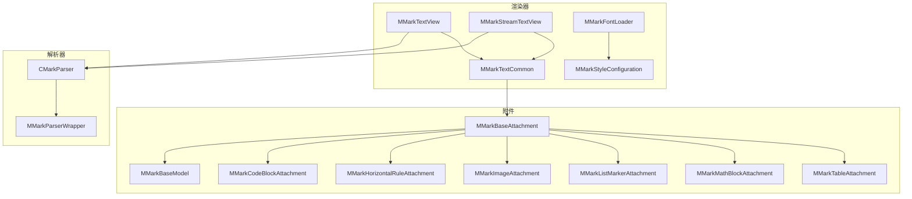
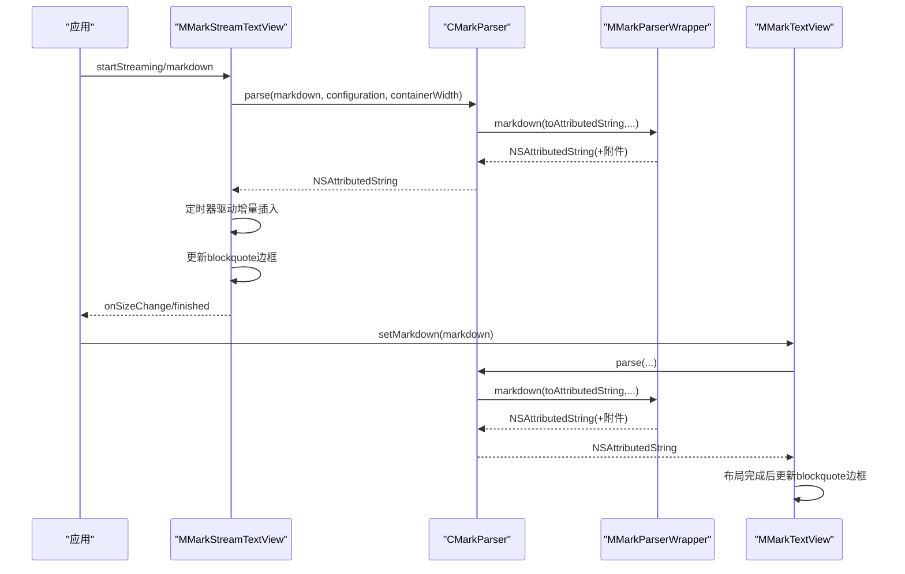
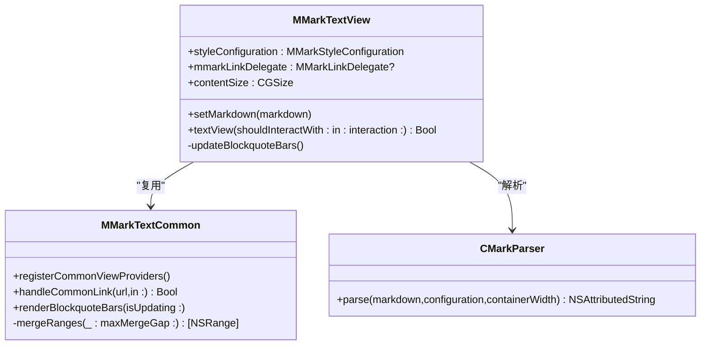
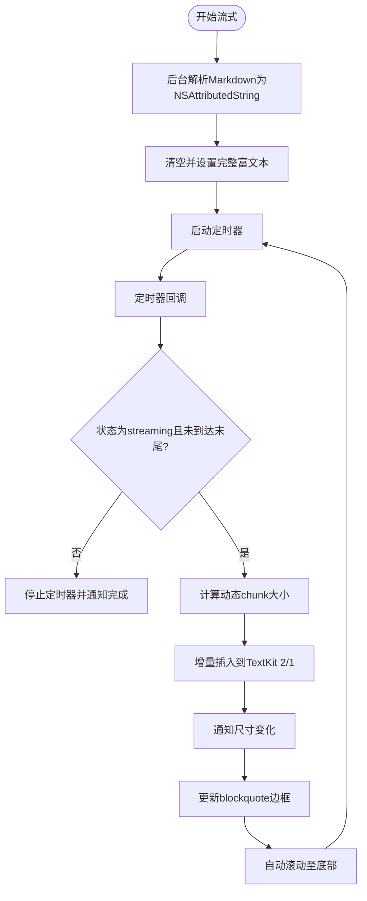
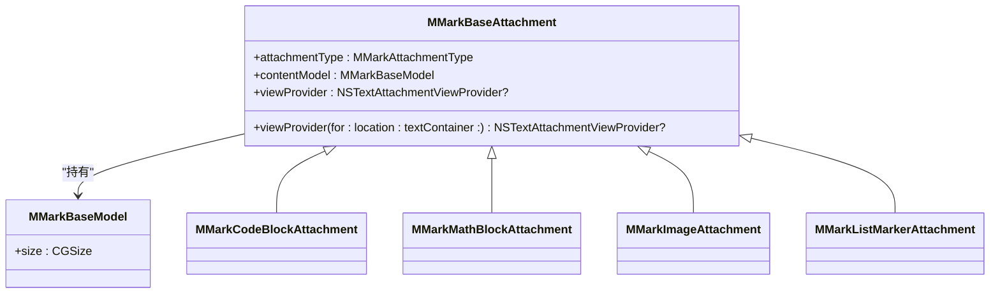
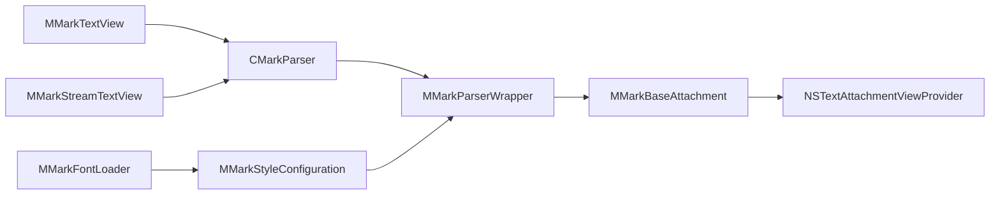

# 渲染器系统

<cite>
**本文引用的文件**
- [MMarkTextView.swift](file://MMarkParser/Sources/Renderer/MMarkTextView.swift)
- [MMarkStreamTextView.swift](file://MMarkParser/Sources/Renderer/MMarkStreamTextView.swift)
- [MMarkStyleConfiguration.swift](file://MMarkParser/Sources/Renderer/MMarkStyleConfiguration.swift)
- [MMarkTextCommon.swift](file://MMarkParser/Sources/Renderer/MMarkTextCommon.swift)
- [MMarkFontLoader.swift](file://MMarkParser/Sources/Renderer/MMarkFontLoader.swift)
- [MMarkBaseAttachment.swift](file://MMarkParser/Sources/Renderer/Attachments/MMarkBaseAttachment/MMarkBaseAttachment.swift)
- [MMarkBaseModel.swift](file://MMarkParser/Sources/Renderer/Attachments/MMarkBaseAttachment/MMarkBaseModel.swift)
- [MMarkCodeBlockAttachment.swift](file://MMarkParser/Sources/Renderer/Attachments/MMarkCodeBlockAttachment/MMarkCodeBlockAttachment.swift)
- [MMarkImageAttachment.swift](file://MMarkParser/Sources/Renderer/Attachments/MMarkImageAttachment/MMarkImageAttachment.swift)
- [MMarkListMarkerAttachment.swift](file://MMarkParser/Sources/Renderer/Attachments/MMarkListMarkerAttachment/MMarkListMarkerAttachment.swift)
- [MMarkMathBlockAttachment.swift](file://MMarkParser/Sources/Renderer/Attachments/MMarkMathBlockAttachment/MMarkMathBlockAttachment.swift)
- [CMarkParser.swift](file://MMarkParser/Sources/Parser/CMarkParser.swift)
- [MMarkParserWrapper.swift](file://MMarkParser/Sources/Parser/MMarkParserWrapper.swift)
- [ViewController.swift](file://cocoapod_demo/cocoapod_demo/ViewController.swift)
- [StreamViewController.swift](file://cocoapod_demo/cocoapod_demo/StreamViewController.swift)
- [SampleMarkdown.swift](file://cocoapod_demo/cocoapod_demo/SampleMarkdown.swift)
</cite>

## 目录
1. [简介](#简介)
2. [项目结构](#项目结构)
3. [核心组件](#核心组件)
4. [架构总览](#架构总览)
5. [详细组件分析](#详细组件分析)
6. [依赖关系分析](#依赖关系分析)
7. [性能考量](#性能考量)
8. [故障排查指南](#故障排查指南)
9. [结论](#结论)
10. [附录](#附录)

## 简介
本文件面向MMarkParser的渲染器系统，聚焦两类文本视图：基于TextKit 2的静态渲染视图MMarkTextView与支持实时增量渲染的流式视图MMarkStreamTextView。文档涵盖以下主题：
- MMarkTextView：blockquote边框绘制、链接点击处理、手势识别、TextKit 2布局引擎集成。
- MMarkStreamTextView：流式渲染管线、增量更新策略、自动滚动、尺寸通知。
- 富文本渲染原理：NSAttributedString构建、属性管理、NSTextAttachment使用。
- MMarkStyleConfiguration：标题、段落、列表、链接、代码、表格、数学公式、脚注等样式定制。
- 性能优化与最佳实践：解析与渲染分离、增量插入、TextKit 2路径优先、动态chunk大小、自动滚动阈值。
- API参考与使用示例：初始化、设置Markdown、配置样式、处理链接、监听尺寸变化。

## 项目结构
渲染器系统位于MMarkParser/Sources/Renderer目录，核心文件包括：
- 视图层：MMarkTextView、MMarkStreamTextView
- 样式配置：MMarkStyleConfiguration
- 通用逻辑：MMarkTextCommon（链接处理、blockquote边框、TextKit 2集成）
- 字体加载：MMarkFontLoader（KaTeX字体）
- 附件基类与模型：MMarkBaseAttachment、MMarkBaseModel
- 附件类型：代码块、水平分割线、图片、列表标记、数学公式、表格
- 解析器：CMarkParser、MMarkParserWrapper（md4c驱动）

图表来源
- [MMarkTextView.swift:1-81](file://MMarkParser/Sources/Renderer/MMarkTextView.swift#L1-L81)
- [MMarkStreamTextView.swift:1-398](file://MMarkParser/Sources/Renderer/MMarkStreamTextView.swift#L1-L398)
- [MMarkStyleConfiguration.swift:1-339](file://MMarkParser/Sources/Renderer/MMarkStyleConfiguration.swift#L1-L339)
- [MMarkTextCommon.swift:1-290](file://MMarkParser/Sources/Renderer/MMarkTextCommon.swift#L1-L290)
- [MMarkFontLoader.swift:1-113](file://MMarkParser/Sources/Renderer/MMarkFontLoader.swift#L1-L113)
- [MMarkBaseAttachment.swift:1-60](file://MMarkParser/Sources/Renderer/Attachments/MMarkBaseAttachment/MMarkBaseAttachment.swift#L1-L60)
- [MMarkBaseModel.swift:1-10](file://MMarkParser/Sources/Renderer/Attachments/MMarkBaseAttachment/MMarkBaseModel.swift#L1-L10)
- [CMarkParser.swift:1-81](file://MMarkParser/Sources/Parser/CMarkParser.swift#L1-L81)
- [MMarkParserWrapper.swift:1-800](file://MMarkParser/Sources/Parser/MMarkParserWrapper.swift#L1-L800)

章节来源
- [MMarkTextView.swift:1-81](file://MMarkParser/Sources/Renderer/MMarkTextView.swift#L1-L81)
- [MMarkStreamTextView.swift:1-398](file://MMarkParser/Sources/Renderer/MMarkStreamTextView.swift#L1-L398)
- [MMarkStyleConfiguration.swift:1-339](file://MMarkParser/Sources/Renderer/MMarkStyleConfiguration.swift#L1-L339)
- [MMarkTextCommon.swift:1-290](file://MMarkParser/Sources/Renderer/MMarkTextCommon.swift#L1-L290)
- [MMarkFontLoader.swift:1-113](file://MMarkParser/Sources/Renderer/MMarkFontLoader.swift#L1-L113)
- [MMarkBaseAttachment.swift:1-60](file://MMarkParser/Sources/Renderer/Attachments/MMarkBaseAttachment/MMarkBaseAttachment.swift#L1-L60)
- [MMarkBaseModel.swift:1-10](file://MMarkParser/Sources/Renderer/Attachments/MMarkBaseAttachment/MMarkBaseModel.swift#L1-L10)
- [CMarkParser.swift:1-81](file://MMarkParser/Sources/Parser/CMarkParser.swift#L1-L81)
- [MMarkParserWrapper.swift:1-800](file://MMarkParser/Sources/Parser/MMarkParserWrapper.swift#L1-L800)

## 核心组件
- MMarkTextView：静态Markdown渲染视图，负责blockquote边框绘制、链接点击处理、TextKit 2布局完成后的边框刷新。
- MMarkStreamTextView：流式渲染视图，支持增量插入、定时器驱动、自动滚动、尺寸变更通知。
- MMarkStyleConfiguration：统一的样式配置中心，覆盖标题、段落、列表、链接、代码、表格、数学公式、脚注等。
- MMarkTextCommon：共享逻辑，包括链接处理（脚注、锚点）、blockquote边框绘制、TextKit 2集成辅助方法。
- 附件体系：通过MMarkBaseAttachment与具体附件类型（代码块、图片、列表标记、数学公式、表格）配合NSTextAttachmentViewProvider实现复杂内容渲染。
- CMarkParser与MMarkParserWrapper：基于md4c的SAX回调构建NSAttributedString，输出富文本与附件。

章节来源
- [MMarkTextView.swift:1-81](file://MMarkParser/Sources/Renderer/MMarkTextView.swift#L1-L81)
- [MMarkStreamTextView.swift:1-398](file://MMarkParser/Sources/Renderer/MMarkStreamTextView.swift#L1-L398)
- [MMarkStyleConfiguration.swift:1-339](file://MMarkParser/Sources/Renderer/MMarkStyleConfiguration.swift#L1-L339)
- [MMarkTextCommon.swift:1-290](file://MMarkParser/Sources/Renderer/MMarkTextCommon.swift#L1-L290)
- [MMarkBaseAttachment.swift:1-60](file://MMarkParser/Sources/Renderer/Attachments/MMarkBaseAttachment/MMarkBaseAttachment.swift#L1-L60)
- [CMarkParser.swift:1-81](file://MMarkParser/Sources/Parser/CMarkParser.swift#L1-L81)
- [MMarkParserWrapper.swift:1-800](file://MMarkParser/Sources/Parser/MMarkParserWrapper.swift#L1-L800)

## 架构总览
渲染流程分为“解析”和“渲染”两个阶段：
- 解析阶段：CMarkParser调用MMarkParserWrapper，基于md4c回调生成NSAttributedString，期间根据配置注入段落样式、字体、颜色、链接、脚注、列表标记、代码块、表格、数学公式等属性与附件。
- 渲染阶段：MMarkTextView/ MMarkStreamTextView接收NSAttributedString，注册附件视图提供者，启用TextKit 2布局引擎，完成富文本显示；MMarkStreamTextView通过定时器驱动增量插入，实现“打字机”式流式渲染。

图表来源
- [MMarkStreamTextView.swift:174-201](file://MMarkParser/Sources/Renderer/MMarkStreamTextView.swift#L174-L201)
- [MMarkStreamTextView.swift:304-351](file://MMarkParser/Sources/Renderer/MMarkStreamTextView.swift#L304-L351)
- [MMarkTextView.swift:40-49](file://MMarkParser/Sources/Renderer/MMarkTextView.swift#L40-L49)
- [CMarkParser.swift:55-66](file://MMarkParser/Sources/Parser/CMarkParser.swift#L55-L66)
- [MMarkParserWrapper.swift:1-800](file://MMarkParser/Sources/Parser/MMarkParserWrapper.swift#L1-L800)

## 详细组件分析

### MMarkTextView：静态渲染与blockquote边框
- 初始化与委托：禁用编辑、启用滚动、设置背景、注册链接委托与附件视图提供者。
- Markdown设置：解析Markdown为NSAttributedString并赋值给attributedText；解析失败回退为原始字符串。
- 布局后边框刷新：监听contentSize变化，异步触发blockquote边框绘制，避免布局未完成导致的坐标错误。
- 链接处理：实现UITextViewDelegate，优先回调外部mmarkLinkDelegate，内部处理脚注与锚点跳转，非Web链接交由系统处理。

图表来源
- [MMarkTextView.swift:6-81](file://MMarkParser/Sources/Renderer/MMarkTextView.swift#L6-L81)
- [MMarkTextCommon.swift:39-290](file://MMarkParser/Sources/Renderer/MMarkTextCommon.swift#L39-L290)
- [CMarkParser.swift:55-66](file://MMarkParser/Sources/Parser/CMarkParser.swift#L55-L66)

章节来源
- [MMarkTextView.swift:16-81](file://MMarkParser/Sources/Renderer/MMarkTextView.swift#L16-L81)
- [MMarkTextCommon.swift:48-130](file://MMarkParser/Sources/Renderer/MMarkTextCommon.swift#L48-L130)
- [MMarkTextCommon.swift:131-249](file://MMarkParser/Sources/Renderer/MMarkTextCommon.swift#L131-L249)

### MMarkStreamTextView：流式渲染与增量插入
- 状态机：idle/streaming/paused/stopped，支持开始、暂停、恢复、停止、一次性渲染。
- 增量插入：解析完成后缓存完整NSAttributedString，定时器以chunkSize推进displayIndex，增量追加至TextKit 2的NSTextContentStorage或TextKit 1的textStorage。
- 自动滚动：检测用户是否处于底部，自动滚动至最新内容；支持scrollToBottom动画控制。
- 尺寸通知：通过sizeThatFits估算高度，避免强制激活TextKit 1桥接，减少主线程阻塞。
- 链接处理：与MMarkTextView一致，优先外部委托，内部处理脚注与锚点。

图表来源
- [MMarkStreamTextView.swift:174-201](file://MMarkParser/Sources/Renderer/MMarkStreamTextView.swift#L174-L201)
- [MMarkStreamTextView.swift:203-243](file://MMarkParser/Sources/Renderer/MMarkStreamTextView.swift#L203-L243)
- [MMarkStreamTextView.swift:304-351](file://MMarkParser/Sources/Renderer/MMarkStreamTextView.swift#L304-L351)
- [MMarkStreamTextView.swift:365-379](file://MMarkParser/Sources/Renderer/MMarkStreamTextView.swift#L365-L379)

章节来源
- [MMarkStreamTextView.swift:25-30](file://MMarkParser/Sources/Renderer/MMarkStreamTextView.swift#L25-L30)
- [MMarkStreamTextView.swift:72-84](file://MMarkParser/Sources/Renderer/MMarkStreamTextView.swift#L72-L84)
- [MMarkStreamTextView.swift:113-156](file://MMarkParser/Sources/Renderer/MMarkStreamTextView.swift#L113-L156)
- [MMarkStreamTextView.swift:174-287](file://MMarkParser/Sources/Renderer/MMarkStreamTextView.swift#L174-L287)
- [MMarkStreamTextView.swift:304-379](file://MMarkParser/Sources/Renderer/MMarkStreamTextView.swift#L304-L379)

### 富文本渲染原理：NSAttributedString与NSTextAttachment
- 属性管理：段落样式（缩进、行距）、字体、颜色、链接、删除线、脚注引用/定义、blockquote深度与背景色等。
- 附件渲染：MMarkBaseAttachment作为NSTextAttachment子类，按类型选择对应ViewProvider（代码块、图片、列表标记、数学公式、表格），在TextKit 2中通过NSTextAttachmentViewProvider机制渲染。
- 代码块与数学公式：通过MMarkCodeBlockAttachment与MMarkMathBlockAttachment约束附件尺寸，避免被lineFragmentPadding裁剪。
- 图片渲染：MMarkImageAttachment根据容器宽度等比缩放，必要时换行避免inline附件定位问题。

图表来源
- [MMarkBaseAttachment.swift:12-60](file://MMarkParser/Sources/Renderer/Attachments/MMarkBaseAttachment/MMarkBaseAttachment.swift#L12-L60)
- [MMarkBaseModel.swift:3-10](file://MMarkParser/Sources/Renderer/Attachments/MMarkBaseAttachment/MMarkBaseModel.swift#L3-L10)
- [MMarkCodeBlockAttachment.swift:5-22](file://MMarkParser/Sources/Renderer/Attachments/MMarkCodeBlockAttachment/MMarkCodeBlockAttachment.swift#L5-L22)
- [MMarkMathBlockAttachment.swift:4-23](file://MMarkParser/Sources/Renderer/Attachments/MMarkMathBlockAttachment/MMarkMathBlockAttachment.swift#L4-L23)
- [MMarkImageAttachment.swift:4-23](file://MMarkParser/Sources/Renderer/Attachments/MMarkImageAttachment/MMarkImageAttachment.swift#L4-L23)
- [MMarkListMarkerAttachment.swift:4-18](file://MMarkParser/Sources/Renderer/Attachments/MMarkListMarkerAttachment/MMarkListMarkerAttachment.swift#L4-L18)

章节来源
- [MMarkBaseAttachment.swift:32-58](file://MMarkParser/Sources/Renderer/Attachments/MMarkBaseAttachment/MMarkBaseAttachment.swift#L32-L58)
- [MMarkCodeBlockAttachment.swift:15-21](file://MMarkParser/Sources/Renderer/Attachments/MMarkCodeBlockAttachment/MMarkCodeBlockAttachment.swift#L15-L21)
- [MMarkMathBlockAttachment.swift:16-22](file://MMarkParser/Sources/Renderer/Attachments/MMarkMathBlockAttachment/MMarkMathBlockAttachment.swift#L16-L22)
- [MMarkImageAttachment.swift:17-22](file://MMarkParser/Sources/Renderer/Attachments/MMarkImageAttachment/MMarkImageAttachment.swift#L17-L22)

### MMarkStyleConfiguration：样式配置系统
- 标题：H1-H6字体与颜色、段前/段后间距按级别配置。
- 段落：默认字体与颜色。
- 代码：行内代码与代码块字体、前景/背景色。
- 链接：颜色与下划线样式。
- 引用块：颜色、背景、边框宽度与颜色。
- 图片：占位符颜色。
- 表格：表头背景、边框颜色/宽度、圆角。
- 列表：有序/无序/任务列表的字体、颜色、marker模式（字符/图片）、图标尺寸。
- 数学公式：行内/块级字体、前景/背景色、块级背景与圆角、iosMath字体。
- 脚注：引用样式、脚注正文样式、回链颜色。
- 默认样式：提供GFM风格默认值，包含KaTeX字体回退逻辑。

章节来源
- [MMarkStyleConfiguration.swift:10-148](file://MMarkParser/Sources/Renderer/MMarkStyleConfiguration.swift#L10-L148)
- [MMarkStyleConfiguration.swift:188-267](file://MMarkParser/Sources/Renderer/MMarkStyleConfiguration.swift#L188-L267)
- [MMarkFontLoader.swift:24-51](file://MMarkParser/Sources/Renderer/MMarkFontLoader.swift#L24-L51)

### TextKit 2集成与优化策略
- TextKit 2路径优先：在iOS 16+优先使用NSTextLayoutManager与NSTextContentStorage进行增量插入与布局；在iOS 15回退至TextKit 1。
- 尺寸计算：通过sizeThatFits估算高度，避免强制激活TextKit 1桥接，降低主线程压力。
- 增量插入：仅对新增部分执行performEditingTransaction或begin/endEditing，避免全量重排。
- 布局完成回调：MMarkTextView监听contentSize变化，确保blockquote边框在布局完成后绘制。
- 自动滚动：基于阈值判断用户是否处于底部，避免频繁滚动抖动。

章节来源
- [MMarkStreamTextView.swift:126-156](file://MMarkParser/Sources/Renderer/MMarkStreamTextView.swift#L126-L156)
- [MMarkStreamTextView.swift:365-379](file://MMarkParser/Sources/Renderer/MMarkStreamTextView.swift#L365-L379)
- [MMarkTextView.swift:52-61](file://MMarkParser/Sources/Renderer/MMarkTextView.swift#L52-L61)
- [MMarkTextCommon.swift:171-249](file://MMarkParser/Sources/Renderer/MMarkTextCommon.swift#L171-L249)

### 链接点击与锚点跳转
- 优先回调外部mmarkLinkDelegate决定是否继续内部处理。
- 脚注：识别footnote://协议，查找footnoteRef/footnoteDef属性并滚动到目标范围。
- 锚点：识别fragment或无scheme但有fragment的链接，模糊匹配标题行或精确搜索文本，滚动可见。
- 非Web链接：交由系统处理（如mailto/tel）。

章节来源
- [MMarkTextCommon.swift:48-129](file://MMarkParser/Sources/Renderer/MMarkTextCommon.swift#L48-L129)

## 依赖关系分析
- 视图依赖解析器：MMarkTextView与MMarkStreamTextView均依赖CMarkParser进行Markdown到NSAttributedString的转换。
- 解析器依赖包装器：CMarkParser调用MMarkParserWrapper，后者基于md4c回调构建富文本与附件。
- 附件依赖视图提供者：MMarkBaseAttachment根据类型返回对应ViewProvider，驱动NSTextAttachmentViewProvider渲染。
- 样式依赖字体加载：MMarkFontLoader确保KaTeX字体可用，MMarkStyleConfiguration提供默认样式。

图表来源
- [MMarkTextView.swift:40-49](file://MMarkParser/Sources/Renderer/MMarkTextView.swift#L40-L49)
- [MMarkStreamTextView.swift:183-200](file://MMarkParser/Sources/Renderer/MMarkStreamTextView.swift#L183-L200)
- [CMarkParser.swift:55-66](file://MMarkParser/Sources/Parser/CMarkParser.swift#L55-L66)
- [MMarkParserWrapper.swift:1-800](file://MMarkParser/Sources/Parser/MMarkParserWrapper.swift#L1-L800)
- [MMarkBaseAttachment.swift:32-58](file://MMarkParser/Sources/Renderer/Attachments/MMarkBaseAttachment/MMarkBaseAttachment.swift#L32-L58)
- [MMarkStyleConfiguration.swift:188-267](file://MMarkParser/Sources/Renderer/MMarkStyleConfiguration.swift#L188-L267)
- [MMarkFontLoader.swift:24-51](file://MMarkParser/Sources/Renderer/MMarkFontLoader.swift#L24-L51)

章节来源
- [CMarkParser.swift:55-66](file://MMarkParser/Sources/Parser/CMarkParser.swift#L55-L66)
- [MMarkParserWrapper.swift:1-800](file://MMarkParser/Sources/Parser/MMarkParserWrapper.swift#L1-L800)
- [MMarkBaseAttachment.swift:32-58](file://MMarkParser/Sources/Renderer/Attachments/MMarkBaseAttachment/MMarkBaseAttachment.swift#L32-L58)

## 性能考量
- 解析与渲染分离：解析在后台队列执行，主线程仅做UI更新，避免卡顿。
- TextKit 2优先：在iOS 16+使用NSTextContentStorage.performEditingTransaction进行增量插入，显著降低布局成本。
- 动态chunk策略：长文档自动增大chunk大小，保持视觉流畅性。
- 尺寸估算：使用sizeThatFits避免强制激活TextKit 1桥接，减少主线程阻塞。
- 自动滚动阈值：40pt容差，避免用户手动滚动时频繁跟随。
- 字体预加载：MMarkFontLoader确保KaTeX字体可用，避免首帧闪烁。

章节来源
- [MMarkStreamTextView.swift:183-200](file://MMarkParser/Sources/Renderer/MMarkStreamTextView.swift#L183-L200)
- [MMarkStreamTextView.swift:340-342](file://MMarkParser/Sources/Renderer/MMarkStreamTextView.swift#L340-L342)
- [MMarkStreamTextView.swift:365-379](file://MMarkParser/Sources/Renderer/MMarkStreamTextView.swift#L365-L379)
- [MMarkStreamTextView.swift:61-70](file://MMarkParser/Sources/Renderer/MMarkStreamTextView.swift#L61-L70)
- [MMarkFontLoader.swift:24-51](file://MMarkParser/Sources/Renderer/MMarkFontLoader.swift#L24-L51)

## 故障排查指南
- 链接无法点击或崩溃
  - 确认已设置mmarkLinkDelegate并正确处理非Web链接。
  - 检查链接URL编码，内部锚点仅对#后部分编码。
- 引用块边框不显示
  - 确保在布局完成后调用更新边框（MMarkTextView在contentSize变化后异步更新；MMarkStreamTextView在增量插入后更新）。
  - 检查blockquote相关样式配置（颜色、背景、边框宽度）。
- 图片显示异常或缩放错误
  - 确保图片URL有效，无效URL使用占位符颜色。
  - 注意图片换行以避免inline附件定位问题。
- 流式渲染卡顿
  - 调整typingSpeed与chunkSize，长文档可适当增大chunk。
  - 避免在主线程执行耗时操作，解析与UI更新分离。
- 尺寸通知不准确
  - 使用sizeThatFits估算高度，避免强制激活TextKit 1桥接。

章节来源
- [MMarkTextCommon.swift:48-129](file://MMarkParser/Sources/Renderer/MMarkTextCommon.swift#L48-L129)
- [MMarkTextCommon.swift:131-249](file://MMarkParser/Sources/Renderer/MMarkTextCommon.swift#L131-L249)
- [MMarkStreamTextView.swift:365-379](file://MMarkParser/Sources/Renderer/MMarkStreamTextView.swift#L365-L379)
- [MMarkImageAttachment.swift:17-22](file://MMarkParser/Sources/Renderer/Attachments/MMarkImageAttachment/MMarkImageAttachment.swift#L17-L22)

## 结论
MMarkParser的渲染器系统通过清晰的职责划分与TextKit 2优先策略，实现了高性能、可扩展的Markdown富文本渲染。MMarkTextView适合静态内容展示，MMarkStreamTextView则满足实时流式渲染需求。统一的样式配置与附件体系使得复杂内容（代码块、图片、表格、数学公式、脚注）得以一致地渲染与交互。遵循本文提供的性能优化与最佳实践，可在真实应用中获得稳定流畅的用户体验。

## 附录

### API参考与使用示例

- 初始化与基础使用
  - 静态视图：创建MMarkTextView，设置约束，调用setMarkdown加载Markdown。
  - 流式视图：创建MMarkStreamTextView，配置styleConfiguration与streamDelegate，调用startStreaming/renderComplete等接口。

- 样式定制
  - 修改标题、段落、列表、链接、代码、表格、数学公式、脚注等样式，通过MMarkStyleConfiguration进行全局配置。

- 链接处理
  - 实现mmarkLinkDelegate，拦截脚注与锚点跳转，非Web链接交由系统处理。

- 流式控制
  - startStreaming：开始流式渲染。
  - appendStreamContent：追加内容并重新解析。
  - pause/resume：暂停/恢复。
  - stop：停止并立即渲染完整内容。
  - renderComplete：一次性渲染完整Markdown。

- 示例入口
  - 静态渲染示例：ViewController中加载sampleMarkdown并设置到MMarkTextView。
  - 流式渲染示例：StreamViewController中演示速度与chunk控制、状态与尺寸回调。

章节来源
- [ViewController.swift:11-43](file://cocoapod_demo/cocoapod_demo/ViewController.swift#L11-L43)
- [StreamViewController.swift:167-199](file://cocoapod_demo/cocoapod_demo/StreamViewController.swift#L167-L199)
- [StreamViewController.swift:208-232](file://cocoapod_demo/cocoapod_demo/StreamViewController.swift#L208-L232)
- [SampleMarkdown.swift:3-760](file://cocoapod_demo/cocoapod_demo/SampleMarkdown.swift#L3-L760)