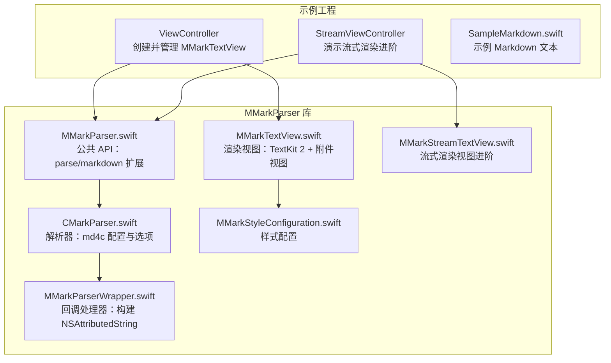
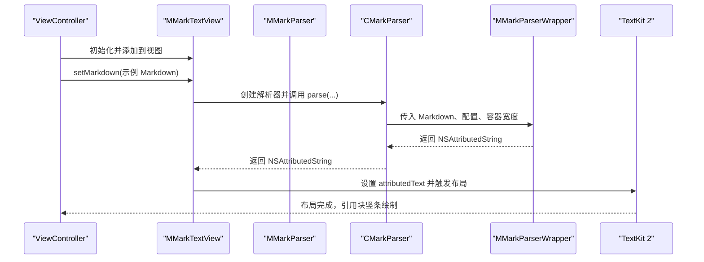
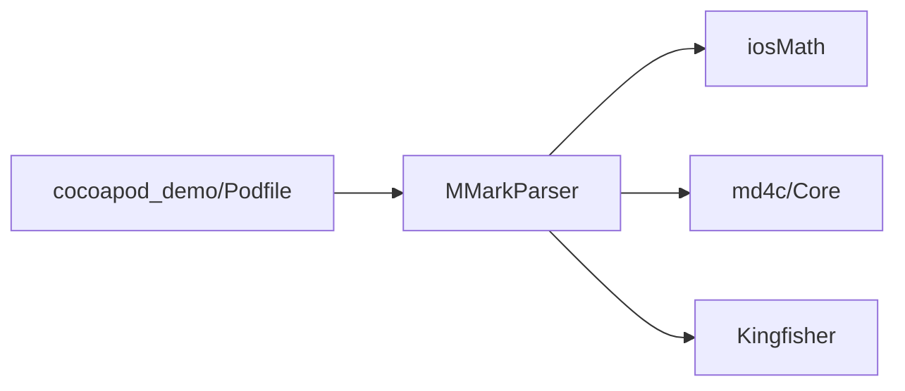

# 基础使用示例

<cite>
**本文引用的文件**
- [README.md](file://README.md)
- [MMarkParser.swift](file://MMarkParser/Sources/MMarkParser.swift)
- [CMarkParser.swift](file://MMarkParser/Sources/Parser/CMarkParser.swift)
- [MMarkParserWrapper.swift](file://MMarkParser/Sources/Parser/MMarkParserWrapper.swift)
- [MMarkTextView.swift](file://MMarkParser/Sources/Renderer/MMarkTextView.swift)
- [MMarkStreamTextView.swift](file://MMarkParser/Sources/Renderer/MMarkStreamTextView.swift)
- [MMarkStyleConfiguration.swift](file://MMarkParser/Sources/Renderer/MMarkStyleConfiguration.swift)
- [ViewController.swift](file://cocoapod_demo/cocoapod_demo/ViewController.swift)
- [StreamViewController.swift](file://cocoapod_demo/cocoapod_demo/StreamViewController.swift)
- [SampleMarkdown.swift](file://cocoapod_demo/cocoapod_demo/SampleMarkdown.swift)
- [Podfile](file://cocoapod_demo/Podfile)
</cite>

## 目录
1. [简介](#简介)
2. [项目结构](#项目结构)
3. [核心组件](#核心组件)
4. [架构总览](#架构总览)
5. [详细组件分析](#详细组件分析)
6. [依赖关系分析](#依赖关系分析)
7. [性能注意事项](#性能注意事项)
8. [故障排查指南](#故障排查指南)
9. [结论](#结论)
10. [附录](#附录)

## 简介
本指南面向初学者，帮助你在 iOS 项目中快速集成并使用 MMarkParser 的基础 Markdown 渲染能力。你将学会：
- 在 iOS 15+ 项目中引入 MMarkParser
- 创建并配置 MMarkTextView
- 使用自动布局约束设置视图位置与尺寸
- 加载 Markdown 文本并渲染为富文本
- 处理 iOS 版本兼容性与常见问题

本指南所有示例均基于仓库中的实际代码与示例工程，确保可直接复用到你的项目中。

## 项目结构
MMarkParser 采用“公共 API + 解析器 + 渲染器 + 附件视图”的分层设计。示例工程演示了最基础的渲染流程：从 Markdown 文本到富文本显示。

图表来源
- [ViewController.swift:1-46](file://cocoapod_demo/cocoapod_demo/ViewController.swift#L1-L46)
- [StreamViewController.swift:1-279](file://cocoapod_demo/cocoapod_demo/StreamViewController.swift#L1-L279)
- [MMarkParser.swift:1-42](file://MMarkParser/Sources/MMarkParser.swift#L1-L42)
- [CMarkParser.swift:1-81](file://MMarkParser/Sources/Parser/CMarkParser.swift#L1-L81)
- [MMarkParserWrapper.swift:1-200](file://MMarkParser/Sources/Parser/MMarkParserWrapper.swift#L1-L200)
- [MMarkTextView.swift:1-81](file://MMarkParser/Sources/Renderer/MMarkTextView.swift#L1-L81)
- [MMarkStreamTextView.swift:1-398](file://MMarkParser/Sources/Renderer/MMarkStreamTextView.swift#L1-L398)
- [MMarkStyleConfiguration.swift:1-339](file://MMarkParser/Sources/Renderer/MMarkStyleConfiguration.swift#L1-L339)

章节来源
- [README.md:1-237](file://README.md#L1-L237)
- [ViewController.swift:1-46](file://cocoapod_demo/cocoapod_demo/ViewController.swift#L1-L46)
- [MMarkParser.swift:1-42](file://MMarkParser/Sources/MMarkParser.swift#L1-L42)

## 核心组件
- 公共 API：提供静态方法与字符串扩展，将 Markdown 转换为富文本。
- 解析器：封装 md4c 的 SAX 回调，生成 NSAttributedString。
- 渲染视图：MMarkTextView 基于 UITextView，支持链接点击、引用块竖条绘制、附件视图等。
- 样式配置：MMarkStyleConfiguration 提供标题、代码、链接、列表、表格、数学公式、脚注等的样式定制。

章节来源
- [MMarkParser.swift:1-42](file://MMarkParser/Sources/MMarkParser.swift#L1-L42)
- [CMarkParser.swift:1-81](file://MMarkParser/Sources/Parser/CMarkParser.swift#L1-L81)
- [MMarkTextView.swift:1-81](file://MMarkParser/Sources/Renderer/MMarkTextView.swift#L1-L81)
- [MMarkStyleConfiguration.swift:1-339](file://MMarkParser/Sources/Renderer/MMarkStyleConfiguration.swift#L1-L339)

## 架构总览
下面的序列图展示了从 Markdown 文本到最终渲染的完整流程，以及 ViewController 中的关键步骤。

图表来源
- [ViewController.swift:38-43](file://cocoapod_demo/cocoapod_demo/ViewController.swift#L38-L43)
- [MMarkTextView.swift:39-49](file://MMarkParser/Sources/Renderer/MMarkTextView.swift#L39-L49)
- [MMarkParser.swift:18-26](file://MMarkParser/Sources/MMarkParser.swift#L18-L26)
- [CMarkParser.swift:55-66](file://MMarkParser/Sources/Parser/CMarkParser.swift#L55-L66)
- [MMarkParserWrapper.swift:1-200](file://MMarkParser/Sources/Parser/MMarkParserWrapper.swift#L1-L200)

## 详细组件分析

### MMarkParser：公共 API
- 提供静态方法与字符串扩展，将 Markdown 转换为富文本。
- iOS 15+ 可用；解析过程内部委托给 CMarkParser。
- 支持传入样式配置与容器宽度，用于 TextKit 2 的布局计算。

章节来源
- [MMarkParser.swift:11-41](file://MMarkParser/Sources/MMarkParser.swift#L11-L41)

### CMarkParser：解析器
- 封装 md4c 的 SAX 回调，支持 GFM 扩展（表格、删除线、任务列表、自动链接、数学公式、脚注、硬换行）。
- 接受 Markdown、样式配置与容器宽度，返回 NSAttributedString。
- 错误类型包含输入无效、解析失败、样式转换失败。

章节来源
- [CMarkParser.swift:14-66](file://MMarkParser/Sources/Parser/CMarkParser.swift#L14-L66)

### MMarkParserWrapper：回调处理器
- 基于 md4c 的 SAX 回调（enter_block/leave_block/enter_span/leave_span/text）增量构建 NSAttributedString。
- 维护属性栈、列表计数器、表格缓冲区、脚注缓冲区等上下文状态。
- 支持代码块语法高亮、表格、图片、数学公式、脚注等复杂元素的附件视图集成。

章节来源
- [MMarkParserWrapper.swift:16-200](file://MMarkParser/Sources/Parser/MMarkParserWrapper.swift#L16-L200)

### MMarkTextView：渲染视图（基础）
- UITextView 子类，禁用编辑、启用滚动、注册通用附件视图提供者。
- 提供 setMarkdown 方法：内部创建解析器，解析 Markdown，设置 attributedText。
- 监听 contentSize 变化，异步更新引用块竖条。
- 支持链接点击回调（委托）。

章节来源
- [MMarkTextView.swift:1-81](file://MMarkParser/Sources/Renderer/MMarkTextView.swift#L1-L81)

### ViewController：基础使用示例
- iOS 15+ 兼容性检查：仅在满足系统版本时初始化并使用 MMarkTextView。
- 自动布局：关闭 translatesAutoresizingMaskIntoConstraints，添加约束至安全区域，设置上、左、右、下约束。
- Markdown 加载：在 viewDidAppear 后调用 setMarkdown，传入示例 Markdown 文本。

章节来源
- [ViewController.swift:11-27](file://cocoapod_demo/cocoapod_demo/ViewController.swift#L11-L27)
- [ViewController.swift:38-43](file://cocoapod_demo/cocoapod_demo/ViewController.swift#L38-L43)
- [SampleMarkdown.swift:1-760](file://cocoapod_demo/cocoapod_demo/SampleMarkdown.swift#L1-L760)

### MMarkStreamTextView：流式渲染（进阶）
- 支持定时增量渲染，适合长文档或实时追加场景。
- 提供 start/pause/resume/stop/renderComplete/reset 等控制接口。
- 支持自动滚动到底部、尺寸变化通知、引用块竖条更新。

章节来源
- [MMarkStreamTextView.swift:18-398](file://MMarkParser/Sources/Renderer/MMarkStreamTextView.swift#L18-L398)

### MMarkStyleConfiguration：样式配置
- 提供标题、段落、代码、链接、删除线、引用块、图片占位、表格、任务列表、有序/无序列表、数学公式、脚注等的样式定制。
- defaultStyle 提供 GFM 默认样式，可按需覆盖。

章节来源
- [MMarkStyleConfiguration.swift:10-339](file://MMarkParser/Sources/Renderer/MMarkStyleConfiguration.swift#L10-L339)

## 依赖关系分析
- 示例工程通过 CocoaPods 引入 MMarkParser，并依赖 iosMath、md4c、Kingfisher 等第三方库。
- MMarkParser 内部依赖 md4c（SAX 回调）、iosMath（LaTeX 数学渲染）、Kingfisher（远程图片加载）。

图表来源
- [Podfile:5-11](file://cocoapod_demo/Podfile#L5-L11)

章节来源
- [Podfile:1-20](file://cocoapod_demo/Podfile#L1-L20)

## 性能注意事项
- 容器宽度：解析时传入的容器宽度会影响 TextKit 2 的布局计算，建议使用视图有效宽度减去左右边距。
- 引用块竖条：在 contentSize 变化后异步更新，避免阻塞主线程。
- 流式渲染：对长文档建议使用 MMarkStreamTextView，通过定时器增量插入内容，减少一次性布局压力。
- 附件视图：复杂元素（代码块、表格、数学公式、图片）通过附件视图懒加载，降低初始渲染成本。

章节来源
- [MMarkTextView.swift:51-61](file://MMarkParser/Sources/Renderer/MMarkTextView.swift#L51-L61)
- [MMarkStreamTextView.swift:304-351](file://MMarkParser/Sources/Renderer/MMarkStreamTextView.swift#L304-L351)

## 故障排查指南
- iOS 版本不兼容
  - 现象：MMarkParser 与相关组件在 iOS 15+ 可用。
  - 处理：在使用前进行版本检查，仅在满足条件时初始化视图与解析。
- 解析失败
  - 现象：setMarkdown 抛出异常或返回原始文本。
  - 处理：捕获错误并降级显示原始 Markdown；检查 Markdown 语法与资源可用性。
- 图片无法加载
  - 现象：图片占位符显示或加载失败。
  - 处理：确认网络可达、图片 URL 正确；检查 Kingfisher 配置。
- 数学公式显示异常
  - 现象：数学公式未渲染或字体缺失。
  - 处理：确认 KaTeX 字体已注册；必要时提供自定义字体。

章节来源
- [MMarkParser.swift:18-26](file://MMarkParser/Sources/MMarkParser.swift#L18-L26)
- [MMarkTextView.swift:43-48](file://MMarkParser/Sources/Renderer/MMarkTextView.swift#L43-L48)
- [CMarkParser.swift:8-12](file://MMarkParser/Sources/Parser/CMarkParser.swift#L8-L12)

## 结论
通过本指南，你可以在 iOS 15+ 项目中快速集成 MMarkParser，使用 MMarkTextView 渲染 Markdown，并结合自动布局约束实现稳定的界面展示。对于长文档或需要实时追加的场景，可参考流式渲染视图的实现思路。建议在生产环境中结合样式配置与资源准备，确保渲染效果与性能达到预期。

## 附录

### 快速开始清单
- 在 Podfile 中添加 MMarkParser 依赖并安装。
- 在 ViewController 中进行 iOS 15+ 版本检查。
- 创建 MMarkTextView，关闭 translatesAutoresizingMaskIntoConstraints。
- 添加约束至安全区域，设置上、左、右、下边距。
- 在合适时机调用 setMarkdown 加载 Markdown 文本。
- 如需样式定制，修改 MMarkStyleConfiguration 并赋值给视图。

章节来源
- [Podfile:1-20](file://cocoapod_demo/Podfile#L1-L20)
- [ViewController.swift:11-27](file://cocoapod_demo/cocoapod_demo/ViewController.swift#L11-L27)
- [MMarkTextView.swift:16-37](file://MMarkParser/Sources/Renderer/MMarkTextView.swift#L16-L37)
- [MMarkStyleConfiguration.swift:189-267](file://MMarkParser/Sources/Renderer/MMarkStyleConfiguration.swift#L189-L267)