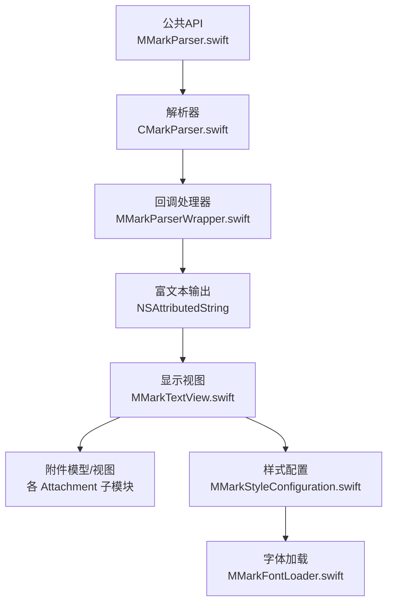
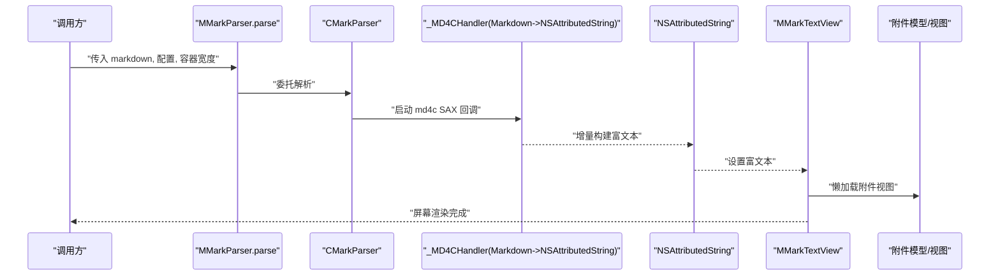
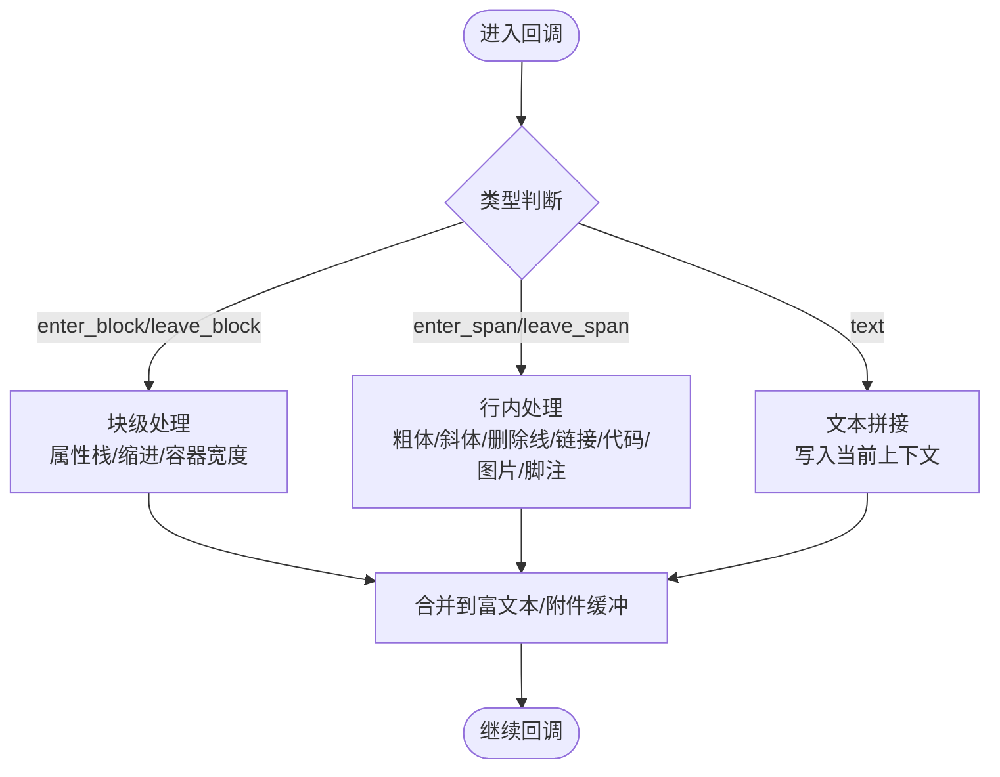
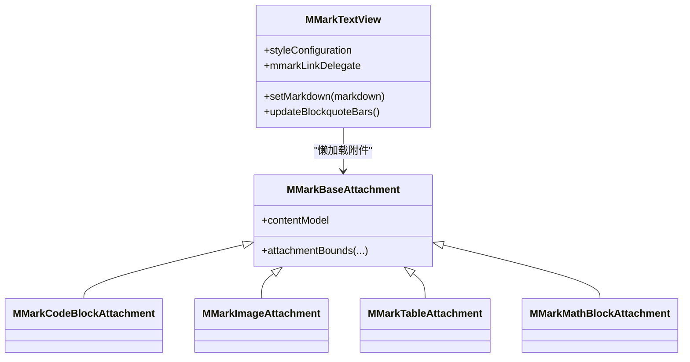
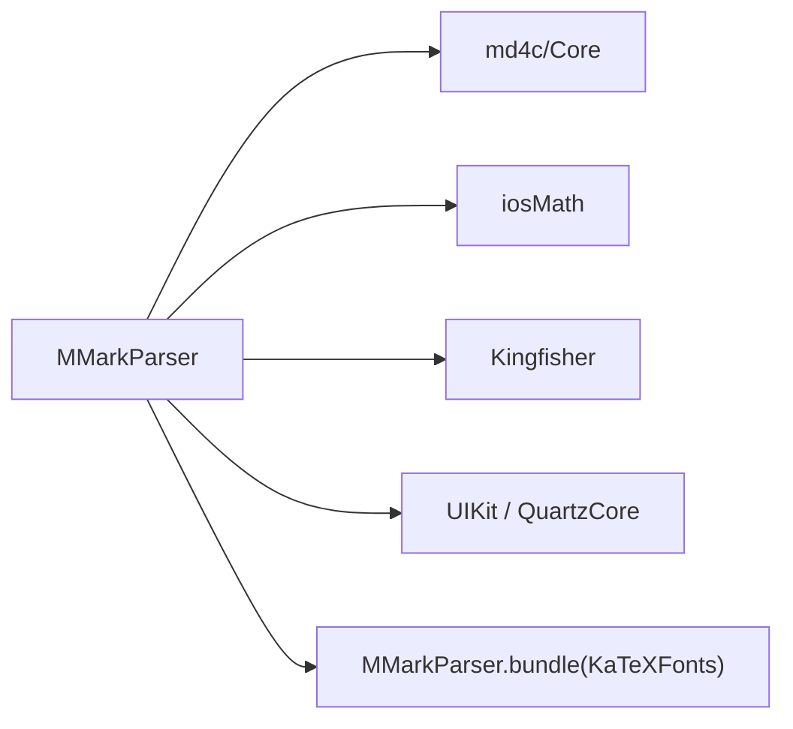

# 故障排除指南

<cite>
**本文引用的文件**
- [README.md](file://README.md)
- [MMarkParser.podspec](file://MMarkParser.podspec)
- [MMarkParser.swift](file://MMarkParser/Sources/MMarkParser.swift)
- [CMarkParser.swift](file://MMarkParser/Sources/Parser/CMarkParser.swift)
- [MMarkParserWrapper.swift](file://MMarkParser/Sources/Parser/MMarkParserWrapper.swift)
- [MMarkTextView.swift](file://MMarkParser/Sources/Renderer/MMarkTextView.swift)
- [MMarkStyleConfiguration.swift](file://MMarkParser/Sources/Renderer/MMarkStyleConfiguration.swift)
- [MMarkFontLoader.swift](file://MMarkParser/Sources/Renderer/MMarkFontLoader.swift)
- [MMarkCodeBlockAttachment.swift](file://MMarkParser/Sources/Renderer/Attachments/MMarkCodeBlockAttachment/MMarkCodeBlockAttachment.swift)
- [MMarkImageAttachment.swift](file://MMarkParser/Sources/Renderer/Attachments/MMarkImageAttachment/MMarkImageAttachment.swift)
- [MMarkTableAttachment.swift](file://MMarkParser/Sources/Renderer/Attachments/MMarkTableAttachment/MMarkTableAttachment.swift)
- [MMarkMathBlockAttachment.swift](file://MMarkParser/Sources/Renderer/Attachments/MMarkMathBlockAttachment/MMarkMathBlockAttachment.swift)
- [ViewController.swift](file://cocoapod_demo/cocoapod_demo/ViewController.swift)
- [Podfile](file://cocoapod_demo/Podfile)
</cite>

## 目录
1. [简介](#简介)
2. [项目结构](#项目结构)
3. [核心组件](#核心组件)
4. [架构总览](#架构总览)
5. [详细组件分析](#详细组件分析)
6. [依赖关系分析](#依赖关系分析)
7. [性能考虑](#性能考虑)
8. [故障排除指南](#故障排除指南)
9. [结论](#结论)
10. [附录](#附录)

## 简介
本指南面向使用 MMarkParser 的 iOS 开发者，聚焦于在集成、渲染、性能与内存等方面常见问题的诊断与解决。内容覆盖编译错误、运行时错误、渲染异常、环境兼容性（iOS 版本、设备适配）、以及性能优化建议（渲染卡顿、内存占用）等。

## 项目结构
- 公共 API：MMarkParser 提供静态入口，String 扩展便捷解析。
- 解析器：CMarkParser 负责配置 md4c 选项与调用底层包装器；MMarkParserWrapper 实现 md4c SAX 回调处理器，构建 NSAttributedString 并管理复杂元素（代码块、表格、图片、水平线、数学公式、列表标记等）。
- 渲染器：MMarkTextView 基于 TextKit 2 显示富文本，支持块引用竖条绘制、链接点击回调、附件视图懒加载。
- 样式系统：MMarkStyleConfiguration 定义所有元素的可定制样式；MMarkFontLoader 注册 KaTeX 数学字体资源。
- 附件：各类复杂元素以 NSTextAttachment 及其 ViewProvider 形式呈现，确保延迟创建与布局正确。

图表来源
- [MMarkParser.swift:1-42](file://MMarkParser/Sources/MMarkParser.swift#L1-L42)
- [CMarkParser.swift:1-81](file://MMarkParser/Sources/Parser/CMarkParser.swift#L1-L81)
- [MMarkParserWrapper.swift:1-800](file://MMarkParser/Sources/Parser/MMarkParserWrapper.swift#L1-L800)
- [MMarkTextView.swift:1-81](file://MMarkParser/Sources/Renderer/MMarkTextView.swift#L1-L81)
- [MMarkStyleConfiguration.swift:1-339](file://MMarkParser/Sources/Renderer/MMarkStyleConfiguration.swift#L1-L339)
- [MMarkFontLoader.swift:1-113](file://MMarkParser/Sources/Renderer/MMarkFontLoader.swift#L1-L113)

章节来源
- [README.md:108-212](file://README.md#L108-L212)

## 核心组件
- 公共 API：提供 parse/markdown 解析入口与 String 扩展，统一抛出解析错误。
- 解析器：封装 md4c 选项（GFM 表格、删除线、任务列表、自动链接、LaTeX 数学、脚注、硬换行等），执行 SAX 回调并生成富文本。
- 渲染器：TextKit 2 文本视图，负责块引用竖条绘制、链接交互、附件懒加载。
- 样式系统：集中配置标题、段落、代码、链接、引用、表格、任务列表、数学公式、脚注等样式。
- 附件：代码块、图片、表格、数学公式、水平线、列表标记等以附件形式渲染。

章节来源
- [MMarkParser.swift:11-26](file://MMarkParser/Sources/MMarkParser.swift#L11-L26)
- [CMarkParser.swift:55-66](file://MMarkParser/Sources/Parser/CMarkParser.swift#L55-L66)
- [MMarkTextView.swift:39-49](file://MMarkParser/Sources/Renderer/MMarkTextView.swift#L39-L49)
- [MMarkStyleConfiguration.swift:188-267](file://MMarkParser/Sources/Renderer/MMarkStyleConfiguration.swift#L188-L267)

## 架构总览
下图展示从 Markdown 输入到屏幕渲染的关键流程与组件交互。

图表来源
- [MMarkParser.swift:18-26](file://MMarkParser/Sources/MMarkParser.swift#L18-L26)
- [CMarkParser.swift:55-66](file://MMarkParser/Sources/Parser/CMarkParser.swift#L55-L66)
- [MMarkParserWrapper.swift:134-644](file://MMarkParser/Sources/Parser/MMarkParserWrapper.swift#L134-L644)
- [MMarkTextView.swift:39-49](file://MMarkParser/Sources/Renderer/MMarkTextView.swift#L39-L49)

## 详细组件分析

### 组件一：解析器与回调处理器
- 关键职责：配置 md4c 选项、接收 SAX 回调、维护属性栈、累积表格/代码块、处理脚注、构建富文本。
- 错误点：空输入直接返回空富文本；解析失败抛出解析错误；URL 百分号编码避免桥接层崩溃；图片 span 需等待 leaveSpan 后再渲染附件。
- 性能点：增量构建富文本，避免中间 AST；属性栈与容器宽度计算减少重排。

图表来源
- [MMarkParserWrapper.swift:134-644](file://MMarkParser/Sources/Parser/MMarkParserWrapper.swift#L134-L644)

章节来源
- [CMarkParser.swift:8-12](file://MMarkParser/Sources/Parser/CMarkParser.swift#L8-L12)
- [CMarkParser.swift:55-66](file://MMarkParser/Sources/Parser/CMarkParser.swift#L55-L66)
- [MMarkParserWrapper.swift:690-701](file://MMarkParser/Sources/Parser/MMarkParserWrapper.swift#L690-L701)
- [MMarkParserWrapper.swift:772-800](file://MMarkParser/Sources/Parser/MMarkParserWrapper.swift#L772-L800)

### 组件二：渲染器与附件
- 关键职责：TextKit 2 显示富文本；块引用竖条绘制；链接交互；附件懒加载；图片/表格/代码块/数学公式/水平线/列表标记等。
- 错误点：附件尺寸约束避免右边缘裁剪；图片需独占一行避免滚动后定位问题；容器宽度最小值保护。
- 性能点：懒加载附件视图；contentSize 变化触发竖条重绘；合理使用缓存字体与样式。

图表来源
- [MMarkTextView.swift:6-81](file://MMarkParser/Sources/Renderer/MMarkTextView.swift#L6-L81)
- [MMarkCodeBlockAttachment.swift:5-22](file://MMarkParser/Sources/Renderer/Attachments/MMarkCodeBlockAttachment/MMarkCodeBlockAttachment.swift#L5-L22)
- [MMarkImageAttachment.swift:4-23](file://MMarkParser/Sources/Renderer/Attachments/MMarkImageAttachment/MMarkImageAttachment.swift#L4-L23)
- [MMarkTableAttachment.swift:4-23](file://MMarkParser/Sources/Renderer/Attachments/MMarkTableAttachment/MMarkTableAttachment.swift#L4-L23)
- [MMarkMathBlockAttachment.swift:4-23](file://MMarkParser/Sources/Renderer/Attachments/MMarkMathBlockAttachment/MMarkMathBlockAttachment.swift#L4-L23)

章节来源
- [MMarkTextView.swift:39-49](file://MMarkParser/Sources/Renderer/MMarkTextView.swift#L39-L49)
- [MMarkCodeBlockAttachment.swift:15-21](file://MMarkParser/Sources/Renderer/Attachments/MMarkCodeBlockAttachment/MMarkCodeBlockAttachment.swift#L15-L21)
- [MMarkImageAttachment.swift:17-21](file://MMarkParser/Sources/Renderer/Attachments/MMarkImageAttachment/MMarkImageAttachment.swift#L17-L21)
- [MMarkTableAttachment.swift:18-22](file://MMarkParser/Sources/Renderer/Attachments/MMarkTableAttachment/MMarkTableAttachment.swift#L18-L22)
- [MMarkMathBlockAttachment.swift:16-22](file://MMarkParser/Sources/Renderer/Attachments/MMarkMathBlockAttachment/MMarkMathBlockAttachment.swift#L16-L22)

### 组件三：样式与字体
- 关键职责：集中样式配置；默认 GFM 样式；KaTeX 字体注册。
- 错误点：字体未注册导致数学公式渲染异常；样式缺失导致附件背景/颜色不生效。
- 性能点：字体注册幂等且线程安全；默认样式尽量使用系统字体以降低首帧成本。

章节来源
- [MMarkStyleConfiguration.swift:188-267](file://MMarkParser/Sources/Renderer/MMarkStyleConfiguration.swift#L188-L267)
- [MMarkFontLoader.swift:24-51](file://MMarkParser/Sources/Renderer/MMarkFontLoader.swift#L24-L51)

## 依赖关系分析
- 外部依赖：md4c（SAX 回调解析）、iosMath（LaTeX 数学渲染）、Kingfisher（远程图片加载）。
- CocoaPods 配置：目标平台 iOS 15+，Swift 5.7+，框架 UIKit、QuartzCore。
- 资源：MMarkParser.bundle 中包含 KaTeX 字体资源。

图表来源
- [MMarkParser.podspec:15-18](file://MMarkParser.podspec#L15-L18)

章节来源
- [MMarkParser.podspec:1-19](file://MMarkParser.podspec#L1-L19)
- [Podfile:1-20](file://cocoapod_demo/Podfile#L1-L20)

## 性能考虑
- 渲染路径
  - 使用增量构建富文本，避免中间 AST；属性栈与容器宽度计算减少重排。
  - 附件懒加载，避免一次性创建大量视图。
  - 图片/表格/代码块/数学公式等附件尺寸约束，避免右边缘裁剪与重绘抖动。
- 内存管理
  - 避免持有长生命周期的 NSAttributedString 引用；及时释放大图资源。
  - 使用系统字体与默认样式，减少自定义字体带来的内存压力。
- 布局与滚动
  - 图片需独占一行，避免 TextKit 2 附件视图在滚动后定位异常。
  - 容器宽度最小值保护，防止深嵌套导致负宽度引发布局异常。

章节来源
- [MMarkParserWrapper.swift:104-111](file://MMarkParser/Sources/Parser/MMarkParserWrapper.swift#L104-L111)
- [MMarkParserWrapper.swift:786-791](file://MMarkParser/Sources/Parser/MMarkParserWrapper.swift#L786-L791)
- [MMarkCodeBlockAttachment.swift:15-21](file://MMarkParser/Sources/Renderer/Attachments/MMarkCodeBlockAttachment/MMarkCodeBlockAttachment.swift#L15-L21)
- [MMarkTableAttachment.swift:18-22](file://MMarkParser/Sources/Renderer/Attachments/MMarkTableAttachment/MMarkTableAttachment.swift#L18-L22)
- [MMarkMathBlockAttachment.swift:16-22](file://MMarkParser/Sources/Renderer/Attachments/MMarkMathBlockAttachment/MMarkMathBlockAttachment.swift#L16-L22)

## 故障排除指南

### 一、编译错误
- 症状
  - 编译报错：iOS 版本或 Swift 版本不满足要求。
- 诊断
  - 查看最低系统版本与 Swift 版本要求。
- 处理
  - 升级 Xcode 至 15+，iOS 至 15.0+，Swift 至 5.7+。
  - 确认 Podfile 平台与依赖版本一致。

章节来源
- [README.md:22-26](file://README.md#L22-L26)
- [MMarkParser.podspec:9-13](file://MMarkParser.podspec#L9-L13)
- [Podfile:1-1](file://cocoapod_demo/Podfile#L1-L1)

### 二、运行时错误
- 症状
  - 解析失败抛出解析错误；空字符串解析结果为空富文本。
- 诊断
  - 捕获解析异常并记录输入内容；确认是否传入空字符串。
- 处理
  - 对空输入直接返回空富文本；对非空输入捕获解析错误并降级显示原文。

章节来源
- [CMarkParser.swift:8-12](file://MMarkParser/Sources/Parser/CMarkParser.swift#L8-L12)
- [CMarkParser.swift:57-66](file://MMarkParser/Sources/Parser/CMarkParser.swift#L57-L66)
- [MMarkParser.swift:34-41](file://MMarkParser/Sources/MMarkParser.swift#L34-L41)

### 三、渲染异常
- 症状
  - 数学公式渲染异常；图片无法显示；表格/代码块/水平线显示不完整；块引用竖条不出现。
- 诊断
  - 检查 KaTeX 字体是否注册；检查图片 URL 是否有效；确认容器宽度与附件尺寸约束；确认块引用状态与缩进。
- 处理
  - 调用字体注册接口确保字体可用；检查网络与图片占位符颜色；调整容器宽度；确保图片独占一行；确认块引用深度与缩进。

章节来源
- [MMarkFontLoader.swift:24-51](file://MMarkParser/Sources/Renderer/MMarkFontLoader.swift#L24-L51)
- [MMarkTextView.swift:39-49](file://MMarkParser/Sources/Renderer/MMarkTextView.swift#L39-L49)
- [MMarkParserWrapper.swift:786-791](file://MMarkParser/Sources/Parser/MMarkParserWrapper.swift#L786-L791)
- [MMarkTextView.swift:77-79](file://MMarkParser/Sources/Renderer/MMarkTextView.swift#L77-L79)

### 四、环境兼容性问题
- 症状
  - iOS 14 或更低版本崩溃；不同设备分辨率导致布局异常。
- 诊断
  - 检查运行时 iOS 版本判断；确认容器宽度计算与最小值保护。
- 处理
  - 严格限制 iOS 15+；在低版本设备上禁用或降级功能；使用最小宽度保护避免负宽度。

章节来源
- [README.md:24-26](file://README.md#L24-L26)
- [MMarkTextView.swift:44-44](file://MMarkParser/Sources/Renderer/MMarkTextView.swift#L44-L44)
- [MMarkParserWrapper.swift:92-92](file://MMarkParser/Sources/Parser/MMarkParserWrapper.swift#L92-L92)

### 五、性能问题
- 症状
  - 渲染卡顿；滚动掉帧；内存占用过高。
- 诊断
  - 观察富文本构建过程与附件懒加载；检查图片大小与数量；确认容器宽度变化频率。
- 处理
  - 减少超大图片与超长表格；拆分长文档分页/流式渲染；避免频繁重建富文本；使用默认样式与系统字体。

章节来源
- [MMarkParserWrapper.swift:104-111](file://MMarkParser/Sources/Parser/MMarkParserWrapper.swift#L104-L111)
- [MMarkTextView.swift:52-61](file://MMarkParser/Sources/Renderer/MMarkTextView.swift#L52-L61)
- [MMarkImageAttachment.swift:17-21](file://MMarkParser/Sources/Renderer/Attachments/MMarkImageAttachment/MMarkImageAttachment.swift#L17-L21)

### 六、常见错误信息与处理建议
- 错误类型
  - 解析失败：检查输入合法性与 md4c 选项；必要时降级显示原文。
  - URL 编码异常：确保链接 URL 百分号编码；锚点链接单独处理。
  - 数学字体缺失：调用字体注册接口；检查资源 bundle。
  - 图片加载失败：检查 URL 与网络权限；使用占位符颜色提示。
- 处理建议
  - 在 UI 层捕获异常并提示用户；记录日志便于定位；提供最小可复现样例。

章节来源
- [CMarkParser.swift:8-12](file://MMarkParser/Sources/Parser/CMarkParser.swift#L8-L12)
- [MMarkParserWrapper.swift:690-701](file://MMarkParser/Sources/Parser/MMarkParserWrapper.swift#L690-L701)
- [MMarkFontLoader.swift:54-64](file://MMarkParser/Sources/Renderer/MMarkFontLoader.swift#L54-L64)
- [MMarkTextView.swift:44-47](file://MMarkParser/Sources/Renderer/MMarkTextView.swift#L44-L47)

### 七、调试方法与工具
- 日志与断点
  - 在回调处理器关键节点打点，记录当前块/行内类型与属性栈状态。
- 资源检查
  - 确认 MMarkParser.bundle 是否随包发布；字体文件是否存在。
- UI 验证
  - 使用示例工程验证基本渲染；逐步加入复杂元素定位问题。

章节来源
- [ViewController.swift:38-43](file://cocoapod_demo/cocoapod_demo/ViewController.swift#L38-L43)
- [Podfile:5-11](file://cocoapod_demo/Podfile#L5-L11)

## 结论
通过理解解析器回调、渲染器附件机制与样式系统，结合本文提供的诊断步骤与优化建议，可高效定位并解决 MMarkParser 在集成、渲染与性能方面的常见问题。建议优先确保环境版本、字体资源与容器宽度配置正确，再针对具体渲染异常进行逐项排查。

## 附录
- 快速检查清单
  - iOS 15+/Swift 5.7+；CocoaPods 依赖安装成功；MMarkParser.bundle 资源存在；字体注册已调用；容器宽度合理；图片/表格/代码块/数学公式等附件尺寸约束生效。
- 参考文件
  - 公共 API、解析器、回调处理器、渲染器、样式与字体、附件模块、示例工程与 Podfile。