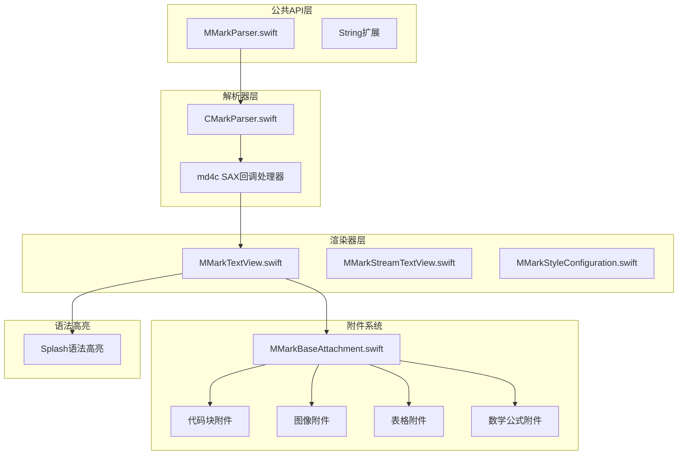
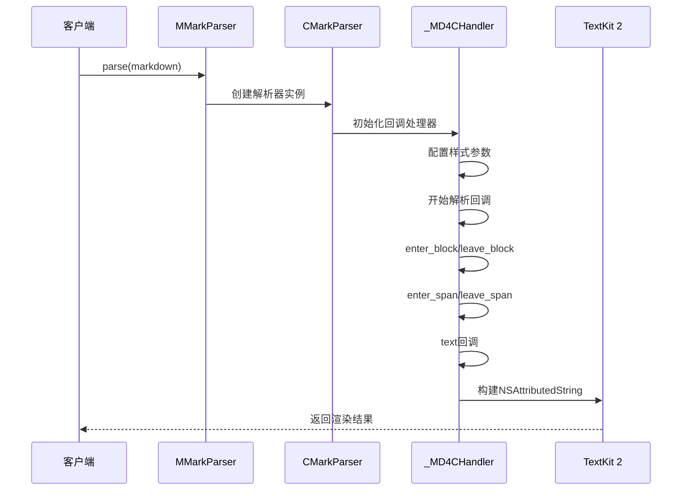
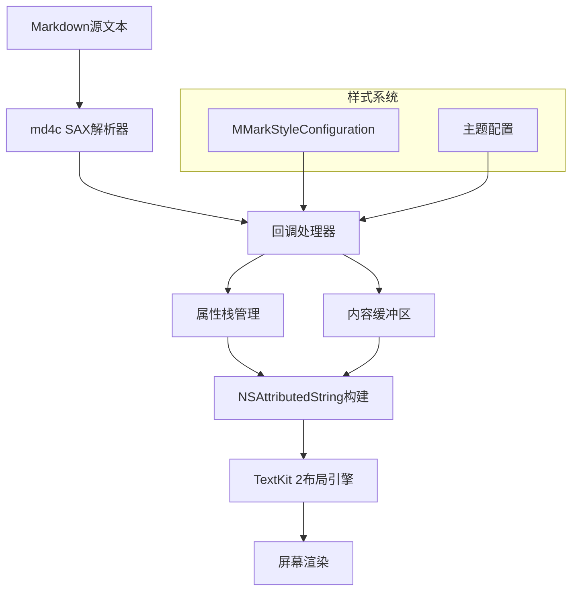
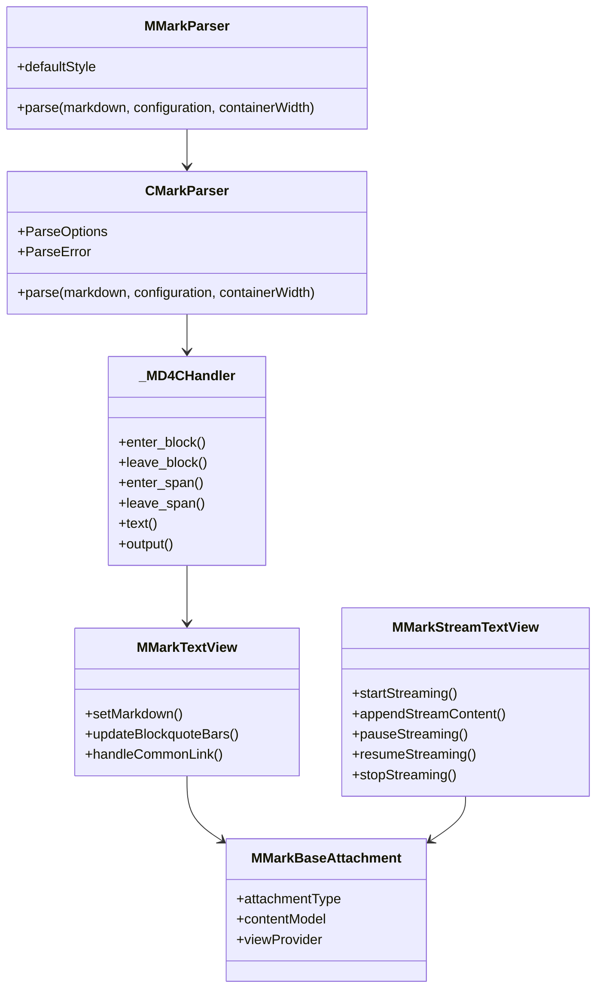
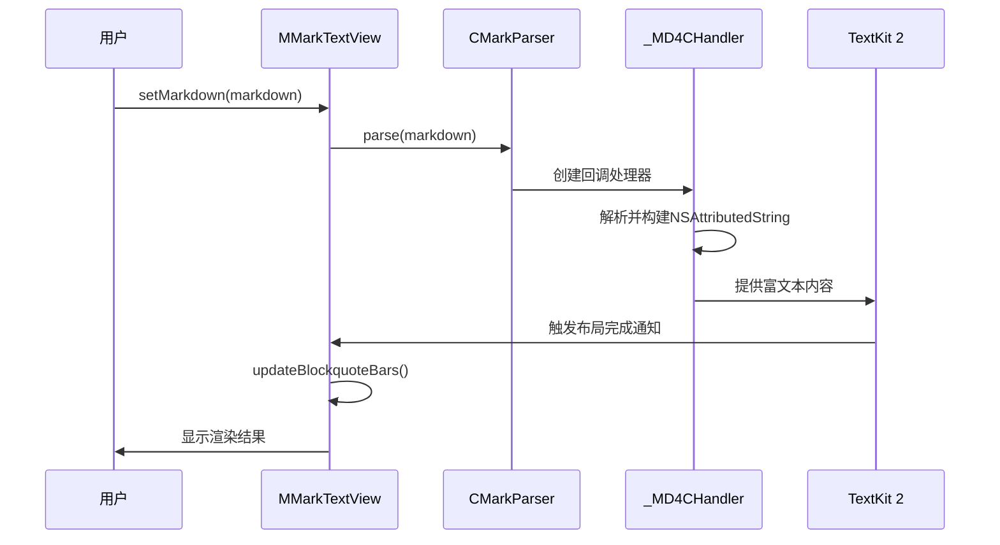
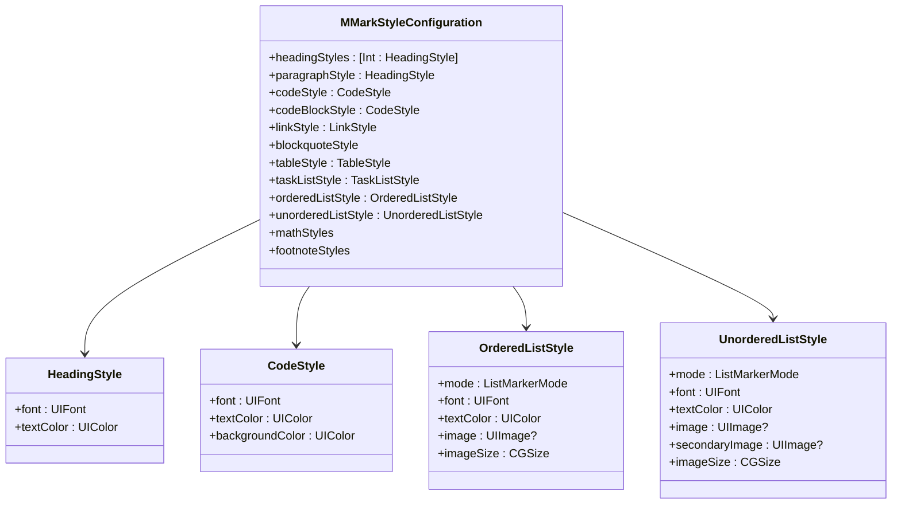
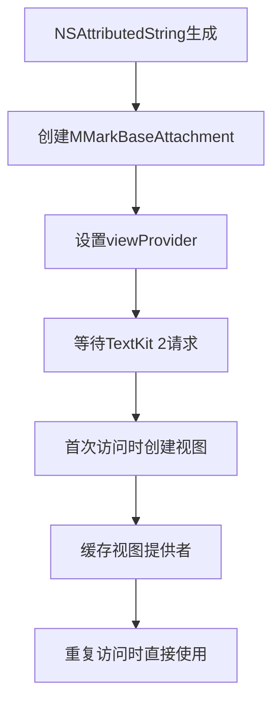
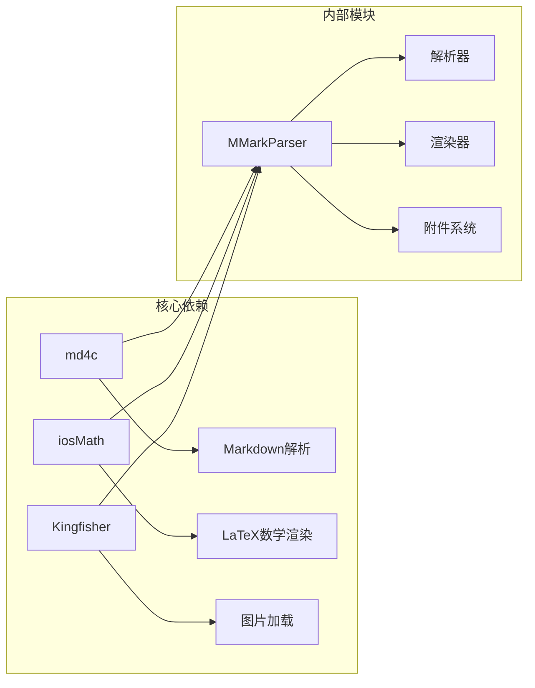
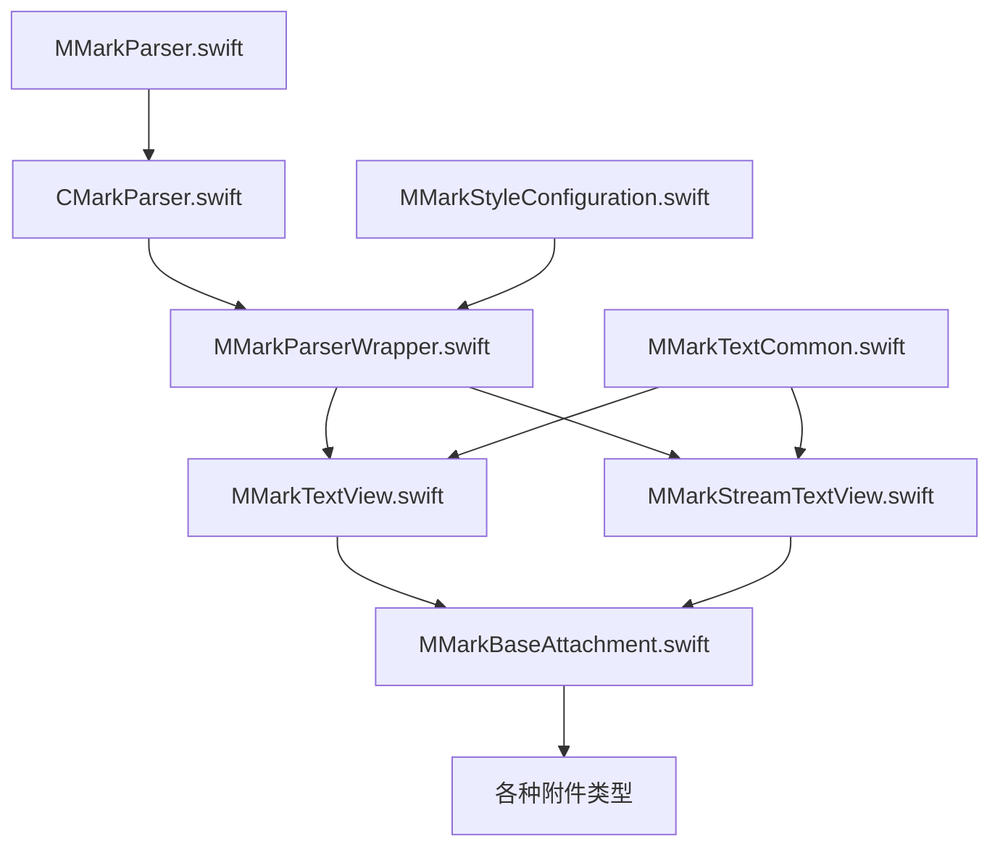

# 最佳实践指南

<cite>
**本文档引用的文件**
- [MMarkParser.swift](file://MMarkParser/Sources/MMarkParser.swift)
- [CMarkParser.swift](file://MMarkParser/Sources/Parser/CMarkParser.swift)
- [MMarkParserWrapper.swift](file://MMarkParser/Sources/Parser/MMarkParserWrapper.swift)
- [MMarkTextView.swift](file://MMarkParser/Sources/Renderer/MMarkTextView.swift)
- [MMarkStreamTextView.swift](file://MMarkParser/Sources/Renderer/MMarkStreamTextView.swift)
- [MMarkStyleConfiguration.swift](file://MMarkParser/Sources/Renderer/MMarkStyleConfiguration.swift)
- [MMarkTextCommon.swift](file://MMarkParser/Sources/Renderer/MMarkTextCommon.swift)
- [MMarkBaseAttachment.swift](file://MMarkParser/Sources/Renderer/Attachments/MMarkBaseAttachment/MMarkBaseAttachment.swift)
- [MMarkCodeBlockAttachment.swift](file://MMarkParser/Sources/Renderer/Attachments/MMarkCodeBlockAttachment/MMarkCodeBlockAttachment.swift)
- [ViewController.swift](file://cocoapod_demo/cocoapod_demo/ViewController.swift)
- [StreamViewController.swift](file://cocoapod_demo/cocoapod_demo/StreamViewController.swift)
- [README.md](file://README.md)
</cite>

## 目录
1. [简介](#简介)
2. [项目结构](#项目结构)
3. [核心组件](#核心组件)
4. [架构概览](#架构概览)
5. [详细组件分析](#详细组件分析)
6. [性能优化最佳实践](#性能优化最佳实践)
7. [用户体验优化策略](#用户体验优化策略)
8. [代码组织与架构设计](#代码组织与架构设计)
9. [常见问题与调试技巧](#常见问题与调试技巧)
10. [不同使用场景的最佳实践](#不同使用场景的最佳实践)
11. [依赖关系分析](#依赖关系分析)
12. [结论](#结论)

## 简介

MMarkParser是一个基于iOS 15+ TextKit 2构建的Markdown解析和渲染引擎，专为现代iOS应用设计。该项目提供了完整的GFM（GitHub Flavored Markdown）支持，包括表格、任务列表、LaTeX数学公式、语法高亮等功能。其架构采用回调驱动的md4c解析器，结合TextKit 2的附件系统，实现了高性能的富文本渲染。

## 项目结构

MMarkParser采用模块化的架构设计，主要分为以下几个核心部分：



**图表来源**
- [MMarkParser.swift:1-42](file://MMarkParser/Sources/MMarkParser.swift#L1-L42)
- [CMarkParser.swift:1-81](file://MMarkParser/Sources/Parser/CMarkParser.swift#L1-L81)
- [MMarkTextView.swift:1-81](file://MMarkParser/Sources/Renderer/MMarkTextView.swift#L1-L81)

**章节来源**
- [README.md:108-212](file://README.md#L108-L212)

## 核心组件

### 主要API入口

MMarkParser提供了简洁的公共API接口，支持两种使用方式：

1. **静态方法调用**：`MMarkParser.parse(markdown:configuration:containerWidth:)`
2. **字符串扩展**：`String.parseMarkdown(configuration:containerWidth:)`

### 解析器架构

解析器采用md4c的SAX回调模型，通过回调函数实时构建`NSAttributedString`，避免了中间AST树的内存开销。



**图表来源**
- [MMarkParser.swift:18-26](file://MMarkParser/Sources/MMarkParser.swift#L18-L26)
- [CMarkParser.swift:56-66](file://MMarkParser/Sources/Parser/CMarkParser.swift#L56-L66)
- [MMarkParserWrapper.swift:134-170](file://MMarkParser/Sources/Parser/MMarkParserWrapper.swift#L134-L170)

**章节来源**
- [MMarkParser.swift:4-42](file://MMarkParser/Sources/MMarkParser.swift#L4-L42)
- [CMarkParser.swift:55-66](file://MMarkParser/Sources/Parser/CMarkParser.swift#L55-L66)

## 架构概览

MMarkParser的核心架构基于以下设计原则：

### 数据流架构



**图表来源**
- [MMarkParserWrapper.swift:16-100](file://MMarkParser/Sources/Parser/MMarkParserWrapper.swift#L16-L100)
- [MMarkStyleConfiguration.swift:189-267](file://MMarkParser/Sources/Renderer/MMarkStyleConfiguration.swift#L189-L267)

### 组件交互关系



**图表来源**
- [MMarkParser.swift:5-27](file://MMarkParser/Sources/MMarkParser.swift#L5-L27)
- [CMarkParser.swift:7-67](file://MMarkParser/Sources/Parser/CMarkParser.swift#L7-L67)
- [MMarkTextView.swift:6-62](file://MMarkParser/Sources/Renderer/MMarkTextView.swift#L6-L62)
- [MMarkStreamTextView.swift:21-38](file://MMarkParser/Sources/Renderer/MMarkStreamTextView.swift#L21-L38)
- [MMarkBaseAttachment.swift:12-59](file://MMarkParser/Sources/Renderer/Attachments/MMarkBaseAttachment/MMarkBaseAttachment.swift#L12-L59)

## 详细组件分析

### 文本渲染组件

#### MMarkTextView - 静态渲染

MMarkTextView是基础的Markdown渲染视图，继承自UITextView，提供了以下增强功能：

- **引用块侧边栏渲染**：动态绘制多层嵌套引用块的彩色侧边条
- **链接处理**：统一处理内部链接、脚注引用和外部链接
- **样式配置**：完全可定制的样式系统



**图表来源**
- [MMarkTextView.swift:40-62](file://MMarkParser/Sources/Renderer/MMarkTextView.swift#L40-L62)
- [MMarkTextCommon.swift:131-249](file://MMarkParser/Sources/Renderer/MMarkTextCommon.swift#L131-L249)

#### MMarkStreamTextView - 流式渲染

MMarkStreamTextView专为大文档和实时内容场景设计，提供了渐进式渲染能力：

- **定时器驱动**：基于DispatchSource的定时器实现平滑的渲染进度
- **后台解析**：解析工作在专用队列中执行，避免阻塞主线程
- **增量更新**：支持内容追加和暂停恢复功能
- **自动滚动**：智能跟随新内容的滚动行为

**章节来源**
- [MMarkTextView.swift:1-81](file://MMarkParser/Sources/Renderer/MMarkTextView.swift#L1-L81)
- [MMarkStreamTextView.swift:1-398](file://MMarkParser/Sources/Renderer/MMarkStreamTextView.swift#L1-L398)

### 样式配置系统

MMarkStyleConfiguration提供了全面的样式定制能力，支持以下元素的个性化：

- **标题样式**：H1-H6的独立字体和颜色配置
- **列表样式**：有序、无序、任务列表的字符或图像标记
- **代码样式**：行内代码和代码块的颜色、背景和字体
- **表格样式**：表头、单元格的边框、背景和对齐
- **数学公式样式**：LaTeX公式的字体和背景配置
- **引用块样式**：多层嵌套的边框颜色和背景



**图表来源**
- [MMarkStyleConfiguration.swift:11-339](file://MMarkParser/Sources/Renderer/MMarkStyleConfiguration.swift#L11-L339)

**章节来源**
- [MMarkStyleConfiguration.swift:189-339](file://MMarkParser/Sources/Renderer/MMarkStyleConfiguration.swift#L189-L339)

### 附件系统

MMarkParser使用TextKit 2的附件系统来渲染复杂元素，每个附件都包含三个层次：

1. **模型层**：存储数据和状态
2. **附件层**：继承自NSTextAttachment，负责数据绑定
3. **视图提供者层**：延迟创建视图，优化内存使用

**章节来源**
- [MMarkBaseAttachment.swift:1-60](file://MMarkParser/Sources/Renderer/Attachments/MMarkBaseAttachment/MMarkBaseAttachment.swift#L1-L60)

## 性能优化最佳实践

### 内存管理优化

#### 1. 附件懒加载机制

MMarkParser采用延迟视图创建策略，只有在需要显示时才创建附件视图：



**图表来源**
- [MMarkBaseAttachment.swift:32-58](file://MMarkParser/Sources/Renderer/Attachments/MMarkBaseAttachment/MMarkBaseAttachment.swift#L32-L58)

#### 2. 属性栈优化

解析器使用属性栈来管理样式上下文，避免重复创建属性字典：

- **栈操作**：`pushAttrs()`和`popAttrs()`确保正确的样式继承
- **状态跟踪**：维护列表深度、引用块深度等上下文信息
- **内存复用**：重用属性字典减少内存分配

#### 3. 缓冲区管理

对于大型内容（代码块、表格），使用专门的缓冲区来累积内容：

- **代码块缓冲区**：累积代码内容，一次性渲染
- **表格缓冲区**：累积表格数据，批量处理
- **脚注缓冲区**：累积脚注内容，统一渲染

### 渲染性能优化

#### 1. TextKit 2优化

MMarkParser充分利用TextKit 2的新特性：

- **增量布局**：支持部分区域重新布局
- **延迟视图创建**：附件视图按需创建
- **更好的滚动性能**：优化的滚动和触摸响应

#### 2. 流式渲染策略

对于大文档，使用流式渲染避免一次性渲染造成的卡顿：

- **定时器节流**：默认每30ms渲染一次
- **动态块大小**：长文档自动增大块大小保持流畅
- **后台解析**：解析在后台队列执行

#### 3. 引用块侧边条优化

引用块的侧边条使用Core Graphics直接绘制，避免子视图管理的开销：

- **CALayer绘制**：直接在视图层上绘制彩色条
- **批量处理**：合并相邻的引用块范围
- **智能更新**：只在内容变化时重新绘制

### 大文档处理最佳实践

#### 1. 分页策略

对于超大文档，建议采用分页加载策略：

- **分段解析**：将大文档分割成多个小段
- **增量显示**：先显示前几段，其他段落延迟加载
- **预加载机制**：用户接近底部时预加载下一段

#### 2. 内存限制

设置合理的内存使用上限：

- **最大文档大小**：建议不超过100KB，超过时考虑流式处理
- **并发限制**：控制同时解析的文档数量
- **缓存策略**：合理设置解析结果缓存时间

**章节来源**
- [MMarkStreamTextView.swift:340-351](file://MMarkParser/Sources/Renderer/MMarkStreamTextView.swift#L340-L351)
- [MMarkParserWrapper.swift:92-92](file://MMarkParser/Sources/Parser/MMarkParserWrapper.swift#L92-L92)

## 用户体验优化策略

### 滚动性能优化

#### 1. 平滑滚动体验

MMarkStreamTextView提供了智能的滚动跟随功能：

- **阈值判断**：用户距离底部一定距离时才自动滚动
- **动画控制**：可配置滚动动画效果
- **性能监控**：避免滚动时的卡顿现象

#### 2. 引用块导航

引用块侧边条不仅美观，还提供了导航功能：

- **点击定位**：点击侧边条可快速定位到对应内容
- **多层嵌套**：支持任意深度的嵌套引用块
- **颜色区分**：不同深度使用不同颜色便于识别

### 响应速度优化

#### 1. 解析速度优化

- **预编译正则表达式**：避免重复编译
- **缓存解析结果**：对相同内容使用缓存
- **异步处理**：解析在后台队列执行

#### 2. 渲染速度优化

- **增量渲染**：只渲染变化的部分
- **批量更新**：多个更新合并为一次
- **延迟初始化**：视图按需创建

### 加载体验优化

#### 1. 加载指示器

对于大文档，建议添加加载指示器：

- **进度条**：显示解析进度
- **状态提示**：显示当前状态（解析中、渲染中）
- **取消功能**：允许用户取消长时间操作

#### 2. 错误处理

提供友好的错误处理机制：

- **降级显示**：解析失败时显示原始文本
- **错误提示**：清晰的错误信息
- **重试机制**：支持自动重试

**章节来源**
- [MMarkStreamTextView.swift:61-70](file://MMarkParser/Sources/Renderer/MMarkStreamTextView.swift#L61-L70)
- [MMarkTextView.swift:77-81](file://MMarkParser/Sources/Renderer/MMarkTextView.swift#L77-L81)

## 代码组织与架构设计

### 模块化设计原则

#### 1. 分层架构

MMarkParser采用清晰的分层设计：

- **API层**：对外提供的简单接口
- **解析层**：处理Markdown解析逻辑
- **渲染层**：负责UI渲染和交互
- **附件层**：处理复杂元素的渲染

#### 2. 接口隔离

每个模块都有明确的职责边界：

- **解析器接口**：只负责解析，不关心UI
- **渲染器接口**：只负责显示，不关心解析细节
- **样式接口**：集中管理所有样式配置

### 组件复用策略

#### 1. 通用协议设计

MMarkTextCommon定义了通用协议，支持组件复用：

```swift
protocol MMarkTextComponent {
    var styleConfiguration: MMarkStyleConfiguration { get }
    var mmarkLinkDelegate: MMarkLinkDelegate? { get set }
}
```

#### 2. 附件系统复用

附件系统提供了统一的扩展点：

- **基类抽象**：MMarkBaseAttachment提供通用功能
- **模型分离**：数据模型与视图分离
- **视图提供者**：延迟视图创建机制

### 错误处理最佳实践

#### 1. 类型安全的错误处理

解析器使用枚举类型定义错误：

```swift
enum ParseError: Error {
    case invalidInput
    case parsingFailed
    case styleConversionFailed
}
```

#### 2. 优雅降级

当解析失败时，系统会优雅降级：

- **显示原文**：显示原始Markdown文本
- **日志记录**：记录详细的错误信息
- **用户提示**：向用户提供友好的错误信息

**章节来源**
- [CMarkParser.swift:8-12](file://MMarkParser/Sources/Parser/CMarkParser.swift#L8-L12)
- [MMarkParserWrapper.swift:18-100](file://MMarkParser/Sources/Parser/MMarkParserWrapper.swift#L18-L100)

## 常见问题与调试技巧

### 性能问题诊断

#### 1. 内存泄漏检测

使用Instruments的Leaks工具检测内存泄漏：

- **附件视图泄漏**：检查视图提供者是否正确释放
- **属性栈泄漏**：验证属性栈的push/pop配对
- **定时器泄漏**：确保定时器在适当时候停止

#### 2. 渲染性能分析

使用Time Profiler分析渲染性能瓶颈：

- **解析时间**：分析解析器的性能
- **布局时间**：检查TextKit 2布局的效率
- **绘制时间**：分析引用块侧边条的绘制开销

### 常见问题解决

#### 1. 中文链接编码问题

系统自动处理URL编码，避免中文字符导致的崩溃：

```swift
// 对URL进行百分比编码
let encodedUrl: String
if urlStr.hasPrefix("#") {
    let anchor = String(urlStr.dropFirst())
    let encodedAnchor = anchor.addingPercentEncoding(withAllowedCharacters: .urlFragmentAllowed) ?? anchor
    encodedUrl = "#" + encodedAnchor
} else if let encoded = urlStr.addingPercentEncoding(withAllowedCharacters: .urlQueryAllowed.union(.urlPathAllowed).union(.urlHostAllowed).union(.urlFragmentAllowed)) {
    encodedUrl = encoded
} else {
    encodedUrl = urlStr
}
```

#### 2. 图片加载失败处理

使用Kingfisher处理远程图片加载：

- **占位符显示**：加载失败时显示占位符颜色
- **重试机制**：网络异常时自动重试
- **缓存策略**：合理设置图片缓存

#### 3. 数学公式渲染问题

iosMath渲染可能出现的问题：

- **字体缺失**：检查KaTeX字体文件是否正确加载
- **渲染异常**：数学公式渲染失败时降级为文本
- **性能优化**：大量数学公式时考虑延迟渲染

### 调试技巧

#### 1. 日志输出

启用详细的日志输出来追踪解析过程：

- **解析步骤**：记录每个回调的触发
- **属性变化**：跟踪属性栈的状态变化
- **内存使用**：监控内存使用情况

#### 2. 断点调试

在关键节点设置断点：

- **回调入口**：enter_block/enter_span的入口
- **属性栈**：pushAttrs/popAttrs的操作
- **附件创建**：视图提供者的创建时机

**章节来源**
- [MMarkParserWrapper.swift:690-708](file://MMarkParser/Sources/Parser/MMarkParserWrapper.swift#L690-L708)
- [MMarkTextCommon.swift:48-129](file://MMarkParser/Sources/Renderer/MMarkTextCommon.swift#L48-L129)

## 不同使用场景的最佳实践

### 博客应用

#### 1. 配置优化

```swift
// 博客应用的样式配置
var blogStyle = MMarkStyleConfiguration.defaultStyle
blogStyle.paragraphStyle.font = UIFont.systemFont(ofSize: 18)
blogStyle.paragraphStyle.textColor = .label
blogStyle.headingStyles[1] = .init(font: UIFont.boldSystemFont(ofSize: 28), textColor: .primary)
blogStyle.codeBlockStyle = .init(font: UIFont.monospacedSystemFont(ofSize: 16), textColor: .black, backgroundColor: .systemGray6)
```

#### 2. 性能考虑

- **预加载策略**：首页文章预加载
- **缓存机制**：已解析的文章内容缓存
- **懒加载**：图片和视频的懒加载

### 聊天应用

#### 1. 实时渲染

```swift
// 聊天消息的流式渲染
streamTextView.typingSpeed = 0.01  // 更快的渲染速度
streamTextView.chunkSize = 10      // 更大的块大小
streamTextView.autoScrollToBottom = true
```

#### 2. 交互优化

- **消息定位**：支持跳转到特定消息
- **链接处理**：外部链接在系统浏览器中打开
- **脚注导航**：支持脚注的快速跳转

### 文档编辑器

#### 1. 编辑体验

```swift
// 编辑器的配置
textView.isEditable = true
textView.isScrollEnabled = true
textView.backgroundColor = .systemBackground
```

#### 2. 高亮显示

- **语法高亮**：代码块的语法高亮
- **实时预览**：编辑时实时预览渲染效果
- **主题切换**：支持深色/浅色主题

### 教育平台

#### 1. 数学公式支持

```swift
// 教育应用的数学公式配置
style.mathInlineStyle = .init(font: UIFont(name: "KaTeX_Main-Regular", size: 20) ?? UIFont.systemFont(ofSize: 20), textColor: .label)
style.mathBlockStyle = .init(font: UIFont(name: "KaTeX_Main-Regular", size: 24) ?? UIFont.systemFont(ofSize: 24), textColor: .label)
```

#### 2. 交互功能

- **公式复制**：支持LaTeX代码的复制
- **解释功能**：点击公式显示解释
- **练习集成**：与在线练习系统的集成

**章节来源**
- [StreamViewController.swift:167-199](file://cocoapod_demo/cocoapod_demo/StreamViewController.swift#L167-L199)
- [ViewController.swift:38-43](file://cocoapod_demo/cocoapod_demo/ViewController.swift#L38-L43)

## 依赖关系分析

### 外部依赖

MMarkParser依赖以下关键库：



**图表来源**
- [README.md:36-40](file://README.md#L36-L40)

### 内部依赖关系



**图表来源**
- [MMarkParser.swift:1-42](file://MMarkParser/Sources/MMarkParser.swift#L1-L42)
- [CMarkParser.swift:1-81](file://MMarkParser/Sources/Parser/CMarkParser.swift#L1-L81)
- [MMarkTextView.swift:1-81](file://MMarkParser/Sources/Renderer/MMarkTextView.swift#L1-L81)

**章节来源**
- [README.md:108-212](file://README.md#L108-L212)

## 结论

MMarkParser作为一个现代化的iOS Markdown渲染库，具有以下优势：

### 技术优势

1. **高性能架构**：基于md4c的回调模型和TextKit 2的附件系统
2. **内存友好**：懒加载机制和属性栈优化
3. **功能完整**：完整的GFM支持和LaTeX数学公式渲染
4. **高度可定制**：全面的样式配置系统

### 最佳实践总结

1. **性能优化**：合理使用流式渲染，避免大文档一次性渲染
2. **内存管理**：利用附件懒加载机制，及时释放不需要的资源
3. **用户体验**：提供平滑的滚动和响应的交互体验
4. **错误处理**：实现优雅的降级机制和用户友好的错误提示

### 发展方向

随着iOS平台的发展，MMarkParser可以进一步优化的方向包括：

1. **更智能的缓存策略**：基于内容特征的智能缓存
2. **更好的并发处理**：利用多核CPU的优势
3. **增强的交互功能**：支持更多的手势和交互方式
4. **更好的无障碍支持**：提升残障用户的使用体验

通过遵循本文档的最佳实践，开发者可以充分发挥MMarkParser的潜力，构建出高性能、用户体验优秀的Markdown应用。