# 示例和教程

<cite>
**本文引用的文件**
- [README.md](file://README.md)
- [MMarkParser.podspec](file://MMarkParser.podspec)
- [CMarkParser.swift](file://MMarkParser/Sources/Parser/CMarkParser.swift)
- [MMarkParserWrapper.swift](file://MMarkParser/Sources/Parser/MMarkParserWrapper.swift)
- [MMarkTextView.swift](file://MMarkParser/Sources/Renderer/MMarkTextView.swift)
- [MMarkStreamTextView.swift](file://MMarkParser/Sources/Renderer/MMarkStreamTextView.swift)
- [MMarkStyleConfiguration.swift](file://MMarkParser/Sources/Renderer/MMarkStyleConfiguration.swift)
- [MMarkTextCommon.swift](file://MMarkParser/Sources/Renderer/MMarkTextCommon.swift)
- [MMarkCodeBlockAttachment.swift](file://MMarkParser/Sources/Renderer/Attachments/MMarkCodeBlockAttachment/MMarkCodeBlockAttachment.swift)
- [MMarkImageAttachment.swift](file://MMarkParser/Sources/Renderer/Attachments/MMarkImageAttachment/MMarkImageAttachment.swift)
- [MMarkMermaidAttachment.swift](file://MMarkParser/Sources/Renderer/Attachments/MMarkMermaidAttachment/MMarkMermaidAttachment.swift)
- [MMarkMermaidModel.swift](file://MMarkParser/Sources/Renderer/Attachments/MMarkMermaidAttachment/MMarkMermaidModel.swift)
- [MMarkMermaidView.swift](file://MMarkParser/Sources/Renderer/Attachments/MMarkMermaidAttachment/MMarkMermaidView.swift)
- [MMarkMermaidViewProvider.swift](file://MMarkParser/Sources/Renderer/Attachments/MMarkMermaidAttachment/MMarkMermaidViewProvider.swift)
- [BeautifulMermaid.swift](file://MMarkParser/BeautifulMermaidSwift/BeautifulMermaid.swift)
- [MermaidParser.swift](file://MMarkParser/BeautifulMermaidSwift/MermaidParser.swift)
- [MermaidTypes.swift](file://MMarkParser/BeautifulMermaidSwift/MermaidTypes.swift)
- [ViewController.swift](file://cocoapod_demo/cocoapod_demo/ViewController.swift)
- [StreamViewController.swift](file://cocoapod_demo/cocoapod_demo/StreamViewController.swift)
- [SampleMarkdown.swift](file://cocoapod_demo/cocoapod_demo/SampleMarkdown.swift)
</cite>

## 目录
1. [简介](#简介)
2. [项目结构](#项目结构)
3. [核心组件](#核心组件)
4. [架构总览](#架构总览)
5. [详细组件分析](#详细组件分析)
6. [Mermaid图表渲染完整示例](#mermaid图表渲染完整示例)
7. [依赖关系分析](#依赖关系分析)
8. [性能考量](#性能考量)
9. [故障排除指南](#故障排除指南)
10. [结论](#结论)
11. [附录](#附录)

## 简介
本教程面向不同层次的开发者，提供从基础到高级的 MMarkParser 使用示例与最佳实践，涵盖：
- 基础 Markdown 渲染（静态与流式）
- 样式定制（主题与排版）
- 交互处理（链接、脚注、锚点跳转）
- Mermaid图表渲染（流程图、时序图、类图、ER图、状态图、XY图）
- 常见场景（博客文章、聊天消息、文档预览）
- 性能优化、内存管理与用户体验建议
- 故障排除与常见问题解答

## 项目结构
- 库主体位于 MMarkParser/Sources，分为 Parser 与 Renderer 两大模块，配套资源与附件视图。
- 示例工程位于 cocoapod_demo，包含基础渲染与流式渲染两个控制器，演示典型用法。
- Mermaid图表渲染功能位于 BeautifulMermaidSwift 库，提供完整的图表解析、布局和渲染能力。

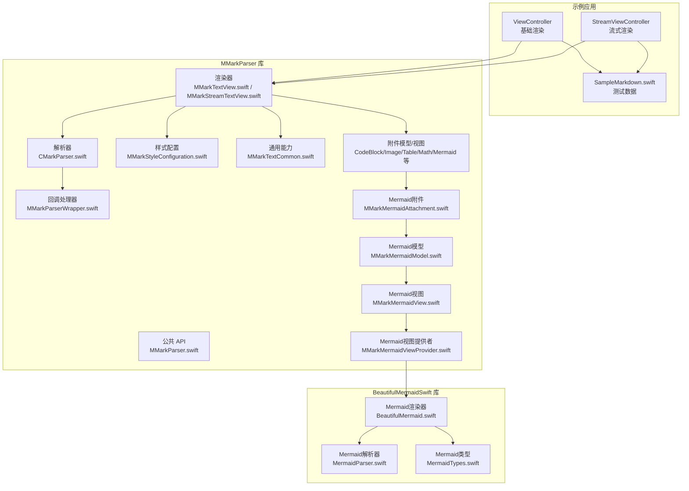

**图表来源**
- [ViewController.swift:1-46](file://cocoapod_demo/cocoapod_demo/ViewController.swift#L1-L46)
- [StreamViewController.swift:1-279](file://cocoapod_demo/cocoapod_demo/StreamViewController.swift#L1-L279)
- [CMarkParser.swift:1-81](file://MMarkParser/Sources/Parser/CMarkParser.swift#L1-L81)
- [MMarkParserWrapper.swift:1-800](file://MMarkParser/Sources/Parser/MMarkParserWrapper.swift#L1-L800)
- [MMarkTextView.swift:1-81](file://MMarkParser/Sources/Renderer/MMarkTextView.swift#L1-L81)
- [MMarkStreamTextView.swift:1-398](file://MMarkParser/Sources/Renderer/MMarkStreamTextView.swift#L1-L398)
- [MMarkStyleConfiguration.swift:1-339](file://MMarkParser/Sources/Renderer/MMarkStyleConfiguration.swift#L1-L339)
- [MMarkTextCommon.swift:1-290](file://MMarkParser/Sources/Renderer/MMarkTextCommon.swift#L1-L290)
- [MMarkMermaidAttachment.swift:1-33](file://MMarkParser/Sources/Renderer/Attachments/MMarkMermaidAttachment/MMarkMermaidAttachment.swift#L1-L33)
- [MMarkMermaidModel.swift:1-130](file://MMarkParser/Sources/Renderer/Attachments/MMarkMermaidAttachment/MMarkMermaidModel.swift#L1-L130)
- [MMarkMermaidView.swift:1-178](file://MMarkParser/Sources/Renderer/Attachments/MMarkMermaidAttachment/MMarkMermaidView.swift#L1-L178)
- [MMarkMermaidViewProvider.swift:1-52](file://MMarkParser/Sources/Renderer/Attachments/MMarkMermaidAttachment/MMarkMermaidViewProvider.swift#L1-L52)
- [BeautifulMermaid.swift:1-185](file://MMarkParser/BeautifulMermaidSwift/BeautifulMermaid.swift#L1-L185)
- [MermaidParser.swift:1-54](file://MMarkParser/BeautifulMermaidSwift/MermaidParser.swift#L1-L54)
- [MermaidTypes.swift:1-317](file://MMarkParser/BeautifulMermaidSwift/MermaidTypes.swift#L1-L317)

**章节来源**
- [README.md:108-237](file://README.md#L108-L237)
- [MMarkParser.podspec:1-19](file://MMarkParser.podspec#L1-L19)

## 核心组件
- 解析器（CMarkParser）：基于 md4c 的 SAX 回调模型，支持 GFM 扩展（表格、任务列表、自动链接、行内/块级数学公式、脚注等）。
- 渲染器（MMarkTextView / MMarkStreamTextView）：基于 TextKit 2 的富文本视图，支持块引用竖条绘制、链接与脚注/锚点跳转、附件懒加载视图。
- 样式配置（MMarkStyleConfiguration）：统一控制标题、段落、代码、链接、引用、列表、表格、数学公式、脚注等元素的字体、颜色、间距、圆角等。
- 通用能力（MMarkTextCommon）：统一的链接处理、脚注/锚点定位、块引用竖条绘制等。
- 附件（CodeBlock、Image、Table、Math、HorizontalRule、ListMarker、Mermaid 等）：复杂元素以 NSTextAttachment 形式渲染，配合 ViewProvider 懒加载。
- Mermaid图表渲染：基于 BeautifulMermaidSwift 库，支持多种图表类型的解析、布局和渲染。

**章节来源**
- [CMarkParser.swift:1-81](file://MMarkParser/Sources/Parser/CMarkParser.swift#L1-L81)
- [MMarkTextView.swift:1-81](file://MMarkParser/Sources/Renderer/MMarkTextView.swift#L1-L81)
- [MMarkStreamTextView.swift:1-398](file://MMarkParser/Sources/Renderer/MMarkStreamTextView.swift#L1-L398)
- [MMarkStyleConfiguration.swift:1-339](file://MMarkParser/Sources/Renderer/MMarkStyleConfiguration.swift#L1-L339)
- [MMarkTextCommon.swift:1-290](file://MMarkParser/Sources/Renderer/MMarkTextCommon.swift#L1-L290)
- [MMarkMermaidAttachment.swift:1-33](file://MMarkParser/Sources/Renderer/Attachments/MMarkMermaidAttachment/MMarkMermaidAttachment.swift#L1-L33)
- [MMarkMermaidModel.swift:1-130](file://MMarkParser/Sources/Renderer/Attachments/MMarkMermaidAttachment/MMarkMermaidModel.swift#L1-L130)
- [MMarkMermaidView.swift:1-178](file://MMarkParser/Sources/Renderer/Attachments/MMarkMermaidAttachment/MMarkMermaidView.swift#L1-L178)
- [MMarkMermaidViewProvider.swift:1-52](file://MMarkParser/Sources/Renderer/Attachments/MMarkMermaidAttachment/MMarkMermaidViewProvider.swift#L1-L52)

## 架构总览
下图展示从 Markdown 字符串到最终屏幕渲染的数据流与组件协作，包括 Mermaid图表渲染的完整流程。

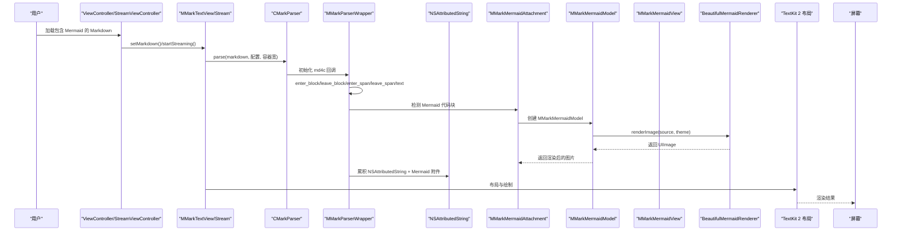

**图表来源**
- [CMarkParser.swift:55-66](file://MMarkParser/Sources/Parser/CMarkParser.swift#L55-L66)
- [MMarkParserWrapper.swift:134-644](file://MMarkParser/Sources/Parser/MMarkParserWrapper.swift#L134-L644)
- [MMarkTextView.swift:39-49](file://MMarkParser/Sources/Renderer/MMarkTextView.swift#L39-L49)
- [MMarkStreamTextView.swift:174-201](file://MMarkParser/Sources/Renderer/MMarkStreamTextView.swift#L174-L201)
- [MMarkMermaidAttachment.swift:18-21](file://MMarkParser/Sources/Renderer/Attachments/MMarkMermaidAttachment/MMarkMermaidAttachment.swift#L18-L21)
- [MMarkMermaidModel.swift:95-129](file://MMarkParser/Sources/Renderer/Attachments/MMarkMermaidAttachment/MMarkMermaidModel.swift#L95-L129)
- [BeautifulMermaid.swift:17-26](file://MMarkParser/BeautifulMermaidSwift/BeautifulMermaid.swift#L17-L26)

**章节来源**
- [README.md:158-181](file://README.md#L158-L181)

## 详细组件分析

### 基础渲染（ViewController）
- 使用 MMarkTextView 接收 Markdown 字符串，内部通过 CMarkParser 解析并生成 NSAttributedString，随后交由 TextKit 2 布局。
- 支持链接点击回调（可接管默认行为），块引用竖条自动绘制。
- 示例路径：[ViewController.swift:1-46](file://cocoapod_demo/cocoapod_demo/ViewController.swift#L1-L46)

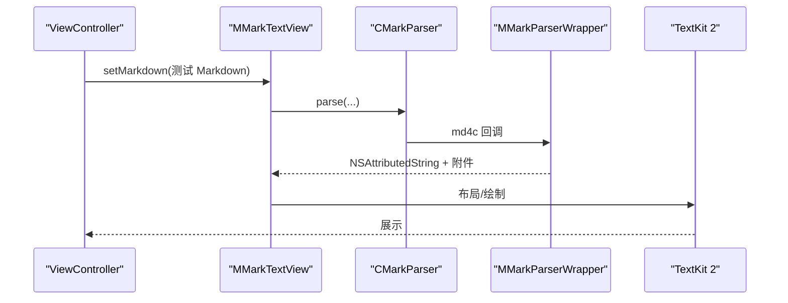

**图表来源**
- [ViewController.swift:38-43](file://cocoapod_demo/cocoapod_demo/ViewController.swift#L38-L43)
- [MMarkTextView.swift:39-49](file://MMarkParser/Sources/Renderer/MMarkTextView.swift#L39-L49)
- [CMarkParser.swift:55-66](file://MMarkParser/Sources/Parser/CMarkParser.swift#L55-L66)

**章节来源**
- [ViewController.swift:1-46](file://cocoapod_demo/cocoapod_demo/ViewController.swift#L1-L46)
- [MMarkTextView.swift:1-81](file://MMarkParser/Sources/Renderer/MMarkTextView.swift#L1-L81)

### 流式渲染（StreamViewController）
- 使用 MMarkStreamTextView 实现"打字机"式增量渲染，支持启动、暂停、恢复、停止、追加内容、一次性渲染等。
- 通过定时器驱动，按 chunk 大小与速度逐步追加 NSAttributedString，避免全量重布局带来的卡顿。
- 提供尺寸变化通知与自动滚动到底部能力，适配长文档阅读体验。
- 示例路径：[StreamViewController.swift:1-279](file://cocoapod_demo/cocoapod_demo/StreamViewController.swift#L1-L279)

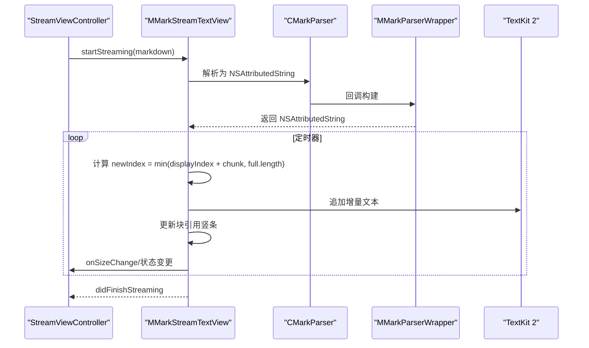

**图表来源**
- [StreamViewController.swift:208-232](file://cocoapod_demo/cocoapod_demo/StreamViewController.swift#L208-L232)
- [MMarkStreamTextView.swift:174-351](file://MMarkParser/Sources/Renderer/MMarkStreamTextView.swift#L174-L351)

**章节来源**
- [StreamViewController.swift:1-279](file://cocoapod_demo/cocoapod_demo/StreamViewController.swift#L1-L279)
- [MMarkStreamTextView.swift:1-398](file://MMarkParser/Sources/Renderer/MMarkStreamTextView.swift#L1-L398)

### 样式定制（MMarkStyleConfiguration）
- 支持标题层级、段落、代码/代码块、链接、删除线、块引用、图片占位、表格、任务列表、有序/无序列表、行内/块级数学公式、脚注等的字体、颜色、间距、圆角等。
- 新增 Mermaid图表样式配置：mermaidPadding、mermaidCornerRadius、mermaidHeaderHeight、mermaidHeaderBackgroundColor、mermaidBackgroundColor、mermaidTheme、mermaidAutoDarkMode。
- 提供默认样式 defaultStyle，便于快速上手；也可按需覆盖。
- 示例路径：[MMarkStyleConfiguration.swift:189-267](file://MMarkParser/Sources/Renderer/MMarkStyleConfiguration.swift#L189-L267)

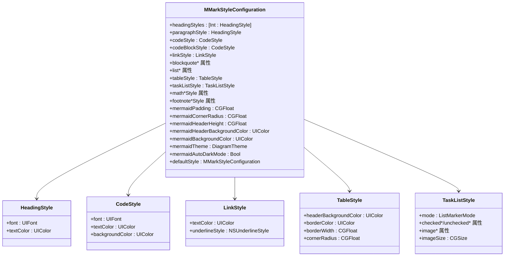

**图表来源**
- [MMarkStyleConfiguration.swift:11-186](file://MMarkParser/Sources/Renderer/MMarkStyleConfiguration.swift#L11-L186)

**章节来源**
- [MMarkStyleConfiguration.swift:1-339](file://MMarkParser/Sources/Renderer/MMarkStyleConfiguration.swift#L1-L339)

### 交互处理（链接、脚注、锚点）
- 通用链接处理：优先回调外部 MMarkLinkDelegate；对脚注与锚点进行内部处理，其余 Web 链接交由系统处理。
- 锚点跳转：根据 fragment 或以 # 开头的片段，模糊匹配标题或文本，滚动到可见区域。
- 块引用竖条：基于 TextKit 2 的 enumerateTextLayoutFragments 计算位置，逐层绘制彩色竖条。
- 示例路径：[MMarkTextCommon.swift:48-129](file://MMarkParser/Sources/Renderer/MMarkTextCommon.swift#L48-L129)

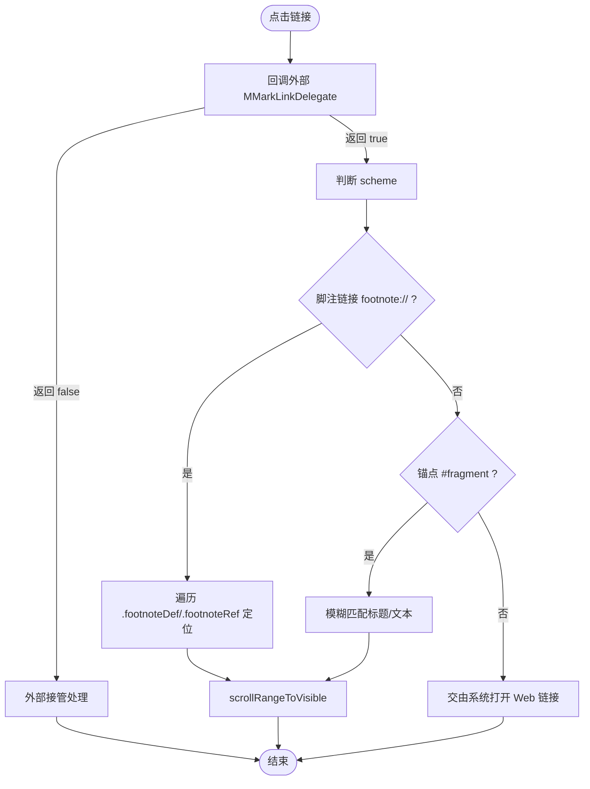

**图表来源**
- [MMarkTextCommon.swift:48-129](file://MMarkParser/Sources/Renderer/MMarkTextCommon.swift#L48-L129)

**章节来源**
- [MMarkTextCommon.swift:1-290](file://MMarkParser/Sources/Renderer/MMarkTextCommon.swift#L1-L290)

### 附件渲染（代码块、图片、表格、数学公式、分隔线、列表标记、Mermaid图表）
- 代码块：基于语法高亮与配置的字体/背景/圆角/内边距渲染。
- 图片：远程图片通过 Kingfisher 加载，占位符颜色可配置。
- 表格：按列宽与对齐布局，支持表头/单元格样式。
- 数学公式：行内/块级通过 iosMath 渲染，字体可指定。
- 分隔线：水平分割线附件。
- 列表标记：支持字符或图片两种模式，支持任务列表勾选状态。
- Mermaid图表：支持流程图、时序图、类图、ER图、状态图、XY图等多种类型，自动检测图表类型，支持暗黑模式自动切换。
- 示例路径：
  - [MMarkCodeBlockAttachment.swift:1-22](file://MMarkParser/Sources/Renderer/Attachments/MMarkCodeBlockAttachment/MMarkCodeBlockAttachment.swift#L1-L22)
  - [MMarkImageAttachment.swift:1-23](file://MMarkParser/Sources/Renderer/Attachments/MMarkImageAttachment/MMarkImageAttachment.swift#L1-L23)
  - [MMarkMermaidAttachment.swift:1-33](file://MMarkParser/Sources/Renderer/Attachments/MMarkMermaidAttachment/MMarkMermaidAttachment.swift#L1-L33)
  - [MMarkMermaidModel.swift:1-130](file://MMarkParser/Sources/Renderer/Attachments/MMarkMermaidAttachment/MMarkMermaidModel.swift#L1-L130)
  - [MMarkMermaidView.swift:1-178](file://MMarkParser/Sources/Renderer/Attachments/MMarkMermaidAttachment/MMarkMermaidView.swift#L1-L178)
  - [MMarkMermaidViewProvider.swift:1-52](file://MMarkParser/Sources/Renderer/Attachments/MMarkMermaidAttachment/MMarkMermaidViewProvider.swift#L1-L52)

**章节来源**
- [MMarkParserWrapper.swift:383-644](file://MMarkParser/Sources/Parser/MMarkParserWrapper.swift#L383-L644)
- [MMarkCodeBlockAttachment.swift:1-22](file://MMarkParser/Sources/Renderer/Attachments/MMarkCodeBlockAttachment/MMarkCodeBlockAttachment.swift#L1-L22)
- [MMarkImageAttachment.swift:1-23](file://MMarkParser/Sources/Renderer/Attachments/MMarkImageAttachment/MMarkImageAttachment.swift#L1-L23)
- [MMarkMermaidAttachment.swift:1-33](file://MMarkParser/Sources/Renderer/Attachments/MMarkMermaidAttachment/MMarkMermaidAttachment.swift#L1-L33)
- [MMarkMermaidModel.swift:1-130](file://MMarkParser/Sources/Renderer/Attachments/MMarkMermaidAttachment/MMarkMermaidModel.swift#L1-L130)
- [MMarkMermaidView.swift:1-178](file://MMarkParser/Sources/Renderer/Attachments/MMarkMermaidAttachment/MMarkMermaidView.swift#L1-L178)
- [MMarkMermaidViewProvider.swift:1-52](file://MMarkParser/Sources/Renderer/Attachments/MMarkMermaidAttachment/MMarkMermaidViewProvider.swift#L1-L52)

## Mermaid图表渲染完整示例

### 支持的图表类型
MMarkParser 完整支持以下 Mermaid 图表类型：

#### 流程图（Flowchart）
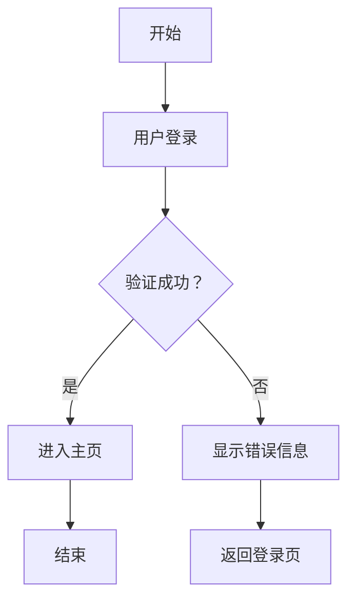

#### 时序图（Sequence Diagram）
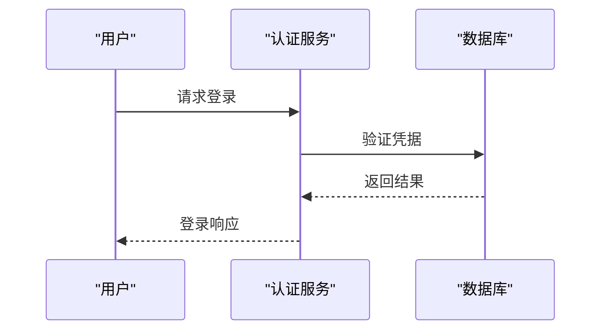

#### 类图（Class Diagram）
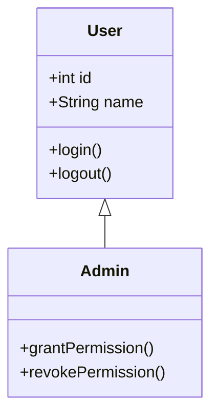

#### ER图（ER Diagram）
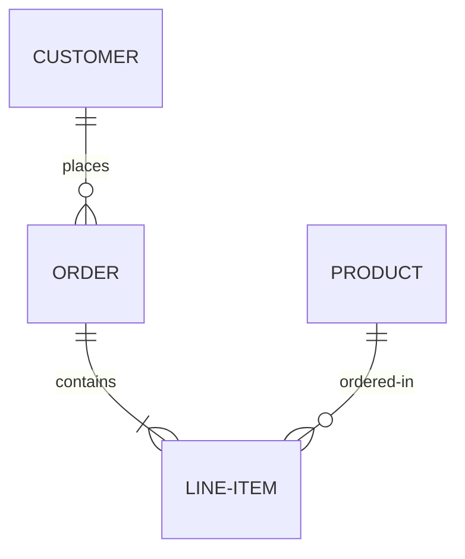

#### 状态图（State Diagram）
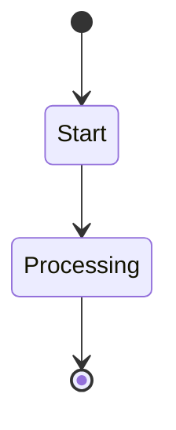

#### XY图（XY Chart）
```mermaid
xychart-beta
x-axis [0,1,2,3,4,5]
y-axis [0,10,20,30,40,50]
line [1,2,3,4,5]
bar [2,4,6,8,10]
```

### Mermaid渲染工作流程
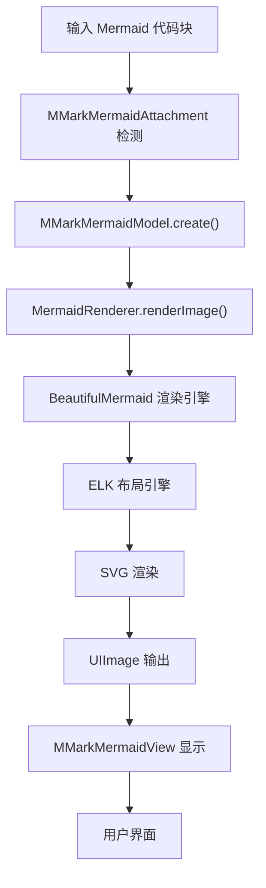

**图表来源**
- [MMarkMermaidModel.swift:95-129](file://MMarkParser/Sources/Renderer/Attachments/MMarkMermaidAttachment/MMarkMermaidModel.swift#L95-L129)
- [BeautifulMermaid.swift:17-26](file://MMarkParser/BeautifulMermaidSwift/BeautifulMermaid.swift#L17-L26)
- [MermaidParser.swift:25-52](file://MMarkParser/BeautifulMermaidSwift/MermaidParser.swift#L25-L52)

### Mermaid样式配置
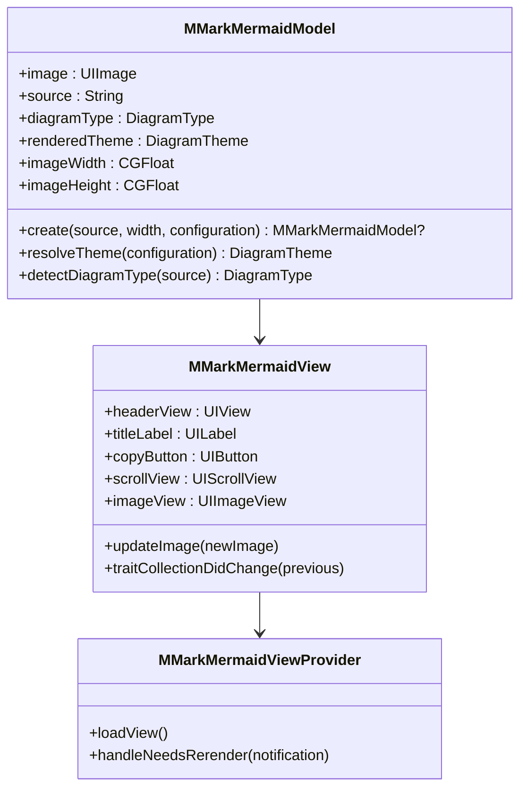

**图表来源**
- [MMarkMermaidModel.swift:21-29](file://MMarkParser/Sources/Renderer/Attachments/MMarkMermaidAttachment/MMarkMermaidModel.swift#L21-L29)
- [MMarkMermaidView.swift:33-43](file://MMarkParser/Sources/Renderer/Attachments/MMarkMermaidAttachment/MMarkMermaidView.swift#L33-L43)
- [MMarkMermaidViewProvider.swift:10-28](file://MMarkParser/Sources/Renderer/Attachments/MMarkMermaidAttachment/MMarkMermaidViewProvider.swift#L10-L28)

### Mermaid最佳实践
1. **图表类型检测**：自动检测图表类型，支持 flowchart、sequenceDiagram、classDiagram、erDiagram、stateDiagram、xyChart 六种类型
2. **暗黑模式支持**：自动检测系统主题，智能切换图表主题
3. **性能优化**：使用 UIScrollView 支持横向滚动，避免超宽图表影响布局
4. **交互功能**：提供图表源码复制功能
5. **样式定制**：支持内边距、圆角、头部高度、主题等全方位定制

**章节来源**
- [MMarkMermaidAttachment.swift:1-33](file://MMarkParser/Sources/Renderer/Attachments/MMarkMermaidAttachment/MMarkMermaidAttachment.swift#L1-L33)
- [MMarkMermaidModel.swift:1-130](file://MMarkParser/Sources/Renderer/Attachments/MMarkMermaidAttachment/MMarkMermaidModel.swift#L1-L130)
- [MMarkMermaidView.swift:1-178](file://MMarkParser/Sources/Renderer/Attachments/MMarkMermaidAttachment/MMarkMermaidView.swift#L1-L178)
- [MMarkMermaidViewProvider.swift:1-52](file://MMarkParser/Sources/Renderer/Attachments/MMarkMermaidAttachment/MMarkMermaidViewProvider.swift#L1-L52)
- [BeautifulMermaid.swift:1-185](file://MMarkParser/BeautifulMermaidSwift/BeautifulMermaid.swift#L1-L185)
- [MermaidParser.swift:1-54](file://MMarkParser/BeautifulMermaidSwift/MermaidParser.swift#L1-L54)
- [MermaidTypes.swift:1-317](file://MMarkParser/BeautifulMermaidSwift/MermaidTypes.swift#L1-L317)

## 依赖关系分析
- CocoaPods 规范声明了 iOS 15+、Swift 5.7+、UIKit/QuartzCore 框架，以及 md4c、iosMath、Kingfisher、ElkSwift 三方依赖。
- Mermaid图表渲染额外依赖 BeautifulMermaidSwift 库，提供完整的图表解析、布局和渲染能力。
- 示例工程通过 MMarkParser 提供的公共 API（parse/markdown 扩展）与渲染器（MMarkTextView/Stream）集成。

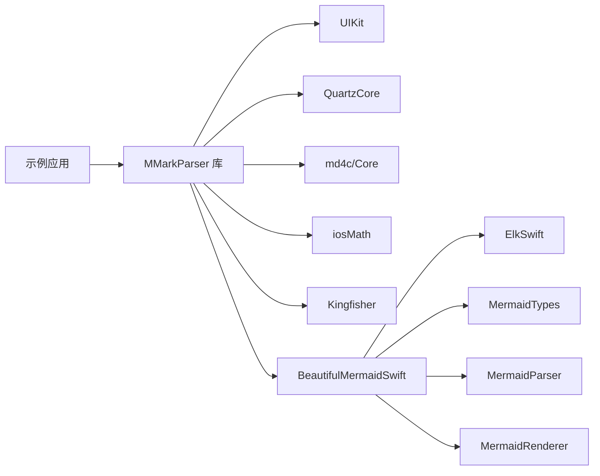

**图表来源**
- [MMarkParser.podspec:15-18](file://MMarkParser.podspec#L15-L18)
- [BeautifulMermaid.swift:1-11](file://MMarkParser/BeautifulMermaidSwift/BeautifulMermaid.swift#L1-L11)

**章节来源**
- [MMarkParser.podspec:1-19](file://MMarkParser.podspec#L1-L19)

## 性能考量
- 流式渲染
  - 使用定时器与固定 chunk 大小控制渲染节奏，避免主线程阻塞。
  - 长文档动态增大 chunk，维持流畅度。
  - 仅在必要时更新块引用竖条，避免重复绘制。
- Mermaid图表渲染
  - 图表渲染采用异步方式，避免阻塞主线程。
  - 使用 UIScrollView 支持横向滚动，避免超宽图表影响布局。
  - 暗黑模式切换时仅重新渲染受影响的图表。
- TextKit 2 优化
  - 优先使用 sizeThatFits 计算内容高度，避免触发 TextKit 1 桥接。
  - 在 iOS 16+ 使用 NSTextLayoutManager 的 enumerateTextLayoutFragments，减少遍历成本。
- 内存管理
  - 附件懒加载视图，按需创建，降低初始内存峰值。
  - Mermaid图表使用 UIImage 缓存，避免重复渲染。
  - 定时器与队列在销毁时取消，避免悬空引用。
- 建议
  - 大文档建议使用流式渲染，避免一次性解析与布局。
  - Mermaid图表较多时，考虑延迟加载策略。
  - 合理设置容器宽度，避免过宽导致测量与布局开销。
  - 自定义样式时尽量复用字体与颜色，减少属性差异带来的重绘。

**章节来源**
- [MMarkStreamTextView.swift:304-351](file://MMarkParser/Sources/Renderer/MMarkStreamTextView.swift#L304-L351)
- [MMarkTextCommon.swift:171-249](file://MMarkParser/Sources/Renderer/MMarkTextCommon.swift#L171-L249)
- [MMarkMermaidView.swift:146-153](file://MMarkParser/Sources/Renderer/Attachments/MMarkMermaidAttachment/MMarkMermaidView.swift#L146-L153)
- [MMarkMermaidViewProvider.swift:30-46](file://MMarkParser/Sources/Renderer/Attachments/MMarkMermaidAttachment/MMarkMermaidViewProvider.swift#L30-L46)

## 故障排除指南
- 链接无法打开或崩溃
  - 确认链接处理流程：先回调外部代理，再区分脚注/锚点/Web 链接。
  - 对于内部锚点，确保 fragment 编码正确，避免非法字符。
- 图片不显示
  - 检查网络与缓存（Kingfisher），确认占位符颜色配置合理。
- 数学公式渲染异常
  - 确认 KaTeX 字体已注册，或降级使用系统字体。
- 块引用竖条不显示
  - 确保 TextKit 2 布局完成后再绘制；避免重复绘制导致的递归。
- 流式渲染卡顿
  - 调整 typingSpeed 与 chunkSize；长文档可适当增大 chunk。
- Mermaid图表渲染失败
  - 检查 Mermaid 语法是否正确，确认图表类型支持情况。
  - 确认 BeautifulMermaidSwift 库正常加载，检查主题配置。
  - 避免在暗黑模式切换时频繁重渲染。
- CocoaPods 集成失败
  - 确认最低系统版本与 Swift 版本满足要求，依赖库可用。

**章节来源**
- [MMarkTextCommon.swift:48-129](file://MMarkParser/Sources/Renderer/MMarkTextCommon.swift#L48-L129)
- [MMarkParserWrapper.swift:709-799](file://MMarkParser/Sources/Parser/MMarkParserWrapper.swift#L709-L799)
- [MMarkStreamTextView.swift:304-351](file://MMarkParser/Sources/Renderer/MMarkStreamTextView.swift#L304-L351)
- [MMarkMermaidModel.swift:125-129](file://MMarkParser/Sources/Renderer/Attachments/MMarkMermaidAttachment/MMarkMermaidModel.swift#L125-L129)
- [MMarkMermaidViewProvider.swift:30-46](file://MMarkParser/Sources/Renderer/Attachments/MMarkMermaidAttachment/MMarkMermaidViewProvider.swift#L30-L46)
- [MMarkParser.podspec:9-13](file://MMarkParser.podspec#L9-L13)

## 结论
MMarkParser 提供了基于 TextKit 2 的高性能 Markdown 渲染方案，具备完善的 GFM 支持与灵活的样式定制能力。新增的 Mermaid图表渲染功能进一步扩展了文档可视化能力，支持多种图表类型的解析、布局和渲染。通过基础渲染与流式渲染两种模式，可覆盖从简单文章到长文档的广泛场景。结合本文的示例与最佳实践，开发者可快速集成并优化用户体验。

## 附录

### 快速开始（基础渲染）
- 导入库并解析 Markdown，设置到 MMarkTextView。
- 示例路径：[ViewController.swift:38-43](file://cocoapod_demo/cocoapod_demo/ViewController.swift#L38-L43)

**章节来源**
- [README.md:41-57](file://README.md#L41-L57)
- [ViewController.swift:1-46](file://cocoapod_demo/cocoapod_demo/ViewController.swift#L1-L46)

### 快速开始（流式渲染）
- 配置样式，设置流式渲染器，启动渲染并监听状态变化。
- 示例路径：[StreamViewController.swift:167-256](file://cocoapod_demo/cocoapod_demo/StreamViewController.swift#L167-L256)

**章节来源**
- [README.md:41-57](file://README.md#L41-L57)
- [StreamViewController.swift:1-279](file://cocoapod_demo/cocoapod_demo/StreamViewController.swift#L1-L279)

### 常见场景示例（路径指引）
- 博客文章显示
  - 使用 MMarkTextView，自定义标题与段落样式，启用链接回调。
  - 参考：[MMarkTextView.swift:1-81](file://MMarkParser/Sources/Renderer/MMarkTextView.swift#L1-L81)、[MMarkStyleConfiguration.swift:189-267](file://MMarkParser/Sources/Renderer/MMarkStyleConfiguration.swift#L189-L267)
- 聊天消息渲染
  - 使用 MMarkTextView，精简样式，突出正文与链接。
  - 参考：[MMarkTextView.swift:39-49](file://MMarkParser/Sources/Renderer/MMarkTextView.swift#L39-L49)
- 文档编辑预览
  - 使用 MMarkStreamTextView，设置合适的速度与 chunk，自动滚动到底部。
  - 参考：[MMarkStreamTextView.swift:34-41](file://MMarkParser/Sources/Renderer/MMarkStreamTextView.swift#L34-L41)、[StreamViewController.swift:208-232](file://cocoapod_demo/cocoapod_demo/StreamViewController.swift#L208-L232)
- 技术文档图表展示
  - 使用 Mermaid图表渲染，支持流程图、时序图、类图等多种图表类型。
  - 参考：[MMarkMermaidAttachment.swift:1-33](file://MMarkParser/Sources/Renderer/Attachments/MMarkMermaidAttachment/MMarkMermaidAttachment.swift#L1-L33)、[MMarkMermaidModel.swift:1-130](file://MMarkParser/Sources/Renderer/Attachments/MMarkMermaidAttachment/MMarkMermaidModel.swift#L1-L130)

### 样式定制要点
- 标题层级与段落间距：headingStyles、headingSpacingBefore、headingSpacing。
- 代码与代码块：codeStyle、codeBlockStyle、圆角与内边距。
- 链接与删除线：linkStyle、strikethroughColor。
- 块引用：blockquoteBorderColor、blockquoteBackgroundColor、blockquoteBorderWidth。
- 列表与任务列表：orderedListStyle、unorderedListStyle、taskListStyle。
- 表格：tableStyle（表头背景、边框、圆角）。
- 数学公式：mathInlineStyle、mathBlockStyle、mathBlockBackgroundColor、mathBlockCornerRadius。
- 脚注：footnoteReferenceStyle、footnoteStyle、footnoteBackrefColor。
- Mermaid图表：mermaidPadding、mermaidCornerRadius、mermaidHeaderHeight、mermaidHeaderBackgroundColor、mermaidBackgroundColor、mermaidTheme、mermaidAutoDarkMode。

**章节来源**
- [MMarkStyleConfiguration.swift:189-339](file://MMarkParser/Sources/Renderer/MMarkStyleConfiguration.swift#L189-L339)

### 数据流与渲染流程（代码级）
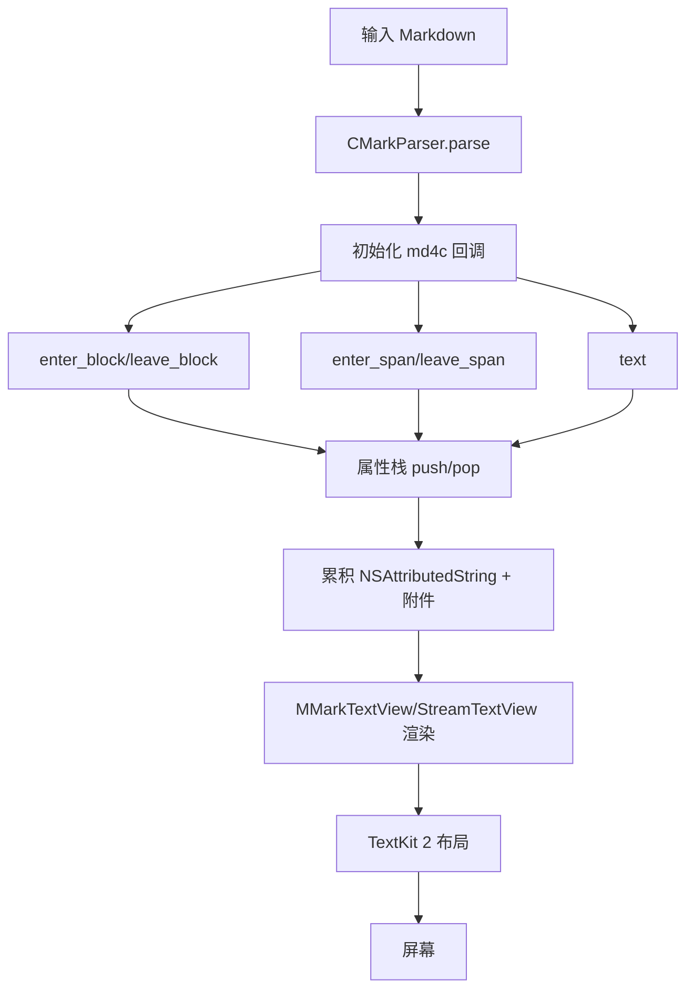

**图表来源**
- [CMarkParser.swift:55-66](file://MMarkParser/Sources/Parser/CMarkParser.swift#L55-L66)
- [MMarkParserWrapper.swift:134-644](file://MMarkParser/Sources/Parser/MMarkParserWrapper.swift#L134-L644)
- [MMarkTextView.swift:39-49](file://MMarkParser/Sources/Renderer/MMarkTextView.swift#L39-L49)
- [MMarkStreamTextView.swift:174-201](file://MMarkParser/Sources/Renderer/MMarkStreamTextView.swift#L174-L201)

### Mermaid渲染流程（代码级）
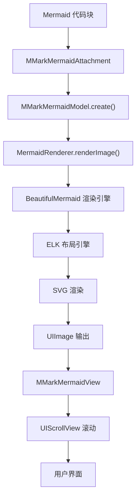

**图表来源**
- [MMarkMermaidAttachment.swift:18-21](file://MMarkParser/Sources/Renderer/Attachments/MMarkMermaidAttachment/MMarkMermaidAttachment.swift#L18-L21)
- [MMarkMermaidModel.swift:95-129](file://MMarkParser/Sources/Renderer/Attachments/MMarkMermaidAttachment/MMarkMermaidModel.swift#L95-L129)
- [BeautifulMermaid.swift:17-26](file://MMarkParser/BeautifulMermaidSwift/BeautifulMermaid.swift#L17-L26)
- [MermaidParser.swift:25-52](file://MMarkParser/BeautifulMermaidSwift/MermaidParser.swift#L25-L52)