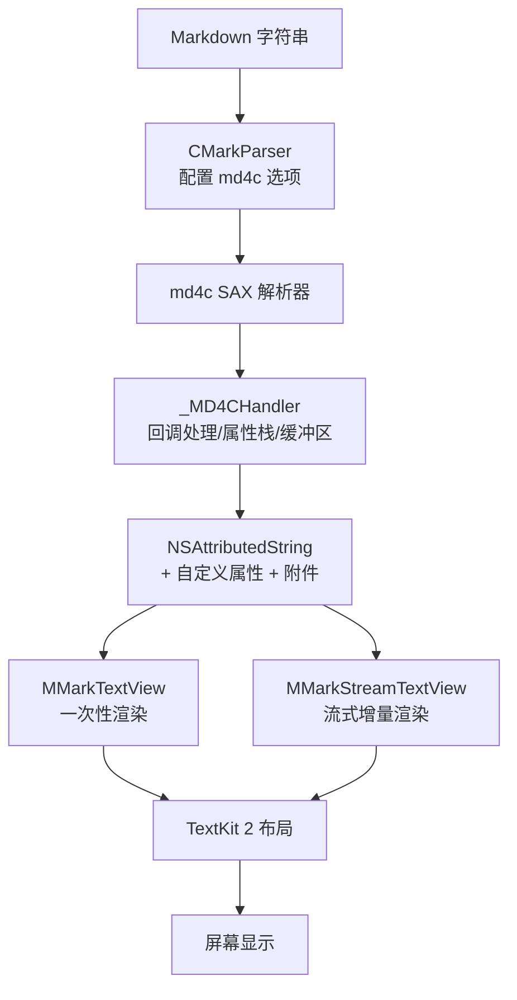
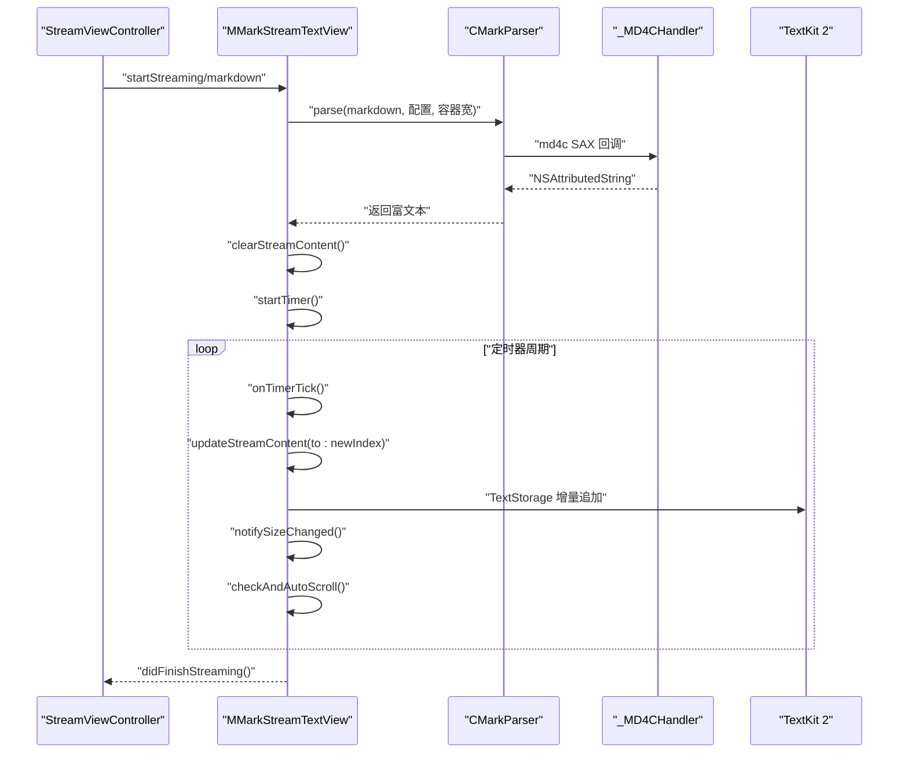
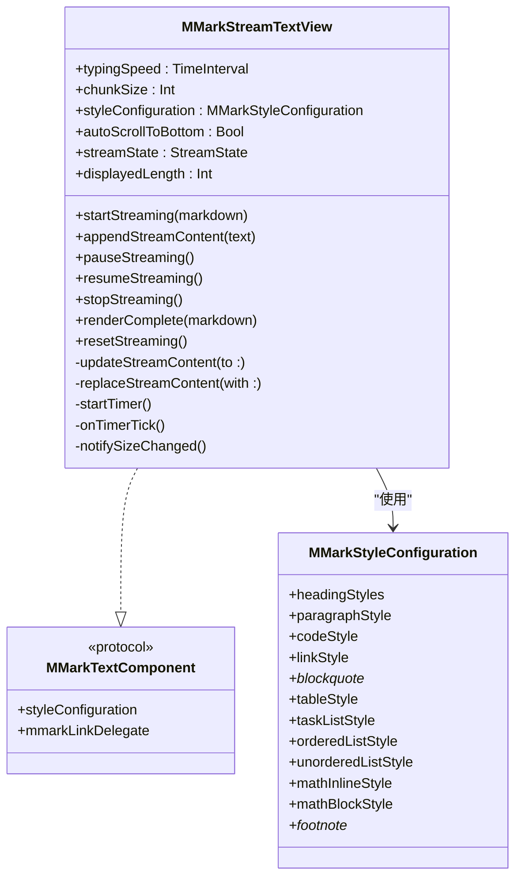
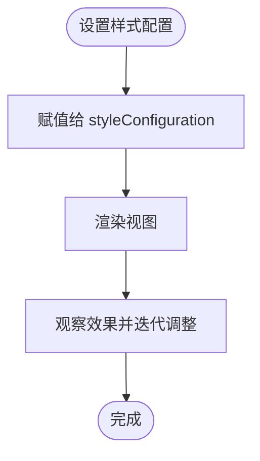
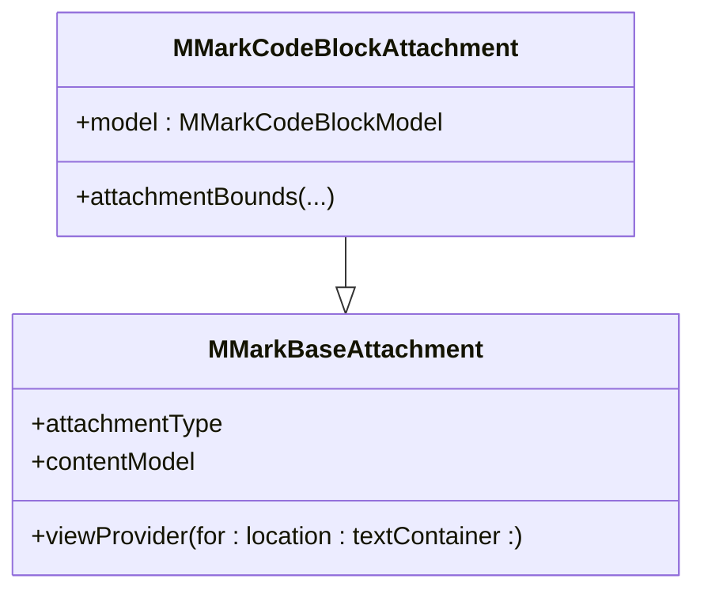
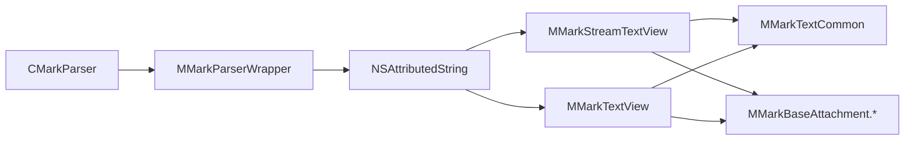

# 高级功能示例

<cite>
**本文引用的文件**
- [MMarkStreamTextView.swift](file://MMarkParser/Sources/Renderer/MMarkStreamTextView.swift)
- [MMarkTextView.swift](file://MMarkParser/Sources/Renderer/MMarkTextView.swift)
- [MMarkStyleConfiguration.swift](file://MMarkParser/Sources/Renderer/MMarkStyleConfiguration.swift)
- [MMarkTextCommon.swift](file://MMarkParser/Sources/Renderer/MMarkTextCommon.swift)
- [CMarkParser.swift](file://MMarkParser/Sources/Parser/CMarkParser.swift)
- [MMarkParserWrapper.swift](file://MMarkParser/Sources/Parser/MMarkParserWrapper.swift)
- [StreamViewController.swift](file://cocoapod_demo/cocoapod_demo/StreamViewController.swift)
- [SampleMarkdown.swift](file://cocoapod_demo/cocoapod_demo/SampleMarkdown.swift)
- [MMarkBaseAttachment.swift](file://MMarkParser/Sources/Renderer/Attachments/MMarkBaseAttachment/MMarkBaseAttachment.swift)
- [MMarkCodeBlockAttachment.swift](file://MMarkParser/Sources/Renderer/Attachments/MMarkCodeBlockAttachment/MMarkCodeBlockAttachment.swift)
- [README.md](file://README.md)
</cite>

## 目录
1. [简介](#简介)
2. [项目结构](#项目结构)
3. [核心组件](#核心组件)
4. [架构总览](#架构总览)
5. [详细组件分析](#详细组件分析)
6. [依赖关系分析](#依赖关系分析)
7. [性能考量](#性能考量)
8. [故障排查指南](#故障排查指南)
9. [结论](#结论)
10. [附录](#附录)

## 简介
本文件面向希望在iOS应用中实现“流式渲染”Markdown的开发者，围绕 MMarkParser 的 MMarkStreamTextView 提供高级功能示例与最佳实践。内容涵盖：
- 流式渲染的实现原理与使用方法
- 大型文档的性能优化与内存管理策略
- 丰富内容（表格、代码块、数学公式、图片等）的渲染示例
- 高级配置选项（自定义样式、主题切换、交互处理）
- 实际项目中的使用案例与落地建议

## 项目结构
MMarkParser 采用“解析器 + 渲染器 + 附件视图”的分层架构，配合 TextKit 2 的附件机制实现高性能富文本渲染。核心目录与职责概览：
- Parser：基于 md4c 的 SAX 解析器，负责增量构建 NSAttributedString，并维护属性栈与缓冲区（表格、代码块、脚注等）
- Renderer：MMarkTextView 与 MMarkStreamTextView 两类显示控件，前者一次性渲染，后者支持流式增量渲染
- Attachments：各类复杂元素（代码块、表格、图片、水平分割线、数学公式、列表标记）的模型与视图提供者

图表来源
- [README.md:108-181](file://README.md#L108-L181)
- [CMarkParser.swift:55-66](file://MMarkParser/Sources/Parser/CMarkParser.swift#L55-L66)
- [MMarkParserWrapper.swift:134-644](file://MMarkParser/Sources/Parser/MMarkParserWrapper.swift#L134-L644)

章节来源
- [README.md:108-212](file://README.md#L108-L212)

## 核心组件
- MMarkStreamTextView：支持定时器驱动的增量渲染，具备开始/暂停/恢复/停止/重置等状态控制，适配超长文档的流畅体验
- MMarkTextView：一次性渲染，适合中短文档或静态内容
- MMarkStyleConfiguration：统一的样式配置入口，覆盖标题、段落、代码、链接、块引用、表格、任务列表、数学公式、脚注等
- MMarkTextCommon：统一的链接处理、块引用竖条绘制、附件视图注册等公共能力
- CMarkParser 与 MMarkParserWrapper：解析器与回调处理器，负责将 Markdown 转换为富文本

章节来源
- [MMarkStreamTextView.swift:21-387](file://MMarkParser/Sources/Renderer/MMarkStreamTextView.swift#L21-L387)
- [MMarkTextView.swift:6-81](file://MMarkParser/Sources/Renderer/MMarkTextView.swift#L6-L81)
- [MMarkStyleConfiguration.swift:11-339](file://MMarkParser/Sources/Renderer/MMarkStyleConfiguration.swift#L11-L339)
- [MMarkTextCommon.swift:39-290](file://MMarkParser/Sources/Renderer/MMarkTextCommon.swift#L39-L290)
- [CMarkParser.swift:7-67](file://MMarkParser/Sources/Parser/CMarkParser.swift#L7-L67)
- [MMarkParserWrapper.swift:18-644](file://MMarkParser/Sources/Parser/MMarkParserWrapper.swift#L18-L644)

## 架构总览
下面的序列图展示了从 Markdown 输入到屏幕渲染的关键流程，重点体现流式渲染的增量更新与主线程安全：

图表来源
- [StreamViewController.swift:208-232](file://cocoapod_demo/cocoapod_demo/StreamViewController.swift#L208-L232)
- [MMarkStreamTextView.swift:174-351](file://MMarkParser/Sources/Renderer/MMarkStreamTextView.swift#L174-L351)
- [CMarkParser.swift:55-66](file://MMarkParser/Sources/Parser/CMarkParser.swift#L55-L66)
- [MMarkParserWrapper.swift:134-644](file://MMarkParser/Sources/Parser/MMarkParserWrapper.swift#L134-L644)

## 详细组件分析

### MMarkStreamTextView 流式渲染详解
- 状态机：idle → streaming → paused → stopped，支持动态切换
- 关键参数：
  - typingSpeed：定时器节拍，影响“打字”速率
  - chunkSize：每次增量插入的字符数量，支持动态放大
  - styleConfiguration：样式配置
  - autoScrollToBottom：自动滚动到底部
- 增量更新策略：
  - TextKit 2 路径：通过 TextContentStorage.performEditingTransaction 增量追加
  - TextKit 1 回退：beginEditing/endEditing 包裹 append
- 定时器与节流：
  - 基于 DispatchSourceTimer 的用户交互优先级队列
  - 当显示长度超过阈值时自动增大 chunk，保持视觉流畅
- 尺寸通知：通过 sizeThatFits 计算高度，避免触发 TextKit 1 桥接
- 链接与块引用竖条：委托 UITextViewDelegate 并复用公共逻辑

图表来源
- [MMarkStreamTextView.swift:21-387](file://MMarkParser/Sources/Renderer/MMarkStreamTextView.swift#L21-L387)
- [MMarkTextCommon.swift:39-36](file://MMarkParser/Sources/Renderer/MMarkTextCommon.swift#L39-L36)

章节来源
- [MMarkStreamTextView.swift:21-387](file://MMarkParser/Sources/Renderer/MMarkStreamTextView.swift#L21-L387)
- [MMarkTextCommon.swift:39-36](file://MMarkParser/Sources/Renderer/MMarkTextCommon.swift#L39-L36)

### MMarkTextView 一次性渲染
- 适合中短文档或静态内容
- 自动监听 contentSize 变化并更新块引用竖条
- 链接处理与块引用竖条绘制复用公共逻辑

章节来源
- [MMarkTextView.swift:6-81](file://MMarkParser/Sources/Renderer/MMarkTextView.swift#L6-L81)
- [MMarkTextCommon.swift:75-81](file://MMarkParser/Sources/Renderer/MMarkTextCommon.swift#L75-L81)

### 样式配置与主题切换
- MMarkStyleConfiguration 提供统一入口，覆盖标题、段落、代码、链接、块引用、表格、任务列表、数学公式、脚注等
- 支持字体、颜色、间距、圆角、内边距等细粒度定制
- 示例：演示控制器中对有序列表、无序列表、任务列表样式的自定义

图表来源
- [MMarkStyleConfiguration.swift:11-339](file://MMarkParser/Sources/Renderer/MMarkStyleConfiguration.swift#L11-L339)
- [StreamViewController.swift:169-184](file://cocoapod_demo/cocoapod_demo/StreamViewController.swift#L169-L184)

章节来源
- [MMarkStyleConfiguration.swift:11-339](file://MMarkParser/Sources/Renderer/MMarkStyleConfiguration.swift#L11-L339)
- [StreamViewController.swift:169-184](file://cocoapod_demo/cocoapod_demo/StreamViewController.swift#L169-L184)

### 附件与复杂元素渲染
- 附件类型：代码块、水平分割线、图片、列表标记、数学公式、表格
- 通过 MMarkBaseAttachment 的 viewProvider 分发到具体 ViewProvider，实现懒加载与 TextKit 2 附件机制
- 代码块附件根据容器宽度与模型尺寸约束布局，避免溢出

图表来源
- [MMarkBaseAttachment.swift:12-58](file://MMarkParser/Sources/Renderer/Attachments/MMarkBaseAttachment/MMarkBaseAttachment.swift#L12-L58)
- [MMarkCodeBlockAttachment.swift:6-21](file://MMarkParser/Sources/Renderer/Attachments/MMarkCodeBlockAttachment/MMarkCodeBlockAttachment.swift#L6-L21)

章节来源
- [MMarkBaseAttachment.swift:12-58](file://MMarkParser/Sources/Renderer/Attachments/MMarkBaseAttachment/MMarkBaseAttachment.swift#L12-L58)
- [MMarkCodeBlockAttachment.swift:6-21](file://MMarkParser/Sources/Renderer/Attachments/MMarkCodeBlockAttachment/MMarkCodeBlockAttachment.swift#L6-L21)

### 链接与锚点处理
- 优先回调外部 MMarkLinkDelegate，允许业务接管
- 内部处理脚注与锚点跳转：通过 footnote:// 与 fragment 定位，滚动到可见区域
- 对 URL 进行百分号编码，避免桥接层崩溃

章节来源
- [MMarkTextCommon.swift:48-129](file://MMarkParser/Sources/Renderer/MMarkTextCommon.swift#L48-L129)

## 依赖关系分析
- 解析层：CMarkParser 依赖 md4c 的 SAX 回调，MMarkParserWrapper 负责属性栈与缓冲区管理
- 渲染层：MMarkTextView/StreamTextView 依赖 TextKit 2 附件机制与公共工具
- 附件层：MMarkBaseAttachment 根据类型分发到具体 ViewProvider

图表来源
- [CMarkParser.swift:55-66](file://MMarkParser/Sources/Parser/CMarkParser.swift#L55-L66)
- [MMarkParserWrapper.swift:134-644](file://MMarkParser/Sources/Parser/MMarkParserWrapper.swift#L134-L644)
- [MMarkTextView.swift:40-49](file://MMarkParser/Sources/Renderer/MMarkTextView.swift#L40-L49)
- [MMarkStreamTextView.swift:183-200](file://MMarkParser/Sources/Renderer/MMarkStreamTextView.swift#L183-L200)
- [MMarkTextCommon.swift:44-46](file://MMarkParser/Sources/Renderer/MMarkTextCommon.swift#L44-L46)
- [MMarkBaseAttachment.swift:32-58](file://MMarkParser/Sources/Renderer/Attachments/MMarkBaseAttachment/MMarkBaseAttachment.swift#L32-L58)

章节来源
- [README.md:182-212](file://README.md#L182-L212)

## 性能考量
- 流式渲染的节拍与增量大小
  - typingSpeed 控制定时器节拍，chunkSize 控制每次插入字符数
  - 超长文档（阈值以上）自动增大 chunk，维持视觉流畅
- 主线程与后台队列
  - 解析在后台队列执行，UI 更新回到主线程，避免数据竞争
- TextKit 2 优化
  - 优先使用 TextContentStorage.performEditingTransaction 增量更新
  - 通过 sizeThatFits 计算高度，避免触发 TextKit 1 桥接
- 内存管理
  - 仅维护 fullAttrString 与 displayIndex，避免重复拼接
  - 增量更新时仅追加 delta，停止/重置时清理定时器与内容

章节来源
- [MMarkStreamTextView.swift:304-351](file://MMarkParser/Sources/Renderer/MMarkStreamTextView.swift#L304-L351)
- [MMarkStreamTextView.swift:113-156](file://MMarkParser/Sources/Renderer/MMarkStreamTextView.swift#L113-L156)
- [MMarkStreamTextView.swift:365-379](file://MMarkParser/Sources/Renderer/MMarkStreamTextView.swift#L365-L379)

## 故障排查指南
- 链接无法打开或崩溃
  - 检查 MMarkLinkDelegate 返回值与 URL 编码
  - 确认内部锚点与脚注跳转逻辑
- 块引用竖条不显示
  - 确认已注册附件视图提供者
  - 检查 contentSize 变化是否触发更新
- 图片不显示或占位异常
  - 确认网络可达与占位颜色配置
  - 注意图片在列表/块引用中的段落样式设置
- 数学公式渲染异常
  - 确认 KaTeX 字体资源与 iosMath 配置
- 性能问题
  - 调整 typingSpeed 与 chunkSize
  - 大文档建议使用流式渲染并关闭自动滚动至底部

章节来源
- [MMarkTextCommon.swift:48-129](file://MMarkParser/Sources/Renderer/MMarkTextCommon.swift#L48-L129)
- [MMarkTextView.swift:75-80](file://MMarkParser/Sources/Renderer/MMarkTextView.swift#L75-L80)
- [MMarkStyleConfiguration.swift:189-267](file://MMarkParser/Sources/Renderer/MMarkStyleConfiguration.swift#L189-L267)

## 结论
MMarkStreamTextView 提供了面向超长文档的流式渲染能力，结合合理的节拍与增量策略、TextKit 2 附件机制与公共工具，能够在保证性能的同时呈现丰富的 Markdown 内容。通过 MMarkStyleConfiguration 与附件体系，开发者可以灵活定制样式与交互，满足多样化的业务需求。

## 附录

### 使用案例与最佳实践
- 流式渲染典型场景
  - 日志/聊天消息实时追加
  - 大纲/教程文档逐步加载
  - 预览与编辑联动（增量刷新）
- 最佳实践
  - 针对超长文档启用流式渲染并合理设置 typingSpeed 与 chunkSize
  - 在业务层实现 MMarkLinkDelegate，统一处理外链与内部锚点
  - 使用 MMarkStyleConfiguration 统一主题风格，必要时按页面动态切换
  - 大图与长代码块注意容器宽度与滚动策略
  - 定时器与 UI 更新需在主线程执行，避免竞态

章节来源
- [StreamViewController.swift:208-232](file://cocoapod_demo/cocoapod_demo/StreamViewController.swift#L208-L232)
- [SampleMarkdown.swift:3-760](file://cocoapod_demo/cocoapod_demo/SampleMarkdown.swift#L3-L760)