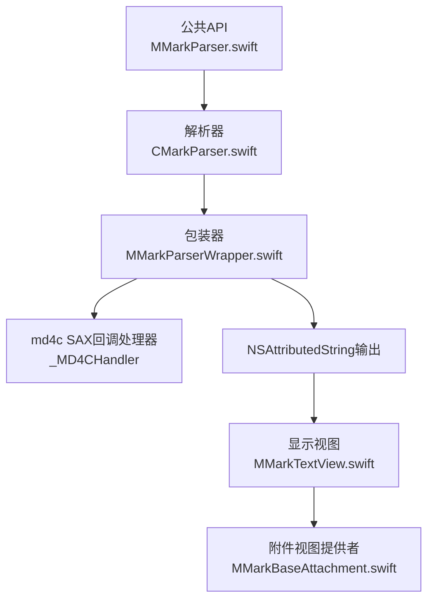
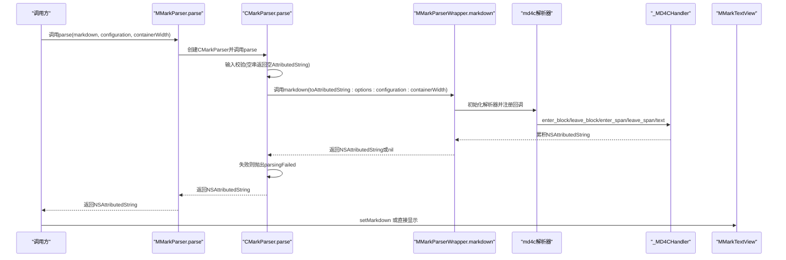
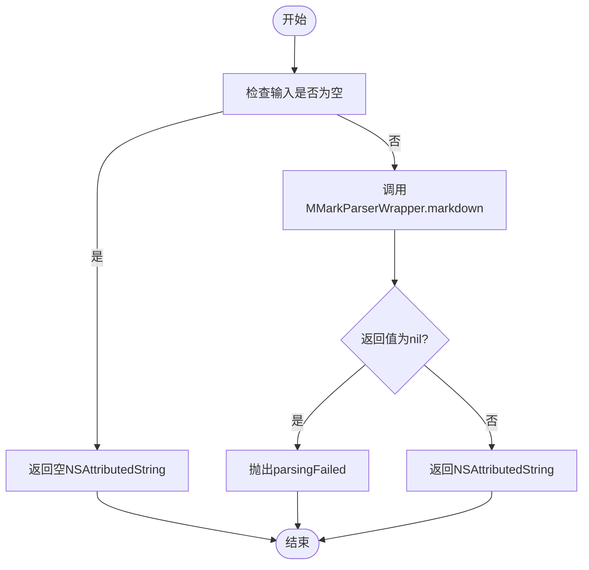
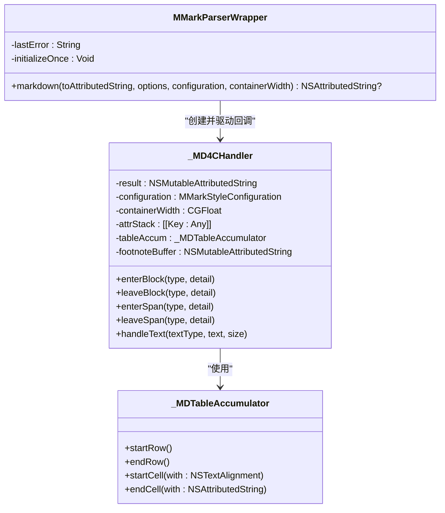
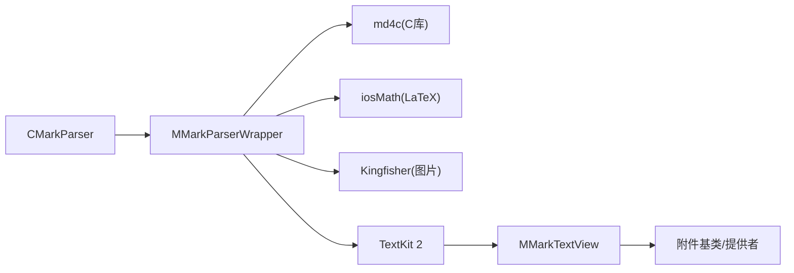

# CMarkParser核心解析器

<cite>
**本文档引用的文件**
- [CMarkParser.swift](file://MMarkParser/Sources/Parser/CMarkParser.swift)
- [MMarkParserWrapper.swift](file://MMarkParser/Sources/Parser/MMarkParserWrapper.swift)
- [MMarkParser.swift](file://MMarkParser/Sources/MMarkParser.swift)
- [MMarkStyleConfiguration.swift](file://MMarkParser/Sources/Renderer/MMarkStyleConfiguration.swift)
- [MMarkTextView.swift](file://MMarkParser/Sources/Renderer/MMarkTextView.swift)
- [MMarkBaseAttachment.swift](file://MMarkParser/Sources/Renderer/Attachments/MMarkBaseAttachment/MMarkBaseAttachment.swift)
- [README.md](file://README.md)
</cite>

## 目录
1. [简介](#简介)
2. [项目结构](#项目结构)
3. [核心组件](#核心组件)
4. [架构总览](#架构总览)
5. [详细组件分析](#详细组件分析)
6. [依赖关系分析](#依赖关系分析)
7. [性能考量](#性能考量)
8. [故障排查指南](#故障排查指南)
9. [结论](#结论)
10. [附录：使用示例与最佳实践](#附录使用示例与最佳实践)

## 简介
本文件面向CMarkParser核心解析器，系统性阐述其基于md4c SAX回调API的Markdown解析架构与实现细节。重点包括：
- CMarkParser类的设计与职责边界
- ParseOptions选项集与GFM扩展标志位的语义与组合方式
- parse方法从输入校验到调用MMarkParserWrapper的完整流程
- 错误类型invalidInput、parsingFailed、styleConversionFailed的触发条件与处理策略
- Sendable协议实现与线程安全设计
- 实际使用示例与最佳实践

## 项目结构
该模块位于MMarkParser工程的Parser目录，核心文件如下：
- Parser/CMarkParser.swift：对外公开的解析器入口，封装md4c选项与错误类型
- Parser/MMarkParserWrapper.swift：md4c SAX回调处理器与最终NSAttributedString构建器
- MMarkParser.swift：公共API入口，提供静态方法与字符串扩展
- Renderer/MMarkStyleConfiguration.swift：样式配置模型，影响渲染结果
- Renderer/MMarkTextView.swift：基于TextKit 2的显示视图，集成链接点击与引用块竖条绘制
- Renderer/Attachments/MMarkBaseAttachment/MMarkBaseAttachment.swift：附件基类与视图提供者映射

图表来源
- [MMarkParser.swift:11-26](file://MMarkParser/Sources/MMarkParser.swift#L11-L26)
- [CMarkParser.swift:55-66](file://MMarkParser/Sources/Parser/CMarkParser.swift#L55-L66)
- [MMarkParserWrapper.swift:1374-1444](file://MMarkParser/Sources/Parser/MMarkParserWrapper.swift#L1374-L1444)

章节来源
- [README.md:108-156](file://README.md#L108-L156)

## 核心组件
- CMarkParser：对外暴露ParseOptions与parse方法，负责输入校验与调用MMarkParserWrapper，并将错误转换为统一的ParseError枚举。
- MMarkParserWrapper：持有_md4cHandler，初始化md4c解析器并注册回调函数，完成从Markdown到NSAttributedString的增量构建。
- _MD4CHandler：md4c SAX回调的具体实现，维护属性栈、上下文状态、表格/代码/脚注/数学等累积缓冲区，最终生成NSAttributedString。
- MMarkStyleConfiguration：样式配置模型，控制字体、颜色、间距、附件渲染等。
- MMarkTextView：TextKit 2视图，承载NSAttributedString并绘制引用块竖条、处理链接点击。

章节来源
- [CMarkParser.swift:7-67](file://MMarkParser/Sources/Parser/CMarkParser.swift#L7-L67)
- [MMarkParserWrapper.swift:1376-1444](file://MMarkParser/Sources/Parser/MMarkParserWrapper.swift#L1376-L1444)
- [MMarkStyleConfiguration.swift:11-200](file://MMarkParser/Sources/Renderer/MMarkStyleConfiguration.swift#L11-L200)
- [MMarkTextView.swift:6-81](file://MMarkParser/Sources/Renderer/MMarkTextView.swift#L6-L81)

## 架构总览
CMarkParser通过ParseOptions将GFM扩展标志位传递给MMarkParserWrapper，后者在md4c SAX回调期间逐步构建NSAttributedString。渲染阶段由MMarkTextView消费NSAttributedString并绘制引用块竖条与附件视图。

图表来源
- [MMarkParser.swift:19-26](file://MMarkParser/Sources/MMarkParser.swift#L19-L26)
- [CMarkParser.swift:55-66](file://MMarkParser/Sources/Parser/CMarkParser.swift#L55-L66)
- [MMarkParserWrapper.swift:1392-1444](file://MMarkParser/Sources/Parser/MMarkParserWrapper.swift#L1392-L1444)

## 详细组件分析

### CMarkParser类与ParseOptions
- 设计要点
  - ParseOptions采用OptionSet，rawValue为UInt32，兼容md4c的flags。
  - 提供默认值.default与.gfm聚合，便于快速启用GFM扩展。
  - 支持的GFM扩展标志位：
    - table：表格
    - strikethrough：删除线
    - taskLists：任务列表
    - autolinks：宽松自动链接（URL、邮箱、www）
    - latexMath：LaTeX数学行内/块级
    - footnotes：脚注
    - hardBreaks：硬换行
  - 线程安全：@unchecked Sendable，内部状态为栈局部变量，无共享可变状态。

- 错误类型
  - invalidInput：输入为空字符串时返回空NSAttributedString，不抛错。
  - parsingFailed：MMarkParserWrapper返回nil时抛出。
  - styleConversionFailed：当前实现未显式抛出此错误；如需自定义样式转换失败，可在调用方自行捕获并处理。

- parse方法流程
  - 输入校验：空串直接返回空NSAttributedString。
  - 调用MMarkParserWrapper.markdown，传入options.rawValue、configuration与containerWidth。
  - 若返回nil，抛出parsingFailed；否则返回结果。

图表来源
- [CMarkParser.swift:55-66](file://MMarkParser/Sources/Parser/CMarkParser.swift#L55-L66)
- [MMarkParserWrapper.swift:1398-1432](file://MMarkParser/Sources/Parser/MMarkParserWrapper.swift#L1398-L1432)

章节来源
- [CMarkParser.swift:7-67](file://MMarkParser/Sources/Parser/CMarkParser.swift#L7-L67)
- [CMarkParser.swift:69-81](file://MMarkParser/Sources/Parser/CMarkParser.swift#L69-L81)

### MMarkParserWrapper与_md4cHandler
- 初始化与回调注册
  - 创建_md4cHandler实例，保存configuration与containerWidth。
  - 使用MD_PARSER结构体注册回调函数指针：enter_block、leave_block、enter_span、leave_span、text。
  - 通过utf8缓冲区调用md_parse执行解析。

- 属性栈与上下文管理
  - pushAttrs/popAttrs维护嵌套块/内联元素的属性继承。
  - 维护blockquoteDepth、listDepth、currentIndent、orderedListItemCounters等上下文状态，确保列表与引用块缩进正确。

- 特殊元素处理
  - 表格：_MDTableAccumulator按行收集表头与数据，最终生成MMarkTableAttachment。
  - 代码块：进入MD_BLOCK_CODE时开启累积，离开时生成MMarkCodeBlockAttachment。
  - 数学：LaTeX行内/块级通过iosMath渲染为图片或附件。
  - 脚注：脚注定义与引用分别处理，最终在文档末尾拼接脚注区。

- 错误处理
  - md_parse返回非0时记录lastError并返回nil。
  - 解析成功后清空lastError。

图表来源
- [MMarkParserWrapper.swift:1376-1444](file://MMarkParser/Sources/Parser/MMarkParserWrapper.swift#L1376-L1444)
- [MMarkParserWrapper.swift:18-1266](file://MMarkParser/Sources/Parser/MMarkParserWrapper.swift#L18-L1266)
- [MMarkParserWrapper.swift:1272-1315](file://MMarkParser/Sources/Parser/MMarkParserWrapper.swift#L1272-L1315)

章节来源
- [MMarkParserWrapper.swift:1376-1444](file://MMarkParser/Sources/Parser/MMarkParserWrapper.swift#L1376-L1444)
- [MMarkParserWrapper.swift:18-1266](file://MMarkParser/Sources/Parser/MMarkParserWrapper.swift#L18-L1266)

### 样式配置与渲染管线
- MMarkStyleConfiguration提供全面的样式参数，包括标题、段落、代码、链接、引用块、表格、任务列表、数学、脚注等。
- MMarkTextView基于TextKit 2渲染NSAttributedString，绘制引用块竖条并通过附件视图提供者加载复杂元素（代码块、图片、表格、数学、水平分割线、列表标记）。

章节来源
- [MMarkStyleConfiguration.swift:11-200](file://MMarkParser/Sources/Renderer/MMarkStyleConfiguration.swift#L11-L200)
- [MMarkTextView.swift:6-81](file://MMarkParser/Sources/Renderer/MMarkTextView.swift#L6-L81)
- [MMarkBaseAttachment.swift:12-58](file://MMarkParser/Sources/Renderer/Attachments/MMarkBaseAttachment/MMarkBaseAttachment.swift#L12-L58)

## 依赖关系分析
- CMarkParser依赖MMarkParserWrapper进行实际解析。
- MMarkParserWrapper依赖md4c（C库）与iosMath（LaTeX渲染）、Kingfisher（图片加载）。
- 渲染阶段依赖UIKit与TextKit 2，附件通过NSTextAttachmentViewProvider延迟创建视图。

图表来源
- [README.md:36-40](file://README.md#L36-L40)
- [MMarkParserWrapper.swift:1376-1444](file://MMarkParser/Sources/Parser/MMarkParserWrapper.swift#L1376-L1444)

## 性能考量
- SAX回调驱动的增量构建避免了AST内存占用，适合大文档流式处理。
- 附件视图按需懒加载，减少初始布局开销。
- 宽度计算与最小有效宽度保护，避免深嵌套导致的负尺寸问题。
- 列表紧致模式(tight)与换行策略减少多余空白字符，提升渲染效率。

## 故障排查指南
- invalidInput
  - 触发条件：输入为空字符串。
  - 处理策略：直接返回空NSAttributedString，不抛异常。
- parsingFailed
  - 触发条件：mm_parse返回非0，或MMarkParserWrapper返回nil。
  - 处理策略：捕获ParseError.parsingFailed，记录lastError并回退显示原始Markdown或提示用户。
- styleConversionFailed
  - 当前实现：未显式抛出。
  - 建议：在自定义样式转换逻辑中显式抛错并捕获，以便定位具体样式配置问题。

章节来源
- [CMarkParser.swift:8-12](file://MMarkParser/Sources/Parser/CMarkParser.swift#L8-L12)
- [CMarkParser.swift:55-66](file://MMarkParser/Sources/Parser/CMarkParser.swift#L55-L66)
- [MMarkParserWrapper.swift:1427-1432](file://MMarkParser/Sources/Parser/MMarkParserWrapper.swift#L1427-L1432)

## 结论
CMarkParser以简洁的OptionSet封装md4c GFM扩展，结合MMarkParserWrapper的SAX回调处理器，实现了高性能、可扩展的Markdown解析与渲染。通过Sendable与不可变配置，保证了线程安全与可复用性。配合MMarkTextView与附件体系，形成从解析到显示的一体化解决方案。

## 附录：使用示例与最佳实践
- 基本用法
  - 使用公共API：调用MMarkParser.parse或String.parseMarkdown。
  - 自定义样式：通过MMarkStyleConfiguration调整字体、颜色、间距与附件外观。
- 最佳实践
  - 合理选择ParseOptions：仅启用需要的GFM扩展，减少解析负担。
  - 控制容器宽度：传入合理的containerWidth，确保表格与代码块正确换行。
  - 错误处理：捕获ParseError并提供降级显示（如回退到原始Markdown）。
  - 性能优化：大文档建议分页或流式渲染，避免一次性解析超长内容。

章节来源
- [README.md:41-85](file://README.md#L41-L85)
- [MMarkParser.swift:19-41](file://MMarkParser/Sources/MMarkParser.swift#L19-L41)