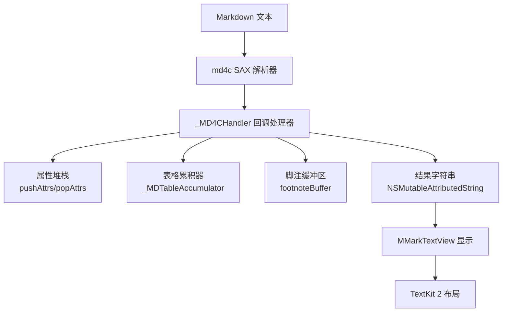
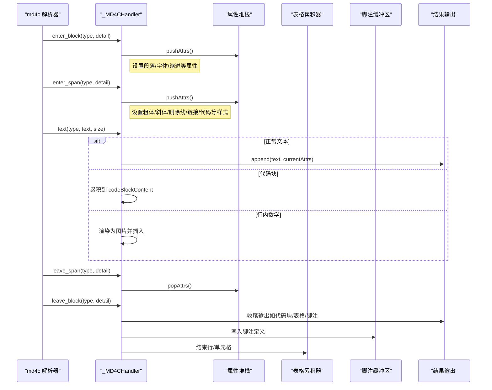
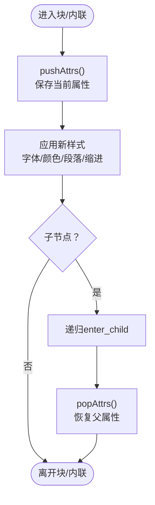
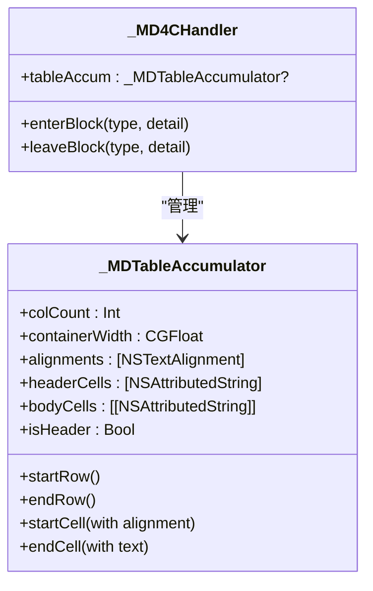
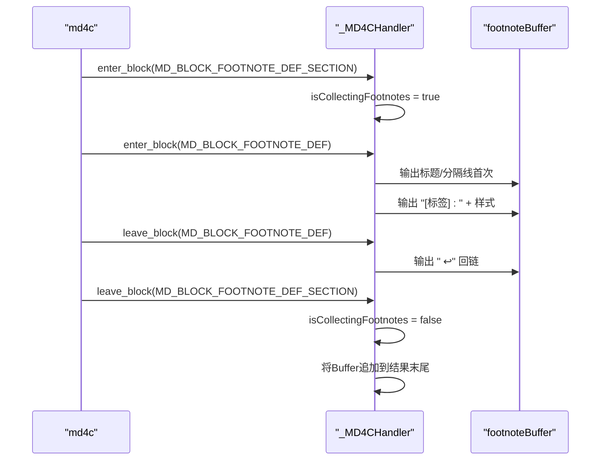
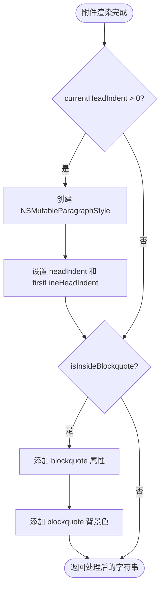
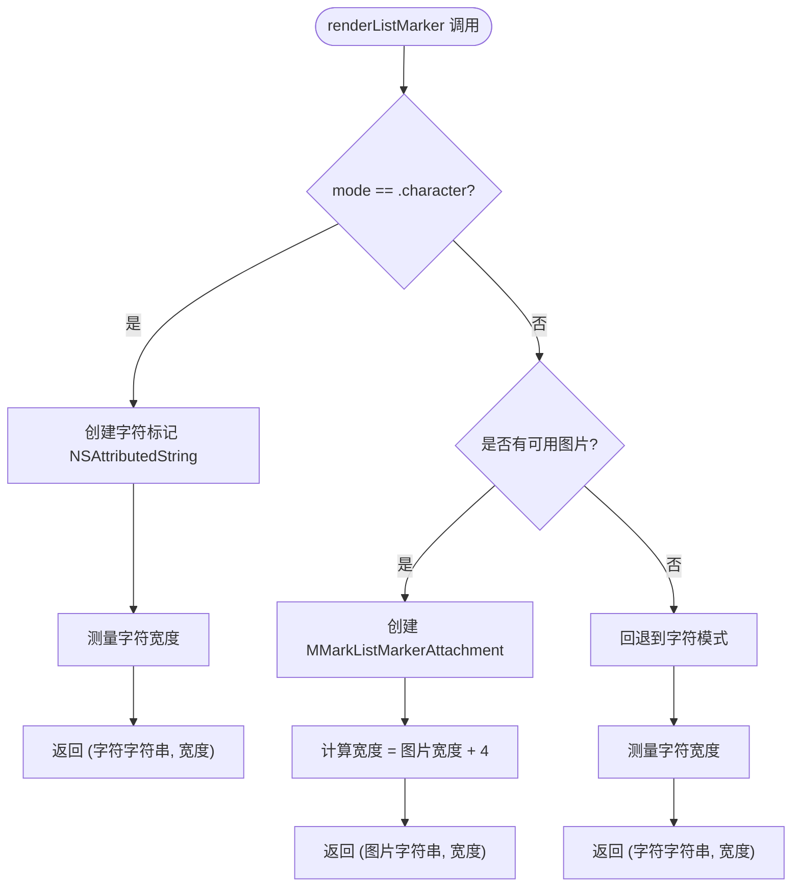
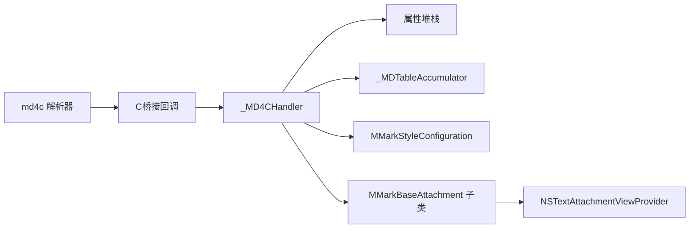

# MMarkParserWrapper回调处理器

<cite>
**本文档引用的文件**
- [MMarkParserWrapper.swift](file://MMarkParser/Parser/MMarkParserWrapper.swift)
- [MMarkStyleConfiguration.swift](file://MMarkParser/Renderer/MMarkStyleConfiguration.swift)
- [MMarkBaseAttachment.swift](file://MMarkParser/Renderer/Attachments/MMarkBaseAttachment/MMarkBaseAttachment.swift)
- [MMarkCodeBlockAttachment.swift](file://MMarkParser/Renderer/Attachments/MMarkCodeBlockAttachment/MMarkCodeBlockAttachment.swift)
- [MMarkHorizontalRuleAttachment.swift](file://MMarkParser/Renderer/Attachments/MMarkHorizontalRuleAttachment/MMarkHorizontalRuleAttachment.swift)
- [README.md](file://README.md)
</cite>

## 更新摘要
**变更内容**
- 提取了 `applyAttachmentAttributes()` 辅助方法，专门处理附件的缩进和blockquote属性应用
- 提取了 `renderListMarker()` 辅助方法，统一处理列表标记的字符和图片渲染逻辑
- 新增了布局常量定义，提升代码组织性和可维护性
- 重构保持了完整的功能兼容性，所有回调处理器功能正常工作

## 目录
1. [简介](#简介)
2. [项目结构](#项目结构)
3. [核心组件](#核心组件)
4. [架构总览](#架构总览)
5. [详细组件分析](#详细组件分析)
6. [依赖关系分析](#依赖关系分析)
7. [性能考量](#性能考量)
8. [故障排查指南](#故障排查指南)
9. [结论](#结论)
10. [附录](#附录)

## 简介
本文件面向MMarkParserWrapper回调处理器的实现进行深入技术文档化，围绕约1100行的md4c SAX回调处理器展开，重点解释以下方面：
- enter_block、leave_block、enter_span、leave_span、text等回调函数的职责与实现机制
- 属性堆栈（attributeStack）如何在嵌套结构中正确传播与管理样式上下文
- 表格累积机制、脚注处理流程、代码缓冲区管理等特殊功能
- 如何将md4c的回调事件转换为NSAttributedString的属性与内容
- 错误处理策略与性能优化技巧
- 回调函数的调用顺序、参数传递与返回值处理
- 提供具体代码示例路径与调试技巧

## 项目结构
该模块位于Parser目录下，作为md4c SAX回调的驱动者，负责在解析过程中增量构建NSAttributedString，并通过NSTextAttachment渲染复杂元素（如代码块、表格、图片、水平分割线、数学公式等）。样式配置由MMarkStyleConfiguration集中管理，附件类通过MMarkBaseAttachment及其子类完成视图提供与布局。

图表来源
- [MMarkParserWrapper.swift:1319-1370](file://MMarkParser/Parser/MMarkParserWrapper.swift#L1319-L1370)
- [MMarkParserWrapper.swift:1376-1444](file://MMarkParser/Parser/MMarkParserWrapper.swift#L1376-L1444)

章节来源
- [README.md:108-156](file://README.md#L108-L156)
- [README.md:158-180](file://README.md#L158-L180)

## 核心组件
- 回调处理器：_MD4CHandler，负责接收md4c回调并维护状态机与输出流
- 属性堆栈：用于在嵌套块/内联结构中传播样式上下文
- 表格累积器：_MDTableAccumulator，按行列收集单元格内容
- 脚注缓冲区：footnoteBuffer，收集脚注定义并在文档末尾统一输出
- 代码缓冲区：codeBlockContent，累积代码块文本
- 附件系统：MMarkBaseAttachment及其子类，承载复杂元素的渲染逻辑
- **新增**：辅助方法：applyAttachmentAttributes()和renderListMarker()

章节来源
- [MMarkParserWrapper.swift:18-1266](file://MMarkParser/Parser/MMarkParserWrapper.swift#L18-L1266)
- [MMarkParserWrapper.swift:1272-1315](file://MMarkParser/Parser/MMarkParserWrapper.swift#L1272-L1315)

## 架构总览
回调处理器通过C函数指针桥接到md4c，回调类型包括块级enter/leave、内联enter/leave与文本回调。处理器在enter阶段根据类型设置当前属性，在leave阶段恢复或收尾输出；文本回调根据类型决定直接输出或进入缓冲区。

图表来源
- [MMarkParserWrapper.swift:1319-1370](file://MMarkParser/Parser/MMarkParserWrapper.swift#L1319-L1370)
- [MMarkParserWrapper.swift:1376-1444](file://MMarkParser/Parser/MMarkParserWrapper.swift#L1376-L1444)

## 详细组件分析

### 回调函数与调用顺序
- enter_block/leave_block：处理块级元素（段落、标题、引用、列表、代码块、表格、水平分割线、脚注等）
- enter_span/leave_span：处理内联元素（粗体、斜体、删除线、链接、图片、代码、脚注引用、数学等）
- text：处理普通文本、换行、HTML标签、实体、LaTeX数学等

调用顺序遵循md4c SAX模型：先enter后leave，内层先enter后leave；列表项LI内部可能多次enter/leave其子块。

章节来源
- [MMarkParserWrapper.swift:1319-1370](file://MMarkParser/Parser/MMarkParserWrapper.swift#L1319-L1370)

### enter_block/leave_block：块级元素处理
- 文档根：初始化属性栈
- 引用块：增加缩进与层级，记录blockquoteDepth；leave时减少缩进并追加换行
- 有序/无序列表：维护listDepth、listTypeStack、orderedListItemCounters与_tightListStack；处理紧致列表（tight）的换行规则
- 列表项LI：计算标记宽度与缩进，构建带段落样式的标记文本并输出；保存_liStateStack以便leave时恢复
- 标题H：按级别选择样式，设置段前/段后间距与首行缩进
- 段落P：设置行间距与缩进；在脚注定义中避免多余换行
- 代码块：标记进入代码块状态，清空语言与内容缓冲；leave时渲染为代码块附件并追加换行
- HTML块：跳过渲染
- 水平分割线HR：构造水平分割线附件并追加换行
- 表格：初始化表格累积器，记录列数与容器宽度；行/单元格enter时开始行/单元格，leave时结束并生成表格附件
- 脚注定义区/脚注定义：切换收集状态，输出标题与分隔线；记录脚注标签并输出"↩"回链

章节来源
- [MMarkParserWrapper.swift:134-644](file://MMarkParser/Parser/MMarkParserWrapper.swift#L134-L644)

### enter_span/leave_span：内联元素处理
- 粗体STRONG：合并父字体的粗体特性，保持blockquote中的颜色一致性
- 斜体EM：合并父字体的斜体特性
- 删除线DEL：设置删除线样式与颜色
- 链接A：解码URL（支持锚点与百分号编码），设置链接颜色与下划线
- 图片IMG：进入图片span状态，累积alt与src；leave时根据是否在表格单元格决定输出原始语法或渲染图片附件
- 代码SPAN：保留父字体的粗/斜特性，设置代码样式
- 脚注引用：设置脚注引用样式与链接目标，输出"["；leave时输出"]"
- 数学：记录显示/行内模式，交由text回调处理

章节来源
- [MMarkParserWrapper.swift:648-828](file://MMarkParser/Parser/MMarkParserWrapper.swift#L648-L828)

### text：文本与实体处理
- 普通文本：若在图片span中累积alt，否则直接输出当前属性
- 代码文本：若在代码块中累积到缓冲区，否则直接输出
- 换行：输出换行字符
- 实体：HTML实体解码（含十进制/十六进制）
- 数学：根据显示/行内模式渲染为图片或块级附件
- HTML：识别 等标签并输出换行
- NULL字符：忽略

章节来源
- [MMarkParserWrapper.swift:837-906](file://MMarkParser/Parser/MMarkParserWrapper.swift#L837-L906)

### 属性堆栈（attributeStack）与样式传播
- pushAttrs：保存当前属性到堆栈，作为子节点的基线
- popAttrs：从堆栈恢复父级属性
- 当前属性currentAttrs：实时反映当前块/内联上下文的样式
- 嵌套传播：在enter_block/enter_span中push，在leave_block/leave_span中pop，确保引用块、列表、表格等复杂结构中的样式正确继承

图表来源
- [MMarkParserWrapper.swift:46-55](file://MMarkParser/Parser/MMarkParserWrapper.swift#L46-L55)
- [MMarkParserWrapper.swift:134-644](file://MMarkParser/Parser/MMarkParserWrapper.swift#L134-L644)
- [MMarkParserWrapper.swift:648-828](file://MMarkParser/Parser/MMarkParserWrapper.swift#L648-L828)

### 表格累积机制
- 初始化：enter_block(MD_BLOCK_TABLE)创建_accumulator，记录列数与容器宽度
- 行：enter_block(MD_BLOCK_TR)开始一行；leave_block(MD_BLOCK_TR)结束行
- 单元格：enter_block(MD_BLOCK_TH/MD_BLOCK_TD)开始单元格并清空段落样式；leave_block(MD_BLOCK_TH/MD_BLOCK_TD)结束单元格并写入accumulated文本
- 结束：leave_block(MD_BLOCK_TABLE)生成表格模型与附件，附加段落缩进与blockquote背景

图表来源
- [MMarkParserWrapper.swift:1272-1315](file://MMarkParser/Parser/MMarkParserWrapper.swift#L1272-L1315)
- [MMarkParserWrapper.swift:389-429](file://MMarkParser/Parser/MMarkParserWrapper.swift#L389-L429)
- [MMarkParserWrapper.swift:589-632](file://MMarkParser/Parser/MMarkParserWrapper.swift#L589-L632)

### 脚注处理流程
- 定义区enter：切换收集状态，必要时输出标题与分隔线
- 定义enter：记录标签（支持自动编号），输出"[标签]: "，设置脚注样式与属性
- 定义leave：输出"↩"回链，追加换行
- 文档末尾：将footnoteBuffer追加到结果末尾

图表来源
- [MMarkParserWrapper.swift:433-547](file://MMarkParser/Parser/MMarkParserWrapper.swift#L433-L547)
- [MMarkParserWrapper.swift:1438-1443](file://MMarkParser/Parser/MMarkParserWrapper.swift#L1438-L1443)

### 代码缓冲区管理
- enter_block(MD_BLOCK_CODE)：标记进入代码块，清空语言与内容缓冲
- text(MD_TEXT_CODE)：若在代码块中则累积到codeBlockContent，否则直接输出
- leave_block(MD_BLOCK_CODE)：修剪换行，创建代码块模型与附件，附加段落缩进与blockquote背景，追加换行

章节来源
- [MMarkParserWrapper.swift:369-584](file://MMarkParser/Parser/MMarkParserWrapper.swift#L369-L584)

### 数学渲染（LaTeX）
- 行内数学：text(MD_TEXT_LATEXMATH)在display模式下渲染为块级附件，在行内模式下转为图片并插入
- 化学式转换：convertChemistryToLatex将\ce与\chemfig转换为标准LaTeX，再交给iosMath渲染
- 图片渲染：renderInlineMathImage通过UIGraphicsImageRenderer生成图片附件，考虑字体度量与基线对齐

章节来源
- [MMarkParserWrapper.swift:878-927](file://MMarkParser/Parser/MMarkParserWrapper.swift#L878-L927)
- [MMarkParserWrapper.swift:936-1148](file://MMarkParser/Parser/MMarkParserWrapper.swift#L936-L1148)
- [MMarkParserWrapper.swift:1150-1194](file://MMarkParser/Parser/MMarkParserWrapper.swift#L1150-L1194)

### 图片渲染与附件系统
- 图片span：enter_span(MD_SPAN_IMG)记录src，leave_span(MD_SPAN_IMG)根据是否在表格单元格决定输出原始语法或渲染图片附件
- 附件边界：MMarkBaseAttachment提供viewProvider，按类型分发到对应ViewProvider；代码块附件约束宽度避免裁剪

章节来源
- [MMarkParserWrapper.swift:709-809](file://MMarkParser/Parser/MMarkParserWrapper.swift#L709-L809)
- [MMarkBaseAttachment.swift:32-58](file://MMarkParser/Renderer/Attachments/MMarkBaseAttachment/MMarkBaseAttachment.swift#L32-L58)
- [MMarkCodeBlockAttachment.swift:15-20](file://MMarkParser/Renderer/Attachments/MMarkCodeBlockAttachment/MMarkCodeBlockAttachment.swift#L15-L20)

### 水平分割线与列表标记
- 水平分割线：构造附件并追加换行
- 列表标记：根据有序/无序、任务列表、嵌套深度选择字符或图片，测量宽度并计算缩进

章节来源
- [MMarkParserWrapper.swift:382-387](file://MMarkParser/Parser/MMarkParserWrapper.swift#L382-L387)
- [MMarkParserWrapper.swift:215-321](file://MMarkParser/Parser/MMarkParserWrapper.swift#L215-L321)

### **新增** 附件属性应用与列表标记渲染辅助方法

#### applyAttachmentAttributes() 辅助方法
**更新** 提取了专门的附件属性应用方法，统一处理缩进和blockquote属性

该方法专门负责为附件字符串添加段落样式属性，包括：
- 头部缩进（headIndent）和首行缩进（firstLineHeadIndent）
- blockquote样式属性（blockquote、blockquoteDepth、backgroundColor）

图表来源
- [MMarkParserWrapper.swift:141-154](file://MMarkParser/Parser/MMarkParserWrapper.swift#L141-L154)

#### renderListMarker() 辅助方法
**更新** 提取了统一的列表标记渲染逻辑，支持字符和图片两种模式

该方法处理列表标记的渲染，包括：
- 字符模式：使用指定字体和颜色创建NSAttributedString
- 图片模式：创建MMarkListMarkerAttachment并测量宽度
- 统一返回标记字符串和测量宽度

图表来源
- [MMarkParserWrapper.swift:158-184](file://MMarkParser/Parser/MMarkParserWrapper.swift#L158-L184)

#### 布局常量定义
**更新** 新增了布局相关的常量定义，提升代码可读性和维护性

- `blockquoteBarSpacing`: 引用条和文本之间的间距（8pt）
- `listIndentPerLevel`: 列表每级缩进量（8pt）
- `listBaseIndent`: 列表基础缩进量（8pt）

这些常量在列表标记渲染和引用块处理中使用，确保一致的视觉效果。

章节来源
- [MMarkParserWrapper.swift:94-102](file://MMarkParser/Parser/MMarkParserWrapper.swift#L94-L102)
- [MMarkParserWrapper.swift:141-154](file://MMarkParser/Parser/MMarkParserWrapper.swift#L141-L154)
- [MMarkParserWrapper.swift:158-184](file://MMarkParser/Parser/MMarkParserWrapper.swift#L158-L184)

## 依赖关系分析
- md4c回调桥接：通过静态C函数指针将Swift回调绑定到md4c
- 样式配置：MMarkStyleConfiguration集中定义所有元素的字体、颜色、间距、圆角等
- 附件系统：MMarkBaseAttachment及其子类承载复杂元素的渲染与布局
- 数学渲染：iosMath提供LaTeX渲染能力，配合自定义化学式转换
- 图片加载：通过Kingfisher集成远程图片加载（在图片附件实现中）

图表来源
- [MMarkParserWrapper.swift:1319-1370](file://MMarkParser/Parser/MMarkParserWrapper.swift#L1319-L1370)
- [MMarkParserWrapper.swift:1376-1444](file://MMarkParser/Parser/MMarkParserWrapper.swift#L1376-L1444)
- [MMarkStyleConfiguration.swift:11-339](file://MMarkParser/Renderer/MMarkStyleConfiguration.swift#L11-L339)
- [MMarkBaseAttachment.swift:12-58](file://MMarkParser/Renderer/Attachments/MMarkBaseAttachment/MMarkBaseAttachment.swift#L12-L58)

## 性能考量
- 增量构建：回调期间即时构建NSAttributedString，避免AST遍历开销
- 缓冲区复用：代码块与表格使用可变缓冲区，减少中间对象创建
- 最小宽度保护：effectiveWidth确保深嵌套时不会出现负宽度
- 主线同步：数学渲染通过主线安全队列执行，避免TextKit 2布局线程问题
- 附件懒加载：通过viewProvider延迟创建视图，降低内存占用
- **新增** 辅助方法优化：提取的辅助方法减少了重复代码，提升维护效率

章节来源
- [MMarkParserWrapper.swift:92-92](file://MMarkParser/Parser/MMarkParserWrapper.swift#L92)
- [MMarkParserWrapper.swift:1150-1194](file://MMarkParser/Parser/MMarkParserWrapper.swift#L1150-L1194)
- [MMarkBaseAttachment.swift:32-58](file://MMarkParser/Renderer/Attachments/MMarkBaseAttachment/MMarkBaseAttachment.swift#L32-L58)

## 故障排查指南
- 解析失败：lastError返回md4c错误码；检查输入是否为空、选项标志是否正确
- URL编码问题：链接URL在回调中进行百分号编码，避免非ASCII字符导致桥接层崩溃
- 数学渲染异常：若iosMath渲染失败，回退到纯文本样式；检查字体与大小配置
- 图片渲染错位：确保图片不在列表/引用块中连续内联，必要时强制换行
- 脚注未显示：确认脚注定义区与定义均被正确enter/leave，且最终追加到结果
- **新增** 附件属性问题：检查applyAttachmentAttributes方法是否正确应用缩进和blockquote属性
- **新增** 列表标记异常：验证renderListMarker方法的字符和图片模式渲染逻辑

章节来源
- [MMarkParserWrapper.swift:1381-1431](file://MMarkParser/Parser/MMarkParserWrapper.swift#L1381-L1431)
- [MMarkParserWrapper.swift:690-701](file://MMarkParser/Parser/MMarkParserWrapper.swift#L690-L701)
- [MMarkParserWrapper.swift:1438-1443](file://MMarkParser/Parser/MMarkParserWrapper.swift#L1438-L1443)

## 结论
MMarkParserWrapper回调处理器以md4c SAX模型为核心，通过属性堆栈、表格累积器、脚注缓冲区与代码缓冲区实现了对复杂Markdown结构的高保真渲染。其设计强调增量构建与样式传播，结合附件系统与TextKit 2布局引擎，提供了良好的性能与可扩展性。

**重构亮点**：
- 提取的辅助方法提升了代码组织性和可维护性
- 新增的布局常量使视觉效果更加一致
- 保持了完整的功能兼容性，所有回调处理器正常工作

对于高级用户，可通过MMarkStyleConfiguration定制样式，或通过自定义附件扩展更多元素类型。

## 附录
- 公共API入口：MMarkParserWrapper.markdown(toAttributedString:options:configuration:containerWidth:)
- 关键实现路径参考：
  - 回调桥接与解析入口：[MMarkParserWrapper.swift:1319-1444](file://MMarkParser/Parser/MMarkParserWrapper.swift#L1319-L1444)
  - 属性堆栈与状态管理：[MMarkParserWrapper.swift:46-55](file://MMarkParser/Parser/MMarkParserWrapper.swift#L46-L55)
  - 表格累积器：[MMarkParserWrapper.swift:1272-1315](file://MMarkParser/Parser/MMarkParserWrapper.swift#L1272-L1315)
  - 脚注缓冲区：[MMarkParserWrapper.swift:87-89](file://MMarkParser/Parser/MMarkParserWrapper.swift#L87-L89)
  - 数学渲染与化学式转换：[MMarkParserWrapper.swift:908-1194](file://MMarkParser/Parser/MMarkParserWrapper.swift#L908-L1194)
  - 样式配置：[MMarkStyleConfiguration.swift:11-339](file://MMarkParser/Renderer/MMarkStyleConfiguration.swift#L11-L339)
  - 附件基类与视图提供：[MMarkBaseAttachment.swift:12-58](file://MMarkParser/Renderer/Attachments/MMarkBaseAttachment/MMarkBaseAttachment.swift#L12-L58)
  - **新增** 附件属性应用：[MMarkParserWrapper.swift:141-154](file://MMarkParser/Parser/MMarkParserWrapper.swift#L141-L154)
  - **新增** 列表标记渲染：[MMarkParserWrapper.swift:158-184](file://MMarkParser/Parser/MMarkParserWrapper.swift#L158-L184)
  - **新增** 布局常量定义：[MMarkParserWrapper.swift:94-102](file://MMarkParser/Parser/MMarkParserWrapper.swift#L94-L102)