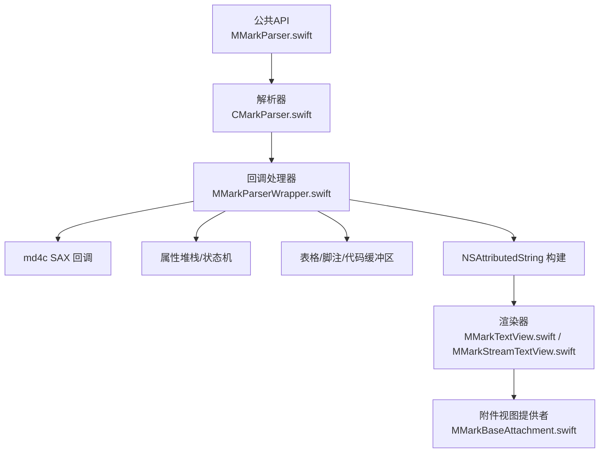
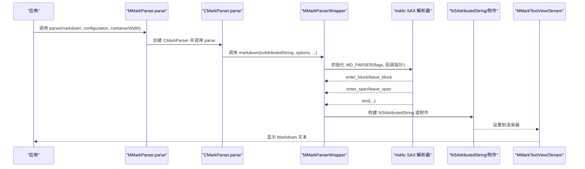
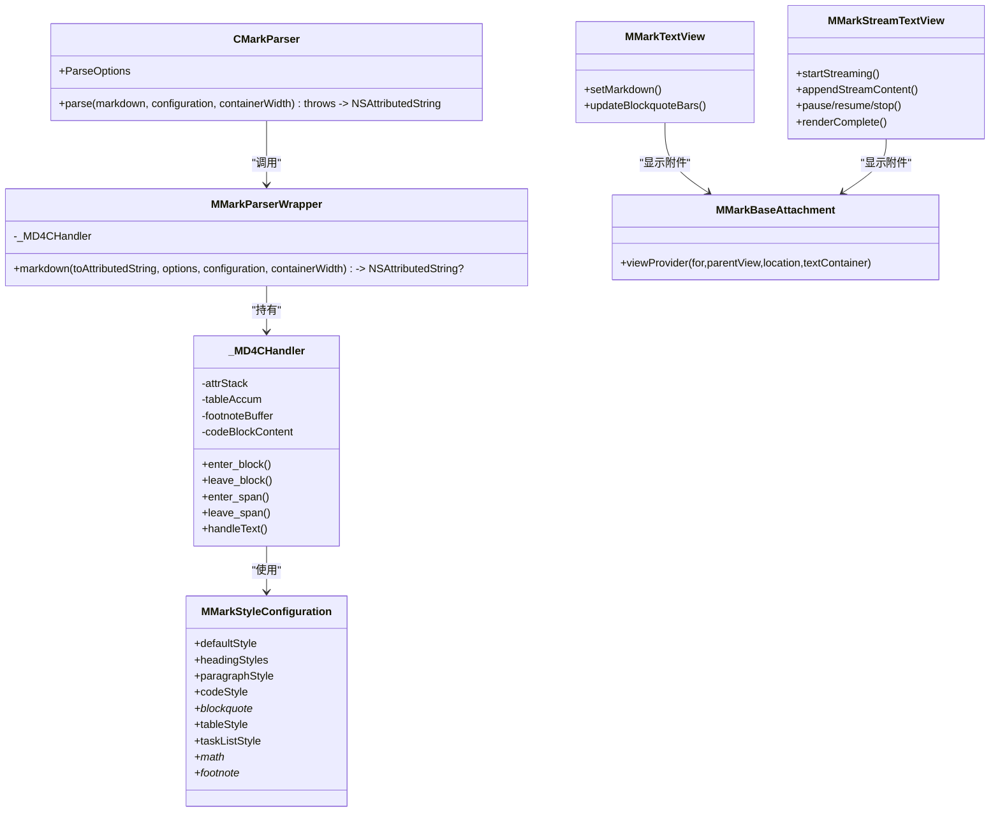

# 解析器系统

<cite>
**本文档引用的文件**
- [CMarkParser.swift](file://MMarkParser/Sources/Parser/CMarkParser.swift)
- [MMarkParserWrapper.swift](file://MMarkParser/Sources/Parser/MMarkParserWrapper.swift)
- [MMarkParser.swift](file://MMarkParser/Sources/MMarkParser.swift)
- [MMarkStyleConfiguration.swift](file://MMarkParser/Sources/Renderer/MMarkStyleConfiguration.swift)
- [MMarkTextView.swift](file://MMarkParser/Sources/Renderer/MMarkTextView.swift)
- [MMarkStreamTextView.swift](file://MMarkParser/Sources/Renderer/MMarkStreamTextView.swift)
- [MMarkBaseAttachment.swift](file://MMarkParser/Sources/Renderer/Attachments/MMarkBaseAttachment/MMarkBaseAttachment.swift)
- [README.md](file://README.md)
</cite>

## 目录
1. [简介](#简介)
2. [项目结构](#项目结构)
3. [核心组件](#核心组件)
4. [架构总览](#架构总览)
5. [详细组件分析](#详细组件分析)
6. [依赖关系分析](#依赖关系分析)
7. [性能考量](#性能考量)
8. [故障排查指南](#故障排查指南)
9. [结论](#结论)
10. [附录](#附录)

## 简介
本文件面向MMarkParser的解析器系统，聚焦于CMarkParser与MMarkParserWrapper两大核心模块，系统性阐述：
- md4c库的初始化配置、GFM选项设置与解析标志位使用
- MMarkParserWrapper作为md4c SAX回调处理器的实现（约1100行回调逻辑）
- 回调函数enter_block、leave_block、enter_span、leave_span、text的具体职责与作用
- 属性堆栈机制如何在嵌套结构中正确传播样式上下文
- 特殊功能实现：表格累积、脚注处理、代码缓冲区管理、LaTeX数学渲染、HTML实体解码等
- 错误处理机制与性能优化策略
- 实际使用模式与最佳实践

## 项目结构
MMarkParser采用“公共API入口 + 解析器 + 渲染器 + 附件视图”的分层设计：
- 公共API入口：MMarkParser与CMarkParser
- 解析器：MMarkParserWrapper（md4c SAX回调处理器）
- 渲染器：MMarkTextView、MMarkStreamTextView
- 样式配置：MMarkStyleConfiguration
- 附件基类：MMarkBaseAttachment（用于代码块、图片、表格、数学、水平线、列表标记等）

图表来源
- [MMarkParser.swift:18-26](file://MMarkParser/Sources/MMarkParser.swift#L18-L26)
- [CMarkParser.swift:55-66](file://MMarkParser/Sources/Parser/CMarkParser.swift#L55-L66)
- [MMarkParserWrapper.swift:1376-1444](file://MMarkParser/Sources/Parser/MMarkParserWrapper.swift#L1376-L1444)
- [MMarkTextView.swift:40-49](file://MMarkParser/Sources/Renderer/MMarkTextView.swift#L40-L49)
- [MMarkStreamTextView.swift:174-201](file://MMarkParser/Sources/Renderer/MMarkStreamTextView.swift#L174-L201)
- [MMarkBaseAttachment.swift:32-58](file://MMarkParser/Sources/Renderer/Attachments/MMarkBaseAttachment/MMarkBaseAttachment.swift#L32-L58)

章节来源
- [README.md:108-156](file://README.md#L108-L156)
- [README.md:158-180](file://README.md#L158-L180)

## 核心组件
- CMarkParser：封装md4c解析选项（ParseOptions），负责将Markdown字符串转换为NSAttributedString，并处理空输入与解析失败错误。
- MMarkParserWrapper：md4c SAX回调处理器，维护属性堆栈、容器宽度、列表/引用块/表格/脚注/代码块等状态，构建NSAttributedString或生成附件。
- MMarkStyleConfiguration：统一的样式配置，涵盖标题、段落、链接、代码、块引用、表格、任务列表、数学、脚注等。
- MMarkTextView / MMarkStreamTextView：基于TextKit 2的显示视图，支持块引用竖条绘制、链接点击、流式渲染等。
- MMarkBaseAttachment：附件基类，根据类型懒加载对应的ViewProvider，实现复杂元素的延迟渲染。

章节来源
- [CMarkParser.swift:7-67](file://MMarkParser/Sources/Parser/CMarkParser.swift#L7-L67)
- [MMarkParserWrapper.swift:18-1266](file://MMarkParser/Sources/Parser/MMarkParserWrapper.swift#L18-L1266)
- [MMarkStyleConfiguration.swift:11-339](file://MMarkParser/Sources/Renderer/MMarkStyleConfiguration.swift#L11-L339)
- [MMarkTextView.swift:6-81](file://MMarkParser/Sources/Renderer/MMarkTextView.swift#L6-L81)
- [MMarkStreamTextView.swift:21-398](file://MMarkParser/Sources/Renderer/MMarkStreamTextView.swift#L21-L398)
- [MMarkBaseAttachment.swift:12-59](file://MMarkParser/Sources/Renderer/Attachments/MMarkBaseAttachment/MMarkBaseAttachment.swift#L12-L59)

## 架构总览
解析流程从公共API入口开始，经由CMarkParser配置md4c标志位，交由MMarkParserWrapper以SAX回调驱动增量构建NSAttributedString或附件，最终由渲染器显示。

图表来源
- [MMarkParser.swift:18-26](file://MMarkParser/Sources/MMarkParser.swift#L18-L26)
- [CMarkParser.swift:55-66](file://MMarkParser/Sources/Parser/CMarkParser.swift#L55-L66)
- [MMarkParserWrapper.swift:1392-1444](file://MMarkParser/Sources/Parser/MMarkParserWrapper.swift#L1392-L1444)
- [MMarkParserWrapper.swift:1407-1425](file://MMarkParser/Sources/Parser/MMarkParserWrapper.swift#L1407-L1425)

## 详细组件分析

### CMarkParser：md4c初始化与GFM选项
- ParseOptions：以OptionSet形式组合md4c标志位，支持默认、表格、删除线、任务列表、宽松自动链接、LaTeX数学、脚注、硬换行等。
- md4c标志位常量：定义了各扩展的原始值，如MD_FLAG_TABLES、MD_FLAG_STRIKETHROUGH、MD_FLAG_TASKLISTS、MD_FLAG_PERMISSIVEAUTOLINKS、MD_FLAG_LATEXMATHSPANS、MD_FLAG_FOOTNOTES、MD_FLAG_HARD_SOFT_BREAKS。
- 解析入口：parse方法对空字符串返回空NSAttributedString；否则委托MMarkParserWrapper完成解析，解析失败抛出ParseError.parsingFailed。

章节来源
- [CMarkParser.swift:14-47](file://MMarkParser/Sources/Parser/CMarkParser.swift#L14-L47)
- [CMarkParser.swift:71-81](file://MMarkParser/Sources/Parser/CMarkParser.swift#L71-L81)
- [CMarkParser.swift:55-66](file://MMarkParser/Sources/Parser/CMarkParser.swift#L55-L66)

### MMarkParserWrapper：SAX回调处理器（约1100行）
- 角色定位：_MD4CHandler作为md4c回调的唯一持有者，负责增量构建NSAttributedString，管理属性堆栈、容器宽度、列表/引用块/表格/脚注/代码块/数学等状态。
- 关键状态：
  - 上下文状态：blockquoteDepth、listDepth、currentIndent/currentHeadIndent、listTypeStack、orderedListItemCounters、_tightListStack
  - 属性堆栈：attrStack/currentAttrs，通过pushAttrs/popAttrs在嵌套结构间传播样式
  - 特殊缓冲区：codeBlockLang/codeBlockContent、tableAccum、footnoteBuffer、isCollectingFootnotes、_imgAltBuffer/_imgUrlBuffer、isDisplayMath
  - 宽度约束：effectiveWidth保证深度嵌套时不会出现负宽度
- 输出路由：output方法根据当前上下文（单元格/脚注收集/普通结果）选择目标缓冲区，最终统一写入result。

章节来源
- [MMarkParserWrapper.swift:18-1266](file://MMarkParser/Sources/Parser/MMarkParserWrapper.swift#L18-L1266)

#### 回调函数：enter_block
- 文档根：保存初始属性栈
- 引用块：进入/退出时调整currentIndent/currentHeadIndent与containerWidth，记录blockquoteDepth
- 列表：维护listDepth与listTypeStack；有序列表维护计数器；处理tight/loose模式下的换行
- 列表项LI：计算marker（数字/任务/符号），测量marker宽度，计算缩进，设置段落样式，输出带样式的marker
- 标题H：按层级选择样式，设置段前/段后间距
- 段落P：设置行间距与首行缩进
- 代码块CODE：标记进入代码块，提取语言信息，清空缓冲
- HTML块：跳过渲染
- 水平线HR：插入水平线附件
- 表格：初始化_tableAccumulator，记录列数与容器宽度
- 表头/表体/行/单元格：分别设置isHeader、开始/结束行、开始/结束单元格，清空段落样式，按TH/TD设置字体/颜色
- 脚注定义区/定义：切换isCollectingFootnotes与isInsideFootnoteDef，输出标题与分隔线，输出脚注标签，设置脚注样式与回链属性
- 其他：通用pushAttrs

章节来源
- [MMarkParserWrapper.swift:134-644](file://MMarkParser/Sources/Parser/MMarkParserWrapper.swift#L134-L644)

#### 回调函数：leave_block
- 引用块：恢复indent与containerWidth，追加换行
- 列表/有序列表：弹出listTypeStack与计数器，处理tight模式的换行
- 列表项LI：恢复缩进，必要时追加换行
- 标题H：追加换行
- 脚注定义区/定义：关闭收集状态，输出回链“↩”，清空标签
- 段落P：在非脚注定义中追加双换行
- 代码块CODE：渲染代码块附件（含语言、宽度、缩进、块引用背景）
- 表格：渲染表格附件，附加段落缩进与块引用背景
- 表头/表体/行/单元格：结束行/单元格
- 其他：通用popAttrs

章节来源
- [MMarkParserWrapper.swift:485-644](file://MMarkParser/Sources/Parser/MMarkParserWrapper.swift#L485-L644)

#### 回调函数：enter_span
- 粗体STRONG：合并父字体粗体特性，保持blockquote颜色
- 斜体EM：合并父字体斜体特性，保持blockquote颜色
- 删除DEL：设置删除线样式与颜色
- 链接A：解码URL（支持锚点与百分号编码），设置链接颜色、下划线与URL属性
- 图像IMG：进入图像span，准备_alt/_url缓冲，暂不渲染
- 行内代码CODE：继承父字体的粗/斜特性，设置代码样式
- 脚注引用FOOTNOTE_REF：设置脚注引用样式与链接，输出“[”与标签，记录footnoteRef
- 数学LATEXMATH/LATEXMATH_DISPLAY：标记isDisplayMath
- 其他：通用pushAttrs

章节来源
- [MMarkParserWrapper.swift:648-765](file://MMarkParser/Sources/Parser/MMarkParserWrapper.swift#L648-L765)

#### 回调函数：leave_span
- 粗体/斜体/删除/链接：popAttrs
- 图像IMG：根据cellBuffer决定输出原Markdown语法或渲染图片附件；处理块级图片的换行与段落缩进；支持块引用背景
- 行内代码CODE：popAttrs
- 脚注引用：输出“]”，popAttrs
- 数学DISPLAY：关闭isDisplayMath
- 其他：通用popAttrs

章节来源
- [MMarkParserWrapper.swift:767-828](file://MMarkParser/Sources/Parser/MMarkParserWrapper.swift#L767-L828)

#### 回调函数：text
- 普通文本：写入当前attrs，区分cellBuffer与普通输出
- 行内代码：若在代码块中累积，否则直接输出
- 换行BR/SOFTBR：输出换行
- HTML实体ENTITY：解码后再输出
- 数学LATEXMATH：根据isDisplayMath决定块级/行内渲染
- HTML标签：识别 等自闭合标签，输出换行
- NULL字符：忽略
- 其他：按当前attrs输出

章节来源
- [MMarkParserWrapper.swift:837-906](file://MMarkParser/Sources/Parser/MMarkParserWrapper.swift#L837-L906)

#### 属性堆栈机制
- pushAttrs：保存currentAttrs到attrStack
- popAttrs：从attrStack恢复currentAttrs
- 在enter_block/enter_span中pushAttrs，在leave_block/leave_span中popAttrs，确保嵌套结构中的样式正确传播
- 块引用/列表/表格等上下文会覆盖或叠加段落样式、颜色、背景等属性

章节来源
- [MMarkParserWrapper.swift:46-55](file://MMarkParser/Sources/Parser/MMarkParserWrapper.swift#L46-L55)
- [MMarkParserWrapper.swift:134-644](file://MMarkParser/Sources/Parser/MMarkParserWrapper.swift#L134-L644)
- [MMarkParserWrapper.swift:648-828](file://MMarkParser/Sources/Parser/MMarkParserWrapper.swift#L648-L828)

#### 表格累积与渲染
- _MDTableAccumulator：按行/列累积headerCells/bodyCells、alignments、currentCellText
- enter_block(MD_BLOCK_TABLE/TH/TD)：初始化_accumulator，清空段落样式，设置字体/颜色，开始单元格
- leave_block(MD_BLOCK_TABLE)：渲染MMarkTableAttachment，附加段落缩进与块引用背景
- leave_block(MD_BLOCK_TH/TD)：结束单元格，写入当前cellText

章节来源
- [MMarkParserWrapper.swift:1272-1315](file://MMarkParser/Sources/Parser/MMarkParserWrapper.swift#L1272-L1315)
- [MMarkParserWrapper.swift:389-632](file://MMarkParser/Sources/Parser/MMarkParserWrapper.swift#L389-L632)

#### 脚注处理
- 收集阶段：enter_block(MD_BLOCK_FOOTNOTE_DEF_SECTION)启用isCollectingFootnotes；enter_block(MD_BLOCK_FOOTNOTE_DEF)设置isInsideFootnoteDef，输出标题与分隔线，输出脚注标签，设置footnoteDef属性
- 结束阶段：leave_block(MD_BLOCK_FOOTNOTE_DEF)输出回链“↩”，leave_block(MD_BLOCK_FOOTNOTE_DEF_SECTION)关闭收集
- 最终输出：在MMarkParserWrapper完成解析后，将footnoteBuffer追加到结果末尾

章节来源
- [MMarkParserWrapper.swift:433-547](file://MMarkParser/Sources/Parser/MMarkParserWrapper.swift#L433-L547)
- [MMarkParserWrapper.swift:1438-1441](file://MMarkParser/Sources/Parser/MMarkParserWrapper.swift#L1438-L1441)

#### 代码缓冲区管理
- enter_block(MD_BLOCK_CODE)：标记进入代码块，提取语言，清空缓冲
- text(MD_TEXT_CODE)：若在代码块中累积到codeBlockContent，否则按普通文本输出
- leave_block(MD_BLOCK_CODE)：渲染MMarkCodeBlockAttachment，附加段落缩进与块引用背景

章节来源
- [MMarkParserWrapper.swift:369-584](file://MMarkParser/Sources/Parser/MMarkParserWrapper.swift#L369-L584)

#### LaTeX数学渲染
- 行内数学：convertChemistryToLatex处理\ce/\chemfig等化学式，renderInlineMathImage生成图片附件
- 块级数学：renderBlockMath创建MMarkMathBlockAttachment
- isDisplayMath控制渲染路径

章节来源
- [MMarkParserWrapper.swift:878-933](file://MMarkParser/Sources/Parser/MMarkParserWrapper.swift#L878-L933)
- [MMarkParserWrapper.swift:908-1194](file://MMarkParser/Sources/Parser/MMarkParserWrapper.swift#L908-L1194)

#### HTML实体解码
- decodeHTMLEntity：支持常见实体与十进制/十六进制数字实体

章节来源
- [MMarkParserWrapper.swift:1229-1264](file://MMarkParser/Sources/Parser/MMarkParserWrapper.swift#L1229-L1264)

#### URL编码与安全
- enter_span(MD_SPAN_A)：对href进行百分号编码，锚点场景仅对#后的片段编码，避免桥接层crash

章节来源
- [MMarkParserWrapper.swift:682-707](file://MMarkParser/Sources/Parser/MMarkParserWrapper.swift#L682-L707)

### 渲染器与附件
- MMarkTextView：设置Markdown内容，监听contentSize变化以更新块引用竖条，处理链接点击
- MMarkStreamTextView：支持流式渲染，定时器驱动增量更新，自动滚动跟随，支持暂停/恢复/停止
- MMarkBaseAttachment：根据attachmentType懒加载对应ViewProvider，实现附件视图的延迟创建

章节来源
- [MMarkTextView.swift:40-81](file://MMarkParser/Sources/Renderer/MMarkTextView.swift#L40-L81)
- [MMarkStreamTextView.swift:174-398](file://MMarkParser/Sources/Renderer/MMarkStreamTextView.swift#L174-L398)
- [MMarkBaseAttachment.swift:32-58](file://MMarkParser/Sources/Renderer/Attachments/MMarkBaseAttachment/MMarkBaseAttachment.swift#L32-L58)

## 依赖关系分析

图表来源
- [CMarkParser.swift:55-66](file://MMarkParser/Sources/Parser/CMarkParser.swift#L55-L66)
- [MMarkParserWrapper.swift:1376-1444](file://MMarkParser/Sources/Parser/MMarkParserWrapper.swift#L1376-L1444)
- [MMarkTextView.swift:40-81](file://MMarkParser/Sources/Renderer/MMarkTextView.swift#L40-L81)
- [MMarkStreamTextView.swift:174-398](file://MMarkParser/Sources/Renderer/MMarkStreamTextView.swift#L174-L398)
- [MMarkBaseAttachment.swift:32-58](file://MMarkParser/Sources/Renderer/Attachments/MMarkBaseAttachment/MMarkBaseAttachment.swift#L32-L58)

## 性能考量
- SAX增量构建：避免AST树遍历，边解析边构建NSAttributedString，降低内存峰值
- TextKit 2延迟视图：附件通过ViewProvider延迟创建，减少初始布局压力
- 流式渲染：MMarkStreamTextView按chunk大小增量插入，长文档动态增大chunk，维持视觉流畅
- 自动滚动优化：仅在用户位于底部时自动跟随，避免频繁滚动
- 宽度约束：effectiveWidth最小值保障，避免深度嵌套导致的负宽度问题
- 数学渲染：行内数学转图片，块级数学使用附件，避免复杂布局重算

章节来源
- [README.md:214-219](file://README.md#L214-L219)
- [MMarkStreamTextView.swift:304-351](file://MMarkParser/Sources/Renderer/MMarkStreamTextView.swift#L304-L351)
- [MMarkParserWrapper.swift:91-92](file://MMarkParser/Sources/Parser/MMarkParserWrapper.swift#L91-L92)

## 故障排查指南
- 解析失败：CMarkParser.parse在md4c返回非零时抛出ParseError.parsingFailed；MMarkParserWrapper记录lastError并通过静态锁保护
- 空输入：CMarkParser与MMarkParserWrapper均对空字符串返回空结果
- URL编码问题：enter_span(MD_SPAN_A)已对href进行百分号编码，若仍出现异常，请检查外部URL格式
- 数学渲染失败：renderInlineMathImage在无法渲染时回退为纯文本；检查mathDisplayFont与iosMath可用性
- 脚注未显示：确认leave_block(MD_BLOCK_FOOTNOTE_DEF_SECTION)后footnoteBuffer被追加到结果末尾

章节来源
- [CMarkParser.swift:8-12](file://MMarkParser/Sources/Parser/CMarkParser.swift#L8-L12)
- [CMarkParser.swift:61-63](file://MMarkParser/Sources/Parser/CMarkParser.swift#L61-L63)
- [MMarkParserWrapper.swift:1378-1432](file://MMarkParser/Sources/Parser/MMarkParserWrapper.swift#L1378-L1432)
- [MMarkParserWrapper.swift:1438-1441](file://MMarkParser/Sources/Parser/MMarkParserWrapper.swift#L1438-L1441)

## 结论
MMarkParser的解析器系统以md4c SAX模型为核心，通过MMarkParserWrapper实现对块/行内节点与文本的增量构建，结合属性堆栈与状态机，实现了对GFM扩展（表格、任务列表、脚注、LaTeX数学）的完整支持。配合TextKit 2附件与流式渲染，既保证了高性能，又提供了良好的可定制性与用户体验。

## 附录
- 使用模式
  - 直接解析：调用MMarkParser.parse或String.parseMarkdown
  - 自定义样式：通过MMarkStyleConfiguration配置标题、段落、链接、代码、块引用、表格、任务列表、数学、脚注等
  - 显示渲染：使用MMarkTextView或MMarkStreamTextView承载NSAttributedString
- 最佳实践
  - 合理设置containerWidth，避免过小导致布局异常
  - 使用默认样式配置作为起点，按需微调
  - 长文档优先考虑流式渲染，提升交互体验
  - 注意URL编码与HTML实体解码，确保链接与特殊字符正确显示

章节来源
- [MMarkParser.swift:18-41](file://MMarkParser/Sources/MMarkParser.swift#L18-L41)
- [MMarkStyleConfiguration.swift:189-267](file://MMarkParser/Sources/Renderer/MMarkStyleConfiguration.swift#L189-L267)
- [MMarkTextView.swift:40-49](file://MMarkParser/Sources/Renderer/MMarkTextView.swift#L40-L49)
- [MMarkStreamTextView.swift:174-201](file://MMarkParser/Sources/Renderer/MMarkStreamTextView.swift#L174-L201)