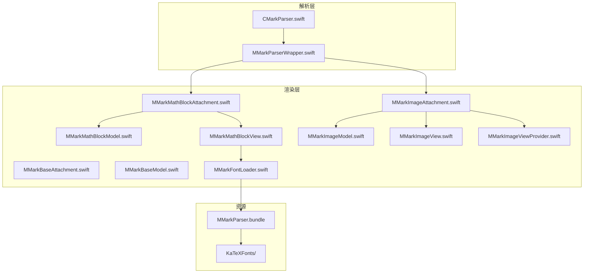
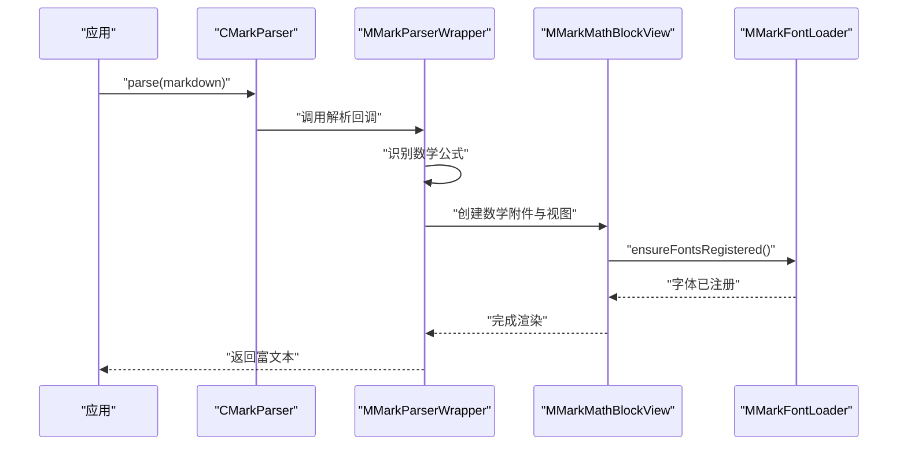
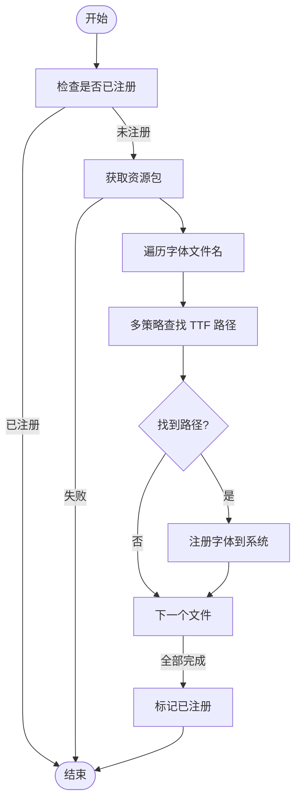
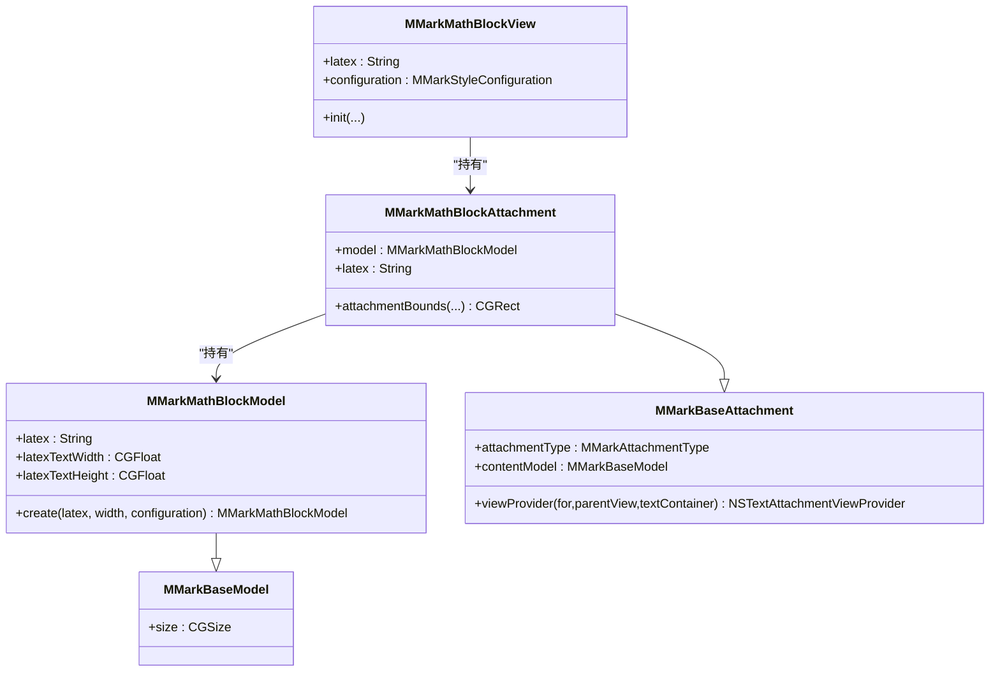
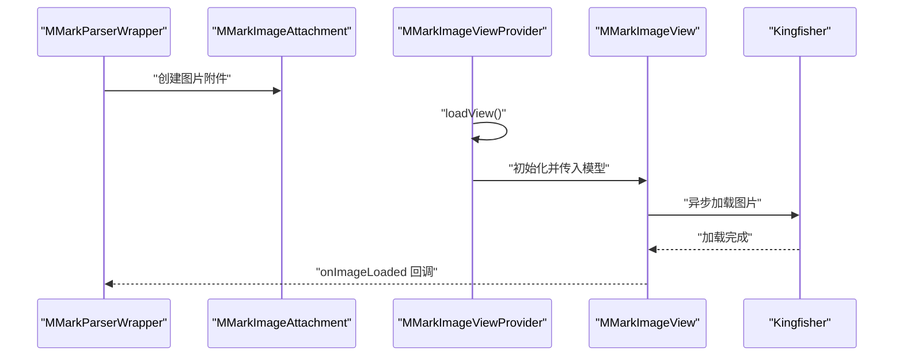
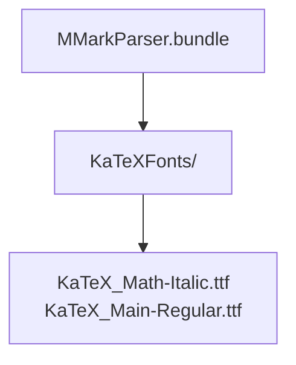
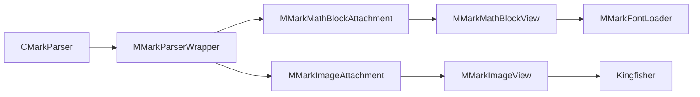

# 资源管理系统

<cite>
**本文档引用的文件**
- [MMarkFontLoader.swift](file://MMarkParser/Sources/Renderer/MMarkFontLoader.swift)
- [MMarkParserWrapper.swift](file://MMarkParser/Sources/Parser/MMarkParserWrapper.swift)
- [CMarkParser.swift](file://MMarkParser/Sources/Parser/CMarkParser.swift)
- [MMarkBaseAttachment.swift](file://MMarkParser/Sources/Renderer/Attachments/MMarkBaseAttachment/MMarkBaseAttachment.swift)
- [MMarkBaseModel.swift](file://MMarkParser/Sources/Renderer/Attachments/MMarkBaseAttachment/MMarkBaseModel.swift)
- [MMarkMathBlockAttachment.swift](file://MMarkParser/Sources/Renderer/Attachments/MMarkMathBlockAttachment/MMarkMathBlockAttachment.swift)
- [MMarkMathBlockModel.swift](file://MMarkParser/Sources/Renderer/Attachments/MMarkMathBlockAttachment/MMarkMathBlockModel.swift)
- [MMarkMathBlockView.swift](file://MMarkParser/Sources/Renderer/Attachments/MMarkMathBlockAttachment/MMarkMathBlockView.swift)
- [MMarkImageAttachment.swift](file://MMarkParser/Sources/Renderer/Attachments/MMarkImageAttachment/MMarkImageAttachment.swift)
- [MMarkImageModel.swift](file://MMarkParser/Sources/Renderer/Attachments/MMarkImageAttachment/MMarkImageModel.swift)
- [MMarkImageView.swift](file://MMarkParser/Sources/Renderer/Attachments/MMarkImageAttachment/MMarkImageView.swift)
- [MMarkImageViewProvider.swift](file://MMarkParser/Sources/Renderer/Attachments/MMarkImageAttachment/MMarkImageViewProvider.swift)
- [MMarkParser.bundle](file://MMarkParser/Sources/Resources/MMarkParser.bundle)
- [KaTeXFonts](file://MMarkParser/Sources/Resources/MMarkParser.bundle/KaTeXFonts)
</cite>

## 目录
1. [简介](#简介)
2. [项目结构](#项目结构)
3. [核心组件](#核心组件)
4. [架构总览](#架构总览)
5. [详细组件分析](#详细组件分析)
6. [依赖关系分析](#依赖关系分析)
7. [性能考量](#性能考量)
8. [故障排查指南](#故障排查指南)
9. [结论](#结论)
10. [附录](#附录)

## 简介
本文件聚焦于 MMarkParser 的资源管理系统，系统性阐述以下主题：
- MMarkFontLoader 的字体加载机制与 KaTeX 字体注册流程
- LaTeX 数学公式渲染的字体资源处理策略（TTF 加载与缓存）
- 图片资源管理（本地与远程资源处理）
- 资源包组织结构与 Bundle 管理策略
- 性能优化技巧与最佳实践
- 资源文件格式要求与命名规范
- 如何扩展与自定义资源管理功能

## 项目结构
围绕资源管理的关键目录与文件如下：
- 渲染器字体加载：MMarkFontLoader.swift
- 解析与渲染流程：CMarkParser.swift、MMarkParserWrapper.swift
- 附件基类与模型：MMarkBaseAttachment.swift、MMarkBaseModel.swift
- 数学公式附件与视图：MMarkMathBlockAttachment.swift、MMarkMathBlockModel.swift、MMarkMathBlockView.swift
- 图像附件与视图：MMarkImageAttachment.swift、MMarkImageModel.swift、MMarkImageView.swift、MMarkImageViewProvider.swift
- 资源包与字体目录：MMarkParser.bundle、KaTeXFonts

**图表来源**
- [CMarkParser.swift:1-81](file://MMarkParser/Sources/Parser/CMarkParser.swift#L1-L81)
- [MMarkParserWrapper.swift:908-933](file://MMarkParser/Sources/Parser/MMarkParserWrapper.swift#L908-L933)
- [MMarkBaseAttachment.swift:12-58](file://MMarkParser/Sources/Renderer/Attachments/MMarkBaseAttachment/MMarkBaseAttachment.swift#L12-L58)
- [MMarkMathBlockAttachment.swift:5-22](file://MMarkParser/Sources/Renderer/Attachments/MMarkMathBlockAttachment/MMarkMathBlockAttachment.swift#L5-L22)
- [MMarkMathBlockModel.swift:7-47](file://MMarkParser/Sources/Renderer/Attachments/MMarkMathBlockAttachment/MMarkMathBlockModel.swift#L7-L47)
- [MMarkMathBlockView.swift:7-32](file://MMarkParser/Sources/Renderer/Attachments/MMarkMathBlockAttachment/MMarkMathBlockView.swift#L7-L32)
- [MMarkImageAttachment.swift:5-22](file://MMarkParser/Sources/Renderer/Attachments/MMarkImageAttachment/MMarkImageAttachment.swift#L5-L22)
- [MMarkImageModel.swift:6-26](file://MMarkParser/Sources/Renderer/Attachments/MMarkImageAttachment/MMarkImageModel.swift#L6-L26)
- [MMarkImageView.swift:7-47](file://MMarkParser/Sources/Renderer/Attachments/MMarkImageAttachment/MMarkImageView.swift#L7-L47)
- [MMarkImageViewProvider.swift:6-32](file://MMarkParser/Sources/Renderer/Attachments/MMarkImageAttachment/MMarkImageViewProvider.swift#L6-L32)
- [MMarkFontLoader.swift:8-113](file://MMarkParser/Sources/Renderer/MMarkFontLoader.swift#L8-L113)
- [MMarkParser.bundle](file://MMarkParser/Sources/Resources/MMarkParser.bundle)
- [KaTeXFonts](file://MMarkParser/Sources/Resources/MMarkParser.bundle/KaTeXFonts)

**章节来源**
- [MMarkFontLoader.swift:1-113](file://MMarkParser/Sources/Renderer/MMarkFontLoader.swift#L1-L113)
- [MMarkParserWrapper.swift:908-933](file://MMarkParser/Sources/Parser/MMarkParserWrapper.swift#L908-L933)
- [CMarkParser.swift:1-81](file://MMarkParser/Sources/Parser/CMarkParser.swift#L1-L81)
- [MMarkBaseAttachment.swift:12-58](file://MMarkParser/Sources/Renderer/Attachments/MMarkBaseAttachment/MMarkBaseAttachment.swift#L12-L58)
- [MMarkMathBlockAttachment.swift:5-22](file://MMarkParser/Sources/Renderer/Attachments/MMarkMathBlockAttachment/MMarkMathBlockAttachment.swift#L5-L22)
- [MMarkMathBlockModel.swift:7-47](file://MMarkParser/Sources/Renderer/Attachments/MMarkMathBlockAttachment/MMarkMathBlockModel.swift#L7-L47)
- [MMarkMathBlockView.swift:7-32](file://MMarkParser/Sources/Renderer/Attachments/MMarkMathBlockAttachment/MMarkMathBlockView.swift#L7-L32)
- [MMarkImageAttachment.swift:5-22](file://MMarkParser/Sources/Renderer/Attachments/MMarkImageAttachment/MMarkImageAttachment.swift#L5-L22)
- [MMarkImageModel.swift:6-26](file://MMarkParser/Sources/Renderer/Attachments/MMarkImageAttachment/MMarkImageModel.swift#L6-L26)
- [MMarkImageView.swift:7-47](file://MMarkParser/Sources/Renderer/Attachments/MMarkImageAttachment/MMarkImageView.swift#L7-L47)
- [MMarkImageViewProvider.swift:6-32](file://MMarkParser/Sources/Renderer/Attachments/MMarkImageAttachment/MMarkImageViewProvider.swift#L6-L32)
- [MMarkParser.bundle](file://MMarkParser/Sources/Resources/MMarkParser.bundle)
- [KaTeXFonts](file://MMarkParser/Sources/Resources/MMarkParser.bundle/KaTeXFonts)

## 核心组件
- 字体加载器：负责从资源包加载并注册 KaTeX 字体，确保数学公式渲染可用。
- 数学公式附件与视图：封装 LaTeX 公式渲染所需的模型、附件与视图，依赖字体加载器。
- 图像附件与视图：封装图片资源的模型、附件与视图，支持占位与异步加载。
- 附件基类与模型：统一附件类型与尺寸抽象，作为所有附件的基础。

**章节来源**
- [MMarkFontLoader.swift:8-113](file://MMarkParser/Sources/Renderer/MMarkFontLoader.swift#L8-L113)
- [MMarkMathBlockAttachment.swift:5-22](file://MMarkParser/Sources/Renderer/Attachments/MMarkMathBlockAttachment/MMarkMathBlockAttachment.swift#L5-L22)
- [MMarkMathBlockModel.swift:7-47](file://MMarkParser/Sources/Renderer/Attachments/MMarkMathBlockAttachment/MMarkMathBlockModel.swift#L7-L47)
- [MMarkMathBlockView.swift:7-32](file://MMarkParser/Sources/Renderer/Attachments/MMarkMathBlockAttachment/MMarkMathBlockView.swift#L7-L32)
- [MMarkImageAttachment.swift:5-22](file://MMarkParser/Sources/Renderer/Attachments/MMarkImageAttachment/MMarkImageAttachment.swift#L5-L22)
- [MMarkImageModel.swift:6-26](file://MMarkParser/Sources/Renderer/Attachments/MMarkImageAttachment/MMarkImageModel.swift#L6-L26)
- [MMarkImageView.swift:7-47](file://MMarkParser/Sources/Renderer/Attachments/MMarkImageAttachment/MMarkImageView.swift#L7-L47)
- [MMarkImageViewProvider.swift:6-32](file://MMarkParser/Sources/Renderer/Attachments/MMarkImageAttachment/MMarkImageViewProvider.swift#L6-L32)
- [MMarkBaseAttachment.swift:12-58](file://MMarkParser/Sources/Renderer/Attachments/MMarkBaseAttachment/MMarkBaseAttachment.swift#L12-L58)
- [MMarkBaseModel.swift:3-10](file://MMarkParser/Sources/Renderer/Attachments/MMarkBaseAttachment/MMarkBaseModel.swift#L3-L10)

## 架构总览
资源管理贯穿“解析—渲染—显示”链路：
- 解析阶段：CMarkParser 将 Markdown 解析为带样式的富文本；MMarkParserWrapper 负责具体回调与附件生成。
- 渲染阶段：数学公式通过 MMarkMathBlockModel/Attachment/View 组合渲染；图片通过 MMarkImageModel/Attachment/View 组合渲染。
- 资源阶段：MMarkFontLoader 在首次使用前注册 KaTeX 字体；图片通过 Kingfisher 异步加载远程资源。

**图表来源**
- [CMarkParser.swift:56-66](file://MMarkParser/Sources/Parser/CMarkParser.swift#L56-L66)
- [MMarkParserWrapper.swift:908-933](file://MMarkParser/Sources/Parser/MMarkParserWrapper.swift#L908-L933)
- [MMarkMathBlockView.swift:19-23](file://MMarkParser/Sources/Renderer/Attachments/MMarkMathBlockAttachment/MMarkMathBlockView.swift#L19-L23)
- [MMarkFontLoader.swift:24-26](file://MMarkParser/Sources/Renderer/MMarkFontLoader.swift#L24-L26)

## 详细组件分析

### 字体加载器：MMarkFontLoader
- 单例与线程安全：使用共享实例与锁保护注册状态，避免重复注册。
- 注册策略：按顺序尝试多种查找策略定位 TTF 文件，最终通过 CoreText 注册到系统。
- 资源定位：优先从 CocoaPods 资源包查找，回退到框架 Bundle。
- 字体清单：默认仅注册被样式配置使用的 KaTeX 字体文件。

**图表来源**
- [MMarkFontLoader.swift:29-51](file://MMarkParser/Sources/Renderer/MMarkFontLoader.swift#L29-L51)
- [MMarkFontLoader.swift:54-64](file://MMarkParser/Sources/Renderer/MMarkFontLoader.swift#L54-L64)
- [MMarkFontLoader.swift:67-94](file://MMarkParser/Sources/Renderer/MMarkFontLoader.swift#L67-L94)
- [MMarkFontLoader.swift:97-111](file://MMarkParser/Sources/Renderer/MMarkFontLoader.swift#L97-L111)

**章节来源**
- [MMarkFontLoader.swift:8-113](file://MMarkParser/Sources/Renderer/MMarkFontLoader.swift#L8-L113)

### 数学公式渲染：模型、附件与视图
- 模型：MMarkMathBlockModel 基于 LaTeX 内容与配置计算显示尺寸，并在主线程测量。
- 附件：MMarkMathBlockAttachment 提供尺寸约束与附件类型标识。
- 视图：MMarkMathBlockView 初始化时调用字体加载器确保字体可用，并使用 MTMathUILabel 渲染。

**图表来源**
- [MMarkBaseModel.swift:3-10](file://MMarkParser/Sources/Renderer/Attachments/MMarkBaseAttachment/MMarkBaseModel.swift#L3-L10)
- [MMarkMathBlockModel.swift:7-47](file://MMarkParser/Sources/Renderer/Attachments/MMarkMathBlockAttachment/MMarkMathBlockModel.swift#L7-L47)
- [MMarkBaseAttachment.swift:12-58](file://MMarkParser/Sources/Renderer/Attachments/MMarkBaseAttachment/MMarkBaseAttachment.swift#L12-L58)
- [MMarkMathBlockAttachment.swift:5-22](file://MMarkParser/Sources/Renderer/Attachments/MMarkMathBlockAttachment/MMarkMathBlockAttachment.swift#L5-L22)
- [MMarkMathBlockView.swift:7-32](file://MMarkParser/Sources/Renderer/Attachments/MMarkMathBlockAttachment/MMarkMathBlockView.swift#L7-L32)

**章节来源**
- [MMarkMathBlockModel.swift:19-47](file://MMarkParser/Sources/Renderer/Attachments/MMarkMathBlockAttachment/MMarkMathBlockModel.swift#L19-L47)
- [MMarkMathBlockAttachment.swift:16-22](file://MMarkParser/Sources/Renderer/Attachments/MMarkMathBlockAttachment/MMarkMathBlockAttachment.swift#L16-L22)
- [MMarkMathBlockView.swift:19-32](file://MMarkParser/Sources/Renderer/Attachments/MMarkMathBlockAttachment/MMarkMathBlockView.swift#L19-L32)

### 图片资源管理：模型、附件与视图
- 模型：MMarkImageModel 保存 URL、alt 文本与占位色，并提供工厂方法计算尺寸。
- 附件：MMarkImageAttachment 提供尺寸约束与访问属性。
- 视图：MMarkImageView 使用 Kingfisher 异步加载远程图片，支持占位与加载完成回调。
- 视图提供者：MMarkImageViewProvider 负责创建并绑定视图，可扩展布局无效化逻辑。

**图表来源**
- [MMarkParserWrapper.swift:782-800](file://MMarkParser/Sources/Parser/MMarkParserWrapper.swift#L782-L800)
- [MMarkImageAttachment.swift:5-22](file://MMarkParser/Sources/Renderer/Attachments/MMarkImageAttachment/MMarkImageAttachment.swift#L5-L22)
- [MMarkImageViewProvider.swift:12-32](file://MMarkParser/Sources/Renderer/Attachments/MMarkImageAttachment/MMarkImageViewProvider.swift#L12-L32)
- [MMarkImageView.swift:29-47](file://MMarkParser/Sources/Renderer/Attachments/MMarkImageAttachment/MMarkImageView.swift#L29-L47)

**章节来源**
- [MMarkImageModel.swift:20-26](file://MMarkParser/Sources/Renderer/Attachments/MMarkImageAttachment/MMarkImageModel.swift#L20-L26)
- [MMarkImageAttachment.swift:17-22](file://MMarkParser/Sources/Renderer/Attachments/MMarkImageAttachment/MMarkImageAttachment.swift#L17-L22)
- [MMarkImageViewProvider.swift:12-32](file://MMarkParser/Sources/Renderer/Attachments/MMarkImageAttachment/MMarkImageViewProvider.swift#L12-L32)
- [MMarkImageView.swift:29-47](file://MMarkParser/Sources/Renderer/Attachments/MMarkImageAttachment/MMarkImageView.swift#L29-L47)

### 资源包组织与 Bundle 策略
- 资源包名称：MMarkParser.bundle
- 字体目录：KaTeXFonts 子目录存放 KaTeX 字体文件
- 查找策略：优先从 CocoaPods 资源包定位，回退到框架 Bundle
- 字体注册：仅注册默认样式实际使用的字体文件

**图表来源**
- [MMarkParser.bundle](file://MMarkParser/Sources/Resources/MMarkParser.bundle)
- [KaTeXFonts](file://MMarkParser/Sources/Resources/MMarkParser.bundle/KaTeXFonts)
- [MMarkFontLoader.swift:54-64](file://MMarkParser/Sources/Renderer/MMarkFontLoader.swift#L54-L64)
- [MMarkFontLoader.swift:16-19](file://MMarkParser/Sources/Renderer/MMarkFontLoader.swift#L16-L19)

**章节来源**
- [MMarkParser.bundle](file://MMarkParser/Sources/Resources/MMarkParser.bundle)
- [KaTeXFonts](file://MMarkParser/Sources/Resources/MMarkParser.bundle/KaTeXFonts)
- [MMarkFontLoader.swift:54-64](file://MMarkParser/Sources/Renderer/MMarkFontLoader.swift#L54-L64)
- [MMarkFontLoader.swift:16-19](file://MMarkParser/Sources/Renderer/MMarkFontLoader.swift#L16-L19)

## 依赖关系分析
- 解析层依赖渲染层：CMarkParser 通过 MMarkParserWrapper 驱动附件创建。
- 渲染层依赖资源：数学公式视图依赖字体加载器；图片视图依赖 Kingfisher。
- 资源层依赖系统框架：字体注册依赖 CoreText；图片加载依赖 Kingfisher。

**图表来源**
- [CMarkParser.swift:56-66](file://MMarkParser/Sources/Parser/CMarkParser.swift#L56-L66)
- [MMarkParserWrapper.swift:908-933](file://MMarkParser/Sources/Parser/MMarkParserWrapper.swift#L908-L933)
- [MMarkMathBlockView.swift:19-23](file://MMarkParser/Sources/Renderer/Attachments/MMarkMathBlockAttachment/MMarkMathBlockView.swift#L19-L23)
- [MMarkImageView.swift:29-47](file://MMarkParser/Sources/Renderer/Attachments/MMarkImageAttachment/MMarkImageView.swift#L29-L47)

**章节来源**
- [CMarkParser.swift:56-66](file://MMarkParser/Sources/Parser/CMarkParser.swift#L56-L66)
- [MMarkParserWrapper.swift:908-933](file://MMarkParser/Sources/Parser/MMarkParserWrapper.swift#L908-L933)
- [MMarkMathBlockView.swift:19-23](file://MMarkParser/Sources/Renderer/Attachments/MMarkMathBlockAttachment/MMarkMathBlockView.swift#L19-L23)
- [MMarkImageView.swift:29-47](file://MMarkParser/Sources/Renderer/Attachments/MMarkImageAttachment/MMarkImageView.swift#L29-L47)

## 性能考量
- 字体注册一次性完成：MMarkFontLoader 通过单例与锁保证幂等注册，避免重复开销。
- 主线程测量：数学公式尺寸计算在主线程进行，减少并发复杂度。
- 图片异步加载：MMarkImageView 使用异步加载并在完成后触发回调，避免阻塞主线程。
- 尺寸约束：附件通过 attachmentBounds 对宽度进行约束，减少重绘与溢出问题。
- 建议优化
  - 预热字体：在应用启动阶段调用 ensureFontsRegistered，降低首帧延迟。
  - 缓存策略：结合 Kingfisher 的缓存策略，合理设置过期时间与内存上限。
  - 批量渲染：对长文档采用懒渲染或分页策略，避免一次性创建大量附件视图。
  - 字体裁剪：仅注册必要字体，减少系统字体注册数量。

[本节为通用性能建议，无需特定文件引用]

## 故障排查指南
- 字体未注册
  - 现象：数学公式显示异常或回退为占位。
  - 排查：确认资源包路径与字体文件存在；检查 ensureFontsRegistered 是否被调用。
  - 参考
    - [MMarkFontLoader.swift:54-64](file://MMarkParser/Sources/Renderer/MMarkFontLoader.swift#L54-L64)
    - [MMarkFontLoader.swift:67-94](file://MMarkParser/Sources/Renderer/MMarkFontLoader.swift#L67-L94)
- 图片加载失败
  - 现象：图片占位长时间不消失或加载错误。
  - 排查：检查 URL 合法性与网络可达性；确认 Kingfisher 配置正确。
  - 参考
    - [MMarkImageView.swift:29-47](file://MMarkParser/Sources/Renderer/Attachments/MMarkImageAttachment/MMarkImageView.swift#L29-L47)
    - [MMarkImageViewProvider.swift:12-32](file://MMarkParser/Sources/Renderer/Attachments/MMarkImageAttachment/MMarkImageViewProvider.swift#L12-L32)
- 尺寸异常
  - 现象：图片或数学公式显示被截断或比例错误。
  - 排查：检查 attachmentBounds 实现与容器宽度；确认模型尺寸计算逻辑。
  - 参考
    - [MMarkMathBlockAttachment.swift:16-22](file://MMarkParser/Sources/Renderer/Attachments/MMarkMathBlockAttachment/MMarkMathBlockAttachment.swift#L16-L22)
    - [MMarkImageAttachment.swift:17-22](file://MMarkParser/Sources/Renderer/Attachments/MMarkImageAttachment/MMarkImageAttachment.swift#L17-L22)
    - [MMarkMathBlockModel.swift:19-47](file://MMarkParser/Sources/Renderer/Attachments/MMarkMathBlockAttachment/MMarkMathBlockModel.swift#L19-L47)

**章节来源**
- [MMarkFontLoader.swift:54-64](file://MMarkParser/Sources/Renderer/MMarkFontLoader.swift#L54-L64)
- [MMarkFontLoader.swift:67-94](file://MMarkParser/Sources/Renderer/MMarkFontLoader.swift#L67-L94)
- [MMarkImageView.swift:29-47](file://MMarkParser/Sources/Renderer/Attachments/MMarkImageAttachment/MMarkImageView.swift#L29-L47)
- [MMarkImageViewProvider.swift:12-32](file://MMarkParser/Sources/Renderer/Attachments/MMarkImageAttachment/MMarkImageViewProvider.swift#L12-L32)
- [MMarkMathBlockAttachment.swift:16-22](file://MMarkParser/Sources/Renderer/Attachments/MMarkMathBlockAttachment/MMarkMathBlockAttachment.swift#L16-L22)
- [MMarkImageAttachment.swift:17-22](file://MMarkParser/Sources/Renderer/Attachments/MMarkImageAttachment/MMarkImageAttachment.swift#L17-L22)
- [MMarkMathBlockModel.swift:19-47](file://MMarkParser/Sources/Renderer/Attachments/MMarkMathBlockAttachment/MMarkMathBlockModel.swift#L19-L47)

## 结论
MMarkParser 的资源管理系统通过清晰的职责分离实现了：
- 数学公式字体的可靠注册与复用
- 图片资源的异步加载与尺寸控制
- 附件体系的统一抽象与扩展点

遵循本文档的规范与最佳实践，可在保证性能的同时提升渲染质量与用户体验。

[本节为总结性内容，无需特定文件引用]

## 附录

### 资源文件格式与命名规范
- 字体文件
  - 格式：TTF
  - 目录：KaTeXFonts
  - 名称示例：KaTeX_Math-Italic.ttf、KaTeX_Main-Regular.ttf
- 资源包
  - 名称：MMarkParser.bundle
  - 定位：优先从 CocoaPods 资源包查找，回退到框架 Bundle
- 数学公式
  - 渲染：MTMathUILabel
  - 尺寸：基于 LaTeX 内容与配置计算
- 图片资源
  - 加载：Kingfisher
  - 模型：MMarkImageModel
  - 视图：MMarkImageView
  - 提供者：MMarkImageViewProvider

**章节来源**
- [MMarkParser.bundle](file://MMarkParser/Sources/Resources/MMarkParser.bundle)
- [KaTeXFonts](file://MMarkParser/Sources/Resources/MMarkParser.bundle/KaTeXFonts)
- [MMarkFontLoader.swift:16-19](file://MMarkParser/Sources/Renderer/MMarkFontLoader.swift#L16-L19)
- [MMarkMathBlockModel.swift:19-47](file://MMarkParser/Sources/Renderer/Attachments/MMarkMathBlockAttachment/MMarkMathBlockModel.swift#L19-L47)
- [MMarkImageModel.swift:20-26](file://MMarkParser/Sources/Renderer/Attachments/MMarkImageAttachment/MMarkImageModel.swift#L20-L26)
- [MMarkImageView.swift:29-47](file://MMarkParser/Sources/Renderer/Attachments/MMarkImageAttachment/MMarkImageView.swift#L29-L47)
- [MMarkImageViewProvider.swift:12-32](file://MMarkParser/Sources/Renderer/Attachments/MMarkImageAttachment/MMarkImageViewProvider.swift#L12-L32)

### 扩展与自定义资源管理
- 自定义字体
  - 在 KaTeXFonts 中新增 TTF 文件，并更新字体清单数组
  - 确保资源包打包与路径正确
- 自定义图片加载
  - 替换或扩展 MMarkImageView 的加载逻辑
  - 保持 onImageLoaded 回调以驱动 TextKit 重新布局
- 自定义附件类型
  - 基于 MMarkBaseAttachment 与 MMarkBaseModel 扩展新附件
  - 在 MMarkBaseAttachment 的视图提供分支中注册新类型

**章节来源**
- [MMarkFontLoader.swift:16-19](file://MMarkParser/Sources/Renderer/MMarkFontLoader.swift#L16-L19)
- [MMarkBaseAttachment.swift:32-58](file://MMarkParser/Sources/Renderer/Attachments/MMarkBaseAttachment/MMarkBaseAttachment.swift#L32-L58)
- [MMarkImageView.swift:14-16](file://MMarkParser/Sources/Renderer/Attachments/MMarkImageAttachment/MMarkImageView.swift#L14-L16)