# Mermaid图表附件

<cite>
**本文档中引用的文件**
- [README.md](file://README.md)
- [MMarkMermaidAttachment.swift](file://MMarkParser/Renderer/Attachments/MMarkMermaidAttachment/MMarkMermaidAttachment.swift)
- [MMarkMermaidModel.swift](file://MMarkParser/Renderer/Attachments/MMarkMermaidAttachment/MMarkMermaidModel.swift)
- [MMarkMermaidView.swift](file://MMarkParser/Renderer/Attachments/MMarkMermaidAttachment/MMarkMermaidView.swift)
- [MMarkMermaidViewProvider.swift](file://MMarkParser/Renderer/Attachments/MMarkMermaidAttachment/MMarkMermaidViewProvider.swift)
- [BeautifulMermaid.swift](file://BeautifulMermaidSwift/BeautifulMermaid.swift)
- [MMarkStyleConfiguration.swift](file://MMarkParser/Renderer/MMarkStyleConfiguration.swift)
- [ImageRenderer.swift](file://BeautifulMermaidSwift/ImageRenderer.swift)
</cite>

## 更新摘要
**所做更改**
- 更新了计算属性章节，反映imageWidth/imageHeight从存储属性改为计算属性的优化
- 新增了静态常量章节，详细介绍错误消息字符串提取为静态常量的改进
- 更新了样式配置章节，展示从扁平配置改为mermaidStyle结构化配置的架构变更
- 增强了主题解析章节，包含新的Mermaid样式系统集成
- 更新了性能优化章节，反映新的约束系统和图像缩放对齐机制

## 目录
1. [简介](#简介)
2. [项目结构](#项目结构)
3. [核心组件](#核心组件)
4. [架构概览](#架构概览)
5. [详细组件分析](#详细组件分析)
6. [Mermaid渲染流程](#mermaid渲染流程)
7. [性能考虑](#性能考虑)
8. [错误处理机制](#错误处理机制)
9. [智能主题解析](#智能主题解析)
10. [样式配置重构](#样式配置重构)
11. [故障排除指南](#故障排除指南)
12. [结论](#结论)

## 简介

MMarkParser是一个专为iOS平台设计的Markdown解析和渲染库，基于TextKit 2构建，提供完整的GFM支持、Mermaid图表渲染和LaTeX数学公式显示功能。本文档专注于Mermaid图表附件系统的实现细节和架构设计。

Mermaid图表附件系统是MMarkParser的核心功能之一，它能够将Markdown中的Mermaid代码块转换为可交互的图表视图，支持多种图表类型包括流程图、序列图、类图、实体关系图等。经过重大改进后，系统现在具备了完善的错误处理机制、智能主题解析能力和性能优化特性，同时引入了更灵活的样式配置系统。

## 项目结构

MMarkParser采用模块化架构设计，Mermaid图表附件系统位于以下目录结构中：

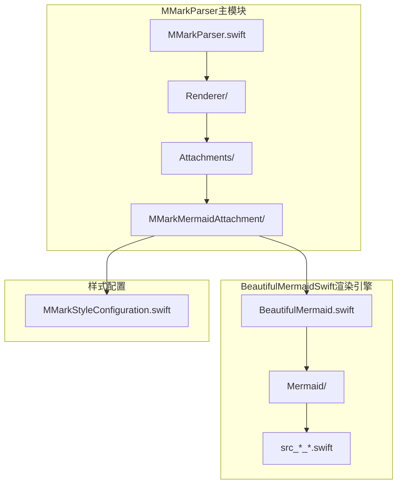

**图表来源**
- [README.md:242-273](file://README.md#L242-L273)
- [MMarkMermaidAttachment.swift:1-33](file://MMarkParser/Renderer/Attachments/MMarkMermaidAttachment/MMarkMermaidAttachment.swift#L1-L33)

**章节来源**
- [README.md:153-202](file://README.md#L153-L202)
- [README.md:242-273](file://README.md#L242-L273)

## 核心组件

Mermaid图表附件系统由四个核心组件构成，每个组件都有明确的职责分工。经过更新后，系统现在具备了更强的错误处理能力和性能优化特性，同时引入了更灵活的样式配置架构。

### 组件架构

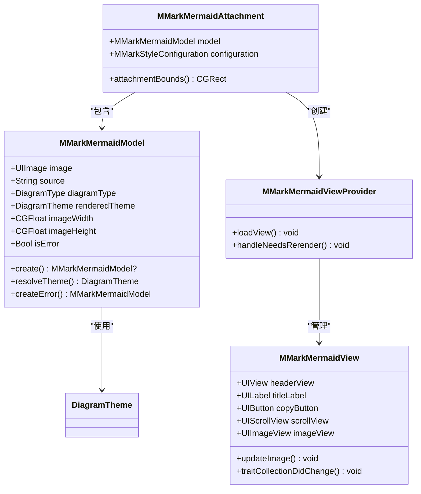

**图表来源**
- [MMarkMermaidAttachment.swift:6-32](file://MMarkParser/Renderer/Attachments/MMarkMermaidAttachment/MMarkMermaidAttachment.swift#L6-L32)
- [MMarkMermaidModel.swift:7-164](file://MMarkParser/Renderer/Attachments/MMarkMermaidAttachment/MMarkMermaidModel.swift#L7-L164)
- [MMarkMermaidView.swift:7-187](file://MMarkParser/Renderer/Attachments/MMarkMermaidAttachment/MMarkMermaidView.swift#L7-L187)
- [MMarkMermaidViewProvider.swift:6-56](file://MMarkParser/Renderer/Attachments/MMarkMermaidAttachment/MMarkMermaidViewProvider.swift#L6-L56)

### 组件职责

1. **MMarkMermaidAttachment**: 作为NSTextAttachment的子类，负责存储Mermaid图表数据模型和配置信息
2. **MMarkMermaidModel**: 处理Mermaid图表的渲染、主题解析、错误状态管理和尺寸计算，现在使用计算属性优化性能
3. **MMarkMermaidView**: 提供可视化的图表显示界面，包含标题栏、滚动视图和错误状态显示，支持动态图像更新
4. **MMarkMermaidViewProvider**: 管理图表视图的生命周期、暗黑模式切换和错误状态处理

**章节来源**
- [MMarkMermaidAttachment.swift:5-32](file://MMarkParser/Renderer/Attachments/MMarkMermaidAttachment/MMarkMermaidAttachment.swift#L5-L32)
- [MMarkMermaidModel.swift:6-164](file://MMarkParser/Renderer/Attachments/MMarkMermaidAttachment/MMarkMermaidModel.swift#L6-L164)
- [MMarkMermaidView.swift:6-187](file://MMarkParser/Renderer/Attachments/MMarkMermaidAttachment/MMarkMermaidView.swift#L6-L187)
- [MMarkMermaidViewProvider.swift:5-56](file://MMarkParser/Renderer/Attachments/MMarkMermaidAttachment/MMarkMermaidViewProvider.swift#L5-L56)

## 架构概览

Mermaid图表附件系统采用分层架构设计，从底层的渲染引擎到顶层的UI组件形成了清晰的抽象层次。经过更新后，系统现在具备了更完善的错误处理和性能优化机制，同时引入了结构化的样式配置系统。

### 整体架构

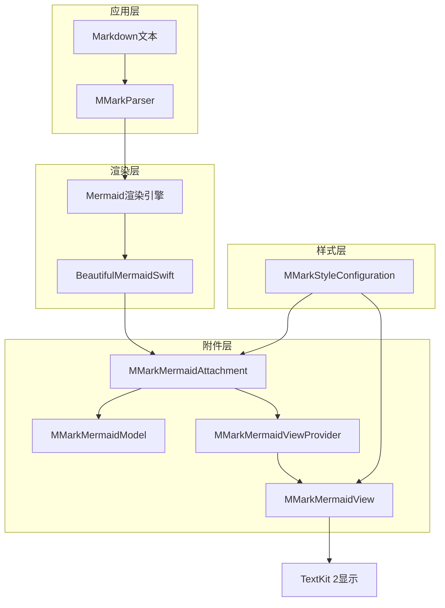

**图表来源**
- [README.md:228-241](file://README.md#L228-L241)
- [BeautifulMermaid.swift:14-78](file://BeautifulMermaidSwift/BeautifulMermaid.swift#L14-L78)

### 数据流架构

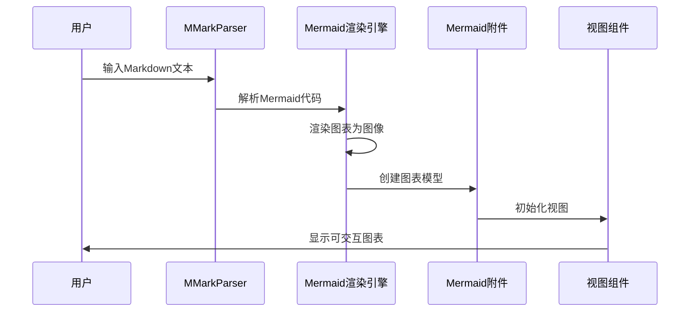

**图表来源**
- [README.md:228-241](file://README.md#L228-L241)
- [MMarkMermaidModel.swift:93-121](file://MMarkParser/Renderer/Attachments/MMarkMermaidAttachment/MMarkMermaidModel.swift#L93-L121)

## 详细组件分析

### MMarkMermaidAttachment组件

MMarkMermaidAttachment是Mermaid图表附件的核心类，继承自MMarkBaseAttachment，专门处理Mermaid图表的数据存储和边界计算。

#### 关键特性

- **类型安全**: 通过强类型约束确保contentModel必须是MMarkMermaidModel实例
- **配置注入**: 接收MMarkStyleConfiguration参数以支持样式定制
- **尺寸计算**: 实现attachmentBounds方法进行精确的布局计算

#### 边界计算逻辑

```mermaid
flowchart TD
A[计算宽度] --> B{width > 44?}
B --> |是| C{width < lineFrag.width?}
B --> |否| D[设置宽度为44]
C --> |是| E[设置宽度为min(width, lineFrag.width)-1]
C --> |否| F[设置宽度为width]
E --> G[返回CGRect]
F --> G
D --> G
G --> H[设置高度为imageHeight]
```

**图表来源**
- [MMarkMermaidAttachment.swift:27-31](file://MMarkParser/Renderer/Attachments/MMarkMermaidAttachment/MMarkMermaidAttachment.swift#L27-L31)

**章节来源**
- [MMarkMermaidAttachment.swift:6-32](file://MMarkParser/Renderer/Attachments/MMarkMermaidAttachment/MMarkMermaidAttachment.swift#L6-L32)

### MMarkMermaidModel组件

MMarkMermaidModel负责Mermaid图表的完整生命周期管理，从解析到渲染再到尺寸计算。经过重大更新后，系统现在具备了完善的错误处理机制、智能主题解析能力和性能优化特性。

#### 核心功能

1. **主题解析**: 根据系统外观自动选择合适的Mermaid主题
2. **图表类型检测**: 解析Mermaid源码确定图表类型
3. **图像渲染**: 调用BeautifulMermaidSwift进行图表渲染
4. **尺寸计算**: 计算包含标题栏和内边距的总尺寸
5. **错误状态管理**: 处理渲染失败的情况并生成错误占位图
6. **性能优化**: 使用计算属性替代存储属性，减少内存开销

#### 性能优化：计算属性

**更新** imageWidth和imageHeight现在是计算属性而非存储属性，提供更好的性能和内存效率：

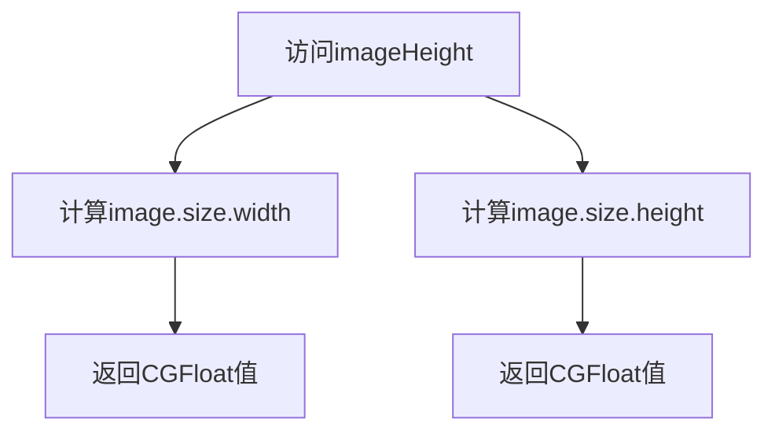

**图表来源**
- [MMarkMermaidModel.swift:16-19](file://MMarkParser/Renderer/Attachments/MMarkMermaidAttachment/MMarkMermaidModel.swift#L16-L19)

#### 错误消息字符串优化

**新增** 错误标题和占位图消息现在定义为静态常量，提供更好的代码组织和性能：

```mermaid
flowchart TD
A[定义静态常量] --> B[errorTitle = "Mermaid (Error)"]
B --> C[errorPlaceholderMessage = "Mermaid rendering failed"]
C --> D[在多处使用]
D --> E[编译时优化]
```

**图表来源**
- [MMarkMermaidModel.swift:24-27](file://MMarkParser/Renderer/Attachments/MMarkMermaidAttachment/MMarkMermaidModel.swift#L24-L27)

#### 主题解析算法

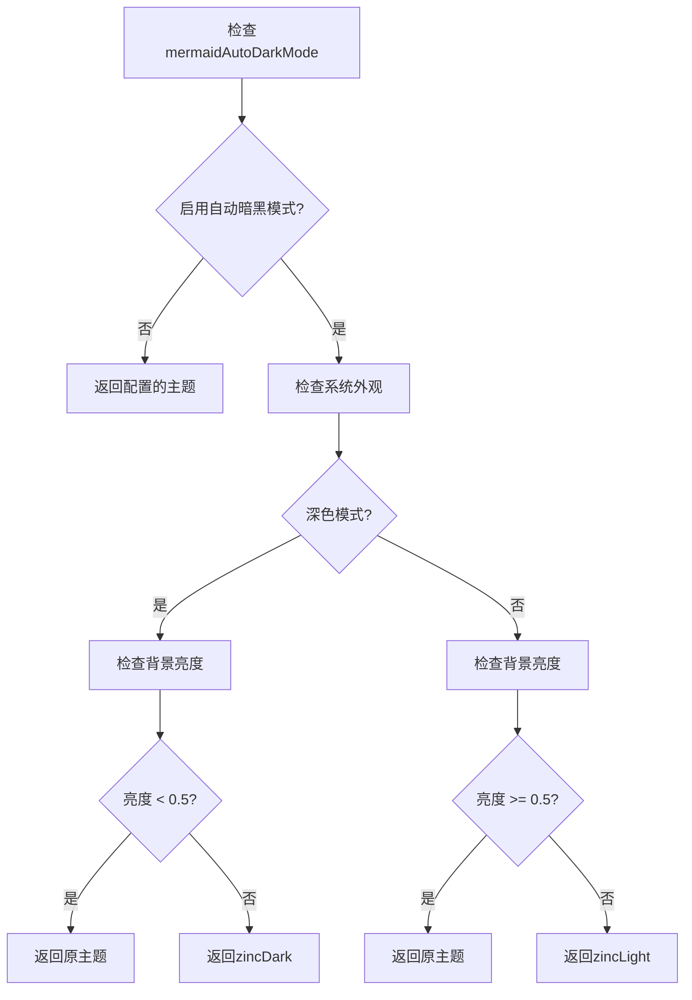

**图表来源**
- [MMarkMermaidModel.swift:50-65](file://MMarkParser/Renderer/Attachments/MMarkMermaidAttachment/MMarkMermaidModel.swift#L50-L65)

#### 图表类型检测机制

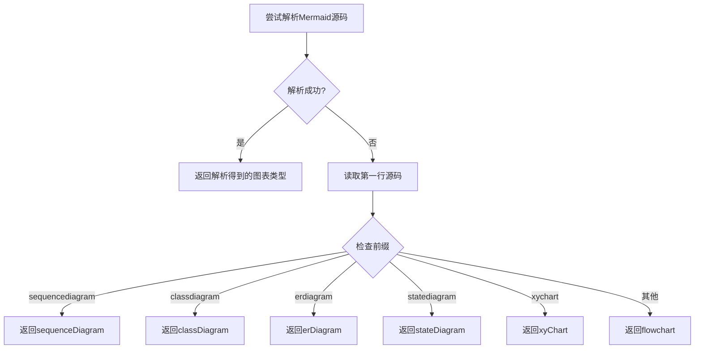

**图表来源**
- [MMarkMermaidModel.swift:67-79](file://MMarkParser/Renderer/Attachments/MMarkMermaidAttachment/MMarkMermaidModel.swift#L67-L79)

#### 错误处理机制

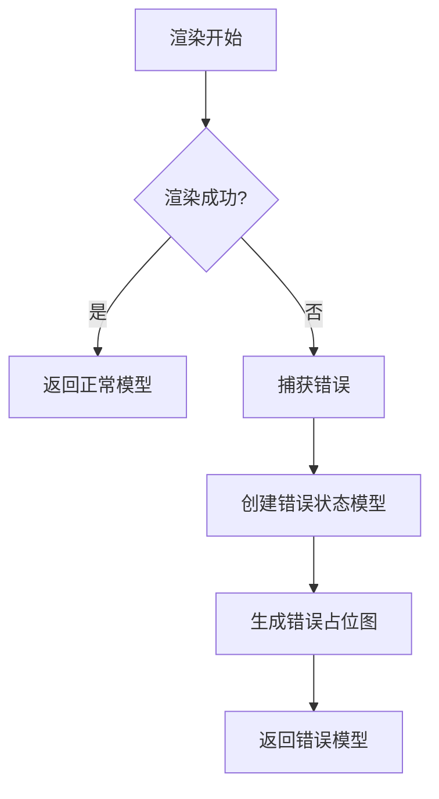

**图表来源**
- [MMarkMermaidModel.swift:117-121](file://MMarkParser/Renderer/Attachments/MMarkMermaidAttachment/MMarkMermaidModel.swift#L117-L121)

**章节来源**
- [MMarkMermaidModel.swift:7-164](file://MMarkParser/Renderer/Attachments/MMarkMermaidAttachment/MMarkMermaidModel.swift#L7-L164)

### MMarkMermaidView组件

MMarkMermaidView提供了Mermaid图表的可视化界面，包含标题栏、复制按钮和可滚动的图像视图。经过更新后，系统现在具备了更好的性能优化和错误状态显示能力。

#### 界面布局

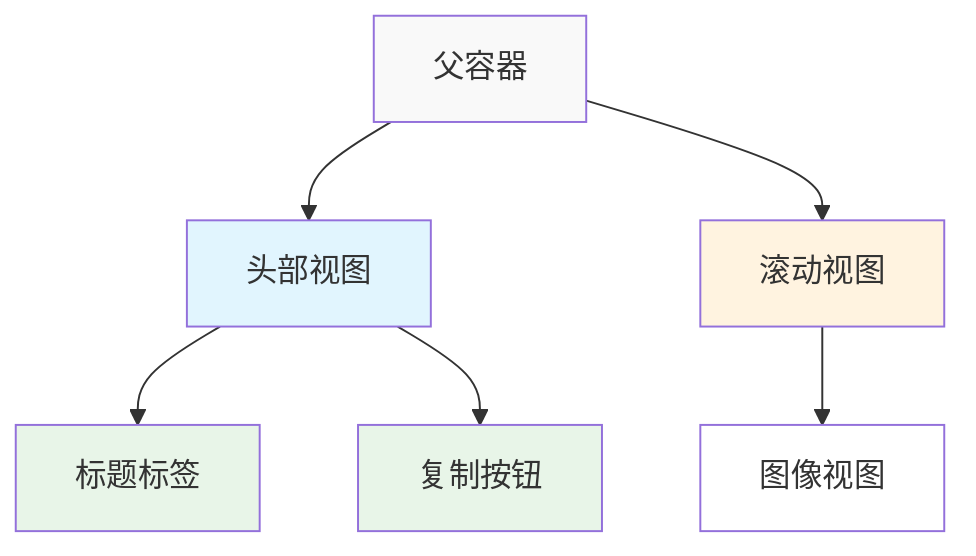

#### 约束系统

视图使用Auto Layout约束系统确保在不同屏幕尺寸下的正确布局，并实现了性能优化的约束策略：

- **头部视图**: 固定高度，填充整个容器宽度
- **滚动视图**: 顶部对齐到头部底部，左右留有内边距
- **图像视图**: 锚定到滚动视图的内容布局指南
- **尺寸约束**: 使用优先级确保图像自然尺寸的准确性
- **缩放对齐**: 自动匹配图像scale，避免非2x设备上的模糊

**章节来源**
- [MMarkMermaidView.swift:7-187](file://MMarkParser/Renderer/Attachments/MMarkMermaidAttachment/MMarkMermaidView.swift#L7-L187)

### MMarkMermaidViewProvider组件

MMarkMermaidViewProvider作为NSTextAttachmentViewProvider的实现，管理Mermaid图表视图的生命周期和事件处理。经过更新后，系统现在具备了更完善的错误状态处理和性能优化机制。

#### 事件处理机制

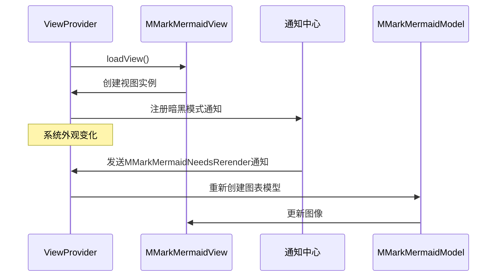

**图表来源**
- [MMarkMermaidViewProvider.swift:30-50](file://MMarkParser/Renderer/Attachments/MMarkMermaidAttachment/MMarkMermaidViewProvider.swift#L30-L50)

**章节来源**
- [MMarkMermaidViewProvider.swift:6-56](file://MMarkParser/Renderer/Attachments/MMarkMermaidAttachment/MMarkMermaidViewProvider.swift#L6-L56)

## Mermaid渲染流程

Mermaid图表的渲染过程涉及多个组件的协作，从Markdown解析到最终的图像显示。经过更新后，系统现在具备了更完善的错误处理和性能优化机制。

### 渲染流程图

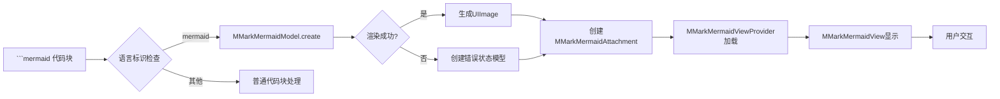

**图表来源**
- [README.md:228-241](file://README.md#L228-L241)
- [MMarkMermaidModel.swift:93-121](file://MMarkParser/Renderer/Attachments/MMarkMermaidAttachment/MMarkMermaidModel.swift#L93-L121)

### 渲染配置

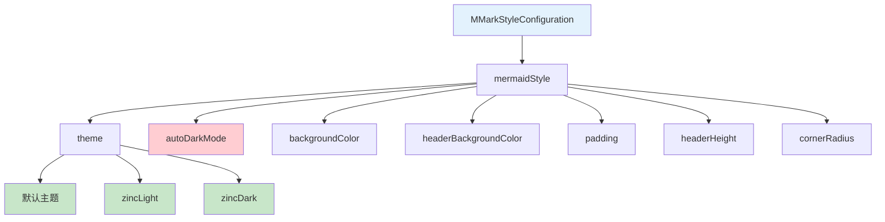

**图表来源**
- [MMarkStyleConfiguration.swift:11-45](file://MMarkParser/Renderer/MMarkStyleConfiguration.swift#L11-L45)

**章节来源**
- [BeautifulMermaid.swift:14-78](file://BeautifulMermaidSwift/BeautifulMermaid.swift#L14-L78)
- [MMarkStyleConfiguration.swift:11-45](file://MMarkParser/Renderer/MMarkStyleConfiguration.swift#L11-L45)

## 性能考虑

Mermaid图表附件系统在设计时充分考虑了性能优化，特别是在内存管理和渲染效率方面。经过更新后，系统现在具备了更完善的性能优化机制。

### 性能优化策略

1. **延迟加载**: 视图仅在需要时创建，避免不必要的内存占用
2. **缓存机制**: 渲染后的图像可以被缓存以提高重复访问速度
3. **异步渲染**: 支持异步渲染操作，避免阻塞主线程
4. **内存管理**: 使用弱引用和适当的生命周期管理防止内存泄漏
5. **计算属性优化**: imageWidth和imageHeight现在是计算属性，减少内存开销
6. **图像缩放对齐**: 自动匹配图像scale，避免非2x设备上的模糊
7. **约束系统优化**: 使用高优先级约束确保图像自然尺寸的准确性

### 内存使用模式

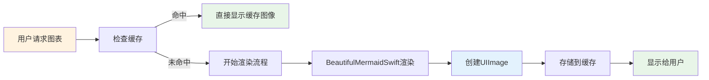

### 图像缩放对齐机制

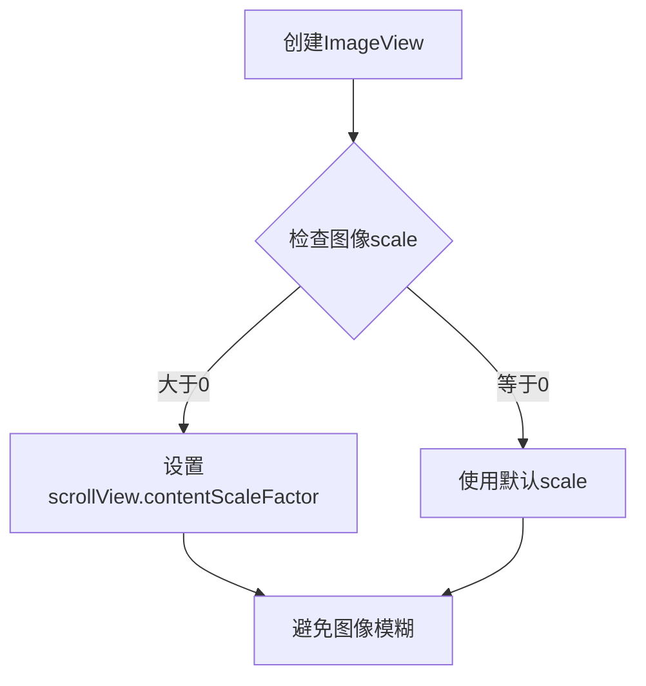

**图表来源**
- [MMarkMermaidView.swift:80-84](file://MMarkParser/Renderer/Attachments/MMarkMermaidAttachment/MMarkMermaidView.swift#L80-L84)

## 错误处理机制

经过重大更新后，Mermaid图表附件系统现在具备了完善的错误处理机制，能够优雅地处理渲染失败的情况并向用户提供友好的反馈。

### 错误处理架构

```mermaid
flowchart TD
A[开始渲染] --> B{渲染是否成功?}
B --> |是| C[正常返回图像]
B --> |否| D[捕获错误信息]
D --> E[创建错误状态模型]
E --> F[生成红色半透明占位图]
F --> G[显示"Mermaid rendering failed"文本]
G --> H[返回错误模型]
```

**图表来源**
- [MMarkMermaidModel.swift:117-121](file://MMarkParser/Renderer/Attachments/MMarkMermaidAttachment/MMarkMermaidModel.swift#L117-L121)

### 错误占位图设计

错误占位图采用以下设计原则：

- **视觉反馈**: 使用浅红色半透明背景提供明显的错误提示
- **文本信息**: 显示"Mermaid rendering failed"文本，字体大小14号，中等字重
- **居中布局**: 文本在占位图区域内居中显示
- **尺寸适配**: 占位图高度固定为60点，宽度根据容器宽度调整

**章节来源**
- [MMarkMermaidModel.swift:123-164](file://MMarkParser/Renderer/Attachments/MMarkMermaidAttachment/MMarkMermaidModel.swift#L123-L164)

## 智能主题解析

经过更新后，Mermaid图表附件系统现在具备了智能主题解析能力，能够根据系统外观和图表背景亮度自动选择最合适的主题。

### 主题解析算法

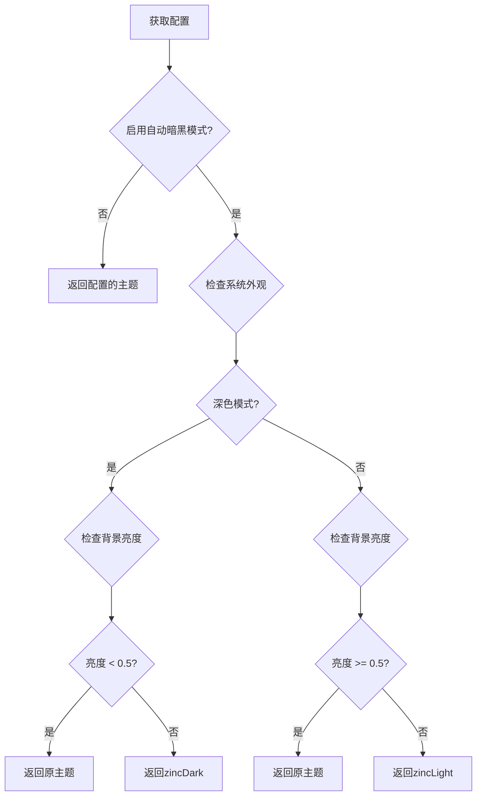

**图表来源**
- [MMarkMermaidModel.swift:50-65](file://MMarkParser/Renderer/Attachments/MMarkMermaidAttachment/MMarkMermaidModel.swift#L50-L65)

### 亮度检测机制

系统使用感知亮度算法来检测图表背景的明暗程度：

1. **RGB色彩空间**: 直接使用RGB值计算亮度
2. **非RGB色彩空间**: 将颜色转换为CIColor后再计算亮度
3. **亮度公式**: 0.299×R + 0.587×G + 0.114×B

### 主题选择规则

- **深色模式 + 深色背景**: 返回原主题
- **深色模式 + 浅色背景**: 返回zincDark主题
- **浅色模式 + 浅色背景**: 返回原主题
- **浅色模式 + 深色背景**: 返回zincLight主题

**章节来源**
- [MMarkMermaidModel.swift:38-65](file://MMarkParser/Renderer/Attachments/MMarkMermaidAttachment/MMarkMermaidModel.swift#L38-L65)

## 样式配置重构

经过重构后，Mermaid图表附件系统的样式配置更加灵活和强大，支持更精细的控制选项。

### 样式配置架构

**更新** 配置系统已从扁平结构重构为结构化MermaidStyle配置：

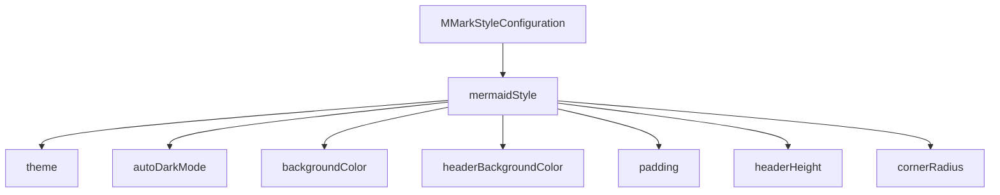

**图表来源**
- [MMarkStyleConfiguration.swift:11-45](file://MMarkParser/Renderer/MMarkStyleConfiguration.swift#L11-L45)

### MermaidStyle结构化配置

新的MermaidStyle结构提供了更清晰的配置层次：

- **主题设置**: 支持默认主题、zincLight、zincDark等多种主题
- **自动暗黑模式**: 根据系统外观自动切换主题
- **视觉样式**: 背景颜色、圆角半径、内边距等
- **布局配置**: 标题栏高度、整体间距等

**章节来源**
- [MMarkStyleConfiguration.swift:11-45](file://MMarkParser/Renderer/MMarkStyleConfiguration.swift#L11-L45)

## 故障排除指南

### 常见问题及解决方案

#### 图表渲染失败

**症状**: Mermaid图表无法正常显示，只显示代码块或错误占位图

**可能原因**:
1. Mermaid语法错误
2. BeautifulMermaidSwift渲染引擎问题
3. 内存不足
4. 主题解析失败

**解决步骤**:
1. 验证Mermaid语法的正确性
2. 检查日志输出中的错误信息
3. 确认有足够的内存资源
4. 检查主题配置是否正确

#### 暗黑模式切换异常

**症状**: 切换系统外观后图表主题没有更新

**解决方法**:
1. 确保启用了`mermaidAutoDarkMode`配置
2. 检查通知中心的注册状态
3. 验证主题解析逻辑
4. 确认亮度检测算法正常工作

#### 性能问题

**症状**: 图表渲染缓慢或内存占用过高

**优化建议**:
1. 使用异步渲染方法
2. 实现适当的缓存策略
3. 考虑降低渲染质量设置
4. 检查图像缩放对齐设置

#### 错误状态显示问题

**症状**: 错误占位图显示不正确或不显示

**解决方法**:
1. 检查错误处理逻辑
2. 验证错误占位图生成代码
3. 确认错误状态标志位设置正确
4. 检查视图更新机制

**章节来源**
- [MMarkMermaidModel.swift:117-121](file://MMarkParser/Renderer/Attachments/MMarkMermaidAttachment/MMarkMermaidModel.swift#L117-L121)
- [MMarkMermaidViewProvider.swift:30-50](file://MMarkParser/Renderer/Attachments/MMarkMermaidAttachment/MMarkMermaidViewProvider.swift#L30-L50)

## 结论

Mermaid图表附件系统经过重大改进后，展现了现代iOS应用开发中复杂UI组件的最佳实践。系统不仅具备了完善的错误处理机制、智能主题解析能力和性能优化特性，还保持了清晰的分层架构和类型安全的设计。

### 系统优势

1. **模块化设计**: 各组件职责明确，便于维护和扩展
2. **类型安全**: Swift的强类型系统确保运行时安全性
3. **性能优化**: 多层次的缓存和异步处理机制，包括计算属性优化
4. **用户体验**: 自动暗黑模式适配、错误状态优雅降级和可交互的图表界面
5. **错误处理**: 完善的错误状态管理和用户友好的错误提示
6. **配置灵活性**: 结构化的MermaidStyle配置提供更好的可定制性

### 技术亮点

- 基于TextKit 2的现代化渲染架构
- 完整的Mermaid语法支持和图表类型覆盖
- 智能的主题适配和外观切换
- 感知亮度检测算法实现精确的主题选择
- 计算属性优化减少内存开销
- 图像缩放对齐优化避免显示模糊
- 结构化的样式配置系统
- 错误消息字符串静态常量优化
- 错误状态优雅降级机制

该系统为iOS平台的Markdown编辑和展示应用提供了强大的图表渲染能力，是MMarkParser项目的重要组成部分。经过本次重大改进，系统在稳定性、性能和用户体验方面都得到了显著提升。