# 代码块附件

<cite>
**本文引用的文件**
- [MMarkCodeBlockAttachment.swift](file://MMarkParser/Sources/Renderer/Attachments/MMarkCodeBlockAttachment/MMarkCodeBlockAttachment.swift)
- [MMarkCodeBlockModel.swift](file://MMarkParser/Sources/Renderer/Attachments/MMarkCodeBlockAttachment/MMarkCodeBlockModel.swift)
- [MMarkCodeBlockView.swift](file://MMarkParser/Sources/Renderer/Attachments/MMarkCodeBlockAttachment/MMarkCodeBlockView.swift)
- [MMarkCodeBlockViewProvider.swift](file://MMarkParser/Sources/Renderer/Attachments/MMarkCodeBlockAttachment/MMarkCodeBlockViewProvider.swift)
- [MMarkBaseAttachment.swift](file://MMarkParser/Sources/Renderer/Attachments/MMarkBaseAttachment/MMarkBaseAttachment.swift)
- [MMarkBaseModel.swift](file://MMarkParser/Sources/Renderer/Attachments/MMarkBaseAttachment/MMarkBaseModel.swift)
- [MMarkStyleConfiguration.swift](file://MMarkParser/Sources/Renderer/MMarkStyleConfiguration.swift)
- [SyntaxHighlighter.swift](file://Splash/Syntax/SyntaxHighlighter.swift)
- [SwiftGrammar.swift](file://Splash/Grammar/SwiftGrammar.swift)
- [CSSGrammar.swift](file://Splash/Grammar/CSSGrammar.swift)
- [HTMLGrammar.swift](file://Splash/Grammar/HTMLGrammar.swift)
- [JSONGrammar.swift](file://Splash/Grammar/JSONGrammar.swift)
- [JavaScriptGrammar.swift](file://Splash/Grammar/JavaScriptGrammar.swift)
- [PythonGrammar.swift](file://Splash/Grammar/PythonGrammar.swift)
- [ShellGrammar.swift](file://Splash/Grammar/ShellGrammar.swift)
- [SplashGrammar.swift](file://Splash/Grammar/SplashGrammar.swift)
- [Theme.swift](file://Splash/Theming/Theme.swift)
- [Font.swift](file://Splash/Theming/Font.swift)
- [Color.swift](file://Splash/Theming/Color.swift)
- [MMarkParserWrapper.swift](file://MMarkParser/Sources/Parser/MMarkParserWrapper.swift)
- [SampleMarkdown.swift](file://cocoapod_demo/cocoapod_demo/SampleMarkdown.swift)
</cite>

## 更新摘要
**所做更改**
- 更新了语法高亮系统的实现细节，重点反映了从静态语法映射到懒加载工厂模式的重构
- 新增了 grammarCache 缓存机制的详细说明
- 完善了 grammar(for:) 方法的实现原理和性能优化策略
- 增强了多语言语法高亮系统的架构分析

## 目录
1. [简介](#简介)
2. [项目结构](#项目结构)
3. [核心组件](#核心组件)
4. [架构总览](#架构总览)
5. [详细组件分析](#详细组件分析)
6. [多语言语法高亮系统](#多语言语法高亮系统)
7. [语法高亮工厂模式重构](#语法高亮工厂模式重构)
8. [依赖关系分析](#依赖关系分析)
9. [性能考量](#性能考量)
10. [故障排查指南](#故障排查指南)
11. [结论](#结论)
12. [附录](#附录)

## 简介
本文件聚焦于 MMarkParser 的"代码块附件"能力，系统性解析 MMarkCodeBlockAttachment 的实现原理、语法高亮集成与配置方式、MMarkCodeBlockModel 的数据结构设计、代码块视图的渲染机制（背景色、边框、字体等），以及 MMarkCodeBlockViewProvider 的懒加载与视图生命周期管理。特别关注最新的语法高亮系统重构，从静态语法映射升级为懒加载工厂模式，包括 grammarCache 缓存机制和 grammar(for:) 方法的实现细节。同时提供可扩展的自定义配置建议（主题、行号、复制等），并给出完整使用示例与常见问题解决方案。

## 项目结构
围绕代码块附件的关键目录与文件如下：
- 渲染层附件：MMarkCodeBlockAttachment、MMarkCodeBlockModel、MMarkCodeBlockView、MMarkCodeBlockViewProvider
- 附件基类：MMarkBaseAttachment、MMarkBaseModel
- 样式配置：MMarkStyleConfiguration
- 语法高亮：SyntaxHighlighter、多语言语法规则（SwiftGrammar、CSSGrammar、HTMLGrammar、JSONGrammar、JavaScriptGrammar、PythonGrammar、ShellGrammar、SplashGrammar）
- 主题与样式：Theme、Font、Color
- 解析器桥接：MMarkParserWrapper
- 示例文档：SampleMarkdown.swift

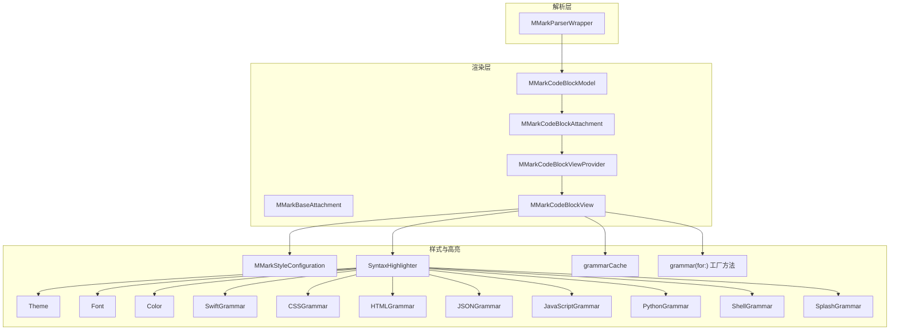

**图表来源**
- [MMarkCodeBlockAttachment.swift:1-22](file://MMarkParser/Sources/Renderer/Attachments/MMarkCodeBlockAttachment/MMarkCodeBlockAttachment.swift#L1-L22)
- [MMarkCodeBlockModel.swift:1-46](file://MMarkParser/Sources/Renderer/Attachments/MMarkCodeBlockAttachment/MMarkCodeBlockModel.swift#L1-L46)
- [MMarkCodeBlockView.swift:1-180](file://MMarkParser/Sources/Renderer/Attachments/MMarkCodeBlockAttachment/MMarkCodeBlockView.swift#L1-L180)
- [MMarkCodeBlockViewProvider.swift:1-22](file://MMarkParser/Sources/Renderer/Attachments/MMarkCodeBlockAttachment/MMarkCodeBlockViewProvider.swift#L1-L22)
- [MMarkBaseAttachment.swift:1-60](file://MMarkParser/Sources/Renderer/Attachments/MMarkBaseAttachment/MMarkBaseAttachment.swift#L1-L60)
- [MMarkStyleConfiguration.swift:1-339](file://MMarkParser/Sources/Renderer/MMarkStyleConfiguration.swift#L1-L339)
- [SyntaxHighlighter.swift:1-92](file://Splash/Syntax/SyntaxHighlighter.swift#L1-L92)
- [SwiftGrammar.swift:1-668](file://Splash/Grammar/SwiftGrammar.swift#L1-L668)
- [CSSGrammar.swift:1-200](file://Splash/Grammar/CSSGrammar.swift#L1-L200)
- [HTMLGrammar.swift:1-250](file://Splash/Grammar/HTMLGrammar.swift#L1-L250)
- [JSONGrammar.swift:1-180](file://Splash/Grammar/JSONGrammar.swift#L1-L180)
- [JavaScriptGrammar.swift:1-300](file://Splash/Grammar/JavaScriptGrammar.swift#L1-L300)
- [PythonGrammar.swift:1-220](file://Splash/Grammar/PythonGrammar.swift#L1-L220)
- [ShellGrammar.swift:1-150](file://Splash/Grammar/ShellGrammar.swift#L1-L150)
- [SplashGrammar.swift:1-120](file://Splash/Grammar/SplashGrammar.swift#L1-L120)

**章节来源**
- [MMarkCodeBlockAttachment.swift:1-22](file://MMarkParser/Sources/Renderer/Attachments/MMarkCodeBlockAttachment/MMarkCodeBlockAttachment.swift#L1-L22)
- [MMarkCodeBlockModel.swift:1-46](file://MMarkParser/Sources/Renderer/Attachments/MMarkCodeBlockAttachment/MMarkCodeBlockModel.swift#L1-L46)
- [MMarkCodeBlockView.swift:1-180](file://MMarkParser/Sources/Renderer/Attachments/MMarkCodeBlockAttachment/MMarkCodeBlockView.swift#L1-L180)
- [MMarkCodeBlockViewProvider.swift:1-22](file://MMarkParser/Sources/Renderer/Attachments/MMarkCodeBlockAttachment/MMarkCodeBlockViewProvider.swift#L1-L22)
- [MMarkBaseAttachment.swift:1-60](file://MMarkParser/Sources/Renderer/Attachments/MMarkBaseAttachment/MMarkBaseAttachment.swift#L1-L60)
- [MMarkStyleConfiguration.swift:1-339](file://MMarkParser/Sources/Renderer/MMarkStyleConfiguration.swift#L1-L339)
- [SyntaxHighlighter.swift:1-92](file://Splash/Syntax/SyntaxHighlighter.swift#L1-L92)
- [SwiftGrammar.swift:1-668](file://Splash/Grammar/SwiftGrammar.swift#L1-L668)

## 核心组件
- MMarkCodeBlockAttachment：继承自 MMarkBaseAttachment，负责计算附件的显示尺寸并约束宽度，避免因缩进或行距导致右侧裁剪。
- MMarkCodeBlockModel：继承自 MMarkBaseModel，封装代码文本的高亮结果、语言标识、原始代码与尺寸信息；提供工厂方法根据容器宽度与样式配置计算整体尺寸。
- MMarkCodeBlockView：UIView 子类，负责绘制代码块头部（语言标签与复制按钮）、滚动区域与不可编辑的代码文本视图；内置语法高亮生成逻辑，支持多语言语法高亮，采用懒加载工厂模式管理语法规则。
- MMarkCodeBlockViewProvider：NSTextAttachmentViewProvider 子类，实现懒加载，将模型转换为视图并启用 bounds 跟踪。
- MMarkBaseAttachment/Model：通用附件基类与模型基类，统一管理附件类型、内容模型与视图提供者。

**章节来源**
- [MMarkCodeBlockAttachment.swift:5-21](file://MMarkParser/Sources/Renderer/Attachments/MMarkCodeBlockAttachment/MMarkCodeBlockAttachment.swift#L5-L21)
- [MMarkCodeBlockModel.swift:5-46](file://MMarkParser/Sources/Renderer/Attachments/MMarkCodeBlockAttachment/MMarkCodeBlockModel.swift#L5-L46)
- [MMarkCodeBlockView.swift:5-180](file://MMarkParser/Sources/Renderer/Attachments/MMarkCodeBlockAttachment/MMarkCodeBlockView.swift#L5-L180)
- [MMarkCodeBlockViewProvider.swift:5-22](file://MMarkParser/Sources/Renderer/Attachments/MMarkCodeBlockAttachment/MMarkCodeBlockViewProvider.swift#L5-L22)
- [MMarkBaseAttachment.swift:12-60](file://MMarkParser/Sources/Renderer/Attachments/MMarkBaseAttachment/MMarkBaseAttachment.swift#L12-L60)
- [MMarkBaseModel.swift:3-10](file://MMarkParser/Sources/Renderer/Attachments/MMarkBaseAttachment/MMarkBaseModel.swift#L3-L10)

## 架构总览
代码块从解析到渲染的端到端流程如下：

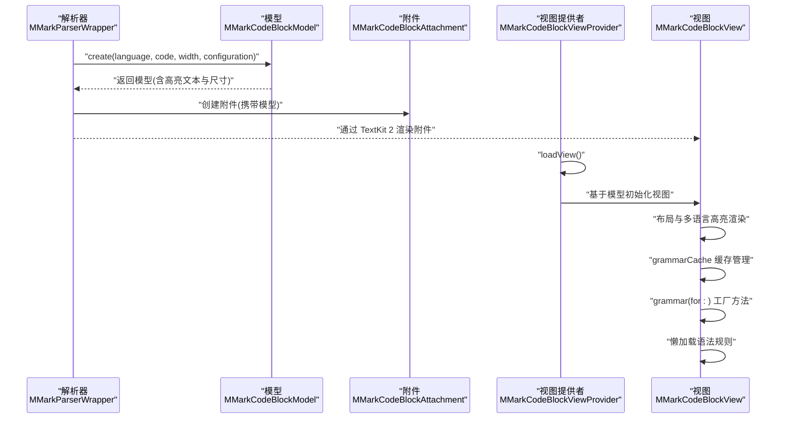

**图表来源**
- [MMarkParserWrapper.swift:561-587](file://MMarkParser/Sources/Parser/MMarkParserWrapper.swift#L561-L587)
- [MMarkCodeBlockModel.swift:22-44](file://MMarkParser/Sources/Renderer/Attachments/MMarkCodeBlockAttachment/MMarkCodeBlockModel.swift#L22-L44)
- [MMarkCodeBlockAttachment.swift:5-21](file://MMarkParser/Sources/Renderer/Attachments/MMarkCodeBlockAttachment/MMarkCodeBlockAttachment.swift#L5-L21)
- [MMarkCodeBlockViewProvider.swift:12-20](file://MMarkParser/Sources/Renderer/Attachments/MMarkCodeBlockAttachment/MMarkCodeBlockViewProvider.swift#L12-L20)
- [MMarkCodeBlockView.swift:44-58](file://MMarkParser/Sources/Renderer/Attachments/MMarkCodeBlockAttachment/MMarkCodeBlockView.swift#L44-L58)

## 详细组件分析

### MMarkCodeBlockAttachment：尺寸约束与显示边界
- 作用：在 TextKit 2 布局阶段，根据行片段宽度与模型尺寸，计算并返回附件的最终显示矩形，防止因缩进或行距导致右边缘被截断。
- 关键点：宽度取"模型宽度"与"行片段宽度"的较小值，并减去微小偏移，保证视觉完整。

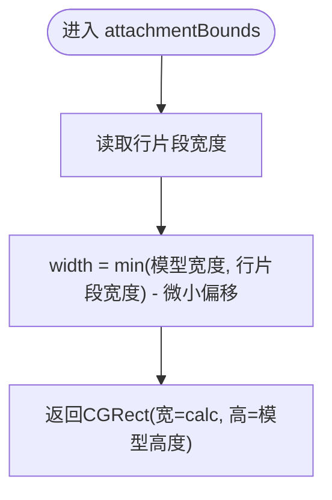

**图表来源**
- [MMarkCodeBlockAttachment.swift:15-20](file://MMarkParser/Sources/Renderer/Attachments/MMarkCodeBlockAttachment/MMarkCodeBlockAttachment.swift#L15-L20)

**章节来源**
- [MMarkCodeBlockAttachment.swift:15-20](file://MMarkParser/Sources/Renderer/Attachments/MMarkCodeBlockAttachment/MMarkCodeBlockAttachment.swift#L15-L20)

### MMarkCodeBlockModel：数据结构与尺寸计算
- 数据字段：代码文本宽度、高度、高亮后的富文本、语言标识、原始代码、整体尺寸。
- 工厂方法 create：
  - 从样式配置读取代码块头部背景、主体背景、圆角、头部高度、内边距。
  - 调用视图的高亮函数生成富文本。
  - 计算高亮文本的自然尺寸（不换行），用于滚动区域适配。
  - 计算总高度：头部高度 + 文本高度 + 内边距×2。
  - 返回模型实例。

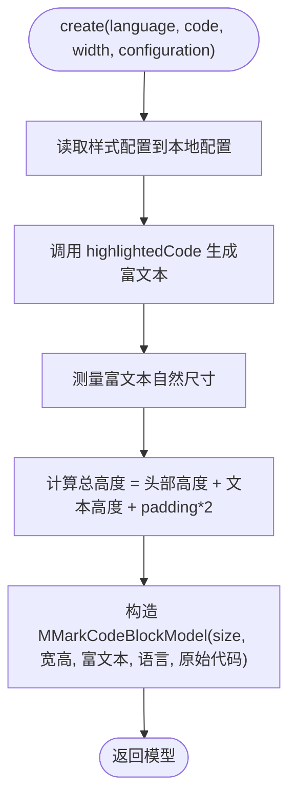

**图表来源**
- [MMarkCodeBlockModel.swift:22-44](file://MMarkParser/Sources/Renderer/Attachments/MMarkCodeBlockAttachment/MMarkCodeBlockModel.swift#L22-L44)

**章节来源**
- [MMarkCodeBlockModel.swift:13-44](file://MMarkParser/Sources/Renderer/Attachments/MMarkCodeBlockAttachment/MMarkCodeBlockModel.swift#L13-L44)

### MMarkCodeBlockView：渲染机制与视觉效果
- 结构组成：头部视图（含语言标签与复制按钮）、滚动视图、不可编辑的代码文本视图。
- 视觉配置：
  - 背景色：头部背景、主体背景。
  - 圆角：整体视图圆角。
  - 内边距：统一的 padding。
  - 字体：来自样式配置的等宽字体。
- 交互：复制按钮将原始代码写入系统剪贴板。
- 高亮：当存在语言标识时，使用 Splash 语法高亮引擎支持多语言；否则直接以纯文本呈现。

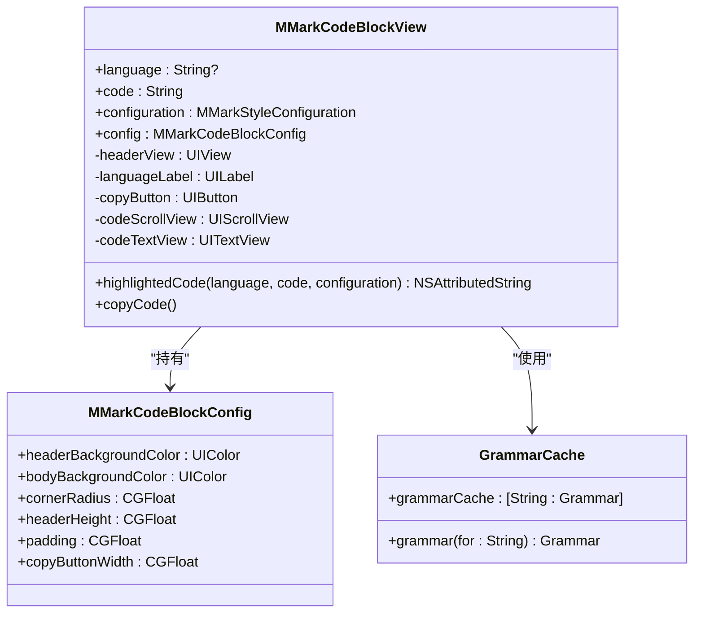

**图表来源**
- [MMarkCodeBlockView.swift:5-180](file://MMarkParser/Sources/Renderer/Attachments/MMarkCodeBlockAttachment/MMarkCodeBlockView.swift#L5-L180)

**章节来源**
- [MMarkCodeBlockView.swift:14-180](file://MMarkParser/Sources/Renderer/Attachments/MMarkCodeBlockAttachment/MMarkCodeBlockView.swift#L14-L180)

### MMarkCodeBlockViewProvider：懒加载与生命周期
- 懒加载：首次需要显示时，从文本附件中取出模型，创建视图并赋给 self.view。
- 生命周期：启用 tracksTextAttachmentViewBounds，使 TextKit 能够跟踪附件视图的边界变化，确保布局一致性。

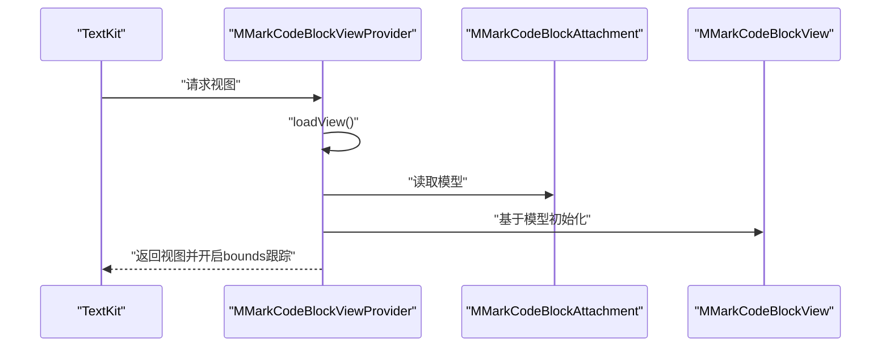

**图表来源**
- [MMarkCodeBlockViewProvider.swift:12-20](file://MMarkParser/Sources/Renderer/Attachments/MMarkCodeBlockAttachment/MMarkCodeBlockViewProvider.swift#L12-L20)

**章节来源**
- [MMarkCodeBlockViewProvider.swift:8-21](file://MMarkParser/Sources/Renderer/Attachments/MMarkCodeBlockAttachment/MMarkCodeBlockViewProvider.swift#L8-L21)

## 多语言语法高亮系统

### 语言映射系统
MMarkParser 现已支持完整的多语言语法高亮系统，通过语言映射机制自动选择相应的语法规则：

- **Swift 语言**：使用 SwiftGrammar 提供完整的 Swift 语法高亮支持
- **CSS 语言**：使用 CSSGrammar 支持层叠样式表语法高亮
- **HTML 语言**：使用 HTMLGrammar 提供 HTML 标签和属性高亮
- **JSON 语言**：使用 JSONGrammar 支持 JSON 数据结构高亮
- **JavaScript 语言**：使用 JavaScriptGrammar 提供 JavaScript 代码高亮
- **Python 语言**：使用 PythonGrammar 支持 Python 语法高亮
- **Shell 语言**：使用 ShellGrammar 提供 Shell 脚本高亮
- **Splash 语言**：使用 SplashGrammar 支持 Splash DSL 语法高亮

### 语法高亮渲染流程改进
改进后的语法高亮渲染流程具有以下特点：

1. **智能语言检测**：根据代码块的语言标识自动匹配相应的语法规则
2. **统一高亮引擎**：所有语言共享同一个 SyntaxHighlighter 引擎
3. **主题一致性**：所有语言使用相同的 Theme 和样式配置
4. **性能优化**：缓存常用语法规则和主题配置

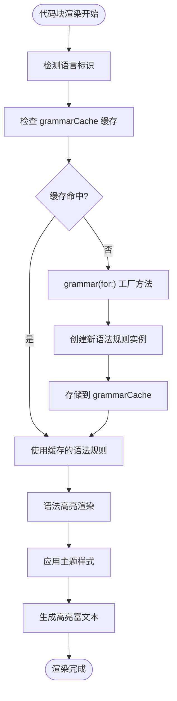

**图表来源**
- [MMarkCodeBlockView.swift:155-182](file://MMarkParser/Sources/Renderer/Attachments/MMarkCodeBlockAttachment/MMarkCodeBlockView.swift#L155-L182)
- [SyntaxHighlighter.swift:15-31](file://Splash/Syntax/SyntaxHighlighter.swift#L15-L31)

**章节来源**
- [MMarkCodeBlockView.swift:155-182](file://MMarkParser/Sources/Renderer/Attachments/MMarkCodeBlockAttachment/MMarkCodeBlockView.swift#L155-L182)
- [SyntaxHighlighter.swift:15-31](file://Splash/Syntax/SyntaxHighlighter.swift#L15-L31)

### 语法高亮集成与配置
- **高亮引擎**：使用 SyntaxHighlighter，输出格式为 AttributedStringOutputFormat，主题由 Theme 提供，字体由 Font 抽象承载。
- **多语言语法规则**：支持 8 种主流编程语言的语法高亮规则，覆盖关键字、字符串、注释、数字、类型、调用、属性等多种规则。
- **主题与样式**：Theme 持有字体、普通文本颜色、背景色与 token 颜色映射；MMarkStyleConfiguration 的 codeBlockStyle 提供等宽字体与文本颜色；MMarkCodeBlockView 的 MMarkCodeBlockConfig 控制头部/主体背景、圆角、内边距等。

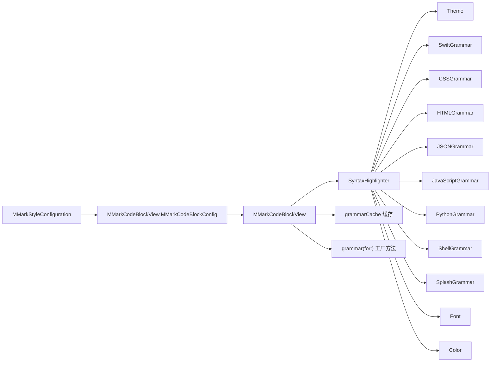

**图表来源**
- [MMarkStyleConfiguration.swift:97-108](file://MMarkParser/Sources/Renderer/MMarkStyleConfiguration.swift#L97-L108)
- [MMarkCodeBlockView.swift:14-25](file://MMarkParser/Sources/Renderer/Attachments/MMarkCodeBlockAttachment/MMarkCodeBlockView.swift#L14-L25)
- [MMarkCodeBlockView.swift:155-182](file://MMarkParser/Sources/Renderer/Attachments/MMarkCodeBlockAttachment/MMarkCodeBlockView.swift#L155-L182)
- [SyntaxHighlighter.swift:15-31](file://Splash/Syntax/SyntaxHighlighter.swift#L15-L31)
- [Theme.swift:20-39](file://Splash/Theming/Theme.swift#L20-L39)
- [Font.swift:15-34](file://Splash/Theming/Font.swift#L15-L34)
- [Color.swift:16-21](file://Splash/Theming/Color.swift#L16-L21)

**章节来源**
- [MMarkStyleConfiguration.swift:97-108](file://MMarkParser/Sources/Renderer/MMarkStyleConfiguration.swift#L97-L108)
- [MMarkCodeBlockView.swift:153-168](file://MMarkParser/Sources/Renderer/Attachments/MMarkCodeBlockAttachment/MMarkCodeBlockView.swift#L153-L168)
- [MMarkCodeBlockView.swift:155-182](file://MMarkParser/Sources/Renderer/Attachments/MMarkCodeBlockAttachment/MMarkCodeBlockView.swift#L155-L182)
- [SyntaxHighlighter.swift:15-31](file://Splash/Syntax/SyntaxHighlighter.swift#L15-L31)
- [Theme.swift:20-39](file://Splash/Theming/Theme.swift#L20-L39)
- [Font.swift:15-34](file://Splash/Theming/Font.swift#L15-L34)
- [Color.swift:16-21](file://Splash/Theming/Color.swift#L16-L21)

### 自定义配置选项与扩展建议
- **主题选择**：通过 MMarkStyleConfiguration 的 codeBlockStyle 与 MMarkCodeBlockView 的 MMarkCodeBlockConfig 调整字体、文本颜色、头部/主体背景、圆角与内边距。
- **行号显示**：当前实现未内置行号。可在现有基础上扩展一个独立的行号列视图，并与滚动视图联动同步滚动。
- **复制功能**：已内置复制按钮，可进一步增强为长按菜单或快捷操作提示。
- **多语言高亮**：系统现已支持 8 种主流语言的语法高亮，可通过语言标识自动切换相应语法规则。

**章节来源**
- [MMarkStyleConfiguration.swift:97-108](file://MMarkParser/Sources/Renderer/MMarkStyleConfiguration.swift#L97-L108)
- [MMarkCodeBlockView.swift:14-25](file://MMarkParser/Sources/Renderer/Attachments/MMarkCodeBlockAttachment/MMarkCodeBlockView.swift#L14-L25)
- [MMarkCodeBlockView.swift:176-178](file://MMarkParser/Sources/Renderer/Attachments/MMarkCodeBlockAttachment/MMarkCodeBlockView.swift#L176-L178)

## 语法高亮工厂模式重构

### grammarCache 缓存机制
MMarkCodeBlockView 实现了高效的 grammarCache 缓存机制，用于存储已创建的语法规则实例：

- **缓存结构**：使用静态字典 `grammarCache: [String: Grammar] = [:]` 存储语言标识到语法规则的映射
- **缓存策略**：首次访问特定语言时创建语法规则实例并存储到缓存中
- **性能优势**：避免重复创建相同语言的语法规则，显著提升多代码块渲染性能
- **内存管理**：静态缓存随类加载而存在，生命周期与应用一致

### grammar(for:) 工厂方法实现
grammar(for:) 方法采用工厂模式设计，提供智能的语言识别和语法规则创建：

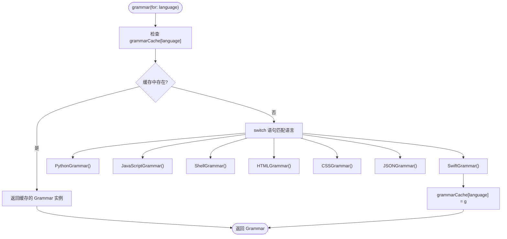

**图表来源**
- [MMarkCodeBlockView.swift:155-182](file://MMarkParser/Sources/Renderer/Attachments/MMarkCodeBlockAttachment/MMarkCodeBlockView.swift#L155-L182)

### 语言支持映射表
工厂方法支持的语言映射关系如下：

| 语言标识 | 对应语法规则 |
|---------|-------------|
| python, py, python3 | PythonGrammar |
| javascript, js, jsx, typescript, ts, tsx, mjs, cjs | JavaScriptGrammar |
| bash, sh, shell, zsh, fish, ksh | ShellGrammar |
| html, htm, xhtml, xml, svg | HTMLGrammar |
| css, scss, sass, less | CSSGrammar |
| json, jsonc | JSONGrammar |
| 其他 | SwiftGrammar |

### 性能优化策略
- **懒加载**：仅在需要时创建语法规则实例
- **缓存复用**：重复使用的语言直接从缓存获取
- **工厂封装**：统一的语言创建逻辑便于维护和扩展
- **内存效率**：避免重复创建相同类型的语法规则对象

**章节来源**
- [MMarkCodeBlockView.swift:155-182](file://MMarkParser/Sources/Renderer/Attachments/MMarkCodeBlockAttachment/MMarkCodeBlockView.swift#L155-L182)

## 依赖关系分析
- **组件耦合**：
  - MMarkCodeBlockAttachment 依赖 MMarkCodeBlockModel（强依赖）。
  - MMarkCodeBlockView 依赖 MMarkStyleConfiguration 与 SyntaxHighlighter。
  - MMarkCodeBlockViewProvider 依赖 MMarkCodeBlockAttachment 与 MMarkCodeBlockView。
  - MMarkBaseAttachment 作为工厂，按类型返回对应 ViewProvider。
- **外部依赖**：
  - Splash 语法高亮库（SyntaxHighlighter、Theme、多语言 Grammar、Font、Color）。
  - UIKit（NSTextAttachment、NSTextAttachmentViewProvider、UIView 等）。
  - TextKit 2（布局与附件渲染）。

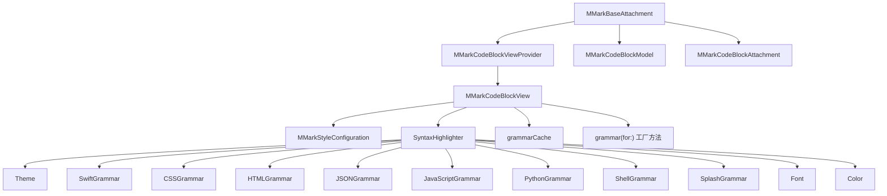

**图表来源**
- [MMarkBaseAttachment.swift:32-58](file://MMarkParser/Sources/Renderer/Attachments/MMarkBaseAttachment/MMarkBaseAttachment.swift#L32-L58)
- [MMarkCodeBlockAttachment.swift:5-21](file://MMarkParser/Sources/Renderer/Attachments/MMarkCodeBlockAttachment/MMarkCodeBlockAttachment.swift#L5-L21)
- [MMarkCodeBlockViewProvider.swift:5-22](file://MMarkParser/Sources/Renderer/Attachments/MMarkCodeBlockAttachment/MMarkCodeBlockViewProvider.swift#L5-L22)
- [MMarkCodeBlockView.swift:5-180](file://MMarkParser/Sources/Renderer/Attachments/MMarkCodeBlockAttachment/MMarkCodeBlockView.swift#L5-L180)
- [MMarkStyleConfiguration.swift:97-108](file://MMarkParser/Sources/Renderer/MMarkStyleConfiguration.swift#L97-L108)
- [SyntaxHighlighter.swift:15-31](file://Splash/Syntax/SyntaxHighlighter.swift#L15-L31)
- [Theme.swift:20-39](file://Splash/Theming/Theme.swift#L20-L39)
- [SwiftGrammar.swift:11-39](file://Splash/Grammar/SwiftGrammar.swift#L11-L39)
- [CSSGrammar.swift:1-200](file://Splash/Grammar/CSSGrammar.swift#L1-L200)
- [HTMLGrammar.swift:1-250](file://Splash/Grammar/HTMLGrammar.swift#L1-L250)
- [JSONGrammar.swift:1-180](file://Splash/Grammar/JSONGrammar.swift#L1-L180)
- [JavaScriptGrammar.swift:1-300](file://Splash/Grammar/JavaScriptGrammar.swift#L1-L300)
- [PythonGrammar.swift:1-220](file://Splash/Grammar/PythonGrammar.swift#L1-L220)
- [ShellGrammar.swift:1-150](file://Splash/Grammar/ShellGrammar.swift#L1-L150)
- [SplashGrammar.swift:1-120](file://Splash/Grammar/SplashGrammar.swift#L1-L120)
- [Font.swift:15-34](file://Splash/Theming/Font.swift#L15-L34)
- [Color.swift:16-21](file://Splash/Theming/Color.swift#L16-L21)

**章节来源**
- [MMarkBaseAttachment.swift:32-58](file://MMarkParser/Sources/Renderer/Attachments/MMarkBaseAttachment/MMarkBaseAttachment.swift#L32-L58)
- [MMarkCodeBlockAttachment.swift:5-21](file://MMarkParser/Sources/Renderer/Attachments/MMarkCodeBlockAttachment/MMarkCodeBlockAttachment.swift#L5-L21)
- [MMarkCodeBlockViewProvider.swift:5-22](file://MMarkParser/Sources/Renderer/Attachments/MMarkCodeBlockAttachment/MMarkCodeBlockViewProvider.swift#L5-L22)
- [MMarkCodeBlockView.swift:5-180](file://MMarkParser/Sources/Renderer/Attachments/MMarkCodeBlockAttachment/MMarkCodeBlockView.swift#L5-L180)
- [MMarkStyleConfiguration.swift:97-108](file://MMarkParser/Sources/Renderer/MMarkStyleConfiguration.swift#L97-L108)
- [SyntaxHighlighter.swift:15-31](file://Splash/Syntax/SyntaxHighlighter.swift#L15-L31)
- [Theme.swift:20-39](file://Splash/Theming/Theme.swift#L20-L39)
- [SwiftGrammar.swift:11-39](file://Splash/Grammar/SwiftGrammar.swift#L11-L39)
- [CSSGrammar.swift:1-200](file://Splash/Grammar/CSSGrammar.swift#L1-L200)
- [HTMLGrammar.swift:1-250](file://Splash/Grammar/HTMLGrammar.swift#L1-L250)
- [JSONGrammar.swift:1-180](file://Splash/Grammar/JSONGrammar.swift#L1-L180)
- [JavaScriptGrammar.swift:1-300](file://Splash/Grammar/JavaScriptGrammar.swift#L1-L300)
- [PythonGrammar.swift:1-220](file://Splash/Grammar/PythonGrammar.swift#L1-L220)
- [ShellGrammar.swift:1-150](file://Splash/Grammar/ShellGrammar.swift#L1-L150)
- [SplashGrammar.swift:1-120](file://Splash/Grammar/SplashGrammar.swift#L1-L120)
- [Font.swift:15-34](file://Splash/Theming/Font.swift#L15-L34)
- [Color.swift:16-21](file://Splash/Theming/Color.swift#L16-L21)

## 性能考量
- **高亮成本**：语法高亮在模型创建阶段执行，建议对长代码块进行分页或延迟高亮策略，避免主线程阻塞。
- **布局测量**：自然尺寸计算仅在模型创建时进行一次，后续视图复用时直接使用模型尺寸，降低重复计算。
- **滚动优化**：代码文本视图禁用滚动，滚动由外层 UIScrollView 承担，减少内部滚动开销。
- **字体与主题**：字体与主题对象应尽量复用，避免频繁创建。
- **多语言缓存**：新增的语言映射和语法规则缓存机制，减少重复解析开销。
- **工厂模式优化**：grammarCache 缓存机制避免重复创建相同语言的语法规则实例，显著提升多代码块渲染性能。

## 故障排查指南
- **附件未显示或被裁剪**
  - 检查 attachmentBounds 是否正确约束宽度；确认行片段宽度与模型宽度的关系。
  - 参考：[MMarkCodeBlockAttachment.swift:15-20](file://MMarkParser/Sources/Renderer/Attachments/MMarkCodeBlockAttachment/MMarkCodeBlockAttachment.swift#L15-L20)
- **语法高亮未生效**
  - 确认语言标识非空且在支持列表中；检查对应语法规则是否存在。
  - 检查主题与字体资源是否可用。
  - 参考：[MMarkCodeBlockView.swift:153-168](file://MMarkParser/Sources/Renderer/Attachments/MMarkCodeBlockAttachment/MMarkCodeBlockView.swift#L153-L168)
- **多语言高亮错误**
  - 确认语言标识与语法规则映射正确。
  - 检查对应 Grammar 文件是否正确导入。
  - 参考：[MMarkCodeBlockView.swift:155-182](file://MMarkParser/Sources/Renderer/Attachments/MMarkCodeBlockAttachment/MMarkCodeBlockView.swift#L155-L182)
- **复制功能无效**
  - 确认复制按钮事件绑定成功，剪贴板权限正常。
  - 参考：[MMarkCodeBlockView.swift:176-178](file://MMarkParser/Sources/Renderer/Attachments/MMarkCodeBlockAttachment/MMarkCodeBlockView.swift#L176-L178)
- **视图未懒加载**
  - 确保 NSTextAttachmentViewProvider 的 loadView 被触发；检查附件类型与提供者映射。
  - 参考：[MMarkCodeBlockViewProvider.swift:12-20](file://MMarkParser/Sources/Renderer/Attachments/MMarkCodeBlockAttachment/MMarkCodeBlockViewProvider.swift#L12-L20)
- **语法高亮性能问题**
  - 检查 grammarCache 是否正常工作，确认缓存命中率。
  - 确认语言标识标准化处理，避免重复创建不同格式的语言标识实例。
  - 参考：[MMarkCodeBlockView.swift:155-182](file://MMarkParser/Sources/Renderer/Attachments/MMarkCodeBlockAttachment/MMarkCodeBlockView.swift#L155-L182)

**章节来源**
- [MMarkCodeBlockAttachment.swift:15-20](file://MMarkParser/Sources/Renderer/Attachments/MMarkCodeBlockAttachment/MMarkCodeBlockAttachment.swift#L15-L20)
- [MMarkCodeBlockView.swift:153-168](file://MMarkParser/Sources/Renderer/Attachments/MMarkCodeBlockAttachment/MMarkCodeBlockView.swift#L153-L168)
- [MMarkCodeBlockView.swift:155-182](file://MMarkParser/Sources/Renderer/Attachments/MMarkCodeBlockAttachment/MMarkCodeBlockView.swift#L155-L182)
- [MMarkCodeBlockView.swift:176-178](file://MMarkParser/Sources/Renderer/Attachments/MMarkCodeBlockAttachment/MMarkCodeBlockView.swift#L176-L178)
- [MMarkCodeBlockViewProvider.swift:12-20](file://MMarkParser/Sources/Renderer/Attachments/MMarkCodeBlockAttachment/MMarkCodeBlockViewProvider.swift#L12-L20)

## 结论
MMarkCodeBlockAttachment 通过"模型-附件-视图-提供者"的清晰分层，实现了代码块的高效渲染与多语言语法高亮显示。其尺寸约束保障了在复杂段落环境下的视觉完整性；懒加载机制与 TextKit 2 的集成提升了性能与灵活性。最新的语法高亮系统重构从静态语法映射升级为懒加载工厂模式，通过 grammarCache 缓存机制和 grammar(for:) 工厂方法，显著提升了多语言语法高亮的性能表现。新增的多语言语法高亮系统通过完善的语言映射和语法规则，支持 8 种主流编程语言的语法高亮。结合 MMarkStyleConfiguration 与 Splash 语法高亮，用户可轻松定制外观与高亮行为。未来可在行号、行内复制菜单、更多语言支持等方面进一步扩展。

## 附录

### 使用示例（基于仓库示例文档）
- 示例 Markdown 中包含多种语言的代码块，解析后将生成对应的代码块附件与视图。
- 参考路径：[SampleMarkdown.swift:415-496](file://cocoapod_demo/cocoapod_demo/SampleMarkdown.swift#L415-L496)

**章节来源**
- [SampleMarkdown.swift:415-496](file://cocoapod_demo/cocoapod_demo/SampleMarkdown.swift#L415-L496)

### 关键流程图（从解析到渲染）
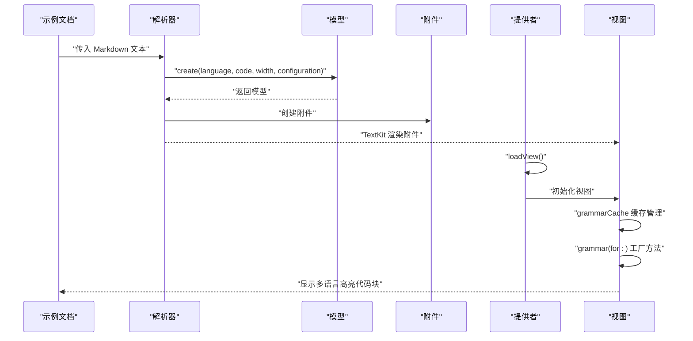

**图表来源**
- [SampleMarkdown.swift:415-496](file://cocoapod_demo/cocoapod_demo/SampleMarkdown.swift#L415-L496)
- [MMarkParserWrapper.swift:561-587](file://MMarkParser/Sources/Parser/MMarkParserWrapper.swift#L561-L587)
- [MMarkCodeBlockModel.swift:22-44](file://MMarkParser/Sources/Renderer/Attachments/MMarkCodeBlockAttachment/MMarkCodeBlockModel.swift#L22-L44)
- [MMarkCodeBlockViewProvider.swift:12-20](file://MMarkParser/Sources/Renderer/Attachments/MMarkCodeBlockAttachment/MMarkCodeBlockViewProvider.swift#L12-L20)
- [MMarkCodeBlockView.swift:44-58](file://MMarkParser/Sources/Renderer/Attachments/MMarkCodeBlockAttachment/MMarkCodeBlockView.swift#L44-L58)