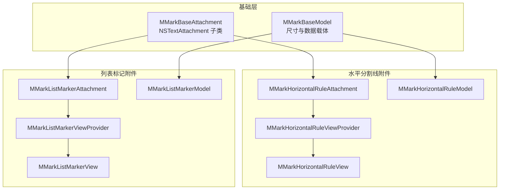
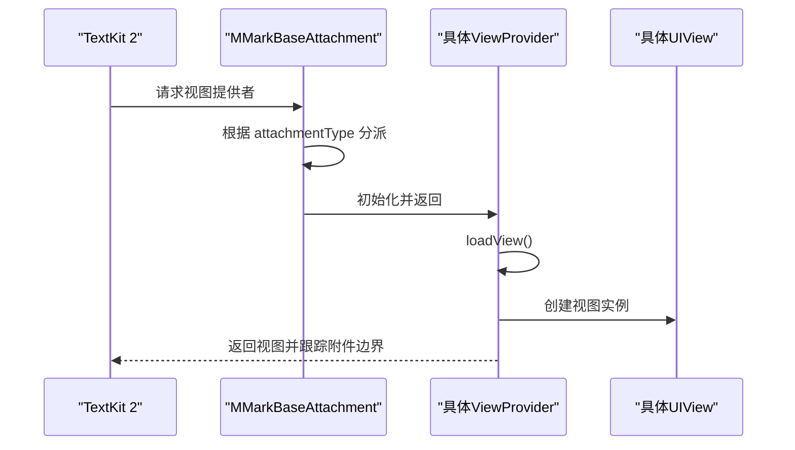
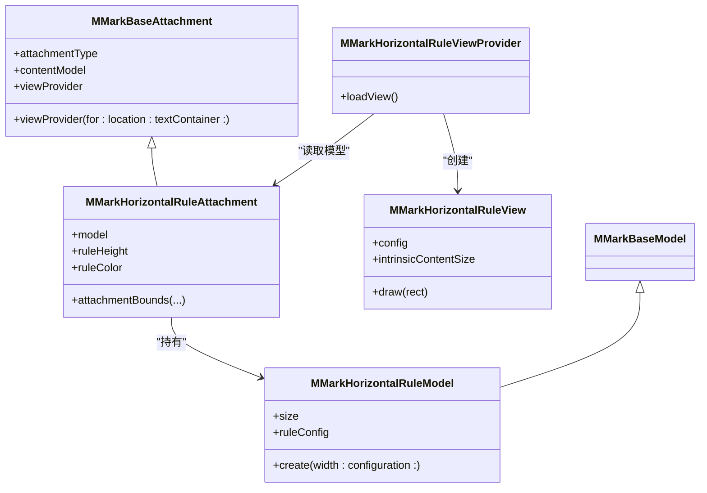
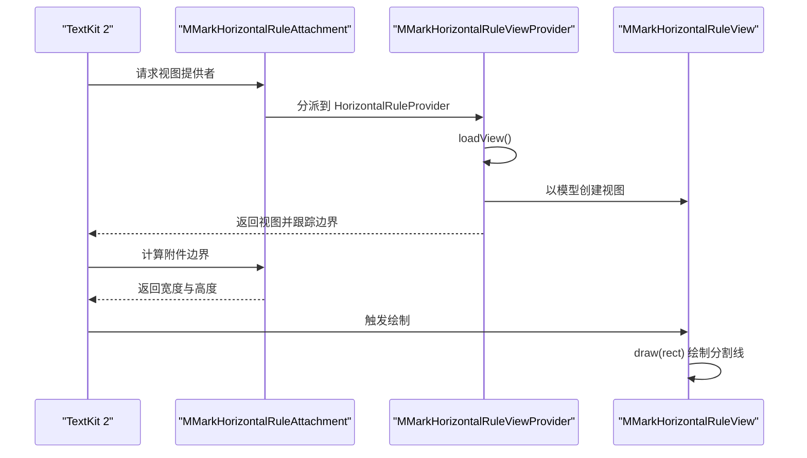
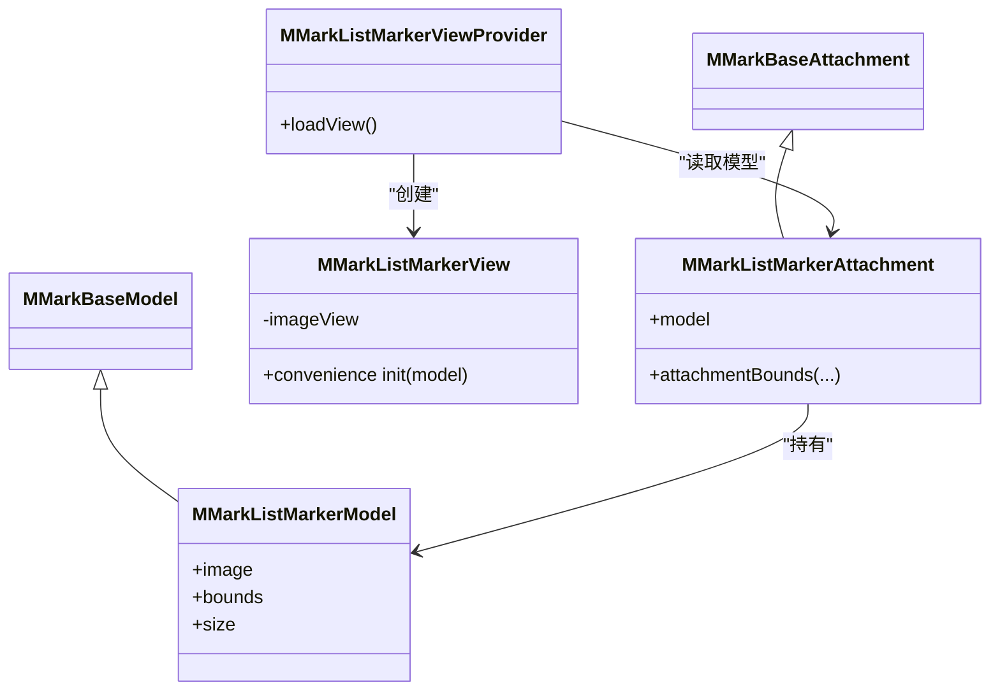
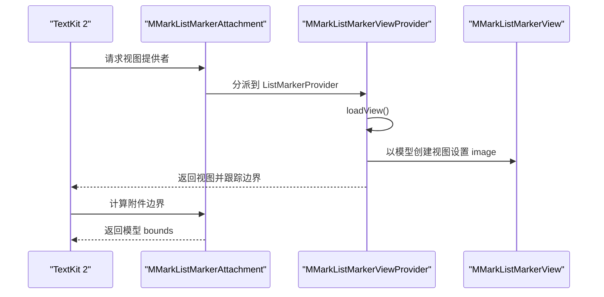
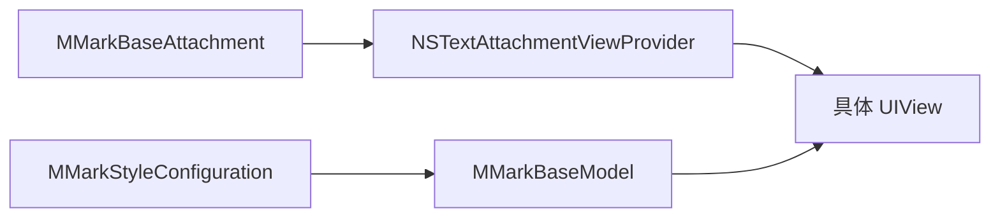

# 其他附件类型

<cite>
**本文引用的文件**
- [MMarkHorizontalRuleAttachment.swift](file://MMarkParser/Sources/Renderer/Attachments/MMarkHorizontalRuleAttachment/MMarkHorizontalRuleAttachment.swift)
- [MMarkHorizontalRuleModel.swift](file://MMarkParser/Sources/Renderer/Attachments/MMarkHorizontalRuleAttachment/MMarkHorizontalRuleModel.swift)
- [MMarkHorizontalRuleView.swift](file://MMarkParser/Sources/Renderer/Attachments/MMarkHorizontalRuleAttachment/MMarkHorizontalRuleView.swift)
- [MMarkHorizontalRuleViewProvider.swift](file://MMarkParser/Sources/Renderer/Attachments/MMarkHorizontalRuleAttachment/MMarkHorizontalRuleViewProvider.swift)
- [MMarkListMarkerAttachment.swift](file://MMarkParser/Sources/Renderer/Attachments/MMarkListMarkerAttachment/MMarkListMarkerAttachment.swift)
- [MMarkListMarkerModel.swift](file://MMarkParser/Sources/Renderer/Attachments/MMarkListMarkerAttachment/MMarkListMarkerModel.swift)
- [MMarkListMarkerView.swift](file://MMarkParser/Sources/Renderer/Attachments/MMarkListMarkerAttachment/MMarkListMarkerView.swift)
- [MMarkListMarkerViewProvider.swift](file://MMarkParser/Sources/Renderer/Attachments/MMarkListMarkerAttachment/MMarkListMarkerViewProvider.swift)
- [MMarkBaseAttachment.swift](file://MMarkParser/Sources/Renderer/Attachments/MMarkBaseAttachment/MMarkBaseAttachment.swift)
- [MMarkBaseModel.swift](file://MMarkParser/Sources/Renderer/Attachments/MMarkBaseAttachment/MMarkBaseModel.swift)
- [MMarkStyleConfiguration.swift](file://MMarkParser/Sources/Renderer/MMarkStyleConfiguration.swift)
- [SampleMarkdown.swift](file://cocoapod_demo/cocoapod_demo/SampleMarkdown.swift)
</cite>

## 目录
1. [简介](#简介)
2. [项目结构](#项目结构)
3. [核心组件](#核心组件)
4. [架构总览](#架构总览)
5. [详细组件分析](#详细组件分析)
6. [依赖分析](#依赖分析)
7. [性能考虑](#性能考虑)
8. [故障排查指南](#故障排查指南)
9. [结论](#结论)
10. [附录](#附录)

## 简介
本章节聚焦于 MMarkParser 中“其他附件类型”的两类实现：水平分割线附件（MMarkHorizontalRuleAttachment）与列表标记附件（MMarkListMarkerAttachment）。我们将深入解释它们的绘制机制、样式配置、与基础附件架构的继承关系与扩展策略，并给出自定义配置与使用示例，帮助读者在不熟悉底层细节的情况下也能高效地进行样式定制与集成。

## 项目结构
围绕“其他附件类型”，相关源码位于 Renderer/Attachments 目录下，分别以独立子目录组织，遵循“附件类 + 模型 + 视图 + 视图提供者”的四件套架构。基础类 MMarkBaseAttachment 与 MMarkBaseModel 提供统一的生命周期与数据承载能力，具体附件通过各自的 ViewProvider 将 NSTextAttachment 与 UIView 绑定起来，交由 TextKit 2 的布局系统管理。

图表来源
- [MMarkBaseAttachment.swift:12-59](file://MMarkParser/Sources/Renderer/Attachments/MMarkBaseAttachment/MMarkBaseAttachment.swift#L12-L59)
- [MMarkBaseModel.swift:3-9](file://MMarkParser/Sources/Renderer/Attachments/MMarkBaseAttachment/MMarkBaseModel.swift#L3-L9)
- [MMarkHorizontalRuleAttachment.swift:6-37](file://MMarkParser/Sources/Renderer/Attachments/MMarkHorizontalRuleAttachment/MMarkHorizontalRuleAttachment.swift#L6-L37)
- [MMarkHorizontalRuleModel.swift:6-26](file://MMarkParser/Sources/Renderer/Attachments/MMarkHorizontalRuleAttachment/MMarkHorizontalRuleModel.swift#L6-L26)
- [MMarkHorizontalRuleView.swift:6-56](file://MMarkParser/Sources/Renderer/Attachments/MMarkHorizontalRuleAttachment/MMarkHorizontalRuleView.swift#L6-L56)
- [MMarkHorizontalRuleViewProvider.swift:6-23](file://MMarkParser/Sources/Renderer/Attachments/MMarkHorizontalRuleAttachment/MMarkHorizontalRuleViewProvider.swift#L6-L23)
- [MMarkListMarkerAttachment.swift:5-17](file://MMarkParser/Sources/Renderer/Attachments/MMarkListMarkerAttachment/MMarkListMarkerAttachment.swift#L5-L17)
- [MMarkListMarkerModel.swift:6-15](file://MMarkParser/Sources/Renderer/Attachments/MMarkListMarkerAttachment/MMarkListMarkerModel.swift#L6-L15)
- [MMarkListMarkerView.swift:6-32](file://MMarkParser/Sources/Renderer/Attachments/MMarkListMarkerAttachment/MMarkListMarkerView.swift#L6-L32)
- [MMarkListMarkerViewProvider.swift:6-18](file://MMarkParser/Sources/Renderer/Attachments/MMarkListMarkerAttachment/MMarkListMarkerViewProvider.swift#L6-L18)

章节来源
- [MMarkBaseAttachment.swift:12-59](file://MMarkParser/Sources/Renderer/Attachments/MMarkBaseAttachment/MMarkBaseAttachment.swift#L12-L59)
- [MMarkBaseModel.swift:3-9](file://MMarkParser/Sources/Renderer/Attachments/MMarkBaseAttachment/MMarkBaseModel.swift#L3-L9)

## 核心组件
- 水平分割线附件（MMarkHorizontalRuleAttachment）
  - 作用：渲染一条水平分割线（thematic break），支持高度、颜色与上下内边距的配置。
  - 关键点：通过透明占位图避免 TextKit 2 布局阶段访问屏幕尺寸；提供模型驱动的绘制参数。
- 列表标记附件（MMarkListMarkerAttachment）
  - 作用：渲染列表项的标记（有序/无序），支持字符模式与图片模式两种渲染方式。
  - 关键点：模型持有预生成的图像与边界，视图直接以 UIImageView 展示，布局由模型提供的 bounds 控制。

章节来源
- [MMarkHorizontalRuleAttachment.swift:6-37](file://MMarkParser/Sources/Renderer/Attachments/MMarkHorizontalRuleAttachment/MMarkHorizontalRuleAttachment.swift#L6-L37)
- [MMarkListMarkerAttachment.swift:5-17](file://MMarkParser/Sources/Renderer/Attachments/MMarkListMarkerAttachment/MMarkListMarkerAttachment.swift#L5-L17)

## 架构总览
两类附件均遵循“附件类 + 模型 + 视图 + 视图提供者”的分层设计，通过 MMarkBaseAttachment 的统一入口分派到各自 ViewProvider，再由 ViewProvider 创建对应视图。模型负责数据与尺寸，视图负责绘制或展示，附件类负责与 TextKit 2 的交互与布局约束。

图表来源
- [MMarkBaseAttachment.swift:32-58](file://MMarkParser/Sources/Renderer/Attachments/MMarkBaseAttachment/MMarkBaseAttachment.swift#L32-L58)
- [MMarkHorizontalRuleViewProvider.swift:8-22](file://MMarkParser/Sources/Renderer/Attachments/MMarkHorizontalRuleAttachment/MMarkHorizontalRuleViewProvider.swift#L8-L22)
- [MMarkListMarkerViewProvider.swift:8-17](file://MMarkParser/Sources/Renderer/Attachments/MMarkListMarkerAttachment/MMarkListMarkerViewProvider.swift#L8-L17)

## 详细组件分析

### 水平分割线附件（MMarkHorizontalRuleAttachment）

- 绘制机制
  - 采用清屏背景，使用 Core Graphics 在 draw 中绘制矩形作为分割线，垂直居中放置，高度与颜色来自模型配置。
  - intrinsicContentSize 由配置的高度与上下内边距决定，保证 TextKit 2 正确测量。
- 样式配置
  - 通过 MMarkHorizontalRuleView.MMarkHorizontalRuleConfig 提供 ruleColor、ruleHeight、verticalPadding 三项配置。
  - MMarkHorizontalRuleModel.create(width:configuration:) 会基于全局样式配置（如 tableStyle.borderColor）初始化默认值，并计算总高度。
- 布局与尺寸
  - attachmentBounds 会取模型宽度与行宽之间的较大值，最小宽度保护避免过窄导致不可见。
  - 模型的 size 与 intrinsicContentSize 协同，确保渲染高度稳定。
- 与基础架构的关系
  - 继承自 MMarkBaseAttachment，复用统一的附件类型枚举与视图提供者分派逻辑。
  - 通过 MMarkHorizontalRuleViewProvider 将 NSTextAttachment 与 MMarkHorizontalRuleView 绑定。

图表来源
- [MMarkBaseAttachment.swift:12-59](file://MMarkParser/Sources/Renderer/Attachments/MMarkBaseAttachment/MMarkBaseAttachment.swift#L12-L59)
- [MMarkHorizontalRuleAttachment.swift:8-36](file://MMarkParser/Sources/Renderer/Attachments/MMarkHorizontalRuleAttachment/MMarkHorizontalRuleAttachment.swift#L8-L36)
- [MMarkHorizontalRuleModel.swift:6-25](file://MMarkParser/Sources/Renderer/Attachments/MMarkHorizontalRuleAttachment/MMarkHorizontalRuleModel.swift#L6-L25)
- [MMarkHorizontalRuleView.swift:6-56](file://MMarkParser/Sources/Renderer/Attachments/MMarkHorizontalRuleAttachment/MMarkHorizontalRuleView.swift#L6-L56)
- [MMarkHorizontalRuleViewProvider.swift:6-23](file://MMarkParser/Sources/Renderer/Attachments/MMarkHorizontalRuleAttachment/MMarkHorizontalRuleViewProvider.swift#L6-L23)

图表来源
- [MMarkHorizontalRuleAttachment.swift:33-36](file://MMarkParser/Sources/Renderer/Attachments/MMarkHorizontalRuleAttachment/MMarkHorizontalRuleAttachment.swift#L33-L36)
- [MMarkHorizontalRuleViewProvider.swift:12-22](file://MMarkParser/Sources/Renderer/Attachments/MMarkHorizontalRuleAttachment/MMarkHorizontalRuleViewProvider.swift#L12-L22)
- [MMarkHorizontalRuleView.swift:40-51](file://MMarkParser/Sources/Renderer/Attachments/MMarkHorizontalRuleAttachment/MMarkHorizontalRuleView.swift#L40-L51)

章节来源
- [MMarkHorizontalRuleAttachment.swift:6-37](file://MMarkParser/Sources/Renderer/Attachments/MMarkHorizontalRuleAttachment/MMarkHorizontalRuleAttachment.swift#L6-L37)
- [MMarkHorizontalRuleModel.swift:6-26](file://MMarkParser/Sources/Renderer/Attachments/MMarkHorizontalRuleAttachment/MMarkHorizontalRuleModel.swift#L6-L26)
- [MMarkHorizontalRuleView.swift:6-56](file://MMarkParser/Sources/Renderer/Attachments/MMarkHorizontalRuleAttachment/MMarkHorizontalRuleView.swift#L6-L56)
- [MMarkHorizontalRuleViewProvider.swift:6-23](file://MMarkParser/Sources/Renderer/Attachments/MMarkHorizontalRuleAttachment/MMarkHorizontalRuleViewProvider.swift#L6-L23)

### 列表标记附件（MMarkListMarkerAttachment）

- 渲染逻辑
  - 采用图片模式：模型直接持有 UIImage 与 CGRect(bounds)，视图以 UIImageView 居中展示。
  - 布局由模型 bounds 决定，attachmentBounds 直接返回模型尺寸，确保与列表缩进对齐。
- 与样式配置的关系
  - 列表标记的渲染模式（字符/图片）与字体、颜色、图标尺寸等由全局样式配置中的有序/无序列表样式控制。
  - 该配置影响解析阶段生成的 MMarkListMarkerModel 的内容（图像与尺寸），而非运行时视图的额外配置。
- 与基础架构的关系
  - 继承自 MMarkBaseAttachment，通过 MMarkListMarkerViewProvider 将 NSTextAttachment 与 MMarkListMarkerView 绑定。
  - 视图提供者负责创建视图并跟踪附件边界，保持与 TextKit 2 的一致行为。

图表来源
- [MMarkListMarkerAttachment.swift:5-17](file://MMarkParser/Sources/Renderer/Attachments/MMarkListMarkerAttachment/MMarkListMarkerAttachment.swift#L5-L17)
- [MMarkListMarkerModel.swift:6-15](file://MMarkParser/Sources/Renderer/Attachments/MMarkListMarkerAttachment/MMarkListMarkerModel.swift#L6-L15)
- [MMarkListMarkerView.swift:6-32](file://MMarkParser/Sources/Renderer/Attachments/MMarkListMarkerAttachment/MMarkListMarkerView.swift#L6-L32)
- [MMarkListMarkerViewProvider.swift:6-18](file://MMarkParser/Sources/Renderer/Attachments/MMarkListMarkerAttachment/MMarkListMarkerViewProvider.swift#L6-L18)

图表来源
- [MMarkListMarkerAttachment.swift:14-16](file://MMarkParser/Sources/Renderer/Attachments/MMarkListMarkerAttachment/MMarkListMarkerAttachment.swift#L14-L16)
- [MMarkListMarkerViewProvider.swift:12-17](file://MMarkParser/Sources/Renderer/Attachments/MMarkListMarkerAttachment/MMarkListMarkerViewProvider.swift#L12-L17)
- [MMarkListMarkerView.swift:24-27](file://MMarkParser/Sources/Renderer/Attachments/MMarkListMarkerAttachment/MMarkListMarkerView.swift#L24-L27)

章节来源
- [MMarkListMarkerAttachment.swift:5-17](file://MMarkParser/Sources/Renderer/Attachments/MMarkListMarkerAttachment/MMarkListMarkerAttachment.swift#L5-L17)
- [MMarkListMarkerModel.swift:6-15](file://MMarkParser/Sources/Renderer/Attachments/MMarkListMarkerAttachment/MMarkListMarkerModel.swift#L6-L15)
- [MMarkListMarkerView.swift:6-32](file://MMarkParser/Sources/Renderer/Attachments/MMarkListMarkerAttachment/MMarkListMarkerView.swift#L6-L32)
- [MMarkListMarkerViewProvider.swift:6-18](file://MMarkParser/Sources/Renderer/Attachments/MMarkListMarkerAttachment/MMarkListMarkerViewProvider.swift#L6-L18)

### 共同架构模式与实现策略
- 统一的数据与视图分离：模型负责数据与尺寸，视图负责绘制/展示，附件类负责与 TextKit 2 的交互。
- 视图提供者的集中分派：MMarkBaseAttachment 在 viewProvider(for:location:textContainer:) 中根据附件类型返回对应的 ViewProvider，简化扩展。
- 布局策略的一致性：两类附件均通过 attachmentBounds 与 intrinsicContentSize 确保 TextKit 2 正确测量与渲染。
- 样式配置的解耦：样式通过全局配置对象注入到模型工厂方法中，运行时视图仅消费配置，便于主题切换与动态更新。

章节来源
- [MMarkBaseAttachment.swift:32-58](file://MMarkParser/Sources/Renderer/Attachments/MMarkBaseAttachment/MMarkBaseAttachment.swift#L32-L58)
- [MMarkHorizontalRuleModel.swift:14-25](file://MMarkParser/Sources/Renderer/Attachments/MMarkHorizontalRuleAttachment/MMarkHorizontalRuleModel.swift#L14-L25)
- [MMarkHorizontalRuleView.swift:53-55](file://MMarkParser/Sources/Renderer/Attachments/MMarkHorizontalRuleAttachment/MMarkHorizontalRuleView.swift#L53-L55)
- [MMarkListMarkerAttachment.swift:14-16](file://MMarkParser/Sources/Renderer/Attachments/MMarkListMarkerAttachment/MMarkListMarkerAttachment.swift#L14-L16)

### 自定义配置与样式设置
- 水平分割线样式
  - 可通过 MMarkHorizontalRuleView.MMarkHorizontalRuleConfig 调整颜色、高度与上下内边距。
  - 模型工厂方法会参考全局样式配置（如 tableStyle.borderColor）初始化默认值，便于与整体主题保持一致。
- 列表标记样式
  - 有序/无序列表的渲染模式（字符/图片）、字体、颜色、图标尺寸等由全局样式配置中的 OrderedListStyle 与 UnorderedListStyle 控制。
  - 解析阶段会据此生成合适的 MMarkListMarkerModel（含 image 与 bounds），运行时无需额外配置即可呈现。

章节来源
- [MMarkHorizontalRuleView.swift:8-20](file://MMarkParser/Sources/Renderer/Attachments/MMarkHorizontalRuleAttachment/MMarkHorizontalRuleView.swift#L8-L20)
- [MMarkHorizontalRuleModel.swift:14-25](file://MMarkParser/Sources/Renderer/Attachments/MMarkHorizontalRuleAttachment/MMarkHorizontalRuleModel.swift#L14-L25)
- [MMarkStyleConfiguration.swift:48-85](file://MMarkParser/Sources/Renderer/MMarkStyleConfiguration.swift#L48-L85)

### 使用示例与协作说明
- 在 Markdown 中插入水平分割线
  - 支持三种常见语法：---、***、___。解析后会生成水平分割线附件，渲染为一条水平线。
  - 示例参见演示文档中的“分隔线测试”章节。
- 列表标记的协作
  - 有序/无序列表在渲染时会生成对应的 MMarkListMarkerAttachment，其视图提供者负责创建视图并绑定图像与尺寸。
  - 列表缩进与对齐由模型 bounds 与 TextKit 2 的布局系统共同保证。
- 与其他附件类型的协作
  - 所有附件共享同一视图提供者注册机制（通过 MMarkBaseAttachment.fileType），TextKit 2 在渲染时自动分派到对应 ViewProvider。
  - 附件类之间互不影响，仅通过统一的生命周期与布局接口协同工作。

章节来源
- [SampleMarkdown.swift:569-594](file://cocoapod_demo/cocoapod_demo/SampleMarkdown.swift#L569-L594)
- [MMarkBaseAttachment.swift:32-58](file://MMarkParser/Sources/Renderer/Attachments/MMarkBaseAttachment/MMarkBaseAttachment.swift#L32-L58)

## 依赖分析
- 组件耦合
  - 附件类与视图提供者之间为弱耦合：通过类型枚举分派，新增附件只需扩展分派逻辑与提供对应 ViewProvider。
  - 视图与模型之间为强内聚：视图直接消费模型字段，减少中间层。
- 外部依赖
  - 依赖 UIKit 进行绘制与视图管理。
  - 依赖 TextKit 2 的 NSTextAttachment/NSTextAttachmentViewProvider 生命周期。
- 潜在循环依赖
  - 当前结构清晰，无循环依赖迹象。

图表来源
- [MMarkBaseAttachment.swift:32-58](file://MMarkParser/Sources/Renderer/Attachments/MMarkBaseAttachment/MMarkBaseAttachment.swift#L32-L58)
- [MMarkStyleConfiguration.swift:109-130](file://MMarkParser/Sources/Renderer/MMarkStyleConfiguration.swift#L109-L130)

章节来源
- [MMarkBaseAttachment.swift:32-58](file://MMarkParser/Sources/Renderer/Attachments/MMarkBaseAttachment/MMarkBaseAttachment.swift#L32-L58)
- [MMarkStyleConfiguration.swift:109-130](file://MMarkParser/Sources/Renderer/MMarkStyleConfiguration.swift#L109-L130)

## 性能考虑
- 布局阶段避免访问屏幕信息：水平分割线附件在初始化时使用透明占位图，避免在非主线程布局阶段访问 UIScreen，降低崩溃风险。
- 视图绘制开销：水平分割线绘制为简单矩形填充，开销极低；列表标记为静态图片，渲染成本可控。
- 布局测量：通过 intrinsicContentSize 与 bounds 精准控制尺寸，减少 TextKit 2 的反复测量与重绘。

章节来源
- [MMarkHorizontalRuleAttachment.swift:11-26](file://MMarkParser/Sources/Renderer/Attachments/MMarkHorizontalRuleAttachment/MMarkHorizontalRuleAttachment.swift#L11-L26)
- [MMarkHorizontalRuleView.swift:53-55](file://MMarkParser/Sources/Renderer/Attachments/MMarkHorizontalRuleAttachment/MMarkHorizontalRuleView.swift#L53-L55)
- [MMarkListMarkerAttachment.swift:14-16](file://MMarkParser/Sources/Renderer/Attachments/MMarkListMarkerAttachment/MMarkListMarkerAttachment.swift#L14-L16)

## 故障排查指南
- 附件未显示
  - 检查是否正确注册视图提供者（MMarkBaseAttachment.fileType）。
  - 确认附件类型与 ViewProvider 分派逻辑一致。
- 尺寸异常
  - 水平分割线：确认模型 size 与 attachmentBounds 的取值逻辑，避免过窄。
  - 列表标记：确认模型 bounds 是否与预期一致，避免缩进错位。
- 样式未生效
  - 水平分割线：检查 MMarkHorizontalRuleConfig 的赋值时机（didSet 会触发重绘）。
  - 列表标记：检查全局样式配置是否正确传入模型工厂方法。

章节来源
- [MMarkBaseAttachment.swift:32-58](file://MMarkParser/Sources/Renderer/Attachments/MMarkBaseAttachment/MMarkBaseAttachment.swift#L32-L58)
- [MMarkHorizontalRuleView.swift:16-20](file://MMarkParser/Sources/Renderer/Attachments/MMarkHorizontalRuleAttachment/MMarkHorizontalRuleView.swift#L16-L20)
- [MMarkHorizontalRuleAttachment.swift:33-36](file://MMarkParser/Sources/Renderer/Attachments/MMarkHorizontalRuleAttachment/MMarkHorizontalRuleAttachment.swift#L33-L36)
- [MMarkListMarkerAttachment.swift:14-16](file://MMarkParser/Sources/Renderer/Attachments/MMarkListMarkerAttachment/MMarkListMarkerAttachment.swift#L14-L16)

## 结论
MMarkParser 的“其他附件类型”以简洁稳健的方式实现了水平分割线与列表标记的渲染：通过统一的基础架构与清晰的职责划分，既保证了扩展性，又降低了维护成本。水平分割线侧重于配置驱动的绘制，列表标记侧重于图片驱动的展示，二者均与全局样式配置解耦，便于主题化与动态定制。

## 附录
- 相关示例可在演示文档的“分隔线测试”与“列表测试”章节中查阅，涵盖多种语法与嵌套场景。
- 如需进一步扩展，建议遵循现有四件套模式：新增附件类、模型、视图与视图提供者，并在 MMarkBaseAttachment 的分派逻辑中加入新类型分支。

章节来源
- [SampleMarkdown.swift:569-594](file://cocoapod_demo/cocoapod_demo/SampleMarkdown.swift#L569-L594)
- [MMarkBaseAttachment.swift:37-49](file://MMarkParser/Sources/Renderer/Attachments/MMarkBaseAttachment/MMarkBaseAttachment.swift#L37-L49)