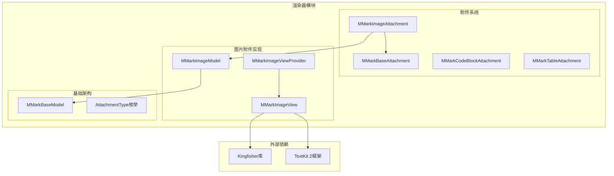
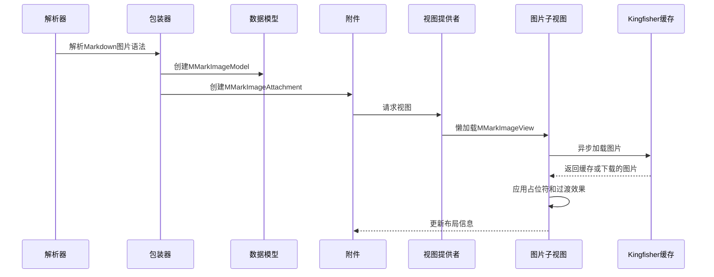
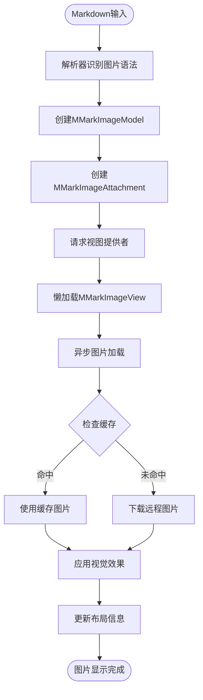
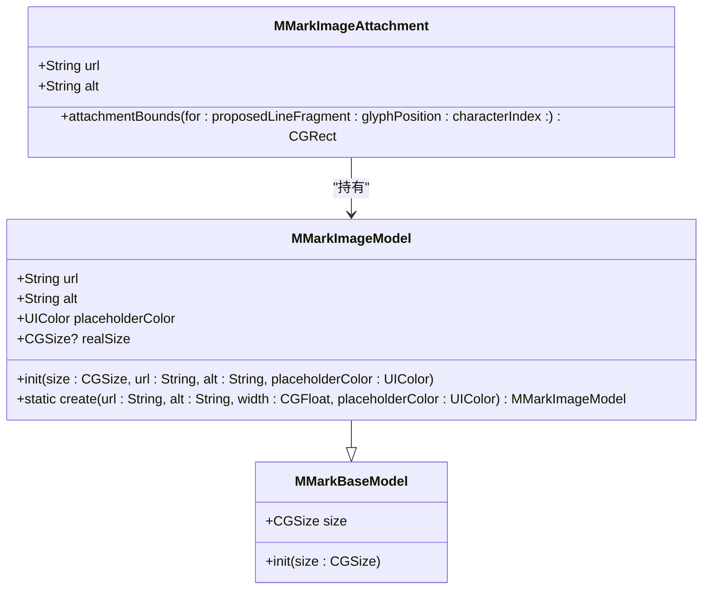
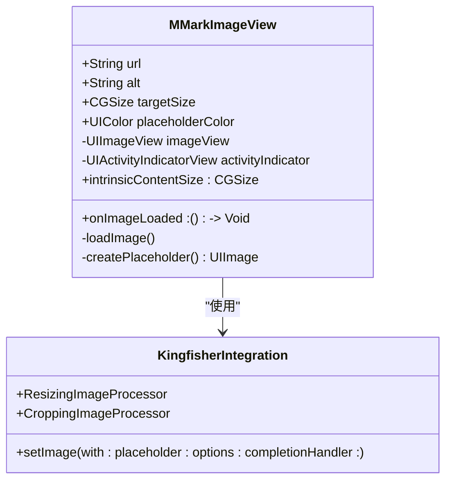
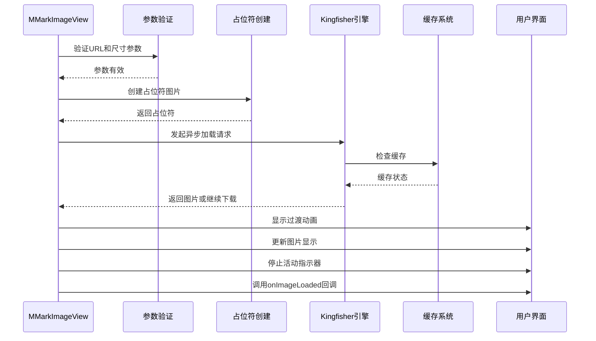
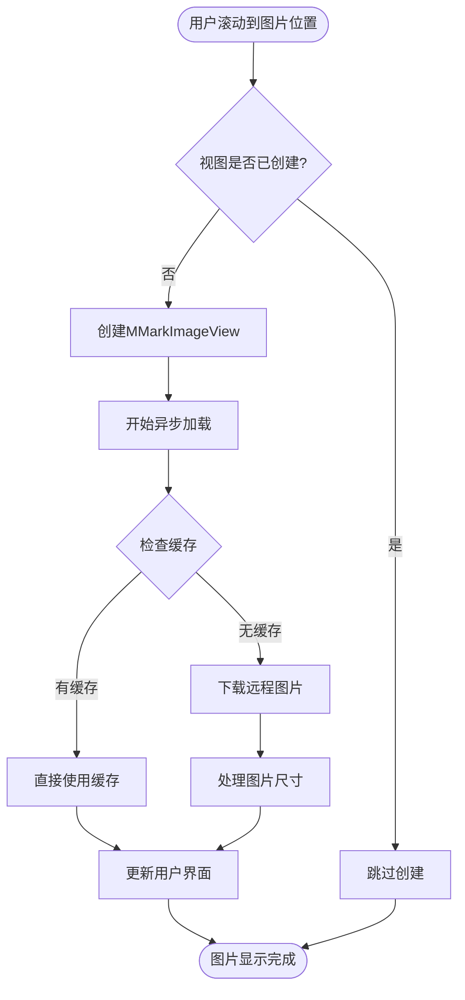
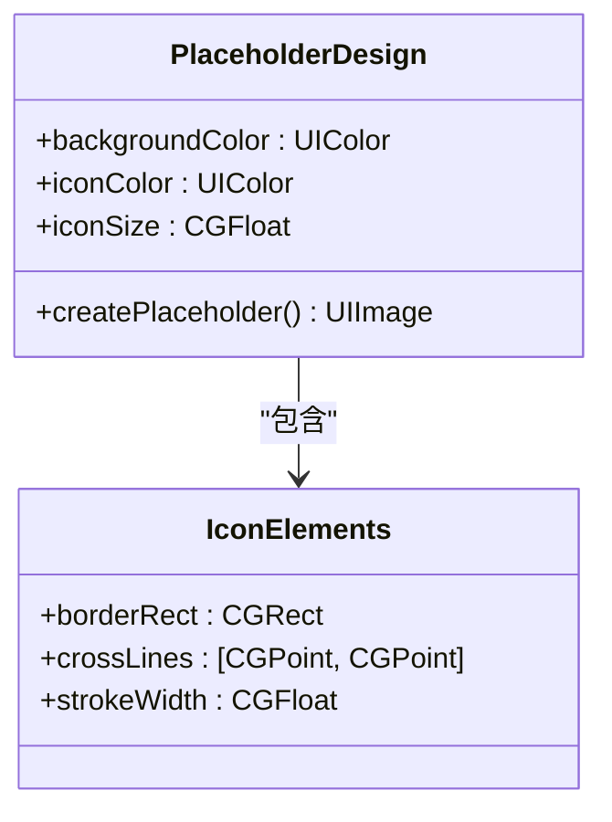
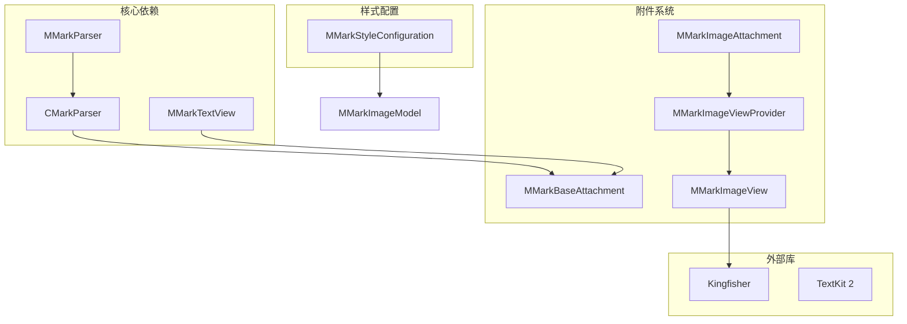

# 图片附件

<cite>
**本文档引用的文件**
- [MMarkImageAttachment.swift](file://MMarkParser/Sources/Renderer/Attachments/MMarkImageAttachment/MMarkImageAttachment.swift)
- [MMarkImageModel.swift](file://MMarkParser/Sources/Renderer/Attachments/MMarkImageAttachment/MMarkImageModel.swift)
- [MMarkImageView.swift](file://MMarkParser/Sources/Renderer/Attachments/MMarkImageAttachment/MMarkImageView.swift)
- [MMarkImageViewProvider.swift](file://MMarkParser/Sources/Renderer/Attachments/MMarkImageAttachment/MMarkImageViewProvider.swift)
- [MMarkBaseAttachment.swift](file://MMarkParser/Sources/Renderer/Attachments/MMarkBaseAttachment/MMarkBaseAttachment.swift)
- [MMarkBaseModel.swift](file://MMarkParser/Sources/Renderer/Attachments/MMarkBaseAttachment/MMarkBaseModel.swift)
- [CMarkParserWrapper.swift](file://MMarkParser/Sources/Parser/MMarkParserWrapper.swift)
- [MMarkStyleConfiguration.swift](file://MMarkParser/Sources/Renderer/MMarkStyleConfiguration.swift)
- [SampleMarkdown.swift](file://cocoapod_demo/cocoapod_demo/SampleMarkdown.swift)
- [Podfile](file://cocoapod_demo/Podfile)
</cite>

## 目录
1. [简介](#简介)
2. [项目结构](#项目结构)
3. [核心组件](#核心组件)
4. [架构概览](#架构概览)
5. [详细组件分析](#详细组件分析)
6. [依赖关系分析](#依赖关系分析)
7. [性能考虑](#性能考虑)
8. [故障排除指南](#故障排除指南)
9. [结论](#结论)

## 简介

MMarkParser的图片附件功能提供了对Markdown图片语法的完整支持，包括本地图片和远程图片的处理机制。该功能基于TextKit 2框架，通过自定义的NSTextAttachment子类实现，支持异步图片加载、缓存策略、懒加载机制以及丰富的视觉增强功能。

图片附件系统的核心优势在于其优雅的架构设计：解析器负责识别Markdown图片语法并创建相应的数据模型，渲染器负责将这些模型转换为可视化的图片视图，同时集成了Kingfisher库来提供高性能的图片下载和缓存能力。

## 项目结构

图片附件功能位于MMarkParser的渲染器模块中，采用清晰的层次化组织结构：



**图表来源**
- [MMarkImageAttachment.swift:1-23](file://MMarkParser/Sources/Renderer/Attachments/MMarkImageAttachment/MMarkImageAttachment.swift#L1-L23)
- [MMarkImageView.swift:1-133](file://MMarkParser/Sources/Renderer/Attachments/MMarkImageAttachment/MMarkImageView.swift#L1-L133)
- [MMarkBaseAttachment.swift:1-60](file://MMarkParser/Sources/Renderer/Attachments/MMarkBaseAttachment/MMarkBaseAttachment.swift#L1-L60)

**章节来源**
- [MMarkImageAttachment.swift:1-23](file://MMarkParser/Sources/Renderer/Attachments/MMarkImageAttachment/MMarkImageAttachment.swift#L1-L23)
- [MMarkImageView.swift:1-133](file://MMarkParser/Sources/Renderer/Attachments/MMarkImageAttachment/MMarkImageView.swift#L1-L133)
- [MMarkBaseAttachment.swift:1-60](file://MMarkParser/Sources/Renderer/Attachments/MMarkBaseAttachment/MMarkBaseAttachment.swift#L1-L60)

## 核心组件

### MMarkImageAttachment - 图片附件核心

MMarkImageAttachment是图片附件的入口点，继承自MMarkBaseAttachment，专门处理Markdown图片语法。它提供了简洁的接口来访问图片的URL和替代文本信息。

### MMarkImageModel - 图片数据模型

MMarkImageModel是图片附件的数据层，负责存储图片的元数据信息。该模型继承自MMarkBaseModel，包含了图片URL、替代文本、占位符颜色以及可选的真实尺寸信息。

### MMarkImageView - 图片视图渲染器

MMarkImageView是图片的实际渲染组件，负责图片的异步加载、缓存管理和用户界面展示。它集成了Kingfisher库来提供高性能的图片处理能力。

### MMarkImageViewProvider - 视图提供者

MMarkImageViewProvider实现了NSTextAttachmentViewProvider协议，负责在需要时懒加载图片视图并将其集成到TextKit 2的布局系统中。

**章节来源**
- [MMarkImageAttachment.swift:4-22](file://MMarkParser/Sources/Renderer/Attachments/MMarkImageAttachment/MMarkImageAttachment.swift#L4-L22)
- [MMarkImageModel.swift:5-26](file://MMarkParser/Sources/Renderer/Attachments/MMarkImageAttachment/MMarkImageModel.swift#L5-L26)
- [MMarkImageView.swift:6-133](file://MMarkParser/Sources/Renderer/Attachments/MMarkImageAttachment/MMarkImageView.swift#L6-L133)
- [MMarkImageViewProvider.swift:5-32](file://MMarkParser/Sources/Renderer/Attachments/MMarkImageAttachment/MMarkImageViewProvider.swift#L5-L32)

## 架构概览

图片附件系统的整体架构遵循MVC设计模式，通过清晰的职责分离实现了高度的模块化：



**图表来源**
- [CMarkParserWrapper.swift:772-795](file://MMarkParser/Sources/Parser/MMarkParserWrapper.swift#L772-L795)
- [MMarkImageViewProvider.swift:12-31](file://MMarkParser/Sources/Renderer/Attachments/MMarkImageAttachment/MMarkImageViewProvider.swift#L12-L31)
- [MMarkImageView.swift:69-100](file://MMarkParser/Sources/Renderer/Attachments/MMarkImageAttachment/MMarkImageView.swift#L69-L100)

### 数据流分析

图片附件的数据流从解析器开始，经过包装器处理，最终到达用户界面展示：



**图表来源**
- [CMarkParserWrapper.swift:772-795](file://MMarkParser/Sources/Parser/MMarkParserWrapper.swift#L772-L795)
- [MMarkImageView.swift:69-100](file://MMarkParser/Sources/Renderer/Attachments/MMarkImageAttachment/MMarkImageView.swift#L69-L100)

## 详细组件分析

### MMarkImageModel 数据结构设计

MMarkImageModel采用了精心设计的数据结构来支持图片附件的所有功能需求：



**图表来源**
- [MMarkImageModel.swift:6-26](file://MMarkParser/Sources/Renderer/Attachments/MMarkImageAttachment/MMarkImageModel.swift#L6-L26)
- [MMarkBaseModel.swift:3-9](file://MMarkParser/Sources/Renderer/Attachments/MMarkBaseAttachment/MMarkBaseModel.swift#L3-L9)

#### 关键属性说明

| 属性名 | 类型 | 描述 | 默认值 |
|--------|------|------|--------|
| url | String | 图片的URL地址 | 必填 |
| alt | String | 图片的替代文本 | 必填 |
| placeholderColor | UIColor | 占位符的颜色 | .systemGray5 |
| realSize | CGSize? | 图片的真实尺寸 | nil |

#### 工厂方法设计

MMarkImageModel提供了静态工厂方法`create`，用于根据容器宽度自动计算4:3宽高比的图片尺寸，确保图片在不同屏幕尺寸下的一致显示效果。

**章节来源**
- [MMarkImageModel.swift:13-25](file://MMarkParser/Sources/Renderer/Attachments/MMarkImageAttachment/MMarkImageModel.swift#L13-L25)

### MMarkImageView 异步加载与缓存策略

MMarkImageView是图片附件的核心渲染组件，实现了复杂的异步加载和缓存机制：



**图表来源**
- [MMarkImageView.swift:7-133](file://MMarkParser/Sources/Renderer/Attachments/MMarkImageAttachment/MMarkImageView.swift#L7-L133)

#### 异步加载流程

图片加载过程采用了渐进式的设计，确保用户体验的流畅性：



**图表来源**
- [MMarkImageView.swift:69-100](file://MMarkParser/Sources/Renderer/Attachments/MMarkImageAttachment/MMarkImageView.swift#L69-L100)

#### 缓存策略实现

MMarkImageView集成了Kingfisher的缓存机制，提供了多层次的缓存策略：

| 缓存类型 | 作用 | 生命周期 | 性能影响 |
|----------|------|----------|----------|
| 内存缓存 | 高速访问最近使用的图片 | 应用进程生命周期 | 最快但占用内存 |
| 磁盘缓存 | 持久化存储图片数据 | 应用卸载前 | 较慢但节省内存 |
| 原始图片缓存 | 保存未处理的原始图片 | 配置启用 | 提升重复处理效率 |

**章节来源**
- [MMarkImageView.swift:78-99](file://MMarkParser/Sources/Renderer/Attachments/MMarkImageAttachment/MMarkImageView.swift#L78-L99)

### 懒加载机制与内存管理

图片附件系统实现了高效的懒加载机制，只有在需要显示时才创建和加载图片视图：



**图表来源**
- [MMarkImageViewProvider.swift:12-31](file://MMarkParser/Sources/Renderer/Attachments/MMarkImageAttachment/MMarkImageViewProvider.swift#L12-L31)

#### 内存管理优化

系统采用了多项内存管理策略来优化性能：

1. **弱引用回调**: 使用弱引用避免循环引用
2. **延迟初始化**: 只在需要时创建视图实例
3. **自动释放**: 依赖iOS的ARC自动内存管理
4. **缓存限制**: Kingfisher自动管理缓存大小

**章节来源**
- [MMarkImageViewProvider.swift:18-28](file://MMarkParser/Sources/Renderer/Attachments/MMarkImageAttachment/MMarkImageViewProvider.swift#L18-L28)

### 视觉增强功能

MMarkImageView提供了丰富的视觉增强功能，包括占位符设计、过渡动画和尺寸处理：

#### 占位符设计

占位符采用了统一的设计语言，提供了良好的用户体验：



**图表来源**
- [MMarkImageView.swift:102-127](file://MMarkParser/Sources/Renderer/Attachments/MMarkImageAttachment/MMarkImageView.swift#L102-L127)

#### 过渡动画效果

系统提供了平滑的过渡动画效果，改善了图片加载的视觉体验：

| 动画类型 | 持续时间 | 效果描述 |
|----------|----------|----------|
| 淡入动画 | 0.25秒 | 图片从透明到不透明的渐变效果 |
| 缓冲动画 | 自动 | 加载过程中的旋转指示器 |
| 尺寸调整 | 自适应 | 根据目标尺寸自动调整图片显示 |

**章节来源**
- [MMarkImageView.swift:86-90](file://MMarkParser/Sources/Renderer/Attachments/MMarkImageAttachment/MMarkImageView.swift#L86-L90)

## 依赖关系分析

图片附件系统与其他组件的依赖关系体现了清晰的架构设计：



**图表来源**
- [MMarkBaseAttachment.swift:32-58](file://MMarkParser/Sources/Renderer/Attachments/MMarkBaseAttachment/MMarkBaseAttachment.swift#L32-L58)
- [MMarkImageViewProvider.swift:12-31](file://MMarkParser/Sources/Renderer/Attachments/MMarkImageAttachment/MMarkImageViewProvider.swift#L12-L31)

### 外部依赖集成

系统集成了多个外部库来提供专业功能：

| 依赖库 | 版本 | 用途 | 集成方式 |
|--------|------|------|----------|
| Kingfisher | 最新版本 | 图片下载和缓存 | 直接导入使用 |
| iosMath | 特定版本 | 数学公式渲染 | CocoaPods依赖 |
| md4c | 特定版本 | Markdown解析 | CocoaPods依赖 |

**章节来源**
- [Podfile:9](file://cocoapod_demo/Podfile#L9)

## 性能考虑

### 图片加载优化

MMarkParser在图片加载方面采用了多项优化策略：

1. **异步加载**: 所有图片加载都在后台线程执行，避免阻塞主线程
2. **缓存策略**: 利用Kingfisher的智能缓存机制减少网络请求
3. **尺寸适配**: 自动根据目标尺寸调整图片大小，减少内存占用
4. **懒加载**: 只在需要时创建和加载图片视图

### 内存使用优化

系统通过以下方式优化内存使用：

- **弱引用**: 避免循环引用导致的内存泄漏
- **自动释放**: 依赖iOS的ARC自动内存管理
- **缓存限制**: Kingfisher自动管理缓存大小
- **延迟初始化**: 只在需要时创建对象实例

### 网络性能优化

图片附件系统在网络性能方面也做了专门优化：

- **连接复用**: Kingfisher自动复用HTTP连接
- **压缩传输**: 支持GZIP等压缩格式
- **超时控制**: 合理的网络超时设置
- **错误重试**: 自动重试失败的请求

## 故障排除指南

### 常见问题及解决方案

#### 图片无法显示

**症状**: 图片显示为占位符且不更新

**可能原因**:
1. URL格式不正确
2. 网络连接问题
3. 缓存损坏

**解决步骤**:
1. 验证URL的有效性
2. 检查网络连接状态
3. 清除应用缓存
4. 重启应用

#### 图片加载缓慢

**症状**: 图片加载时间过长

**优化建议**:
1. 检查图片服务器响应时间
2. 减少图片文件大小
3. 启用适当的缓存策略
4. 考虑使用CDN服务

#### 内存使用过高

**症状**: 应用内存占用持续增长

**排查步骤**:
1. 检查是否有内存泄漏
2. 监控Kingfisher缓存大小
3. 优化图片尺寸
4. 实现适当的内存清理策略

**章节来源**
- [MMarkImageView.swift:69-74](file://MMarkParser/Sources/Renderer/Attachments/MMarkImageAttachment/MMarkImageView.swift#L69-L74)

### 调试技巧

#### 启用调试日志

可以通过以下方式启用Kingfisher的调试日志：

```swift
// 在应用启动时添加
KingfisherManager.shared.defaultOptions = [
    .debugLog(true)
]
```

#### 监控缓存状态

使用以下代码监控缓存状态：

```swift
let cache = ImageCache.default
cache.calculateDiskStorageSize { size in
    print("磁盘缓存大小: \(size) bytes")
}
```

## 结论

MMarkParser的图片附件功能展现了现代iOS应用开发的最佳实践。通过精心设计的架构、高效的异步加载机制和完善的缓存策略，该系统为用户提供了流畅的图片浏览体验。

### 主要优势

1. **架构清晰**: 采用MVC模式，职责分离明确
2. **性能优异**: 异步加载、智能缓存、懒加载机制
3. **用户体验好**: 占位符设计、过渡动画、错误处理
4. **扩展性强**: 易于添加新的图片处理功能
5. **内存友好**: 有效的内存管理和缓存控制

### 技术亮点

- **TextKit 2集成**: 充分利用iOS 15+的新特性
- **Kingfisher集成**: 专业的图片处理库
- **4:3宽高比**: 统一的图片显示比例
- **占位符设计**: 一致的视觉体验
- **过渡动画**: 平滑的加载效果

该图片附件系统为开发者提供了一个强大而灵活的解决方案，适用于各种需要Markdown图片显示的应用场景。通过合理的配置和优化，可以满足从简单博客到复杂内容管理系统的各种需求。