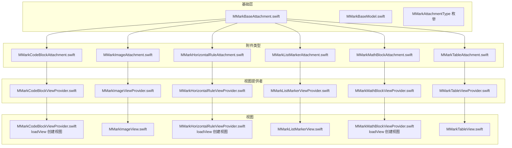
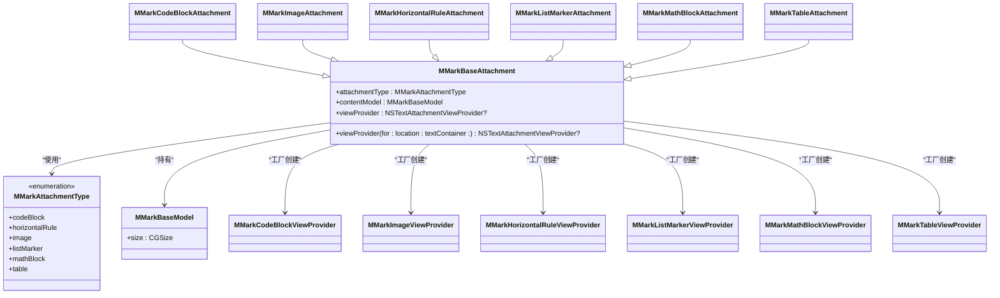
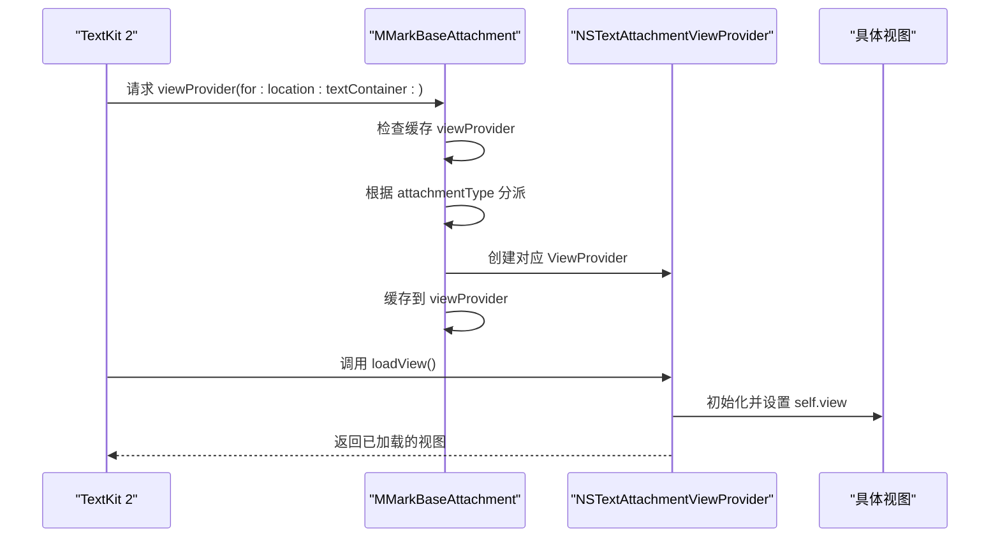
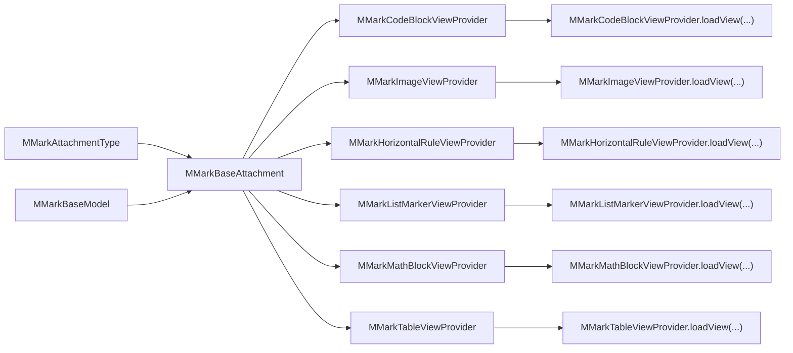

# 基础附件架构

<cite>
**本文引用的文件**
- [MMarkBaseAttachment.swift](file://MMarkParser/Sources/Renderer/Attachments/MMarkBaseAttachment/MMarkBaseAttachment.swift)
- [MMarkBaseModel.swift](file://MMarkParser/Sources/Renderer/Attachments/MMarkBaseAttachment/MMarkBaseModel.swift)
- [MMarkCodeBlockAttachment.swift](file://MMarkParser/Sources/Renderer/Attachments/MMarkCodeBlockAttachment/MMarkCodeBlockAttachment.swift)
- [MMarkCodeBlockModel.swift](file://MMarkParser/Sources/Renderer/Attachments/MMarkCodeBlockAttachment/MMarkCodeBlockModel.swift)
- [MMarkCodeBlockViewProvider.swift](file://MMarkParser/Sources/Renderer/Attachments/MMarkCodeBlockAttachment/MMarkCodeBlockViewProvider.swift)
- [MMarkImageAttachment.swift](file://MMarkParser/Sources/Renderer/Attachments/MMarkImageAttachment/MMarkImageAttachment.swift)
- [MMarkImageModel.swift](file://MMarkParser/Sources/Renderer/Attachments/MMarkImageAttachment/MMarkImageModel.swift)
- [MMarkImageViewProvider.swift](file://MMarkParser/Sources/Renderer/Attachments/MMarkImageAttachment/MMarkImageViewProvider.swift)
- [MMarkImageView.swift](file://MMarkParser/Sources/Renderer/Attachments/MMarkImageAttachment/MMarkImageView.swift)
- [MMarkHorizontalRuleAttachment.swift](file://MMarkParser/Sources/Renderer/Attachments/MMarkHorizontalRuleAttachment/MMarkHorizontalRuleAttachment.swift)
- [MMarkHorizontalRuleViewProvider.swift](file://MMarkParser/Sources/Renderer/Attachments/MMarkHorizontalRuleAttachment/MMarkHorizontalRuleViewProvider.swift)
- [MMarkListMarkerAttachment.swift](file://MMarkParser/Sources/Renderer/Attachments/MMarkListMarkerAttachment/MMarkListMarkerAttachment.swift)
- [MMarkListMarkerModel.swift](file://MMarkParser/Sources/Renderer/Attachments/MMarkListMarkerAttachment/MMarkListMarkerModel.swift)
- [MMarkListMarkerViewProvider.swift](file://MMarkParser/Sources/Renderer/Attachments/MMarkListMarkerAttachment/MMarkListMarkerViewProvider.swift)
- [MMarkListMarkerView.swift](file://MMarkParser/Sources/Renderer/Attachments/MMarkListMarkerAttachment/MMarkListMarkerView.swift)
- [MMarkMathBlockAttachment.swift](file://MMarkParser/Sources/Renderer/Attachments/MMarkMathBlockAttachment/MMarkMathBlockAttachment.swift)
- [MMarkMathBlockModel.swift](file://MMarkParser/Sources/Renderer/Attachments/MMarkMathBlockAttachment/MMarkMathBlockModel.swift)
- [MMarkMathBlockViewProvider.swift](file://MMarkParser/Sources/Renderer/Attachments/MMarkMathBlockAttachment/MMarkMathBlockViewProvider.swift)
- [MMarkTableAttachment.swift](file://MMarkParser/Sources/Renderer/Attachments/MMarkTableAttachment/MMarkTableAttachment.swift)
- [MMarkTableModel.swift](file://MMarkParser/Sources/Renderer/Attachments/MMarkTableAttachment/MMarkTableModel.swift)
- [MMarkTableViewProvider.swift](file://MMarkParser/Sources/Renderer/Attachments/MMarkTableAttachment/MMarkTableViewProvider.swift)
- [MMarkTableView.swift](file://MMarkParser/Sources/Renderer/Attachments/MMarkTableAttachment/MMarkTableView.swift)
</cite>

## 目录
1. [简介](#简介)
2. [项目结构](#项目结构)
3. [核心组件](#核心组件)
4. [架构总览](#架构总览)
5. [详细组件分析](#详细组件分析)
6. [依赖关系分析](#依赖关系分析)
7. [性能考量](#性能考量)
8. [故障排查指南](#故障排查指南)
9. [结论](#结论)
10. [附录：最佳实践与扩展指南](#附录最佳实践与扩展指南)

## 简介
本文件聚焦于 MMarkParser 的“基础附件架构”，系统性解析以下关键点：
- MMarkBaseAttachment 类的设计理念与实现细节
- MMarkAttachmentType 枚举的类型定义与覆盖范围
- MMarkBaseModel 的作用与数据结构设计
- 附件类型与内容模型的分离架构
- NSTextAttachmentViewProvider 模式的懒加载机制与缓存策略
- 工厂模式在视图提供者创建中的应用
- TextKit 2 视图生命周期管理要点
- 最佳实践与扩展指南

## 项目结构
围绕“基础附件”与“具体附件类型”的分层组织如下：
- 基础层：MMarkBaseAttachment、MMarkBaseModel、MMarkAttachmentType
- 具体附件类型：代码块、图片、表格、数学公式、水平分割线、列表标记
- 视图提供者：每个附件类型配套一个 NSTextAttachmentViewProvider 子类，负责懒加载视图
- 视图：各附件对应的 UIView 实现，承载渲染逻辑

图表来源
- [MMarkBaseAttachment.swift:12-59](file://MMarkParser/Sources/Renderer/Attachments/MMarkBaseAttachment/MMarkBaseAttachment.swift#L12-L59)
- [MMarkBaseModel.swift:3-9](file://MMarkParser/Sources/Renderer/Attachments/MMarkBaseAttachment/MMarkBaseModel.swift#L3-L9)
- [MMarkCodeBlockAttachment.swift:6-21](file://MMarkParser/Sources/Renderer/Attachments/MMarkCodeBlockAttachment/MMarkCodeBlockAttachment.swift#L6-L21)
- [MMarkImageAttachment.swift:5-22](file://MMarkParser/Sources/Renderer/Attachments/MMarkImageAttachment/MMarkImageAttachment.swift#L5-L22)
- [MMarkHorizontalRuleAttachment.swift:6-37](file://MMarkParser/Sources/Renderer/Attachments/MMarkHorizontalRuleAttachment/MMarkHorizontalRuleAttachment.swift#L6-L37)
- [MMarkListMarkerAttachment.swift:5-23](file://MMarkParser/Sources/Renderer/Attachments/MMarkListMarkerAttachment/MMarkListMarkerAttachment.swift#L5-L23)
- [MMarkMathBlockAttachment.swift:5-22](file://MMarkParser/Sources/Renderer/Attachments/MMarkMathBlockAttachment/MMarkMathBlockAttachment.swift#L5-L22)
- [MMarkTableAttachment.swift:5-22](file://MMarkParser/Sources/Renderer/Attachments/MMarkTableAttachment/MMarkTableAttachment.swift#L5-L22)

章节来源
- [MMarkBaseAttachment.swift:12-59](file://MMarkParser/Sources/Renderer/Attachments/MMarkBaseAttachment/MMarkBaseAttachment.swift#L12-L59)
- [MMarkBaseModel.swift:3-9](file://MMarkParser/Sources/Renderer/Attachments/MMarkBaseAttachment/MMarkBaseModel.swift#L3-L9)

## 核心组件
- MMarkAttachmentType：统一声明所有附件类型，当前包含代码块、水平分割线、图片、列表标记、数学公式、表格。
- MMarkBaseAttachment：继承自 NSTextAttachment，持有 attachmentType 与 contentModel，并实现懒加载的 viewProvider 工厂方法。
- MMarkBaseModel：承载通用尺寸信息，作为各附件模型的基类。

章节来源
- [MMarkBaseAttachment.swift:3-10](file://MMarkParser/Sources/Renderer/Attachments/MMarkBaseAttachment/MMarkBaseAttachment.swift#L3-L10)
- [MMarkBaseAttachment.swift:12-26](file://MMarkParser/Sources/Renderer/Attachments/MMarkBaseAttachment/MMarkBaseAttachment.swift#L12-L26)
- [MMarkBaseModel.swift:3-9](file://MMarkParser/Sources/Renderer/Attachments/MMarkBaseAttachment/MMarkBaseModel.swift#L3-L9)

## 架构总览
MMark 的附件渲染采用“类型 + 模型 + 视图提供者 + 视图”的分层架构：
- 类型层：MMarkAttachmentType 统一标识附件类型
- 模型层：各附件模型继承自 MMarkBaseModel，封装渲染所需的数据与尺寸
- 视图提供者层：NSTextAttachmentViewProvider 子类，负责在需要时创建对应视图
- 视图层：UIView 子类，承载绘制与交互

图表来源
- [MMarkBaseAttachment.swift:3-10](file://MMarkParser/Sources/Renderer/Attachments/MMarkBaseAttachment/MMarkBaseAttachment.swift#L3-L10)
- [MMarkBaseAttachment.swift:12-59](file://MMarkParser/Sources/Renderer/Attachments/MMarkBaseAttachment/MMarkBaseAttachment.swift#L12-L59)
- [MMarkBaseModel.swift:3-9](file://MMarkParser/Sources/Renderer/Attachments/MMarkBaseAttachment/MMarkBaseModel.swift#L3-L9)
- [MMarkCodeBlockAttachment.swift:6](file://MMarkParser/Sources/Renderer/Attachments/MMarkCodeBlockAttachment/MMarkCodeBlockAttachment.swift#L6)
- [MMarkImageAttachment.swift:5](file://MMarkParser/Sources/Renderer/Attachments/MMarkImageAttachment/MMarkImageAttachment.swift#L5)
- [MMarkHorizontalRuleAttachment.swift:6](file://MMarkParser/Sources/Renderer/Attachments/MMarkHorizontalRuleAttachment/MMarkHorizontalRuleAttachment.swift#L6)
- [MMarkListMarkerAttachment.swift:5](file://MMarkParser/Sources/Renderer/Attachments/MMarkListMarkerAttachment/MMarkListMarkerAttachment.swift#L5)
- [MMarkMathBlockAttachment.swift:5](file://MMarkParser/Sources/Renderer/Attachments/MMarkMathBlockAttachment/MMarkMathBlockAttachment.swift#L5)
- [MMarkTableAttachment.swift:5](file://MMarkParser/Sources/Renderer/Attachments/MMarkTableAttachment/MMarkTableAttachment.swift#L5)

## 详细组件分析

### MMarkBaseAttachment：懒加载与工厂模式
- 懒加载机制：首次请求 viewProvider 时才创建对应类型的视图提供者，并缓存到 viewProvider 属性，避免重复创建
- 工厂模式：根据 attachmentType 分派到具体的 MMark*ViewProvider 子类构造函数
- TextKit 2 集成：通过 NSTextAttachmentViewProvider 的 loadView 生命周期创建视图；部分提供者在 loadView 中调用 textLayoutManager.invalidateLayout 以刷新布局

图表来源
- [MMarkBaseAttachment.swift:32-58](file://MMarkParser/Sources/Renderer/Attachments/MMarkBaseAttachment/MMarkBaseAttachment.swift#L32-L58)
- [MMarkCodeBlockViewProvider.swift:12-20](file://MMarkParser/Sources/Renderer/Attachments/MMarkCodeBlockAttachment/MMarkCodeBlockViewProvider.swift#L12-L20)
- [MMarkHorizontalRuleViewProvider.swift:12-22](file://MMarkParser/Sources/Renderer/Attachments/MMarkHorizontalRuleAttachment/MMarkHorizontalRuleViewProvider.swift#L12-L22)
- [MMarkTableViewProvider.swift:12-22](file://MMarkParser/Sources/Renderer/Attachments/MMarkTableAttachment/MMarkTableViewProvider.swift#L12-L22)
- [MMarkImageViewProvider.swift:12-31](file://MMarkParser/Sources/Renderer/Attachments/MMarkImageAttachment/MMarkImageViewProvider.swift#L12-L31)
- [MMarkListMarkerViewProvider.swift:12-17](file://MMarkParser/Sources/Renderer/Attachments/MMarkListMarkerAttachment/MMarkListMarkerViewProvider.swift#L12-L17)
- [MMarkMathBlockViewProvider.swift:12-22](file://MMarkParser/Sources/Renderer/Attachments/MMarkMathBlockAttachment/MMarkMathBlockViewProvider.swift#L12-L22)

章节来源
- [MMarkBaseAttachment.swift:32-58](file://MMarkParser/Sources/Renderer/Attachments/MMarkBaseAttachment/MMarkBaseAttachment.swift#L32-L58)

### MMarkAttachmentType：类型定义与覆盖范围
- 当前支持类型：代码块、水平分割线、图片、列表标记、数学公式、表格
- 该枚举用于在 MMarkBaseAttachment 中进行 switch 分派，决定创建哪种视图提供者

章节来源
- [MMarkBaseAttachment.swift:3-10](file://MMarkParser/Sources/Renderer/Attachments/MMarkBaseAttachment/MMarkBaseAttachment.swift#L3-L10)

### MMarkBaseModel：数据结构设计
- 基类仅包含 size: CGSize，便于统一约束宽高
- 各子模型在此基础上扩展字段（如语言、代码、URL、占位色、LaTeX 文本等）

章节来源
- [MMarkBaseModel.swift:3-9](file://MMarkParser/Sources/Renderer/Attachments/MMarkBaseAttachment/MMarkBaseModel.swift#L3-L9)

### 附件类型与内容模型的分离
- 内容模型：封装渲染所需的数据与尺寸，例如 MMarkCodeBlockModel、MMarkImageModel、MMarkMathBlockModel、MMarkTableModel、MMarkListMarkerModel
- 附件对象：持有 contentModel，负责尺寸计算与懒加载分发
- 分离优势：渲染数据与渲染视图解耦，便于扩展新类型与复用布局逻辑

章节来源
- [MMarkCodeBlockModel.swift:6-44](file://MMarkParser/Sources/Renderer/Attachments/MMarkCodeBlockAttachment/MMarkCodeBlockModel.swift#L6-L44)
- [MMarkImageModel.swift:6-25](file://MMarkParser/Sources/Renderer/Attachments/MMarkImageAttachment/MMarkImageModel.swift#L6-L25)
- [MMarkMathBlockModel.swift:7-46](file://MMarkParser/Sources/Renderer/Attachments/MMarkMathBlockAttachment/MMarkMathBlockModel.swift#L7-L46)
- [MMarkListMarkerModel.swift:6-15](file://MMarkParser/Sources/Renderer/Attachments/MMarkListMarkerAttachment/MMarkListMarkerModel.swift#L6-L15)
- [MMarkTableAttachment.swift:7-21](file://MMarkParser/Sources/Renderer/Attachments/MMarkTableAttachment/MMarkTableAttachment.swift#L7-L21)

### NSTextAttachmentViewProvider 模式与懒加载
- 懒加载流程：首次访问时由 MMarkBaseAttachment 的 viewProvider 方法创建对应提供者；提供者在 loadView 中创建并设置 self.view
- 缓存策略：MMarkBaseAttachment 将创建的提供者缓存在 viewProvider 属性中，后续直接返回，避免重复实例化
- 性能优化：延迟创建视图，减少内存占用；必要时通过 textLayoutManager.invalidateLayout 刷新布局

章节来源
- [MMarkBaseAttachment.swift:32-58](file://MMarkParser/Sources/Renderer/Attachments/MMarkBaseAttachment/MMarkBaseAttachment.swift#L32-L58)
- [MMarkCodeBlockViewProvider.swift:12-20](file://MMarkParser/Sources/Renderer/Attachments/MMarkCodeBlockAttachment/MMarkCodeBlockViewProvider.swift#L12-L20)
- [MMarkHorizontalRuleViewProvider.swift:12-22](file://MMarkParser/Sources/Renderer/Attachments/MMarkHorizontalRuleAttachment/MMarkHorizontalRuleViewProvider.swift#L12-L22)
- [MMarkTableViewProvider.swift:12-22](file://MMarkParser/Sources/Renderer/Attachments/MMarkTableAttachment/MMarkTableViewProvider.swift#L12-L22)
- [MMarkImageViewProvider.swift:12-31](file://MMarkParser/Sources/Renderer/Attachments/MMarkImageAttachment/MMarkImageViewProvider.swift#L12-L31)
- [MMarkListMarkerViewProvider.swift:12-17](file://MMarkParser/Sources/Renderer/Attachments/MMarkListMarkerAttachment/MMarkListMarkerViewProvider.swift#L12-L17)
- [MMarkMathBlockViewProvider.swift:12-22](file://MMarkParser/Sources/Renderer/Attachments/MMarkMathBlockAttachment/MMarkMathBlockViewProvider.swift#L12-L22)

### TextKit 2 视图生命周期管理
- 生命周期入口：NSTextAttachmentViewProvider.loadView 在需要时创建视图
- 边界跟踪：多数提供者设置 tracksTextAttachmentViewBounds = true，使 TextKit 2 能正确测量与布局
- 布局失效：部分提供者在 loadView 中调用 textLayoutManager.invalidateLayout，确保尺寸变化后重新计算布局

章节来源
- [MMarkCodeBlockViewProvider.swift:18-20](file://MMarkParser/Sources/Renderer/Attachments/MMarkCodeBlockAttachment/MMarkCodeBlockViewProvider.swift#L18-L20)
- [MMarkHorizontalRuleViewProvider.swift:18-22](file://MMarkParser/Sources/Renderer/Attachments/MMarkHorizontalRuleAttachment/MMarkHorizontalRuleViewProvider.swift#L18-L22)
- [MMarkTableViewProvider.swift:18-22](file://MMarkParser/Sources/Renderer/Attachments/MMarkTableAttachment/MMarkTableViewProvider.swift#L18-L22)
- [MMarkImageViewProvider.swift:29-31](file://MMarkParser/Sources/Renderer/Attachments/MMarkImageAttachment/MMarkImageViewProvider.swift#L29-L31)
- [MMarkListMarkerViewProvider.swift:15-17](file://MMarkParser/Sources/Renderer/Attachments/MMarkListMarkerAttachment/MMarkListMarkerViewProvider.swift#L15-L17)
- [MMarkMathBlockViewProvider.swift:20-22](file://MMarkParser/Sources/Renderer/Attachments/MMarkMathBlockAttachment/MMarkMathBlockViewProvider.swift#L20-L22)

### 具体附件类型与视图实现要点

#### 代码块附件
- 尺寸约束：宽度不超过行片段宽度，防止被缩进或内边距裁切
- 模型工厂：根据语言、代码与容器宽度计算高亮文本尺寸与整体大小

章节来源
- [MMarkCodeBlockAttachment.swift:15-20](file://MMarkParser/Sources/Renderer/Attachments/MMarkCodeBlockAttachment/MMarkCodeBlockAttachment.swift#L15-L20)
- [MMarkCodeBlockModel.swift:22-44](file://MMarkParser/Sources/Renderer/Attachments/MMarkCodeBlockAttachment/MMarkCodeBlockModel.swift#L22-L44)

#### 图片附件
- 尺寸约束：按容器宽度等比缩放，保证不被裁切
- 加载策略：使用 Kingfisher 进行异步加载与缓存，加载完成后可触发布局更新（注释中保留了可选的布局失效逻辑）
- 视图：MMarkImageView 支持占位图与加载指示器

章节来源
- [MMarkImageAttachment.swift:17-21](file://MMarkParser/Sources/Renderer/Attachments/MMarkImageAttachment/MMarkImageAttachment.swift#L17-L21)
- [MMarkImageModel.swift:20-25](file://MMarkParser/Sources/Renderer/Attachments/MMarkImageAttachment/MMarkImageModel.swift#L20-L25)
- [MMarkImageViewProvider.swift:12-31](file://MMarkParser/Sources/Renderer/Attachments/MMarkImageAttachment/MMarkImageViewProvider.swift#L12-L31)
- [MMarkImageView.swift:69-100](file://MMarkParser/Sources/Renderer/Attachments/MMarkImageAttachment/MMarkImageView.swift#L69-L100)

#### 水平分割线附件
- 默认尺寸：在非主线程布局场景下提供保守默认值，避免屏幕访问
- 视图：透明占位图，实际绘制由视图提供者创建的视图完成
- 布局：通过 invalidateLayout 强制重新计算布局

章节来源
- [MMarkHorizontalRuleAttachment.swift:11-27](file://MMarkParser/Sources/Renderer/Attachments/MMarkHorizontalRuleAttachment/MMarkHorizontalRuleAttachment.swift#L11-L27)
- [MMarkHorizontalRuleAttachment.swift:33-36](file://MMarkParser/Sources/Renderer/Attachments/MMarkHorizontalRuleAttachment/MMarkHorizontalRuleAttachment.swift#L33-L36)
- [MMarkHorizontalRuleViewProvider.swift:12-22](file://MMarkParser/Sources/Renderer/Attachments/MMarkHorizontalRuleAttachment/MMarkHorizontalRuleViewProvider.swift#L12-L22)

#### 列表标记附件
- 视图：MMarkListMarkerView 直接展示预置的 marker 图像
- 提供者：设置 tracksTextAttachmentViewBounds = true，确保 TextKit 2 正确跟踪边界

章节来源
- [MMarkListMarkerAttachment.swift:7-12](file://MMarkParser/Sources/Renderer/Attachments/MMarkListMarkerAttachment/MMarkListMarkerAttachment.swift#L7-L12)
- [MMarkListMarkerViewProvider.swift:12-17](file://MMarkParser/Sources/Renderer/Attachments/MMarkListMarkerAttachment/MMarkListMarkerViewProvider.swift#L12-L17)
- [MMarkListMarkerView.swift:24-27](file://MMarkParser/Sources/Renderer/Attachments/MMarkListMarkerAttachment/MMarkListMarkerView.swift#L24-L27)

#### 数学公式附件
- 模型工厂：在主线程计算 MTMathUILabel 的尺寸，考虑溢出与内边距
- 视图：MMarkMathBlockView 使用 iosMath 渲染 LaTeX

章节来源
- [MMarkMathBlockAttachment.swift:16-21](file://MMarkParser/Sources/Renderer/Attachments/MMarkMathBlockAttachment/MMarkMathBlockAttachment.swift#L16-L21)
- [MMarkMathBlockModel.swift:19-46](file://MMarkParser/Sources/Renderer/Attachments/MMarkMathBlockAttachment/MMarkMathBlockModel.swift#L19-L46)
- [MMarkMathBlockViewProvider.swift:12-22](file://MMarkParser/Sources/Renderer/Attachments/MMarkMathBlockAttachment/MMarkMathBlockViewProvider.swift#L12-L22)

#### 表格附件
- 视图：MMarkTableView 使用自定义 UICollectionViewLayout（MMarkTableLayout）实现单元格布局
- 配置：支持交替行颜色、边框、圆角、字体与内边距等配置项
- 提供者：设置 tracksTextAttachmentViewBounds = true，并在 loadView 后调用 invalidateLayout

章节来源
- [MMarkTableAttachment.swift:18-21](file://MMarkParser/Sources/Renderer/Attachments/MMarkTableAttachment/MMarkTableAttachment.swift#L18-L21)
- [MMarkTableModel.swift](file://MMarkParser/Sources/Renderer/Attachments/MMarkTableAttachment/MMarkTableModel.swift)
- [MMarkTableViewProvider.swift:12-22](file://MMarkParser/Sources/Renderer/Attachments/MMarkTableAttachment/MMarkTableViewProvider.swift#L12-L22)
- [MMarkTableView.swift:56-159](file://MMarkParser/Sources/Renderer/Attachments/MMarkTableAttachment/MMarkTableView.swift#L56-L159)

## 依赖关系分析
- MMarkBaseAttachment 依赖 MMarkAttachmentType 与 MMarkBaseModel，并在懒加载时依赖各附件类型的 ViewProvider
- 各附件类型依赖其对应的 Model 与 ViewProvider
- 视图提供者依赖其对应的 View 实现
- TextKit 2 通过 NSTextAttachmentViewProvider 的生命周期与 textLayoutManager 协作完成布局与绘制

图表来源
- [MMarkBaseAttachment.swift:3-10](file://MMarkParser/Sources/Renderer/Attachments/MMarkBaseAttachment/MMarkBaseAttachment.swift#L3-L10)
- [MMarkBaseAttachment.swift:32-58](file://MMarkParser/Sources/Renderer/Attachments/MMarkBaseAttachment/MMarkBaseAttachment.swift#L32-L58)
- [MMarkCodeBlockViewProvider.swift:12-20](file://MMarkParser/Sources/Renderer/Attachments/MMarkCodeBlockAttachment/MMarkCodeBlockViewProvider.swift#L12-L20)
- [MMarkImageViewProvider.swift:12-31](file://MMarkParser/Sources/Renderer/Attachments/MMarkImageAttachment/MMarkImageViewProvider.swift#L12-L31)
- [MMarkHorizontalRuleViewProvider.swift:12-22](file://MMarkParser/Sources/Renderer/Attachments/MMarkHorizontalRuleAttachment/MMarkHorizontalRuleViewProvider.swift#L12-L22)
- [MMarkListMarkerViewProvider.swift:12-17](file://MMarkParser/Sources/Renderer/Attachments/MMarkListMarkerAttachment/MMarkListMarkerViewProvider.swift#L12-L17)
- [MMarkMathBlockViewProvider.swift:12-22](file://MMarkParser/Sources/Renderer/Attachments/MMarkMathBlockAttachment/MMarkMathBlockViewProvider.swift#L12-L22)
- [MMarkTableViewProvider.swift:12-22](file://MMarkParser/Sources/Renderer/Attachments/MMarkTableAttachment/MMarkTableViewProvider.swift#L12-L22)

章节来源
- [MMarkBaseAttachment.swift:32-58](file://MMarkParser/Sources/Renderer/Attachments/MMarkBaseAttachment/MMarkBaseAttachment.swift#L32-L58)

## 性能考量
- 懒加载与缓存：首次访问时创建视图提供者并缓存，避免重复实例化
- 延迟视图创建：仅在需要时创建视图，降低初始内存压力
- 布局失效控制：仅在必要时调用 invalidateLayout，避免频繁重排
- 图片加载：使用 Kingfisher 异步加载与缓存，提升用户体验
- 尺寸计算：在模型层集中计算尺寸，减少 TextKit 2 重排次数

## 故障排查指南
- 视图未显示或布局异常
  - 检查 tracksTextAttachmentViewBounds 是否设置为 true
  - 确认 loadView 中是否正确设置了 self.view
  - 如尺寸变化，确认是否调用了 textLayoutManager.invalidateLayout
- 图片不显示或加载失败
  - 检查 URL 与目标尺寸是否有效
  - 确认占位图生成逻辑与加载回调
- 数学公式渲染异常
  - 确认主线程执行尺寸计算
  - 检查 iosMath 字体与颜色配置
- 表格布局错乱
  - 检查列宽与行高的计算与缓存
  - 确认自定义布局属性与 contentSize 更新

章节来源
- [MMarkImageViewProvider.swift:12-31](file://MMarkParser/Sources/Renderer/Attachments/MMarkImageAttachment/MMarkImageViewProvider.swift#L12-L31)
- [MMarkImageView.swift:69-100](file://MMarkParser/Sources/Renderer/Attachments/MMarkImageAttachment/MMarkImageView.swift#L69-L100)
- [MMarkMathBlockModel.swift:26-39](file://MMarkParser/Sources/Renderer/Attachments/MMarkMathBlockAttachment/MMarkMathBlockModel.swift#L26-L39)
- [MMarkTableView.swift:145-159](file://MMarkParser/Sources/Renderer/Attachments/MMarkTableAttachment/MMarkTableView.swift#L145-L159)

## 结论
MMarkParser 的基础附件架构通过“类型 + 模型 + 视图提供者 + 视图”的清晰分层，实现了良好的可扩展性与性能表现。MMarkBaseAttachment 以懒加载与工厂模式为核心，结合 NSTextAttachmentViewProvider 的生命周期管理，确保了 TextKit 2 下的高效渲染与布局。内容模型与视图的分离进一步提升了代码复用与维护效率。

## 附录：最佳实践与扩展指南
- 新增附件类型步骤
  - 定义新的 MMarkAttachmentType 枚举值
  - 创建内容模型（继承 MMarkBaseModel），实现必要的工厂方法与尺寸计算
  - 创建附件类（继承 MMarkBaseAttachment），实现 attachmentBounds 与必要的属性
  - 创建视图提供者（继承 NSTextAttachmentViewProvider），在 loadView 中创建并设置视图
  - 在 MMarkBaseAttachment 的 viewProvider 分派中添加新类型分支
  - 如需动态布局，调用 textLayoutManager.invalidateLayout
- 懒加载与缓存
  - 保持 viewProvider 缓存策略不变，避免重复创建
  - 在 loadView 中尽量延迟昂贵操作（如网络请求、尺寸计算）
- 尺寸与布局
  - 在模型层集中计算尺寸，避免在 TextKit 2 布局阶段进行复杂计算
  - 使用 tracksTextAttachmentViewBounds=true，确保边界跟踪准确
- 性能优化
  - 对图片与富文本渲染使用缓存与异步加载
  - 控制 invalidateLayout 的调用频率，批量更新优于频繁细碎更新
- 可维护性
  - 保持模型与视图职责分离，遵循单一职责原则
  - 为复杂视图提供者增加必要的配置项与默认值，提升可定制性