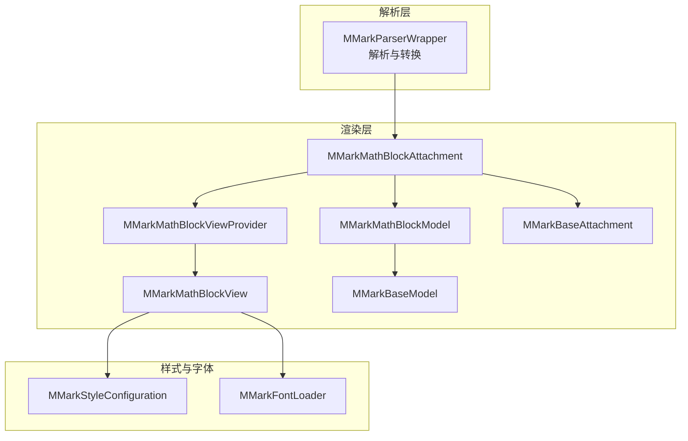
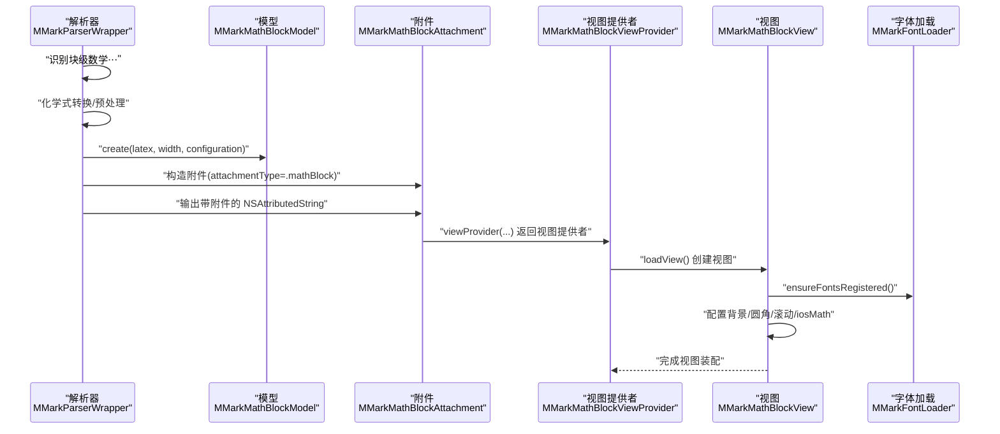
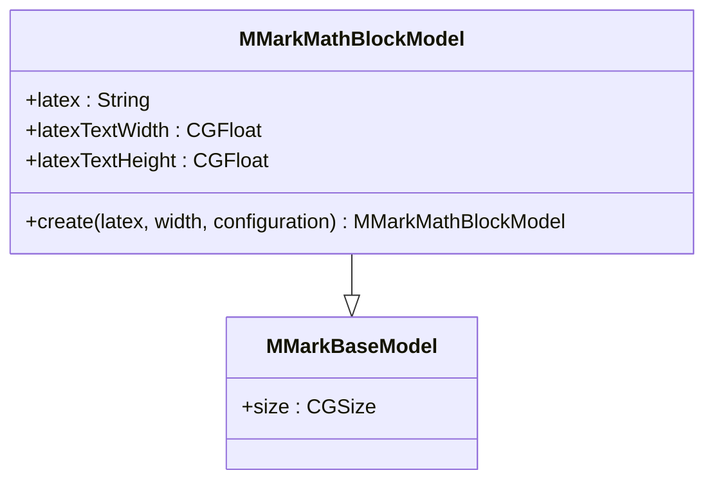
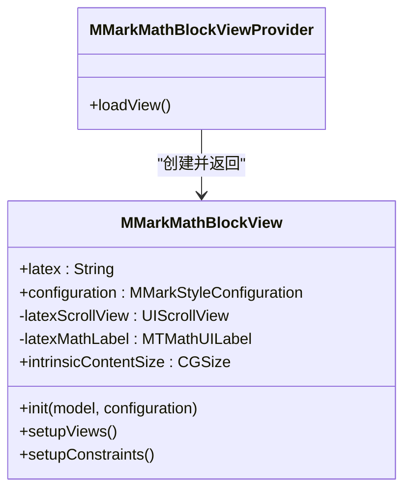
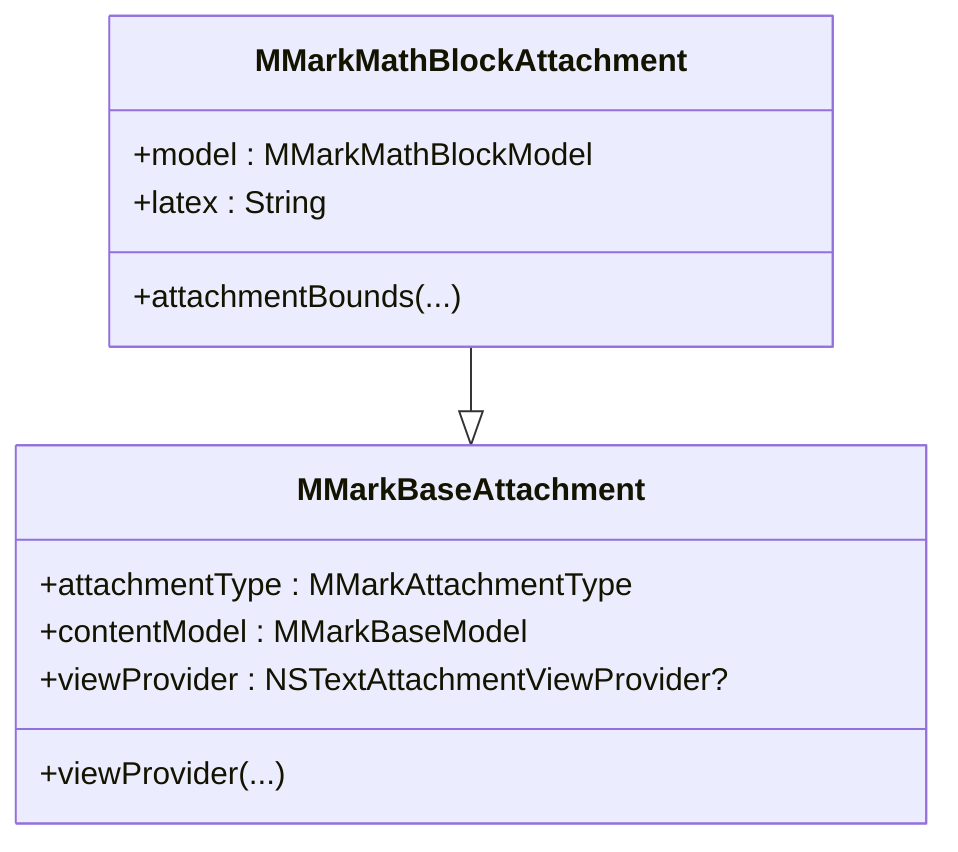
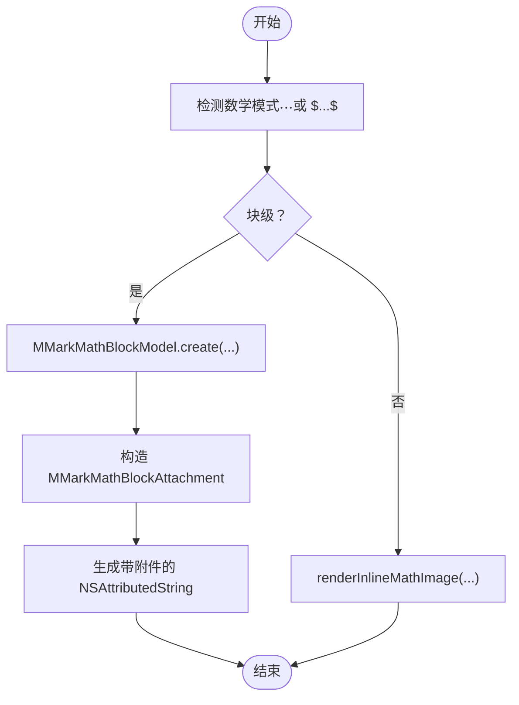
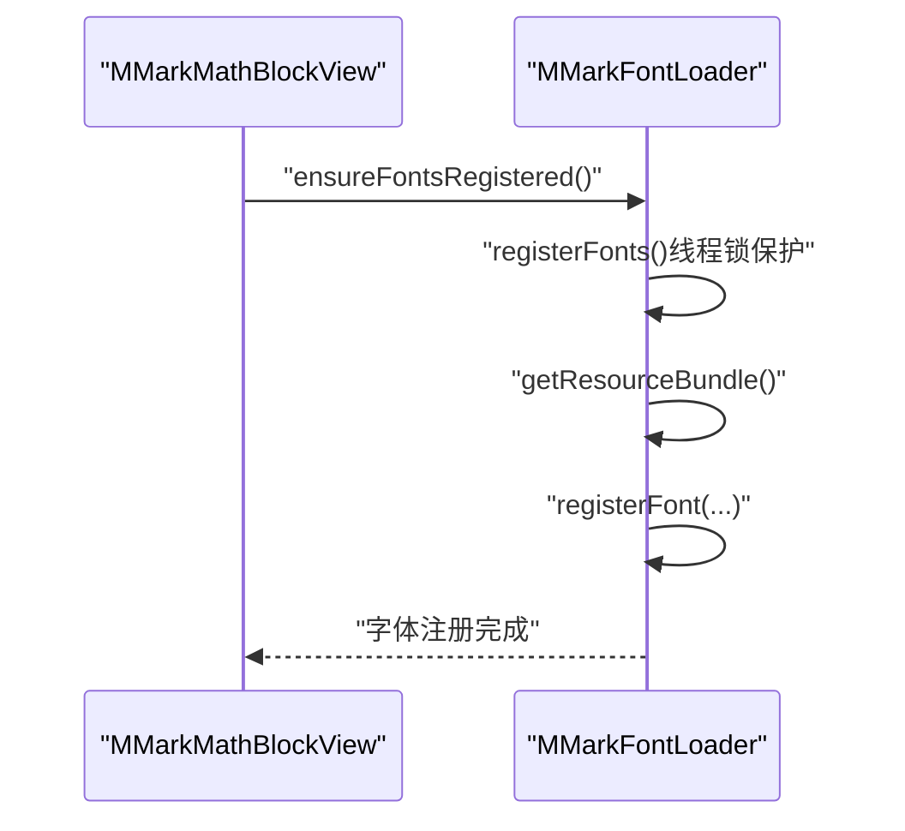
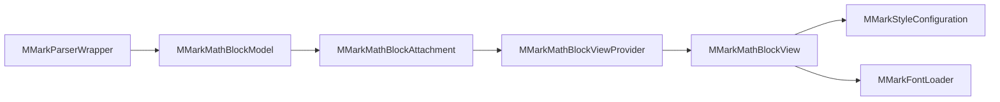

# 数学公式附件

<cite>
**本文引用的文件**
- [MMarkMathBlockAttachment.swift](file://MMarkParser/Sources/Renderer/Attachments/MMarkMathBlockAttachment/MMarkMathBlockAttachment.swift)
- [MMarkMathBlockModel.swift](file://MMarkParser/Sources/Renderer/Attachments/MMarkMathBlockAttachment/MMarkMathBlockModel.swift)
- [MMarkMathBlockView.swift](file://MMarkParser/Sources/Renderer/Attachments/MMarkMathBlockAttachment/MMarkMathBlockView.swift)
- [MMarkMathBlockViewProvider.swift](file://MMarkParser/Sources/Renderer/Attachments/MMarkMathBlockAttachment/MMarkMathBlockViewProvider.swift)
- [MMarkBaseAttachment.swift](file://MMarkParser/Sources/Renderer/Attachments/MMarkBaseAttachment/MMarkBaseAttachment.swift)
- [MMarkBaseModel.swift](file://MMarkParser/Sources/Renderer/Attachments/MMarkBaseAttachment/MMarkBaseModel.swift)
- [MMarkStyleConfiguration.swift](file://MMarkParser/Sources/Renderer/MMarkStyleConfiguration.swift)
- [MMarkFontLoader.swift](file://MMarkParser/Sources/Renderer/MMarkFontLoader.swift)
- [MMarkParserWrapper.swift](file://MMarkParser/Sources/Parser/MMarkParserWrapper.swift)
- [SampleMarkdown.swift](file://cocoapod_demo/cocoapod_demo/SampleMarkdown.swift)
- [README.md](file://README.md)
</cite>

## 目录
1. [简介](#简介)
2. [项目结构](#项目结构)
3. [核心组件](#核心组件)
4. [架构总览](#架构总览)
5. [组件详解](#组件详解)
6. [依赖关系分析](#依赖关系分析)
7. [性能与排版优化](#性能与排版优化)
8. [故障排查指南](#故障排查指南)
9. [结论](#结论)
10. [附录：LaTeX 语法与示例](#附录latex-语法与示例)

## 简介
本章节面向使用 MMarkParser 的开发者，系统性讲解“数学公式附件”能力，重点覆盖：
- MMarkMathBlockAttachment 对 LaTeX 数学公式的渲染支持，涵盖行内与块级两种模式
- MMarkMathBlockModel 的数据结构设计，包括 LaTeX 源码、渲染模式、样式配置等
- 数学公式视图的 iosMath 集成与 KaTeX 字体加载机制
- 数学公式附件的布局计算与基线对齐策略
- 自定义配置项（字体大小、颜色、背景色等）与最佳实践
- 完整的 LaTeX 语法支持说明与渲染示例

## 项目结构
围绕数学公式附件的关键文件组织如下：
- 渲染层（Attachments）：MMarkMathBlockAttachment、MMarkMathBlockModel、MMarkMathBlockView、MMarkMathBlockViewProvider
- 基类层（BaseAttachment/BaseModel）：MMarkBaseAttachment、MMarkBaseModel
- 样式与字体：MMarkStyleConfiguration、MMarkFontLoader
- 解析器桥接：MMarkParserWrapper（负责将 LaTeX 转换为块级数学附件）

图表来源
- [MMarkParserWrapper.swift:908-927](file://MMarkParser/Sources/Parser/MMarkParserWrapper.swift#L908-L927)
- [MMarkMathBlockAttachment.swift:5-22](file://MMarkParser/Sources/Renderer/Attachments/MMarkMathBlockAttachment/MMarkMathBlockAttachment.swift#L5-L22)
- [MMarkMathBlockModel.swift:7-46](file://MMarkParser/Sources/Renderer/Attachments/MMarkMathBlockAttachment/MMarkMathBlockModel.swift#L7-L46)
- [MMarkMathBlockView.swift:7-100](file://MMarkParser/Sources/Renderer/Attachments/MMarkMathBlockAttachment/MMarkMathBlockView.swift#L7-L100)
- [MMarkMathBlockViewProvider.swift:6-23](file://MMarkParser/Sources/Renderer/Attachments/MMarkMathBlockAttachment/MMarkMathBlockViewProvider.swift#L6-L23)
- [MMarkBaseAttachment.swift:12-59](file://MMarkParser/Sources/Renderer/Attachments/MMarkBaseAttachment/MMarkBaseAttachment.swift#L12-L59)
- [MMarkBaseModel.swift:3-9](file://MMarkParser/Sources/Renderer/Attachments/MMarkBaseAttachment/MMarkBaseModel.swift#L3-L9)
- [MMarkStyleConfiguration.swift:11-141](file://MMarkParser/Sources/Renderer/MMarkStyleConfiguration.swift#L11-L141)
- [MMarkFontLoader.swift:8-112](file://MMarkParser/Sources/Renderer/MMarkFontLoader.swift#L8-L112)

章节来源
- [README.md:108-156](file://README.md#L108-L156)

## 核心组件
- MMarkMathBlockAttachment：数学块级附件的入口，持有 MMarkMathBlockModel 并提供布局约束
- MMarkMathBlockModel：数学块级模型，封装 LaTeX 源码与渲染尺寸信息，并提供基于配置的尺寸计算工厂方法
- MMarkMathBlockView：承载 iosMath 的 MTMathUILabel，负责渲染与滚动视图布局
- MMarkMathBlockViewProvider：TextKit 2 视图提供者，负责将附件绑定到具体视图
- MMarkBaseAttachment/Model：所有附件的基础类型，统一管理附件类型与视图提供者
- MMarkStyleConfiguration：全局样式配置，包含数学块级与行内的字体、颜色、背景、圆角等
- MMarkFontLoader：KaTeX 字体注册器，确保 iosMath 使用的字体可用

章节来源
- [MMarkMathBlockAttachment.swift:5-22](file://MMarkParser/Sources/Renderer/Attachments/MMarkMathBlockAttachment/MMarkMathBlockAttachment.swift#L5-L22)
- [MMarkMathBlockModel.swift:7-46](file://MMarkParser/Sources/Renderer/Attachments/MMarkMathBlockAttachment/MMarkMathBlockModel.swift#L7-L46)
- [MMarkMathBlockView.swift:7-100](file://MMarkParser/Sources/Renderer/Attachments/MMarkMathBlockAttachment/MMarkMathBlockView.swift#L7-L100)
- [MMarkMathBlockViewProvider.swift:6-23](file://MMarkParser/Sources/Renderer/Attachments/MMarkMathBlockAttachment/MMarkMathBlockViewProvider.swift#L6-L23)
- [MMarkBaseAttachment.swift:12-59](file://MMarkParser/Sources/Renderer/Attachments/MMarkBaseAttachment/MMarkBaseAttachment.swift#L12-L59)
- [MMarkBaseModel.swift:3-9](file://MMarkParser/Sources/Renderer/Attachments/MMarkBaseAttachment/MMarkBaseModel.swift#L3-L9)
- [MMarkStyleConfiguration.swift:11-141](file://MMarkParser/Sources/Renderer/MMarkStyleConfiguration.swift#L11-L141)
- [MMarkFontLoader.swift:8-112](file://MMarkParser/Sources/Renderer/MMarkFontLoader.swift#L8-L112)

## 架构总览
数学公式渲染从解析到显示的端到端流程如下：

图表来源
- [MMarkParserWrapper.swift:908-927](file://MMarkParser/Sources/Parser/MMarkParserWrapper.swift#L908-L927)
- [MMarkMathBlockModel.swift:19-46](file://MMarkParser/Sources/Renderer/Attachments/MMarkMathBlockAttachment/MMarkMathBlockModel.swift#L19-L46)
- [MMarkMathBlockAttachment.swift:5-22](file://MMarkParser/Sources/Renderer/Attachments/MMarkMathBlockAttachment/MMarkMathBlockAttachment.swift#L5-L22)
- [MMarkMathBlockViewProvider.swift:8-22](file://MMarkParser/Sources/Renderer/Attachments/MMarkMathBlockAttachment/MMarkMathBlockViewProvider.swift#L8-L22)
- [MMarkMathBlockView.swift:19-53](file://MMarkParser/Sources/Renderer/Attachments/MMarkMathBlockAttachment/MMarkMathBlockView.swift#L19-L53)
- [MMarkFontLoader.swift:24-26](file://MMarkParser/Sources/Renderer/MMarkFontLoader.swift#L24-L26)

## 组件详解

### 数据模型：MMarkMathBlockModel
- 关键字段
  - latex：LaTeX 源码
  - latexTextWidth/latexTextHeight：由 iosMath 计算的渲染尺寸（考虑溢出）
  - size：最终显示尺寸（含内边距、边距）
- 工厂方法 create
  - 在主线程安全地创建 MTMathUILabel，设置渲染模式为 display
  - 优先使用配置中的 mathDisplayFont；否则使用 mathBlockStyle 的字体大小
  - 设置文本颜色与内边距，调用 sizeToFit 后计算总高度
  - 返回包含 latex 文本宽高与总尺寸的模型实例

图表来源
- [MMarkBaseModel.swift:3-9](file://MMarkParser/Sources/Renderer/Attachments/MMarkBaseAttachment/MMarkBaseModel.swift#L3-L9)
- [MMarkMathBlockModel.swift:7-46](file://MMarkParser/Sources/Renderer/Attachments/MMarkMathBlockAttachment/MMarkMathBlockModel.swift#L7-L46)

章节来源
- [MMarkMathBlockModel.swift:7-46](file://MMarkParser/Sources/Renderer/Attachments/MMarkMathBlockAttachment/MMarkMathBlockModel.swift#L7-L46)

### 视图与提供者：MMarkMathBlockView 与 MMarkMathBlockViewProvider
- MMarkMathBlockView
  - 初始化时调用 MMarkFontLoader.ensureFontsRegistered()，确保 KaTeX 字体可用
  - 使用 UIScrollView 承载 MTMathUILabel，开启水平滚动以适配长公式
  - 根据配置设置背景色与圆角；根据配置选择字体或字号；设置文本颜色
  - 通过调整 label 的 frame 与 contentSize，避免高公式（矩阵、分数等）被裁剪
  - 提供 intrinsicContentSize，便于 TextKit 2 测量
- MMarkMathBlockViewProvider
  - 在 loadView 中读取附件的模型，创建 MMarkMathBlockView
  - 设置 tracksTextAttachmentViewBounds，使 TextKit 2 能正确跟踪附件边界

图表来源
- [MMarkMathBlockView.swift:7-100](file://MMarkParser/Sources/Renderer/Attachments/MMarkMathBlockAttachment/MMarkMathBlockView.swift#L7-L100)
- [MMarkMathBlockViewProvider.swift:6-23](file://MMarkParser/Sources/Renderer/Attachments/MMarkMathBlockAttachment/MMarkMathBlockViewProvider.swift#L6-L23)

章节来源
- [MMarkMathBlockView.swift:7-100](file://MMarkParser/Sources/Renderer/Attachments/MMarkMathBlockAttachment/MMarkMathBlockView.swift#L7-L100)
- [MMarkMathBlockViewProvider.swift:6-23](file://MMarkParser/Sources/Renderer/Attachments/MMarkMathBlockAttachment/MMarkMathBlockViewProvider.swift#L6-L23)

### 附件与布局：MMarkMathBlockAttachment
- 作为 NSTextAttachment 的子类，持有 MMarkMathBlockModel
- 重写 attachmentBounds：限制宽度不超过行片段宽度，防止缩进或内边距导致右侧裁切
- 通过父类 MMarkBaseAttachment 的 viewProvider 机制，自动关联到 MMarkMathBlockViewProvider

图表来源
- [MMarkBaseAttachment.swift:12-59](file://MMarkParser/Sources/Renderer/Attachments/MMarkBaseAttachment/MMarkBaseAttachment.swift#L12-L59)
- [MMarkMathBlockAttachment.swift:5-22](file://MMarkParser/Sources/Renderer/Attachments/MMarkMathBlockAttachment/MMarkMathBlockAttachment.swift#L5-L22)

章节来源
- [MMarkMathBlockAttachment.swift:5-22](file://MMarkParser/Sources/Renderer/Attachments/MMarkMathBlockAttachment/MMarkMathBlockAttachment.swift#L5-L22)
- [MMarkBaseAttachment.swift:12-59](file://MMarkParser/Sources/Renderer/Attachments/MMarkBaseAttachment/MMarkBaseAttachment.swift#L12-L59)

### 行内公式与块级公式处理
- 块级公式（$$...$$）
  - 解析器在回调中识别块级数学，调用 MMarkMathBlockModel.create 计算尺寸并生成附件
  - 输出为带附件的 NSAttributedString，交由 TextKit 2 布局
- 行内公式（$...$）
  - 解析器通过 renderInlineMathImage 使用 MTMathUILabel 生成图片，回退到纯文本样式
  - 区别于块级附件，行内公式不生成 NSTextAttachment，而是直接嵌入图片或文本

图表来源
- [MMarkParserWrapper.swift:908-927](file://MMarkParser/Sources/Parser/MMarkParserWrapper.swift#L908-L927)
- [MMarkParserWrapper.swift:1150-1174](file://MMarkParser/Sources/Parser/MMarkParserWrapper.swift#L1150-L1174)

章节来源
- [MMarkParserWrapper.swift:908-927](file://MMarkParser/Sources/Parser/MMarkParserWrapper.swift#L908-L927)
- [MMarkParserWrapper.swift:1150-1174](file://MMarkParser/Sources/Parser/MMarkParserWrapper.swift#L1150-L1174)

### 字体与 KaTeX 加载机制
- MMarkFontLoader
  - 线程安全注册 KaTeX 字体（KaTeX_Math-Italic.ttf、KaTeX_Main-Regular.ttf）
  - 支持 CocoaPods 资源包查找与回退到框架 bundle
  - 通过 CoreText 注册字体，供 iosMath 使用
- MMarkMathBlockView 在初始化时调用 ensureFontsRegistered，确保渲染前字体已就绪
- MMarkStyleConfiguration 提供 mathDisplayFont 与 mathBlockStyle/font、mathBlockStyle/textColor 等配置项

图表来源
- [MMarkMathBlockView.swift:21-22](file://MMarkParser/Sources/Renderer/Attachments/MMarkMathBlockAttachment/MMarkMathBlockView.swift#L21-L22)
- [MMarkFontLoader.swift:24-51](file://MMarkParser/Sources/Renderer/MMarkFontLoader.swift#L24-L51)
- [MMarkStyleConfiguration.swift:139-140](file://MMarkParser/Sources/Renderer/MMarkStyleConfiguration.swift#L139-L140)

章节来源
- [MMarkFontLoader.swift:8-112](file://MMarkParser/Sources/Renderer/MMarkFontLoader.swift#L8-L112)
- [MMarkMathBlockView.swift:7-53](file://MMarkParser/Sources/Renderer/Attachments/MMarkMathBlockAttachment/MMarkMathBlockView.swift#L7-L53)
- [MMarkStyleConfiguration.swift:11-141](file://MMarkParser/Sources/Renderer/MMarkStyleConfiguration.swift#L11-L141)

### 布局计算与基线对齐
- 附件边界计算
  - attachmentBounds 限制宽度不超过行片段宽度，减去少量边距，避免缩进或内边距导致裁切
- 视图内边距与滚动
  - 内边距：上下左右各 16pt
  - 上下边距：labelMargin 6pt，额外溢出填充 8pt，避免高公式被裁剪
  - 滚动视图：横向滚动，纵向隐藏，contentSize 基于 label 尺寸扩展
- 基线对齐
  - 通过 labelMargin 与 overflowPadding 的微调，配合 iosMath 的绘制上下边界，提升视觉对齐一致性

章节来源
- [MMarkMathBlockAttachment.swift:16-21](file://MMarkParser/Sources/Renderer/Attachments/MMarkMathBlockAttachment/MMarkMathBlockAttachment.swift#L16-L21)
- [MMarkMathBlockView.swift:83-93](file://MMarkParser/Sources/Renderer/Attachments/MMarkMathBlockAttachment/MMarkMathBlockView.swift#L83-L93)
- [MMarkMathBlockView.swift:45-52](file://MMarkParser/Sources/Renderer/Attachments/MMarkMathBlockAttachment/MMarkMathBlockView.swift#L45-L52)

### 自定义配置项与样式
- 可配置项（来自 MMarkStyleConfiguration）
  - mathInlineStyle：行内数学的字体、文本色、背景色
  - mathBlockStyle：块级数学的字体、文本色、背景色
  - mathBlockBackgroundColor：块级数学容器背景色
  - mathBlockCornerRadius：块级数学容器圆角
  - mathDisplayFont：iosMath 渲染字体（优先级高于默认字体）
- 应用方式
  - 块级：MMarkMathBlockView 在初始化时应用 mathBlockBackgroundColor 与 mathBlockCornerRadius
  - 字体：若配置了 mathDisplayFont，则优先使用；否则使用 mathBlockStyle 的字体大小
  - 文本色：统一设置为 mathBlockStyle.textColor

章节来源
- [MMarkStyleConfiguration.swift:131-141](file://MMarkParser/Sources/Renderer/MMarkStyleConfiguration.swift#L131-L141)
- [MMarkMathBlockView.swift:30-43](file://MMarkParser/Sources/Renderer/Attachments/MMarkMathBlockAttachment/MMarkMathBlockView.swift#L30-L43)
- [MMarkMathBlockModel.swift:30-36](file://MMarkParser/Sources/Renderer/Attachments/MMarkMathBlockAttachment/MMarkMathBlockModel.swift#L30-L36)

## 依赖关系分析
- 组件耦合
  - MMarkMathBlockAttachment 依赖 MMarkMathBlockModel 与 MMarkBaseAttachment
  - MMarkMathBlockView 依赖 MMarkStyleConfiguration 与 MMarkFontLoader
  - MMarkMathBlockViewProvider 依赖 MMarkMathBlockAttachment 与 MMarkMathBlockView
  - 解析器通过 MMarkParserWrapper 间接产出 MMarkMathBlockAttachment
- 外部依赖
  - iosMath：LaTeX 渲染引擎（MTMathUILabel）
  - CoreText：字体注册
  - TextKit 2：附件渲染与布局

图表来源
- [MMarkParserWrapper.swift:908-927](file://MMarkParser/Sources/Parser/MMarkParserWrapper.swift#L908-L927)
- [MMarkMathBlockModel.swift:19-46](file://MMarkParser/Sources/Renderer/Attachments/MMarkMathBlockAttachment/MMarkMathBlockModel.swift#L19-L46)
- [MMarkMathBlockAttachment.swift:5-22](file://MMarkParser/Sources/Renderer/Attachments/MMarkMathBlockAttachment/MMarkMathBlockAttachment.swift#L5-L22)
- [MMarkMathBlockViewProvider.swift:8-22](file://MMarkParser/Sources/Renderer/Attachments/MMarkMathBlockAttachment/MMarkMathBlockViewProvider.swift#L8-L22)
- [MMarkMathBlockView.swift:19-53](file://MMarkParser/Sources/Renderer/Attachments/MMarkMathBlockAttachment/MMarkMathBlockView.swift#L19-L53)
- [MMarkStyleConfiguration.swift:11-141](file://MMarkParser/Sources/Renderer/MMarkStyleConfiguration.swift#L11-L141)
- [MMarkFontLoader.swift:24-51](file://MMarkParser/Sources/Renderer/MMarkFontLoader.swift#L24-L51)

## 性能与排版优化
- 主线程安全
  - iosMath 的 MTMathUILabel 创建与 sizeToFit 必须在主线程执行，模型工厂方法与视图初始化均在主线程同步安全路径中进行
- 滚动与溢出
  - 通过额外的 overflowPadding 与 labelMargin，避免高公式（如矩阵、分数）在绘制时被裁剪
  - 横向滚动视图适配超宽公式，避免强制换行导致阅读体验下降
- 布局约束
  - 使用固定内边距与约束，减少 TextKit 2 重新布局的开销
- 字体加载
  - MMarkFontLoader 使用 NSLock 保证线程安全，且仅注册一次，避免重复注册带来的性能损耗

章节来源
- [MMarkMathBlockModel.swift:25-39](file://MMarkParser/Sources/Renderer/Attachments/MMarkMathBlockAttachment/MMarkMathBlockModel.swift#L25-L39)
- [MMarkMathBlockView.swift:45-52](file://MMarkParser/Sources/Renderer/Attachments/MMarkMathBlockAttachment/MMarkMathBlockView.swift#L45-L52)
- [MMarkFontLoader.swift:12-51](file://MMarkParser/Sources/Renderer/MMarkFontLoader.swift#L12-L51)

## 故障排查指南
- 公式未显示或显示为纯文本
  - 检查是否使用了行内模式（$...$），行内模式会回退到纯文本样式
  - 确认是否使用块级模式（$$...$$），并确保解析器已正确识别
- 字体缺失导致渲染异常
  - 确保 MMarkFontLoader.ensureFontsRegistered() 已被调用（视图初始化时会自动调用）
  - 若使用 CocoaPods，请确认资源包路径正确
- 公式被裁剪或截断
  - 检查 labelMargin 与 overflowPadding 的设置是否合理
  - 确认横向滚动视图已启用且 contentSize 正确
- 布局异常（右侧裁切）
  - 检查 attachmentBounds 的宽度限制逻辑，确保不超过行片段宽度

章节来源
- [MMarkMathBlockView.swift:21-22](file://MMarkParser/Sources/Renderer/Attachments/MMarkMathBlockAttachment/MMarkMathBlockView.swift#L21-L22)
- [MMarkMathBlockView.swift:67-93](file://MMarkParser/Sources/Renderer/Attachments/MMarkMathBlockAttachment/MMarkMathBlockView.swift#L67-L93)
- [MMarkMathBlockAttachment.swift:16-21](file://MMarkParser/Sources/Renderer/Attachments/MMarkMathBlockAttachment/MMarkMathBlockAttachment.swift#L16-L21)

## 结论
MMarkParser 的数学公式附件通过“模型-视图-提供者”的清晰分层，结合 iosMath 与 KaTeX 字体，实现了对 LaTeX 数学公式的稳定渲染。块级公式采用附件机制，具备良好的布局控制与滚动支持；行内公式则通过图片回退策略兼顾兼容性。通过 MMarkStyleConfiguration 与 MMarkFontLoader，开发者可以灵活定制字体、颜色与背景，满足多样化的排版需求。

## 附录：LaTeX 语法与示例
以下示例展示了常见数学表达式，可在块级（$$...$$）中使用：
- 分数与上下标：$\frac{a}{b}$、$x^2$、$x_{i}$
- 积分与求和：$\int_{-\infty}^{\infty}$、$\sum_{i=1}^{n}$
- 向量与算符：$\vec{v}$、$\nabla$
- 特殊符号：$\mathcal{L}$、$\mathbb{R}$、$\infty$
- 分段函数：$\begin{cases} x^2 & x > 0 \\ -x & x \le 0 \end{cases}$
- 化学式转换：\ce{H2O}、\chemfig{CH3-CH2-OH}（解析器会将其转换为 LaTeX）

章节来源
- [SampleMarkdown.swift:101-133](file://cocoapod_demo/cocoapod_demo/SampleMarkdown.swift#L101-L133)
- [MMarkParserWrapper.swift:935-997](file://MMarkParser/Sources/Parser/MMarkParserWrapper.swift#L935-L997)