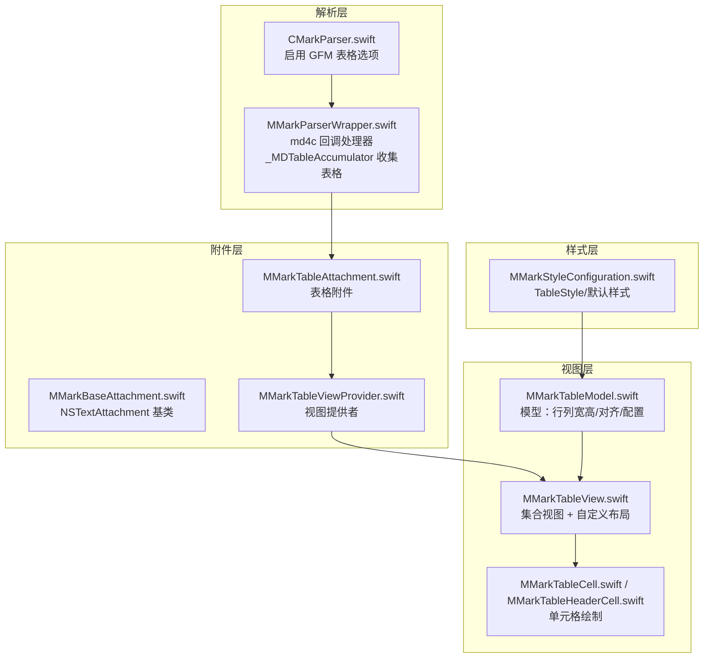
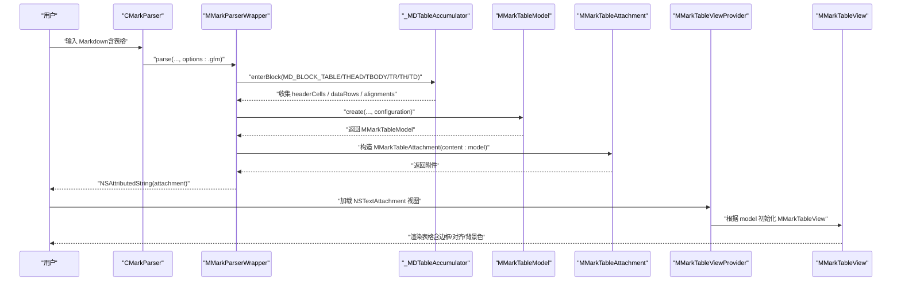
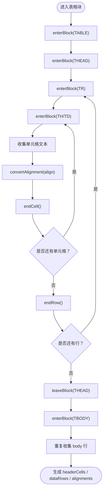
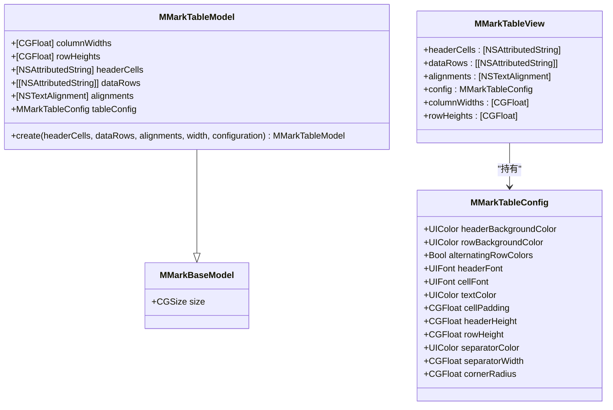
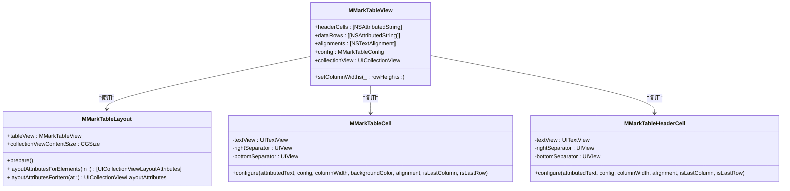
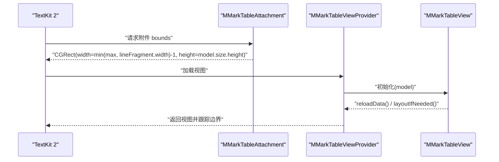
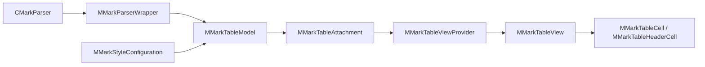

# 表格附件

<cite>
**本文引用的文件**   
- [MMarkTableAttachment.swift](file://MMarkParser/Sources/Renderer/Attachments/MMarkTableAttachment/MMarkTableAttachment.swift)
- [MMarkTableModel.swift](file://MMarkParser/Sources/Renderer/Attachments/MMarkTableAttachment/MMarkTableModel.swift)
- [MMarkTableView.swift](file://MMarkParser/Sources/Renderer/Attachments/MMarkTableAttachment/MMarkTableView.swift)
- [MMarkTableViewProvider.swift](file://MMarkParser/Sources/Renderer/Attachments/MMarkTableAttachment/MMarkTableViewProvider.swift)
- [MMarkBaseAttachment.swift](file://MMarkParser/Sources/Renderer/Attachments/MMarkBaseAttachment/MMarkBaseAttachment.swift)
- [MMarkBaseModel.swift](file://MMarkParser/Sources/Renderer/Attachments/MMarkBaseAttachment/MMarkBaseModel.swift)
- [MMarkStyleConfiguration.swift](file://MMarkParser/Sources/Renderer/MMarkStyleConfiguration.swift)
- [CMarkParser.swift](file://MMarkParser/Sources/Parser/CMarkParser.swift)
- [MMarkParserWrapper.swift](file://MMarkParser/Sources/Parser/MMarkParserWrapper.swift)
- [SampleMarkdown.swift](file://cocoapod_demo/cocoapod_demo/SampleMarkdown.swift)
</cite>

## 目录
1. [简介](#简介)
2. [项目结构](#项目结构)
3. [核心组件](#核心组件)
4. [架构总览](#架构总览)
5. [组件详解](#组件详解)
6. [依赖关系分析](#依赖关系分析)
7. [性能考量](#性能考量)
8. [故障排查指南](#故障排查指南)
9. [结论](#结论)
10. [附录](#附录)

## 简介
本章节面向希望深入理解 MMarkParser 表格附件能力的开发者，系统讲解 GitHub Flavored Markdown（GFM）表格在 TextKit 2 环境中的解析、建模、布局与渲染全流程。重点覆盖：
- 表格解析与对齐转换
- MMarkTableModel 数据结构设计
- 表格视图的复杂渲染逻辑（边框、单元格间距、背景色交替）
- TextKit 2 中的布局约束与尺寸计算
- 表格样式的可定制化配置
- GFM 表格语法的完整支持说明与使用示例

## 项目结构
围绕“表格附件”的关键源文件组织如下：
- 解析层：启用 GFM 表格支持，回调收集表格结构与内容
- 附件层：将表格结构封装为 NSTextAttachment，驱动视图渲染
- 视图层：基于 UICollectionView 的自定义布局，实现单元格绘制与边框渲染
- 样式层：统一的样式配置，驱动表格外观

图表来源
- [CMarkParser.swift:51-66](file://MMarkParser/Sources/Parser/CMarkParser.swift#L51-L66)
- [MMarkParserWrapper.swift:389-646](file://MMarkParser/Sources/Parser/MMarkParserWrapper.swift#L389-L646)
- [MMarkTableAttachment.swift:5-22](file://MMarkParser/Sources/Renderer/Attachments/MMarkTableAttachment/MMarkTableAttachment.swift#L5-L22)
- [MMarkTableViewProvider.swift:8-22](file://MMarkParser/Sources/Renderer/Attachments/MMarkTableAttachment/MMarkTableViewProvider.swift#L8-L22)
- [MMarkTableModel.swift:14-73](file://MMarkParser/Sources/Renderer/Attachments/MMarkTableAttachment/MMarkTableModel.swift#L14-L73)
- [MMarkTableView.swift:60-159](file://MMarkParser/Sources/Renderer/Attachments/MMarkTableAttachment/MMarkTableView.swift#L60-L159)
- [MMarkStyleConfiguration.swift:123-161](file://MMarkParser/Sources/Renderer/MMarkStyleConfiguration.swift#L123-L161)

章节来源
- [CMarkParser.swift:51-66](file://MMarkParser/Sources/Parser/CMarkParser.swift#L51-L66)
- [MMarkParserWrapper.swift:389-646](file://MMarkParser/Sources/Parser/MMarkParserWrapper.swift#L389-L646)
- [MMarkTableAttachment.swift:5-22](file://MMarkParser/Sources/Renderer/Attachments/MMarkTableAttachment/MMarkTableAttachment.swift#L5-L22)
- [MMarkTableViewProvider.swift:8-22](file://MMarkParser/Sources/Renderer/Attachments/MMarkTableAttachment/MMarkTableViewProvider.swift#L8-L22)
- [MMarkTableModel.swift:14-73](file://MMarkParser/Sources/Renderer/Attachments/MMarkTableAttachment/MMarkTableModel.swift#L14-L73)
- [MMarkTableView.swift:60-159](file://MMarkParser/Sources/Renderer/Attachments/MMarkTableAttachment/MMarkTableView.swift#L60-L159)
- [MMarkStyleConfiguration.swift:123-161](file://MMarkParser/Sources/Renderer/MMarkStyleConfiguration.swift#L123-L161)

## 核心组件
- MMarkTableAttachment：表格附件，桥接模型与视图，暴露 headerCells、dataRows、alignments 等只读接口，并提供 TextKit 2 的尺寸计算入口
- MMarkTableModel：表格模型，保存尺寸、列宽、行高、头部与数据行、对齐数组、表格配置
- MMarkTableView：表格视图容器，内部使用 UICollectionView + 自定义布局，负责单元格注册、数据源与代理、背景色与边框绘制
- MMarkTableCell / MMarkTableHeaderCell：单元格视图，负责文本渲染、内边距、对齐、边框绘制与最后一行/列隐藏策略
- MMarkTableViewProvider：NSTextAttachmentViewProvider 实现，负责将附件转换为可视视图
- MMarkBaseAttachment / MMarkBaseModel：附件与模型基类，统一附件类型与尺寸元数据
- MMarkStyleConfiguration：样式配置，包含 TableStyle，默认 GFM 表格外观

章节来源
- [MMarkTableAttachment.swift:5-22](file://MMarkParser/Sources/Renderer/Attachments/MMarkTableAttachment/MMarkTableAttachment.swift#L5-L22)
- [MMarkTableModel.swift:6-25](file://MMarkParser/Sources/Renderer/Attachments/MMarkTableAttachment/MMarkTableModel.swift#L6-L25)
- [MMarkTableView.swift:60-159](file://MMarkParser/Sources/Renderer/Attachments/MMarkTableAttachment/MMarkTableView.swift#L60-L159)
- [MMarkTableView.swift:205-296](file://MMarkParser/Sources/Renderer/Attachments/MMarkTableAttachment/MMarkTableView.swift#L205-L296)
- [MMarkTableViewProvider.swift:6-22](file://MMarkParser/Sources/Renderer/Attachments/MMarkTableAttachment/MMarkTableViewProvider.swift#L6-L22)
- [MMarkBaseAttachment.swift:12-58](file://MMarkParser/Sources/Renderer/Attachments/MMarkBaseAttachment/MMarkBaseAttachment.swift#L12-L58)
- [MMarkBaseModel.swift:3-9](file://MMarkParser/Sources/Renderer/Attachments/MMarkBaseAttachment/MMarkBaseModel.swift#L3-L9)
- [MMarkStyleConfiguration.swift:123-161](file://MMarkParser/Sources/Renderer/MMarkStyleConfiguration.swift#L123-L161)

## 架构总览
从 Markdown 到可视表格的端到端流程如下：

图表来源
- [CMarkParser.swift:51-66](file://MMarkParser/Sources/Parser/CMarkParser.swift#L51-L66)
- [MMarkParserWrapper.swift:389-646](file://MMarkParser/Sources/Parser/MMarkParserWrapper.swift#L389-L646)
- [MMarkTableModel.swift:28-73](file://MMarkParser/Sources/Renderer/Attachments/MMarkTableAttachment/MMarkTableModel.swift#L28-L73)
- [MMarkTableAttachment.swift:7-12](file://MMarkParser/Sources/Renderer/Attachments/MMarkTableAttachment/MMarkTableAttachment.swift#L7-L12)
- [MMarkTableViewProvider.swift:12-22](file://MMarkParser/Sources/Renderer/Attachments/MMarkTableAttachment/MMarkTableViewProvider.swift#L12-L22)
- [MMarkTableView.swift:108-121](file://MMarkParser/Sources/Renderer/Attachments/MMarkTableAttachment/MMarkTableView.swift#L108-L121)

## 组件详解

### 表格解析与对齐转换
- GFM 表格启用：通过 CMarkParser 的 .gfm 选项开启 MD_FLAG_TABLES
- md4c 回调：MMarkParserWrapper 在 enterBlock/leaveBlock 中识别表格块、表头/表体、行与单元格
- 对齐转换：convertAlignment 将底层对齐枚举映射为 NSTextAlignment
- 内容收集：_MDTableAccumulator 逐行收集 headerCells、bodyRows 与 alignments

图表来源
- [CMarkParser.swift:24-46](file://MMarkParser/Sources/Parser/CMarkParser.swift#L24-L46)
- [MMarkParserWrapper.swift:389-646](file://MMarkParser/Sources/Parser/MMarkParserWrapper.swift#L389-L646)
- [MMarkParserWrapper.swift:1220-1227](file://MMarkParser/Sources/Parser/MMarkParserWrapper.swift#L1220-L1227)
- [_MDTableAccumulator 定义与方法:1272-1315](file://MMarkParser/Sources/Parser/MMarkParserWrapper.swift#L1272-L1315)

章节来源
- [CMarkParser.swift:24-46](file://MMarkParser/Sources/Parser/CMarkParser.swift#L24-L46)
- [MMarkParserWrapper.swift:389-646](file://MMarkParser/Sources/Parser/MMarkParserWrapper.swift#L389-L646)
- [MMarkParserWrapper.swift:1220-1227](file://MMarkParser/Sources/Parser/MMarkParserWrapper.swift#L1220-L1227)
- [MMarkParserWrapper.swift:1272-1315](file://MMarkParser/Sources/Parser/MMarkParserWrapper.swift#L1272-L1315)

### MMarkTableModel 数据结构设计
- 关键字段
  - columnWidths：每列最小宽度，结合内容测量与约束上限/下限计算
  - rowHeights：每行高度，包含表头行高与数据行最大高度
  - headerCells / dataRows：头部与数据行的富文本序列
  - alignments：每列对齐方式
  - tableConfig：表格样式配置（来自 MMarkStyleConfiguration.tableStyle）
  - size：表格整体尺寸（列宽之和、行高之和）
- 创建流程
  - 从配置读取默认样式（headerBackgroundColor、separatorColor、separatorWidth、cornerRadius）
  - 依据 CellSizeConstraint（min/max/height 下限）与内边距计算列宽
  - 逐行测量文本尺寸，更新列宽与行高
  - 汇总得到 size 并创建模型

图表来源
- [MMarkBaseModel.swift:3-9](file://MMarkParser/Sources/Renderer/Attachments/MMarkBaseAttachment/MMarkBaseModel.swift#L3-L9)
- [MMarkTableModel.swift:6-25](file://MMarkParser/Sources/Renderer/Attachments/MMarkTableAttachment/MMarkTableModel.swift#L6-L25)
- [MMarkTableView.swift:76-91](file://MMarkParser/Sources/Renderer/Attachments/MMarkTableAttachment/MMarkTableView.swift#L76-L91)

章节来源
- [MMarkTableModel.swift:6-25](file://MMarkParser/Sources/Renderer/Attachments/MMarkTableAttachment/MMarkTableModel.swift#L6-L25)
- [MMarkTableModel.swift:28-73](file://MMarkParser/Sources/Renderer/Attachments/MMarkTableAttachment/MMarkTableModel.swift#L28-L73)
- [MMarkTableView.swift:76-91](file://MMarkParser/Sources/Renderer/Attachments/MMarkTableAttachment/MMarkTableView.swift#L76-L91)
- [MMarkBaseModel.swift:3-9](file://MMarkParser/Sources/Renderer/Attachments/MMarkBaseAttachment/MMarkBaseModel.swift#L3-L9)

### 表格视图的复杂渲染逻辑
- 集合视图与自定义布局
  - MMarkTableLayout：按列宽与行高计算每个单元格的 frame，汇总 contentSize
- 数据源与单元格类型
  - section=0 为表头；其余为数据行
  - 表头单元格与普通单元格分别复用不同 cell 类型
- 背景色与交替行
  - 当开启交替行颜色时，偶数行使用半透明背景色
- 边框绘制与隐藏策略
  - 右侧与底部边框由独立 UIView 绘制
  - 最后一列右侧边框与最后一行底部边框隐藏
- 文本对齐与垂直居中
  - 根据对齐设置文本对齐
  - 通过 sizeThatFits 计算文本高度并计算顶部 inset 实现垂直居中
- 内边距与列宽
  - 文本区域 = 列宽 - 2×cellPadding
  - 文本容器 inset 与 lineFragmentPadding 控制排版

图表来源
- [MMarkTableView.swift:6-55](file://MMarkParser/Sources/Renderer/Attachments/MMarkTableAttachment/MMarkTableView.swift#L6-L55)
- [MMarkTableView.swift:162-201](file://MMarkParser/Sources/Renderer/Attachments/MMarkTableAttachment/MMarkTableView.swift#L162-L201)
- [MMarkTableView.swift:205-296](file://MMarkParser/Sources/Renderer/Attachments/MMarkTableAttachment/MMarkTableView.swift#L205-L296)

章节来源
- [MMarkTableView.swift:6-55](file://MMarkParser/Sources/Renderer/Attachments/MMarkTableAttachment/MMarkTableView.swift#L6-L55)
- [MMarkTableView.swift:162-201](file://MMarkParser/Sources/Renderer/Attachments/MMarkTableAttachment/MMarkTableView.swift#L162-L201)
- [MMarkTableView.swift:205-296](file://MMarkParser/Sources/Renderer/Attachments/MMarkTableAttachment/MMarkTableView.swift#L205-L296)

### TextKit 2 布局约束与尺寸计算
- 附件 bounds 计算
  - MMarkTableAttachment.attachmentBounds 根据行片段宽度与模型宽度，限制表格宽度并返回尺寸
- 视图提供者
  - MMarkTableViewProvider 加载 MMarkTableView 并标记 tracksTextAttachmentViewBounds，使 TextKit 能跟踪附件视图边界并触发重新布局
- 布局联动
  - 初始化 MMarkTableView 时应用模型中的 columnWidths / rowHeights，并 reload 数据与布局

图表来源
- [MMarkTableAttachment.swift:18-21](file://MMarkParser/Sources/Renderer/Attachments/MMarkTableAttachment/MMarkTableAttachment.swift#L18-L21)
- [MMarkTableViewProvider.swift:12-22](file://MMarkParser/Sources/Renderer/Attachments/MMarkTableAttachment/MMarkTableViewProvider.swift#L12-L22)
- [MMarkTableView.swift:108-121](file://MMarkParser/Sources/Renderer/Attachments/MMarkTableAttachment/MMarkTableView.swift#L108-L121)

章节来源
- [MMarkTableAttachment.swift:18-21](file://MMarkParser/Sources/Renderer/Attachments/MMarkTableAttachment/MMarkTableAttachment.swift#L18-L21)
- [MMarkTableViewProvider.swift:12-22](file://MMarkParser/Sources/Renderer/Attachments/MMarkTableAttachment/MMarkTableViewProvider.swift#L12-L22)
- [MMarkTableView.swift:108-121](file://MMarkParser/Sources/Renderer/Attachments/MMarkTableAttachment/MMarkTableView.swift#L108-L121)

### 表格样式自定义选项
- 可配置项
  - 表头背景色、单元格背景色、交替行颜色开关
  - 表头/单元格字体、文本颜色
  - 内边距、表头高度、单元格默认高度
  - 分隔线颜色、宽度、圆角
- 来源
  - MMarkStyleConfiguration.tableStyle 提供默认值
  - MMarkTableModel.create 从配置复制到 MMarkTableConfig
  - MMarkTableView 在初始化时应用 config 并在单元格绘制中使用

章节来源
- [MMarkStyleConfiguration.swift:123-161](file://MMarkParser/Sources/Renderer/MMarkStyleConfiguration.swift#L123-L161)
- [MMarkTableModel.swift:31-36](file://MMarkParser/Sources/Renderer/Attachments/MMarkTableAttachment/MMarkTableModel.swift#L31-L36)
- [MMarkTableView.swift:76-91](file://MMarkParser/Sources/Renderer/Attachments/MMarkTableAttachment/MMarkTableView.swift#L76-L91)
- [MMarkTableView.swift:108-121](file://MMarkParser/Sources/Renderer/Attachments/MMarkTableAttachment/MMarkTableView.swift#L108-L121)

### GFM 表格语法支持与使用示例
- 语法支持
  - 表头行、分隔行、数据行、列对齐（左/右/中）
  - 表格内可嵌套 Markdown 格式（粗体、斜体、删除线、代码、链接）
- 使用示例
  - 基础表格、含格式表格、多列/多行表格、单列/两列表格
  - 表格与列表、引用、代码块、脚注等混合内容

章节来源
- [CMarkParser.swift:24-46](file://MMarkParser/Sources/Parser/CMarkParser.swift#L24-L46)
- [SampleMarkdown.swift:505-566](file://cocoapod_demo/cocoapod_demo/SampleMarkdown.swift#L505-L566)

## 依赖关系分析
- 组件耦合
  - MMarkTableAttachment 依赖 MMarkTableModel（只读访问）
  - MMarkTableView 依赖 MMarkTableModel（读取列宽/行高/对齐/配置）
  - MMarkTableViewProvider 依赖 MMarkTableAttachment 与 MMarkTableView
  - 解析器通过 MMarkParserWrapper 产出 MMarkTableModel
- 外部依赖
  - TextKit 2（NSTextAttachment/NSTextAttachmentViewProvider）
  - md4c（SAX 回调）

图表来源
- [CMarkParser.swift:51-66](file://MMarkParser/Sources/Parser/CMarkParser.swift#L51-L66)
- [MMarkParserWrapper.swift:591-598](file://MMarkParser/Sources/Parser/MMarkParserWrapper.swift#L591-L598)
- [MMarkTableModel.swift:14-25](file://MMarkParser/Sources/Renderer/Attachments/MMarkTableAttachment/MMarkTableModel.swift#L14-L25)
- [MMarkTableAttachment.swift:7-12](file://MMarkParser/Sources/Renderer/Attachments/MMarkTableAttachment/MMarkTableAttachment.swift#L7-L12)
- [MMarkTableViewProvider.swift:12-19](file://MMarkParser/Sources/Renderer/Attachments/MMarkTableAttachment/MMarkTableViewProvider.swift#L12-L19)
- [MMarkTableView.swift:108-121](file://MMarkParser/Sources/Renderer/Attachments/MMarkTableAttachment/MMarkTableView.swift#L108-L121)
- [MMarkStyleConfiguration.swift:123-161](file://MMarkParser/Sources/Renderer/MMarkStyleConfiguration.swift#L123-L161)

章节来源
- [CMarkParser.swift:51-66](file://MMarkParser/Sources/Parser/CMarkParser.swift#L51-L66)
- [MMarkParserWrapper.swift:591-598](file://MMarkParser/Sources/Parser/MMarkParserWrapper.swift#L591-L598)
- [MMarkTableModel.swift:14-25](file://MMarkParser/Sources/Renderer/Attachments/MMarkTableAttachment/MMarkTableModel.swift#L14-L25)
- [MMarkTableAttachment.swift:7-12](file://MMarkParser/Sources/Renderer/Attachments/MMarkTableAttachment/MMarkTableAttachment.swift#L7-L12)
- [MMarkTableViewProvider.swift:12-19](file://MMarkParser/Sources/Renderer/Attachments/MMarkTableAttachment/MMarkTableViewProvider.swift#L12-L19)
- [MMarkTableView.swift:108-121](file://MMarkParser/Sources/Renderer/Attachments/MMarkTableAttachment/MMarkTableView.swift#L108-L121)
- [MMarkStyleConfiguration.swift:123-161](file://MMarkParser/Sources/Renderer/MMarkStyleConfiguration.swift#L123-L161)

## 性能考量
- 文本测量与布局
  - 列宽/行高的计算涉及多次 boundingRect 与 sizeThatFits，建议在容器宽度固定场景复用模型
- 视图重绘
  - 仅在列宽/行高或配置变化时 reloadData/layoutIfNeeded
- 边框绘制
  - 右侧/底部边框为独立视图，注意在 isLastColumn/isLastRow 时隐藏以减少绘制开销
- 滚动性能
  - 使用 UICollectionView 的复用机制，避免一次性创建大量单元格

## 故障排查指南
- 表格不显示
  - 检查是否启用 .gfm 选项
  - 确认 _MDTableAccumulator 是否正确收集 headerCells / dataRows / alignments
- 对齐异常
  - 核对 convertAlignment 的映射是否正确
  - 确认 alignments 数组长度与列数一致
- 边框缺失或错位
  - 检查 separatorColor/separatorWidth 设置
  - 确认 isLastColumn/isLastRow 的判断与隐藏逻辑
- 文本未垂直居中
  - 检查 cellPadding 与 textContainerInset 的计算
- 尺寸异常
  - 确认 MMarkTableAttachment.attachmentBounds 的宽度裁剪逻辑
  - 检查 MMarkTableLayout 的 contentSize 计算

章节来源
- [CMarkParser.swift:24-46](file://MMarkParser/Sources/Parser/CMarkParser.swift#L24-L46)
- [MMarkParserWrapper.swift:1220-1227](file://MMarkParser/Sources/Parser/MMarkParserWrapper.swift#L1220-L1227)
- [MMarkTableView.swift:205-296](file://MMarkParser/Sources/Renderer/Attachments/MMarkTableAttachment/MMarkTableView.swift#L205-L296)
- [MMarkTableAttachment.swift:18-21](file://MMarkParser/Sources/Renderer/Attachments/MMarkTableAttachment/MMarkTableAttachment.swift#L18-L21)

## 结论
MMarkParser 的表格附件功能完整实现了 GFM 表格在 TextKit 2 中的解析、建模、布局与渲染。通过 MMarkTableModel 的尺寸计算与 MMarkTableView 的自定义布局，配合样式配置与单元格绘制策略，实现了对齐、边框、内边距与背景色交替等丰富视觉效果。该实现具备良好的扩展性，便于进一步定制表格外观与交互行为。

## 附录
- GFM 表格语法示例参考：见 demo 文档中的“表格测试”章节
- 默认样式参考：MMarkStyleConfiguration.defaultStyle 中的 TableStyle 配置

章节来源
- [SampleMarkdown.swift:505-566](file://cocoapod_demo/cocoapod_demo/SampleMarkdown.swift#L505-L566)
- [MMarkStyleConfiguration.swift:189-267](file://MMarkParser/Sources/Renderer/MMarkStyleConfiguration.swift#L189-L267)