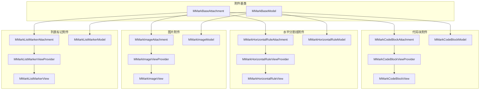
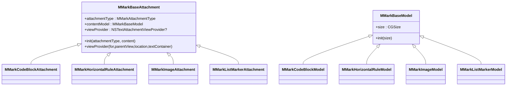
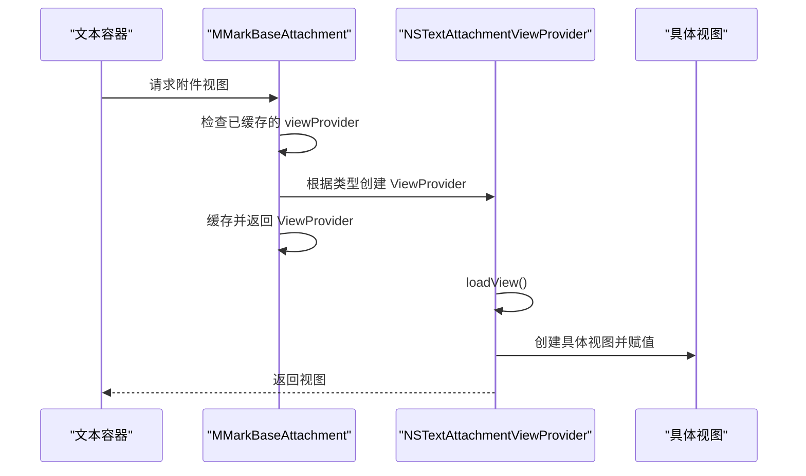
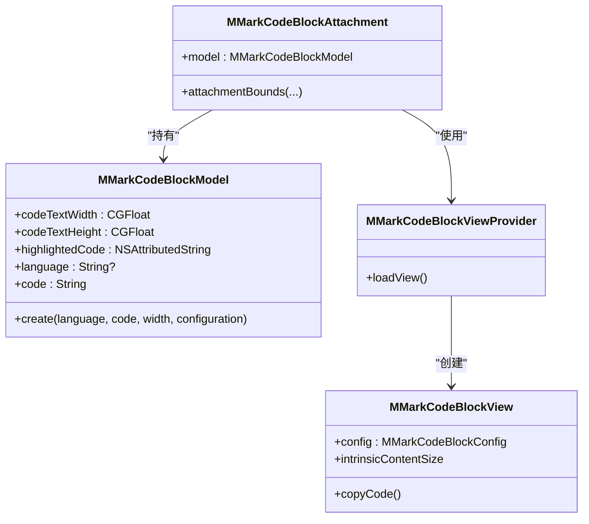
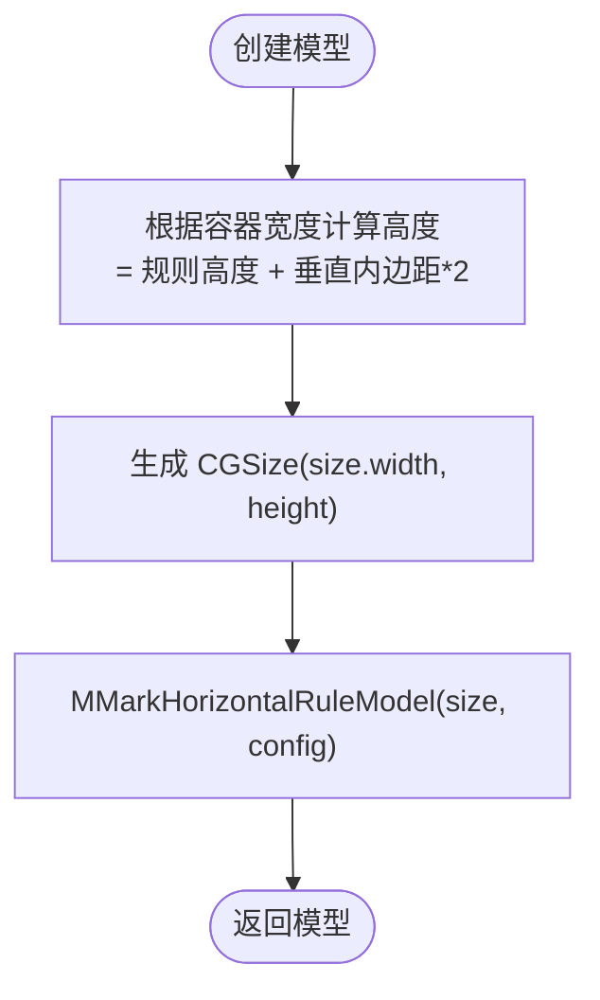
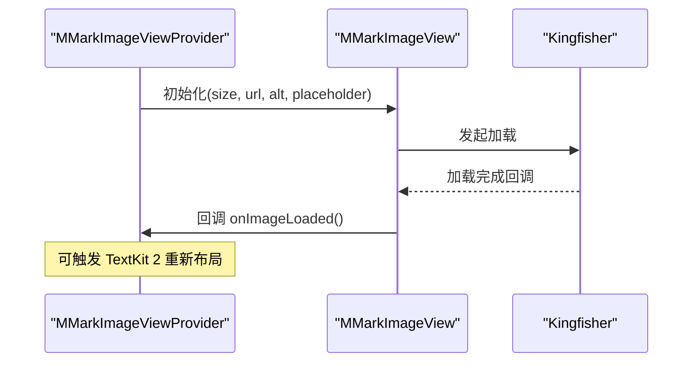
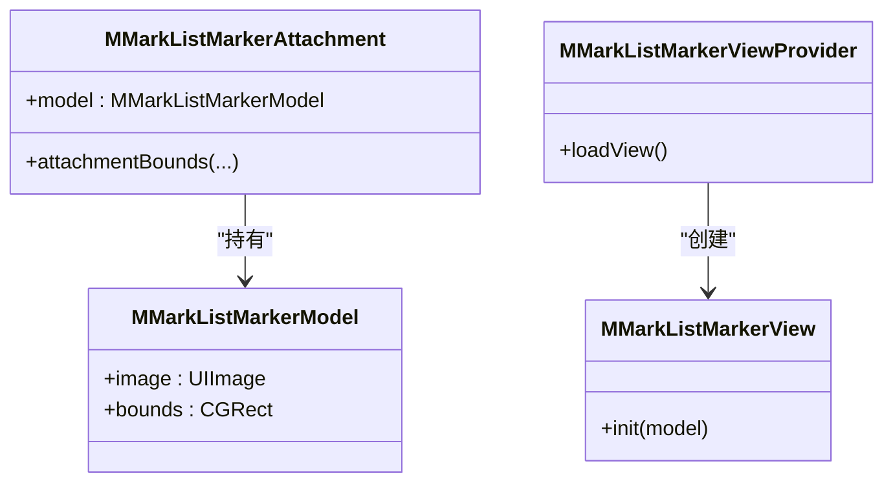
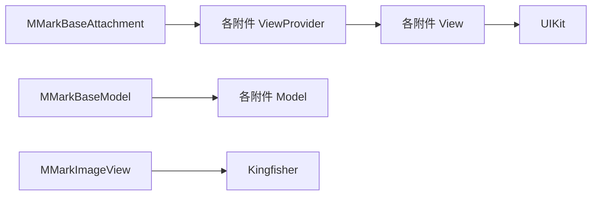

# 附件系统

<cite>
**本文引用的文件**
- [MMarkBaseAttachment.swift](file://MMarkParser/Sources/Renderer/Attachments/MMarkBaseAttachment/MMarkBaseAttachment.swift)
- [MMarkBaseModel.swift](file://MMarkParser/Sources/Renderer/Attachments/MMarkBaseAttachment/MMarkBaseModel.swift)
- [MMarkCodeBlockAttachment.swift](file://MMarkParser/Sources/Renderer/Attachments/MMarkCodeBlockAttachment/MMarkCodeBlockAttachment.swift)
- [MMarkCodeBlockModel.swift](file://MMarkParser/Sources/Renderer/Attachments/MMarkCodeBlockAttachment/MMarkCodeBlockModel.swift)
- [MMarkCodeBlockView.swift](file://MMarkParser/Sources/Renderer/Attachments/MMarkCodeBlockAttachment/MMarkCodeBlockView.swift)
- [MMarkCodeBlockViewProvider.swift](file://MMarkParser/Sources/Renderer/Attachments/MMarkCodeBlockAttachment/MMarkCodeBlockViewProvider.swift)
- [MMarkHorizontalRuleAttachment.swift](file://MMarkParser/Sources/Renderer/Attachments/MMarkHorizontalRuleAttachment/MMarkHorizontalRuleAttachment.swift)
- [MMarkHorizontalRuleModel.swift](file://MMarkParser/Sources/Renderer/Attachments/MMarkHorizontalRuleAttachment/MMarkHorizontalRuleModel.swift)
- [MMarkHorizontalRuleView.swift](file://MMarkParser/Sources/Renderer/Attachments/MMarkHorizontalRuleAttachment/MMarkHorizontalRuleView.swift)
- [MMarkHorizontalRuleViewProvider.swift](file://MMarkParser/Sources/Renderer/Attachments/MMarkHorizontalRuleAttachment/MMarkHorizontalRuleViewProvider.swift)
- [MMarkImageAttachment.swift](file://MMarkParser/Sources/Renderer/Attachments/MMarkImageAttachment/MMarkImageAttachment.swift)
- [MMarkImageModel.swift](file://MMarkParser/Sources/Renderer/Attachments/MMarkImageAttachment/MMarkImageModel.swift)
- [MMarkImageView.swift](file://MMarkParser/Sources/Renderer/Attachments/MMarkImageAttachment/MMarkImageView.swift)
- [MMarkImageViewProvider.swift](file://MMarkParser/Sources/Renderer/Attachments/MMarkImageAttachment/MMarkImageViewProvider.swift)
- [MMarkListMarkerAttachment.swift](file://MMarkParser/Sources/Renderer/Attachments/MMarkListMarkerAttachment/MMarkListMarkerAttachment.swift)
- [MMarkListMarkerModel.swift](file://MMarkParser/Sources/Renderer/Attachments/MMarkListMarkerAttachment/MMarkListMarkerModel.swift)
- [MMarkListMarkerView.swift](file://MMarkParser/Sources/Renderer/Attachments/MMarkListMarkerAttachment/MMarkListMarkerView.swift)
- [MMarkListMarkerViewProvider.swift](file://MMarkParser/Sources/Renderer/Attachments/MMarkListMarkerAttachment/MMarkListMarkerViewProvider.swift)
</cite>

## 目录
1. [简介](#简介)
2. [项目结构](#项目结构)
3. [核心组件](#核心组件)
4. [架构总览](#架构总览)
5. [详细组件分析](#详细组件分析)
6. [依赖关系分析](#依赖关系分析)
7. [性能考量](#性能考量)
8. [故障排查指南](#故障排查指南)
9. [结论](#结论)
10. [附录：扩展与最佳实践](#附录扩展与最佳实践)

## 简介
本文件面向 MMarkParser 的“附件系统”，聚焦于基于 NSTextAttachment 的富内容渲染架构。系统通过统一的基类 MMarkBaseAttachment 与 MMarkBaseModel，结合 NSTextAttachmentViewProvider 模式，实现了对多种复杂内容类型的统一接入与懒加载视图创建。核心覆盖以下附件类型：
- 代码块附件：语法高亮渲染与复制交互
- 表格附件：GFM 表格渲染（见同目录下 MMarkTable* 文件）
- 图片附件：基于 Kingfisher 的远程加载与占位图
- 数学公式附件：iosMath 渲染（见同目录下 MMarkMathBlock* 文件）
- 水平分割线附件：绘制式规则线
- 列表标记附件：自绘或占位图像

该架构强调“模型与视图分离”“工厂方法创建模型”“延迟视图创建”“统一入口分发”，便于扩展新的附件类型。

## 项目结构
附件系统位于渲染层的“Attachments”子模块中，采用“按功能域分组”的组织方式：
- 基类与通用模型：MMarkBaseAttachment、MMarkBaseModel
- 各附件类型：代码块、水平分割线、图片、列表标记等
- 每个附件包含：Attachment 类、Model、View、ViewProvider 四部分

图表来源
- [MMarkBaseAttachment.swift:12-59](file://MMarkParser/Sources/Renderer/Attachments/MMarkBaseAttachment/MMarkBaseAttachment.swift#L12-L59)
- [MMarkBaseModel.swift:3-9](file://MMarkParser/Sources/Renderer/Attachments/MMarkBaseAttachment/MMarkBaseModel.swift#L3-L9)
- [MMarkCodeBlockAttachment.swift:6-21](file://MMarkParser/Sources/Renderer/Attachments/MMarkCodeBlockAttachment/MMarkCodeBlockAttachment.swift#L6-L21)
- [MMarkCodeBlockModel.swift:6-45](file://MMarkParser/Sources/Renderer/Attachments/MMarkCodeBlockAttachment/MMarkCodeBlockModel.swift#L6-L45)
- [MMarkCodeBlockView.swift:6-179](file://MMarkParser/Sources/Renderer/Attachments/MMarkCodeBlockAttachment/MMarkCodeBlockView.swift#L6-L179)
- [MMarkCodeBlockViewProvider.swift:6-21](file://MMarkParser/Sources/Renderer/Attachments/MMarkCodeBlockAttachment/MMarkCodeBlockViewProvider.swift#L6-L21)
- [MMarkHorizontalRuleAttachment.swift:6-37](file://MMarkParser/Sources/Renderer/Attachments/MMarkHorizontalRuleAttachment/MMarkHorizontalRuleAttachment.swift#L6-L37)
- [MMarkHorizontalRuleModel.swift:6-26](file://MMarkParser/Sources/Renderer/Attachments/MMarkHorizontalRuleAttachment/MMarkHorizontalRuleModel.swift#L6-L26)
- [MMarkHorizontalRuleView.swift:6-56](file://MMarkParser/Sources/Renderer/Attachments/MMarkHorizontalRuleAttachment/MMarkHorizontalRuleView.swift#L6-L56)
- [MMarkHorizontalRuleViewProvider.swift:6-23](file://MMarkParser/Sources/Renderer/Attachments/MMarkHorizontalRuleAttachment/MMarkHorizontalRuleViewProvider.swift#L6-L23)
- [MMarkImageAttachment.swift:5-22](file://MMarkParser/Sources/Renderer/Attachments/MMarkImageAttachment/MMarkImageAttachment.swift#L5-L22)
- [MMarkImageModel.swift:6-26](file://MMarkParser/Sources/Renderer/Attachments/MMarkImageAttachment/MMarkImageModel.swift#L6-L26)
- [MMarkImageView.swift:7-132](file://MMarkParser/Sources/Renderer/Attachments/MMarkImageAttachment/MMarkImageView.swift#L7-L132)
- [MMarkImageViewProvider.swift:6-32](file://MMarkParser/Sources/Renderer/Attachments/MMarkImageAttachment/MMarkImageViewProvider.swift#L6-L32)
- [MMarkListMarkerAttachment.swift:5-17](file://MMarkParser/Sources/Renderer/Attachments/MMarkListMarkerAttachment/MMarkListMarkerAttachment.swift#L5-L17)
- [MMarkListMarkerModel.swift:6-15](file://MMarkParser/Sources/Renderer/Attachments/MMarkListMarkerAttachment/MMarkListMarkerModel.swift#L6-L15)
- [MMarkListMarkerView.swift:6-32](file://MMarkParser/Sources/Renderer/Attachments/MMarkListMarkerAttachment/MMarkListMarkerView.swift#L6-L32)
- [MMarkListMarkerViewProvider.swift:6-18](file://MMarkParser/Sources/Renderer/Attachments/MMarkListMarkerAttachment/MMarkListMarkerViewProvider.swift#L6-L18)

章节来源
- [MMarkBaseAttachment.swift:12-59](file://MMarkParser/Sources/Renderer/Attachments/MMarkBaseAttachment/MMarkBaseAttachment.swift#L12-L59)
- [MMarkBaseModel.swift:3-9](file://MMarkParser/Sources/Renderer/Attachments/MMarkBaseAttachment/MMarkBaseModel.swift#L3-L9)

## 核心组件
- MMarkAttachmentType：统一枚举标识各类附件类型，用于在基类中进行懒加载分发。
- MMarkBaseAttachment：继承自 NSTextAttachment，持有 contentModel 与可选的 viewProvider；重写 viewProvider(for:) 实现按类型分发。
- MMarkBaseModel：承载尺寸信息，作为各附件模型的基类。

图表来源
- [MMarkBaseAttachment.swift:12-59](file://MMarkParser/Sources/Renderer/Attachments/MMarkBaseAttachment/MMarkBaseAttachment.swift#L12-L59)
- [MMarkBaseModel.swift:3-9](file://MMarkParser/Sources/Renderer/Attachments/MMarkBaseAttachment/MMarkBaseModel.swift#L3-L9)
- [MMarkCodeBlockAttachment.swift:6-21](file://MMarkParser/Sources/Renderer/Attachments/MMarkCodeBlockAttachment/MMarkCodeBlockAttachment.swift#L6-L21)
- [MMarkHorizontalRuleAttachment.swift:6-37](file://MMarkParser/Sources/Renderer/Attachments/MMarkHorizontalRuleAttachment/MMarkHorizontalRuleAttachment.swift#L6-L37)
- [MMarkImageAttachment.swift:5-22](file://MMarkParser/Sources/Renderer/Attachments/MMarkImageAttachment/MMarkImageAttachment.swift#L5-L22)
- [MMarkListMarkerAttachment.swift:5-17](file://MMarkParser/Sources/Renderer/Attachments/MMarkListMarkerAttachment/MMarkListMarkerAttachment.swift#L5-L17)

章节来源
- [MMarkBaseAttachment.swift:3-10](file://MMarkParser/Sources/Renderer/Attachments/MMarkBaseAttachment/MMarkBaseAttachment.swift#L3-L10)
- [MMarkBaseAttachment.swift:22-58](file://MMarkParser/Sources/Renderer/Attachments/MMarkBaseAttachment/MMarkBaseAttachment.swift#L22-L58)
- [MMarkBaseModel.swift:6-9](file://MMarkParser/Sources/Renderer/Attachments/MMarkBaseAttachment/MMarkBaseModel.swift#L6-L9)

## 架构总览
附件系统的运行时控制流如下：
- 文本容器请求附件视图时，MMarkBaseAttachment 的 viewProvider(for:) 被调用
- 若未缓存 viewProvider，则根据 attachmentType 分派到对应 ViewProvider
- ViewProvider.loadView() 中创建具体 View，并设置 tracksTextAttachmentViewBounds
- 对于需要动态尺寸或异步加载的附件，通过模型工厂方法预先计算尺寸，避免布局抖动

图表来源
- [MMarkBaseAttachment.swift:32-58](file://MMarkParser/Sources/Renderer/Attachments/MMarkBaseAttachment/MMarkBaseAttachment.swift#L32-L58)
- [MMarkCodeBlockViewProvider.swift:12-20](file://MMarkParser/Sources/Renderer/Attachments/MMarkCodeBlockAttachment/MMarkCodeBlockViewProvider.swift#L12-L20)
- [MMarkHorizontalRuleViewProvider.swift:12-22](file://MMarkParser/Sources/Renderer/Attachments/MMarkHorizontalRuleAttachment/MMarkHorizontalRuleViewProvider.swift#L12-L22)
- [MMarkImageViewProvider.swift:12-31](file://MMarkParser/Sources/Renderer/Attachments/MMarkImageAttachment/MMarkImageViewProvider.swift#L12-L31)
- [MMarkListMarkerViewProvider.swift:12-17](file://MMarkParser/Sources/Renderer/Attachments/MMarkListMarkerAttachment/MMarkListMarkerViewProvider.swift#L12-L17)

## 详细组件分析

### 代码块附件（语法高亮）
- 模型工厂：根据语言、代码与容器宽度计算尺寸，生成高亮富文本与文本自然尺寸
- 视图：包含头部（语言标签与复制按钮）与滚动代码区域，约束绑定模型尺寸
- 视图提供者：懒加载创建 MMarkCodeBlockView，并开启 bounds 跟踪

图表来源
- [MMarkCodeBlockAttachment.swift:8-20](file://MMarkParser/Sources/Renderer/Attachments/MMarkCodeBlockAttachment/MMarkCodeBlockAttachment.swift#L8-L20)
- [MMarkCodeBlockModel.swift:13-44](file://MMarkParser/Sources/Renderer/Attachments/MMarkCodeBlockAttachment/MMarkCodeBlockModel.swift#L13-L44)
- [MMarkCodeBlockView.swift:14-179](file://MMarkParser/Sources/Renderer/Attachments/MMarkCodeBlockAttachment/MMarkCodeBlockView.swift#L14-L179)
- [MMarkCodeBlockViewProvider.swift:8-21](file://MMarkParser/Sources/Renderer/Attachments/MMarkCodeBlockAttachment/MMarkCodeBlockViewProvider.swift#L8-L21)

章节来源
- [MMarkCodeBlockModel.swift:23-44](file://MMarkParser/Sources/Renderer/Attachments/MMarkCodeBlockAttachment/MMarkCodeBlockModel.swift#L23-L44)
- [MMarkCodeBlockView.swift:153-168](file://MMarkParser/Sources/Renderer/Attachments/MMarkCodeBlockAttachment/MMarkCodeBlockView.swift#L153-L168)
- [MMarkCodeBlockAttachment.swift:15-20](file://MMarkParser/Sources/Renderer/Attachments/MMarkCodeBlockAttachment/MMarkCodeBlockAttachment.swift#L15-L20)

### 水平分割线附件（绘制式）
- 模型工厂：根据容器宽度计算高度（含上下内边距），颜色与高度来自样式配置
- 视图：在 draw 中绘制一条水平线，居中于视图高度
- 视图提供者：懒加载后触发一次布局失效以刷新布局

图表来源
- [MMarkHorizontalRuleModel.swift:15-25](file://MMarkParser/Sources/Renderer/Attachments/MMarkHorizontalRuleAttachment/MMarkHorizontalRuleModel.swift#L15-L25)

章节来源
- [MMarkHorizontalRuleView.swift:40-51](file://MMarkParser/Sources/Renderer/Attachments/MMarkHorizontalRuleAttachment/MMarkHorizontalRuleView.swift#L40-L51)
- [MMarkHorizontalRuleViewProvider.swift:12-22](file://MMarkParser/Sources/Renderer/Attachments/MMarkHorizontalRuleAttachment/MMarkHorizontalRuleViewProvider.swift#L12-L22)

### 图片附件（Kingfisher 远程加载）
- 模型工厂：按 4:3 宽高比估算尺寸
- 视图：占位色背景 + 占位图标 + 加载指示器；使用 Kingfisher 异步加载并过渡动画
- 视图提供者：懒加载创建 MMarkImageView；预留了加载完成后的布局失效回调（注释）

图表来源
- [MMarkImageViewProvider.swift:12-31](file://MMarkParser/Sources/Renderer/Attachments/MMarkImageAttachment/MMarkImageViewProvider.swift#L12-L31)
- [MMarkImageView.swift:69-100](file://MMarkParser/Sources/Renderer/Attachments/MMarkImageAttachment/MMarkImageView.swift#L69-L100)

章节来源
- [MMarkImageModel.swift:21-25](file://MMarkParser/Sources/Renderer/Attachments/MMarkImageAttachment/MMarkImageModel.swift#L21-L25)
- [MMarkImageView.swift:29-37](file://MMarkParser/Sources/Renderer/Attachments/MMarkImageAttachment/MMarkImageView.swift#L29-L37)

### 列表标记附件（图像标记）
- 模型：持有预生成的标记图像与绘制边界
- 视图：UIImageView 居中显示图像
- 视图提供者：懒加载创建 MMarkListMarkerView

图表来源
- [MMarkListMarkerAttachment.swift:7-16](file://MMarkParser/Sources/Renderer/Attachments/MMarkListMarkerAttachment/MMarkListMarkerAttachment.swift#L7-L16)
- [MMarkListMarkerModel.swift:10-14](file://MMarkParser/Sources/Renderer/Attachments/MMarkListMarkerAttachment/MMarkListMarkerModel.swift#L10-L14)
- [MMarkListMarkerView.swift:24-27](file://MMarkParser/Sources/Renderer/Attachments/MMarkListMarkerAttachment/MMarkListMarkerView.swift#L24-L27)
- [MMarkListMarkerViewProvider.swift:12-17](file://MMarkParser/Sources/Renderer/Attachments/MMarkListMarkerAttachment/MMarkListMarkerViewProvider.swift#L12-L17)

章节来源
- [MMarkListMarkerAttachment.swift:14-16](file://MMarkParser/Sources/Renderer/Attachments/MMarkListMarkerAttachment/MMarkListMarkerAttachment.swift#L14-L16)

### 公共特性与模式
- 懒加载视图创建：通过 NSTextAttachmentViewProvider 的 loadView() 在首次需要时创建视图
- 视图边界跟踪：设置 tracksTextAttachmentViewBounds，使 TextKit 2 能正确跟踪附件视图大小
- 工厂方法：各附件模型均提供 create(...) 工厂方法，集中计算尺寸与样式，减少布局抖动
- 尺寸约束：代码块与图片等通过约束绑定模型尺寸，保证在不同容器宽度下的稳定渲染

章节来源
- [MMarkBaseAttachment.swift:32-58](file://MMarkParser/Sources/Renderer/Attachments/MMarkBaseAttachment/MMarkBaseAttachment.swift#L32-L58)
- [MMarkCodeBlockViewProvider.swift:18-20](file://MMarkParser/Sources/Renderer/Attachments/MMarkCodeBlockAttachment/MMarkCodeBlockViewProvider.swift#L18-L20)
- [MMarkHorizontalRuleViewProvider.swift:19-22](file://MMarkParser/Sources/Renderer/Attachments/MMarkHorizontalRuleAttachment/MMarkHorizontalRuleViewProvider.swift#L19-L22)
- [MMarkImageViewProvider.swift:29-31](file://MMarkParser/Sources/Renderer/Attachments/MMarkImageAttachment/MMarkImageViewProvider.swift#L29-L31)

## 依赖关系分析
- 组件耦合：各附件类型仅依赖 MMarkBaseAttachment 与 MMarkBaseModel，彼此解耦
- 视图提供者：每个附件类型独立的 ViewProvider，避免在基类中引入分支逻辑
- 外部依赖：图片附件依赖 Kingfisher；代码块高亮依赖语法高亮工具链
- 循环依赖：无直接循环，遵循“模型 → 视图 → 提供者”的单向依赖

图表来源
- [MMarkBaseAttachment.swift:37-50](file://MMarkParser/Sources/Renderer/Attachments/MMarkBaseAttachment/MMarkBaseAttachment.swift#L37-L50)
- [MMarkImageView.swift:2](file://MMarkParser/Sources/Renderer/Attachments/MMarkImageAttachment/MMarkImageView.swift#L2)

章节来源
- [MMarkImageView.swift:2](file://MMarkParser/Sources/Renderer/Attachments/MMarkImageAttachment/MMarkImageView.swift#L2)
- [MMarkCodeBlockView.swift:164-167](file://MMarkParser/Sources/Renderer/Attachments/MMarkCodeBlockAttachment/MMarkCodeBlockView.swift#L164-L167)

## 性能考量
- 懒加载与缓存：MMarkBaseAttachment 缓存已创建的 ViewProvider，避免重复分配
- 尺寸预计算：模型工厂在主线程或合适时机计算尺寸，减少 TextKit 2 重排次数
- 视图约束：通过约束绑定模型尺寸，降低手动布局成本
- 图片加载：使用 Kingfisher 的处理器与缓存策略，减少内存占用与网络请求
- 高亮渲染：语法高亮在模型阶段完成，视图仅消费富文本，降低 UI 线程压力

## 故障排查指南
- 视图未显示或尺寸异常
  - 检查模型尺寸是否合理（宽度应大于 0）
  - 确认 tracksTextAttachmentViewBounds 已启用
  - 参考：[MMarkCodeBlockViewProvider.swift:19](file://MMarkParser/Sources/Renderer/Attachments/MMarkCodeBlockAttachment/MMarkCodeBlockViewProvider.swift#L19)
- 图片加载失败或不更新
  - 确认 URL 有效且尺寸参数合法
  - 检查 onImageLoaded 回调是否触发（如需 TextKit 2 重新布局）
  - 参考：[MMarkImageViewProvider.swift:19-28](file://MMarkParser/Sources/Renderer/Attachments/MMarkImageAttachment/MMarkImageViewProvider.swift#L19-L28)
- 代码块高亮无效
  - 确认语言字符串非空，否则回退为纯文本
  - 参考：[MMarkCodeBlockView.swift:157-162](file://MMarkParser/Sources/Renderer/Attachments/MMarkCodeBlockAttachment/MMarkCodeBlockView.swift#L157-L162)
- 水平分割线颜色或高度不对
  - 检查样式配置中的 ruleColor 与 ruleHeight
  - 参考：[MMarkHorizontalRuleModel.swift:16-19](file://MMarkParser/Sources/Renderer/Attachments/MMarkHorizontalRuleAttachment/MMarkHorizontalRuleModel.swift#L16-L19)

章节来源
- [MMarkImageViewProvider.swift:19-28](file://MMarkParser/Sources/Renderer/Attachments/MMarkImageAttachment/MMarkImageViewProvider.swift#L19-L28)
- [MMarkCodeBlockView.swift:157-162](file://MMarkParser/Sources/Renderer/Attachments/MMarkCodeBlockAttachment/MMarkCodeBlockView.swift#L157-L162)
- [MMarkHorizontalRuleModel.swift:16-19](file://MMarkParser/Sources/Renderer/Attachments/MMarkHorizontalRuleAttachment/MMarkHorizontalRuleModel.swift#L16-L19)

## 结论
MMarkParser 的附件系统通过统一基类与模型抽象，结合 NSTextAttachmentViewProvider 的懒加载机制，实现了对多种复杂内容类型的稳定渲染。其“模型工厂 + 视图约束 + 延迟创建”的设计，兼顾了性能与可维护性。新增附件类型时，遵循现有模式即可快速集成。

## 附录：扩展与最佳实践
- 新增附件类型的步骤
  - 定义枚举值（如需）并在 MMarkBaseAttachment 的分发处添加分支
  - 创建 Attachment、Model、View、ViewProvider 四个文件
  - 在 Model 中提供 create(...) 工厂方法，计算尺寸与样式
  - 在 View 中通过约束绑定模型尺寸，必要时实现 intrinsicContentSize
  - 在 ViewProvider 中实现 loadView()，设置 tracksTextAttachmentViewBounds
- 最佳实践
  - 将昂贵的计算（如高亮、尺寸测量）放在模型阶段
  - 使用约束而非手动布局，提升可维护性
  - 对异步资源（图片、公式）提供占位与过渡效果
  - 保持 View 无状态，状态由 Model 承载
  - 如需 TextKit 2 重新布局，谨慎触发 invalidateLayout，避免过度刷新