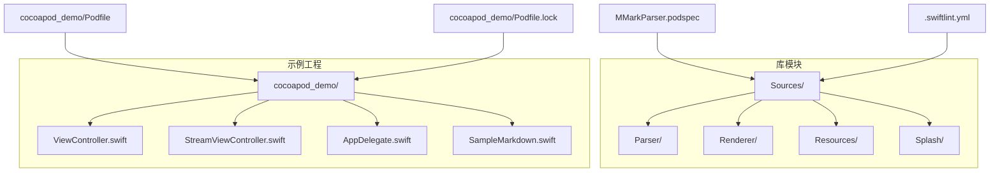
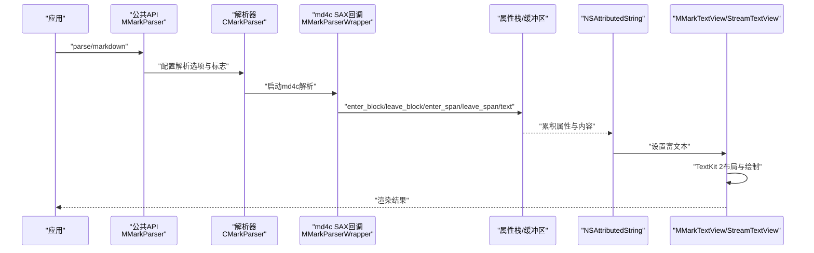
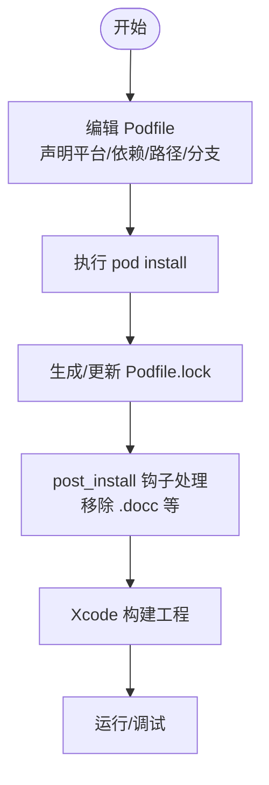
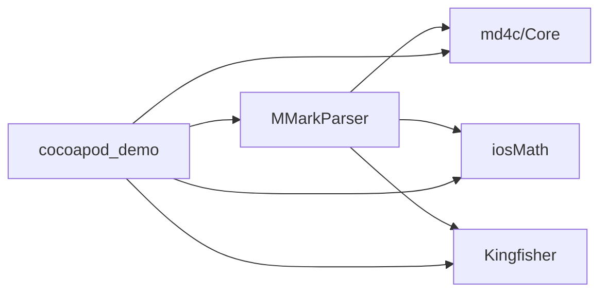

# 集成和部署

<cite>
**本文引用的文件**
- [MMarkParser.podspec](file://MMarkParser.podspec)
- [README.md](file://README.md)
- [.swiftlint.yml](file://.swiftlint.yml)
- [Podfile](file://cocoapod_demo/Podfile)
- [Podfile.lock](file://cocoapod_demo/Podfile.lock)
- [project.yml](file://cocoapod_demo/project.yml)
- [ViewController.swift](file://cocoapod_demo/cocoapod_demo/ViewController.swift)
- [StreamViewController.swift](file://cocoapod_demo/cocoapod_demo/StreamViewController.swift)
- [AppDelegate.swift](file://cocoapod_demo/cocoapod_demo/AppDelegate.swift)
- [SampleMarkdown.swift](file://cocoapod_demo/cocoapod_demo/SampleMarkdown.swift)
</cite>

## 目录
1. [简介](#简介)
2. [项目结构](#项目结构)
3. [核心组件](#核心组件)
4. [架构总览](#架构总览)
5. [详细组件分析](#详细组件分析)
6. [依赖关系分析](#依赖关系分析)
7. [性能考量](#性能考量)
8. [故障排查指南](#故障排查指南)
9. [结论](#结论)
10. [附录](#附录)

## 简介
本指南面向需要在iOS应用中集成和部署 MMarkParser 的开发者，覆盖 CocoaPods 集成流程、Podfile 配置与依赖管理、版本锁定、构建配置与 SwiftLint 代码质量检查、不同集成方式对比、发布与版本管理策略、常见问题排查、CI/CD 最佳实践，以及依赖版本兼容性与升级指南。文档同时提供从集成到部署的完整操作步骤，并通过图示帮助理解数据流与组件交互。

## 项目结构
仓库采用“库源码 + CocoaPods 示例工程”的组织方式：
- 库源码位于 MMarkParser/Sources，包含解析器、渲染器、附件视图、语法高亮、主题与字体等模块。
- 示例工程位于 cocoapod_demo，演示如何通过 CocoaPods 集成 MMarkParser，并展示静态与流式渲染两种使用方式。
- 根目录包含 CocoaPods 规范文件、SwiftLint 配置、示例工程的 Podfile 与 Podfile.lock、以及项目配置文件。

图表来源
- [MMarkParser.podspec](file://MMarkParser.podspec)
- [Podfile](file://cocoapod_demo/Podfile)
- [Podfile.lock](file://cocoapod_demo/Podfile.lock)
- [.swiftlint.yml](file://.swiftlint.yml)

章节来源
- [README.md](file://README.md)
- [MMarkParser.podspec](file://MMarkParser.podspec)
- [Podfile](file://cocoapod_demo/Podfile)
- [Podfile.lock](file://cocoapod_demo/Podfile.lock)
- [.swiftlint.yml](file://.swiftlint.yml)

## 核心组件
- 解析层：基于 md4c 的 SAX 回调模型，增量构建 NSAttributedString；支持 GFM 扩展（表格、任务列表、脚注等）。
- 渲染层：基于 TextKit 2 的 MMarkTextView/StreamTextView，支持块引用边框绘制、链接点击处理、流式渲染。
- 附件系统：代码块、图片、表格、数学公式、水平分割线、列表标记等以 NSTextAttachment 形式渲染。
- 语法高亮：内置 Splash 语法高亮引擎，支持 Swift 与其他语言的高亮。
- 主题与样式：通过 MMarkStyleConfiguration 定义字体、颜色、间距等全局样式。

章节来源
- [README.md](file://README.md)
- [MMarkParser.podspec](file://MMarkParser.podspec)

## 架构总览
MMarkParser 的核心流程是从 Markdown 字符串到 NSAttributedString，再由 TextKit 2 布局与渲染。解析阶段使用 md4c 的 SAX 回调，渲染阶段将复杂元素以附件形式插入富文本。

图表来源
- [README.md](file://README.md)
- [cocoapod_demo/cocoapod_demo/ViewController.swift](file://cocoapod_demo/cocoapod_demo/ViewController.swift)
- [cocoapod_demo/cocoapod_demo/StreamViewController.swift](file://cocoapod_demo/cocoapod_demo/StreamViewController.swift)

## 详细组件分析

### CocoaPods 集成与 Podfile 配置
- 平台与框架：iOS 15.0+，Swift 5.7，依赖 UIKit、QuartzCore。
- 依赖声明：md4c/Core、iosMath、Kingfisher。
- 示例工程 Podfile 展示了本地路径依赖 MMarkParser 与第三方分支依赖（iosMath、md4c），并通过 post_install 移除 Kingfisher 的 .docc 以避免警告。
- 版本锁定：Podfile.lock 记录了各依赖的具体提交与校验和，确保可复现构建。

图表来源
- [Podfile](file://cocoapod_demo/Podfile)
- [Podfile.lock](file://cocoapod_demo/Podfile.lock)

章节来源
- [MMarkParser.podspec](file://MMarkParser.podspec)
- [Podfile](file://cocoapod_demo/Podfile)
- [Podfile.lock](file://cocoapod_demo/Podfile.lock)

### 项目构建配置与 SwiftLint 设置
- 构建配置：示例工程使用 Swift 5.7，目标平台 iOS 15.0，产品包标识、版本号等在 project.yml 中统一管理。
- SwiftLint：排除 Splash 第三方目录；针对 md4c 回调处理器的 switch 结构放宽环路复杂度；对大型文件与类型体长度进行阈值调整；为 C API 常量与短变量名设置白名单。

章节来源
- [.swiftlint.yml](file://.swiftlint.yml)
- [project.yml](file://cocoapod_demo/project.yml)

### 不同集成方式对比与选择建议
- CocoaPods 本地路径集成：适合开发联调或私有化场景，Podfile 指向本地路径，便于快速迭代。
- CocoaPods 远程 Git Tag 集成：适合稳定版本复用，直接指定仓库与 tag，便于团队统一依赖。
- Swift Package Manager：仓库未提供 Package.swift，若需 SPM 集成，可在本地维护 Package 描述文件并适配依赖（本仓库未包含 SPM 文件，不作为默认推荐）。

章节来源
- [README.md](file://README.md)
- [MMarkParser.podspec](file://MMarkParser.podspec)
- [Podfile](file://cocoapod_demo/Podfile)

### 发布流程与版本管理策略
- 版本号：库规范中 version 字段定义当前版本；示例工程 project.yml 中包含 MARKETING_VERSION 与 CURRENT_PROJECT_VERSION。
- 发布步骤建议：
  1) 在 MMarkParser.podspec 中更新版本号与 tag。
  2) 推送 Git 标签。
  3) 执行 pod repo push 或 pod trunk 并推送。
  4) 更新示例工程中的依赖版本并回归测试。
- 版本锁定：通过 Podfile.lock 保证依赖一致性，CI 中应固定该锁文件以避免漂移。

章节来源
- [MMarkParser.podspec](file://MMarkParser.podspec)
- [project.yml](file://cocoapod_demo/project.yml)
- [Podfile.lock](file://cocoapod_demo/Podfile.lock)

### CI/CD 集成最佳实践
- 依赖安装：使用缓存的 Pods 目录与锁定文件，避免每次重新下载。
- 构建矩阵：按 iOS 版本与 Xcode 版本矩阵构建，确保兼容性。
- 代码质量：在 CI 中执行 SwiftLint，结合 Xcode build 报告。
- 测试：在模拟器/真机上运行单元与集成测试，覆盖 Markdown 渲染与流式渲染场景。
- 发布：在主分支触发发布流程，自动更新版本号、打标签并推送 CocoaPods。

（本节为通用实践建议，不直接分析具体文件）

### 依赖版本兼容性与升级指南
- 平台与工具链：iOS 15.0+、Swift 5.7+、Xcode 15+。
- 关键依赖：
  - md4c/Core：SAX 解析引擎，注意升级时关注回调语义变化。
  - iosMath：LaTeX 数学渲染，升级时关注字体与排版差异。
  - Kingfisher：远程图片加载，升级时关注网络层与缓存行为变更。
- 升级策略：
  - 优先在示例工程中验证升级影响。
  - 逐步替换 Podfile 中的版本/分支，观察渲染与性能变化。
  - 若涉及重大 API 变更，先在独立分支验证，再合并到主干。

章节来源
- [README.md](file://README.md)
- [MMarkParser.podspec](file://MMarkParser.podspec)
- [Podfile.lock](file://cocoapod_demo/Podfile.lock)

## 依赖关系分析
- MMarkParser 依赖 md4c/Core、iosMath、Kingfisher。
- 示例工程依赖 MMarkParser 与上述三方库，并通过 post_install 钩子优化体验。
- 依赖树与校验和由 Podfile.lock 记录，确保可复现构建。

图表来源
- [MMarkParser.podspec](file://MMarkParser.podspec)
- [Podfile.lock](file://cocoapod_demo/Podfile.lock)

章节来源
- [MMarkParser.podspec](file://MMarkParser.podspec)
- [Podfile.lock](file://cocoapod_demo/Podfile.lock)

## 性能考量
- 流式渲染：MMarkStreamTextView 支持分块与速率控制，适合长文档与实时渲染场景。
- 附件懒加载：复杂元素以 NSTextAttachment 形式渲染，减少一次性内存压力。
- 语法高亮：Splash 引擎按需高亮，注意在大量代码块场景下的 CPU 占用。
- 图片加载：依赖 Kingfisher 的异步与缓存机制，建议合理设置缓存策略与尺寸。

章节来源
- [README.md](file://README.md)
- [cocoapod_demo/cocoapod_demo/StreamViewController.swift](file://cocoapod_demo/cocoapod_demo/StreamViewController.swift)

## 故障排查指南
- 构建失败（平台/工具链不匹配）：确认 iOS 与 Swift 版本满足要求，Xcode 版本与项目配置一致。
- 依赖冲突：检查 Podfile.lock 中的外部来源与提交，必要时回滚到已知稳定版本。
- 富文本渲染异常：检查 MMarkStyleConfiguration 的自定义样式是否与 TextKit 2 兼容。
- 图片不显示：确认网络权限与 Kingfisher 缓存配置；检查远程 URL 可达性。
- SwiftLint 报错：根据 .swiftlint.yml 的排除规则与阈值调整代码风格或规则配置。
- 流式渲染卡顿：降低 typingSpeed 或增大 chunkSize，或在主线程外预处理部分数据。

章节来源
- [.swiftlint.yml](file://.swiftlint.yml)
- [Podfile.lock](file://cocoapod_demo/Podfile.lock)
- [cocoapod_demo/cocoapod_demo/StreamViewController.swift](file://cocoapod_demo/cocoapod_demo/StreamViewController.swift)

## 结论
通过 CocoaPods 集成 MMarkParser 的流程清晰、依赖明确，配合 SwiftLint 与示例工程可快速落地。建议在开发与发布全周期中坚持版本锁定、持续集成与兼容性验证，以获得稳定可靠的 Markdown 渲染能力。

## 附录

### 快速开始（CocoaPods）
- 在示例工程的 Podfile 中添加 MMarkParser 依赖与必要的第三方依赖。
- 执行 pod install，打开工作区。
- 在 ViewController 中使用 MMarkParser 的公共 API 渲染 Markdown。
- 在 StreamViewController 中体验流式渲染与进度反馈。

章节来源
- [Podfile](file://cocoapod_demo/Podfile)
- [ViewController.swift](file://cocoapod_demo/cocoapod_demo/ViewController.swift)
- [StreamViewController.swift](file://cocoapod_demo/cocoapod_demo/StreamViewController.swift)
- [SampleMarkdown.swift](file://cocoapod_demo/cocoapod_demo/SampleMarkdown.swift)