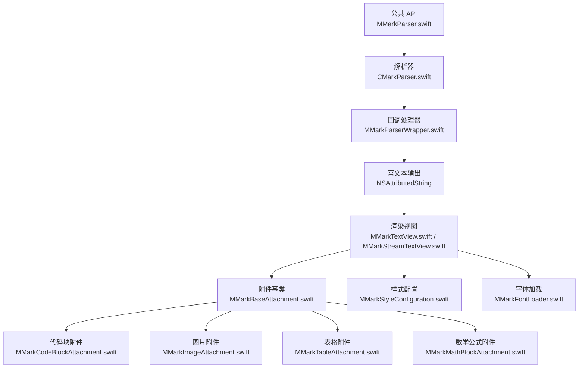
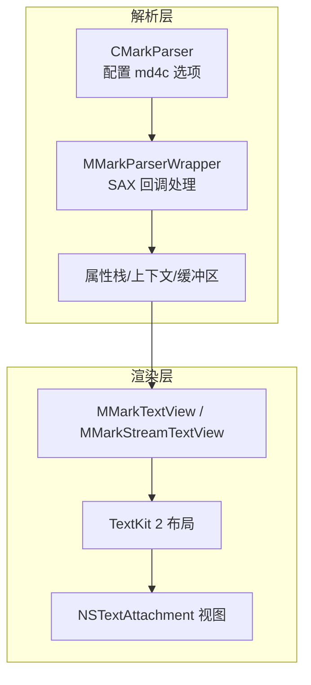
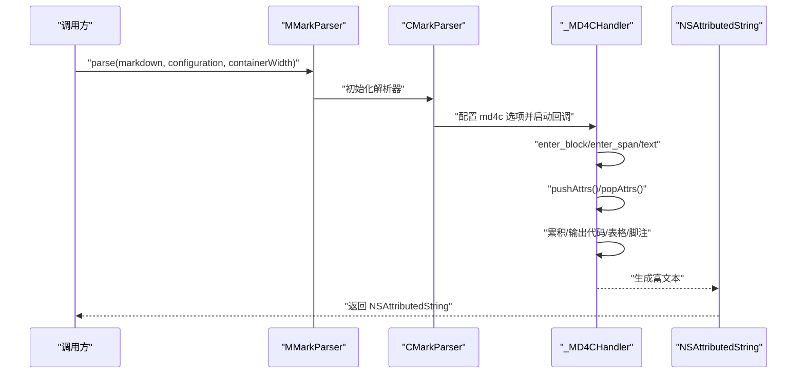
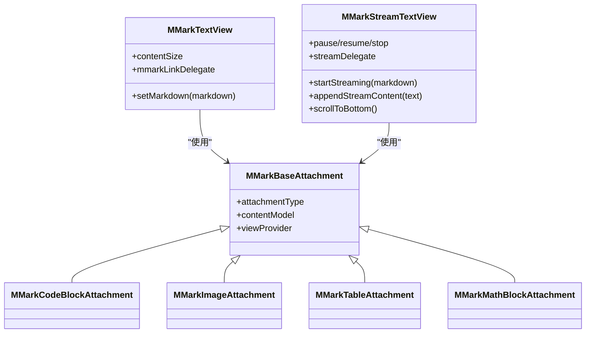
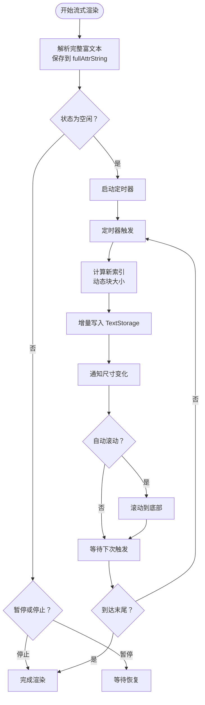
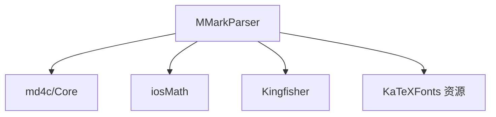

# 项目概述

<cite>
**本文档引用的文件**
- [README.md](file://README.md)
- [MMarkParser.podspec](file://MMarkParser.podspec)
- [MMarkParser.swift](file://MMarkParser/Sources/MMarkParser.swift)
- [CMarkParser.swift](file://MMarkParser/Sources/Parser/CMarkParser.swift)
- [MMarkParserWrapper.swift](file://MMarkParser/Sources/Parser/MMarkParserWrapper.swift)
- [MMarkTextView.swift](file://MMarkParser/Sources/Renderer/MMarkTextView.swift)
- [MMarkStreamTextView.swift](file://MMarkParser/Sources/Renderer/MMarkStreamTextView.swift)
- [MMarkStyleConfiguration.swift](file://MMarkParser/Sources/Renderer/MMarkStyleConfiguration.swift)
- [MMarkBaseAttachment.swift](file://MMarkParser/Sources/Renderer/Attachments/MMarkBaseAttachment/MMarkBaseAttachment.swift)
- [MMarkCodeBlockAttachment.swift](file://MMarkParser/Sources/Renderer/Attachments/MMarkCodeBlockAttachment/MMarkCodeBlockAttachment.swift)
- [MMarkImageAttachment.swift](file://MMarkParser/Sources/Renderer/Attachments/MMarkImageAttachment/MMarkImageAttachment.swift)
- [MMarkTableAttachment.swift](file://MMarkParser/Sources/Renderer/Attachments/MMarkTableAttachment/MMarkTableAttachment.swift)
- [MMarkMathBlockAttachment.swift](file://MMarkParser/Sources/Renderer/Attachments/MMarkMathBlockAttachment/MMarkMathBlockAttachment.swift)
- [MMarkFontLoader.swift](file://MMarkParser/Sources/Renderer/MMarkFontLoader.swift)
- [ViewController.swift](file://cocoapod_demo/cocoapod_demo/ViewController.swift)
</cite>

## 目录
1. [简介](#简介)
2. [项目结构](#项目结构)
3. [核心组件](#核心组件)
4. [架构总览](#架构总览)
5. [详细组件分析](#详细组件分析)
6. [依赖关系分析](#依赖关系分析)
7. [性能考量](#性能考量)
8. [故障排查指南](#故障排查指南)
9. [结论](#结论)
10. [附录](#附录)

## 简介
MMarkParser 是一款面向 iOS 的 Markdown 解析与渲染库，基于 TextKit 2 构建，提供完整的 GitHub Flavored Markdown（GFM）支持。其核心价值在于：
- 现代化架构：依托 TextKit 2 的富文本布局引擎，实现高性能、可扩展的渲染体验。
- 完整语法覆盖：标准 Markdown 语法与 GFM 扩展（表格、任务列表、自动链接、删除线）一应俱全；支持 LaTeX 数学公式（行内与块级）、语法高亮、脚注、嵌套引用块等。
- 可定制样式：通过统一的样式配置对象，对标题、段落、代码、链接、引用块、列表、表格、数学公式、脚注等元素进行细粒度定制。
- 流式渲染：提供流式渲染视图，支持“打字机式”增量显示，适用于日志、聊天、实时预览等场景。

目标用户群体：
- iOS 应用开发者：需要在应用内渲染 Markdown 的团队与个人。
- 技术博客与知识库应用：需要高质量富文本展示与交互的场景。
- 教育与科研类应用：需要 LaTeX 数学公式渲染与代码高亮的专业排版。

## 项目结构
项目采用按职责分层与按功能模块划分相结合的组织方式：
- 公共 API 层：对外暴露解析入口与便捷扩展。
- 解析层：封装 md4c 的 SAX 回调模型，构建属性化富文本。
- 渲染层：基于 TextKit 2 的视图与附件，负责布局、绘制与交互。
- 附件与模型：针对复杂元素（代码块、图片、表格、数学公式、水平分割线、列表标记）的模型与视图提供者。
- 资源与字体：KaTeX 字体资源与注册工具，确保数学公式渲染可用。
- 示例工程：CocoaPods 集成示例，演示基本用法与流式渲染。

**图表来源**
- [MMarkParser.swift:1-42](file://MMarkParser/Sources/MMarkParser.swift#L1-L42)
- [CMarkParser.swift:1-81](file://MMarkParser/Sources/Parser/CMarkParser.swift#L1-L81)
- [MMarkParserWrapper.swift:1-800](file://MMarkParser/Sources/Parser/MMarkParserWrapper.swift#L1-L800)
- [MMarkTextView.swift:1-81](file://MMarkParser/Sources/Renderer/MMarkTextView.swift#L1-L81)
- [MMarkStreamTextView.swift:1-398](file://MMarkParser/Sources/Renderer/MMarkStreamTextView.swift#L1-L398)
- [MMarkBaseAttachment.swift:1-60](file://MMarkParser/Sources/Renderer/Attachments/MMarkBaseAttachment/MMarkBaseAttachment.swift#L1-L60)
- [MMarkCodeBlockAttachment.swift:1-22](file://MMarkParser/Sources/Renderer/Attachments/MMarkCodeBlockAttachment/MMarkCodeBlockAttachment.swift#L1-L22)
- [MMarkImageAttachment.swift:1-23](file://MMarkParser/Sources/Renderer/Attachments/MMarkImageAttachment/MMarkImageAttachment.swift#L1-L23)
- [MMarkTableAttachment.swift:1-23](file://MMarkParser/Sources/Renderer/Attachments/MMarkTableAttachment/MMarkTableAttachment.swift#L1-L23)
- [MMarkMathBlockAttachment.swift:1-23](file://MMarkParser/Sources/Renderer/Attachments/MMarkMathBlockAttachment/MMarkMathBlockAttachment.swift#L1-L23)
- [MMarkStyleConfiguration.swift:1-339](file://MMarkParser/Sources/Renderer/MMarkStyleConfiguration.swift#L1-L339)
- [MMarkFontLoader.swift:1-113](file://MMarkParser/Sources/Renderer/MMarkFontLoader.swift#L1-L113)

**章节来源**
- [README.md:108-212](file://README.md#L108-L212)

## 核心组件
- 公共 API：提供静态解析入口与字符串扩展方法，统一对外接口。
- 解析器：封装 md4c 的 SAX 回调，按块/内联事件增量构建富文本，支持 GFM 选项。
- 回调处理器：维护属性栈、上下文状态、缓冲区（代码块、表格、脚注），处理复杂元素与嵌套结构。
- 文本视图：基于 UITextView，集成块引用竖条绘制、链接点击处理、附件视图提供者注册。
- 流式文本视图：定时器驱动的增量渲染，支持暂停/恢复/停止/重置，适配长文档与实时输入。
- 样式配置：集中定义各元素字体、颜色、间距、圆角、背景等，支持默认 GFM 风格。
- 附件体系：以 NSTextAttachment 为核心，结合 ViewProvider 实现懒加载与精确布局。
- 字体加载：从资源包注册 KaTeX 字体，保障数学公式渲染质量。

**章节来源**
- [MMarkParser.swift:4-42](file://MMarkParser/Sources/MMarkParser.swift#L4-L42)
- [CMarkParser.swift:4-81](file://MMarkParser/Sources/Parser/CMarkParser.swift#L4-L81)
- [MMarkParserWrapper.swift:16-800](file://MMarkParser/Sources/Parser/MMarkParserWrapper.swift#L16-L800)
- [MMarkTextView.swift:3-81](file://MMarkParser/Sources/Renderer/MMarkTextView.swift#L3-L81)
- [MMarkStreamTextView.swift:18-398](file://MMarkParser/Sources/Renderer/MMarkStreamTextView.swift#L18-L398)
- [MMarkStyleConfiguration.swift:10-339](file://MMarkParser/Sources/Renderer/MMarkStyleConfiguration.swift#L10-L339)
- [MMarkBaseAttachment.swift:3-60](file://MMarkParser/Sources/Renderer/Attachments/MMarkBaseAttachment/MMarkBaseAttachment.swift#L3-L60)
- [MMarkFontLoader.swift:5-113](file://MMarkParser/Sources/Renderer/MMarkFontLoader.swift#L5-L113)

## 架构总览
MMarkParser 采用“解析 + 渲染”的双层架构：
- 解析层：基于 md4c 的 SAX 回调模型，边遍历边构建富文本，减少内存占用与转换成本。
- 渲染层：TextKit 2 提供布局与绘制能力，复杂元素通过附件与自定义视图提供者实现。

**图表来源**
- [CMarkParser.swift:51-66](file://MMarkParser/Sources/Parser/CMarkParser.swift#L51-L66)
- [MMarkParserWrapper.swift:16-120](file://MMarkParser/Sources/Parser/MMarkParserWrapper.swift#L16-L120)
- [MMarkTextView.swift:30-61](file://MMarkParser/Sources/Renderer/MMarkTextView.swift#L30-L61)
- [MMarkStreamTextView.swift:174-201](file://MMarkParser/Sources/Renderer/MMarkStreamTextView.swift#L174-L201)

## 详细组件分析

### 组件 A：解析流程（SAX 回调与属性栈）
该组件负责将 Markdown 文本转换为 NSAttributedString，核心机制包括：
- 块级回调（enter_block/leave_block）：管理段落、标题、列表、表格、代码块、水平分割线、脚注等。
- 内联回调（enter_span/leave_span/text）：处理粗体、斜体、删除线、链接、图片、行内代码、脚注引用、数学公式等。
- 属性栈：在嵌套结构中正确传递与恢复样式属性，保证块引用内的加粗/链接等继承正确。
- 上下文状态：记录列表深度、缩进、块引用层级、数学模式、图片参数、脚注缓冲等。
- 缓冲区：代码块语言与内容、表格单元与对齐、脚注标签与正文。

**图表来源**
- [MMarkParser.swift:18-26](file://MMarkParser/Sources/MMarkParser.swift#L18-L26)
- [CMarkParser.swift:55-66](file://MMarkParser/Sources/Parser/CMarkParser.swift#L55-L66)
- [MMarkParserWrapper.swift:134-644](file://MMarkParser/Sources/Parser/MMarkParserWrapper.swift#L134-L644)

**章节来源**
- [CMarkParser.swift:14-47](file://MMarkParser/Sources/Parser/CMarkParser.swift#L14-L47)
- [MMarkParserWrapper.swift:18-99](file://MMarkParser/Sources/Parser/MMarkParserWrapper.swift#L18-L99)
- [MMarkParserWrapper.swift:134-644](file://MMarkParser/Sources/Parser/MMarkParserWrapper.swift#L134-L644)

### 组件 B：渲染视图与附件体系
- 文本视图：设置 Markdown 内容、监听内容尺寸变化、绘制块引用竖条、处理链接点击。
- 流式视图：定时器驱动增量渲染，支持自动滚动至底部、大小变化通知、暂停/恢复/停止。
- 附件基类：统一管理附件类型、内容模型与视图提供者选择。
- 复杂元素：代码块、图片、表格、数学公式、水平分割线、列表标记均以附件形式呈现，确保与文本流一致的布局与交互。

**图表来源**
- [MMarkTextView.swift:6-61](file://MMarkParser/Sources/Renderer/MMarkTextView.swift#L6-L61)
- [MMarkStreamTextView.swift:21-74](file://MMarkParser/Sources/Renderer/MMarkStreamTextView.swift#L21-L74)
- [MMarkBaseAttachment.swift:12-58](file://MMarkParser/Sources/Renderer/Attachments/MMarkBaseAttachment/MMarkBaseAttachment.swift#L12-L58)
- [MMarkCodeBlockAttachment.swift:6-21](file://MMarkParser/Sources/Renderer/Attachments/MMarkCodeBlockAttachment/MMarkCodeBlockAttachment.swift#L6-L21)
- [MMarkImageAttachment.swift:5-22](file://MMarkParser/Sources/Renderer/Attachments/MMarkImageAttachment/MMarkImageAttachment.swift#L5-L22)
- [MMarkTableAttachment.swift:5-22](file://MMarkParser/Sources/Renderer/Attachments/MMarkTableAttachment/MMarkTableAttachment.swift#L5-L22)
- [MMarkMathBlockAttachment.swift:5-22](file://MMarkParser/Sources/Renderer/Attachments/MMarkMathBlockAttachment/MMarkMathBlockAttachment.swift#L5-L22)

**章节来源**
- [MMarkTextView.swift:39-81](file://MMarkParser/Sources/Renderer/MMarkTextView.swift#L39-L81)
- [MMarkStreamTextView.swift:174-300](file://MMarkParser/Sources/Renderer/MMarkStreamTextView.swift#L174-L300)
- [MMarkBaseAttachment.swift:3-58](file://MMarkParser/Sources/Renderer/Attachments/MMarkBaseAttachment/MMarkBaseAttachment.swift#L3-L58)

### 组件 C：流式渲染算法
流式渲染通过定时器周期性地向 TextStorage 追加一段富文本，避免一次性全量渲染带来的卡顿与布局抖动。关键逻辑包括：
- 计算增量长度：根据速度与块大小动态调整，长文档自动增大块大小保持流畅。
- TextKit 2 路径：优先使用 NSTextLayoutManager/ContentStorage 的编辑事务，回退至传统 TextStorage。
- 自动滚动：当用户位于底部附近时，新内容到达后自动滚动至底部。
- 状态管理：空闲/流式/暂停/停止四种状态，支持重置与完成回调。

**图表来源**
- [MMarkStreamTextView.swift:304-351](file://MMarkParser/Sources/Renderer/MMarkStreamTextView.swift#L304-L351)
- [MMarkStreamTextView.swift:174-287](file://MMarkParser/Sources/Renderer/MMarkStreamTextView.swift#L174-L287)

**章节来源**
- [MMarkStreamTextView.swift:34-74](file://MMarkParser/Sources/Renderer/MMarkStreamTextView.swift#L34-L74)
- [MMarkStreamTextView.swift:112-171](file://MMarkParser/Sources/Renderer/MMarkStreamTextView.swift#L112-L171)
- [MMarkStreamTextView.swift:304-351](file://MMarkParser/Sources/Renderer/MMarkStreamTextView.swift#L304-L351)

### 组件 D：样式系统与主题
样式系统通过统一的配置对象定义所有元素的外观，包括：
- 标题：字体、颜色、上下间距按级别配置。
- 段落：字体与颜色。
- 代码与代码块：字体、前景/背景色、头部/主体背景、圆角、内边距、头部高度。
- 链接：颜色与下划线样式。
- 删除线：颜色。
- 引用块：颜色、背景、边框宽度/颜色。
- 图片：占位符颜色。
- 表格：表头背景、边框颜色/宽度、圆角。
- 任务列表：勾选/未勾选颜色与字体，支持字符或图片标记。
- 数学公式：行内与块级字体、颜色、背景、圆角，以及 iosMath 显示字体。
- 脚注：引用样式、定义文本样式、回链颜色。

默认样式遵循 GFM 设计语言，同时提供充分的可定制空间。

**章节来源**
- [MMarkStyleConfiguration.swift:10-339](file://MMarkParser/Sources/Renderer/MMarkStyleConfiguration.swift#L10-L339)

## 依赖关系分析
- 平台与语言：iOS 15+、Swift 5.7+、Xcode 15+。
- 外部依赖：
  - md4c：SAX 风格的 Markdown 解析引擎。
  - iosMath：LaTeX 数学公式渲染。
  - Kingfisher：远程图片加载与缓存。
- 资源：KaTeX 字体资源，随库分发并在运行时注册。

**图表来源**
- [MMarkParser.podspec:9-17](file://MMarkParser.podspec#L9-L17)
- [README.md:36-39](file://README.md#L36-L39)

**章节来源**
- [MMarkParser.podspec:1-19](file://MMarkParser.podspec#L1-L19)
- [README.md:22-26](file://README.md#L22-L26)

## 性能考量
- SAX 流式解析：边解析边构建富文本，降低峰值内存与转换延迟。
- TextKit 2：现代布局引擎，支持更高效的文本测量与渲染。
- 附件懒加载：通过 ViewProvider 延迟创建复杂视图，减少初始开销。
- 流式渲染：分片增量写入，避免全量重排；长文档动态增大块大小保持流畅。
- 字体注册：资源字体仅注册一次并加锁保护，避免重复注册开销。

[本节为通用性能建议，无需特定文件来源]

## 故障排查指南
- 解析失败：检查输入是否为空；确认 md4c 选项与容器宽度传入正确；捕获解析异常并降级为原始文本。
- 数学公式显示异常：确保 KaTeX 字体已注册；检查默认样式中的数学字体回退逻辑。
- 图片无法加载：确认网络权限与远程地址可达；检查占位符颜色与容器宽度。
- 链接点击无效：确认视图委托已设置；检查链接样式与点击回调处理。
- 引用块竖条不显示：确认 TextKit 2 布局完成后再更新；检查内容尺寸变化监听与异步刷新。

**章节来源**
- [CMarkParser.swift:8-12](file://MMarkParser/Sources/Parser/CMarkParser.swift#L8-L12)
- [MMarkTextView.swift:68-71](file://MMarkParser/Sources/Renderer/MMarkTextView.swift#L68-L71)
- [MMarkStreamTextView.swift:357-359](file://MMarkParser/Sources/Renderer/MMarkStreamTextView.swift#L357-L359)
- [MMarkFontLoader.swift:24-51](file://MMarkParser/Sources/Renderer/MMarkFontLoader.swift#L24-L51)

## 结论
MMarkParser 以 TextKit 2 为基础，结合 md4c 的 SAX 解析与富文本附件体系，实现了高性能、可扩展、完全可定制的 Markdown 渲染方案。其对 GFM 的完整支持与丰富的样式配置，使其既能满足入门用户的快速集成需求，也能满足专业应用对排版与交互的严苛要求。配合流式渲染能力，可在长文档与实时输入场景中提供顺滑体验。

[本节为总结性内容，无需特定文件来源]

## 附录
- 快速开始：导入库后直接调用解析入口或字符串扩展方法；将结果设置到渲染视图中。
- 自定义样式：复制默认样式配置，按需修改字体、颜色、间距与圆角等参数。
- 示例工程：参考 demo 工程中的视图控制器与流式视图用法。

**章节来源**
- [README.md:41-85](file://README.md#L41-L85)
- [ViewController.swift:38-44](file://cocoapod_demo/cocoapod_demo/ViewController.swift#L38-L44)