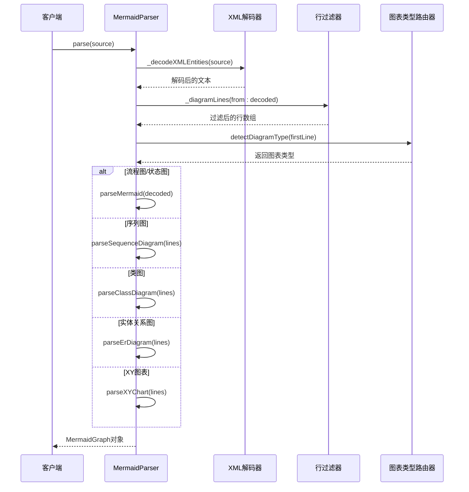
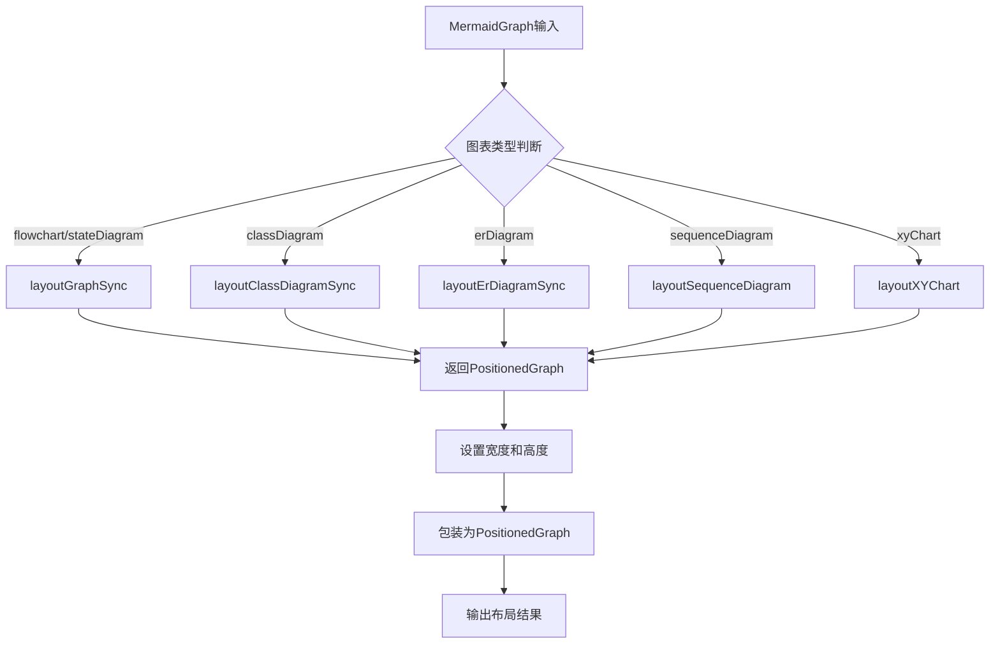
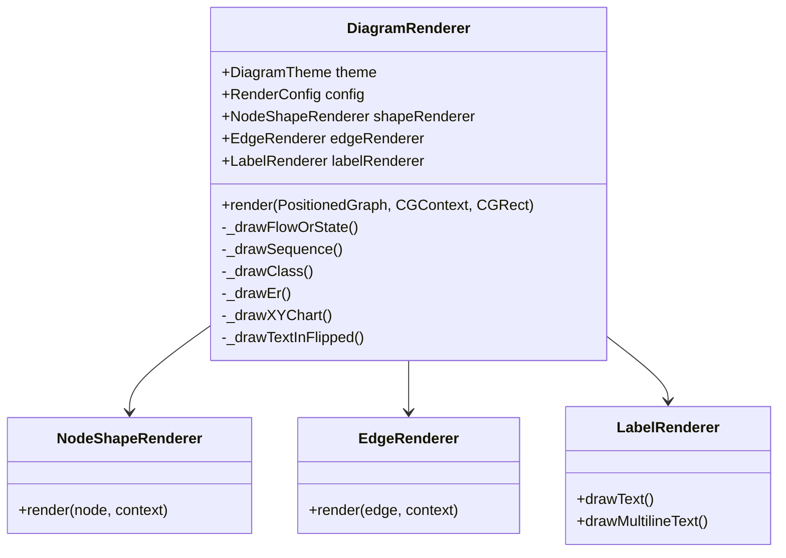
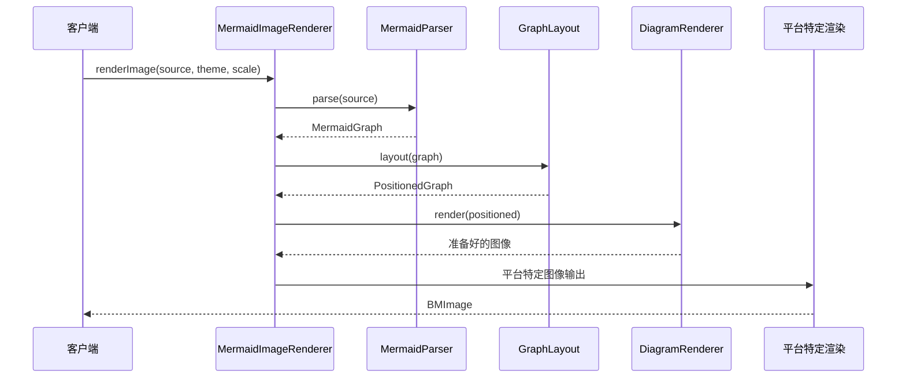
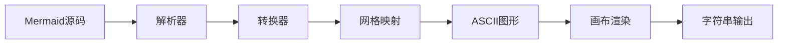
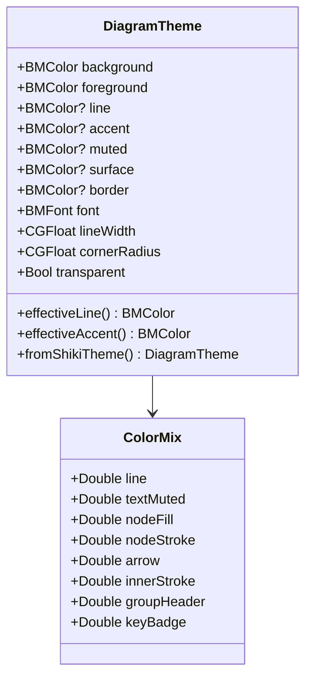
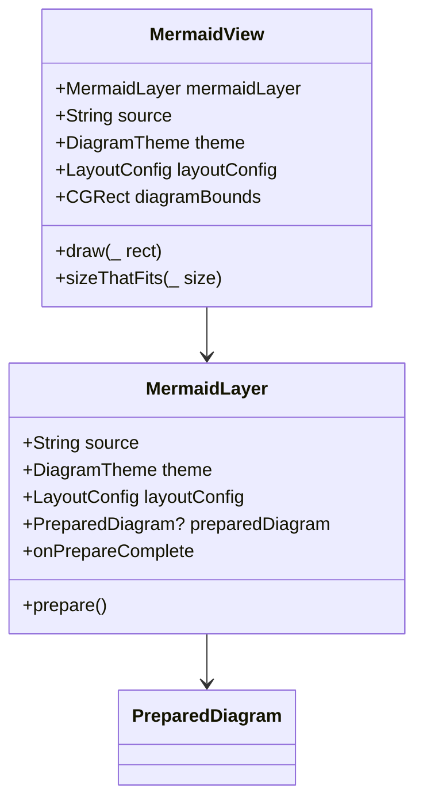
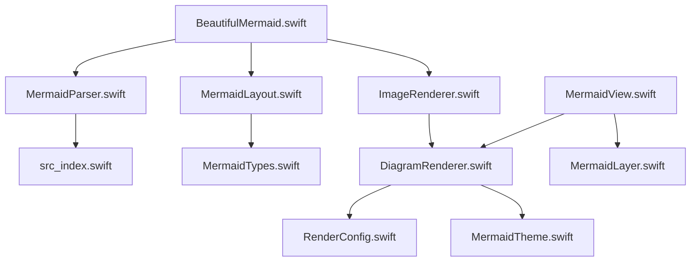

# BeautifulMermaidSwift引擎

<cite>
**本文档引用的文件**
- [BeautifulMermaid.swift](file://BeautifulMermaid.swift)
- [MermaidParser.swift](file://MermaidParser.swift)
- [MermaidLayout.swift](file://MermaidLayout.swift)
- [ImageRenderer.swift](file://ImageRenderer.swift)
- [DiagramRenderer.swift](file://DiagramRenderer.swift)
- [MermaidTypes.swift](file://MermaidTypes.swift)
- [MermaidTheme.swift](file://MermaidTheme.swift)
- [MermaidView.swift](file://MermaidView.swift)
- [src_index.swift](file://src_index.swift)
- [RenderConfig.swift](file://RenderConfig.swift)
- [src_ascii_index.swift](file://src_ascii_index.swift)
- [README.md](file://README.md)
</cite>

## 目录
1. [简介](#简介)
2. [项目结构](#项目结构)
3. [核心组件](#核心组件)
4. [架构概览](#架构概览)
5. [详细组件分析](#详细组件分析)
6. [依赖关系分析](#依赖关系分析)
7. [性能考虑](#性能考虑)
8. [故障排除指南](#故障排除指南)
9. [结论](#结论)

## 简介

BeautifulMermaidSwift是一个高性能的Mermaid图表渲染引擎，专为iOS平台设计。该引擎提供了完整的Mermaid图表支持，包括流程图、序列图、类图、实体关系图和XY图表等六种图表类型。通过与ElkSwift布局引擎的深度集成，BeautifulMermaidSwift能够提供高质量的图表布局和渲染效果。

该引擎的核心优势在于其跨平台兼容性（支持iOS、macOS和macOS Catalyst），丰富的主题系统，以及多种输出格式支持（图像、SVG、ASCII）。同时，它还提供了完整的异步渲染支持和内存优化机制。

## 项目结构

BeautifulMermaidSwift引擎采用模块化设计，主要包含以下核心目录结构：

```mermaid
graph TB
subgraph "BeautifulMermaidSwift核心模块"
A[Mermaid/] -- 图表解析和布局
B[Render/] -- 渲染器和视图
C[Views/] -- UI视图组件
end
subgraph "Mermaid子模块"
A1[src_index.swift] -- 主入口点
A2[src_parser.swift] -- 解析器
A3[src_layout.swift] -- 布局算法
A4[src_renderer.swift] -- 图形渲染
end
subgraph "Render子模块"
B1[DiagramRenderer.swift] -- 主渲染器
B2[RenderConfig.swift] -- 渲染配置
B3[ShapeRenderer.swift] -- 形状渲染器
B4[EdgeRenderer.swift] -- 边渲染器
end
subgraph "Views子模块"
C1[MermaidView.swift] -- 主视图
C2[MermaidLayer.swift] -- 视图层
C3[MermaidDiagram.swift] -- 图表模型
end
A --> A1
B --> B1
C --> C1
```

**图表来源**
- [BeautifulMermaid.swift](file://BeautifulMermaid.swift)
- [MermaidParser.swift](file://MermaidParser.swift)
- [ImageRenderer.swift](file://ImageRenderer.swift)

**章节来源**
- [BeautifulMermaid.swift:1-185](file://BeautifulMermaid.swift#L1-L185)
- [README.md:242-273](file://README.md#L242-L273)

## 核心组件

### 主要API接口

BeautifulMermaidSwift提供了简洁而强大的公共API接口，主要包含以下核心功能：

#### 图像渲染接口
- `renderImage(source: String, theme: DiagramTheme, scale: CGFloat)` - 将Mermaid图表渲染为原生图像
- `renderImage(source: String, size: CGSize, theme: DiagramTheme)` - 指定尺寸渲染图像
- `render(source: String, in context: CGContext, bounds: CGRect, theme: DiagramTheme)` - 直接渲染到CGContext

#### 文本输出接口
- `renderSVG(source: String, theme: DiagramTheme)` - 渲染为SVG字符串
- `renderASCII(source: String, theme: DiagramTheme)` - 渲染为ASCII/Unicode字符串

#### 异步处理接口
- 所有主要渲染操作都提供async变体，支持非阻塞执行

#### 解析和布局接口
- `parse(_ source: String)` - 解析Mermaid源码为内部图模型
- `layout(_ source: String, config: LayoutConfig)` - 解析并布局图表

**章节来源**
- [BeautifulMermaid.swift:14-78](file://BeautifulMermaid.swift#L14-L78)
- [BeautifulMermaid.swift:80-159](file://BeautifulMermaid.swift#L80-L159)

### 类型系统

引擎采用了强类型的架构设计，主要数据结构包括：

#### 图表类型枚举
```swift
public enum DiagramType: String, CaseIterable, Sendable {
    case flowchart
    case stateDiagram
    case sequenceDiagram
    case classDiagram
    case erDiagram
    case xyChart
}
```

#### 图表模型
- `MermaidGraph` - 包含图表类型和解析后的payload
- `PositionedGraph` - 包含布局信息的图表模型
- 各种特定图表类型的节点和边模型

#### 主题系统
- `DiagramTheme` - 完整的主题配置系统
- 支持18种预定义主题（Zinc、Tokyo Night、Nord等）
- 支持从VS Code/Shiki主题导入

**章节来源**
- [MermaidTypes.swift:4-11](file://MermaidTypes.swift#L4-L11)
- [MermaidTypes.swift:26-60](file://MermaidTypes.swift#L26-L60)
- [MermaidTheme.swift:11-168](file://MermaidTheme.swift#L11-L168)

## 架构概览

BeautifulMermaidSwift采用分层架构设计，从上到下分为API层、解析层、布局层和渲染层：

```mermaid
graph TB
subgraph "API层"
A[MermaidRenderer] -- 公共接口
B[String扩展] -- 便捷方法
end
subgraph "解析层"
C[MermaidParser] -- Mermaid语法解析
D[ElkSwift桥接] -- 布局引擎集成
end
subgraph "布局层"
E[GraphLayout] -- 图表布局计算
F[各图表专用布局器]
end
subgraph "渲染层"
G[DiagramRenderer] -- 主渲染器
H[ImageRenderer] -- 图像渲染器
I[ASCII渲染器] -- ASCII输出
end
subgraph "视图层"
J[MermaidView] -- UIView实现
K[MermaidLayer] -- CALayer实现
end
A --> C
C --> E
E --> G
G --> H
G --> J
H --> I
```

**图表来源**
- [BeautifulMermaid.swift:14-78](file://BeautifulMermaid.swift#L14-L78)
- [MermaidParser.swift:9-53](file://MermaidParser.swift#L9-L53)
- [MermaidLayout.swift:3-74](file://MermaidLayout.swift#L3-L74)
- [DiagramRenderer.swift:12-50](file://DiagramRenderer.swift#L12-L50)

## 详细组件分析

### 解析器组件

#### MermaidParser解析流程



**图表来源**
- [MermaidParser.swift:25-52](file://MermaidParser.swift#L25-L52)
- [src_index.swift:93-115](file://src_index.swift#L93-L115)

#### 解析器特性
- 支持XML实体解码
- 自动过滤注释行（以"%%"开头）
- 智能图表类型检测
- 错误处理和异常传播

**章节来源**
- [MermaidParser.swift:9-53](file://MermaidParser.swift#L9-L53)
- [src_index.swift:83-115](file://src_index.swift#L83-L115)

### 布局引擎

#### GraphLayout布局流程



**图表来源**
- [MermaidLayout.swift:10-73](file://MermaidLayout.swift#L10-L73)

#### 布局配置
- 可配置的间距参数：padding、nodeSpacing、layerSpacing、componentSpacing
- 针对不同图表类型的专用布局算法
- 与ElkSwift布局引擎的无缝集成

**章节来源**
- [MermaidLayout.swift:3-74](file://MermaidLayout.swift#L3-L74)
- [MermaidTypes.swift:243-264](file://MermaidTypes.swift#L243-L264)

### 渲染器组件

#### DiagramRenderer主渲染器

DiagramRenderer是引擎的核心渲染组件，负责将布局后的图表转换为可视化的图形输出：



**图表来源**
- [DiagramRenderer.swift:12-26](file://DiagramRenderer.swift#L12-L26)

#### 渲染配置系统

RenderConfig提供了全面的渲染参数控制：

| 参数类别 | 关键参数 | 默认值 | 用途 |
|---------|---------|--------|------|
| 节点内边距 | nodePaddingHorizontal, nodePaddingVertical | 20, 10 | 控制节点内容与边框距离 |
| 字体大小 | fontSizeNodeLabel, fontSizeEdgeLabel | 13, 11 | 节点标签和边标签字体大小 |
| 线宽 | strokeWidthOuterBox, strokeWidthInnerBox | 1.0, 0.75 | 外层和内层边框线宽 |
| 箭头尺寸 | arrowHeadWidth, arrowHeadHeight | 8.0, 5.0 | 箭头头部几何尺寸 |
| 间距参数 | graphPadding, nodeSpacing, layerSpacing | 40, 28, 48 | 整体和元素间间距 |

**章节来源**
- [DiagramRenderer.swift:12-127](file://DiagramRenderer.swift#L12-L127)
- [RenderConfig.swift:4-152](file://RenderConfig.swift#L4-L152)

### 图像渲染器

#### MermaidImageRenderer图像渲染流程



**图表来源**
- [ImageRenderer.swift:35-48](file://ImageRenderer.swift#L35-L48)

#### 平台适配
- **iOS/macOS Catalyst**: 使用UIGraphicsImageRenderer进行图像渲染
- **macOS**: 使用CGContext直接创建CGImage
- **自动透明度处理**: 支持透明背景渲染

**章节来源**
- [ImageRenderer.swift:11-250](file://ImageRenderer.swift#L11-L250)

### ASCII渲染器

#### ASCII渲染流程

ASCII渲染器提供了将Mermaid图表转换为ASCII/Unicode字符的艺术化输出：



**图表来源**
- [src_ascii_index.swift:5-79](file://src_ascii_index.swift#L5-L79)

#### ASCII渲染特性
- 支持多种字符集（ASCII和Unicode）
- 智能网格映射和路径规划
- 可配置的颜色主题映射
- 复杂图表的简化表示

**章节来源**
- [src_ascii_index.swift:1-200](file://src_ascii_index.swift#L1-L200)

### 主题系统

#### DiagramTheme主题架构



**图表来源**
- [MermaidTheme.swift:11-168](file://MermaidTheme.swift#L11-L168)

#### 预定义主题
引擎内置了18种高质量主题，包括现代科技主题（Tokyo Night、Nord）、经典配色方案（Dracula、Gruvbox）和流行的设计系统（GitHub、Solarized）。

**章节来源**
- [MermaidTheme.swift:171-370](file://MermaidTheme.swift#L171-L370)

### 视图组件

#### MermaidView视图架构



**图表来源**
- [MermaidView.swift:9-103](file://MermaidView.swift#L9-L103)

#### 视图特性
- 自适应内容尺寸
- 内置缩放和居中功能
- 支持透明背景渲染
- 平滑的重绘机制

**章节来源**
- [MermaidView.swift:1-196](file://MermaidView.swift#L1-L196)

## 依赖关系分析

### 外部依赖

BeautifulMermaidSwift的依赖关系相对简洁，主要依赖于ElkSwift布局引擎：

```mermaid
graph TB
subgraph "BeautifulMermaidSwift"
A[核心引擎]
B[渲染器]
C[解析器]
end
subgraph "外部依赖"
D[ElkSwift] -- 布局引擎
E[Foundation] -- 基础框架
F[CoreGraphics] -- 图形渲染
G[UIKit/AppKit] -- 平台UI
end
A --> D
B --> F
C --> E
A --> G
```

**图表来源**
- [BeautifulMermaid.swift:1-10](file://BeautifulMermaid.swift#L1-L10)

### 内部模块依赖



**图表来源**
- [BeautifulMermaid.swift:14-78](file://BeautifulMermaid.swift#L14-L78)
- [MermaidParser.swift:9-53](file://MermaidParser.swift#L9-L53)

**章节来源**
- [BeautifulMermaid.swift:1-10](file://BeautifulMermaid.swift#L1-L10)
- [README.md:42-44](file://README.md#L42-L44)

## 性能考虑

### 渲染性能优化

#### 异步渲染支持
- 所有主要渲染操作都提供async变体
- 使用Task.detached确保非阻塞执行
- 支持并发渲染多个图表

#### 内存管理
- 使用PreparedDiagram避免重复计算
- 智能的图像缓存机制
- 及时释放CGContext资源

#### 平台特定优化
- iOS使用UIGraphicsImageRenderer进行硬件加速
- macOS直接使用CGContext减少中间层开销
- 自动的透明度处理避免不必要的绘制

### 布局性能

#### ElK布局引擎集成
- 利用ElkSwift的高性能布局算法
- 支持多种布局算法（层级布局、网络简单形等）
- 智能的布局参数调优

#### 缓存策略
- 布局结果缓存
- 字体度量缓存
- 网格映射缓存

## 故障排除指南

### 常见问题及解决方案

#### 图表解析错误
**问题**: Mermaid源码解析失败
**原因**: 语法错误或不支持的图表类型
**解决**: 
- 检查Mermaid语法是否正确
- 确认图表类型是否在支持列表中
- 使用parse()方法获取详细的错误信息

#### 布局计算超时
**问题**: 大型图表布局时间过长
**解决**:
- 调整LayoutConfig参数减小间距
- 考虑使用简化的图表结构
- 在后台线程执行布局计算

#### 渲染质量不佳
**问题**: 图像模糊或线条不清晰
**解决**:
- 提高scale参数值
- 检查设备像素密度
- 调整RenderConfig中的线宽设置

#### 内存使用过高
**问题**: 大量图表渲染导致内存不足
**解决**:
- 及时释放不需要的图表对象
- 使用适当的图像尺寸
- 监控内存使用情况

**章节来源**
- [BeautifulMermaid.swift:314-317](file://BeautifulMermaid.swift#L314-L317)

### 调试技巧

#### 启用调试模式
- 使用parse()方法验证图表语法
- 检查parseError属性获取详细错误信息
- 逐步执行渲染流程定位问题

#### 性能监控
- 监控渲染时间
- 跟踪内存使用情况
- 分析布局复杂度

## 结论

BeautifulMermaidSwift引擎是一个设计精良、功能完整的Mermaid图表渲染解决方案。其主要优势包括：

### 技术优势
- **模块化架构**: 清晰的分层设计便于维护和扩展
- **跨平台兼容**: 统一的API支持iOS、macOS和macOS Catalyst
- **高性能渲染**: 基于ElkSwift的高效布局算法
- **丰富功能**: 支持多种图表类型和输出格式

### 设计特色
- **强类型系统**: 完善的类型安全保证
- **灵活的主题系统**: 18种预定义主题和自定义能力
- **异步处理**: 非阻塞的渲染体验
- **平台优化**: 针对不同平台的专门优化

### 应用场景
- Markdown编辑器中的图表渲染
- 技术文档生成
- 教育和演示应用
- 开发工具集成

BeautifulMermaidSwift引擎为iOS开发者提供了一个强大而易用的Mermaid图表渲染解决方案，既满足了专业需求，又保持了良好的开发体验。其完善的错误处理机制、性能优化策略和跨平台兼容性使其成为构建高质量图表应用的理想选择。