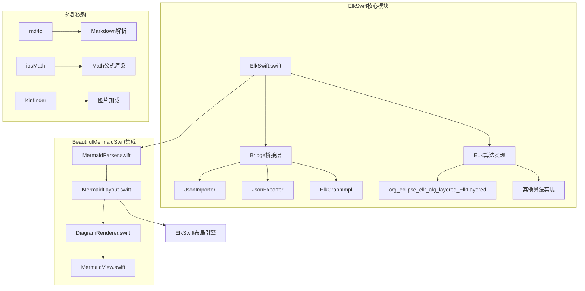
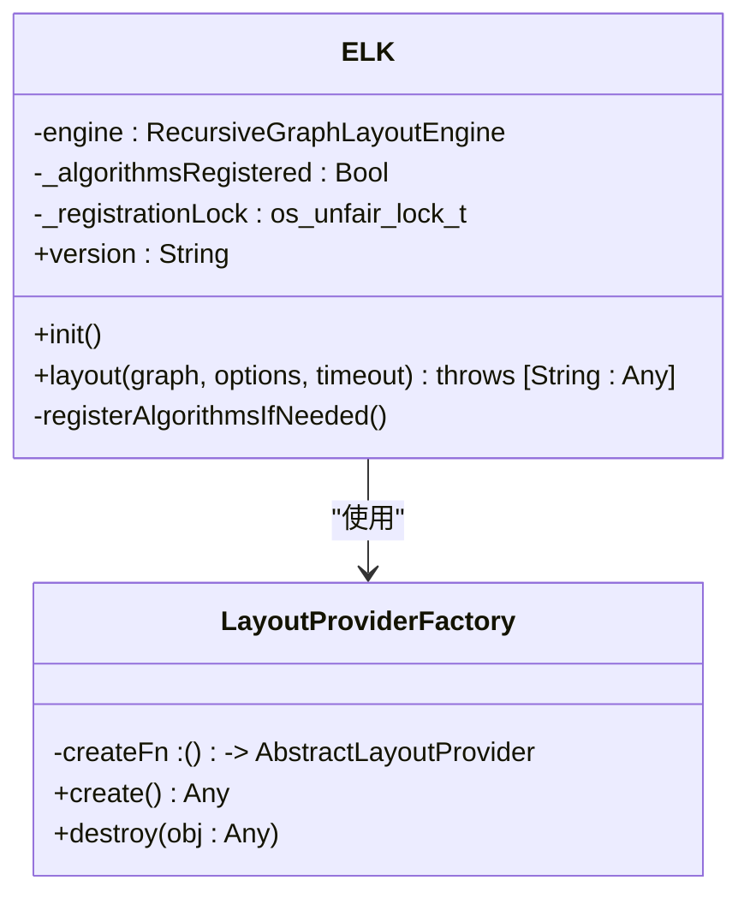
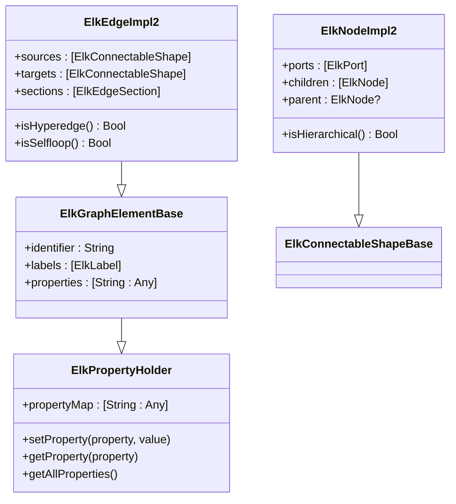
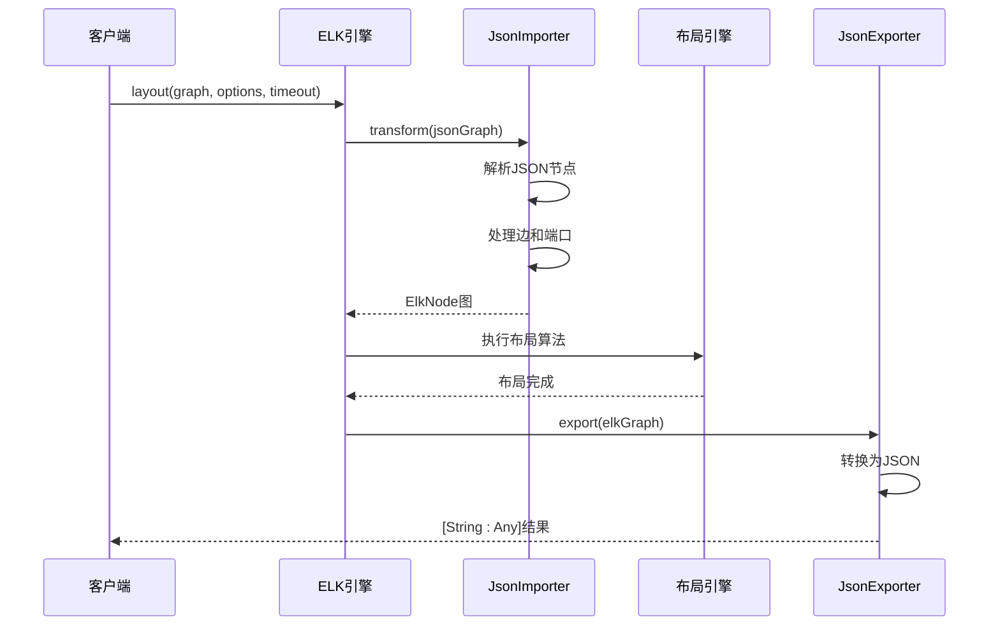
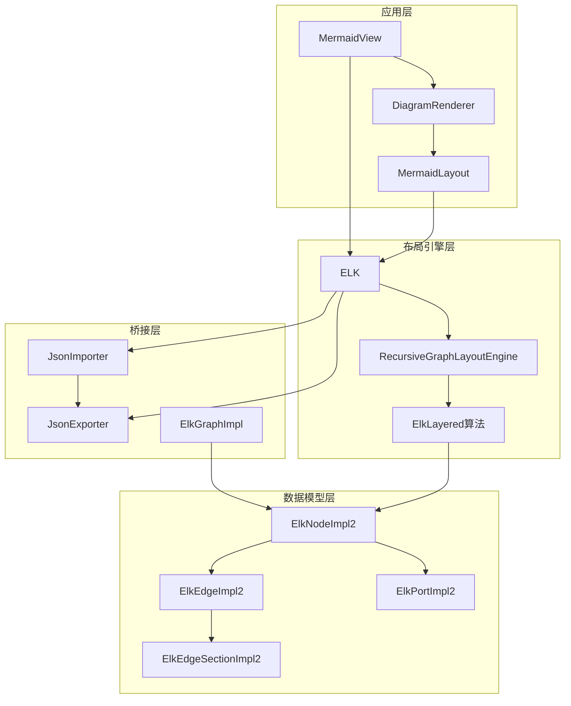
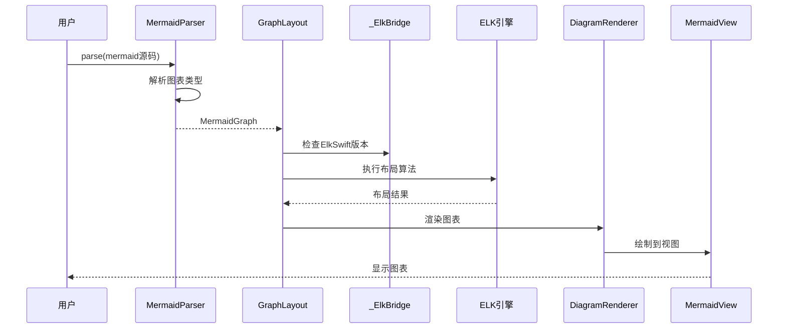
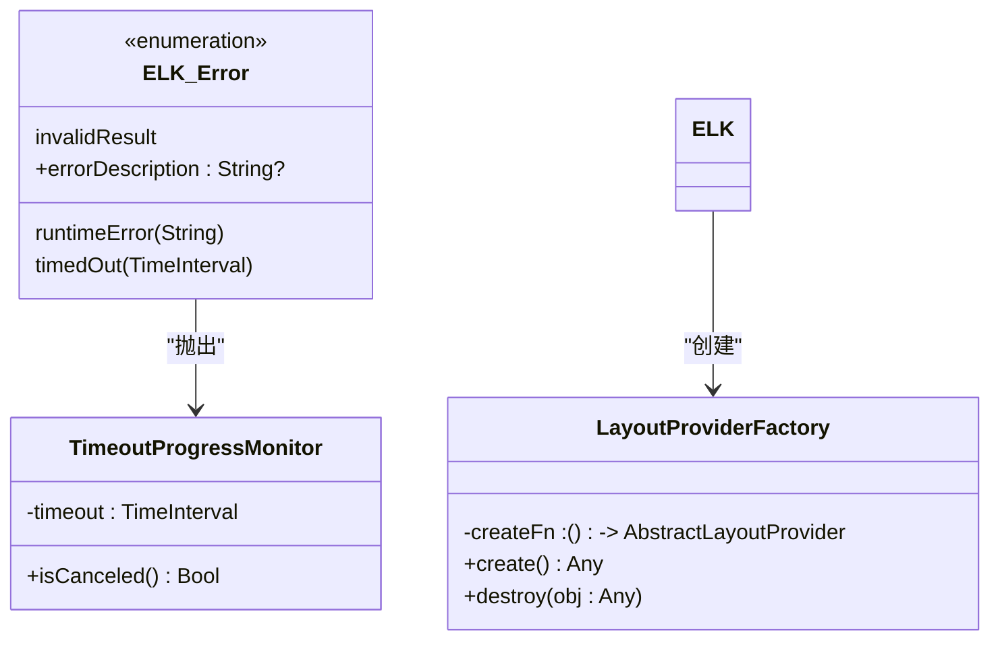
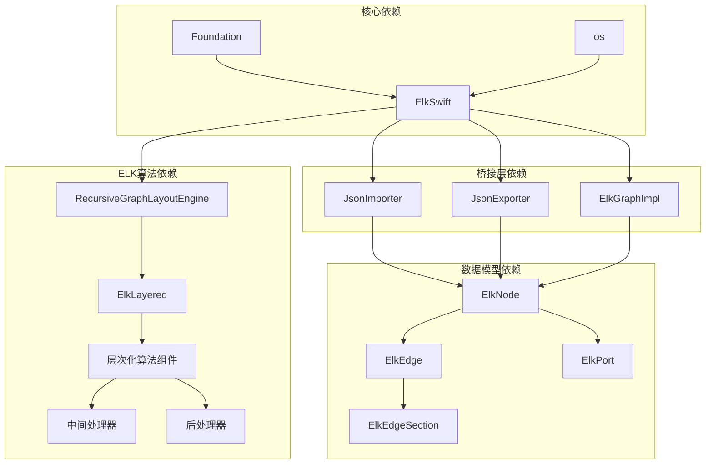

# ElkSwift布局引擎

<cite>
**本文档引用的文件**
- [ElkSwift.swift](file://ElkSwift/ElkSwift.swift)
- [ELK.swift](file://ElkSwift/Bridge/ELK.swift)
- [ElkGraphImpl.swift](file://ElkSwift/Bridge/ElkGraphImpl.swift)
- [JsonImporter.swift](file://ElkSwift/Bridge/JsonImporter.swift)
- [JsonExporter.swift](file://ElkSwift/Bridge/JsonExporter.swift)
- [org_eclipse_elk_alg_layered_ElkLayered.swift](file://ElkSwift/ElK/org/eclipse/elk/alg/layered/org_eclipse_elk_alg_layered_ElkLayered.swift)
- [MermaidLayout.swift](file://BeautifulMermaidSwift/MermaidLayout.swift)
- [MermaidParser.swift](file://BeautifulMermaidSwift/MermaidParser.swift)
- [MermaidView.swift](file://BeautifulMermaidSwift/Views/MermaidView.swift)
- [DiagramRenderer.swift](file://BeautifulMermaidSwift/Render/DiagramRenderer.swift)
- [README.md](file://README.md)
</cite>

## 目录
1. [简介](#简介)
2. [项目结构](#项目结构)
3. [核心组件](#核心组件)
4. [架构概览](#架构概览)
5. [详细组件分析](#详细组件分析)
6. [依赖关系分析](#依赖关系分析)
7. [性能考虑](#性能考虑)
8. [故障排除指南](#故障排除指南)
9. [结论](#结论)

## 简介

ElkSwift是Eclipse Layout Kernel (ELK)的纯Swift移植版本，专为iOS平台设计。该项目提供了完整的图布局算法实现，支持多种图表类型（流程图、序列图、类图、实体关系图等），并通过BeautifulMermaidSwift集成到Markdown渲染系统中。

ELK是一个成熟的图布局引擎，最初用Java编写，现在通过Swift桥接层在iOS设备上提供高性能的图形布局能力。该引擎实现了复杂的图论算法，包括层次化布局、节点排序、边交叉最小化等核心功能。

## 项目结构

ElkSwift项目采用模块化设计，主要包含以下核心目录：



**图表来源**
- [ElkSwift.swift:1-4](file://ElkSwift/ElkSwift.swift#L1-L4)
- [README.md:153-202](file://README.md#L153-L202)

**章节来源**
- [README.md:153-202](file://README.md#L153-L202)
- [README.md:242-273](file://README.md#L242-L273)

## 核心组件

### ELK主类

ELK类是整个布局引擎的公共入口点，提供了简洁的API接口：



**图表来源**
- [ELK.swift:7-97](file://ElkSwift/Bridge/ELK.swift#L7-L97)

### 图模型实现

ElkSwift实现了完整的ELK图数据模型，包括节点、边、端口、标签等元素：



**图表来源**
- [ElkGraphImpl.swift:9-239](file://ElkSwift/Bridge/ElkGraphImpl.swift#L9-L239)

### JSON导入导出

JsonImporter和JsonExporter负责将Swift字典与ELK图模型之间的转换：



**图表来源**
- [JsonImporter.swift:16-29](file://ElkSwift/Bridge/JsonImporter.swift#L16-L29)
- [JsonExporter.swift:10-13](file://ElkSwift/Bridge/JsonExporter.swift#L10-L13)

**章节来源**
- [ELK.swift:7-97](file://ElkSwift/Bridge/ELK.swift#L7-L97)
- [ElkGraphImpl.swift:9-239](file://ElkSwift/Bridge/ElkGraphImpl.swift#L9-L239)
- [JsonImporter.swift:1-350](file://ElkSwift/Bridge/JsonImporter.swift#L1-L350)
- [JsonExporter.swift:1-184](file://ElkSwift/Bridge/JsonExporter.swift#L1-L184)

## 架构概览

ElkSwift采用分层架构设计，从底层的图算法实现到上层的应用集成：



**图表来源**
- [MermaidView.swift:9-103](file://BeautifulMermaidSwift/Views/MermaidView.swift#L9-L103)
- [DiagramRenderer.swift:12-50](file://BeautifulMermaidSwift/Render/DiagramRenderer.swift#L12-L50)
- [MermaidLayout.swift:3-74](file://BeautifulMermaidSwift/MermaidLayout.swift#L3-L74)
- [ELK.swift:26-96](file://ElkSwift/Bridge/ELK.swift#L26-L96)

### 层次化布局算法

ElkLayered是ELK的核心算法实现，专门处理层次化图的布局：

```mermaid
flowchart TD
A[输入LGraph] --> B[GraphConfigurator.prepareGraphForLayout]
B --> C[ComponentsProcessor.split]
C --> D{组件数量}
D --> |1个| E[layout]
D --> |多个| F[逐个组件布局]
E --> G[hierarchicalLayout]
F --> G
G --> H[收集所有子图(自底向上)]
H --> I[reviewAndCorrectHierarchicalProcessors]
I --> J[lockstep递归布局]
J --> K[resizeGraph]
K --> L[输出布局结果]
```

**图表来源**
- [org_eclipse_elk_alg_layered_ElkLayered.swift:25-50](file://ElkSwift/ElK/org/eclipse/elk/alg/layered/org_eclipse_elk_alg_layered_ElkLayered.swift#L25-L50)
- [org_eclipse_elk_alg_layered_ElkLayered.swift:76-145](file://ElkSwift/ElK/org/eclipse/elk/alg/layered/org_eclipse_elk_alg_layered_ElkLayered.swift#L76-L145)

**章节来源**
- [org_eclipse_elk_alg_layered_ElkLayered.swift:13-415](file://ElkSwift/ElK/org/eclipse/elk/alg/layered/org_eclipse_elk_alg_layered_ElkLayered.swift#L13-L415)

## 详细组件分析

### Mermaid集成架构

ElkSwift与BeautifulMermaidSwift的集成提供了完整的Mermaid图表渲染解决方案：



**图表来源**
- [MermaidParser.swift:25-52](file://BeautifulMermaidSwift/MermaidParser.swift#L25-L52)
- [MermaidLayout.swift:10-73](file://BeautifulMermaidSwift/MermaidLayout.swift#L10-L73)
- [DiagramRenderer.swift:28-50](file://BeautifulMermaidSwift/Render/DiagramRenderer.swift#L28-L50)

### 图表类型支持

ElkSwift支持多种Mermaid图表类型的布局：

| 图表类型 | 支持状态 | 特殊处理 |
|---------|---------|---------|
| Flowchart | ✅ 完全支持 | 层次化布局算法 |
| State Diagram | ✅ 完全支持 | 状态转换边处理 |
| Class Diagram | ✅ 完全支持 | 类关系和继承 |
| ER Diagram | ✅ 完全支持 | 实体关系建模 |
| Sequence Diagram | ✅ 完全支持 | 生命线和激活框 |
| XY Chart | ✅ 完全支持 | 数据点坐标 |

**章节来源**
- [MermaidLayout.swift:12-72](file://BeautifulMermaidSwift/MermaidLayout.swift#L12-L72)
- [MermaidParser.swift:31-51](file://BeautifulMermaidSwift/MermaidParser.swift#L31-L51)

### 错误处理机制

ELK引擎提供了完善的错误处理机制：



**图表来源**
- [ELK.swift:9-24](file://ElkSwift/Bridge/ELK.swift#L9-L24)
- [ELK.swift:87-91](file://ElkSwift/Bridge/ELK.swift#L87-L91)

**章节来源**
- [ELK.swift:9-24](file://ElkSwift/Bridge/ELK.swift#L9-L24)
- [ELK.swift:87-96](file://ElkSwift/Bridge/ELK.swift#L87-L96)

## 依赖关系分析

ElkSwift项目具有清晰的依赖层次结构：



**图表来源**
- [ElkSwift.swift:1-4](file://ElkSwift/ElkSwift.swift#L1-L4)
- [ELK.swift:4-5](file://ElkSwift/Bridge/ELK.swift#L4-L5)
- [JsonImporter.swift:6-14](file://ElkSwift/Bridge/JsonImporter.swift#L6-L14)

### 性能特性

ElkSwift在性能方面采用了多项优化策略：

1. **内存管理优化**：使用弱引用避免循环引用
2. **算法复杂度控制**：层次化算法的时间复杂度为O(n²)
3. **并发安全**：算法注册使用互斥锁保护
4. **延迟计算**：边和端口的解析采用延迟模式

**章节来源**
- [ElkGraphImpl.swift:114-117](file://ElkSwift/Bridge/ElkGraphImpl.swift#L114-L117)
- [ELK.swift:29-34](file://ElkSwift/Bridge/ELK.swift#L29-L34)

## 性能考虑

### 时间复杂度分析

- **层次化布局**：O(n²)，其中n是节点数量
- **边交叉最小化**：O(n log n)
- **节点放置**：O(n)
- **整体布局**：O(n²)至O(n³)，取决于图的复杂性

### 内存使用优化

1. **对象池**：复用布局处理器实例
2. **弱引用**：父节点使用弱引用避免内存泄漏
3. **延迟初始化**：仅在需要时创建布局选项
4. **增量更新**：支持部分图的重新布局

## 故障排除指南

### 常见问题及解决方案

| 问题类型 | 症状 | 可能原因 | 解决方案 |
|---------|------|---------|---------|
| 布局超时 | 抛出timedOut错误 | 图过大或算法复杂度过高 | 增加timeout参数或简化图表 |
| 无效结果 | 返回空布局 | 图结构不完整或格式错误 | 验证JSON输入格式 |
| 内存泄漏 | 内存使用持续增长 | 强引用循环 | 检查父引用设置 |
| 性能问题 | 布局响应缓慢 | 图节点过多 | 分批处理或降级算法 |

### 调试技巧

1. **启用进度监控**：使用BasicProgressMonitor跟踪布局进度
2. **检查图结构**：验证节点、边和端口的完整性
3. **分析算法选择**：确认选择了合适的布局算法
4. **监控内存使用**：定期检查内存分配情况

**章节来源**
- [ELK.swift:9-24](file://ElkSwift/Bridge/ELK.swift#L9-L24)
- [JsonImporter.swift:16-29](file://ElkSwift/Bridge/JsonImporter.swift#L16-L29)

## 结论

ElkSwift布局引擎为iOS平台提供了强大而灵活的图布局能力。通过纯Swift实现，它保持了与原生iOS开发环境的无缝集成，同时继承了ELK引擎的成熟算法和稳定性。

该引擎的主要优势包括：

1. **完整的算法实现**：支持多种图布局算法
2. **良好的性能表现**：针对iOS平台优化
3. **易于使用的API**：简洁的公共接口
4. **完善的错误处理**：全面的异常处理机制
5. **可扩展性**：支持自定义布局算法和选项

对于需要在iOS应用中集成图表布局功能的开发者来说，ElkSwift是一个可靠的选择，特别是在需要与BeautifulMermaidSwift等渲染库配合使用时。