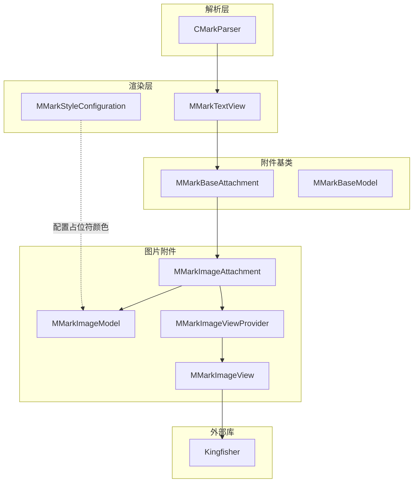
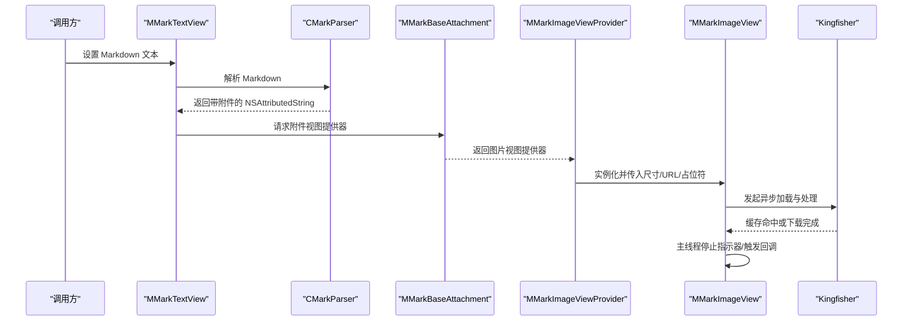
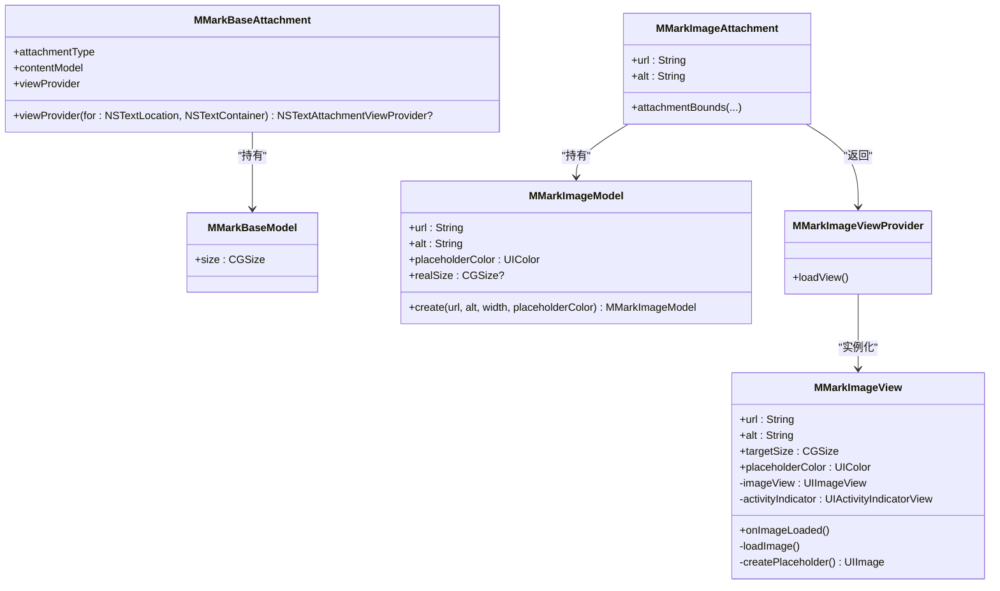
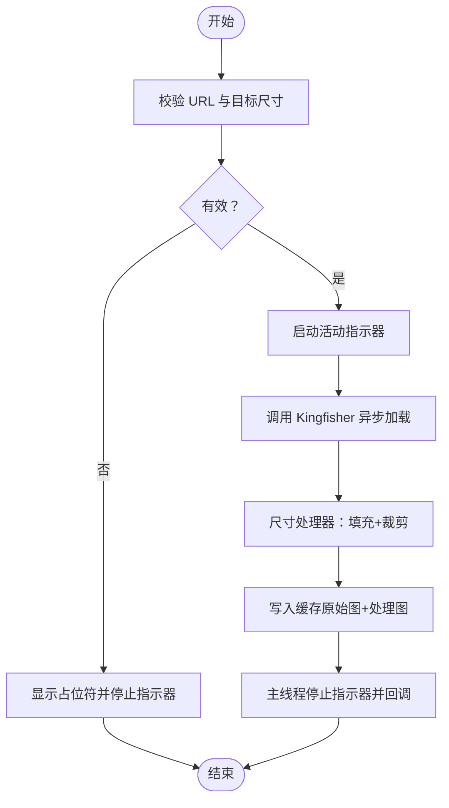

# 图片加载与缓存

<cite>
**本文引用的文件**
- [MMarkImageAttachment.swift](file://MMarkParser/Sources/Renderer/Attachments/MMarkImageAttachment/MMarkImageAttachment.swift)
- [MMarkImageModel.swift](file://MMarkParser/Sources/Renderer/Attachments/MMarkImageAttachment/MMarkImageModel.swift)
- [MMarkImageView.swift](file://MMarkParser/Sources/Renderer/Attachments/MMarkImageAttachment/MMarkImageView.swift)
- [MMarkImageViewProvider.swift](file://MMarkParser/Sources/Renderer/Attachments/MMarkImageAttachment/MMarkImageViewProvider.swift)
- [MMarkBaseAttachment.swift](file://MMarkParser/Sources/Renderer/Attachments/MMarkBaseAttachment/MMarkBaseAttachment.swift)
- [MMarkBaseModel.swift](file://MMarkParser/Sources/Renderer/Attachments/MMarkBaseAttachment/MMarkBaseModel.swift)
- [CMarkParser.swift](file://MMarkParser/Sources/Parser/CMarkParser.swift)
- [MMarkTextView.swift](file://MMarkParser/Sources/Renderer/MMarkTextView.swift)
- [MMarkStyleConfiguration.swift](file://MMarkParser/Sources/Renderer/MMarkStyleConfiguration.swift)
- [README.md](file://README.md)
- [Podfile](file://cocoapod_demo/Podfile)
</cite>

## 目录
1. [简介](#简介)
2. [项目结构](#项目结构)
3. [核心组件](#核心组件)
4. [架构总览](#架构总览)
5. [组件详解](#组件详解)
6. [依赖关系分析](#依赖关系分析)
7. [性能考量](#性能考量)
8. [故障排查指南](#故障排查指南)
9. [结论](#结论)
10. [附录](#附录)

## 简介
本章节面向需要理解 MMarkParser 中“图片加载与缓存”能力的开发者与产品人员，系统性阐述远程图片的加载机制、Kingfisher 集成方式、缓存策略与过期时间、内存管理、异步加载流程与占位符显示、尺寸适配与格式处理、配置项与可扩展点，以及与附件系统的集成与渲染性能优化建议。

## 项目结构
围绕图片渲染的关键模块位于 Renderer/Attachments/MMarkImageAttachment 下，配合 Renderer 层的样式配置与视图容器，形成从解析到显示的完整链路。

图表来源
- [MMarkTextView.swift:30-49](file://MMarkParser/Sources/Renderer/MMarkTextView.swift#L30-L49)
- [MMarkBaseAttachment.swift:32-58](file://MMarkParser/Sources/Renderer/Attachments/MMarkBaseAttachment/MMarkBaseAttachment.swift#L32-L58)
- [MMarkImageAttachment.swift:17-21](file://MMarkParser/Sources/Renderer/Attachments/MMarkImageAttachment/MMarkImageAttachment.swift#L17-L21)
- [MMarkImageViewProvider.swift:12-31](file://MMarkParser/Sources/Renderer/Attachments/MMarkImageAttachment/MMarkImageViewProvider.swift#L12-L31)
- [MMarkImageView.swift:69-100](file://MMarkParser/Sources/Renderer/Attachments/MMarkImageAttachment/MMarkImageView.swift#L69-L100)
- [MMarkStyleConfiguration.swift:224](file://MMarkParser/Sources/Renderer/MMarkStyleConfiguration.swift#L224)

章节来源
- [README.md:108-156](file://README.md#L108-L156)
- [README.md:158-180](file://README.md#L158-L180)

## 核心组件
- MMarkImageModel：承载图片 URL、替代文本、占位符颜色与目标尺寸；提供基于容器宽度的工厂方法以保证 4:3 宽高比。
- MMarkImageAttachment：将模型注入到 NSTextAttachment，负责计算附件可视矩形大小。
- MMarkImageView：实际的 UIView，内部持有 UIImageView 与活动指示器，负责占位符绘制、异步加载、尺寸裁剪与过渡动画。
- MMarkImageViewProvider：NSTextAttachmentViewProvider 的实现，负责实例化 MMarkImageView 并绑定生命周期回调。
- MMarkBaseAttachment/Model：所有附件的基类，统一通过 viewProvider 分发到具体类型。
- MMarkStyleConfiguration：提供 imagePlaceholderColor 等样式配置入口。
- CMarkParser/MMarkTextView：解析 Markdown 并驱动 TextKit 2 布局，最终由附件视图提供器创建图片视图。

章节来源
- [MMarkImageModel.swift:13-25](file://MMarkParser/Sources/Renderer/Attachments/MMarkImageAttachment/MMarkImageModel.swift#L13-L25)
- [MMarkImageAttachment.swift:17-21](file://MMarkParser/Sources/Renderer/Attachments/MMarkImageAttachment/MMarkImageAttachment.swift#L17-L21)
- [MMarkImageView.swift:29-37](file://MMarkParser/Sources/Renderer/Attachments/MMarkImageAttachment/MMarkImageView.swift#L29-L37)
- [MMarkImageViewProvider.swift:12-31](file://MMarkParser/Sources/Renderer/Attachments/MMarkImageAttachment/MMarkImageViewProvider.swift#L12-L31)
- [MMarkBaseAttachment.swift:32-58](file://MMarkParser/Sources/Renderer/Attachments/MMarkBaseAttachment/MMarkBaseAttachment.swift#L32-L58)
- [MMarkStyleConfiguration.swift:224](file://MMarkParser/Sources/Renderer/MMarkStyleConfiguration.swift#L224)
- [CMarkParser.swift:56-66](file://MMarkParser/Sources/Parser/CMarkParser.swift#L56-L66)
- [MMarkTextView.swift:30-49](file://MMarkParser/Sources/Renderer/MMarkTextView.swift#L30-L49)

## 架构总览
图片渲染从 Markdown 解析开始，经由属性字符串中的附件节点，交由对应的附件视图提供器创建视图，最终由 MMarkImageView 使用 Kingfisher 进行远程图片下载、解码、尺寸处理与缓存，同时在主线程更新 UI 并触发必要的布局失效。

图表来源
- [MMarkTextView.swift:30-49](file://MMarkParser/Sources/Renderer/MMarkTextView.swift#L30-L49)
- [CMarkParser.swift:56-66](file://MMarkParser/Sources/Parser/CMarkParser.swift#L56-L66)
- [MMarkBaseAttachment.swift:32-58](file://MMarkParser/Sources/Renderer/Attachments/MMarkBaseAttachment/MMarkBaseAttachment.swift#L32-L58)
- [MMarkImageViewProvider.swift:12-31](file://MMarkParser/Sources/Renderer/Attachments/MMarkImageAttachment/MMarkImageViewProvider.swift#L12-L31)
- [MMarkImageView.swift:69-100](file://MMarkParser/Sources/Renderer/Attachments/MMarkImageAttachment/MMarkImageView.swift#L69-L100)

## 组件详解

### 远程图片加载机制与 URL 验证
- URL 验证：在发起加载前，对传入的 URL 字符串进行 URL 初始化校验，若无效则直接显示占位符并停止指示器。
- 网络请求：通过 Kingfisher 的 setImage 接口发起下载，底层由其管理网络栈与缓存。
- 错误处理策略：未显式设置失败回调，采用默认行为（通常会回退到占位符）。如需更细粒度控制，可在扩展中增加错误回调与重试逻辑。

章节来源
- [MMarkImageView.swift:69-74](file://MMarkParser/Sources/Renderer/Attachments/MMarkImageAttachment/MMarkImageView.swift#L69-L74)
- [MMarkImageView.swift:83-99](file://MMarkParser/Sources/Renderer/Attachments/MMarkImageAttachment/MMarkImageView.swift#L83-L99)

### Kingfisher 集成与缓存策略
- 尺寸处理器：先按目标尺寸进行 aspectFill 填充，再裁剪到精确尺寸，确保 4:3 比例且不拉伸。
- 缩放因子：使用设备 scale，保证高清屏清晰显示。
- 缓存策略：开启缓存原始图像，提升二次打开速度。
- 过渡动画：启用淡入过渡，改善加载体验。
- 可扩展点：可通过自定义 Processor 或 Options 进一步调整缓存键、过期策略、内存/磁盘容量等（见“自定义加载器”）。

章节来源
- [MMarkImageView.swift:80-90](file://MMarkParser/Sources/Renderer/Attachments/MMarkImageAttachment/MMarkImageView.swift#L80-L90)

### 异步加载流程与占位符显示
- 占位符生成：在视图初始化阶段即创建，尺寸固定，颜色可配置。
- 加载状态：开始加载时显示活动指示器，完成后停止并触发 onImageLoaded 回调。
- 布局联动：onImageLoaded 回调用于通知上层触发 TextKit 2 重新布局（当前注释掉，避免频繁无效刷新）。

章节来源
- [MMarkImageView.swift:43-67](file://MMarkParser/Sources/Renderer/Attachments/MMarkImageAttachment/MMarkImageView.swift#L43-L67)
- [MMarkImageView.swift:102-127](file://MMarkParser/Sources/Renderer/Attachments/MMarkImageAttachment/MMarkImageView.swift#L102-L127)
- [MMarkImageView.swift:92-98](file://MMarkParser/Sources/Renderer/Attachments/MMarkImageAttachment/MMarkImageView.swift#L92-L98)
- [MMarkImageViewProvider.swift:18-28](file://MMarkParser/Sources/Renderer/Attachments/MMarkImageAttachment/MMarkImageViewProvider.swift#L18-L28)

### 图片尺寸适配、压缩与格式转换
- 尺寸适配：以目标尺寸为基准，先填充后裁剪，保证显示区域一致。
- 压缩与格式：由 Kingfisher 在解码与缓存过程中自动处理，支持 PNG/JPEG/GIF 等常见格式。
- 高清适配：通过 scale 因子匹配屏幕像素密度。

章节来源
- [MMarkImageView.swift:80-89](file://MMarkParser/Sources/Renderer/Attachments/MMarkImageAttachment/MMarkImageView.swift#L80-L89)

### 配置选项与样式定制
- 占位符颜色：通过 MMarkStyleConfiguration.imagePlaceholderColor 全局配置，影响所有图片占位符。
- 图片尺寸：MMarkImageModel.create 提供按容器宽度推导高度的便捷工厂方法，默认 4:3 比例。
- 自定义尺寸：可直接传入 size，覆盖默认比例。

章节来源
- [MMarkStyleConfiguration.swift:224](file://MMarkParser/Sources/Renderer/MMarkStyleConfiguration.swift#L224)
- [MMarkImageModel.swift:21-25](file://MMarkParser/Sources/Renderer/Attachments/MMarkImageAttachment/MMarkImageModel.swift#L21-L25)

### 附件系统集成与渲染性能优化
- 附件分发：MMarkBaseAttachment 根据类型返回对应视图提供器，确保图片附件由 MMarkImageViewProvider 创建。
- 视图边界跟踪：开启 tracksTextAttachmentViewBounds，有助于 TextKit 2 正确测量与布局。
- 布局触发：onImageLoaded 回调可用于触发局部布局失效，但应谨慎使用以避免过度刷新（当前示例中已注释）。

章节来源
- [MMarkBaseAttachment.swift:32-58](file://MMarkParser/Sources/Renderer/Attachments/MMarkBaseAttachment/MMarkBaseAttachment.swift#L32-L58)
- [MMarkImageViewProvider.swift:29-31](file://MMarkParser/Sources/Renderer/Attachments/MMarkImageAttachment/MMarkImageViewProvider.swift#L29-L31)

### 自定义加载器与扩展建议
- 自定义 Processor：可组合 ResizingImageProcessor 与 CroppingImageProcessor，实现不同比例与裁剪策略。
- 自定义 Options：可加入缓存键策略、过期时间、内存/磁盘容量上限、失败重试次数等（需结合 Kingfisher 的 Options 体系）。
- 错误与重试：在 completionHandler 中判断结果，必要时触发本地重试或降级策略（例如切换备用域名、降分辨率）。
- 内存管理：合理设置缓存容量与过期策略，避免大图导致峰值内存过高；对长列表场景建议延迟加载与回收。

章节来源
- [MMarkImageView.swift:80-90](file://MMarkParser/Sources/Renderer/Attachments/MMarkImageAttachment/MMarkImageView.swift#L80-L90)

## 依赖关系分析

图表来源
- [MMarkBaseModel.swift:3-9](file://MMarkParser/Sources/Renderer/Attachments/MMarkBaseAttachment/MMarkBaseModel.swift#L3-L9)
- [MMarkBaseAttachment.swift:12-26](file://MMarkParser/Sources/Renderer/Attachments/MMarkBaseAttachment/MMarkBaseAttachment.swift#L12-L26)
- [MMarkImageModel.swift:6-18](file://MMarkParser/Sources/Renderer/Attachments/MMarkImageAttachment/MMarkImageModel.swift#L6-L18)
- [MMarkImageAttachment.swift:5-12](file://MMarkParser/Sources/Renderer/Attachments/MMarkImageAttachment/MMarkImageAttachment.swift#L5-L12)
- [MMarkImageViewProvider.swift:6-31](file://MMarkParser/Sources/Renderer/Attachments/MMarkImageAttachment/MMarkImageViewProvider.swift#L6-L31)
- [MMarkImageView.swift:7-41](file://MMarkParser/Sources/Renderer/Attachments/MMarkImageAttachment/MMarkImageView.swift#L7-L41)

## 性能考量
- 异步加载与主线程更新：图片加载在后台完成，UI 更新在主线程，避免阻塞。
- 占位符与过渡：占位符减少白屏时间，淡入过渡提升感知质量。
- 尺寸预设与裁剪：提前设定目标尺寸，减少重复解码与布局抖动。
- 缓存策略：缓存原始图与处理后图，降低重复请求与 CPU 开销。
- 建议：对长列表或瀑布流，考虑懒加载、可见区域外回收、并发数限制与失败重试；对超大图可引入分块加载或低分辨率占位。

## 故障排查指南
- 图片不显示
  - 检查 URL 是否有效；无效时将回退到占位符。
  - 确认目标尺寸是否大于零；否则无法触发加载。
- 加载缓慢或卡顿
  - 检查是否在主线程执行耗时操作；确认仅在主线程更新 UI。
  - 调整缓存策略与内存上限，避免频繁磁盘 IO。
- 比例变形或模糊
  - 确认目标尺寸与 4:3 比例一致；检查裁剪与缩放参数。
- 布局错乱
  - 若启用 onImageLoaded 触发布局，注意避免过度刷新；必要时改为批量失效。

章节来源
- [MMarkImageView.swift:69-74](file://MMarkParser/Sources/Renderer/Attachments/MMarkImageAttachment/MMarkImageView.swift#L69-L74)
- [MMarkImageView.swift:92-98](file://MMarkParser/Sources/Renderer/Attachments/MMarkImageAttachment/MMarkImageView.swift#L92-L98)

## 结论
MMarkParser 的图片加载以 TextKit 2 附件为核心，结合 Kingfisher 实现了高效、可配置的远程图片渲染。通过占位符、尺寸裁剪与缓存策略，兼顾了用户体验与性能。在实际工程中，建议根据业务场景进一步细化缓存键、过期策略与重试机制，并在长列表等场景中加强内存与并发控制。

## 附录

### 关键流程图：图片加载与缓存

图表来源
- [MMarkImageView.swift:69-100](file://MMarkParser/Sources/Renderer/Attachments/MMarkImageAttachment/MMarkImageView.swift#L69-L100)

### 依赖与版本
- 依赖库：Kingfisher 作为远程图片加载与缓存核心。
- 版本约束：iOS 15+，Swift 5.7+。

章节来源
- [Podfile:9](file://cocoapod_demo/Podfile#L9)
- [README.md:24-26](file://README.md#L24-L26)